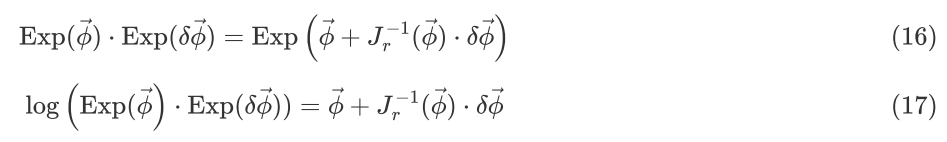

# ◻、陀螺仪和加速度计基础

参考：IMU原理介绍及误差分析，https://zhuanlan.zhihu.com/p/544296512

## 0、惯性系统配置模式

通常而言，惯性系统有两种配置模式： 平台系统(Stable Platform System)和捷联系统(Strapdown System)。这两种配置模式最大的区别就是陀螺仪和加速度计的参考系不同。

## 1、陀螺仪

|                                                     | 原理                                          |      |
| --------------------------------------------------- | --------------------------------------------- | ---- |
| 微机电陀螺（MEMS，Micro-Electro-Mechanical System） | 科里奥利效应                                  |      |
| 机械陀螺（Mechanical）                              | 角动量守恒(convservation of angular momentum) |      |
| 光纤陀螺 (Optical)                                  | 萨格纳克效应(Sagnac Effect)                   |      |

## 2、加速度计

|                | 原理 |      |
| -------------- | ---- | ---- |
| 微机电（MEMS） |      |      |
| 机械式         |      |      |
| 固态           |      |      |

## 3、MEMS-IMU误差分析


# 一、IMU预积分

### 一、IMU简介

**IMU的特点**

| 传感器类型 | 优点               | 缺点                   |
| ---------- | ------------------ | ---------------------- |
| 轮速       | 精度高一些         | 二维数据               |
| GPS        | 直接输出绝对位置   | 精度差                 |
| IMU        | 频率高、短时精度好 | 无绝对信息，累积误差大 |

轮速适合与地面的小车搭配，与二维激光传感器搭配，IMU是最适合与视觉互补的。

**IMU内参**

| 参数     | 说明                       |
| -------- | -------------------------- |
| 噪声     | 所有传感器都有             |
| 随机游走 | 由于环境导致IMU数据有偏置  |
| scale    | 实际数值和输出值之间的比值 |

内参标定方法：把IMU静置平放两个小时以上（2-6个小时），就可以得到内参。因为噪声是随机的，假设服从高斯分布，标定得到的是方差。

> 内参标定工具：https://github.com/rpng/kalibr_allan
>
> 外参标定工具：https://github.com/ethz-asl/kalibr

IMU会受气压、温度等影响，所以上万的IMU都会搭配气压计和温度计。

IMU内参一般有四个数：__陀螺仪的噪声，加速度计的噪声，陀螺仪的随机游走，加速度计的随机游走__。噪声好理解，但是随机游走是因为IMU过于灵敏，这个偏置不同时刻也不同，无法建模，但可以通过某种手段进行预测。

```yaml
@Euroc.yaml
# Transformation from camera to body-frame (imu)
# 因为一般有IMU的系统，会把IMU坐标系作为body-frame（本体）
Tbc: !!opencv-matrix
   rows: 4
   cols: 4
   dt: f
   data: [0.0148655429818, -0.999880929698, 0.00414029679422, -0.0216401454975,
         0.999557249008, 0.0149672133247, 0.025715529948, -0.064676986768,
        -0.0257744366974, 0.00375618835797, 0.999660727178, 0.00981073058949,
         0.0, 0.0, 0.0, 1.0]

# IMU noise
IMU.NoiseGyro: 1.7e-4 #1.6968e-04 
IMU.NoiseAcc: 2.0000e-3 #2.0e-3
IMU.GyroWalk: 1.9393e-05 
IMU.AccWalk: 3.0000e-03 # 3e-03
IMU.Frequency: 200
```


```C++
@ ORB3/Tracking.cc
const float sf = sqrt(freq);
cout << endl;
cout << "IMU frequency: " << freq << " Hz" << endl;
cout << "IMU gyro noise: " << Ng << " rad/s/sqrt(Hz)" << endl;
cout << "IMU gyro walk: " << Ngw << " rad/s^2/sqrt(Hz)" << endl;
cout << "IMU accelerometer noise: " << Na << " m/s^2/sqrt(Hz)" << endl;
cout << "IMU accelerometer walk: " << Naw << " m/s^3/sqrt(Hz)" << endl;

// 噪声从连续到离散差了一个sqrt(freq)   而随机游走从连续到离散差了一个 1/sqrt(freq)
mpImuCalib = new IMU::Calib(Tbc,Ng*sf,Na*sf,Ngw/sf,Naw/sf);
```


### 二、IMU预积分推导

#### 1. 推导前公式

式1.1 向量的反对称矩阵
$$
\bf{w}^{\wedge}=\begin{bmatrix}
w_1 \\
 w_2\\
 w_3
\end{bmatrix}
=\begin{bmatrix}
0 & -w_3 & w_2\\
w_3 & 0	&	-w_1\\
-w_2	&w_1	&0\\
\end{bmatrix}\\
\label{向量的反对称矩阵}
$$

```c++
/** 
 * @brief 计算反对称矩阵
 * @param v 3维向量
 * @return 反对称矩阵
 */
cv::Mat Skew(const cv::Mat &v)
{
    const float x = v.at<float>(0);
    const float y = v.at<float>(1);
    const float z = v.at<float>(2);
    return (cv::Mat_<float>(3,3) << 0, -z, y,
            z, 0, -x,
            -y,  x, 0);
}
```

式1.2
$$
\bf{a}^{\wedge}\cdot \bf{b}=-\bf{b}^{\wedge}\cdot \bf{a}
\label{1.2}
$$
李代数到旋转矩阵

式1.3 当$\vec{\phi}$是小量时
$$
Exp(\vec{\phi})=exp(\vec{\phi}^{\wedge})\approx I+\vec{\phi}^{\wedge}
\label{1.3}
$$

> 注意：当输入是$\vec{\phi}$时，用Exp()，当输入是$\vec{\phi}^{\wedge}$时，用exp()。

```C++
//在ORB3中，当\phi的模小于0.0001的时候就认为是小量。
const float eps = 1e-4;
/** 
 * @brief 计算SO3
 * @param xyz 李代数
 * @return SO3
 */
cv::Mat ExpSO3(const float &x, const float &y, const float &z)
{
    cv::Mat I = cv::Mat::eye(3,3,CV_32F);
    const float d2 = x*x+y*y+z*z;
    const float d = sqrt(d2);
    cv::Mat W = (cv::Mat_<float>(3,3) << 0, -z, y,
                 z, 0, -x,
                 -y,  x, 0);
    if(d<eps)
        return (I + W + 0.5f*W*W);  //当\phi是小量时
    else
        return (I + W*sin(d)/d + W*W*(1.0f-cos(d))/d2); //当\phi不是小量时
}

/** 
 * @brief 计算so3
 * @param R SO3
 * @return so3
 */
cv::Mat LogSO3(const cv::Mat &R)
{
    const float tr = R.at<float>(0,0)+R.at<float>(1,1)+R.at<float>(2,2);
    cv::Mat w = (cv::Mat_<float>(3,1) <<(R.at<float>(2,1)-R.at<float>(1,2))/2,
                                        (R.at<float>(0,2)-R.at<float>(2,0))/2,
                                        (R.at<float>(1,0)-R.at<float>(0,1))/2);
    const float costheta = (tr-1.0f)*0.5f;
    if(costheta>1 || costheta<-1)
        return w;
    const float theta = acos(costheta);
    const float s = sin(theta);
    if(fabs(s)<eps)
        return w;
    else
        return theta*w/s;
}
```

式1.4,1.5当$\delta\vec{\phi}$是小量时
$$
Exp(\vec{\phi}+\delta\vec{\phi})\approx Exp(\vec{\phi})\cdot Exp(J_r(\vec{\phi})\cdot \delta\vec{\phi})\\
Exp(\vec{\phi})\cdot Exp(\delta\vec{\phi})=Exp(\vec{\phi}+J_r^{-1}(\vec{\phi})\cdot \delta\vec{\phi})
\label{1.4}
$$

> 其中$J_r^{-1}$并不表示逆，只是标识

式1.6，1.7其中
$$
J_r(\vec{\phi})=I-\frac{1-cos(\left\| \vec{\phi}\right\|)}{\left\|\vec{\phi}\right\|^2}\vec{\phi}^{\wedge}+
\left(\frac{\left\|\vec{\phi}\right\|-sin(\left\| \vec{\phi}\right\|)}{\left\|\vec{\phi}\right\|^3}\right)(\vec{\phi}^{\wedge})^2
\\J_r^{-1}(\vec{\phi})=I+\frac{1}{2}\vec{\phi}^{\wedge}+
\left(\frac{1}{\left\|\vec{\phi}\right\|^2}-
\frac{1+cos(\left\|\vec{\phi}\right\|)}{2\cdot\left\|\vec{\phi}\right\|\cdot sin \left(\left\|\vec{\phi}\right\|\right)}
\right)
(\vec{\phi}^{\wedge})^2

\label{1.6}
$$
式1.8,1.9 当$\vec{\phi}$是小量时
$$
J_r(\vec{\phi}) \approx I\\
J_r^{-1}(\vec{\phi})\approx I

\label{1.8}
$$

```C++
/** 
 * @brief 计算右雅可比
 * @param xyz 李代数
 * @return Jr
 */
cv::Mat RightJacobianSO3(const float &x, const float &y, const float &z)
{
    cv::Mat I = cv::Mat::eye(3,3,CV_32F);
    const float d2 = x*x+y*y+z*z;
    const float d = sqrt(d2);
    cv::Mat W = (cv::Mat_<float>(3,3) << 0, -z, y,
                 z, 0, -x,
                 -y,  x, 0);
    if(d<eps)
    {
        return cv::Mat::eye(3,3,CV_32F);
    }
    else
    {
        return I - W*(1.0f-cos(d))/d2 + W*W*(d-sin(d))/(d2*d);
    }
}
/** 
 * @brief 计算右雅可比的逆
 * @param xyz so3
 * @return Jr^-1
 */
cv::Mat InverseRightJacobianSO3(const float &x, const float &y, const float &z)
{
    cv::Mat I = cv::Mat::eye(3,3,CV_32F);
    const float d2 = x*x+y*y+z*z;
    const float d = sqrt(d2);
    cv::Mat W = (cv::Mat_<float>(3,3) << 0, -z, y,
                 z, 0, -x,
                 -y,  x, 0);
    if(d<eps)
    {
        return cv::Mat::eye(3,3,CV_32F);
    }
    else
    {
        return I + W/2 + W*W*(1.0f/d2 - (1.0f+cos(d))/(2.0f*d*sin(d)));
    }
}

```


式1.10,1.11 
$$
\textbf{R} \cdot Exp(\vec{\phi})\cdot \textbf{R}^T=exp(\textbf{R}\vec{\phi}^{\wedge}\textbf{R}^T)
=Exp(\textbf{R}\vec{\phi})\\
Exp(\vec{\phi})\cdot \textbf{R}=\textbf{R}\cdot Exp(\textbf{R}^T\vec{\phi})

\label{1.10}
$$

#### 2.IMU预积分

首先看下积分

**旋转：**
$$
\textbf{R}_j=\textbf{R}_i\cdot \prod^{j-1}_{k=i}Exp((\widetilde{\boldsymbol{\omega}}_k-\textbf{b}_k^g-\boldsymbol{\eta}_k^{gd})\cdot\Delta t)
$$
$R_j$可以理解为j时刻的相机位姿，从i时刻到j时刻的变换如上式。角速度$\widetilde{\boldsymbol{\omega}}$上波浪表示角速度计的原始读数。k从j-1到i为IMU的角速度$\omega$的积分（每个时刻乘以△t），b表示偏置，$\eta$表示误差，Exp把旋转向量变成旋转矩阵。

**速度：**
$$
\textbf{v}_j=\textbf{v}_i+\textbf{g}\cdot\Delta t_{ij}+ 
\sum_{k=i}^{j-1}\textbf{R}_{wk}\cdot
((\widetilde{\boldsymbol{f}}_k-\textbf{b}_k^g-\boldsymbol{\eta}_k^{gd})\cdot\Delta t
\\
\Delta t_{ij}=\sum_{k=i}^{j-1}\Delta t=(j-i)\Delta t
$$
（高中计算速度公式，v1=v0+g△t），f表示加速度计的原始读数。

*里面乘R的原因是*，我们读数都是IMU坐标系下的，我们要算的是世界坐标系下的。

g表示重力加速度，因为f里面包含了重力，+g△t是为了排除重力。

**位置：**
$$
\textbf{p}_{wj}=\textbf{p}_{wi}+\sum^{j-1}_{k=i}\textbf{v}_k\cdot \Delta t+
\frac{j-i}{2}\textbf{g}\cdot\Delta t^2+
\frac{1}{2}\sum^{j-1}_{k=i}\textbf{R}_{wk}\cdot
(\widetilde{\boldsymbol{f}}_k-\textbf{b}_k^a-\boldsymbol{\eta}_k^{ad})
\cdot\Delta t^2
\\=
\textbf{p}_{wi}+\sum^{j-1}_{k=i}
\left[\textbf{v}_k\cdot \Delta t+
\frac{1}{2}\textbf{g}\cdot\Delta t^2+
\frac{1}{2}\textbf{R}_{wk}\cdot
(\widetilde{\boldsymbol{f}}_k-\textbf{b}_k^a-\boldsymbol{\eta}_k^{ad})
\cdot\Delta t^2
\right]
$$
（高中计算位移公式，x1=x0+v△t+1/2a*t^2）Pj表示第j时刻的位置

由积分引出预积分，预积分里面的每一项与起始状态无关，可以认为都是相对量，这个好处在于计算预积分时**不需要考虑起始状态**，值得注意的是关于速度与位置的**预积分里面都包含了重力**。

预积分计算方式：

1、消除第 i 时刻对积分的影响

2、保留重力的影响

==a 旋转==
$$
\Delta\textbf{R}_{ij} \overset{\underset{\mathrm{\Delta}}{}}{=}
\textbf{R}_{wi}^T\textbf{R}_{wj}
=\prod^{j-1}_{k=i}Exp((\widetilde{\boldsymbol{\omega}}_k-\textbf{b}_k^g-\boldsymbol{\eta}_k^{gd})\cdot\Delta t)
$$

==b 速度==
$$
\begin{align}
\Delta\textbf{v}_{ij} &\overset{\underset{\mathrm{\Delta}}{}}{=}
\textbf{R}_{wi}^T(\textbf{v}_j-\textbf{v}_i-\textbf{g}\cdot\Delta t_{ij})
\\&=
\sum_{k=i}^{j-1}\Delta\textbf{R}_{ik}\cdot
((\widetilde{\boldsymbol{f}}_k-\textbf{b}_k^a-\boldsymbol{\eta}_k^{ad})\cdot\Delta t
\end{align}
$$

再把平衡的重力考虑回来，所以$-\textbf{g}\cdot\Delta t_{ij}$

==c 位置==
$$
\begin{align}
\Delta\textbf{p}_{ij} &\overset{\underset{\mathrm{\Delta}}{}}{=}
\textbf{R}_{i}(\textbf{p}_{j}-\textbf{p}_{i}-\textbf{v}_{i}\Delta t_{ij}-\frac{1}{2}\textbf{g}\cdot \Delta t^2_{ij})\\
&=
\sum^{j-1}_{k=i}
\left[\textbf{v}_{ik}\cdot \Delta t+
\frac{1}{2}\Delta\textbf{R}_{ik}\cdot
(\widetilde{\boldsymbol{f}}_k-\textbf{b}_k^a-\boldsymbol{\eta}_k^{ad})
\cdot\Delta t^2
\right]
\end{align}
$$

关于位置的预积分推到时要注意对于g的处理，其中要利用到等差数列求和的公式，公式如下：
$$
\frac{j-i}{2}-\frac{(j-i)^2}{2}=
-\frac{(j-i)[j-(i+1)]}{2}=
-\sum^{j-1}_{k=i}(k-i)
$$


#### 3.噪声分离

对于VIO来说，优化的状态有15位，3位位置，3位姿态，3位的速度，另外6位是加速度计和陀螺仪的偏置。

**噪声分离的目的：**

预积分公式描述了其模型，但是包含噪声的模型并不能用于计算，怎么处理噪声，通过滤波或优化的方法，会用到__信息矩阵=协方差矩阵的逆__。信息矩阵记录了噪声的权重，因此需要求协方差矩阵，从而求信息矩阵。

具体来说，上面推预积分时对imu的读数会减去它的偏置与误差，其中偏置可以作为状态量去得出，但是误差是没有办法得出的，我们能做的就是拿到imu数据减去偏置后直接使用，通常的办法就是通过计算误差的方式过滤掉这部分误差，无论是优化还是滤波都跳不过一个重要的矩阵——预积分的信息矩阵（协方差矩阵的逆）由于假设了噪声是高斯白噪声，所以噪声的方差对状态方差的影响可以通过高斯分布推理过来。本节我们的目的就是推导出标定好的imu噪声对预积分的影响，也就是预积分的偏差关于噪声的式子，下一节推出协方差方差的关系。

由于假设了噪声为高斯白噪声，也就是服从了高斯分布，因此**预积分噪声同样为高斯分布**，整个过程以推导出预积分噪声的表达式为主，令预积分的测量噪声为：
$$
\boldsymbol{\eta}^{\Delta}_{ij} \overset{\underset{\mathrm{\Delta}}{}}{=}
\left[
\delta \vec{\phi}^{T}_{ij},\delta \textbf{v}^{T}_{ij},\delta \textbf{p}^{T}_{ij}
\right]^T
$$
下面分别对 3 个向量噪声进行推导，推导方式：分离噪声成如下形式，可以理解成：真实值 = 测量值 – 误差。

所以下面推导的思路是把含有误差的项拆解，然后再把误差项整合，推导出旋转、速度、位置关于误差的表示方式。并且假设偏置b在[i，j-1]是不变的，一直是bi。下面就是我们要推导出的形式。
$$
\begin{align}
\Delta\textbf{R}_{ij} &\overset{\underset{\mathrm{\Delta}}{}}{=}
\Delta\widetilde{\textbf{R}}_{ij}\cdot Exp(-\delta \vec{\phi}_{ij})
\\
\Delta\textbf{v}_{ij} &\overset{\underset{\mathrm{\Delta}}{}}{=}
\Delta\widetilde{\textbf{v}}_{ij}-\delta\textbf{v}_{ij}
\\
\Delta\textbf{p}_{ij} &\overset{\underset{\mathrm{\Delta}}{}}{=}
\Delta\widetilde{\textbf{p}}_{ij}-\delta\textbf{p}_{ij}
\end{align}
$$

**_正式推导开始：_**

==a 旋转==
$$
\begin{align}
\Delta\textbf{R}_{ij} 
&=\prod^{j-1}_{k=i}Exp((\widetilde{\boldsymbol{\omega}}_k-\textbf{b}_i^g-\boldsymbol{\eta}_k^{gd})\cdot\Delta t)
\\&=
\prod^{j-1}_{k=i}Exp\left((\widetilde{\boldsymbol{\omega}}_k-\textbf{b}_i^g)\cdot\Delta t-\boldsymbol{\eta}_k^{gd}\cdot\Delta t\right)
\\&=
\prod^{j-1}_{k=i}Exp\left((\widetilde{\boldsymbol{\omega}}_k-\textbf{b}_i^g)\cdot\Delta t\right)
\cdot Exp\left(-\boldsymbol{\eta}_k^{gd}\cdot\Delta t\right)
\\ &\overset{\underset{\mathrm{(1)}}{}}
\approx \prod^{j-1}_{k=i} \left\{ Exp\left((\widetilde{\boldsymbol{\omega}}_k-\textbf{b}_i^g)\cdot\Delta t\right)
\cdot 
Exp\left(-\textbf{J}_r\left((\widetilde{\boldsymbol{\omega}}_k-\textbf{b}_i^g)\cdot\Delta t\right)\boldsymbol{\eta}_k^{gd}\cdot\Delta t\right)
\right\}
\\ &\overset{\underset{\mathrm{(2)}}{}}
=
\Delta\widetilde{\textbf{R}}_{ij}\cdot
\prod^{j-1}_{k=i}Exp(-\Delta\widetilde{\textbf{R}}^T_{k+1j}\cdot
\textbf{J}^k_r\cdot
\boldsymbol{\eta}_k^{gd}\cdot\Delta t)
\end{align}
$$

注意式中假设了这段时间内偏置不变，就是一个数。对于（1）处比较好理解，利用公式$\eqref{1.4}$

对于（2）处比较难理解，而且要用到公式$\eqref{1.10}$

我们先把由（1）得出的结果展开，令:


由上面可得：


由于结果结构比较复杂，所以还需要接着化简。

令：


读作“克西”或“克赛”，利用公式（5）：



以及公式：


有：


最后推出：
$$
\delta\vec{\phi}_{ij} =
\sum^{j-1}_{k=i}
\Delta\widetilde{\textbf{R}}^T_{k+1j}\cdot
\textbf{J}^k_r\cdot
\boldsymbol{\eta}_k^{gd}\cdot\Delta t
$$
可知$\delta\vec{\phi}_{ij}$服从零均值的高斯分布。

==b 速度==

首选要利用角度的式子$\Delta\textbf{R}_{ij} \overset{\underset{\mathrm{\Delta}}{}}{=}
\Delta\widetilde{\textbf{R}}_{ij}\cdot Exp(-\delta \vec{\phi}_{ij})$代入到$\Delta v_{ij}$，即


$\delta$和$\eta$的乘积忽略了，因为$\phi$是小量


==c 位置==

首先利用前面关于角度的式子代入$\Delta p_{ij}$，即：


#### 4.噪声递推公式

上面求出了三个状态量误差的表达式，但由于式子要么是求和，要么是多积导致每次新来一个数据都需要从头计算，这给计算平台来带来资源的浪费，因此这章我们要推出误差的递推形式，即通过$\delta \textbf{p}_{ij-1}$推出$\delta \textbf{p}_{ij}$

==a 旋转==


第二行$R_{jj}$表示j到j的旋转，是不变的，所以是单位矩阵。
第三行中把括号打开，$R_{j-1j}^T=R_{jj-1}$

==b 速度==


==c 位置==


**总结**


到此为止优化时使用的信息矩阵有了！

式（40）是精髓，它定义了**协方差矩阵的更新方式**！上一时刻的协方差矩阵和噪声的协方差矩阵可以得到当前的协方差矩阵。
$$
\Sigma_{ij}=\textbf{A}_{j-1}\Sigma_{ij-1}\textbf{A}^T_{j-1}+
\textbf{B}_{j-1}\Sigma_{\eta}\textbf{B}^T_{j-1}
$$

```C++
/**
 * @brief 预积分计算，更新noise
 * 
 * @param[in] acceleration  加速度计数据
 * @param[in] angVel        陀螺仪数据
 * @param[in] dt            两帧之间时间差
 */
void Preintegrated::IntegrateNewMeasurement(const cv::Point3f &acceleration, const cv::Point3f &angVel, const float &dt)
{
    // 保存imu数据，利用中值积分的结果构造一个预积分类保存在mvMeasurements中
    mvMeasurements.push_back(integrable(acceleration,angVel,dt));

    // Position is updated firstly, as it depends on previously computed velocity and rotation.
    // Velocity is updated secondly, as it depends on previously computed rotation.
    // Rotation is the last to be updated.

    //Matrices to compute covariance
    // Step 1.构造协方差矩阵 参考Forster论文公式（62），邱笑晨的《预积分总结与公式推导》的P12页也有详细推导:η_ij = A * η_i,j-1 + B_j-1 * η_j-1
    // ? 位姿第一个被更新，速度第二（因为这两个只依赖前一帧计算的旋转矩阵和速度），后面再更新旋转角度
    // 噪声矩阵的传递矩阵，这部分用于计算i到j-1历史噪声或者协方差
    cv::Mat A = cv::Mat::eye(9,9,CV_32F);
    // 噪声矩阵的传递矩阵，这部分用于计算j-1新的噪声或协方差，这两个矩阵里面的数都是当前时刻的，计算主要是为了下一时刻使用
    cv::Mat B = cv::Mat::zeros(9,6,CV_32F);
    
    // 考虑偏置后的加速度、角速度
    cv::Mat acc = (cv::Mat_<float>(3,1) << acceleration.x-b.bax,acceleration.y-b.bay, acceleration.z-b.baz);
    cv::Mat accW = (cv::Mat_<float>(3,1) << angVel.x-b.bwx, angVel.y-b.bwy, angVel.z-b.bwz);

    // 记录平均加速度和角速度
    avgA = (dT*avgA + dR*acc*dt)/(dT+dt);
    avgW = (dT*avgW + accW*dt)/(dT+dt);
    
    // Update delta position dP and velocity dV (rely on no-updated delta rotation)
    // 根据没有更新的dR来更新dP与dV  eq.(38)
    dP = dP + dV*dt + 0.5f*dR*acc*dt*dt;	// 对应viorb论文的公式（2）的第三个，位移积分
    dV = dV + dR*acc*dt;					// 对应viorb论文的公式（2）的第二个，速度积分

    // Compute velocity and position parts of matrices A and B (rely on non-updated delta rotation)
    // 根据η_ij = A * η_i,j-1 + B_j-1 * η_j-1中的Ａ矩阵和Ｂ矩阵对速度和位移进行更新
    cv::Mat Wacc = (cv::Mat_<float>(3,3) << 0, -acc.at<float>(2), acc.at<float>(1),
                                                   acc.at<float>(2), 0, -acc.at<float>(0),
                                                   -acc.at<float>(1), acc.at<float>(0), 0);
    A.rowRange(3,6).colRange(0,3) = -dR*dt*Wacc;
    A.rowRange(6,9).colRange(0,3) = -0.5f*dR*dt*dt*Wacc;
    A.rowRange(6,9).colRange(3,6) = cv::Mat::eye(3,3,CV_32F)*dt;
    B.rowRange(3,6).colRange(3,6) = dR*dt;
    B.rowRange(6,9).colRange(3,6) = 0.5f*dR*dt*dt;

    // Update position and velocity jacobians wrt bias correction
    // ? 更新bias雅克比,计算偏置的雅克比矩阵，pv 分别对ba与bg的偏导数,论文中没推这个值，邱笑晨那边也没有推导,
    // 但论文作者对forster论文公式的基础上做了变形，然后递归更新，参见 https://github.com/UZ-SLAMLab/ORB_SLAM3/issues/212
    // 因为随着时间推移，不可能每次都重新计算雅克比矩阵，所以需要做J(k+1) = j(k) + (~)这类事，分解方式与AB矩阵相同
    JPa = JPa + JVa*dt -0.5f*dR*dt*dt;
    JPg = JPg + JVg*dt -0.5f*dR*dt*dt*Wacc*JRg;
    JVa = JVa - dR*dt;
    JVg = JVg - dR*dt*Wacc*JRg;

    // Update delta rotation
    // Step 2. 构造函数，会根据更新后的bias进行角度积分
    IntegratedRotation dRi(angVel,b,dt);
    // 强行归一化使其符合旋转矩阵的格式
    dR = NormalizeRotation(dR*dRi.deltaR);

    // Compute rotation parts of matrices A and B
    // 补充AB矩阵
    A.rowRange(0,3).colRange(0,3) = dRi.deltaR.t();
    B.rowRange(0,3).colRange(0,3) = dRi.rightJ*dt;
    // 小量delta初始为0，更新后通常也为0，故省略了小量的更新
    // Update covariance
    // Step 3.更新协方差，frost经典预积分论文的第63个公式，推导了噪声（ηa, ηg）对dR dV dP 的影响
    C.rowRange(0,9).colRange(0,9) = A*C.rowRange(0,9).colRange(0,9)*A.t() + B*Nga*B.t(); 	// B矩阵为9*6矩阵 Nga 6*6对角矩阵，3个陀螺仪噪声的平方，3个加速度计噪声的平方
    // 这一部分最开始是0矩阵，随着积分次数增加，每次都加上随机游走，偏置的信息矩阵
    C.rowRange(9,15).colRange(9,15) = C.rowRange(9,15).colRange(9,15) + NgaWalk;	// NgaWalk 6*6 随机游走对角矩阵

    // Update rotation jacobian wrt bias correction
    // 计算偏置的雅克比矩阵，r对bg的导数，∂ΔRij/∂bg = (ΔRjj-1) * ∂ΔRij-1/∂bg - Jr(j-1)*t
    // 论文作者对forster论文公式的基础上做了变形，然后递归更新，参见 https://github.com/UZ-SLAMLab/ORB_SLAM3/issues/212
    // ? 为什么先更新JPa、JPg、JVa、JVg最后更新JRg? 答：这里必须先更新dRi才能更新到这个值，但是为什么JPg和JVg依赖的上一个JRg值进行更新的？
    JRg = dRi.deltaR.t()*JRg - dRi.rightJ*dt;

    // Total integrated time
    // 更新总时间
    dT += dt;
}
```


#### 5.偏置更新时对预积分的影响

首先说明前面去除噪声时假设了这段时间内偏置不变，但偏置在vio算法中会作为状态量来优化，所以当通过优化后偏置会更新，这样一来如果重新计算这段时间的预积分会很浪费时间，所以本章目的是为了推出当偏置变化时直接求得新的预积分结果。
$$
\begin{align}
\Delta\widetilde{\textbf{R}}_{ij} &\overset{\underset{\mathrm{\Delta}}{}}{=}
\prod^{j-1}_{k=i}Exp((\widetilde{\boldsymbol{\omega}}_k-\textbf{b}_i^g)\cdot\Delta t)
\\
\Delta\widetilde{\textbf{v}}_{ij} &\overset{\underset{\mathrm{\Delta}}{}}{=}
\sum_{k=i}^{j-1}\Delta\widetilde{\textbf{R}}_{ik}\cdot
((\widetilde{\boldsymbol{f}}_k-\textbf{b}_i^a)\cdot\Delta t
\\
\Delta\widetilde{\textbf{p}}_{ij} &\overset{\underset{\mathrm{\Delta}}{}}{=}
\sum^{j-1}_{k=i}
\left[\widetilde{\textbf{v}}_{ik}\cdot \Delta t+
\frac{1}{2}\Delta\widetilde{\textbf{R}}_{ik}\cdot
(\widetilde{\boldsymbol{f}}_k-\textbf{b}_i^a)
\cdot\Delta t^2
\right]
\end{align}
$$

```C++
/**
 * @brief                  计算旋转角度积分量
 * 
 * @param[in] angVel       陀螺仪数据
 * @param[in] imuBias      陀螺仪偏置
 * @param[in] time         两帧间的时间差
 */
IntegratedRotation::IntegratedRotation(const cv::Point3f &angVel, const Bias &imuBias, const float &time): deltaT(time)
{
    //得到考虑偏置后的角度旋转
    const float x = (angVel.x-imuBias.bwx)*time;
    const float y = (angVel.y-imuBias.bwy)*time;
    const float z = (angVel.z-imuBias.bwz)*time;

    cv::Mat I = cv::Mat::eye(3,3,CV_32F);

    //计算旋转矩阵的模值，后面用罗德里格公式计算旋转矩阵时会用到
    const float d2 = x*x+y*y+z*z;
    const float d = sqrt(d2);

    //角度转成叉积的矩阵形式
    cv::Mat W = (cv::Mat_<float>(3,3) << 0, -z, y,
                 z, 0, -x,
                 -y,  x, 0);
    // eps = 1e-4 是一个小量，根据罗德里格斯公式求极限，后面的高阶小量忽略掉得到此式
    if(d<eps)
    {
        //forster 经典预积分论文公式（4）
        deltaR = I + W;
        //小量时，右扰动 Jr = I
        rightJ = cv::Mat::eye(3,3,CV_32F);
    }
    else
    {
        //forster 经典预积分论文公式（3）
        deltaR = I + W*sin(d)/d + W*W*(1.0f-cos(d))/d2;
        //forster 经典预积分论文公式（8）
        rightJ = I - W*(1.0f-cos(d))/d2 + W*W*(d-sin(d))/(d2*d);
    }
}
```


当有偏置更新时

$$
\begin{align}
\Delta\overline{\widetilde{\textbf{R}}}_{ij} &\overset{\underset{\mathrm{\Delta}}{}}{=}
\prod^{j-1}_{k=i}Exp((\widetilde{\boldsymbol{\omega}}_k-(\textbf{b}_i^g+\delta \textbf{b}_i^g))\cdot\Delta t)
\\
\Delta\overline{\widetilde{\textbf{v}}}_{ij} &\overset{\underset{\mathrm{\Delta}}{}}{=}
\sum_{k=i}^{j-1}\Delta\overline{\widetilde{\textbf{R}}}_{ik}\cdot
((\widetilde{\boldsymbol{f}}_k-(\textbf{b}_i^a+\delta \textbf{b}_i^a))\cdot\Delta t
\\
\Delta\overline{\widetilde{\textbf{p}}}_{ij} &\overset{\underset{\mathrm{\Delta}}{}}{=}
\sum^{j-1}_{k=i}
\left[\overline{\widetilde{\textbf{v}}}_{ik}\cdot \Delta t+
\frac{1}{2}\Delta\overline{\widetilde{\textbf{R}}}_{ik}\cdot
(\widetilde{\boldsymbol{f}}_k-(\textbf{b}_i^a+\delta \textbf{b}_i^a))
\cdot\Delta t^2
\right]
\end{align}
$$

$\overline{X}$表示偏置更新之后的预积分！

我们要做的就是类似误差的处理，将偏置的该变量分离出来！

==a 旋转==


式42的第四行不理解，左边Exp（）是$\Delta R_{ij}$放到连乘外边，里面为啥多了一个R？？？？
在放到外边之前，$R_{ij}=R_{ik}R_{k+1j}=(R_{jk+1}R_{ki})^T=R_{ik}R^T_{jk+1}$被拆分？？？？


==b 速度==


==c 位置==


#### 6.残差关于状态量的雅克比

在之前纯视觉的优化重投影误差时，计算的是投影误差对于状态量（R，t和地图点）的雅克比。

在VIO里面，又多了一个残差。下面就是计算残差关于状态量的雅克比。

##### 6.0 残差的定义

==a 旋转==


【预计分量 $\cdot$ 状态量】

$\Delta \overline{\widetilde{R}}$是偏置改变后的预积分的量，$\Delta R_{ij}$是第i到j时刻IMU的旋转量，这两个之间会有偏差（因为$\Delta R_{ij}$不仅包含了预积分的结果，还受投影点等的影响）。然后取log，把旋转矩阵变换到旋转向量。

==b 速度==


【状态量 - 预积分量】

状态量是该时刻整个系统的状态量，这个量求得是多传感器融合的结果。（这个状态量是怎么得来的，是优化初值还是上一步的优化结果，不然就涉及到是先有鸡和现有丹的问题）
预积分的量是偏置更新后的预积分量。（意思是要先把偏置得到，优化偏置需要什么？？？？？？）

==c 位置==


【状态量 - 预积分量】

##### 6.0 扰动的定义

下面的变量都取自上面的公式中的量（比如偏置的改变量），总共有8个量。


为什么旋转和位置的扰动这样定义。可以从这个角度解释:


下面就是分别对三个残差分别求8个扰动【$\textbf{R}_{wi}$，$\textbf{p}_{wi}$，$\textbf{v}_{i}$，$\delta\textbf{b}^g_{i}$，$\delta\textbf{b}^a_{i}$，$\textbf{R}_{wj}$，$\textbf{p}_{wj}$，$\textbf{v}_{j}$】的雅克比！共24项（有些不存在）

##### 6.1 旋转残差的雅克比


==$\textbf{R}_{wi}$==


（1）中只是把中间的转置展开

（2）中用到式（1.11）把R移到左边

接下来用到式（1.5），转换成两个Exp相乘。最后把扰动分离出来，相当于一阶泰勒展开的形式，就可以得到雅克比啦！


==$\textbf{p}_{wi}$===0

==$\textbf{v}_{i}$===0

==$\delta\textbf{b}^g_{i}$==


（1）中用到式（1.4）

（2）中


（4）中是把上式右边的R（Exp（））放到左边，下面才用到两个Exp相乘的形式。

==$\delta\textbf{b}^a_{i}$===0

==$\textbf{R}_{wj}$==


==$\textbf{p}_{wj}$===0

==$\textbf{v}_{j}$===0

##### 6.2 速度残差的雅克比


==$\textbf{R}_{wi}$==


得到：


==$\textbf{p}_{wi}$===0

==$\textbf{v}_{i}$==


得到


==$\delta\textbf{b}^g_{i}$==

==$\delta\textbf{b}^a_{i}$==


==$\textbf{R}_{wj}$===0

==$\textbf{p}_{wj}$===0

==$\textbf{v}_{j}$==


得到


##### 6.3 位置残差的雅克比


==$\textbf{R}_{wi}$==


==$\textbf{p}_{wi}$==


==$\textbf{v}_{i}$==


==$\delta\textbf{b}^g_{i}$==

==$\delta\textbf{b}^a_{i}$==


==$\textbf{R}_{wj}$===0

==$\textbf{p}_{wj}$==


==$\textbf{v}_{j}$===0

##### 6.4 考虑重力和尺度下的雅克比

此时的残差定义为：
$$
\begin{align}
\textbf{r}_{\Delta R_{ij}}&=Log(\Delta \textbf{R}_{ij}(\textbf{b}^g)^T\textbf{R}^T_i\textbf{R}_j)
\\
\textbf{r}_{\Delta v_{ij}}&=\textbf{R}^T_i
(s\overline{v}_j-s\overline{v}_i-R_{wg}g_{I}\Delta t_{ij})-
\Delta v_{ij}(b^g,b^a)
\\
\textbf{r}_{\Delta p_{ij}}&=\textbf{R}^T_i
(s\overline{p}_j-s\overline{p}_i-s\overline{v}_i\Delta t_{ij}-\frac{1}{2}R_{wg}g_{I}\Delta t^2_{ij})-
\Delta p_{ij}(b^g,b^a)
\end{align}
$$
重力雅克比：
$$
\begin{align}
& 0\\
& -R_i^TR_{wg}\Delta t_{ij}\\
& -\frac{1}{2}R_i^TR_{wg}\Delta t_{ij}^2
\end{align}
$$
尺度雅克比：
$$
\begin{align}
& 0\\
& -R_i^T(\overline{v}_j-\overline{v}_i)\\
& -R_i^T(\overline{p}_j-\overline{p}_i-\overline{v}_i\Delta t_{ij})
\end{align}
$$


# 二、Wheel预积分（二轮差速）

VIO系统在重力加速度已知但特征未知的情况下，它有4个维度是不能观的，全局位置（3DOF），绕重力轴方向的旋转（1DOF），也就是Yaw角。其能观性的证明是比较复杂的。

能观性通俗的描述就是：状态一变，测量就变。

- 单目SLAM存在7自由度不可观：3旋转，3平移，尺度

- 单目+IMU存在4自由度不可观：3平移，Yaw。（pitch和roll因重力可观，尺度因加速度计可观。）但是对于地面移动平台，常常出现匀加速运动会带来额外的尺度不可观。无旋转运动时，3个旋转也不可观。

**为什么要预积分？**

两个图像帧间会有多个轮速计测量，为了避免对轮速计测量的重复积分，以及为了传播两个图像帧之间轮速计测量的噪声协方差，需要对上一图像帧和当前图像帧之间的轮速计测量数据进行测量预积分。

## 轮速计预积分

基于 IMU 和轮速计紧耦合的鲁棒全景 SLAM 系统研究【D】 ——姜帆，武汉大学硕士

SLAM中的轮式里程计预积分推导：https://zhuanlan.zhihu.com/p/539925000

### 双论差速模型

轮速计的测量值为右轮线速度为$v_r$，左轮线速度为$v_l$ ，并且我们可以提前测量得到后轮轮距为d ，根据双轮差速模型，当载体短时间内发生位移时，可以通过左右轮速度差与时间的乘积得到外侧轮子的位移，由于时间很短，角度变化量很小，我们可以通过近似得到以低速轮为圆心的旋转角$\theta _2$，从而计算得到偏航角$\theta _1$的角速度$\omega '$：


$$
\theta _1=\theta _2 \approx sin(\theta _2)=\frac{(\textbf{v}_r-\textbf{v}_l)\Delta t}{d}
\\
\omega'=\frac{\theta _1}{\Delta t}=\frac{\textbf{v}_r-\textbf{v}_l}{d}
$$


以z轴垂直向下，x指向前进方向，右手坐标系构建轮速坐标系，得到偏航角正方向，则角速度为$\omega=-\omega'$。因此容易推导得到载体的 2D 线速度以及偏航角的角速度。 
$$
v=\frac{v_r+v_l}{2},\omega=\frac{v_l-v_r}{d}
$$
轮速计实际只能测得载体前进方向的速度，因此只有前进方向所在的轴的测量值。因此测量值的白噪声$n_v \sim N(0,\sigma^2)$将前进方向的轴之外的两个轴的方差均设为无穷大。 

### 预积分模型

利用线速度与角速度可以推导得到两帧之间轮速计的预积分形式，即第 i 帧和第 j 帧间的相对位移，和相对旋转分量，轮速计预积分可以定义为：
$$
\Delta \textbf{R}^{i,j}_O=(\textbf{R}^{i}_{WO})^T\textbf{R}^{j}_{WO}\\
\Delta \textbf{p}^{i,j}_O=(\textbf{R}^{i}_{WO})^T(\textbf{p}^{j}_{OI}-\textbf{p}^{i}_{OI})
$$


这里仍然同 IMU 预积分相同采用中值积分的形式，我们从第 k 帧积分到第（k+1）帧： 


上述模型中，两帧间的相对位移 Δp，和相对旋转 ΔR 分量为轮速计预积分项，上标表示积分范围，ω 和 a 为利用中值法计算得到的角速度和加速度，$Δt_{k,k+1}$为第 k 个轮速计测量值到第(k+1)个轮速计测量值之间的时间间隔。 

### 误差传播

为了便于推导协方差传播公式，我们需要将轮速计预积分项写成预积分误差方程的形式： 


其中nv，nω通过左右轮差速模型以及中值积分可以分别计算得到：


写成矩阵的形式为： 


上式中[δϕi,k+1    δpi,k+1]为从第 i 帧到第（k+1）帧的累积误差，其中旋转项的误差 δϕi,k+1 为李代数的形式。 
因此轮速计预积分的协方差传播可以通过下式进行计算，其中Σi,k +1 和Σi,k 为第（k+1）帧和第 k 帧的协方差，,Σωvn n为通过双轮差分模型得到的速度和角速度的协方差：


## 可观性分析

证明略（证明思路就是证明可观性矩阵和其右零空间的乘积为零空间），参考论文，结论如下

3.4.1  常加速度运动 
  首先，我们先给出结论，当载体以常线性加速度前进时，单目 VIO 系统除了3 个自由度的全局平移和 1 个自由度旋转不可观外，还有 1 个尺度上的不可观。 

从物理上来解释，当局部加速度为常量时，我们无法将真实的加速度与加速度计偏偏置区分开。结果便导致了，真实的加速度的大小可以是任意的，从而导致尺度无法正常估计。实际上，在大多数情况下，地面车辆会以恒定的加速度或接近恒定的加速度在平面上移动，例如以恒定速度或加速度沿着直线路径行驶，或者沿圆弧转弯时以恒定速度等。因此无法正确估计尺度的情况是非常常见的。 

3.4.2  无旋转运动 
首先，我们先给出结论，单目 VIO 系统原本具有 4 个不可观的自由度，包括3 个自由度的全局平移和 1 个自由度围绕重力矢量的旋转（偏航），当载体无旋转直线运动时，会出现额外的其他两个旋转（俯仰和翻滚）的不可观。

物理上来解释，在没有旋转运动的情况下，局部重力加速度的方向与加速度计偏置的方向无法区分。结果，侧倾角和俯仰角变得模糊无法估计。通常情况下，载体沿直线运动，或者（对于整车而言）侧向滑动。在这种情况下，由于缺乏可观察性，VIO 的方向估计值变得不准确。 

3.4.3  基于轮速计的 VIO 

首先，我们仍然先给出结论，在为 VIO 系统加入轮速计测量值之后，原本出现的尺度不可观变得可观了。 

轮速计的线速度测量结果包含绝对比例信息。  因此，轮速计不仅通过记录其他运动测量值，而且主要通过为 VIO 的尺度提供有效信息（通常由于车辆的运动而变得不可观察）来提高 VIO 的定位精度。

## 多传感器联合平差

相机的观测量为特征点坐标，IMU 观测量为预积分，轮速计观测量也为其测量值的预积分，三种传感器的观测量通过彼此之间的外参相关联。 

待优化变量：各帧的状态变量，包括 IMU 系的平移，旋转，IMU 在世界坐标系下的速度，IMU 的陀螺仪偏置，加速度计偏置；地图点的坐标。 


损失函数由三部分组成，分别为重投影误差，IMU 的预积分误差，轮速计的预积分误差： 


3.5.3  轮速计预积分误差及其雅克比矩阵

轮速计的预积分误差为： 

轮速计预积分误差相对于第  i , j 帧位姿的雅克比矩阵为 


## 里程计外参标定

旷世相机里程计外参标定：

[GitHub - MegviiRobot/CamOdomCalibraTool: The tool to calibrate extrinsic param between camera and wheel](https://github.com/MegviiRobot/CamOdomCalibraTool)


