# 一、数理基础

## 1.1 线性代数&矩阵论

矩阵A的零空间N(A)是指满足Ax=0的所有解的集合。

零空间的理解：https://blog.csdn.net/hudingyin/article/details/115557019

### 线性方程求解

**Ax=b的解的情况，以及求解方法？（十四讲）**

- 求逆（方阵，可逆）
- QR分解、LU分解（方阵）、Cholesky分解（方阵）
- 线性最小二乘法（这个不就是迭代求解？？）
- 雅克比迭代（方阵）

**对于非齐次线性方程组**，是否有**解析解**取决于A的增广矩阵(A|b)的秩。分为以下几种情况：

1. 如果r(A)=r(A|b)=n，**有唯一解**。这种情况下线性无关方程个数与未知数个数相同。
2. 如果r(A)=r(A|b)<n，**有无穷多解**。这种情况下约束不够，线性无关方程个数小于未知数个数，因此有无穷多解。
3. 如果r(A)<r(A|b)，**无解**。这种情况指没有向量x 能够同时满足，因此通常只能求解最小二乘**近似解**，且前提是r(A)=n。

**对于齐次线性方程组**，是否有**解析解**直接取决于A 的秩。分为以下几种情况：

1. r(A)=n，且A为n*n 的方阵或线性无关方程个数与未知数个数相同，此时**有且只有零解**。
2. r(A)<n，此时要么矩阵A 的行小于列，要么行向量线性相关，这种情况下约束不够，**有无穷解**。
3. r(A)=n，且A为m行n列的矩阵，其中m>n（线性无关方程个数大于未知数个数，超定方程），此时解析解也只有**零解**。而通常这种情况我们想要求解其非零解，也只能通过最小二乘求解**近似解**。

#### 1）求逆

https://blog.csdn.net/qq_39463175/article/details/124921220

**高斯消元求逆**

计算的时间复杂度为O(n^3)，并且要求系数矩阵为方阵且可逆，工程上一般用不到该方法。
$$
(A|E)=(E|A^{-1})\\
证明：
A^{-1}(A|E)=(A^{-1}A|A^{-1}E)=(E|A^{-1})  ~~~~~~ ????
$$
**伴随矩阵求逆**
$$
A^{-1}=\frac{A*}{det(A)}
$$

A* 的复杂度为：$ N ∗ O ( N ! )$
det(A)的复杂度为：$ N^2 ∗ O ( ( N − 1 ) ! )$

故使用伴随矩阵求解方式的复杂度为：$
N ∗ O ( N ! ) + N^2 ∗ O ( ( N − 1 ) ! )$

> 一般工程上我们都有很多数据，即系数矩阵是超定的，无法直接求出解析解，通常都是构建一个优化问题如最小二乘问题，通过分解或迭代的方法求解。

#### 2）分解

矩阵分解是指将一个矩阵表示为结构简单或具有特殊性质的若干矩阵之积或之和，大体可以分为满秩分解、QR分解和奇异值分解。矩阵分解在矩阵分析中占有很重要的地位，常用来解决各种复杂的问题。而QR分解是工程应用中最为广泛的一类矩阵分解。

##### a.QR分解

从几何的角度解释了QR分解：https://www.cnblogs.com/tamoxuan/p/13862854.html?ivk_sa=1024320u

QR分解的三种求解方法：https://zhuanlan.zhihu.com/p/84415000

- Gram–Schmidt Orthogonalization
- Householder Triangularization
- Givens Rotations

QR分解也称为正交三角分解，矩阵QR分解是一种特殊的三角分解，在解决矩阵特征值的计算、最小二乘法等问题中起到重要作用。

矩阵的QR分解是指，可以将矩阵A分解成一个正交阵Q和一个上三角矩阵R的乘积。实际中，QR分解经常被用来解线性最小二乘问题。


对于非方阵的m∗n(m≥n)m∗n(m≥n)阶矩阵A也可能存在QR分解。这时Q为m* m阶的正交矩阵，R为m*n阶上三角矩阵。这时的QR分解不是完整的(方阵)，因此称为约化QR分解(对于列满秩矩阵A必存在约化QR分解)。同时也可以通过扩充矩阵A为方阵或者对矩阵R补零，可以得到完全QR分解。


**从QR分解角度看线性最小二乘**

若*A*满秩，则QR分解唯一，且矩阵*R*的对角元素都为正数。

扩充矩阵A：


矩阵R补0：

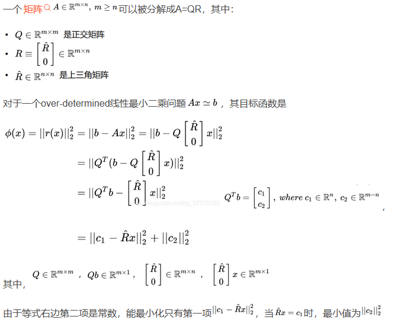

##### b.LU分解

A=LU，L为下三角单位矩阵，U为上三角矩阵

条件：A的顺序主子式都不等于0

Ax=b，LUx=b，记y=Ux，则Ly=b，可得：
$$
y=L^{-1}b,~~~~ x=U^{-1}y
$$

实际问题中，当求解方程组的系数矩阵是**对称矩阵**时，则用LDLT分解法可以简化程序设计并减少计算量。


##### c.Cholesky分解

条件：正定

Cholesky分解是一种分解矩阵的方法, 在线形代数中有重要的应用。Cholesky分解把矩阵分解为一个下三角矩阵以及它的共轭转置矩阵的乘积（那实数界来类比的话，此分解就好像求平方根，因此又叫做**平方根法**）。与一般的矩阵分解求解方程的方法比较，Cholesky分解效率很高。

==Ax=b==


为正定阵，则有如下三角阵


使$A=LL^T$成立。若L的主对角线元素取正值，则这种分解是唯一的。
将矩阵关系式$A=LL^T$直接展开，有 


##### d.SVD分解

SVD分解原理及计算举例：https://zhuanlan.zhihu.com/p/29846048

奇异值分解(Singular Value Decomposition，以下简称SVD)是在机器学习领域广泛应用的算法，它不光可以用于降维算法中的特征分解，还可以用于推荐系统，以及自然语言处理等领域。是很多机器学习算法的基石。在SLAM中也有重要应用，如单目初始化中求E或F矩阵。

给定一个矩阵，存在一个正交矩阵和，有 

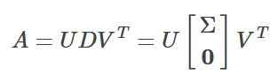

其中$Σ=diag(\sigma_1,\sigma_2,...,\sigma_N)∈R^{n\times n}$，且*σ*1≥*σ*2≥⋯≥*σ_n*≥0。上述分解就称为**奇异值分解**，*σ*1,*σ*2,⋯,*σ_n*称为*A*的**奇异值**，矩阵*U*，*V*满足$U^TU=I$，$V^TV=I$。由上式可知 
$$
A^TA=VD^TU^TUDV^T=V\Sigma^2V^T
$$


所以*σ*21,*σ*22,⋯,*σ*2*n*是*A**T**A*和*A**A**T*的**特征值**。

==Ax=b==

用奇异值分解在求线性最小二乘解的时候，我们找一个向量使得最小，我们可以化为（矩阵具有保范性） 
$$
||Ax-b||=||UDV^Tx-b||\\-->||DV^Tx-U^Tb||
$$
令$y=V^Tx$，$b'=U^Tb$。则问题变为最小化$Dy-b'$，$D=[\Sigma,0]^T$是除对角线元素以外全是0的$m\times n$矩阵。可以把该方程写成如下形式：


b'易得，$y_i=\frac{b'_i}{d_i}$，易得x=Vy。

==Ax=0==
$$
Ax=0\\
UDV^Tx=0~~~~,~y=V^Tx\\
UDy=0\\
y^TD^TU^TUDy=0\\
y^T\Sigma^2y=0
$$


由于*σ*1≥*σ*2≥⋯≥*σ**n*≥0，当$y=[0,0,0,...,1]^T$时，所得的$||y^TD^TDy||$最小。所以原始的齐次方程的解为


也就是说超定方程Ax=0的最小二乘解为*A*奇异值分解后，*V*的**最后一列向量**。


#### 3）正规方程

$$
A^T(Ax-b)=0\\
A^TAx=A^Tb\\
x=(A^TA)^{-1}A^Tb
$$

> 线性最小二乘中也有介绍

上式的几何意义可解释为：最小二乘解的残差向量与超定方程组的系数矩阵G的所有列向量正交。

这不还是求逆嘛，但是此时$(A^TA)$是一个对称正定矩阵，用Cholesky分解易求。

**当线性方程Ax=b，当系数矩阵A超定时，求最小二乘解？**

超定方程组是指方程个数大于未知量个数的方程组，即A列满秩且行数大于列数。

https://blog.csdn.net/zxf1769/article/details/96431744


#### 4）迭代

（1）雅克比迭代
$$
x^{k+1}=Jx^k+f
$$
（2）高斯赛德迭代
$$
x^{k+1}=Gx^k+f
$$


高斯迭代法要收敛速度快一些，在当前论的迭代中已经用上刚迭代的结果。但是会存在雅克比收敛而G-S不收敛的情况。

收敛性根据J、G的谱半径<1收敛，否则发散。

#### 5）线性最小二乘

https://zhuanlan.zhihu.com/p/412754415

##### a.非齐次线性方程

我们在解决许多实际问题时，解析解只有零解或者无解，但我们又不得不求非零解时(尽管它不是完全准确)，我们就需要用到最小二乘法。最小二乘估计，旨在求解误差平方和最小的非零解。对于线性方程Ax=b，定义残差为
$$
e(x)=b-Ax
$$
按照最小二乘法的思想，我们需要构建e(x)的二范数，并求其最小值。具体形式为：
$$
E(x)=||e(x)||_2=\sqrt{(\Sigma^n_{i-1}e_i(x)^2)}\\
=e^Te=(b-Ax)^T(b-Ax)
\\=b^Tb-2x^TA^Tb+x^TA^TAx
$$
对E(x)求导，另导数为0，以获取其极值：
$$
\frac{\partial E(x)}{\partial x}=A^Tb-A^TAx=0\\
x=(A^TA)^{-1}A^Tb
$$
但值得注意的是， $A^TA$可以求逆的前提是，$A^TA$为非奇异矩阵，否则其行列式则为0，不可逆。换句话说，即要求系数矩阵A行不相关，是满秩矩阵,$A^TA$则可逆。

##### b.齐次线程方程

https://zhuanlan.zhihu.com/p/413247298

对于齐次线性方程组Ax=0的情况，由于 b=0向量，我们无法直接通过线性最小二乘公式求解x的非零解。那么是否就无解了呢，当然不是。此时，我们通常有两种做法：

**方法一：对矩阵A做SVD 分解，分解后V 的最后一列向量即Ax=0为的最小二乘解。**

**方法二：求解$A^TA$的特征向量和特征值，最小特征值对应的特征向量即为Ax=0的最小二乘解。**


## 1.2 概率论和数理统计

### 高斯分布

**高斯分布的一维形式和高维形式？（十四讲）**

https://www.cnblogs.com/bingjianing/p/9117330.html

### 假设检验


t检验

秩和检验

#### 卡方检验

以特定概率分布为某种情况建模时，事物长期结果较为稳定，能够清晰进行把握。比如抛硬币实验。

但是**期望与事实存在差异怎么办？偏差是正常的小幅度波动？还是建模错误？**此时，利用卡方分布分析结果，排除可疑结果。

简单来说：当事实与期望不符合情况下使用卡方分布进行检验，看是否系统出了问题，还是属于正常波动。

检查实际结果与期望结果之间何时存在显著差异。

1、检验拟合程度：也就是说可以检验一组给定数据与指定分布的吻合程度。如：用它检验抽奖机收益的观察频数与我们所期望的吻合程度。

2、检验两个变量的独立性：通过这个方法检查变量之间是否存在某种关系。

**卡方分布假设检验步骤**

1、确定要进行检验的假设（H0）及其备择假设H1.

2、求出期望E.

3、确定用于做决策的拒绝域（右尾）.

4、根据自由度和显著性水平查询检验统计量临界值.

5、查看检验统计量是否在拒绝域内.

6、做出决策

**抽奖机之谜**


**显著性水平**

显著性水平是估计总体参数落在某一区间内，可能犯错误的概率，用α表示。

显著性水平是假设检验中的一个概念，是指当原假设为正确时人们却把它拒绝了的概率或风险。它是公认的小概率事件的概率值，必须在每一次统计检验之前确定，通常取α=0.05或α=0.01。这表明，当作出接受原假设的决定时，其正确的可能性（概率）为95%或99%。

卡方分布指出观察频数与期望频数之间差异显著性，和其他假设一样，这取决于显著性水平。

1、显性水平α进行检验，则写作：（常用的显著性水平1%和5%）

2、检测标准：卡方分布检验是单尾检验且是右尾，右尾被作为拒绝域。于是通过查看检验统计量是否位于右尾的拒绝域以内，来判定期望分布得出结果的可能性。


3、卡方概率表的使用：卡方临界值表是给定可以查询的

**问题简述**

抽奖机平常收益者总是商家，突然一段时间总是出奖。本来小概率事件频发，我们利用卡方的检验拟合优度看看能否有足够证据证明判定抽奖机被人动了手脚。

**卡方分布是什么？**

通过一个检验统计量来比较期望结果和实际结果之间的差别，然后得出观察频数极值的发生概率。

**计算统计量步骤：** （期望频数总和与观察频数总和相等）

1、表里填写相应的观察频数和期望频数

2、利用卡方公式计算检验统计量：
$$
\chi^2 =\Sigma \frac{(O-E)^2}{E} 
$$
O代表观察到的频数，也就是实际发生的频数，E代表期望频数。

**检验统计量 意义**：O与E之间差值越小，检验统计量 越小。以E为除数，令差值与期望频数成比例。

**卡方检验的标准：**如果统计量值 很小，说明观察频数和期望频数之间的差别不显著，统计量越大，差别越显著。

**期望频数E的计算：**

期望频数=（观察频数之和（1000）） X （每种结果的概率） 如：X=(-2)的期望频数：977=（0.977）X（1000）

算出每个x值的实际频率与根据概率分布得出的期望频率进行比较


利用抽奖机的观察频率和期望频率表计算检验统计量


**根据自由度和显著性水平查询检验统计量临界值**

自由度:用于计算检验统计量的独立变量的数目。

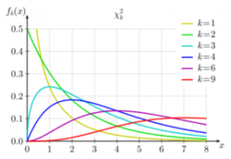

当自由度等于1或者2时：卡方分布先高后低的平滑曲线，检验统计量等于较小值的概率远远大于较大值的概率，即观察频数有可能接近期望频数。

当自由度大于2时：卡方分布先低后高再低，其外形沿着正向扭曲，但当自由度很大时，图形接近正态分布。

**自由度的计算**：

对于单行或单列：自由度 = 组数-限制数

对于表格类：自由度 = (行数 - 1) * (列数 - 1)


对于 抽奖机的例子，自由度为5-1=4

自由度为4, 5%显著水平的拒绝域是多少？

查表，自由度F=4，显著性为0.05，对应拒绝域 为$\chi^2>9.49$，也就是说检验统计量大于9.49 位于拒绝域内。


**决策原则**

如果位于拒绝域内我们拒绝原假设H0，接受H1。

如果不在拒绝域内我们接受原假设H0，拒绝H1

检验统计量38.272 > 9.49 位于拒绝域内

于是拒绝原假设：抽奖机每局收益如何概率分布，也就是说抽奖机被人动了手脚。

**检验统计量拒绝域内外判定：**

1、求出检验统计量a

2、通过自由度和显著性水平查到拒绝域临界值

3、a>b则位于拒绝域内，反之，位于拒绝域外。

**ORB-SLAM2中的卡方检测剔除外点策略**

误差的定义：

就特征点法的视觉SLAM而言，一般会计算重投影误差。具体而言，记为特征点的2D位置， 为由地图点投影到图像上的2D位置。重投影误差为
$$
e=u-\overline{u}
$$
重投影误差服从高斯分布
$$
e\sim N(0,\Sigma )
$$


也就是说不同金字塔层提取的特征，计算的重投影误差都被归一化了，或者说去量纲化了，那么，我们只用一个阈值就可以了。

可见：

金字塔层数越高，图像分辨率越低，特征提取的精度也就越低，因此协方差越大

**单目投影为2自由度，在0.05的显著性水平（也就是95%的准确率）下，卡方统计量阈值为5.99**

**双目投影为3自由度，在0.05的显著性水平（也就是95%的准确率）下，卡方统计量阈值为7.81**

双目匹配到的特征点在右图中的x坐标为 ，重投影后计算得到特征点左图的x坐标 ，根据视差
$$
disparity=\frac{baseline*f_x}{depth}
$$
从而得到重投影后右图中特征点x坐标
$$
u_{xr}=u_{xl}-disparity
$$
disparity就是另一个自由度。


### 协方差

https://blog.csdn.net/shyjhyp11/article/details/123222907


#### 方差和协方差

在统计学中，**方差**是用来度量**单个随机变量**的**离散程度**，其中，**方差的计算公式**为：
$$
\sigma_x^2=\frac{1}{n-1}\sum^{n}_{i=1}(x_i-\overline{x})^2
$$
**协方差**则一般用来刻画**两个随机变量**的**相似程度（**统计两组数据之间的协同程度（相关程度、相关性，变化规律是否一致），遍历不同组数据的方差**）。**在此基础上，**协方差的计算公式**被定义为:
$$
\sigma(x,y)=\frac{1}{n-1}\sum^{n}_{i=1}(x_i-\overline{x})(y_i-\overline{y})
$$
通俗的理解为：两个变量在变化过程中是同方向变化？还是反方向变化？同向或反向程度如何？

你变大，同时我也变大，说明两个变量是同向变化的，这时协方差就是正的。
你变大，同时我变小，说明两个变量是反向变化的，这时协方差就是负的。
从数值来看，协方差的数值越大，两个变量同向程度也就越大。反之亦然。

[SLAM](https://so.csdn.net/so/search?q=SLAM&spm=1001.2101.3001.7020)状态估计中：**均值**可看作是对**变量**最优值的估计，而**协方差矩阵**则度量了它的不确定性。

#### 协方差矩阵

根据方差的定义，给定d个随机变量$x_k$，则这些**随机变量的方差为**:
$$
\sigma(x_k,x_k)=\frac{1}{n-1}\sum^{n}_{i=1}(x_{ki}-\overline{x}_k)
$$
对于**这些随机变量**，我们还可以根据协方差的定义，求出**两两之间的协方差（**理解协方差[矩阵](https://so.csdn.net/so/search?q=矩阵&spm=1001.2101.3001.7020)的关键就在于牢记它计算的是**不同维度之间的协方差**，而不是**不同样本之间**，即:
$$
\sigma(x_m,x_k)=\frac{1}{n-1}\sum^{n}_{i=1}(x_{mi}-\overline{x}_m)(x_{ki}-\overline{x}_k)
$$
因此，**协方差矩阵为**
$$
\sum=\begin{vmatrix}
\sigma(x_1,x_1)&...&\sigma(x_1,x_d)\\
...&...&...\\
\sigma(x_d,x_1)&...&\sigma(x_d,x_d)
\end{vmatrix}
$$
其中，**对角线上**的元素为各个随机变量的**方差**，非对角线上的元素为两两随机变量之间的协方差。


### 信息矩阵

信息矩阵$\Omega$是一个scalar 表达不确定性。
$$
\Omega=\Sigma^{-1}
$$

> 为什么信息矩阵是协方差矩阵的逆，没有意义，香农形式，数学推导出来的。

为什么需要信息矩阵？以及信息矩阵是如何表达数据的不确定性的？

因为系统会用到不同传感器，或者同一传感器会有不同的时刻的数据，怎么对数据做取舍，需要信息矩阵去记录权重来进行信息的融合。比如有两个传感器，一个精度很高，一个精度很低，精度高对应很高的权重const int INT_MAX=1e9，对于这样一个优化问题，$argmin( INT\_MAX*(x-3)^2+\frac{1}{INT\_MAX}*(x-1)^2))$，这个问题的结果就是x=3。

直接求解较为困难，这里通过联合高斯分布计算得到协方差的逆。

#### 边缘化-舒尔补

信息矩阵的更新，需要引入**marginalization (边缘化)** 和 **Schur’s complement (舒尔补)** 来解决这个问题。

舒尔补的定义如下：

给定任意矩阵块M
$$
M=\begin{bmatrix}
A&C\\
B&D
\end{bmatrix}
$$
如果，矩阵快D是可逆的，则 $A-BD^{-1}C$称之为D关于M的舒尔补。
如果，矩阵快A是可逆的，则$ D-CA^{-1}B$称之为A关于M的舒尔补。

在SLAM中，
$$
\Sigma=\begin{bmatrix}
A&B^{-1}\\
B&C
\end{bmatrix}
=\begin{bmatrix}
0&0\\
0&C-B^{T}A^{-1}B
\end{bmatrix}
$$


**信息矩阵与海森矩阵的关系**

先放出结论：

Hessian矩阵在最大似然（MLE）问题中被认为约等于信息矩阵，所以一般也会将Hessian矩阵直接当做信息矩阵对待。

协方差的逆=信息矩阵，这个结论是建立在假设分布是高斯分布这个前提下，计算最大后验概率（MAP）优化问题得出来的。


## 1.3 刚体运动

### 四元数

四元数和欧拉角可视化在线网站https://quaternions.online

四元数有两种表示形式，Hamilton和JPL，差别在于前者ijk=-1，后者ijk=1。

> Ros、Eigen、Ceres、matlab均使用的Hamilton。


**验证旋转矩阵是正交矩阵（十四讲）**


**验证四元数旋转某个点后，结果仍然是一个虚四元数，所以仍对应一个三维空间点（十四讲）**


**旋转矩阵、旋转向量（角轴）、欧拉角、四元数四者的比较和变换？**

旋转矩阵、旋转向量（无冗余）、欧拉角（万向锁、直观）、四元数（无万向锁，不够直观，运算复杂）


**旋转矩阵<-->角轴**

由罗德里格斯公式：
$$
\textbf{R}=cos\theta \textbf{I}+(1-cos\theta )\textbf{nn}^T+sin\theta \textbf{n}^{\wedge}
$$

$$
\begin{align}
tr(\textbf{R})&=cos\theta tr(\textbf{I})+(1-cos\theta )tr(\textbf{nn}^T)+sin\theta tr(\textbf{n}^{\wedge})
\\&=
3cos\theta +(1-cos\theta )
\\&=1+2cos\theta 
\end{align}
$$

$$
\theta =arccos \left(\frac{tr(\textbf{R})-1}{2} \right)
$$

**旋转矩阵<-->四元数**

**角轴<-->四元数**

## 1.4 李群李代数

> 非线性优化需要，因为旋转矩阵是带约束的正交矩阵且行列式为1，这种约束会使得优化问题变得困难，利用李群李代数把有约束优化转化为无约束优化。

### 1.李群和李代数基础

三维旋转矩阵构成了特殊正交群 SO(3)，而变换矩阵构成了特殊欧氏群 SE(3)：


旋转矩阵对加法是不封闭的：
$$
R_1+R_2\notin SO(3)
$$
但是对乘法是封闭的
$$
R_1R_2\in SO(3)，~~T_1T_2\in SE(3)
$$
对于这种只有一个运算的集合，我们把它叫做**群**。

群（Group）是一种集合加上一种运算的代数结构。

李群是指具有连续（光滑）性质的群。

> 像整数群 Z 那样离散的群没有连续性质，所以不是李群。而 SO(n) 和 SE(n)，它们在实数空间上是连续的。我们能够直观地想象一个刚体能够连续地在空间中运动，所以它们都是李群。


**李代数so3**

每个李群都有与之对应的李代数。李代数描述了李群的局部性质。


**这里是利用了反对称矩阵的性质**


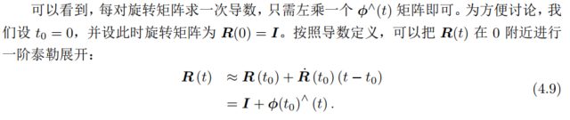


上式对微分方程和初始值均成立。不过，由于做了一定的假设，所以它只在 t = 0 附近有效。

某个时刻的 R 时，存在一个向量 ϕ，它们满足这个矩阵指数关系。

1. 如果上式成立，那么给定某时刻的 R，我们就能求得一个 ϕ，它描述了 R 在局部的导数关系。与 R 对应的 ϕ 有什么含义呢？后面会看到， ϕ 正是对应到 SO(3) 上的李代数 so(3)；
2. 其次，矩阵指数 exp(ϕ^) 如何计算？——事实上，这正是李群与李代数间的指数/对数映射。

ϕ事实上是一种李代数。 
$$
so(3)=\{\phi\in \mathbb{R}^3,\Phi=\phi^{\wedge}\in \mathbb{R}^{3\times3} \}
$$
so(3) 的元素是 3 维向量或者 3 维反对称矩阵每个向量对应到一个反对称矩阵，可以表达旋转矩阵的导数。它与 SO(3) 的关系由指数映射给定：
$$
R=exp(\phi^{\wedge})
$$
**李代数se3**

对于 SE(3)，它也有对应的李代数 se(3)。与 so(3) 相似， se(3) 位于 R6 空间中：


每个 se(3) 元素记作 ξ，它是一个六维向量。前三维为平移，记作 ρ；后三维为旋转，记作 ϕ，实质上是 so(3) 元素‹。同时，我们拓展了 ^ 符号的含义。在 se(3) 中，同样使用 ^ 符号，将一个六维向量转换成四维矩阵，但这里不再表示反对称：


使用 ^ 和 _ 符号来指代“从向量到矩阵”和“从矩阵到向量”的关系，以保持和 so(3) 上的一致性。读者可以简单地把 se(3) 理解成“由一个平移加上一个 so(3) 元素构成的向量”（尽管这里的 ρ 还不直接是平移）。同样，李代数 se(3) 亦有类似于 so(3) 的李括号：
$$
[\xi_1,\xi_2]=(\xi_1^{\wedge}\xi_2^{\wedge}-\xi_2^{\wedge}\xi_1^{\wedge})^{\vee}
$$


### 2.指数和对数映射


exp(ϕ^) 是如何计算的？它是一个矩阵的指数，在李群和李代数中，称为指数映射（Exponential Map）。


该性质提供了处理 a^ 高阶项的方法。利用这两个性质，可以把指数映射写成：


它和罗德里格斯公式，即式（3.14）如出一辄。这表明， so(3) 实际上就是由所谓的旋转向量组成的空间，而指数映射即罗德里格斯公式。通过它们，我们把so(3) 中任意一个向量对应到了一个位于 SO(3) 中的旋转矩阵。反之，如果定义对数映射，我们也能把 SO(3) 中的元素对应到 so(3) 中：


不过我们通常不按照泰勒展开去计算对数映射。在第 3 讲中，我们已经介绍过如何根据旋转矩阵计算对应的李代数，即使用式（3.16），**利用迹的性质分别求解转角和转轴**，采用那种方式更加省事一些。

指数映射性质如何呢？

是否对于任意的 R 都能找到一个唯一的 ϕ？很遗憾，指数映射只是一个满射。这意味着每个SO(3) 中的元素，都可以找到一个 so(3) 元素与之对应；但是可能存在多个 so(3) 中的元素，对应到同一个 SO(3)。至少对于旋转角 θ，我们知道多转 360 度和没有转是一样的——它具有周期性。但是，如果我们把旋转角度固定在 ±π 之间，那么李群和李代数元素是一一对应的。

SO(3) 与 so(3) 的结论似乎在我们意料之中。它和我们前面讲的旋转向量与旋转矩阵很相似，而指数映射即是罗德里格斯公式。旋转矩阵的导数可以由旋转向量指定，指导着如何在旋转矩阵中进行微积分运算。

**SE(3)指数映射**

se(3) 上的指数映射形式如下：

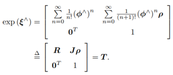

可以照着 so(3) 上的做法推导，把 exp 进行泰勒展开推导此式。从结果上看， ξ 的指数映射左上角的 R 是我们熟知的 SO(3) 中的元素，与 se(3) 当中的旋转部分 ϕ 对应。而右上角的 J 则可整理为（设 ϕ = θa）：


该式与罗德里格斯有些相似，但不完全一样。我们看到，平移部分经过指数映射之后，发生了一次以 J 为系数矩阵的线性变换。

同样的，虽然我们也可以类比推得对数映射，**不过根据变换矩阵 T 求 so(3) 上的对应向量也有更省事的方式：从左上的 R 计算旋转向量，而右上的 t 满足$t=J\rho$：**

由于 J 可以由 ϕ 得到，所以这里的 ρ 亦可由此线性方程解得。


### 3.李代数求导与扰动模型

使用李代数的一大动机是为了进行优化，而在优化过程中导数是非常必要的信息。

当我们在 SO(3) 中完成两个矩阵乘法时，李代数中 so(3)上发生了什么改变呢？反过来说，当 so(3) 上做两个李代数的加法时， SO(3) 上是否对应着两个矩阵的乘积？
$$
exp(\phi^{\wedge}_1)exp(\phi^{\wedge}_2)\neq exp((\phi_1+\phi_2)^{\wedge})\\
ln(exp(A)exp(B))\neq A+B
$$
**BCH公式与近似形式**

两个李代数指数映射乘积的完整形式，由 Baker-Campbell-Hausdorff 公式（BCH 公式）给出。由于它完整的形式较复杂，我们给出它展开式的前几项：


**SO(3)上的李代数求导**

在 SLAM 中，我们要估计一个相机的位置和姿态，该位姿是由 SO(3) 上的旋转矩阵或 SE(3) 上的变换矩阵描述的。不妨设某个时刻小萝卜的位姿为 T。它观察到了一个世界坐标位于 p 的点，产生了一个观测数据 z。那么，由坐标变换关系知：


假设一共有 N 个这样的路标点和观测，于是就有 N 个上式。那么，对小萝卜的位姿估计，相当于是寻找一个最优的 T，使得整体误差最小化：


我们经常会构建与位姿有关的函数，然后讨论该函数关于位姿的导数，以调整当前的估计值。然而， SO(3); SE(3) 上并没有良好定义的加法，它们只是群。如果我们把 T 当成一个普通矩阵来处理优化，那就必须对它加以约束。而从李代数角度来说，由于李代数由向量组成，具有良好的加法运算。因此，使用李代数解决求导问题的思路分为两种：

1. **用李代数表示姿态，然后对根据李代数加法来对李代数求导。**
2. **对李群左乘或右乘微小扰动，然后对该扰动求导，称为左扰动和右扰动模型。**

### 李代数求导的两种思路

**1.李代数求导**


按照导数的定义，有：


BCH线性近似

泰勒展开舍弃高阶项后近似

根据叉积的定义

axb=-bxa；

a^b=-b^a;

于是，我们推导了旋转后的点相对于李代数的导数：


**2.扰动模型（左乘）**

另一种求导方式，是对 R 进行一次扰动 ∆R。这个扰动可以乘在左边也可以乘在右边，最后结果会有一点儿微小的差异，我们以左扰动为例。设左扰动 ∆R 对应的李代数为φ。然后，对 φ 求导，即：


可见，扰动模型相比于直接对李代数求导，省去了一个雅可比 Jl 的计算。这使得扰动模型更为实用。

**SE(3)上的李代数求导**


**相似变换群Sim(3)** 

这个主要用在回环检测中，如何根据回环两帧计算位姿和尺度，后面回环中有讲。

单目视觉中使用相似变换群 Sim(3)，以及对应的李代数sim(3)。

在单目 SLAM 中使用 SE(3) 表示位姿，那么由于尺度不确定性与尺度漂移，整个 SLAM 过程中的尺度会发生变化，这在 SE(3) 中未能体现出来。因此，在单目情况下我们一般会显式地把尺度因子表达出来。用数学语言来说，对于位于空间的点 p，在相机坐标系下要经过一个相似变换，而非欧氏变换：


在相似变换中，我们把尺度 s 表达了出来。它同时作用在 p 的三个坐标之上，对 p 进行了一次缩放。与 SO(3)、 SE(3) 相似，相似变换亦对矩阵乘法构成群，称为相似变换群 Sim(3)：


同样地， Sim(3) 也有对应的李代数、指数映射、对数映射等等。李代数 sim(3) 元素是一个七维向量 ζ。它的前六维与 se(3) 相同，最后多了一项 σ。


旋转部分和 SO(3) 是一致的。平移部分，在 se(3) 中需要乘一个雅可比 J ，而相似变换的雅可比更复杂一些。对于尺度因子，可以看到李群中的 s 即为李代数中 σ 的指数函数。


处理李代数，也可以用四元数、欧拉角等方式，只是后续的处理麻烦一些。实际的应用中可以用SO（3）+平移，代替SE（3），从而避免一些雅克比矩阵的计算。

课后题（没做）


## 1.5 非线性优化

我们无法对相机的模型、相机的运动进行精确的建模，由于噪声的存在，以及我们对噪声的近似。若要考虑如何在有噪声的数据中进行精确的状态估计。要用到的工具就是------非线性优化。

### SLAM问题建模

$$
\left\{\begin{matrix}
x_k=f(x_{k-1},u_k)+w_k\\
z_{k,j}=h(y_j,x_k)+v_{k,j}
\end{matrix}\right.
$$

已知的是控制量uk和当前的观测zkj，w、v假设满足零均值的高斯分布，求解x，y。
$$
P(\vec{x},\vec{y}|\vec{z},\vec{u})
$$
两类解决思路，一类是渐进式的滤波器方法，一类是批量式的非线性优化方法，实际的应用多是折中的滑动窗口。

滤波器以KF、EKF为代表。（这部分在后端中展开，此处只介绍非线性优化）

非线性优化构造似然估计在于最小二乘问题的求解。

https://zhuanlan.zhihu.com/p/138267631

怎么把这样一个状态估计问题转变成最大似然估计，实际上是转变成最小二乘估计。

根据贝叶斯理论：后验=似然*先验，似然基于观测方程，求最大似然估计。

这部分在第三章后端滤波器中有推导。该文件侧重于一般最小二乘问题的求解方法。

### 最小二乘问题求解

对于一个最小二乘问题
$$
F(x)=\underset{x}{min}\frac{1}{2}\left\| f(x)\right\|^2_2
$$
一般有两大类思路：

1. 求导分析，求极值，然而实际上f 并没有一个明确的解析形式，也没办法[求导](https://so.csdn.net/so/search?q=求导&spm=1001.2101.3001.7020)分析，或者导函数相当复杂
2. 迭代寻优如下图，这让求解导函数为零的问题，变成了一个不断寻找梯度并下降的过程。直到某个时刻增量非常小，无法再使函数下降。此时算法收敛，目标达到了一个极小，我们完成了寻找极小值的过程。在这个过程中，我们只要找到迭代点的梯度方向即可，而无需寻找全局导函数为零的情况。这个过程的关键是**增量$\Delta x$如何确定？**，即迭代的方向和步长。


**最速下降法、牛顿法、高斯牛顿法和列文伯格——马夸尔特方法各有什么优缺点？**

|            | 优点                                                         | 缺点                                                         |
| ---------- | ------------------------------------------------------------ | ------------------------------------------------------------ |
| 最速下降法 | 负梯度方向，算法十分简单，比较直观，在前几次迭代中目标函数下降较快 | 过于贪心，容易呈现锯齿下降，当接近极小值点时，增加迭代次数   |
| 牛顿法     | 保留泰勒级数一阶和二阶项，二次收敛速度，收敛速度快           | 但每步都计算海塞矩阵，当问题规模较大时，计算复杂，耗时       |
| GN法       | 目标函数的Jacobian矩阵$JJ^T$近似H矩阵，避免了二阶求导计算H。 | 但H矩阵可能不满秩（奇异矩阵），则无法迭代，容易产生病态方程。算法不收敛 |
| LM法       | 信赖域算法，在高斯牛顿法引入信赖区域在一定程度上解决H矩阵不满秩或非正定 | 收敛速度比高斯牛顿慢                                         |
| GodLeg     |                                                              |                                                              |


#### 1）一阶和二阶梯度法

**一阶（最速下降法）和二阶梯度法（牛顿法）**

将目标函数F(x)在 x 附近进行泰勒展开：


这里J是$\left\|f(x) \right\|^2$ 关于 x 的导数（雅可比Jacobian矩阵），而 H 则是二阶导数（海塞Hessian矩阵）

**如果只保留一阶项有**
$$
\left\|f(x+\Delta x) \right\|^2_2 \approx
\left\|f(x) \right\|^2_2+J(x)\Delta x
$$
对等式右边求导可得梯度方向
$$
(\left\|f(x) \right\|^2_2+J(x)\Delta x)'
=0+J(x)=J(x)
$$
取增量为反梯度方向
$$
\Delta x^*=-J^T(x)
$$
然后我们再确定一下步长，只要我们沿着反向梯度方向前进即可找到最优解，这种方法称为**最速下降法。**

**如果同时保留二阶项有**
$$
\Delta x^*=\underset{x}{argmin}\left\| f(x)\right\|^2_2+
J(x)\Delta x+\frac{1}{2}\Delta x^TH\Delta x
$$
对等式右边求导并令导函数=0可得梯度方向
$$
H\Delta x=-J^T
$$
这种保留二阶项的方法称为**牛顿法**。

> 上述方法比较简洁，但是最速下降法过于贪心，容易走出锯齿路线，反而增加了迭代次数。而牛顿法则需要计算目标函数的 H 矩阵，这在问题规模较大时非常困难，我们通常倾向于避免 H 的计算。所以更加实用的方法是：**高斯牛顿法（Gauss-Newton）**和**列文伯格——马夸尔特方法**。

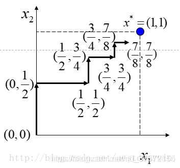

#### 2）高斯牛顿法

与一阶二阶法不同，高斯牛顿将f(x)在x处进行泰勒展开，仅保留一阶项有
$$
f(x+\Delta x)\approx f(x)+J(x)\Delta x
$$
代入目标函数F(x)有
$$
\begin{align}
\frac{1}{2}\left\|f(x)+J(x)\Delta x) \right\|^2_2
&=\frac{1}{2}\left(f(x)+J(x)\Delta x) \right)^T\left(f(x)+J(x)\Delta x) \right)\\
&=\frac{1}{2}\left(\left\|f(x)\right\|^2_2 +
2f(x)^TJ(x)\Delta x+
\Delta x^TJ(x)^TJ(x)\Delta x\right)
\end{align}
$$
对等式右边求导并令导函数=0可得梯度方向
$$
2J(x)^Tf(x)+2J(x)^TJ(x)\Delta x=0
\\J(x)^TJ(x)\Delta x=-J(x)^Tf(x)
$$
注意，我们要求解的变量是 ∆x，因此这是一个线性方程组，我们称它为增量方程，也可以称为高斯牛顿方程 (Gauss Newton equations) 或者正规方程 (Normal equations)。我们把左边的系数定义为 H，右边定义为 g，那么上式变为：
$$
\begin{align}
H\Delta x&=g\\
\Delta x&=(J(x)TJ(x))^{-1}g\\
\Delta x&=H^{-1}g
\end{align}
$$
这里把左侧记作 H 是有意义的。对比牛顿法可见， Gauss-Newton 用$ J^T J$ 作为牛顿法中二阶 Hessian 矩阵的近似，从而省略了计算 H 的过程。 求解增量方程是整个优化问题的核心所在。


> 对于高斯牛顿法，同样是不完美的，因为$J(x)^TJ(x)$不是正定而是半正定的，用这样的矩阵求逆计算增量，稳定性就较差，导致算法不收敛。
>
> Levenberg-Marquadt 方法在一定程度上修正了这些问题，一般认为它比 Gauss Newton 更为鲁棒。尽管它的收敛速度可能会比 Gauss Newton 更慢，被称之为阻尼牛顿法(Damped Newton Method)，但是在 SLAM 里面却被大量应用。

#### 3）列文伯格马夸尔特法

由于 Gauss-Newton 方法中采用的近似二阶泰勒展开只能在展开点附近有较好的近似效果，所以我们很自然地想到应该给 ∆x 添加一个信赖区域（Trust Region），不能让它太大而使得近似不准确。非线性优化种有一系列这类方法，这类方法也被称之为信赖区域方法 (Trust Region Method)。在信赖区域里边，我们认为近似是有效的；出了这个区域，近似可能会出问题。

那么如何确定这个信赖区域的范围呢？

一个比较好的方法是根据我们的近似模型跟实际函数之间的差异来确定这个范围：如果差异小，我们就让范围尽可能大；如果差异大，我们就缩小这个近似范围。因此，考虑使用
$$
\rho=\frac{f(x+\Delta x)-f(x)}{J(x)\Delta x}
$$
ρ 的分子是实际函数下降的值，分母是近似模型下降的值。如果 ρ 接近于 1，则近似是好的。如果 ρ 太小，说明实际减小的值远少于近似减小的值，则认为近似比较差，需要缩小近似范围。反之，如果 ρ 比较大，则说明实际下降的比预计的更大，我们可以放大近似范围。

于是，我们构建一个改良版的非线性优化框架，该框架会比 Gauss Newton 有更好的效果：


这里近似范围扩大的倍数和阈值都是经验值，可以替换成别的数值。在式（6.24）中，我们把增量限定于一个半径为 µ 的球中，认为只在这个球内才是有效的。带上 D 之后，这个球可以看成一个椭球。在 Levenberg 提出的优化方法中，把 D 取成单位阵 I，相当于直接把 ∆x 约束在一个球中。随后， Marqaurdt 提出将 D 取成非负数对角阵——实际中通常用 JT J 的对角元素平方根，使得在梯度小的维度上约束范围更大一些。不论如何，

在 L-M 优化中，我们都需要解式（6.24）那样一个子问题来获得梯度。这个子问题是带不等式约束的优化问题，我们用 Lagrange 乘子将它转化为一个无约束优化问题：
$$
\underset{\Delta x_k}{min}\frac{1}{2}\left\| f(x)+
J(x_k)\Delta x_k\right\|^2+
\frac{\lambda}{2}\left\| D\Delta x  \right\|^2
$$
这里 λ 为 Lagrange 乘子。类似于 Gauss-Newton 中的做法（展开、求导、=0），把它展开后，我们发现该问题的核心仍是计算增量的线性方程：
$$
(H+\lambda D^TD)\Delta x=g
$$
可以看到，增量方程相比于 Gauss-Newton，多了一项 $λD^TD$。如果考虑它的简化形式，即 D = I，那么相当于求解：
$$
(H+\lambda I)\Delta x=g
$$
我们看到，当参数 λ 比较小时， H 占主要地位，这说明二次近似模型在该范围内是比较好的， L-M 方法更接近于 G-N 法。另一方面，当 λ 比较大时， λI 占据主要地位， L-M更接近于一阶梯度下降法（即最速下降），这说明附近的二次近似不够好。 L-M 的求解方式，可在一定程度上避免线性方程组的系数矩阵的非奇异和病态问题，提供更稳定更准确的增量 ∆x。

在实际中，还存在许多其它的方式来求解函数的增量，例如 Dog-Leg 等方法。我们在这里所介绍的，只是最常见而且最基本的方式，也是视觉 SLAM 中用的最多的方式。总而言之，非线性优化问题的框架，分为 Line Search 和 Trust Region 两类。 Line Search 先固定搜索方向，然后在该方向寻找步长，以最速下降法和 Gauss-Newton 法为代表。而 Trust Region 则先固定搜索区域，再考虑找该区域内的最优点。此类方法以 L-M 为代表。实际问题中，我们通常选择 G-N 或 L-M 之一作为梯度下降策略。

问题为凸时，二阶方法一两步就可以收敛，问题非凸时，对初值敏感，会陷入局部最优，没有全局最优解法。

至此，方法都说完了，但是还要一些遗留。

\1. 初值怎么确定？

初值的好坏决定了求解结果是趋向局部极小值还是全局极小值（这是非线性优化类方法的通病），在slam里面通过ICP、PnP之类的方法进行初始化。

\2. 高维矩阵的逆怎么求？

增量的求解需要求解矩阵的逆，在实际问题中，矩阵是成千上万的维度（位置x，地图点y的个数），因此几乎没有直接求逆的，例如 QR、 Cholesky 等分解方法。而是有针对性的求解，视觉 SLAM 里，这个矩阵往往有特定的稀疏形式，大大提高了求解效率，这为实时求解优化问题提供了可能性。

**手写高斯牛顿法**

对于曲线y，w为高斯噪声。
$$
y=exp(ax^2+bx+c)+w
$$
最小二乘问题：
$$
\underset{a,b,c}{argmin}\frac{1}{2}\sum_{i=1}^{N}\left\| y_i-exp(ax_i^2+bx_i+c)\right\|^2
$$


```C++
#include <iostream>
#include <chrono>
#include <opencv2/opencv.hpp>
#include <Eigen/Core>
#include <Eigen/Dense>

using namespace std;
using namespace Eigen;

int main(int argc, char **argv) {
  double ar = 1.0, br = 2.0, cr = 1.0;         // 真实参数值
  double ae = 2.0, be = -1.0, ce = 5.0;        // 估计参数值
  int N = 100;                                 // 数据点
  double w_sigma = 1.0;                        // 噪声Sigma值
  double inv_sigma = 1.0 / w_sigma;
  cv::RNG rng;                                 // OpenCV随机数产生器

  vector<double> x_data, y_data;      // 数据
  for (int i = 0; i < N; i++) {
    double x = i / 100.0;
    x_data.push_back(x);
    y_data.push_back(exp(ar * x * x + br * x + cr) + rng.gaussian(w_sigma * w_sigma));
  }

  // 开始Gauss-Newton迭代
  int iterations = 100;    // 迭代次数
  double cost = 0, lastCost = 0;  // 本次迭代的cost和上一次迭代的cost

  chrono::steady_clock::time_point t1 = chrono::steady_clock::now();
  for (int iter = 0; iter < iterations; iter++) {

    Matrix3d H = Matrix3d::Zero();             // Hessian = J^T W^{-1} J in Gauss-Newton
    Vector3d b = Vector3d::Zero();             // bias
    cost = 0;

    for (int i = 0; i < N; i++) {
      double xi = x_data[i], yi = y_data[i];  // 第i个数据点
      double error = yi - exp(ae * xi * xi + be * xi + ce);
      Vector3d J; // 雅可比矩阵
      J[0] = -xi * xi * exp(ae * xi * xi + be * xi + ce);  // de/da
      J[1] = -xi * exp(ae * xi * xi + be * xi + ce);  // de/db
      J[2] = -exp(ae * xi * xi + be * xi + ce);  // de/dc

      H += inv_sigma * inv_sigma * J * J.transpose();
      b += -inv_sigma * inv_sigma * error * J;

      cost += error * error;
    }

    // 求解线性方程 Hx=b
    Vector3d dx = H.ldlt().solve(b);  //LDLT分解求逆
    if (isnan(dx[0])) {
      cout << "result is nan!" << endl;
      break;
    }

    if (iter > 0 && cost >= lastCost) {
      cout << "cost: " << cost << ">= last cost: " << lastCost << ", break." << endl;
      break;
    }

    ae += dx[0];
    be += dx[1];
    ce += dx[2];

    lastCost = cost;

    cout << "total cost: " << cost << ", \t\tupdate: " << dx.transpose() <<
         "\t\testimated params: " << ae << "," << be << "," << ce << endl;
  }

  chrono::steady_clock::time_point t2 = chrono::steady_clock::now();
  chrono::duration<double> time_used = chrono::duration_cast<chrono::duration<double>>(t2 - t1);
  cout << "solve time cost = " << time_used.count() << " seconds. " << endl;

  cout << "estimated abc = " << ae << ", " << be << ", " << ce << endl;
  return 0;
}
```


课后习题也让写了

https://www.zhihu.com/people/philip-ll/posts这个人做了

#### 4）DogLeg


## 1.6 传感器

|            |                                    | 三种主流方案                 |                                 |
| ---------- | :--------------------------------: | ---------------------------- | ------------------------------- |
|            |               被动式               |                              | 主动式                          |
|            |                单目                | 双目                         | RGB-D                           |
| 深度原理   |                                    | 三角测量                     | 红外光编码/TOF                  |
| 测量范围   |                                    | 与基线有关                   | 0.1m-10m                        |
| 软件复杂度 |                                    | 非常高                       | 中                              |
| 户外场景   |             有一定影响             | 有一定影响                   | 影响较大，低功率几乎无法工作    |
| 黑暗环境   |               不可以               | 不可以                       | 可以                            |
| 价格       |                百元                | 千元                         | 1mm-千元0.1mm-万元0.01mm-几十万 |
| 优点       |          成本低距离不受限          | 被动深度距离不受限           | 主动探测深度高帧率、精度        |
| 缺点       | 尺度不确定性初始化问题依赖纹理光照 | 配置复杂计算量大依赖纹理光照 | 量程受限不适合室外受材质干扰    |

单目、双目、RGBD（红外结构光、TOF）

**双目**

**RGB-D**

基于结构光的RGB-D相机根据返回的红外结构光图案计算深度值，基于TOF的RGB-D的相机类似于激光传感器，激光是逐点扫描，而TOF是整体获取像素深度。


## 1.6 相机模型

**空间中的三维坐标点，怎么和像素坐标建立联系，因此建立相机模型。**


在相机模型里面一般会声明一些方法（纯虚函数）

纯虚类

```C++
class GeometricCamera {}
```

- 投影：求一个3D点的投影位置
- 反投影
- 投影的雅克比
- 三角化

在具体的模型中会对方法实现

📷**快门类型**

**全局快门相机(global shutter)和卷帘快门相机(rolling shutter)的异同。它们在 SLAM 中有何优缺点?**

全局快门相机通过整幅场景在同一时间曝光实现的。Sensor所有像素点同时收集光线，同时曝光。即在曝光开始的时候，Sensor开始收集光线；在曝光结束的时候，光线收集电路被切断。然后Sensor值读出即为一幅照片。全局快门曝光时间更短，容易产生噪点。

卷帘快门相机通过Sensor逐行曝光的方式实现的。在曝光开始的时候，Sensor逐行扫描逐行进行曝光，直至所有像素点都被曝光。当然，所有的动作在极短的时间内完成。不同行像元的曝光时间不同。大多数CMOS传感器采用这一快门。对于高速移动的物体来说，卷帘快门容易出现扭曲现象。用Global shutter方式拍摄，假如曝光时间过长，照片会产生像糊现象。

### （一）针孔模型


根据三角形相似关系,有:
$$
\frac{Z}{f}=-\frac{X}{X'}=-\frac{Y}{Y'}
$$
其中负号表示成的像是倒立的。为了简化模型,我们把可以成像平面对称到相机前方,这样做可以把公式中的负号去掉,使式子更加简洁。


像素坐标系与成像平面之间,相差了一个缩放和一个原点的平移。我们设像素坐标在 u 轴上缩放了 α 倍,在 v 上缩放了 β 倍。同时,原点平移了$[c_x,c_y]^T$  。那么,P ′ 的坐标与像素坐标$[u,v]^T$的关系为:


写成矩阵的形式如下:


据此我们得到了相机模型及其内参矩阵的表达。

**相机内参：**像素坐标与成像平面相差了一个缩放和一个原点的平移，用相机内参描述，确定相机内参的过程称为**标定**。


**相机标定可以获取相机内参矩阵和矫正参数。除了相机内参之外，还有相机外参，相机外参是SLAM的主要任务。**

上述空间点P使用的是在相机坐标系的坐标，如果有一世界坐标下的空间点$P_w$，则有


其中，相机的位姿 R; t 又称为相机的外参数（Camera Extrinsics）。

**投影矩阵**

投影矩阵P是一个 3x4 的矩阵，可以将空间中的一个点投影到平面上。

已知两帧图像I1、I2之间的R，t，内参K，可以计算

P1=K*[I|0]

P2=K*[R|t]


```C++
class Pinhole : public GeometricCamera {}
```


### （二）KB8抽象模型

单目相机模型按视角可以分为普通的、广角的。其中，鱼眼相机是一种焦距小于等于16mm，且视角接近或者等于180°的极端广角镜头。但是正是因为他极端的短焦和广角，导致它因为光学原理而产生的畸变非常剧烈，所以**针孔模型并不能很好的描述鱼眼相机**，所以需要一种新的相机模型来对鱼眼相机进行近似模拟。

KB模型能够很好的适用于普通，广角以及鱼眼镜头。KB模型假设图像光心到投影点的距离和角度的[多项式](https://so.csdn.net/so/search?q=多项式&spm=1001.2101.3001.7020)存在比例关系，角度的定义是点所在的投影光纤和主轴之间的夹角。

**投影**

无畸变投影


计算归一化坐标：
$$
x_c=\frac{X_c}{Z_c}\\
y_c=\frac{Y_c}{Z_c}
$$
有畸变投影


$$
r^2=x_c^2+y_c^2\\
\theta=arctan(r)
$$
**畸变矫正**
$$
\theta_d=k_0\theta+k_1\theta^3+k_2\theta^5+k_3\theta^7+k_4\theta^9
$$
计算去畸变后的归一化平面坐标
$$
\left\{\begin{matrix}
x_d=\frac{\theta_d}{r}\cdot x_c\\
y_d=\frac{\theta_d}{r}\cdot y_c
\end{matrix}\right.
\\
\left\{\begin{matrix}
u=f_x\cdot x_{d}+c_x\\
v=f_y\cdot y_{d}+c_y
\end{matrix}\right.
$$
**反投影**

我们已知（u，v）-》（xd，yd）-》再知道r就可以求（xc，yc）-》（X，Y，Z）

如何求r ？ theta -》r

如何求theta？利用雅克比迭代求一元高次方程！

已知：
$$
r=\sqrt{x_c^2+y_c^2}\\
\theta_d=\sqrt{x_d^2+y_d^2}
\\
\theta=arctan(r)\\
\theta_d=k_0\theta+k_1\theta^3+k_2\theta^5+k_3\theta^7+k_4\theta^9
$$
令
$$
f(\theta)=k_0\theta+k_1\theta^3+k_2\theta^5+k_3\theta^7+k_4\theta^9\\
e(\theta)=f(\theta)-\theta_d
$$
目标是求解一个θ使e(θ) = 0，求e(θ)相对于θ的导数
$$
\frac{d(e(\theta))}{d(\theta)}=k_0+3k_1\theta^2+5k_2\theta^4+7k_3\theta^6+9k_4\theta^8
$$
给$\theta$扰动，泰勒展开
$$
e(\theta+\delta\theta)=e(\theta)+\frac{d(e(\theta))}{d(\theta)}\delta\theta=0\\
\delta\theta=-\frac{e(\theta)}{\frac{d(e(\theta))}{d(\theta)}}
$$
**投影的雅克比**

像素坐标对三维点求雅可比


分别对u，v对三维点求雅克比得到2x3雅克比矩阵，过程很麻烦。

以v对Zc求导为例：


### 1.单目相机模型

<b><font size=5>相机模型  </font></b>

见针孔模型

**投影**

直接根据相机内参算


```c++
//mvParameters={fx，fy，cx，cy}
Eigen::Vector2d Pinhole::project(const Eigen::Vector3d &v3D)
{
    Eigen::Vector2d res;
    res[0] = mvParameters[0] * v3D[0] / v3D[2] + mvParameters[2];
    res[1] = mvParameters[1] * v3D[1] / v3D[2] + mvParameters[3];
    return res;
}
```

**反投影**

投影过程反过来

```c++
cv::Point3f Pinhole::unproject(const cv::Point2f &p2D)
{
    return cv::Point3f(
        (p2D.x - mvParameters[2]) / mvParameters[0],
        (p2D.y - mvParameters[3]) / mvParameters[1],
        1.f);
}
```

**投影的雅克比**

求解二维像素坐标关于三维点坐标的雅克比矩阵

《十四讲中7.8节有推导》

在使用 G-N 和 L-M 之前，我们需要知道每个误差项关于优化变量的导数，也就是线性化：
$$
e(x+\Delta x)\approx e(x)+J\Delta x
$$
已知：
$$
u=f_x\frac{X'}{Z'}+c_x\\
v=f_y\frac{Y'}{Z'}+c_y
$$

$$
\begin{align}
J_p=
\frac{\partial e}{\partial P'}&=
-\begin{vmatrix}
\frac{\partial u}{\partial X'}&\frac{\partial u}{\partial Y'}&\frac{\partial u}{\partial Z'}\\
\frac{\partial v}{\partial X'}&\frac{\partial v}{\partial Y'}&\frac{\partial v}{\partial Z'}
\end{vmatrix}\\
&=
-\begin{vmatrix}
\frac{f_x}{Z'}&0&-\frac{f_xX'}{Z'^2}\\
0&\frac{f_y}{Z'}&-\frac{f_yY'}{Z'^2}
\end{vmatrix}
\end{align}
$$

```C++
Eigen::Matrix<double, 2, 3> Pinhole::projectJac(const Eigen::Vector3d &v3D)
{
    Eigen::Matrix<double, 2, 3> Jac;
    Jac(0, 0) = mvParameters[0] / v3D[2];
    Jac(0, 1) = 0.f;
    Jac(0, 2) = -mvParameters[0] * v3D[0] / (v3D[2] * v3D[2]);
    Jac(1, 0) = 0.f;
    Jac(1, 1) = mvParameters[1] / v3D[2];
    Jac(1, 2) = -mvParameters[1] * v3D[1] / (v3D[2] * v3D[2]);
    return Jac;
}
```

**三角化**

三角化恢复三维点

1. RANSAC选取八对点，选取了200次（为了保证保证8个点选不到同一个点，用最后一个点覆盖选过的点）
2. 两个线程计算F、H
3. 根据两个线程的得分（匹配点的数量，重头误差叠加值）判断用哪个三角化


<b><font size=5>模型矫正</font></b>

https://zhuanlan.zhihu.com/p/87334006

径向畸变：包括桶形畸变和枕形畸变，由透镜制作形状不规则的折射产生。

切向畸变：由透镜安装时不平行产生。

**（1）径向畸变**

摄像机的透镜往往使得真实环境中的一条直线在图片中变成了曲线。越靠近图像的边缘，这种现象越明显。由于实际加工制作的透镜往往是中心对称的，这使得不规则的畸变通常径向对称。它们主要分为两大类， **桶形畸变**和**枕形畸变**。

对于径向畸变，无论是桶形畸变还是枕形畸变，由于它们都是随着离中心的距离增加而增加。我们可以用一个多项式函数来描述畸变前后的坐标变化：这类畸变可以用和距中心距离有关的二次及高次多项式函数进行纠正，对于归一化平面上的点p（x,y）,区别于像素坐标点（平移后）。
$$
\left\{\begin{matrix}
x_{corrected}=x(1+k_1r^2+k_2r^4+k_3r^6)\\
y_{corrected}=y(1+k_1r^2+k_2r^4+k_3r^6)
\end{matrix}\right.
$$
其中 r 表示点 p 离坐标系原点的距离。

**（2）切向畸变**

在相机的组装过程中由于不能使得透镜和成像面严格平行也会引入切向畸变。
$$
\left\{\begin{matrix}
x_{corrected}=x+2p_1xy+p_2(r^2+2x^2)\\
y_{corrected}=y+2p_2xy+p_1(r^2+2y^2)
\end{matrix}\right.
$$
**（3）综合矫正**
$$
\left\{\begin{matrix}
x_{corrected}=x(1+k_1r^2+k_2r^4+k_3r^6)+2p_1xy+p_2(r^2+2x^2)\\
y_{corrected}=y(1+k_1r^2+k_2r^4+k_3r^6)+2p_2xy+p_1(r^2+2y^2)
\end{matrix}\right.
$$

$$
\left\{\begin{matrix}
u=f_xx_{corrected}+c_x\\
v=f_yy_{corrected}+c_y
\end{matrix}\right.
$$


### 2.双目相机模型

<b><font size=5>相机模型  </font></b>


<b><font size=5>模型矫正</font></b>

对两颗摄像头分别矫正，额外需要平行矫正。

https://blog.csdn.net/cuglxw/article/details/77885572

### 3.RGB-D相机模型

<b><font size=5>相机模型  </font></b>

\1. 通过红外结构光（Structured Light）来测量像素距离的。例子有 Kinect 1 代、 ProjectTango 1 代、 Intel RealSense 等；

\2. 通过飞行时间法（Time-of-flight, ToF）原理测量像素距离的。例子有 Kinect 2 代和一些现有的 ToF 传感器等。


<b><font size=5>模型矫正</font></b>

 (参照https://github.com/code-iai/iai_kinect2)

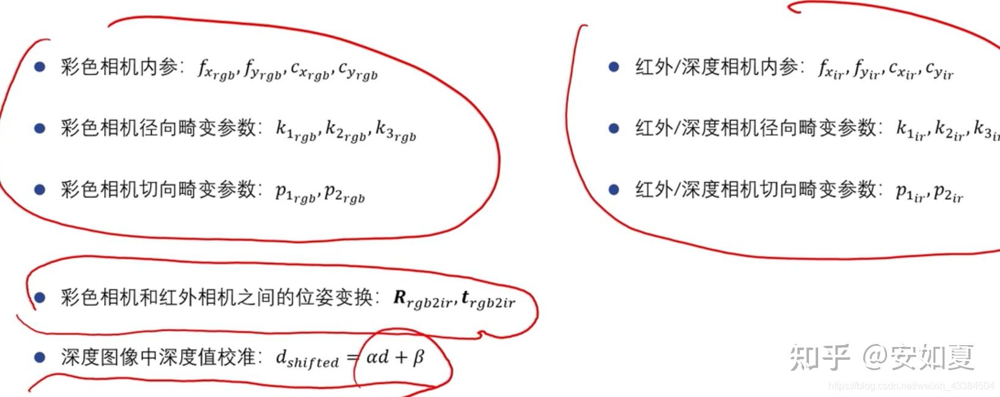

Ros环境下 kinect标定：[https://blog.csdn.net/Siyuada/article/details/78981555](https://link.zhihu.com/?target=https%3A//blog.csdn.net/Siyuada/article/details/78981555)

### 4.鱼眼相机模型

<b><font size=5>相机模型  </font></b>

<b><font size=5>模型矫正</font></b>

鱼眼相机模型和普通针孔相机模型的标定流程类似，内参矩阵一样，但是其畸变模型和普通相机不同，最主要的是在径向畸变上多一个高阶系数：
$$
\vec{\theta}d=\theta(1+k_1r^2+k_2r^4+k_3r^6+k_4r^8)
$$


### 5.全景相机模型

<b><font size=5>相机模型  </font></b>


<b><font size=5>模型矫正</font></b>

全景相机模型则很不一样。


相较于普通相机的像素平面，全景相机的是一个像素球面。其标定参数因相机而定，但是大部分的相机标定还是分为去畸变和像素面投影两步。

## ??????

==为什么高斯牛顿法的增量方程系数矩阵可能不正定？不正定有什么几何含义？为什么在这种情况下解就不稳定了？==

$JJ^T$是半正定的，当J为零向量时，不正定。

此时几何含义是代价函数在此点平坦，导数为0、这种情况下局部的近似为一条水平直线，无法确定参数的更新方向使代价下降。

==DogLeg是什么？它与高斯牛顿法和列文伯格-马夸尔特方法有什么异同？请搜索相关的材料。==

DogLeg是信赖区域（Trust-Region）方法的一种，包含了高斯牛顿法和最速下降法两种方法，通过引入信赖区域的概念，对两种方法计算得到的增量，在信赖区域进行加权得到新的增量并用于后续的迭代，因此计算得到的下降路径类似于DogLeg，所以被称为DogLeg方法。关于加权计算新增量的方法可以参考以下文章

https://blog.csdn.net/qq_35590091/article/details/94628887

https://www.numerical.rl.ac.uk/people/nimg/course/lectures/raphael/lectures/lec7slides.pdf

**DogLeg与高斯牛顿法和列文伯格-马夸尔特方法的异同**

- DogLeg包含了高斯牛顿法，当高斯牛顿法计算得到的增量在信赖区域时，DogLeg较为接近高斯牛顿法；不同的是DogLeg还包含了最速下降法，使得下降搜索方向和增量计算更加合理，算法更加鲁棒。
- 列文伯格-马夸尔特方法与DogLeg都引入了信赖区域的概念，都结合了高斯牛顿法和列文伯格-马卡尔特方法；不同的是DogLeg需要计算更多的中间量，但是在当前步长不满足约束时，DogLeg不需要重新计算Hessian矩阵。


# 二、前端跟踪


## 1.特征点法视觉里程计

### 一、特征提取

#### 0）FAST关键点

FAST 是一种角点，主要检测局部像素灰度变化明显的地方，以速度快著称。它的思想是：如果一个像素与它邻域的像素差别较大（过亮或过暗） , 那它更可能是角点。相比于其他角点检测算法， FAST 只需比较像素亮度的大小，十分快捷。

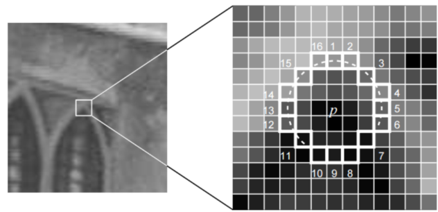


==提取的点并没有用到相邻点的信息==

==提取的点后面大部分又被剔除，而且ORBslam主要耗时就在这里，有改进的空间嘛？==

**ORB特征点做了哪些改进？**

1. FAST角点虽然快，但是特征点的数量很多且不确定。因此ORB中计算了FAST角点的Harris响应值，选取前N个具有最大响应值的角点。（也可以根据匹配结果汉明距离进行筛选？）
2. FAST角点不具有方向信息，因此ORB添加了旋转的描述，旋转不变性由灰度质心法（Intensity Centroid）实现。改进后称为Oriented FAST。
3. FAST角点没有提供描述子，ORB采用BRIEF描述子，同时为描述子添加了旋转不变性。即先算方向，基于方向算描述子，称为Steer BRIEF。
4. FAST角点不具有尺度信息，由于选取固定半径3，不同尺度下会对角点判定产生影响。因此ORB添加了尺度描述，尺度不变性通过构建图像金字塔，并在每一层进行角点检测。

#### 1）ORB特征

ORB（Oriented FAST and Rotated BRIEF） 特征亦由关键点和描述子两部分组成。它的关键点称为“Oriented FAST”，是一种改进的 FAST 角点，它的描述子称为 BRIEF（Binary Robust Independent Elementary Features）。

1. FAST 角点提取：找出图像中的” 角点”。相较于原版的 FAST, ORB 中计算了特征点的主方向，为后续的 BRIEF 描述子增加了旋转不变特性。
2. BRIEF 描述子：对前一步提取出特征点的周围图像区域进行描述。

##### **1.Harris响应值**

https://www.zhihu.com/question/37871386/answer/1281031275

##### **2.灰度质心法**

质心是以图像块灰度值作为权重的中心。

\1. 在一个小的图像块 B 中，定义图像块的矩为：
$$
m_{pq}=\sum_{x,y\in B}x^py^qI(x,y),~~~~~~~p,q={0,1}
$$
m10就是x与所有I的乘积之和，m00就是所有灰度之和。

\2. 通过矩可以找到图像块的质心：
$$
C=(\frac{m_{10}}{m_{00}},\frac{m_{01}}{m_{00}})
$$
\3. 连接图像块的几何中心 O 与质心 C，得到一个方向向量$\overline{OC}$，于是特征点的方向可以定义为：
$$
\theta=arctan(\frac{m_{01}}{m_{10}})
$$


特征点的方向为几何中心指向灰度质心。

##### **3.BRIEF描述子**

BRIEF是一种二进制描述子，它的描述向量由许多个 0 和 1 组成，这里的 0 和 1 编码了关键点附近两个像素（比如说 p 和 q）的大小关系：如果 p 比 q 大，则取 1，反之就取 0。如果我们取了 128 个这样的 p; q，最后就得到 128 维由 0， 1 组成的向量。

那么， p和 q 如何选取呢？

https://www.cnblogs.com/ronny/p/4081362.html

大体上都是按照某种概率分布，随机地挑选 p 和 q 的位置。

在ORB当中是先计算了关键点的方向，然后计算描述子，这样就具有了旋转不变性，

要计算很多旋转角下的描述子吗？？


##### **4.图像金字塔**


为了便于计算边界点，对原始图像（内部灰色）进行了扩充


上面是三种边界扩充方式，ORB选取第一种101。选取后两个显然不会提取到特征点。

图像金字塔是对原始图像按照该固定倍数逐层缩小，原始图像在底层


程序在一开始会指定需要提取的特征点数量，这些数量会根据每一层的面积均摊。


每一层计算完特征点之后，会映射特征点到第0层。

##### **5.特征点均匀化**

https://zhuanlan.zhihu.com/p/61738607

OpenCV并没有做均匀化

使用四叉树对特征点进行均匀化


**高斯模糊**

所谓"模糊"，可以理解成每一个像素都取周边像素的平均值。而高斯模糊，则是按照正态分布，给周围像素取一定的权重。


**高斯公式**
$$
G(x,y)=\frac{1}{2\pi\sigma^2}e^{-\frac{x^2+y^2}{2\sigma^2}}
$$
**如何避免角点扎堆？**

非极大值抑制（Non-maximal suppression），在一定区域内（四分裂最后的格子内的点）仅保留响应极大值的角点，避免角点集中的问题。

#### 2）Harris 

#### 3）Shi-Tomasi

### 二、特征匹配

描述子的相似度度量：用汉明距离（Hamming distance），两个二进制串之间的汉明距离，指的是它们不同位数的个数。

匹配方法：暴力匹配、快速近似最近邻（FLANN） 算法。

**特征提取匹配实践**

在利用OpenCV进行两张图像的ORB特征的提取匹配实验中，ORB特征提取花费22.9ms，匹配花费0.75ms，可见主要时间开销在特征提取。

在自己写的代码中，ORB特征提取花费3.9ms，匹配花费0.86ms，可见通用性和高效性是矛盾的。

**解决误匹配GMS**

Grid-based Motion Statistics，GMS

**参考**

Bian J W, Lin W Y, Matsushita Y, et al. Gms: Grid-based motion statistics for fast, ultra-robust feature correspondence[C]//Proceedings of the IEEE conference on computer vision and pattern recognition. 2017: 4181-4190.

[**https://zhuanlan.zhihu.com/p/220134467**](https://zhuanlan.zhihu.com/p/220134467)

首先给出一个假设：

运动平滑性：真实匹配的小邻域内匹配通常是在三维空间中的同一块区域。同样地，一个错误匹配的邻域内的匹配通常是几何上不同的三维位置。

这个假设告诉我们：正确匹配的邻域内有多个支持它的匹配，而错误匹配的邻域内支持它的匹配是很少的。这里其实隐含着一个逻辑：作者通过观察发现，正确匹配的邻域内匹配的数量多的概率就会很大，反之则少；那么根据贝叶斯法则，那些匹配对邻域内有很多匹配的匹配关系有很大概率是正确匹配。

一句话：**正确匹配周围会有较多的匹配去支持它，而错误的匹配周围支持它的匹配很少**。


经典的特征匹配算法(SIFT、SURF、ORB等)存在的问题是鲁棒的算法速度较慢，快速的算法鲁棒性较差。局部特征匹配算法的核心问题在于邻域一致性的运用，稀疏邻域一致性特征又不能很好的定义邻域，因此导致特征匹配算法计算量大。Grid-based Motion Statistics(GMS)通过网格划分、运动统计特性的方法可以迅速剔除错误匹配，以此来提高匹配的稳定性。GMS核心思想在于：根据运动平滑性，在正确匹配的特征点附加的正确匹配点对数应该大于错误匹配点的特征点附近的正确匹配点对数。GMS算法主要流程如下：

1 检测两幅图像特征点和计算描述子;

2 通过BF暴力匹配算法进行匹配;

3 将图像划分成G个网格;

4 通过计算BF匹配好的特征点 X i X_i 

**双目稀疏立体匹配**


**亚像素插值**

### 三、运动估计

1. 当相机为**单目**时，我们只知道 2D 的像素坐标，因而问题是根据两组 2D 点估计运动。该问题用**对极几何**来解决。
2. 如果我们有 **3D 点**和它们在相机**的投影位置**，也能估计相机的运动。该问题通过 **PnP**求解。
3. 当相机为**双目、 RGB-D** 时，或者某种方法得到了距离信息，可以根据两组 3D 点估计运动。该问题通常用 **ICP** 来解决。

#### 1）2D-2D：对极几何

**对极约束**

两帧图像I_1到I_2的运动为R21，t。O1、O2、P 三个点可以确定一个平面，红色三角称为**极平面**（Epipolar plane），蓝色称为像平面，e1、e2，称为极点（Epipoles），O1O2 被称为基线（Baseline）。l1、 l2 为极线（Epipolar line） 。


在第一帧的坐标系下，设 P 的空间位置为：
$$
P=[X,Y,Z]^T
$$
根据针孔相机模型，两个像素点 p1、 p2 的像素位置为：
$$
s_1p_1=KP\\
s_2p_2=K(RP+t)
$$
上式也可以写成在乘以非零常数下成立的（up to a scale）等式。（在等式一侧乘以任意非零常数时，我们认为等式仍是成立的。）

P可能出现在两条射线的任意位置。设P点在两个归一化平面上的坐标分别为x1，x2 （不太理解）
$$
x_1=K^{-1}p_1,~~~~x_2=K^{-1}p_2
$$
上式代入上上式得：
$$
x_2=Rx_1+t
$$


**检验两个点是否符合极线约束**
$$
\begin{align}
p_2^TK^{-T}t^\wedge RK^{-1}p_1&=0\\
p_2^TFp_1&=0\\
[u_1,v_1,1]*F_{12}*[u_2,v_2,1]^T&=0\\
[a,b,c]*[u_2,v_2,1]^T&=0\\
a*u_2+b*v_2+c&=0
\end{align}
$$
如果p2和p1满足极线约束，则p2在直线上。一般不在，可以算下点到直线的距离。
$$
d=\frac{\left| a*u_2+b*v_2+c\right|}{\sqrt{a^2+b^2}}
$$
如果d大于阈值则认为不满足极线约束。从而达到剔除误匹配的目的。


**本质矩阵E和基本矩阵F**

根据定义，本质矩阵 E = t^R。它是一个 3 × 3 的矩阵，内有 9 个未知数。那么，是不是任意一个 3 × 3 的矩阵都可以被当成本质矩阵呢？从 E 的构造方式上看，有以下值得注意的地方：

- 本质矩阵是由对极约束定义的。由于对极约束是等式为零的约束，所以对 E 乘以任意非零常数后， 对极约束依然满足。我们把这件事情称为 **E 在不同尺度下是等价的**。
- 根据 E = t^R，可以证明 [3]，本质矩阵 **E 的奇异值必定是 [σ; σ; 0]T 的形式**。这称为本质矩阵的内在性质。
- 另一方面，由于平移和旋转各有三个自由度，故 t^R 共有六个自由度。但由于尺度等价性，故 **E 实际上有五个自由度**。

E 具有五个自由度的事实，表明我们最少可以用五对点来求解 E。但是， E 的内在性质是一种非线性性质，在求解线性方程时会带来麻烦，因此，也可以只考虑它的尺度等价性，使用八对点来估计 E——这就是经典的八点法（Eight-point-algorithm）

**八点法**

八点法只利用了 E 的线性性质，因此可以在线性代数框架下求解。

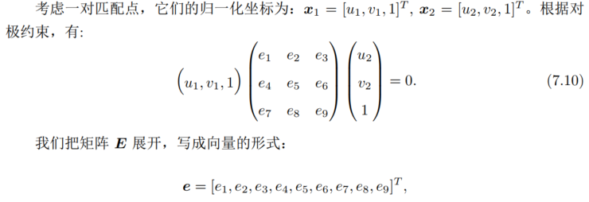

那么对极约束可以写成与 e 有关的线性形式：


这八个方程构成了一个线性方程组。它的系数矩阵由特征点位置构成，大小为 8 × 9。e 位于该矩阵的零空间中。如果系数矩阵是满秩的（即秩为 8），那么它的零空间维数为 1，也就是 e 构成一条线。这与 e 的尺度等价性是一致的。如果八对匹配点组成的矩阵满足秩为 8 的条件，那么 E 的各元素就可由上述方程解得。

**基础矩阵F总共有9个元素，7个自由度（尺度等价性，秩为2），所以8对点提供8个约束方程就可以求解F。**

接下来的问题是如何根据已经估得的本质矩阵 E，恢复出相机的运动 R; t。这个过程是由奇异值分解（SVD）得到的。设 E 的 SVD 分解为：


只有第一种解中， P 在两个相机中都具有正的深度。


从工程实现角度考虑，由于平时通常会有几十对乃至上百对的匹配点，从八对减至五对意义并不明显。


​    //基础矩阵的秩为2,而我们不敢保证计算得到的这个结果的秩为2,所以需要通过第二次奇异值分解,来强制使其秩为2

​    // 对初步得来的基础矩阵进行第2次奇异值分解

**对于多余八对点的情况**


于是就求出了在最小二乘意义下的 E 矩阵。不过，当可能存在误匹配的情况时，我们会更倾向于使用**随机采样一致性（Random Sample Concensus, RANSAC）** 来求，而不是最小二乘。 RANSAC 是一种通用的做法，适用于很多带错误数据的情况，可以处理带有错误匹配的数据。

**单应矩阵H**

单应矩阵（Homography）描述了两个平面之间的映射关系，若场景中的特征点都落在同一个平面上（比如墙、地面等），则可以通过单应矩阵来估计相机运动。比如无人机携带的俯视相机，扫地机携带的顶视相机。

共同平面满足：
$$
\textbf{n}^T\textbf{P}+d=0,~~~~\Rightarrow ~~~
-\frac{\textbf{n}^T\textbf{P}}{d}=1
$$
处于共同平面上的特征点p1和p2有：


于是，我们得到了一个直接描述图像坐标 p1 和 p2 之间的变换，把中间这部分记为H。
$$
H=K(R-\frac{tn^T}{d})K^{-1}\\
p_2=Hp_1
$$
它的定义与旋转、平移以及平面的参数有关。与基础矩阵 F 类似，单应矩阵 H 也是一个 3 × 3 的矩阵，求解时的思路也和 F 类似，同样地可以先根据匹配点计算 H，然后将它分解以计算旋转和平移。把上式展开，得：


请注意这里的等号是在非零因子下成立的。我们在实际处理中，通常乘以一个非零因子使得 h9 = 1（在它取非零值时）。然后根据第三行，去掉这个非零因子，于是有：


对于每一个等式，两边同时乘以分母，其中$u_2h_9=u_2$

这样一组匹配点对就可以构造出两项约束（事实上有三个约束，但是因为线性相关，只取前两个），于是自由度为 8 的单应矩阵可以通过 4 对匹配特征点算出（注意：这些特征点不能有三点共线的情况），即求解以下的线性方程组（当 h9 = 0 时，右侧为零）：


这种做法把 H 矩阵看成了向量，通过解该向量的线性方程来恢复 H，又称**直接线性变换法**（Direct Linear Transform）。与本质矩阵相似，求出单应矩阵以后需要对其进行分解，才可以得到相应的旋转矩阵 R 和平移向量 t。

与本质矩阵的分解类似，单应矩阵的分解同样会返回四组旋转矩阵与平移向量，并且同时可以计算出它们分别对应的场景点所在平面的法向量。如果已知成像的地图点的深度全为正值（即在相机前方），则又可以排除两组解。最后仅剩两组解，这时需要通过更多的先验信息进行判断。通常我们可以通过假设已知场景平面的法向量来解决，如场景平面与相机平面平行，那么法向量 n 的理论值为 1T。

单应性在 SLAM 中具重要意义。当特征点共面，或者相机发生纯旋转的时候，基础矩阵的自由度下降，这就出现了所谓的退化（degenerate）。现实中的数据总包含一些噪声，这时候如果我们继续使用八点法求解基础矩阵，基础矩阵多余出来的自由度将会主要由噪声决定。为了能够避免退化现象造成的影响，**通常我们会同时估计基础矩阵 F 和单应矩阵H，选择重投影误差比较小的那个作为最终的运动估计矩阵。**

分解得到的 R; t 一共有四种可能性。OpenCV 替我们使用三角化检测角点的深度是否为正，从而选出正确的解。

CVlife另一种推导过程：


写成齐次方程


**计算H矩阵为什么要对四对点归一化？**

矩阵A是利用8点法求基础矩阵的关键，所以Hartey就认为，利用8点法求基础矩阵不稳定的一个主要原因就是原始的图像像点坐标组成的系数矩阵A不好造成的，而造成A不好的原因是像点的齐次坐标各个分量的数量级相差太大。基于这个原因，Hartey提出一种改进的8点法，在应用8点法求基础矩阵之前，先对像点坐标进行归一化处理，即对原始的图像坐标做同向性变换，这样就可以减少噪声的干扰，大大的提高8点法的精度。

**预先对图像坐标进行归一化有以下好处：**

- 能够提高运算结果的精度
- 利用归一化处理后的图像坐标，对任何尺度缩放和原点的选择是不变的。归一化步骤预先为图像坐标选择了一个标准的坐标系中，消除了坐标变换对结果的影响。

归一化操作分两步进行，首先对每幅图像中的坐标进行平移（每幅图像的平移不同）使图像中匹配的点组成的点集的质心（Centroid）移动到原点；接着对坐标系进行缩放使得各个分量总体上有一样的平均值，各个坐标轴的缩放相同的。


**H矩阵的SVD分解**

   

```c++
// 目的 ：通过单应矩阵H恢复两帧图像之间的旋转矩阵R和平移向量T
// 参考 ：Motion and structure from motion in a piecewise plannar environment.
//        International Journal of Pattern Recognition and Artificial Intelligence, 1988
// https://www.researchgate.net/publication/243764888_Motion_and_Structure_from_Motion_in_a_Piecewise_Planar_Environment

// 流程:
//      1. 根据H矩阵的奇异值d'= d2 或者 d' = -d2 分别计算 H 矩阵分解的 8 组解
//        1.1 讨论 d' > 0 时的 4 组解
//        1.2 讨论 d' < 0 时的 4 组解
//      2. 对 8 组解进行验证，并选择产生相机前方最多3D点的解为最优解
```

#### 2）3D-2D：PnP

PnP（Perspective-n-Point）是求解 3D 到 2D 点对运动的方法。它描述了当我们知道n 个 3D 空间点以及它们的投影位置时，如何估计相机所在的位姿。

https://www.cnblogs.com/yepeichu/p/10746952.html

3D中的空间点可以来自对极几何的三角化也可以来自深度相机，因此在单目视觉中需要初始化。

对极几何需要至少8对点，PnP方法至少需要3对点。

| 方法  | 点数    | 优点                 | 缺点                 |
| :---: | ------- | -------------------- | -------------------- |
|  DLT  | 6对点   |                      |                      |
|  P3P  | 3对+ICP | 把PnP问题转为ICP问题 |                      |
| EPNP  | 4对点   |                      |                      |
| UPnP  |         |                      |                      |
| MLPnP | 至少6对 |                      |                      |
|  BA   |         |                      | 上述结果作为BA的初值 |

在 SLAM 当中，通常的做法是**先使用 P3P/EPnP 等方法估计相机位姿，然后构建最小二乘优化问题对估计值进行调整（Bundle Adjustment）**。接下来我们从非线性优化角度来看一下 PnP 问题。

BA优化是全局优化，是对PnP、ICP的结果进行整体优化。在PnP中，这个BA是最小化重投影误差.

##### **1.DLT**

直接线性变换法

空间点P = (X; Y; Z; 1)T，投影到特征点 x1 = (u1; v1; 1)T，定义增广矩阵 [R|t] 为一个 3 × 4 的矩阵。

由相机模型可得：


这里的增广矩阵就是投影矩阵，后面不用简化表示，直接写更好统一记忆。


$$
\begin{align}
Xt_1+Yt_2+Zt_3+t~~~~~~~~~~~~~~~~~~~~~~~-Xu_1t_9-u_1Yt_{10}-Zt_{11}    -u_1t_{12}&=0\\
Xt_5+Yt_6+Zt7+t8-Xv_1t_9-v_1Yt_{10} -v_1Zt_{11}-v_1t_{12}&=0
\end{align}
$$
由于 t 一共有 12 维，因此最少通过六对匹配点，即可实现矩阵 T 的线性求解，这种方法（也）称为直接线性变换（Direct Linear Transform， DLT）。当匹配点大于六对时，（又）可以使用 SVD 等方法对超定方程求最小二乘解。

在 DLT 求解中，我们直接将T矩阵看成了12个未知数，忽略了它们之间的联系。因为旋转矩阵 R=SO(3)，用 DLT 求出的解不一定满足该约束，它是一个一般矩阵。平移向量比较好办，它属于向量空间。对于旋转矩阵 R，我们必须针对DLT估计的T的左边3 × 3 的矩阵块，寻找一个最好的旋转矩阵对它进行近似。这可以由 QR 分解完成 [3, 48]，相当于把结果从矩阵空间重新投影到 SE(3) 流形上，转换成旋转和平移两部分。

##### **2.P3P**

仅使用三对匹配点，对数据要求较少。该过程不会直接求得R，t，只是根据世界坐标系下的ABC三点的到其相机坐标，即转化为3D-3D的情况，用ICP求解。


此外， P3P 还需要使用一对验证点，以从可能的解出选出正确的那一个（类似于对极几何情形）。记验证点对为 D - d，相机光心为 O。请注意，我们知道的是A; B; C 在世界坐标系中的坐标，而不是在相机坐标系中的坐标。

三角形之间存在对应关系：


由于我们知道 2D 点的图像位置，三个余弦角cos ⟨a; b⟩ ; cos ⟨b; c⟩ ; cos ⟨a; c⟩ 是已知的。同时， u = BC2/AB2; w = AC2/AB2 可以通过A; B; C 在世界坐标系下的坐标算出，变换到相机坐标系下之后，并不改变这个比值。该式中的 x; y 是未知的，随着相机移动会发生变化。因此，该方程组是关于 x; y 的一个二元二次方程（多项式方程）。解析地求解该方程组是一个复杂的过程，需要用吴消元法。这里不展开对该方程解法的介绍，感兴趣的读者请参照 [45]。类似于分解 E 的情况，该方程最多可能得到四个解，但我们可以用验证点来计算最可能的解，得到 A; B; C 在相机坐标系下的 3D 坐标。然后，根据 3D-3D 的点对，计算相机的运动 R; t。

从 P3P 的原理上可以看出，为了求解 PnP，我们利用了三角形相似性质，求解投影点 a; b; c 在相机坐标系下的 3D 坐标，最后把问题转换成一个 3D 到 3D 的位姿估计问题。后文将看到，带有匹配信息的 3D-3D 位姿求解非常容易，所以这种思路是非常有效的。其他的一些方法，例如 EPnP，亦采用了这种思路。

然而， P3P 也存在着一些问题：

1. P3P 只利用三个点的信息。当给定的配对点多于 3 组时，难以利用更多的信息。
2. 如果 3D 点或 2D 点受噪声影响，或者存在误匹配，则算法失效。

所以后续人们还提出了许多别的方法，如 EPnP、 UPnP 等。它们利用更多的信息，而且用迭代的方式对相机位姿进行优化，以尽可能地消除噪声的影响。不过，相对于 P3P 来说，原理会更加复杂一些，所以我们建议读者阅读原始的论文，或通过实践来理解 PnP 过程。

在 SLAM 当中，通常的做法是**先使用 P3P/EPnP 等方法估计相机位姿，然后构建最小二乘优化问题对估计值进行调整（Bundle Adjustment）**。接下来我们从非线性优化角度来看一下 PnP 问题。

BA优化是全局优化，是对PnP、ICP的结果进行整体优化。在PnP中，这个BA是最小化重投影误差


##### **3.EPnP**

（Efficient PnP）

论文EPnP: Accurate Non-Iterative O(n) Solution to the PnP Problem

**输入：**

\1. 个世界坐标系下的3D点，论文中称为3D参考点

\2. 这 个3D点投影在图像上的2D坐标

\3. 相机内参矩阵 ，包括焦距和主点

**输出：**相机的位姿

**应用：**特征点的图像跟踪，需要实时处理有噪声的特征点，对计算精度和效率要求比较高，只需4对匹配点即可求解。

**优点：**

\1. 只需要4对非共面点，对于平面只需要3对点

\2. 闭式解（解析解），不需要迭代，不需要初始估计值。

\3. 精度比较高。和迭代法里精度最高的方法LHM方法精度相当。

\4. 比较鲁棒，可以处理带噪声的数据。迭代法受到初始估计的影响比较大，会不稳定

\5. 线性计算复杂度为O(n)

\6. 平面和非平面都适用

**原理和步骤：**

参考《ORB-SLAM2源码解析》6.4节

精度


复杂度


ORB-SLAM2就是用EPnP+GN

**EPnP**

**原理和步骤**

我们目前知道n个世界坐标系下的3D点及其在图像上的2D投影点，还有相机内参，目的是为了求世界坐标系到相机坐标系下的位姿变换R、t。

EPnP的思路就是先把2D图像点通过内参变换到相机坐标系下的3D点，然后用ICP来求解3D-3D的变换就得到了位姿。那么问题的核心就转化为如何通过2D信息，加上一些约束，来得到相机坐标系下的3D点。因为我们这里的位姿变换是欧式空间下的刚体变换，所以点之间的相对距离信息在不同坐标系下是不变的。我们称之为**刚体结构不变性**。后面就是紧紧围绕这个特性来求解的。

1. 首先我们对3D点的表达方式进行了新的定义。之前不管是世界坐标系还是相机坐标系下的3D点，它们都是相对于自己坐标系下的原点的。那么两个坐标系原点不同，坐标的量级可能差异非常大，比如相机坐标系下3D点坐标范围可能是10-100之间，世界坐标系下坐标可能是1000-10000之间，这对求解优化都是不利的。所以我们要统一一下量级。可以理解为归一化吧，这在求基础矩阵、单应矩阵时都是常规手段。具体来说，我们对每个坐标系定义**4个控制点**，其中一个是质心（也就是各个方向均值），其他3个用PCA从三个主方向选取，这4个控制点可以认为是参考基准，类似于坐标系里的基。所有的3D点都表达为这4个参考点的线性组合。这些系数我们称之为权重，为了不改变数据的相对距离，权重和必须为1。这样，我们就可以**用世界坐标系或相机坐标系下的4个控制点表示所有的世界坐标系或相近坐标系下的3D点**。
2. 利用投影方程将图像2D点恢复相机坐标系下3D点（未知量）。经过整理后，一组点对可以得到2个方程。我们待求的相机坐标系下3D点对应的4个控制点，每个控制点3个分量，总共12个未知数组成的一个向量。
3. 用SVD分解可以求解上述向量，但是因为恢复的相机坐标系下3D点还有个尺度因子/beta， 这里我们根据结构信息不变性作为约束，求解。
4. 最后用高斯牛顿法优化上述求解的/beta。

注：ORB-SLAM里使用的EPnP是直接拷贝OpenCV里的源码：modules → calib3d → src → epnp.cpp

**统一变量格式**


**控制点如何选取？**

理论上，控制点的坐标可以任意选取。但在实践中，作者发现了一种可以提高结果稳定性的控制点选择方法。具体如下


**计算控制点系数，用控制点重新表达数据**


所以一下结论成立


**透视投影关系构建约束**


根据最后一行可以推出


**求解EPnP**

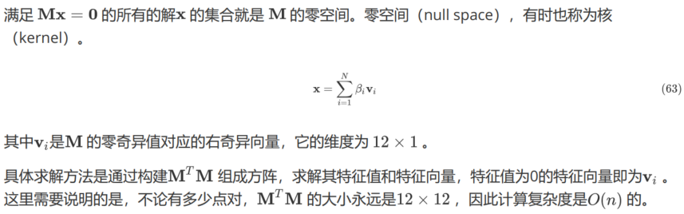

**如何确定N**

因为每个点对可以得到2个约束方程，总共有12个未知数，所以如果有6组点对，我们就能直接求解，此时 。如果相机的焦距逐渐增大，相机模型更趋近于使用正交相机代替透视相机，零空间的自由度就会增加到 。

。。。

##### **BA**

前面说的线性方法，往往是先求相机位姿，再求空间点位置。而非线性优化则是把它们都看成优化变量，放在一起优化，这中思想也就是BA的字面意思--集束调整。这是一种非常通用的求解方式，我们可以用它对 PnP 或 ICP 给出的结果进行优化。


考虑 n 个三维空间点 P 和它们的投影 p，我们希望计算相机的位姿 R; t，它的李代数表示为 ξ。假设某空间点坐标为 Pi = [Xi; Yi; Zi]T ，其投影的像素坐标为 ui = [ui; vi]T 。根据第五章的内容，像素位置与空间点位置的关系如下：


该问题的误差项，是将像素坐标（观测到的投影位置）与 3D 点按照当前估计的位姿进行投影得到的位置相比较得到的误差，所以称之为**重投影误差**。当时用齐次坐标时，这个误差有 3 维。不过，由于 u 最后一维为 1，该维度的误差一直为零，因而我们更多时候使用非齐次坐标，于是误差就只有 2 维了。调整相机的位姿，使得这个距离变小。这个调整需要考虑很多个点，所以最后每个点的误差通常都不会精确为零。

使用李代数，可以构建无约束的优化问题，很方便地通过 G-N, L-M 等优化算法进行求解。不过，在使用 G-N 和 L-M 之前，我们需要知道每个误差项关于优化变量的导数，也就是**线性化**：


首先，记变换到相机坐标系下的空间点坐标为 P ′，并且把它前三维取出来：


这里的 ⊕ 指李代数上的左乘扰动。第一项是误差关于投影点的导数，在式（7.40）已经列出了变量之间的关系，易得：


这个雅可比矩阵描述了重投影误差关于相机位姿李代数的一阶变化关系。我们保留了前面的负号，因为这是由于误差是由观测值减预测值定义的。它当然也可反过来，定义成“预测减观测”的形式。在那种情况下，只要去掉前面的负号即可。此外，如果 se(3) 的定义方式是旋转在前，平移在后时，只要把这个矩阵的前三列与后三列对调即可。

另一方面，除了优化位姿，我们还希望优化特征点的空间位置。因此，需要讨论 e 关于空间点 P 的导数。所幸这个导数矩阵相对来说容易一些。仍利用链式法则，有：


上面推导了**观测相机方程关于相机位姿与特征点的两个导数矩阵**。它们十分重要，能够在优化过程中提供重要的梯度方向，指导优化的迭代。

#### 3）3D-3D：ICP

假设我们有一组配对好的 3D 点（比如我们对两个 RGB-D 图像进行了匹配）：


这个问题可以用迭代最近点（Iterative Closest Point, ICP）求解。**仅考虑两组 3D 点之间的变换时，和相机并没有关系。**

在激光 SLAM 中也会碰到 ICP，不过由于激光数据特征不够丰富，我们无从知道两个点集之间的匹配关系，只能认为距离最近的两个点为同一个，所以这个方法称为迭代最近点。

和 PnP 类似， ICP 的求解也分为两种方式：利用线性代数的求解（主要是 SVD），以及利用非线性优化方式的求解（类似于 Bundle Adjustment）。

**一、SVD求解**


我们看到，只要求出了两组点之间的旋转，平移量是非常容易得到的。所以我们重点关注 R 的计算。展开关于 R 的误差项，得：


**二、BA求解（非线性优化方法）**

求解 ICP 的另一种方式是使用非线性优化，以迭代的方式去找最优值。该方法和我们前面讲述的 PnP 非常相似。以李代数表达位姿时，目标函数可以写成：


于是，在非线性优化中只需不断迭代，我们就能找到极小值。而且，可以证明 [6]， ICP问题存在唯一解或无穷多解的情况。在唯一解的情况下，只要我们能找到极小值解，那么这个极小值就是全局最优值——因此不会遇到局部极小而非全局最小的情况。这也意味着ICP 求解可以任意选定初始值。这是已经匹配点时求解 ICP 的一大好处。

需要说明的是，我们这里讲的 ICP，是指已经由图像特征给定了匹配的情况下，进行位姿估计的问题。在匹配已知的情况下，这个最小二乘问题实际上具有解析解 [52, 53, 54]，所以并没有必要进行迭代优化。 ICP 的研究者们往往更加关心匹配未知的情况。不过，在RGB-D SLAM 中，由于一个像素的深度数据可能测量不到，所以我们可以混合着使用 PnP和 ICP 优化：对于深度已知的特征点，用建模它们的 3D-3D 误差；对于深度未知的特征点，则建模 3D-2D 的重投影误差。于是，可以将所有的误差放在同一个问题中考虑，使得求解更加方便。

## 2.直接法视觉里程计

**特征点法相比于直接法有什么缺点？**

1. 关键点的提取与描述子的计算非常耗时。整个SLAM一大半的时间都花在特征点的计算上。
2. 使用特征点则意味着忽略了出特征点以外的所有信息。
3. 在没有明显纹理的地方，特征提取困难。比如一堵白墙，空荡的走廊。

在使用特征点法估计相机运动时，通过**最小化重投影误差（Reprojection error）**来优化相机运动。而直接法不需要知道点与点之间的匹配关系，通过**最小化光度误差（Photometric error）**来求得它们。

直接法根据像素的亮度信息，估计相机的运动，可以完全不用计算关键点和描述子，于是，既避免了特征的计算时间，也避免了特征缺失的情况。只要场景中存在明暗变化（可以是渐变，不形成局部的图像梯度），直接法就能工作。根据使用像素的数量，直接法分为**稀疏、稠密**和**半稠密**三种。相比于特征点法只能重构稀疏特征点（稀疏地图），直接法还具有恢复稠密或半稠密结构的能力。

### LK光流

直接法是从光流（Optical Flow）演变而来的，光流是一种描述像素随着时间，在图像之间运动的方法。计算部分像素运动的

称为**稀疏光流**，计算所有像素的称为**稠密光流**。稀疏光流以 Lucas-Kanade 光流为代表，并可以在 SLAM 中用于跟踪特征点位置。


在 LK 光流中，图像可以看成关于时间的函数。一个在 t 时刻，位于 (x; y) 处的像素，它的灰度可以写成：

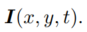

**灰度不变假设**：同一个空间点的像素灰度值，在各个图像中是固定不变的。

对于 t 时刻位于 (x; y) 处的像素，我们设 t + dt 时刻，它运动到 (x + dx; y + dy) 处。

由于灰度不变，我们有：


其中 dx/dt 为像素在 x 轴上运动速度，而 dy/dt 为 y 轴速度，把它们记为 u; v。同时 @I/@x 为图像在该点处 x 方向的梯度，另一项则是在 y 方向的梯度，记为 Ix; Iy。

图像灰度对时间的变化量记为 $I_t$，写成矩阵形式，有：


我们想计算的是像素的运动 u; v，但是该式是带有两个变量的一次方程，仅凭它无法计算出 u; v。因此，必须引入额外的约束来计算 u; v。在 LK 光流中，我们假设某一个窗口内的像素具有相同的运动。


这样就得到了像素在图像间的运动速度 u; v。当 t 取离散的时刻而不是连续时间时，我们可以估计某块像素在若干个图像中出现的位置。由于像素梯度仅在局部有效，所以如果一次迭代不够好的话，我们会多迭代几次这个方程。在 SLAM 中， LK 光流常被用来跟踪角点的运动。


### KLT光流

也是基于灰度不变性假设，最小化灰度误差。

标准的KLT光流要求相机运动很小，更鲁棒的跟踪可以利用图像金字塔技术，首先在最上层跟踪，跟踪结果作为下一层的初值，不断迭代到最底层。

### 直接法

（Direct Methods）

考虑某个空间点 P 和两个时刻的相机。 P 的世界坐标为 [X; Y; Z]，它在两个相机上成像，记非齐次像素坐标为 p1; p2。我们的目标是求第一个相机到第二个相机的相对位姿变换。我们以第一个相机为参照系，设第二个相机旋转和平移为 R; t，


其中 Z1 是 P 的深度， Z2 是 P 在第二个相机坐标系下的深度，也就是 RP + t 的第三个坐标值。由于 exp(ξ^) 只能和齐次坐标相乘，所以我们乘完之后要取出前三个元素。这和上一讲以及相机模型部分的内容是一致的。

直接法的思路是根据当前相机的位姿估计值，来寻找 p2 的位置。但若相机位姿不够好， p2 的外观和 p1 会有明显差别。于是，为了减小这个差别，我们优化相机的位姿，来寻找与 p1 更相似的 p2。这同样可以通过解一个优化问题，但此时最小化的不是重投影误差，而是**光度误差（Photometric Error）**，也就是 P 的两个像的亮度误差：


同样的，优化目标为该误差的二范数


使用李代数上的扰动模型。我们给 exp(ξ) 左乘一个小扰动 exp(δξ)


（未完待续。。）


## 3.IMU预积分

### 一、IMU简介

**IMU的特点**

| 传感器类型 | 优点               | 缺点                   |
| ---------- | ------------------ | ---------------------- |
| 轮速       | 精度高一些         | 二维数据               |
| GPS        | 直接输出绝对位置   | 精度差                 |
| IMU        | 频率高、短时精度好 | 无绝对信息，累积误差大 |

轮速适合与地面的小车搭配，与二维激光传感器搭配，IMU是最适合与视觉互补的。

**IMU内参**

| 参数     | 说明                       |
| -------- | -------------------------- |
| 噪声     | 所有传感器都有             |
| 随机游走 | 由于环境导致IMU数据有偏置  |
| scale    | 实际数值和输出值之间的比值 |

内参标定方法：把IMU静置平放两个小时以上（2-6个小时），就可以得到内参。因为噪声是随机的，假设服从高斯分布，标定得到的是方差。

> 内参标定工具：https://github.com/rpng/kalibr_allan
>
> 外参标定工具：https://github.com/ethz-asl/kalibr

IMU会受气压、温度等影响，所以上万的IMU都会搭配气压计和温度计。

IMU内参一般有四个数：__陀螺仪的噪声，加速度计的噪声，陀螺仪的随机游走，加速度计的随机游走__。噪声好理解，但是随机游走是因为IMU过于灵敏，这个偏置不同时刻也不同，无法建模，但可以通过某种手段进行预测。

```yaml
@Euroc.yaml
# Transformation from camera to body-frame (imu)
# 因为一般有IMU的系统，会把IMU坐标系作为body-frame（本体）
Tbc: !!opencv-matrix
   rows: 4
   cols: 4
   dt: f
   data: [0.0148655429818, -0.999880929698, 0.00414029679422, -0.0216401454975,
         0.999557249008, 0.0149672133247, 0.025715529948, -0.064676986768,
        -0.0257744366974, 0.00375618835797, 0.999660727178, 0.00981073058949,
         0.0, 0.0, 0.0, 1.0]

# IMU noise
IMU.NoiseGyro: 1.7e-4 #1.6968e-04 
IMU.NoiseAcc: 2.0000e-3 #2.0e-3
IMU.GyroWalk: 1.9393e-05 
IMU.AccWalk: 3.0000e-03 # 3e-03
IMU.Frequency: 200
```


```C++
@ ORB3/Tracking.cc
const float sf = sqrt(freq);
cout << endl;
cout << "IMU frequency: " << freq << " Hz" << endl;
cout << "IMU gyro noise: " << Ng << " rad/s/sqrt(Hz)" << endl;
cout << "IMU gyro walk: " << Ngw << " rad/s^2/sqrt(Hz)" << endl;
cout << "IMU accelerometer noise: " << Na << " m/s^2/sqrt(Hz)" << endl;
cout << "IMU accelerometer walk: " << Naw << " m/s^3/sqrt(Hz)" << endl;

// 噪声从连续到离散差了一个sqrt(freq)   而随机游走从连续到离散差了一个 1/sqrt(freq)
mpImuCalib = new IMU::Calib(Tbc,Ng*sf,Na*sf,Ngw/sf,Naw/sf);
```


### 二、IMU预积分推导

#### 1. 推导前公式

式1.1 向量的反对称矩阵
$$
\bf{w}^{\wedge}=\begin{bmatrix}
w_1 \\
 w_2\\
 w_3
\end{bmatrix}
=\begin{bmatrix}
0 & -w_3 & w_2\\
w_3 & 0	&	-w_1\\
-w_2	&w_1	&0\\
\end{bmatrix}\\
\label{向量的反对称矩阵}
$$

```c++
/** 
 * @brief 计算反对称矩阵
 * @param v 3维向量
 * @return 反对称矩阵
 */
cv::Mat Skew(const cv::Mat &v)
{
    const float x = v.at<float>(0);
    const float y = v.at<float>(1);
    const float z = v.at<float>(2);
    return (cv::Mat_<float>(3,3) << 0, -z, y,
            z, 0, -x,
            -y,  x, 0);
}
```

式1.2
$$
\bf{a}^{\wedge}\cdot \bf{b}=-\bf{b}^{\wedge}\cdot \bf{a}
\label{1.2}
$$
李代数到旋转矩阵

式1.3 当$\vec{\phi}$是小量时
$$
Exp(\vec{\phi})=exp(\vec{\phi}^{\wedge})\approx I+\vec{\phi}^{\wedge}
\label{1.3}
$$

> 注意：当输入是$\vec{\phi}$时，用Exp()，当输入是$\vec{\phi}^{\wedge}$时，用exp()。

```C++
//在ORB3中，当\phi的模小于0.0001的时候就认为是小量。
const float eps = 1e-4;
/** 
 * @brief 计算SO3
 * @param xyz 李代数
 * @return SO3
 */
cv::Mat ExpSO3(const float &x, const float &y, const float &z)
{
    cv::Mat I = cv::Mat::eye(3,3,CV_32F);
    const float d2 = x*x+y*y+z*z;
    const float d = sqrt(d2);
    cv::Mat W = (cv::Mat_<float>(3,3) << 0, -z, y,
                 z, 0, -x,
                 -y,  x, 0);
    if(d<eps)
        return (I + W + 0.5f*W*W);  //当\phi是小量时
    else
        return (I + W*sin(d)/d + W*W*(1.0f-cos(d))/d2); //当\phi不是小量时
}

/** 
 * @brief 计算so3
 * @param R SO3
 * @return so3
 */
cv::Mat LogSO3(const cv::Mat &R)
{
    const float tr = R.at<float>(0,0)+R.at<float>(1,1)+R.at<float>(2,2);
    cv::Mat w = (cv::Mat_<float>(3,1) <<(R.at<float>(2,1)-R.at<float>(1,2))/2,
                                        (R.at<float>(0,2)-R.at<float>(2,0))/2,
                                        (R.at<float>(1,0)-R.at<float>(0,1))/2);
    const float costheta = (tr-1.0f)*0.5f;
    if(costheta>1 || costheta<-1)
        return w;
    const float theta = acos(costheta);
    const float s = sin(theta);
    if(fabs(s)<eps)
        return w;
    else
        return theta*w/s;
}
```

式1.4,1.5当$\delta\vec{\phi}$是小量时
$$
Exp(\vec{\phi}+\delta\vec{\phi})\approx Exp(\vec{\phi})\cdot Exp(J_r(\vec{\phi})\cdot \delta\vec{\phi})\\
Exp(\vec{\phi})\cdot Exp(\delta\vec{\phi})=Exp(\vec{\phi}+J_r^{-1}(\vec{\phi})\cdot \delta\vec{\phi})
\label{1.4}
$$

> 其中$J_r^{-1}$并不表示逆，只是标识

式1.6，1.7其中
$$
J_r(\vec{\phi})=I-\frac{1-cos(\left\| \vec{\phi}\right\|)}{\left\|\vec{\phi}\right\|^2}\vec{\phi}^{\wedge}+
\left(\frac{\left\|\vec{\phi}\right\|-sin(\left\| \vec{\phi}\right\|)}{\left\|\vec{\phi}\right\|^3}\right)(\vec{\phi}^{\wedge})^2
\\J_r^{-1}(\vec{\phi})=I+\frac{1}{2}\vec{\phi}^{\wedge}+
\left(\frac{1}{\left\|\vec{\phi}\right\|^2}-
\frac{1+cos(\left\|\vec{\phi}\right\|)}{2\cdot\left\|\vec{\phi}\right\|\cdot sin \left(\left\|\vec{\phi}\right\|\right)}
\right)
(\vec{\phi}^{\wedge})^2

\label{1.6}
$$
式1.8,1.9 当$\vec{\phi}$是小量时
$$
J_r(\vec{\phi}) \approx I\\
J_r^{-1}(\vec{\phi})\approx I

\label{1.8}
$$

```C++
/** 
 * @brief 计算右雅可比
 * @param xyz 李代数
 * @return Jr
 */
cv::Mat RightJacobianSO3(const float &x, const float &y, const float &z)
{
    cv::Mat I = cv::Mat::eye(3,3,CV_32F);
    const float d2 = x*x+y*y+z*z;
    const float d = sqrt(d2);
    cv::Mat W = (cv::Mat_<float>(3,3) << 0, -z, y,
                 z, 0, -x,
                 -y,  x, 0);
    if(d<eps)
    {
        return cv::Mat::eye(3,3,CV_32F);
    }
    else
    {
        return I - W*(1.0f-cos(d))/d2 + W*W*(d-sin(d))/(d2*d);
    }
}
/** 
 * @brief 计算右雅可比的逆
 * @param xyz so3
 * @return Jr^-1
 */
cv::Mat InverseRightJacobianSO3(const float &x, const float &y, const float &z)
{
    cv::Mat I = cv::Mat::eye(3,3,CV_32F);
    const float d2 = x*x+y*y+z*z;
    const float d = sqrt(d2);
    cv::Mat W = (cv::Mat_<float>(3,3) << 0, -z, y,
                 z, 0, -x,
                 -y,  x, 0);
    if(d<eps)
    {
        return cv::Mat::eye(3,3,CV_32F);
    }
    else
    {
        return I + W/2 + W*W*(1.0f/d2 - (1.0f+cos(d))/(2.0f*d*sin(d)));
    }
}

```


式1.10,1.11 
$$
\textbf{R} \cdot Exp(\vec{\phi})\cdot \textbf{R}^T=exp(\textbf{R}\vec{\phi}^{\wedge}\textbf{R}^T)
=Exp(\textbf{R}\vec{\phi})\\
Exp(\vec{\phi})\cdot \textbf{R}=\textbf{R}\cdot Exp(\textbf{R}^T\vec{\phi})

\label{1.10}
$$

#### 2.IMU预积分

首先看下积分

**旋转：**
$$
\textbf{R}_j=\textbf{R}_i\cdot \prod^{j-1}_{k=i}Exp((\widetilde{\boldsymbol{\omega}}_k-\textbf{b}_k^g-\boldsymbol{\eta}_k^{gd})\cdot\Delta t)
$$
$R_j$可以理解为j时刻的相机位姿，从i时刻到j时刻的变换如上式。角速度$\widetilde{\boldsymbol{\omega}}$上波浪表示角速度计的原始读数。k从j-1到i为IMU的角速度$\omega$的积分（每个时刻乘以△t），b表示偏置，$\eta$表示误差，Exp把旋转向量变成旋转矩阵。

**速度：**
$$
\textbf{v}_j=\textbf{v}_i+\textbf{g}\cdot\Delta t_{ij}+ 
\sum_{k=i}^{j-1}\textbf{R}_{wk}\cdot
((\widetilde{\boldsymbol{f}}_k-\textbf{b}_k^g-\boldsymbol{\eta}_k^{gd})\cdot\Delta t
\\
\Delta t_{ij}=\sum_{k=i}^{j-1}\Delta t=(j-i)\Delta t
$$
（高中计算速度公式，v1=v0+g△t），f表示加速度计的原始读数。

*里面乘R的原因是*，我们读数都是IMU坐标系下的，我们要算的是世界坐标系下的。

g表示重力加速度，因为f里面包含了重力，+g△t是为了排除重力。

**位置：**
$$
\textbf{p}_{wj}=\textbf{p}_{wi}+\sum^{j-1}_{k=i}\textbf{v}_k\cdot \Delta t+
\frac{j-i}{2}\textbf{g}\cdot\Delta t^2+
\frac{1}{2}\sum^{j-1}_{k=i}\textbf{R}_{wk}\cdot
(\widetilde{\boldsymbol{f}}_k-\textbf{b}_k^a-\boldsymbol{\eta}_k^{ad})
\cdot\Delta t^2
\\=
\textbf{p}_{wi}+\sum^{j-1}_{k=i}
\left[\textbf{v}_k\cdot \Delta t+
\frac{1}{2}\textbf{g}\cdot\Delta t^2+
\frac{1}{2}\textbf{R}_{wk}\cdot
(\widetilde{\boldsymbol{f}}_k-\textbf{b}_k^a-\boldsymbol{\eta}_k^{ad})
\cdot\Delta t^2
\right]
$$
（高中计算位移公式，x1=x0+v△t+1/2a*t^2）Pj表示第j时刻的位置

由积分引出预积分，预积分里面的每一项与起始状态无关，可以认为都是相对量，这个好处在于计算预积分时**不需要考虑起始状态**，值得注意的是关于速度与位置的**预积分里面都包含了重力**。

预积分计算方式：

1、消除第 i 时刻对积分的影响

2、保留重力的影响

==a 旋转==
$$
\Delta\textbf{R}_{ij} \overset{\underset{\mathrm{\Delta}}{}}{=}
\textbf{R}_{wi}^T\textbf{R}_{wj}
=\prod^{j-1}_{k=i}Exp((\widetilde{\boldsymbol{\omega}}_k-\textbf{b}_k^g-\boldsymbol{\eta}_k^{gd})\cdot\Delta t)
$$

==b 速度==
$$
\begin{align}
\Delta\textbf{v}_{ij} &\overset{\underset{\mathrm{\Delta}}{}}{=}
\textbf{R}_{wi}^T(\textbf{v}_j-\textbf{v}_i-\textbf{g}\cdot\Delta t_{ij})
\\&=
\sum_{k=i}^{j-1}\Delta\textbf{R}_{ik}\cdot
((\widetilde{\boldsymbol{f}}_k-\textbf{b}_k^a-\boldsymbol{\eta}_k^{ad})\cdot\Delta t
\end{align}
$$

再把平衡的重力考虑回来，所以$-\textbf{g}\cdot\Delta t_{ij}$

==c 位置==
$$
\begin{align}
\Delta\textbf{p}_{ij} &\overset{\underset{\mathrm{\Delta}}{}}{=}
\textbf{R}_{i}(\textbf{p}_{j}-\textbf{p}_{i}-\textbf{v}_{i}\Delta t_{ij}-\frac{1}{2}\textbf{g}\cdot \Delta t^2_{ij})\\
&=
\sum^{j-1}_{k=i}
\left[\textbf{v}_{ik}\cdot \Delta t+
\frac{1}{2}\Delta\textbf{R}_{ik}\cdot
(\widetilde{\boldsymbol{f}}_k-\textbf{b}_k^a-\boldsymbol{\eta}_k^{ad})
\cdot\Delta t^2
\right]
\end{align}
$$

关于位置的预积分推到时要注意对于g的处理，其中要利用到等差数列求和的公式，公式如下：
$$
\frac{j-i}{2}-\frac{(j-i)^2}{2}=
-\frac{(j-i)[j-(i+1)]}{2}=
-\sum^{j-1}_{k=i}(k-i)
$$


#### 3.噪声分离

对于VIO来说，优化的状态有15位，3位位置，3位姿态，3位的速度，另外6位是加速度计和陀螺仪的偏置。

**噪声分离的目的：**

预积分公式描述了其模型，但是包含噪声的模型并不能用于计算，怎么处理噪声，通过滤波或优化的方法，会用到__信息矩阵=协方差矩阵的逆__。信息矩阵记录了噪声的权重，因此需要求协方差矩阵，从而求信息矩阵。

具体来说，上面推预积分时对imu的读数会减去它的偏置与误差，其中偏置可以作为状态量去得出，但是误差是没有办法得出的，我们能做的就是拿到imu数据减去偏置后直接使用，通常的办法就是通过计算误差的方式过滤掉这部分误差，无论是优化还是滤波都跳不过一个重要的矩阵——预积分的信息矩阵（协方差矩阵的逆）由于假设了噪声是高斯白噪声，所以噪声的方差对状态方差的影响可以通过高斯分布推理过来。本节我们的目的就是推导出标定好的imu噪声对预积分的影响，也就是预积分的偏差关于噪声的式子，下一节推出协方差方差的关系。

由于假设了噪声为高斯白噪声，也就是服从了高斯分布，因此**预积分噪声同样为高斯分布**，整个过程以推导出预积分噪声的表达式为主，令预积分的测量噪声为：
$$
\boldsymbol{\eta}^{\Delta}_{ij} \overset{\underset{\mathrm{\Delta}}{}}{=}
\left[
\delta \vec{\phi}^{T}_{ij},\delta \textbf{v}^{T}_{ij},\delta \textbf{p}^{T}_{ij}
\right]^T
$$
下面分别对 3 个向量噪声进行推导，推导方式：分离噪声成如下形式，可以理解成：真实值 = 测量值 – 误差。

所以下面推导的思路是把含有误差的项拆解，然后再把误差项整合，推导出旋转、速度、位置关于误差的表示方式。并且假设偏置b在[i，j-1]是不变的，一直是bi。下面就是我们要推导出的形式。
$$
\begin{align}
\Delta\textbf{R}_{ij} &\overset{\underset{\mathrm{\Delta}}{}}{=}
\Delta\widetilde{\textbf{R}}_{ij}\cdot Exp(-\delta \vec{\phi}_{ij})
\\
\Delta\textbf{v}_{ij} &\overset{\underset{\mathrm{\Delta}}{}}{=}
\Delta\widetilde{\textbf{v}}_{ij}-\delta\textbf{v}_{ij}
\\
\Delta\textbf{p}_{ij} &\overset{\underset{\mathrm{\Delta}}{}}{=}
\Delta\widetilde{\textbf{p}}_{ij}-\delta\textbf{p}_{ij}
\end{align}
$$

**_正式推导开始：_**

==a 旋转==
$$
\begin{align}
\Delta\textbf{R}_{ij} 
&=\prod^{j-1}_{k=i}Exp((\widetilde{\boldsymbol{\omega}}_k-\textbf{b}_i^g-\boldsymbol{\eta}_k^{gd})\cdot\Delta t)
\\&=
\prod^{j-1}_{k=i}Exp\left((\widetilde{\boldsymbol{\omega}}_k-\textbf{b}_i^g)\cdot\Delta t-\boldsymbol{\eta}_k^{gd}\cdot\Delta t\right)
\\&=
\prod^{j-1}_{k=i}Exp\left((\widetilde{\boldsymbol{\omega}}_k-\textbf{b}_i^g)\cdot\Delta t\right)
\cdot Exp\left(-\boldsymbol{\eta}_k^{gd}\cdot\Delta t\right)
\\ &\overset{\underset{\mathrm{(1)}}{}}
\approx \prod^{j-1}_{k=i} \left\{ Exp\left((\widetilde{\boldsymbol{\omega}}_k-\textbf{b}_i^g)\cdot\Delta t\right)
\cdot 
Exp\left(-\textbf{J}_r\left((\widetilde{\boldsymbol{\omega}}_k-\textbf{b}_i^g)\cdot\Delta t\right)\boldsymbol{\eta}_k^{gd}\cdot\Delta t\right)
\right\}
\\ &\overset{\underset{\mathrm{(2)}}{}}
=
\Delta\widetilde{\textbf{R}}_{ij}\cdot
\prod^{j-1}_{k=i}Exp(-\Delta\widetilde{\textbf{R}}^T_{k+1j}\cdot
\textbf{J}^k_r\cdot
\boldsymbol{\eta}_k^{gd}\cdot\Delta t)
\end{align}
$$

注意式中假设了这段时间内偏置不变，就是一个数。对于（1）处比较好理解，利用公式$\eqref{1.4}$

对于（2）处比较难理解，而且要用到公式$\eqref{1.10}$

我们先把由（1）得出的结果展开，令:


由上面可得：


由于结果结构比较复杂，所以还需要接着化简。

令：


读作“克西”或“克赛”，利用公式（5）：


以及公式：


有：


最后推出：
$$
\delta\vec{\phi}_{ij} =
\sum^{j-1}_{k=i}
\Delta\widetilde{\textbf{R}}^T_{k+1j}\cdot
\textbf{J}^k_r\cdot
\boldsymbol{\eta}_k^{gd}\cdot\Delta t
$$
可知$\delta\vec{\phi}_{ij}$服从零均值的高斯分布。

==b 速度==

首选要利用角度的式子$\Delta\textbf{R}_{ij} \overset{\underset{\mathrm{\Delta}}{}}{=}
\Delta\widetilde{\textbf{R}}_{ij}\cdot Exp(-\delta \vec{\phi}_{ij})$代入到$\Delta v_{ij}$，即


$\delta$和$\eta$的乘积忽略了，因为$\phi$是小量


==c 位置==

首先利用前面关于角度的式子代入$\Delta p_{ij}$，即：


#### 4.噪声递推公式

上面求出了三个状态量误差的表达式，但由于式子要么是求和，要么是多积导致每次新来一个数据都需要从头计算，这给计算平台来带来资源的浪费，因此这章我们要推出误差的递推形式，即通过$\delta \textbf{p}_{ij-1}$推出$\delta \textbf{p}_{ij}$

==a 旋转==


$R_{jj}$表示j到j的旋转，是不变的，所以是单位矩阵。

==b 速度==


==c 位置==


**总结**


到此为止优化时使用的信息矩阵有了！

式（40）是精髓，它定义了**协方差矩阵的更新方式**！上一时刻的协方差矩阵和噪声的协方差矩阵可以得到当前的协方差矩阵。
$$
\Sigma_{ij}=\textbf{A}_{j-1}\Sigma_{ij-1}\textbf{A}^T_{j-1}+
\textbf{B}_{j-1}\Sigma_{\eta}\textbf{B}^T_{j-1}
$$

```C++
/**
 * @brief 预积分计算，更新noise
 * 
 * @param[in] acceleration  加速度计数据
 * @param[in] angVel        陀螺仪数据
 * @param[in] dt            两帧之间时间差
 */
void Preintegrated::IntegrateNewMeasurement(const cv::Point3f &acceleration, const cv::Point3f &angVel, const float &dt)
{
    // 保存imu数据，利用中值积分的结果构造一个预积分类保存在mvMeasurements中
    mvMeasurements.push_back(integrable(acceleration,angVel,dt));

    // Position is updated firstly, as it depends on previously computed velocity and rotation.
    // Velocity is updated secondly, as it depends on previously computed rotation.
    // Rotation is the last to be updated.

    //Matrices to compute covariance
    // Step 1.构造协方差矩阵 参考Forster论文公式（62），邱笑晨的《预积分总结与公式推导》的P12页也有详细推导:η_ij = A * η_i,j-1 + B_j-1 * η_j-1
    // ? 位姿第一个被更新，速度第二（因为这两个只依赖前一帧计算的旋转矩阵和速度），后面再更新旋转角度
    // 噪声矩阵的传递矩阵，这部分用于计算i到j-1历史噪声或者协方差
    cv::Mat A = cv::Mat::eye(9,9,CV_32F);
    // 噪声矩阵的传递矩阵，这部分用于计算j-1新的噪声或协方差，这两个矩阵里面的数都是当前时刻的，计算主要是为了下一时刻使用
    cv::Mat B = cv::Mat::zeros(9,6,CV_32F);
    
    // 考虑偏置后的加速度、角速度
    cv::Mat acc = (cv::Mat_<float>(3,1) << acceleration.x-b.bax,acceleration.y-b.bay, acceleration.z-b.baz);
    cv::Mat accW = (cv::Mat_<float>(3,1) << angVel.x-b.bwx, angVel.y-b.bwy, angVel.z-b.bwz);

    // 记录平均加速度和角速度
    avgA = (dT*avgA + dR*acc*dt)/(dT+dt);
    avgW = (dT*avgW + accW*dt)/(dT+dt);
    
    // Update delta position dP and velocity dV (rely on no-updated delta rotation)
    // 根据没有更新的dR来更新dP与dV  eq.(38)
    dP = dP + dV*dt + 0.5f*dR*acc*dt*dt;	// 对应viorb论文的公式（2）的第三个，位移积分
    dV = dV + dR*acc*dt;					// 对应viorb论文的公式（2）的第二个，速度积分

    // Compute velocity and position parts of matrices A and B (rely on non-updated delta rotation)
    // 根据η_ij = A * η_i,j-1 + B_j-1 * η_j-1中的Ａ矩阵和Ｂ矩阵对速度和位移进行更新
    cv::Mat Wacc = (cv::Mat_<float>(3,3) << 0, -acc.at<float>(2), acc.at<float>(1),
                                                   acc.at<float>(2), 0, -acc.at<float>(0),
                                                   -acc.at<float>(1), acc.at<float>(0), 0);
    A.rowRange(3,6).colRange(0,3) = -dR*dt*Wacc;
    A.rowRange(6,9).colRange(0,3) = -0.5f*dR*dt*dt*Wacc;
    A.rowRange(6,9).colRange(3,6) = cv::Mat::eye(3,3,CV_32F)*dt;
    B.rowRange(3,6).colRange(3,6) = dR*dt;
    B.rowRange(6,9).colRange(3,6) = 0.5f*dR*dt*dt;

    // Update position and velocity jacobians wrt bias correction
    // ? 更新bias雅克比,计算偏置的雅克比矩阵，pv 分别对ba与bg的偏导数,论文中没推这个值，邱笑晨那边也没有推导,
    // 但论文作者对forster论文公式的基础上做了变形，然后递归更新，参见 https://github.com/UZ-SLAMLab/ORB_SLAM3/issues/212
    // 因为随着时间推移，不可能每次都重新计算雅克比矩阵，所以需要做J(k+1) = j(k) + (~)这类事，分解方式与AB矩阵相同
    JPa = JPa + JVa*dt -0.5f*dR*dt*dt;
    JPg = JPg + JVg*dt -0.5f*dR*dt*dt*Wacc*JRg;
    JVa = JVa - dR*dt;
    JVg = JVg - dR*dt*Wacc*JRg;

    // Update delta rotation
    // Step 2. 构造函数，会根据更新后的bias进行角度积分
    IntegratedRotation dRi(angVel,b,dt);
    // 强行归一化使其符合旋转矩阵的格式
    dR = NormalizeRotation(dR*dRi.deltaR);

    // Compute rotation parts of matrices A and B
    // 补充AB矩阵
    A.rowRange(0,3).colRange(0,3) = dRi.deltaR.t();
    B.rowRange(0,3).colRange(0,3) = dRi.rightJ*dt;
    // 小量delta初始为0，更新后通常也为0，故省略了小量的更新
    // Update covariance
    // Step 3.更新协方差，frost经典预积分论文的第63个公式，推导了噪声（ηa, ηg）对dR dV dP 的影响
    C.rowRange(0,9).colRange(0,9) = A*C.rowRange(0,9).colRange(0,9)*A.t() + B*Nga*B.t(); 	// B矩阵为9*6矩阵 Nga 6*6对角矩阵，3个陀螺仪噪声的平方，3个加速度计噪声的平方
    // 这一部分最开始是0矩阵，随着积分次数增加，每次都加上随机游走，偏置的信息矩阵
    C.rowRange(9,15).colRange(9,15) = C.rowRange(9,15).colRange(9,15) + NgaWalk;	// NgaWalk 6*6 随机游走对角矩阵

    // Update rotation jacobian wrt bias correction
    // 计算偏置的雅克比矩阵，r对bg的导数，∂ΔRij/∂bg = (ΔRjj-1) * ∂ΔRij-1/∂bg - Jr(j-1)*t
    // 论文作者对forster论文公式的基础上做了变形，然后递归更新，参见 https://github.com/UZ-SLAMLab/ORB_SLAM3/issues/212
    // ? 为什么先更新JPa、JPg、JVa、JVg最后更新JRg? 答：这里必须先更新dRi才能更新到这个值，但是为什么JPg和JVg依赖的上一个JRg值进行更新的？
    JRg = dRi.deltaR.t()*JRg - dRi.rightJ*dt;

    // Total integrated time
    // 更新总时间
    dT += dt;
}
```


#### 5.偏置更新时对预积分的影响

首先说明前面去除噪声时假设了这段时间内偏置不变，但偏置在vio算法中会作为状态量来优化，所以当通过优化后偏置会更新，这样一来如果重新计算这段时间的预积分会很浪费时间，所以本章目的是为了推出当偏置变化时直接求得新的预积分结果。
$$
\begin{align}
\Delta\widetilde{\textbf{R}}_{ij} &\overset{\underset{\mathrm{\Delta}}{}}{=}
\prod^{j-1}_{k=i}Exp((\widetilde{\boldsymbol{\omega}}_k-\textbf{b}_i^g)\cdot\Delta t)
\\
\Delta\widetilde{\textbf{v}}_{ij} &\overset{\underset{\mathrm{\Delta}}{}}{=}
\sum_{k=i}^{j-1}\Delta\widetilde{\textbf{R}}_{ik}\cdot
((\widetilde{\boldsymbol{f}}_k-\textbf{b}_i^a)\cdot\Delta t
\\
\Delta\widetilde{\textbf{p}}_{ij} &\overset{\underset{\mathrm{\Delta}}{}}{=}
\sum^{j-1}_{k=i}
\left[\widetilde{\textbf{v}}_{ik}\cdot \Delta t+
\frac{1}{2}\Delta\widetilde{\textbf{R}}_{ik}\cdot
(\widetilde{\boldsymbol{f}}_k-\textbf{b}_i^a)
\cdot\Delta t^2
\right]
\end{align}
$$

```C++
/**
 * @brief                  计算旋转角度积分量
 * 
 * @param[in] angVel       陀螺仪数据
 * @param[in] imuBias      陀螺仪偏置
 * @param[in] time         两帧间的时间差
 */
IntegratedRotation::IntegratedRotation(const cv::Point3f &angVel, const Bias &imuBias, const float &time): deltaT(time)
{
    //得到考虑偏置后的角度旋转
    const float x = (angVel.x-imuBias.bwx)*time;
    const float y = (angVel.y-imuBias.bwy)*time;
    const float z = (angVel.z-imuBias.bwz)*time;

    cv::Mat I = cv::Mat::eye(3,3,CV_32F);

    //计算旋转矩阵的模值，后面用罗德里格公式计算旋转矩阵时会用到
    const float d2 = x*x+y*y+z*z;
    const float d = sqrt(d2);

    //角度转成叉积的矩阵形式
    cv::Mat W = (cv::Mat_<float>(3,3) << 0, -z, y,
                 z, 0, -x,
                 -y,  x, 0);
    // eps = 1e-4 是一个小量，根据罗德里格斯公式求极限，后面的高阶小量忽略掉得到此式
    if(d<eps)
    {
        //forster 经典预积分论文公式（4）
        deltaR = I + W;
        //小量时，右扰动 Jr = I
        rightJ = cv::Mat::eye(3,3,CV_32F);
    }
    else
    {
        //forster 经典预积分论文公式（3）
        deltaR = I + W*sin(d)/d + W*W*(1.0f-cos(d))/d2;
        //forster 经典预积分论文公式（8）
        rightJ = I - W*(1.0f-cos(d))/d2 + W*W*(d-sin(d))/(d2*d);
    }
}
```


当有偏置更新时

$$
\begin{align}
\Delta\overline{\widetilde{\textbf{R}}}_{ij} &\overset{\underset{\mathrm{\Delta}}{}}{=}
\prod^{j-1}_{k=i}Exp((\widetilde{\boldsymbol{\omega}}_k-(\textbf{b}_i^g+\delta \textbf{b}_i^g))\cdot\Delta t)
\\
\Delta\overline{\widetilde{\textbf{v}}}_{ij} &\overset{\underset{\mathrm{\Delta}}{}}{=}
\sum_{k=i}^{j-1}\Delta\overline{\widetilde{\textbf{R}}}_{ik}\cdot
((\widetilde{\boldsymbol{f}}_k-(\textbf{b}_i^a+\delta \textbf{b}_i^a))\cdot\Delta t
\\
\Delta\overline{\widetilde{\textbf{p}}}_{ij} &\overset{\underset{\mathrm{\Delta}}{}}{=}
\sum^{j-1}_{k=i}
\left[\overline{\widetilde{\textbf{v}}}_{ik}\cdot \Delta t+
\frac{1}{2}\Delta\overline{\widetilde{\textbf{R}}}_{ik}\cdot
(\widetilde{\boldsymbol{f}}_k-(\textbf{b}_i^a+\delta \textbf{b}_i^a))
\cdot\Delta t^2
\right]
\end{align}
$$

$\overline{X}$表示偏置更新之后的预积分！

我们要做的就是类似误差的处理，将偏置的该变量分离出来！

==a 旋转==


==b 速度==


==c 位置==


#### 6.残差关于状态量的雅克比

在之前纯视觉的优化重投影误差时，计算的是投影误差对于状态量（R，t和地图点）的雅克比。

在VIO里面，又多了一个残差。下面就是计算残差关于状态量的雅克比。

##### 6.0 残差的定义

==a 旋转==


【预计分量 $\cdot$ 状态量】

$\Delta \overline{\widetilde{R}}$是偏置改变后的预积分的量，$\Delta R_{ij}$是第i到j时刻IMU的旋转量，这两个之间会有偏差（因为$\Delta R_{ij}$不仅包含了预积分的结果，还受投影点等的影响）。然后取log，把旋转矩阵变换到旋转向量。

==b 速度==


【状态量 - 预积分量】

==c 位置==


【状态量 - 预积分量】

##### 6.0 扰动的定义

下面的变量都取自上面的公式中的量（比如偏置的改变量），总共有8个量。


为什么旋转和位置的扰动这样定义。可以从这个角度解释:


下面就是分别对三个残差分别求8个扰动【$\textbf{R}_{wi}$，$\textbf{p}_{wi}$，$\textbf{v}_{i}$，$\delta\textbf{b}^g_{i}$，$\delta\textbf{b}^a_{i}$，$\textbf{R}_{wj}$，$\textbf{p}_{wj}$，$\textbf{v}_{j}$】的雅克比！共24项（有些不存在）

##### 6.1 旋转残差的雅克比


==$\textbf{R}_{wi}$==


（1）中只是把中间的转置展开

（2）中用到式（1.11）把R移到左边

接下来用到式（1.5），转换成两个Exp相乘。最后把扰动分离出来，相当于一阶泰勒展开的形式，就可以得到雅克比啦！


==$\textbf{p}_{wi}$===0

==$\textbf{v}_{i}$===0

==$\delta\textbf{b}^g_{i}$==


（1）中用到式（1.4）

（2）中


（4）中是把上式右边的R（Exp（））放到左边，下面才用到两个Exp相乘的形式。

==$\delta\textbf{b}^a_{i}$===0

==$\textbf{R}_{wj}$==


==$\textbf{p}_{wj}$===0

==$\textbf{v}_{j}$===0

##### 6.2 速度残差的雅克比


==$\textbf{R}_{wi}$==


得到：


==$\textbf{p}_{wi}$===0

==$\textbf{v}_{i}$==


得到


==$\delta\textbf{b}^g_{i}$==

==$\delta\textbf{b}^a_{i}$==


==$\textbf{R}_{wj}$===0

==$\textbf{p}_{wj}$===0

==$\textbf{v}_{j}$==


得到


##### 6.3 位置残差的雅克比


==$\textbf{R}_{wi}$==


==$\textbf{p}_{wi}$==


==$\textbf{v}_{i}$==


==$\delta\textbf{b}^g_{i}$==

==$\delta\textbf{b}^a_{i}$==


==$\textbf{R}_{wj}$===0

==$\textbf{p}_{wj}$==


==$\textbf{v}_{j}$===0

##### 6.4 考虑重力和尺度下的雅克比

此时的残差定义为：
$$
\begin{align}
\textbf{r}_{\Delta R_{ij}}&=Log(\Delta \textbf{R}_{ij}(\textbf{b}^g)^T\textbf{R}^T_i\textbf{R}_j)
\\
\textbf{r}_{\Delta v_{ij}}&=\textbf{R}^T_i
(s\overline{v}_j-s\overline{v}_i-R_{wg}g_{I}\Delta t_{ij})-
\Delta v_{ij}(b^g,b^a)
\\
\textbf{r}_{\Delta p_{ij}}&=\textbf{R}^T_i
(s\overline{p}_j-s\overline{p}_i-s\overline{v}_i\Delta t_{ij}-\frac{1}{2}R_{wg}g_{I}\Delta t^2_{ij})-
\Delta p_{ij}(b^g,b^a)
\end{align}
$$
重力雅克比：
$$
\begin{align}
& 0\\
& -R_i^TR_{wg}\Delta t_{ij}\\
& -\frac{1}{2}R_i^TR_{wg}\Delta t_{ij}^2
\end{align}
$$
尺度雅克比：
$$
\begin{align}
& 0\\
& -R_i^T(\overline{v}_j-\overline{v}_i)\\
& -R_i^T(\overline{p}_j-\overline{p}_i-\overline{v}_i\Delta t_{ij})
\end{align}
$$


## ????????

**特征点法和直接法的比较？**

**特征点法**和**直接法**是视觉里程计中两大类方法。

1. 基于特征点法的前端，长久以来被认为是主流方法，它具有稳定，对光照、对动态物体不敏感的优势，是目前比较成熟的解决方案。
2. 直接法在时间上、特征缺乏的场景具有优势，利于稠密建图。

**各种角点、特征点的优缺点？**

角点：Harris、FAST、GFTT

特征点：SIFT、SURF、ORB

特征点包括（关键点key point和描述子descriptor），如果直说关键点如FAST，则它没有配套的描述子。

|            | 优点                                                         | 缺点                                    |
| ---------- | ------------------------------------------------------------ | --------------------------------------- |
| SIFT特征点 | 尺度不变特征变换，Scale-Invariant-Feature-Transform，它充分考虑了推销昂变换过程中出现的光照、尺度、旋转等变换 | 但也带来了巨大的计算量，目前仍需GPU实时 |
| SURF特征点 | SURF(Speeded Up Robust Features, 加速稳健特征) 是一种稳健的图像识别和描述算法。它是SIFT的高效变种，也是提取尺度不变特征，算法步骤与SIFT算法大致相同，但采用的方法不一样，要比SIFT算法更高效（正如其名）。SURF使用海森(Hesseian)矩阵的行列式值作特征点检测并用积分图加速运算；SURF 的描述子基于 2D 离散小波变换响应并且有效地利用了积分图。 |                                         |
| FAST关键点 | 快                                                           |                                         |
| ORB特征点  | Oriented FAST and Rotated BRIEF，改进了FAST不具方向性的问题，并采用速度极快的二进制描述子BRIEF，是目前认为速度和性能折中的最佳方案。由于考虑到了旋转和缩放，使得 ORB 在平移、旋转、缩放的变换下仍有良好的表现。同时， FAST 和 BRIEF 的组合也非常的高效，使得 ORB 特征在实时 SLAM 中非常受欢迎。 |                                         |

根据作者在论文中的测试，在同一幅图像中同时提取约 1000 个特征点的情况下， ORB 约要花费 15.3ms， SURF 约花费 217.3ms，SIFT 约花费 5228.7ms。

**人工设计的特征点的性质？**

1. 可重复性：相同的特征可以在不同的图像中找到
2. 可区别性：不用的特征有不同的表达
3. 高效率：同一图像中，特征点的数量应远小于像素的数量
4. 本地性：特征仅与一小片图像区域有关

**分析错误数据关联的原因以及应对措施？**

数据关联的精度制约着SLAM的精度，原因包括场景中存在大量重复纹理，

**叙述相机内参的物理意义。如果一部相机的分辨率变为原来的两倍而其他地方不变，那么它的内参将如何变化？（十四讲）**


点、线特征优缺点对比？

​    线特征：优点 在于具有天然的光照及视角不变性，同时更高级的特征也使追踪的鲁棒性和准确性有所提高。特别是在特定的人造场景（室内，走廊）等场景，能够克服无纹理或者不可靠纹理带来的干扰。缺点在于线段的检测及匹配耗时相对特征点更大。同时在后端也没有一个标准且通用的SLAM优化及回环模块。线特征匹配也是较为困难的，如线段易断裂，不具备强有力的几何约束（如极线几何约束），在纹理缺失处不具有较强的辨识度等。

​    点特征：优点 最为普及和常用的特征，便于存储和匹配，速度较快。缺点 在于在纹理重复，纹理缺失场景下容易误匹配，特征丢失等。

**直接法 vs. 特征点法**


**直接法**

优势：

\1. 相比特征点法（只使用了特征点周围的信息）使用了图像中大部分的信息（半直接法只用了梯度）；

\2. 节省特征提取与匹配的大量时间，易于移植到嵌入式系统中，以及与IMU进行融合；

\3. 使用的是像素梯度而不必是角点，可以在特征缺失的场合使用，如环境中存在许多重复纹理或是缺乏角点，但出现许多边缘或光线变化不明显区域；

\4. 可以进行稠密或半稠密的地图重建；

劣势：

\1. 一般对相机要求较高，需要全局快门相机，进行光度标定等

\2. 灰度不变是一个强假设，难以满足（易受曝光和模糊影像）；

\3. 直接法成功的前提，是目标函数从初始值到最优值之间一直是下降的，然而图像非凸。因此需要有一个相当不错的初始估计，还需要一个质量较好的图像；

\4. 只有短期、中期数据关联，缺乏长期数据关联。所以比较难实现地图复用、闭环和重定位、多地图系统。除非存储所有的关键帧图像，否则很难利用先前建好的地图；即使有办法存储所有关键帧的图像，那么在重用地图时，我们还需要对位姿有一个比较准确的初始估计——这通常是困难的。

**特征点法**

优势：

\1. 相对直接法，特征点对光照变化、较大运动、动态物体不敏感，比较稳定。

\2. 通过特征匹配，可以实现长期数据关联、多地图数据关联，方便实现地图复用、闭环和重定位、多地图系统。

\3. 是视觉 SLAM里的主流方法，也是比较成熟的方案。

劣势：

\1. 一幅图像有几十上百万的像素，但特征点只有几百个。丢掉了大部分的图像信息。

\2. 提取特征点比较耗时，计算资源消耗较大

\3. 建立的地图一般是稀疏的特征点地图，主要用来定位

\4. 在缺乏纹理（比如空旷的走廊）或者重复纹理（瓷砖）场景下，特征点数目会明显减少，可能找不到足够的匹配点来估计相机位姿，导致跟踪丢失。在该场景下特征点法跟踪没有直接法（比如Lucas-Kanade 光流）稳定。


介绍RANSAC

# 三、后端优化
> 前端视觉里程计能给出一个短时间内的轨迹和地图，但由于不可避免的误差累积，这个地图在长时间内是不准确的。所以，在视觉里程计的基础上，我们还希望构建一个尺度、规模更大的优化问题，以考虑长时间内的最优轨迹和地图。不过，考虑到精度与性能的平衡，实际当中存在着许多不同的做法。

图优化的理论包括位姿图优化（仅优化相机位姿），BA优化（相机和地图点），因子图（啥都可以）。或者说位姿图优化和BA优化是针对特定问题的图优化。

_如果不去深究优化时选用什么样的矩阵分解方法的话，你可以理解成都是一回事。
位姿图需要考虑回环检测，最终矩阵可能不是稀疏矩阵。但好在不需要实时运行，cpu有空闲就算一些，有空闲就算一些，所以矩阵不稀疏也不是什么大问题。
BA优化，路标点数量远大于位姿数量，是一个箭头型矩阵，可以用舒尔补的方法转换成三角阵快速求解。在前端中，需要实时求解。
因子图优化，可以在问题的拓扑结构上进行一些顶层抽象和简化，而不是直接硬解，相当于多了一步简化过程。如果只有路标和位姿之间的因子，和BA优化完全一样。不过因子图是个大筐，什么约束都能加，IMU，轮速计，GPS。边缘化掉节点之后还能保留稍微复杂一些的分布，信息损失较少。还有isam，可以在顶层结构上分析出新的测量值进来之后哪些节点需要优化，节省资源。
上面都是非线性优化，在当前估计点处求导展开转换成线性矩阵用GN方法或者LM求解。说白了，最后就是加权平均，没什么高深的。科技以改名为主。_

## 滤波器

后端Backend，指从带有噪声的数据中估计内在的状态u、z--->x，y。这是状态估计问题，Estimation the inner state from noisy data。

两类思路：

**1. 渐进式（Incremental）(recursive)**

- 保持当前的状态估计，在加入新的信息时，更新已有的估计（滤波）
- 线性系统 + 高斯噪声 = 卡尔曼滤波KF（无偏最优估计）
- 非线性系统 + 高斯噪声 + 线性近似 = EKF（最大后验估计MAP）
- 非线性系统 + 非高斯噪声 + 非参数化 = 粒子滤波器
- Sliding window filter & multiple state kalman = MSCKF

**2.批量式（Batch）**

- 给定一定规模的数据，计算该数据下的最优估计（估计）

### 1.状态估计的概率解释

由于x，y受噪声的影响，因此把他们看做是服从某种概率分布的量。因此问题可归结为，当我们有u、z时，如何确定状态量x、y的分布？当有新的数据来时，如何更新他们？

当我们假设状态量和噪声服从高斯分布时，程序中只需存储他们的均值和协方差矩阵。**均值**可以看做是对最优值的估计，**协方差矩阵**则度量了他们的不确定性。

在非线性优化中，批量的状态估计可以转化成最大似然估计问题，并使用最小二乘法进行求解。下面将讨论如何将该结论用于渐进式问题中。

首先，由于位姿和路标点都是待估计的变量，我们改变一下记号，令 xk 为 k 时刻的所有未知量。
$$
x_k\overset{\underset{\mathrm{\Delta}}{}}{=}
\{x_k,y_1,...,y_m\}
$$
这里不会出现 y，但我们心里要明白这时 x 中已经包含了之前的 y 了：


现在考虑第 k 时刻的情况。我们希望用过去 0 到 k 中的数据，来估计现在的状态分布：
$$
P(x_k|x_0,u_{1:k},z_{1:k})
$$
按照 Bayes 法则，把 zk 与 xk 交换位置，有：


这里它省略了很多：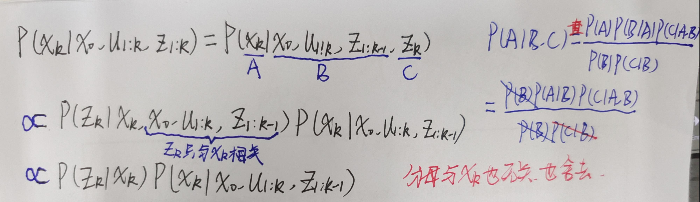

这里第一项称为似然，第二项称为先验。似然由观测方程给定，而先验部分，我们要明白当前状态 xk 是基于过去所有的状态估计得来的。至少，它会受 xk-1 影响，于是按照 xk-1 时刻为条件概率展开：


对这一步的后续处理，方法上产生了一些分歧。大体来说，存在若干种选择：其一是假设**马尔可夫性**，简单的一阶马氏性认为， k 时刻状态**只与 k -1 时刻状态有关**，而与再之前的无关。如果做出这样的假设，我们就会得到以**扩展卡尔曼滤波（EKF）**为代表的滤波器方法。在滤波方法中，我们会从某时刻的状态估计，推导到下一个时刻。另外一种方法是依然考虑 **k 时刻状态与之前所有状态**的关系，此时将得到**非线性优化为主体**的优化框架。非线性优化的基本知识已经在前文介绍过了。目前视觉SLAM 主流为非线性优化方法。


### 2.线性系统与KF

当我们假设了马尔可夫性，当前时刻状态只和上一个时刻有关。


上式第一项可简化为：


第二项可简化为：


这是考虑到 k 时刻的输入量 uk 与 k - 1 时刻的状态无关，所以我们把 uk 拿掉。这一项实际是 k - 1 时刻的状态分布。于是，这一系列方程说明了，我们实际在做的是“如何把 k - 1 时刻的状态分布推导至 k 时刻”这样一件事。

也就是说，在程序运行期间，我们只要维护一个状态量，对它进行不断地迭代和更新即可。进一步，如果假设状态量服从高斯分布，那我们只需考虑维护状态量的均值和协方差即可。

对于一个线性高斯系统，运动方程和观测方程可以由线性方程来描述：


为什么先验加了协方差矩阵P，而似然没加

这一步称为预测，它显示了如何从上一个时刻的状态，根据输入信息（但是有噪声），推断当前时刻的状态分布。这个分布也就是先验。记这里的：


这里我们稍微用点讨巧的方法。既然我们已经知道等式两侧都是高斯分布，那就只需比较指数部分即可，而无须理会高斯分布前面的因子部分。指数部分很像是一个二次型的配方，我们来推导一下。首先把指数部分展开，有（忽略了与xk无关的常数）：


（此处要利用SMW公式）


- 事实上卡尔曼滤波器有若干种推导方式，而我们使用的是**从概率角度出发的最大后验概率估计的形式**。
- 在线性高斯系统中，卡尔曼滤波器构成了该系统中的最大后验概率估计。而且，由于高斯分布经过线性变换后仍服从高斯分布，所以整个过程中我们没有进行任何的近似。可以说，卡尔曼滤波器构成了线性系统的**最优无偏估计**。

### 3.非线性系统与EKF

SLAM 中的运动方程和观测方程通常是非线性函数，尤其是视觉 SLAM 中的相机模型，需要使用相机内参模型以及李代数表示的位姿，更不可能是一个线性系统。所以在非线性系统中，我们必须取一定的近似，将一个非高斯的分布近似成一个高斯分布。


**滤波器的优缺点**

**优点：**

- EKF 以形式简洁、应用广泛著称。当我们想要在某段时间内估计某个不确定量时，首先想到的就是 EKF。在早期的 SLAM 中， EKF 占据了很长一段时间的主导地位，研究者们讨论了各种各样滤波器在 SLAM 中的应用，如 IF（信息滤波器） [62]、 IEKF[63]（Iterated KF）、 UKF[64]（Unscented KF）和粒子滤波器 [65, 66, 67]， SWF（Sliding Window Filter）[68] 等等 [17]‹，或者用分治法等思路改进 EKF 的效率 [69, 70]。直至今日，尽管我们认识到非线性优化比滤波器占有明显的优势，但是在计算资源受限，或待估计量比较简单的场合， EKF 仍不失为一种有效的方式。

**缺点：**

- 首先，滤波器方法在一定程度上假设了**马尔可夫性**，也就是 k 时刻的状态只与 k - 1时刻相关，而与 k - 1 之前的状态和观测都无关（或者和前几个有限时间的状态相关）。这有点像是在视觉里程计中，只考虑相邻两帧关系一样。如果当前帧确实与很久之前的数据有关（例如回环），那么滤波器就会难以处理这种情况。而非线性优化方法则倾向于使用所有的历史数据。它不光考虑邻近时刻的特征点与轨迹关系，更会把考虑很久之前的状态也考虑进来，称为全体时间上的 SLAM（FullSLAM）在这种意义下，非线性优化方法使用了更多信息，当然也需要更多的计算。
- 与第六章介绍的优化方法相比， EKF 滤波器仅在 x^k-1 处做了一次线性化，然后就直接根据这次线性化结果，把后验概率给算了出来。这相当于在说，我们**简单的认为该点处的线性化近似，在后验概率处仍然是有效的**。而实际上，当我们离开工作点较远的时候，一阶泰勒展开并不一定能够近似整个函数，这取决于运动模型和观测模型的非线性情况。如果它们有强烈的非线性，那线性近似就只在很小范围内成立，不能认为在很远的地方仍能用线性来近似。这就是 EKF 的非线性误差，是它的主要问题所在。在优化问题中，尽管我们也做一阶（最速下降）或二阶（G-N 或 L-M）的近似，但每迭代一次，状态估计发生改变之后，我们会重新对新的估计点做泰勒展开，而不像EKF 那样只在固定点上做一次泰勒展开。这就导致优化方法适用范围更广，则在状态变化较大时亦能适用。
- 从程序实现上来说， EKF 需要存储状态量的均值和方差，并对它们进行维护和更新。如果把路标也放进状态的话，由于视觉 SLAM 中路标数量很大，这个存储量是相当可观的，且与**状态量呈平方增长（因为要存储协方差矩阵）**。因此， EKF SLAM 普遍被认为不可适用于大型场景。

由于 EKF 存在这些明显的缺点，我们通常认为，在同等计算量的情况下，非线性优化能取得更好的效果 [13]。

### 4.UKF

## BA与图优化

在以图优化框架的视觉 SLAM 算法里， BA 起到了核心作用。它类似于求解只有观测方程的 SLAM 问题。但 SLAM 的研究者通常认为包含大量特征点和相机位姿的 BA 计算量过大，不适合实时计算。在最近几年视觉 SLAM 理论的研究中， 人们逐渐认识到 SLAM 问题中 **BA 的稀疏特性**，BA 算法不仅具有很高的精度，也开始具备良好的实时性，能够应用于在线计算的 SLAM 场景中。

### 1. 投影模型与BA代价函数

把世界坐标系下点$p$，依次根据相机的**外参、畸变参数、内参**，投影到像素坐标，需要以下几步：


（1）世界坐标系到相机坐标系
$$
P'=Rp+t=[X',Y',Z']^T
$$
（2）将$P'$投至归一化平面，得到归一化坐标
$$
P_c=[u_c,v_c,1]^T=[X'/Z',Y'/Z',1]^T
$$
（3）去畸变
$$
\left\{\begin{matrix}
u_c'=u_c(1+k_1r^{2}_{c}+k_2r^{4}_{c}) \\
v_c'=v_c(1+k_1r^{2}_{c}+k_2r^{4}_{c})
\end{matrix}\right.
\\
其中，r^{2}_{c}=u^{2}_{c}+v^{2}_{c}
$$
（4）根据内参得到像素坐标
$$
\left\{\begin{matrix}
u_s=f_xu_c'+c_x \\
v_s=f_yv_c'+c_y
\end{matrix}\right.
$$
事实上，上述过程就是观测方程$z=h(x,y)=h(\xi,p)$所描述的，其中$z=[u_s,v_s]^T$。从最小二乘的角度考虑，可以得到观测误差。
$$
e=z-h(\xi,p)
$$
设$z_{ij}$为在位姿$\xi_i$处观察路标$p_j$产生的数据，那么整体的代价函数为：
$$
\frac{1}{2}\sum_{i=1}^{m}\sum_{j=1}^{n}\left\|e_{ij} \right\|^2=\frac{1}{2}\sum_{i=1}^{m}\sum_{j=1}^{n}\left\|z_{ij}-h(\xi_i,p_j) \right\|^2
$$
对这个最小二乘进行求解，相当于对位姿和路标同时作了调整，也就是所谓的 BA。

### 2. BA求解

把自变量定义成所有待优化的变量：
$$
x=[\xi_1,...,\xi_m,p_1,...,p_n]^T
$$
目标函数：
$$
\frac{1}{2}\left\|f(x+\Delta x) \right\|^2=\frac{1}{2}\sum_{i=1}^{m}\sum_{j=1}^{n}\left\|e_{ij}+F_{ij}\Delta\xi_i+E_{ij}\Delta p_j \right\|^2
$$
其中$F_{ij}$​表示整个儿代价函数在当前状态下对相机姿态的偏导数，而 $E_{ij}$ 表示该函数对路标点位置的偏导。

把相机位姿变量放在一起，把空间点的变量也放在一起：
$$
x_c=[\xi_1,...,\xi_m]^T \in \mathbb{R}^{6m}\\
x_p=[p_1,...,p_n]^T \in \mathbb{R}^{3n}
$$
则
$$
\frac{1}{2}\left\|f(x+\Delta x) \right\|^2=\frac{1}{2}\left\|e+F\Delta x_c+E\Delta x_p \right\|^2
$$
接下来可以考虑用G-N或L-M等方法对该问题求解。

有增量线性方程$H\Delta x=g$，雅克比矩阵$J=[F,E]$。
$$
H=J^TJ=\begin{bmatrix}
F^TF &  F^TE\\
E^TF &  E^TE\\
\end{bmatrix}
$$
矩阵求逆是复杂度为 *O*(*n*3) 的操作，这里的 **H** 矩阵是有一定的特殊结构的。利用这个特殊结构，可以加速求解过程。

### 3. 稀疏性和边缘化


现在考虑更一般的情况，假如我们有 m 个相机位姿， n 个路标点。由于通常路标数量远远会比相机多，于是有 n ≫ m。由上面推理可知，实际当中的 H 矩阵会像图 10-8 所示的那样。它的左上角块显得非常小，而右下角的对角块占据了大量地方。除此之外，非对角部分则分布着散乱的观测数据。由于它的形状很像箭头，又称为箭头形（Arrow-like）矩阵 [6]。

对于具有这种稀疏结构的 H，线性方程 H∆x = g 的求解会有什么不同呢？现实当中存在着若干种利用 H 的稀疏性加速计算的方法，而本节介绍视觉 SLAM 里一种最常用的手段： **Schur 消元 (Schur trick)**。在 SLAM 研究中亦称为 **Marginalization（边缘化）**。


其中 B 是对角块矩阵，每个对角块的维度和相机参数的维度相同，对角块的个数是相机变量的个数。由于路标数量会远远大于相机变量个数，所以 C 往往也远大于 B。三维空间中每个路标点为三维，于是 C 矩阵为对角块矩阵，每个块为 3 × 3 维矩阵。对角块矩阵逆的难度远小于对一般矩阵的求逆难度，因为我们只需要对那些对角线矩阵块分别求逆即可。考虑到这个特性，我们线性方程组进行高斯消元，目标是消去右上角的非对角部分 E，得：


这个线性方程组的维度和 B 矩阵一样。我们的做法是先求解这个方程，然后把解得的 ∆xc 代入到原方程，然后求解 ∆xp。这个过程称为 边缘化Marginalization[68]，或者 Schur消元 (Schur Elimination)（舒尔消元）。相比于直接解线性方程的做法，它的优势在于：

- 在消元过程中，由于$C$为对角块，所以 $C^{−1}$ 容易解得。
- 求解了$\Delta x_c$之后，路标部分的增量方程由 给$\Delta x_p=C^{-1}(w-E^T\Delta x_c)$出。这依然用到了$C^{-1}$易于求解的特性。

边缘化的主要的计算量在于求解式（10.59），我们将此方程的系数记为S，S 的稀疏性具有物理意义，S 矩阵的非对角线上的非零矩阵块，表示了该处对应的两个相机变量之间存在着共同观测的路标点，有时候称为共视（Co-visibility）。反之，如果该块为零，则表示这两个相机没有共同观测。


在实践当中，例如 ORB_SLAM[73] 中的 Local Mapping 环节，在做 BA 的时候刻意选择那些具有共同观测的帧作为关键帧，在这种情况下 Schur 消元后得到的 S 就是稠密矩阵。不过，由于这个模块并不是实时执行，所以这种做法也是可以接受的。但是在另一些方法里面，例如 DSO[58]， OKVIS[74] 等，它们采用了滑动窗口方法（Sliding Window）。这类方法对每一帧都要求做一次 BA 来防止误差的累积，因此它们也必须采用一些技巧来保持 S 矩阵的稀疏性。

从概率角度来看，我们称这一步为边缘化，是因为我们实际上把求 (∆xc; ∆xp) 的问题，转化成先求 ∆xc，再求 ∆xp 的过程。这一步相当于做了条件概率展开：
$$
P(x_c,x_p)=P(x_c)\cdot P(x_p|x_c)
$$
结果是求出了关于 xc 的边缘分布，故称边缘化。在上边讲的边缘化过程中，我们实际把所有的路标点都给边缘化了。根据实际情况，我们也能选择一部分进行边缘化。同时，Schur 消元只是实现边缘化的其中一种方式，同样可以使用 Cholesky 分解进行边缘化。

在进行了 Schur 消元后，我们还需要求解线性方程组 (10.59).这部分就属于传统的矩阵数值求解的部分了，通常是用分解来计算的。不管采用哪种求解办法，我们都建议利用 H 的稀疏性进行 Schur消元。不光是因为这样可以提高速度，也同时是因为消元后的 S 矩阵的条件数往往比之前的 H 矩阵的条件数要小。 Schur 消元也并不是意味将所有路标消元，将相机变量消元也是SLAM 当中采用的手段。

### 4. 鲁棒核函数

在前面的 BA 问题中，我们最小化误差项的二范数平方和，作为目标函数。这种做法虽然很直观，但存在一个严重的问题：如果出于误匹配等原因，某个误差项给的数据是错误的，会发生什么呢？

我们把一条原本不应该加到图中的边给加进去了，然而优化算法并不能辨别出这是个错误数据，它会把所有的数据都当作误差来处理。这时，算法会看到一条误差很大的边，它的梯度也很大，意味着调整与它相关的变量会使目标函数下降更多。所以，算法将试图调整这条边所连接的节点的估计值，使它们顺应这条边的无理要求。由于这个边的误差真的很大，往往会抹平了其他正确边的影响，使优化算法专注于调整一个错误的值。这显然不是我们希望看到的。

出现这种问题的原因是，当误差很大时，二范数增长得太快了。于是就有了核函数的存在。核函数保证每条边的误差不会大的没边，掩盖掉其他的边。

具体的方式是，把原先误差的二范数度量，替换成一个增长没有那么快的函数，同时保证自己的光滑性质（不然没法求导啊！）。因为它们使得整个优化结果更为鲁棒，所以又叫它们为鲁棒核函数（Robust Kernel）。

鲁棒核函数有许多种，例如最常用的 Huber 核：


我们看到，当误差 e 大于某个阈值 δ 后，函数增长由二次形式变成了一次形式，相当于限制了梯度的最大值。同时， Huber 核函数又是光滑的，可以很方便地求导。图 10-12 显示了 Huber 核函数与二次函数的对比，可见在误差较大时 Huber 核函数增长明显低于二次函数。


除了 Huber 核之外，还有 Cauchy 核， Tukey 核等等，读者可以看看 g2o 和 Ceres 都提供了哪些核函数。


## 位姿图优化

**g2o和图优化**

从零开始一起学习SLAM | 理解图优化，一步步带你看懂g2o代码

https://mp.weixin.qq.com/s?__biz=MzIxOTczOTM4NA==&mid=2247486858&idx=1&sn=ce458d5eb6b1ad11b065d71899e31a04&chksm=97d7e81da0a0610b1e3e12415b6de1501329920c3074ab5b48e759edbb33d264a73f1a9f9faf&scene=21#wechat_redirect

从零开始一起学习SLAM | 掌握g2o顶点编程套路

https://mp.weixin.qq.com/s?__biz=MzIxOTczOTM4NA==&mid=2247486992&idx=1&sn=ecb7c3ef9bd968e51914c2f5b767428d&chksm=97d7eb87a0a062912a9db9fb16a08129f373791fd3918952342d5db46c0bc4880326a7933671&scene=21#wechat_redirect

从零开始一起学习SLAM | 掌握g2o边的代码套路

https://mp.weixin.qq.com/s?__biz=MzIxOTczOTM4NA==&mid=2247487082&idx=1&sn=d4a27e4c9a76760fffb571f57f4f7719&chksm=97d7ebfda0a062eba412877e9ecf5933f2051f0210c0d56f03267985512d97f2db434ab7356c&scene=21#wechat_redirect

## 因子图优化

### 因子图

因⼦图 在slam的后端优化问题中，我们通常会通过⼀些传感器的观测，⽐如视觉特征点，IMU预积分量，Lidar⾯点和边缘点的约束去构建⼀个优化问题，求解状态量（如位姿、速度等），这个时候我们考虑⼀个问题，当给这个系统新增⼀个约束时，我们就会重新对所有的约束对状态的优化问题进⾏求解，当图优化模型增⼤时，显然进⾏⼀次优化的时间也会增加很多，⼀⽅⾯实时性遭遇了挑战，另⼀⽅⾯，很久之前的状态似乎也没有继续更新的必要。为了解决这个问题，⼀种⽅式是使⽤滑动窗⼝来控制优化问题的规模，通常来讲滑动窗⼝需要处理好边缘化的问题，另⼀⽅⾯，我们可以使⽤因⼦图的模型来解决这个问题。

Kaess等科研⼈员提出iSAM，即增量平滑和建图，使其可以⾃动增量处理⼤规模优化问题，具体来说，其内部使⽤⼀种基于概率的⻉叶斯树，使得每次给因⼦图增加⼀个约束时，其会根据⻉叶斯树的连接关系，调整和当前结点“关系⽐较密切”的结点，如此，既保障了优化问题的求解精度，也使得耗时不会随着优化问题的增⼤⽽增⼤。 

关于因⼦图优化理论可以参考iSAM，iSAM2相关论⽂等⽂献。 

**因⼦图中⼀些概念**

变量结点：类似g2O中的顶点或者ceres中的参数块，代表需要被优化的变量。

因⼦结点：类似g2O中的边或者ceres中的cost function，代表约束，如预积分约束、位姿先验约束、帧间位姿约束等。

## ????????

**松耦合和紧耦合？**


VIO中紧耦合就是把数据放到一起联合优化

松耦合就是分别对参数做出估计，再把多个参数进行融合，例如最简单的加权平均，或是用kalman滤波器

在VIO中，松耦合和紧耦合的区别在于是否将视觉特征点加入到待优化状态中来。紧耦合的效果一般更好。实现方式上，松耦合一般基于卡尔曼滤波，紧耦合可以是滤波方式也可以借助ceres，g2o等优化工具。

# 四、回环及重定位

## 回环检测

前端提供特征点的提取和轨迹、地图的初值，而后端负责对这所有的数据进行优化。但是我们仍然无法保证绝对的精度构建一个全局一致的轨迹和地图。


虽然后端能够估计最大后验误差，但所谓“好模型架不住烂数据”，只有相邻关键帧数据时，我们能做的事情并不很多，也无从消除累积误差。但是，**回环检测模块，能够给出除了相邻帧之外的，一些时隔更加久远的约束：例如 x1 - x100 之间的位姿变换。**

由于 Pose Graph 可以看成一个质点——弹簧系统，所以回环检测相当于在图像中加入了额外的弹簧，提高了系统稳定性。读者亦可直观地想象成回环边把带有累计误差的边“拉”到了正确的位置——如果回环本身是正确的话。

回环检测的意义：

- 它关系到我们估计的轨迹和地图在长时间下的正确性
- 由于回环检测提供了当前数据与所有历史数据的关联，在跟踪算法丢失之后，我们还可以利用回环检测进行重定位。

回环检测对整个 SLAM 系统精度与鲁棒性的提升，是非常明显的。甚至在某些时候，我们把仅有前端和局部后端的系统称为VO，而把带有回环检测和全局后端的称为 SLAM。

**回环检测的方法**

暴力匹配：O(N2) 的复杂度，不实用

随机匹配：随机抽取历史数据并进行回环检测，抽的少，随着帧数的增多，可能抽不到，抽的多，又没有减少复杂度的效果。

基于几何关系（Odometry based）：运动到了之前的某个位置附近，这个无法在累计误差较大时工作。

基于外观（Appearance based）：仅根据两张图像的相似性确定回环检测关系。√

基于外观的方法需要计算两张图像的相似性，用I1-I2的灰度值可以吗？不可以

- 像素灰度是一种不稳定的测量值，它严重受环境光照和相机曝光的影响。
- 当相机视角发生少量变化时，即使每个物体的光度不变，它们的像素也会在图像中发生位移，造成一个很大的差异值。

**为什么不直接利用特征匹配进行相似性判断？**

特征的匹配会比较费时、当光照变化时特征描述可能不稳定等。

### 词袋模型

词袋 Bag-of-Words（BoW），用图像上的一些特征来表征这张图。首先定义一本字典（Dictionary），每张图片由字典中的单词组成，这些单词的组合就表征了这张图。

例如“人”、“车”、“狗”都是记录在字典中的单词，我们不妨记为 w1; w2; w3。然后，对于任意图像 A，根据它们含有的单词，可记为：


字典是固定的，所以只要用 [1; 1; 0]T 这个向量就可以表达 A 的意义。**通过字典和单词，只需一个向量就可以描述整张图像**了。

该向量描述的是“图像是否含有某类特征”的信息，比单纯的灰度值更加稳定。又因为描述向量说的是“是否出现”，而不管它们“在哪儿出现”，所以与物体的空间位置和排列顺序无关，因此在相机发生少量运动时，只要物体仍在视野中出现，我们就仍然保证描述向量不发生变化。

基于这种特性，我们称它为Bag-of-Words 而不是什么 List-of-Words，强调的是 Words 的有无，而无关其顺序。

对两个向量求差仍然有一些不同的做法，比如对于W维向量a，b：


其中范数取 L1 范数，即各元素绝对值之和。请注意在两个向量完全一样时，我们将得到 1；完全相反时（a 为 0 的地方 b 为 1）得到 0（这个向量很长，而且会存在大量的0）。这样就定义了两个描述向量的相似性，也就定义了图像之间的相似程度。

### 字典

一个单词与一个单独的特征点不同，它不是从单个图像上提取出来的，而是某一类特征的组合。所以，字典生成问题类似于一个聚类（Clustering）问题。

聚类问题是无监督机器学习（Unsupervised ML）中一个特别常见的问题，用于让机器自行寻找数据中的规律的问题。 BoW 的字典生成问题亦属于其中之一。

首先，假设我们对大量的图像提取了特征点，比如说有 N 个。现在，我们想找一个有 k 个单词的字典，每个单词可以看作局部相邻特征点的集合，应该怎么做呢？这可以用经典的 K-means（K 均值）算法 [92] 解决。

K-means 是一个非常简单有效的方法，因此在无监督学习中广为使用，当我们有 N 个数据，想要归成 k 个类，那么用 K-means 来做，主要有以下几个步骤：

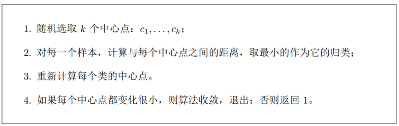

K-means 的做法是朴素且简单有效的，不过也存在一些问题，例如需要指定聚类数量、随机选取中心点使得每次聚类结果都不相同以及一些效率上的问题。随后研究者们亦开发出层次聚类法、 K-means++[93] 等算法以弥补它的不足。

总之，根据 K-means，我们可以把已经提取的大量特征点聚类成一个含有 k 个单词的字典了。现在的问题，变为如何根据图像中某个特征点，**查找字典中相应的单词？**

字典通常很大，以保证当前使用环境中的图像特征都曾在字典里出现过，或至少有相近的表达。


这种 O(n) 的查找算法显然不是我们想要的。如果字典排过序，那么二分查找显然可以提升查找效率，达到对数级别的复杂度。而实践当中，我们可能会用更复杂的数据结构，例如 Fabmap[94, 95, 96] 中的 Chou-Liu tree[97] 等等。

一种较为简单实用的方法是使用一种 k 叉树来表达字典。它的思路很简单，类似于层次聚类，是 kmeans 的直接扩展。假定我们有 N 个特征点，希望构建一个深度为 d，每次分叉为 k 的树（类似k-d数），那么做法如下：


这样一个 k 分支，深度为 d 的树，可以容纳 kd 个单词。另一方面，在查找某个给定特征对应的单词时，只需将它与每个中间结点的聚类中心比较（一共 d 次），即可找到最后的单词，保证了对数级别的查找效率。

单词实际上是对描述子的一种分类区间，一个单词代表一类相似的描述子。

#### 相似度计算

考虑到，不同的单词在区分性上的重要性并不相同。例如“的”、“是”这样的字可能在许许多多的句子中出现，我们无法根据它们判别句子的类型；但如果有“文档”、“足球”这样的单词，对判别句子的作用就更大一些，因此我们希望对单词的区分性或重要性加以评估。

在文本检索中，常用的一种做法称为 TF-IDF（Term Frequency– Inverse Document Frequency） [100, 101]，或译频率-逆文档频率。 TF 部分的思想是，某单词在一个图像中经常出现，它的代表性就高。另一方面， IDF 的思想是，某单词在字典中出现的频率越低，则分类图像时区分度越高。

在词袋模型中，在建立字典时可以考虑 IDF 部分。我们统计某个叶子节点 wi 中的特征数量相对于所有特征数量的比例，作为 IDF 部分。假设所有特征数量为 n， wi 数量为ni，那么该单词的 IDF 为：


IDF是在构建词典的时候就可以计算好，TF是在对新帧计算词向量的时候计算的。对于新帧计算BoW，它的权重就是TF*IDF。DBoW2里面，TF设置为1了。

通过词袋，我们用单个向量 vA 描述了一个图像 A。这个向量 vA 是一个稀疏的向量，它的非零部分指示出图像 A 中含有哪些单词，而这些部分的值为 TF-IDF 的值。

接下来的问题是：给定 vA 和 vB，如何计算它们的差异呢？这个问题和范数定义的方式一样，存在若干种解决方式，比如 [102] 中提到的 L1 范数形式：

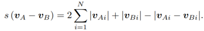


**准确率和召回率**


这里阴性/阳性的说法是借用了医学上的说法。假阳性（False Positive）又称为感知偏差，而假阴性（False Negative）称为感知变异。为方便书写，记缩写 TP 为 True Positive，


为什么取这两个统计量呢？因为它们有一定的代表性，并且通常来说是一个矛盾。一个算法往往有许多的设置参数。比方说，当我们提高某个阈值时，算法可能变得更加“严格”——它检出更少的回环，使准确率得以提高。但同时，由于检出的数量变少了，许多原本是回环的地方就可能被漏掉了，导致召回率的下降。反之，如果我们选择更加宽松的配置，那么检出的回环数量将增加，得更高的召回率，但其中可能混杂了一些不是回环的情况，于是准确率下降了。

值得一提的是，在 SLAM 中，我们对准确率要求更高，而对召回率则相对宽容一些。

### **回环改进思路**

- **字典越大，越能体现图像的差异性**

10张图，字典的规模 k =10; d = 5，每张图像 500 个特征点。即最多一万个单词，实际4983个

/Youdao/pengxinyi_up@163.com/ad3799f9ae124d4c80c38e2b7aab134a/clipboard.png)

2900 张图。字典的规模 k =10; d = 5，每张图像 500 个特征点。即最多一万个单词，实际99566个

/Youdao/pengxinyi_up@163.com/fddb245e0bf448919cc4829a97154e4e/clipboard.png)

- **用相对相似性阈值代替绝对相似性阈值**

考虑到有些环境的外观本来就很相似，像办公室往往有很多同款式的桌椅；另一些环境则各个地方都有很大的不同。考虑到这种情况，我们会取一个先验相似度 s (vt，vt-∆t)，它表示某时刻关键帧图像与上一时刻的关键帧的相似性。然后，其他的分值都参照这个值进行归一化：

/Youdao/pengxinyi_up@163.com/d2820c5353b74ae8813b8489b8bfc414/clipboard.png)

如果当前帧与之前某关键帧的相似度，超过当前帧与上一个关键帧相似度的 3 倍，就认为可能存在回环。这个步骤避免了引入绝对的相似性阈值，使得算法能够适应更多的环境。

- **使用关键帧**

\1. 时间上临近的图像帧往往具有更高的相似性，但显然又不是回环，利用关键帧，可以避免邻近帧的相似性，也能减少回环匹配的计算量。

\2. 还可以避重复的回环，因为当第 1 帧和第 n 帧检测到回环，如果没有关键帧，那么很可能第n + 1 帧， n + 2 帧都会和第 1 帧构成回环。但是，确认第 1 帧和第 n 帧之间存在回环，对轨迹优化是有帮助的，但再接下去的第 n + 1 帧， n + 2 帧都会和第 1 帧构成回环，产生的帮助就没那么大了，因为我们已经用之前的信息消除了累计误差，更多的回环并不会带来更多的信息。所以，关键帧会把“相近”的回环聚成一类，使算法不要反复地检测同一类的回环。

- **回环验证**

词袋的回环检测算法完全依赖于外观而没有利用任何的几何信息，这导致外观相似的图像容易被当成回环。并且，由于词袋不在乎单词顺序，只在意单词有无的表达方式，更容易引发感知偏差。所以验证是必须的。

一是设立回环的缓存机制，认为单次检测到的回环并不足以构成良好的约束，而在一段时间中一直检测到的回环，才认为是正确的回环。这可以看成时间上的一致性检测。

二是空间上的一致性检测，即是对回环检测到的两个帧进行特征匹配，估计相机的运动。然后，再把运动放到之前的 Pose Graph 中，检查与之前的估计是否有很大的出入。

- **深度学习的方法能更好检测回环**

从词袋模型来说，它本身是一个非监督的机器学习过程——构建词典相当于对特征描述子进行聚类，而树只是对所聚的类的一个快速查找的数据结构而已。既然是聚类，结合机器学习里的知识，可以用机器学习的图像特征进行聚类，而不是 SURF、 ORB 这样的人工设计特征进行聚类。

**调研相似性评分的常用度量方式，哪些比较常用？**

[**https://zhuanlan.zhihu.com/p/55493039**](https://zhuanlan.zhihu.com/p/55493039)

相似性评分的对象是向量，因此这里讨论的是用于度量向量相似性的方式。常用的方式有欧氏距离、曼哈顿距离和余弦距离等。

**Chow-Liu树是什么原理？它是如何被用于构建字典和回环检测的？**

Chow-Liu树的原理是通过计算相对熵（KL散度）来寻找数据的最优树结构（即近似真实的联合概率分布），更具体的原理介绍可以参考如下文章

http://www.bewindoweb.com/232.html

它是通过寻找一棵以特征向量之间的互信息作为权值，特征向量为节点的最大生成树作为最优树结构，在找到最大生成树的同时实现了聚类，从而成功构造了字典。回环检测主要考虑的是如何在字典中查找与给定特征匹配的单词，实现的方法是给定特征向量后求得条件概率分布，然后找到最大值所对应的单词即匹配成功。

**阅读参考文献[118]，除了词袋模型，还有哪些用于回环检测的方法？**

参考文献[118]中提到了如下三种方法

- Map-to-map，通过比较两个子地图的外观和特征之间的相对位置关系实现回环检测，如GCBB（geometric compatibility branch and bound）算法；
- Image-to-image，对比先前和当前时刻的照片的特征实现回环检测，如词袋方法；
- Image-to-map，基于重定位的方法，先将当前帧的特征与地图匹配，然后通过RANSAC和三点法求解当前相机位姿从而实现重定位，进而实现回环检测。

另外，具体像在VSLAM中应用的随机蕨法（重定位）、基于深度学习的方法(图像的全局检索)等也是常见的回环检测方法，关于这些方法可以参考下面的文章。

https://mp.weixin.qq.com/s?__biz=MzIxOTczOTM4NA==&mid=2247488240&idx=1&sn=27757e4d0e5f464ea4a8620b738a8a1b&chksm=97d7f767a0a07e71bddd9cd2dc1c3b9fe494523291fdfb98992d978fbf70f754a32f968c343b&token=484562772&lang=zh_CN#rd


## ????????

**32、回环 和 重定位 有什么 区别和联系？**

使用同样技术，实现的不同功能？

环/回环 loop closure 是什么？ 回环的主要目的是降低机器人随时间增加，轨迹中累积的漂移，一般发生在建图过程中。这是因为基于运动传感器或者视觉信息的里程计容易出错，使估计的轨迹偏离其实际真实的情况。通过回环，优化整个地图信息，包括3D路标点、及相机位姿、相对尺度信息。回环检测提供了回环帧与所有历史帧的关系，可以极大减小误差。 重定位relocation是什么？ 顾名思义，这是“ 重新”定位，当前图像因为和最近的图像或者局部地图之间缺乏足够的匹配，导致机器人无法确定自己的位姿，此时处于当前状态的机器人不再知道其在地图中的位置，也叫做机器人被“绑架”，就说的是人质被蒙上双眼带到未知地方，蒙罩去掉后完全不知道自己在哪里，这时候就需要充分利用之前建好的地图或者存好的数据库。此时机器人需要观察周围环境，并且从已有地图中寻找可靠的匹配关系（一般是关键帧信息），这样就可以根据已有信息“ 重新 ”估计机器人的姿态。 回环主要是纠正机器人/相机轨迹，而重新定位在从未知状态找回姿态。两者都需要当前图像预先访问过之前的位置附近，本质上都是一个图像识别问题。


**请问orb-slam3的高精度是不是有一部分贡献来源于回环？如果没有回环是否还能到这个精度水平呢？**

是的，3版本里因为适用场景越来越大，也有摇晃等比较苛刻的测试，所以如果是以前的回环策略很容易kidnap。 我看到论文里有很多回环重定位的新策略，数据关联方法分为短期，中期，长期策略，多地图策略也是为长期数据关联服务的，当跟丢的时候，就会重新建一个子地图，并且在回环的时候与之前的子地图进行合并。并且可以重用所有的历史信息用于闭环（作者说第一个这样的系统，不知道对内存消耗如何）。你看，这一切基本就是为回环重定位服务的。也是demo那么惊艳的主要因素。 去掉了回环，ORB_SLAM3就没有灵魂了

# 五、地图


## 建图

OGM占用栅格地图

TSDF截断符号距离函数

深度滤波器（十四讲第二版12.2节有讲）

## 算法评价

### 轨迹误差

绝对轨迹误差（ATE_all）/均方根误差（RMSE），如果只取平移部分，则是绝对平移误差（ATE_trans）

相对位姿误差（RPE_all）

相对位姿误差（relative pose error）用于计算相同两个时间戳内的位姿变化量的差， 同样， 在用时间戳对齐之后， 真实位姿和估计位姿均**每隔一段相同时间**计算位姿的变化量， 然后对该变化量做差， 以获得相对位姿误差， 该标准适合于**估计系统的漂移**。


## ????????

# 六、第三方库

安装，基本的用法，

## 1. 视觉库OpenCV

一句话简介：是使用极广的开源图像处理算法库。应用如像素操作、滤波、特征提取、目标检测等。

> http://opencv.org/
> OpenCV计算机视觉编程攻略（第3版）完整高清版.pdf


安装：略

注意：

从第 3 版开始，OpenCV 已经分成了两个主要部分。第一部分是包含了成熟算法的 OpenCV 主源码库，也就是之前下载的内容。此外还有一个独立的代码库，它包含了最近加入 OpenCV 的计算机视觉算法。到https://github.com/opencv/opencv_contrib即可下载额外的 OpenCV 模块（zip 文件）。模块解压后，可以放在任何目录下，但需要能够在opencv_contrib-master/modules 中找到。方便起见，可以将文件夹改名为 contrib，并直接复制到主程序包的 sources 目录下。在这些额外的模块中，你可以只选取和保存需要使用的。

OpenCV 库分为多个模块：opencv_core 模块包含库的核心功能，opencv_imgproc 模块包含主要的图像处理函数，opencv_highgui 模块提供了读写图像和视频的函数以及一些用户交互函数，等等。

==深入理解cv::Mat==

cv::Mat 有两个必不可少的组成部分：一个头部和一个数据块。

头部包含了矩阵的所有相关信息（大小、通道数量、数据类型等），头部文件的某些属性（例如通过使用 cols、rows 或 channels）。
数据块包含了图像中所有像素的值。头部有一个指向数据块的指针，即 data 属性。cv::Mat 有一个很重要的属性，即只有在明确要求时，内存块才会被复制。实际上，大多数操作仅仅复制了 cv::Mat 的头部，因此多个对象会指向同一个数据块。这种内存管理模式可以提高应用程序的运行效率，避免内存泄漏。如果要对图像内容做一个深复制，你可以使用 copyTo 方法。

```C++
// 这些图像是原始图像的新副本
image3.copyTo(image2); 
cv::Mat image5= image3.clone();
```

==访问像素值==

<font size=3 color=blue>哪些遍历图像的方法?（十四讲）</font>

三种遍历图像的方式：行指针、at访问像素、iterator

```C++
// 遍历图像, 请注意以下遍历方式亦可使用于随机像素访问
// 使用 std::chrono 来给算法计时
chrono::steady_clock::time_point t1 = chrono::steady_clock::now();
for (size_t y = 0; y < image.rows; y++) {
    // 用cv::Mat::ptr获得图像的行指针
    unsigned char *row_ptr = image.ptr<unsigned char>(y);  // row_ptr是第y行的头指针
    for (size_t x = 0; x < image.cols; x++) {
      // 访问位于 x,y 处的像素
      unsigned char *data_ptr = &row_ptr[x * image.channels()]; // data_ptr 指向待访问的像素数据
      // 输出该像素的每个通道,如果是灰度图就只有一个通道
      for (int c = 0; c != image.channels(); c++) {
        unsigned char data = data_ptr[c]; // data为I(x,y)第c个通道的值
      }
    }
}
chrono::steady_clock::time_point t2 = chrono::steady_clock::now();
chrono::duration<double> time_used = chrono::duration_cast < chrono::duration < double >> (t2 - t1);
cout << "image.ptr行指针 遍历图像用时：" << time_used.count() << " 秒。" << endl;


chrono::steady_clock::time_point t3 = chrono::steady_clock::now();
for (int y=0; y<image.rows; y++)
{
    for (int x=0; x<image.cols; x++)
    {
      for (int c=0; c<image.channels(); c++)
      {
        unsigned char data=image.at<cv::Vec3b>(y , x)[c];
      }
    }
}
chrono::steady_clock::time_point t4 = chrono::steady_clock::now();
chrono::duration<double> time_used2 = chrono::duration_cast < chrono::duration < double >> (t4 - t3);
cout << "at访问 遍历图像用时：" << time_used2.count() << " 秒。" << endl;

chrono::steady_clock::time_point t5 = chrono::steady_clock::now();
cv::MatConstIterator_<cv::Vec3b> it_in=image.begin<cv::Vec3b>();
cv::MatConstIterator_<cv::Vec3b> itend_in=image.end<cv::Vec3b>();
while(it_in!=itend_in)
{
    for (int c=0; c<image.channels(); c++)
    {
      unsigned char data=(*it_in)[c];
    }
    it_in++;
}
chrono::steady_clock::time_point t6 = chrono::steady_clock::now();
chrono::duration<double> time_used3 = chrono::duration_cast < chrono::duration < double >> (t6 - t5);
cout << "iterator访问 遍历图像用时：" << time_used3.count() << " 秒。" << endl;
```

image.ptr行指针 遍历图像用时：6.9e-08 秒。 at访问 遍历图像用时：5.1e-08 秒。 iterator访问 遍历图像用时：0.00106578 秒。


## 2. 矩阵库Eigen

一句话简介：

- Eigen是一个开源的基于C++模板的线性代数库，提供了有关向量、矩阵的代数运算（四则运算、位姿表示之间的变换），比如解方程，矩阵分解等。
- Eigen is a C++ template library for linear algebra: matrices, vectors, numerical solvers, and related algorithms.

>https://blog.csdn.net/yxpandjay/article/details/80587916

详细介绍：

- Eigen是许多其他库的依赖，比如g2o、Sophus也是基于Eigen。
- Eigen提供了线性代数、矩阵、向量等的运算求解方法，是一个开源的C++库。
- Eigen采用源码的方式提供给用户使用，在使用时只需要包含Eigen的[头文件](https://so.csdn.net/so/search?q=头文件&spm=1001.2101.3001.7020)即可进行使用，不需要除STL之外的任何依赖。之所以采用这种方式，是因为Eigen采用模板方式实现，由于模板函数不支持分离编译，所以只能提供源码而不是动态库的方式供用户使用。
- Eigen提供的矩阵和Matlab相似，索引是用()而不是[][]，下标从0开始，优先按列存储，动态矩阵matrix_x不如固定大小运算快。
- Eigen不支持自动类型提升，比如你不能把int和float进行运算。

安装：

```bash
sudo apt install libeigen3-dev
```

版本：

2021.08：Eigen 3.4.0


在使用Eigen的时候，如果STL容器中的元素是Eigen数据库结构，比如下面用vector容器存储Eigen::Matrix4f类型或用map存储Eigen::Vector4f数据类型时：

```C++
vector<Eigen::Matrix4d> vec;
std::map<int, Eigen::Vector4f> map;

#include <Eigen/StdVector>
std::vector<Eigen::Matrix4d,Eigen::aligned_allocator<Eigen::Matrix4d>>
std::map<int, Eigen::Vector4f, Eigen::aligned_allocator<std::pair<const int, Eigen::Vector4f>>
```

前段编译能通过，当运行时会报段错误。后段代码才是标准的定义容器方法，只是我们一般情况下定义容器的元素都是C++中的类型，所以可以省略，这是因为在C++11标准中，aligned_allocator管理C++中的各种数据类型的内存方法是一样的，可以不需要着重写出来。但是在Eigen管理内存和C++11中的方法是不一样的，所以需要单独强调元素的内存分配和管理。

对eigen中的固定大小的类使用STL容器的时候，如果直接使用会出错，所谓固定大小（fixed-size）的类是指在编译过程中就已经分配好内存空间的类，为了提高运算速度，对于SSE或者AltiVec指令集，向量化必须要求向量是以16字节即128bit对齐的方式分配内存空间，所以针对这个问题，容器需要使用eigen自己定义的内存分配器，即aligned_allocator。


## 2. 李代数库Sophus

一句话简介：是一个基于Eigen并且增加了李群李代数支持的线性代数运算库。

Eigen 提供了几何模块，但没有提供李代数的支持。一个较好的李代数库是 Strasdat 维护的 Sophus 库。最早提出李代数的是 Sophus Lie，这个库就以他的名字命名了。 Sophus 库支持 SO(3) 和 SE(3)，此外还含有二维运动 SO(2); SE(2) 以及相似变换Sim(3) 的内容。它是直接在 Eigen 基础上开发的，我们不需要要安装额外的依赖库。


Sophus的较早版本是基于非模板的（.h），新的时基于模板的（.hpp），头文件和变量命名都不一样。

## 3. 优化库Ceres

C++

一句话简介：ceres是一个来自谷歌的广泛使用最小二乘问题求解库。

通常来讲，对⼀个slam问题建模成⼀个优化问题就是需要迭代去求解形如
$$
J^TJ\delta x=-J^Te
$$
这样⼀个问题，也就是说需要我们去求出此时的雅克⽐矩阵 以及残差 才可以求出优化变量的增量，进⽽迭代求解最终的优化变量。

求解slam中的优化问题通常⽐较复杂，⼀般来说我们会借助⼀些现有的优化器来帮助我们实现，如ceres-slover，g2o，gtsam等，A-LOAM中选⽤了ceres-solver作为优化器，⽽ceres-solver是⾕歌开源的⼀个优化⼯具，其具有⽂档⻬全，接⼝简单等优点，⼴受开发者欢迎，⾕歌也在其开源的激光slam算法cartographer中使⽤ceres-solver。

通常⼀个优化器会帮助我们解决优化问题中⼤部分内容，但是残差的计算以及残差对优化变量的雅克⽐矩阵通常是需要⽤户来定义的，⽽雅克⽐矩阵通常⽐较复杂，因此有的优化库如g2o，gtsam会预先定义好⼀些常⻅的优化问题所涉及到的残差及雅克⽐计算⽅式，但是并不能覆盖到所有场景，⼀旦有些问题不是优化器所事先建模好的问题，那就需要⽤户⾃⾏定义残差和雅克⽐的计算⽅式，这往往会⾮常⿇烦，⽽ceres-solver通过引⽤⾃动求导功能，⽆论什么优化问题，⽤户只需要定义残差的计算⽅式，⾃动求导功能会帮助⽤户计算对应的雅克⽐矩阵来实现优化问题求解，对于⽤户来讲是⼀个⾮常⽅便⽽友好的功能。

需要定义⼀个类，其中必须使⽤模板函数重载（）运算符，（）运算符函数第⼏个参数是参数块的起始指针，最后⼀个参数是残差块的指针，（）运算符负责计算残差，定义完之后，其他交给ceres-solver就好啦。

参考http://www.ceres-solver.org/automatic_derivatives.html

配置步骤：

1. 定义每个参数块（优化变量）
2. 定义残差块（代价函数）的计算方式（求梯度的方式：自动求导、数值求导）
3. 定义残差块的雅克比矩阵的计算方式
4. 把参数块和残差块传入Problem对象中，构建最小二乘问题
5. 配置求解器
6. 调用Solve函数求解

曲线拟合

```C++
#include <iostream>
#include <opencv2/core/core.hpp>
#include <ceres/ceres.h>
#include <chrono>
using namespace std;

// 代价函数的计算模型
struct CURVE_FITTING_COST {
  CURVE_FITTING_COST(double x, double y) : _x(x), _y(y) {}

  // 残差的计算
  template<typename T>
  bool operator()(
    const T *const abc, // 模型参数，有3维
    T *residual) const {
    // y-exp(ax^2+bx+c)
    residual[0] = T(_y) - ceres::exp(abc[0] * T(_x) * T(_x) + abc[1] * T(_x) + abc[2]); 
    return true;
  }

  const double _x, _y;    // x,y数据
};

int main(int argc, char **argv) {
  double ar = 1.0, br = 2.0, cr = 1.0;         // 真实参数值
  double ae = 2.0, be = -1.0, ce = 5.0;        // 估计参数值
  int N = 100;                                 // 数据点
  double w_sigma = 1.0;                        // 噪声Sigma值
  double inv_sigma = 1.0 / w_sigma;
  cv::RNG rng;                                 // OpenCV随机数产生器

  vector<double> x_data, y_data;      // 数据
  for (int i = 0; i < N; i++) {
    double x = i / 100.0;
    x_data.push_back(x);
    y_data.push_back(exp(ar * x * x + br * x + cr) + rng.gaussian(w_sigma * w_sigma));
  }

  double abc[3] = {ae, be, ce}; //参数块

  // 构建最小二乘问题
  ceres::Problem problem;
  for (int i = 0; i < N; i++) {
    problem.AddResidualBlock(     // 向问题中添加误差项
      // 使用自动求导，模板参数：误差类型，输出维度，输入维度，维数要与前面struct中一致
      new ceres::AutoDiffCostFunction<CURVE_FITTING_COST, 1, 3>(
        new CURVE_FITTING_COST(x_data[i], y_data[i])
      ),
      nullptr,            // 核函数，这里不使用，为空
      abc                 // 待估计参数
    );
  }

  // 配置求解器
  ceres::Solver::Options options;     // 这里有很多配置项可以填
  options.linear_solver_type = ceres::DENSE_NORMAL_CHOLESKY;  // 增量方程如何求解
  options.minimizer_progress_to_stdout = true;   // 输出到cout

  ceres::Solver::Summary summary;                // 优化信息
  chrono::steady_clock::time_point t1 = chrono::steady_clock::now();
  ceres::Solve(options, &problem, &summary);  // 开始优化
  chrono::steady_clock::time_point t2 = chrono::steady_clock::now();
  chrono::duration<double> time_used = chrono::duration_cast<chrono::duration<double>>(t2 - t1);
  cout << "solve time cost = " << time_used.count() << " seconds. " << endl;

  // 输出结果
  cout << summary.BriefReport() << endl;
  cout << "estimated a,b,c = ";
  for (auto a:abc) cout << a << " ";
  cout << endl;

  return 0;
}
```

BA

```C++
#include <iostream>
#include <ceres/ceres.h>
#include "common.h"
#include "SnavelyReprojectionError.h"

using namespace std;

void SolveBA(BALProblem &bal_problem);

int main(int argc, char **argv) {
    if (argc != 2) {
        cout << "usage: bundle_adjustment_ceres bal_data.txt" << endl;
        return 1;
    }

    BALProblem bal_problem(argv[1]);
    bal_problem.Normalize();
    bal_problem.Perturb(0.1, 0.5, 0.5);
    bal_problem.WriteToPLYFile("initial.ply");
    SolveBA(bal_problem);
    bal_problem.WriteToPLYFile("final.ply");

    return 0;
}

void SolveBA(BALProblem &bal_problem) {
    const int point_block_size = bal_problem.point_block_size();
    const int camera_block_size = bal_problem.camera_block_size();
    double *points = bal_problem.mutable_points();
    double *cameras = bal_problem.mutable_cameras();

    // Observations is 2 * num_observations long array observations
    // [u_1, u_2, ... u_n], where each u_i is two dimensional, the x
    // and y position of the observation.
    const double *observations = bal_problem.observations();
    ceres::Problem problem;

    for (int i = 0; i < bal_problem.num_observations(); ++i) {
        ceres::CostFunction *cost_function;

        // Each Residual block takes a point and a camera as input
        // and outputs a 2 dimensional Residual
        cost_function = SnavelyReprojectionError::Create(observations[2 * i + 0], observations[2 * i + 1]);

        // If enabled use Huber's loss function.
        ceres::LossFunction *loss_function = new ceres::HuberLoss(1.0);

        // Each observation corresponds to a pair of a camera and a point
        // which are identified by camera_index()[i] and point_index()[i]
        // respectively.
        double *camera = cameras + camera_block_size * bal_problem.camera_index()[i];
        double *point = points + point_block_size * bal_problem.point_index()[i];

        problem.AddResidualBlock(cost_function, loss_function, camera, point);
    }

    // show some information here ...
    std::cout << "bal problem file loaded..." << std::endl;
    std::cout << "bal problem have " << bal_problem.num_cameras() << " cameras and "
              << bal_problem.num_points() << " points. " << std::endl;
    std::cout << "Forming " << bal_problem.num_observations() << " observations. " << std::endl;

    std::cout << "Solving ceres BA ... " << endl;
    ceres::Solver::Options options;
    options.linear_solver_type = ceres::LinearSolverType::SPARSE_SCHUR;
    options.minimizer_progress_to_stdout = true;
    ceres::Solver::Summary summary;
    ceres::Solve(options, &problem, &summary);
    std::cout << summary.FullReport() << "\n";
}
```


## 3. 优化库G2O（图优化）

A General Framework for Graph Optimization

一句话简介：一个通用的图优化库，可以应用到任何能够表示成图优化的最小二乘问题。例如BA，ICP，曲线拟合等。

图优化是将非线性优化和图论结合起来的理论。相比于最小二乘优化方法，可以通过图来更直观的表示优化问题。用图的顶点表示优化变量（路标、位姿），边表示误差项，这样的图称为贝叶斯图或因子图。


使用步骤：

1. **构造g2o优化器**

    g2o::SparseOptimizer optimizer;

    确定BlockSolver的大小。与优化变量的维度有关。（如优化单帧位姿的投影模型，用BlockSolver_6_3表示，其中，位姿 _PoseDim 为6维，路标点 _LandmarkDim 是3维。），并确定BlockSolver是稠密还是稀疏的求解方式，如果其维度较小，用稠密精度会高。

    确定优化算法。可选GN、LM、DogLeg。

2. **构造顶点并添加**

    optimizer.addVertex(顶点);

    顶点有的需要固定，有的是需要优化调节的，如果没有固定的顶点，则会跑飞，如果全部固定，则边则无法调节，无法优化。所以要优化的变量不能固定。（如一个关键帧的位姿可以用g2o::VertexSE3Expmap构造顶点）

3. **构造边并添加**

    optimizer.addEdge(边);

    明确是一元边还是二元边，边实际上误差，继承边明确误差计算方式。（如重投影误差=观测值-投影值）。对于一个一元边，需要指定其一个顶点。（如：边->setVertex(0, 顶点)）

    确定优化的初值

4. **开始优化并设置优化参数**

    optimizer.optimize(优化次数); // 执行优化

5. **取出优化结果**

    根据设置的顶点编号把顶点（优化变量）取出来。

节点类继承于`g2o::BaseVertex<int D, typename T>`

- `int D`：优化变量的维度
- `typename T`：优化变量的数据类型

一元边问题继承于类g2o::BaseUnaryEdge<int D, typename E, typename VertexXi>

- `int D`：误差项的维度
- `typename E`：误差项的数据类型
- `typename VertexXi`：边链接的节点类型

二元边问题继承于类g2o::BaseBinaryEdge<int D, typename E, typename VertexXi, typename VertexXj>

- `int D`：误差项的维度
- `typename E`：误差项的数据类型
- `typename VertexXi`：边链接的第一个节点的类型
- `typename VertexXj`：边链接的第二个节点的类型

多元边问题继承于类g2o::BaseMultiEdge<15,Vector15d>

- `int D`：误差项的维度


**重点关注一下下面示例中定义节点时，类的成员函数oplusImpl(const double *update)用于定义节点更新的方式。
以及定义边时，类的成员函数computeError()用于定义边的误差计算函数，类的成员函数linearizeOplus()用于定义边的雅克比计算函数。**

曲线拟合

```c++
#include <iostream>
#include <g2o/core/g2o_core_api.h>
#include <g2o/core/base_vertex.h>
#include <g2o/core/base_unary_edge.h>
#include <g2o/core/block_solver.h>
#include <g2o/core/optimization_algorithm_levenberg.h>
#include <g2o/core/optimization_algorithm_gauss_newton.h>
#include <g2o/core/optimization_algorithm_dogleg.h>
#include <g2o/solvers/dense/linear_solver_dense.h>
#include <Eigen/Core>
#include <opencv2/core/core.hpp>
#include <cmath>
#include <chrono>

using namespace std;

// 曲线模型的顶点，模板参数：优化变量维度和数据类型
class CurveFittingVertex : public g2o::BaseVertex<3, Eigen::Vector3d> {
public:
  //成员变量EIGEN_MAKE_ALIGNED_OPERATOR_NEW声明在new一个这样类型的对象时，解决对齐问题。
  EIGEN_MAKE_ALIGNED_OPERATOR_NEW

  //对于节点的定义，还需要重写几个虚函数。
  //类的成员函数setToOriginImpl()，用于对优化变量_estimate的值进行初始化。如下述重置函数，将三维优化变量初始化为0：
  // 重置
  virtual void setToOriginImpl() override {
    _estimate << 0, 0, 0;
  }

  // 更新
  //类的成员函数oplusImpl(const double *update)用于定义节点更新的方式，也即用于处理x_{k+1}=x_k+\Delta x的过程。
  //const double *update：指针数据，更新量
  //应注意，对于表示不同用处的变量，使用不同方式计算增量的更新。例如，曲线拟合问题中只需要使用简单的加法进行更新即可
  //而对于如相机位姿问题的更新，则可使用李群的扰动模型进行更新（左乘扰动、右乘扰动）
  virtual void oplusImpl(const double *update) override {
    _estimate += Eigen::Vector3d(update);
  }

  // 存盘和读盘：留空
  virtual bool read(istream &in) {}
  virtual bool write(ostream &out) const {}
};

// 误差模型 模板参数：观测值维度，类型，连接顶点类型
class CurveFittingEdge : public g2o::BaseUnaryEdge<1, double, CurveFittingVertex> {
public:
  EIGEN_MAKE_ALIGNED_OPERATOR_NEW
	
  //构造函数
  //边类在被实例化时，需要传入对应的特征x，使用类的私有成员_x接受：
  //在g2o中，使用私有成员_measurement存储观测数据y
  CurveFittingEdge(double x) : BaseUnaryEdge(), _x(x) {}

  //误差计算函数 
  //类的成员函数computeError()用于定义边的误差计算函数，误差函数主要用于获取链接节点的值并计算相应的残差值。
  //计算曲线模型误差
  virtual void computeError() override {
    //  获取节点
    const CurveFittingVertex *v = static_cast<const CurveFittingVertex *> (_vertices[0]);
    //  获取节点的优化变量（节点值）
    const Eigen::Vector3d abc = v->estimate();
    //  计算误差值 error=y−exp(ax2+bx+c)
    _error(0, 0) = _measurement - std::exp(abc(0, 0) * _x * _x + abc(1, 0) * _x + abc(2, 0));
  }

  // 计算雅可比矩阵
  //类的成员函数linearizeOplus()用于定义边的雅克比计算函数。同样，雅克比计算函数获取边链接的节点及其对应的优化变量的值，从而求解雅克比矩阵的值。
  virtual void linearizeOplus() override {
    //  获取节点
    const CurveFittingVertex *v = static_cast<const CurveFittingVertex *> (_vertices[0]);
    //  获取节点的优化变量（节点值）
    const Eigen::Vector3d abc = v->estimate();
    //  雅克比矩阵求解
    //此处注意，对于一元边问题，只需要计算_jacobianOplusXi即可；
    //对于二元边问题 ，应同时计算_jacobianOplusXi和_jacobianOplusXj的值。
    double y = exp(abc[0] * _x * _x + abc[1] * _x + abc[2]);
    _jacobianOplusXi[0] = -_x * _x * y;
    _jacobianOplusXi[1] = -_x * y;
    _jacobianOplusXi[2] = -y;
  }

  //  读盘函数、存盘函数：留空，暂时不用
  virtual bool read(istream &in) {}
  virtual bool write(ostream &out) const {}

public:
  double _x;  // x 值， y 值为 _measurement
};

int main(int argc, char **argv) {
  double ar = 1.0, br = 2.0, cr = 1.0;         // 真实参数值
  double ae = 2.0, be = -1.0, ce = 5.0;        // 估计参数值
  int N = 100;                                 // 数据点
  double w_sigma = 1.0;                        // 噪声Sigma值
  double inv_sigma = 1.0 / w_sigma;
  cv::RNG rng;                                 // OpenCV随机数产生器

  vector<double> x_data, y_data;      // 数据
  for (int i = 0; i < N; i++) {
    double x = i / 100.0;
    x_data.push_back(x);
    y_data.push_back(exp(ar * x * x + br * x + cr) + rng.gaussian(w_sigma * w_sigma));
  }

  // 构建图优化，先设定g2o
  // 每个误差项优化变量维度为3，误差值维度为1
  typedef g2o::BlockSolver<g2o::BlockSolverTraits<3, 1>> BlockSolverType;  
  // 线性求解器类型
  typedef g2o::LinearSolverDense<BlockSolverType::PoseMatrixType> LinearSolverType; 

  // 梯度下降方法，可以从GaussNewton, Levenberg, Dogleg中选
  //GN法
  auto solver = new g2o::OptimizationAlgorithmGaussNewton(
    g2o::make_unique<BlockSolverType>(g2o::make_unique<LinearSolverType>()));
    
  //首先构建一个图模型并设置优化器
  g2o::SparseOptimizer optimizer;     // 图模型
  optimizer.setAlgorithm(solver);   // 设置求解器
  optimizer.setVerbose(true);       // 打开调试输出

  // 往图中增加顶点
    //  实例化节点类型
  CurveFittingVertex *v = new CurveFittingVertex();
    //  优化变量初始化
  v->setEstimate(Eigen::Vector3d(ae, be, ce));
    //  设置图中节点id
  v->setId(0);
    //  将节点加入图模型
  optimizer.addVertex(v);

  // 往图中增加边
  for (int i = 0; i < N; i++) {
      //  实例化边类型，传入特征x
    CurveFittingEdge *edge = new CurveFittingEdge(x_data[i]);
      //  设置图中边id
    edge->setId(i);
      //  设置连接的节点：节点编号和节点对象
    edge->setVertex(0, v);                // 设置连接的顶点
      //  设置观测数据
    edge->setMeasurement(y_data[i]);      // 观测数值
      // 信息矩阵：协方差矩阵之逆                            
    edge->setInformation(Eigen::Matrix<double, 1, 1>::Identity() * 1 / (w_sigma * w_sigma)); 
     //  将边加入图模型
    optimizer.addEdge(edge);
  }

  // 执行优化
  cout << "start optimization" << endl;
  chrono::steady_clock::time_point t1 = chrono::steady_clock::now();
    //  初始化优化
  optimizer.initializeOptimization();
    //  优化次数设置
  optimizer.optimize(10);
  chrono::steady_clock::time_point t2 = chrono::steady_clock::now();
  chrono::duration<double> time_used = chrono::duration_cast<chrono::duration<double>>(t2 - t1);
  cout << "solve time cost = " << time_used.count() << " seconds. " << endl;

  // 输出优化值
  Eigen::Vector3d abc_estimate = v->estimate();
  cout << "estimated model: " << abc_estimate.transpose() << endl;

  return 0;
}
```

BA

```c++
/// 姿态和内参的结构
struct PoseAndIntrinsics {
    PoseAndIntrinsics() {}

    /// set from given data address
    explicit PoseAndIntrinsics(double *data_addr) {
        rotation = SO3d::exp(Vector3d(data_addr[0], data_addr[1], data_addr[2]));
        translation = Vector3d(data_addr[3], data_addr[4], data_addr[5]);
        focal = data_addr[6];
        k1 = data_addr[7];
        k2 = data_addr[8];
    }

    /// 将估计值放入内存
    void set_to(double *data_addr) {
        auto r = rotation.log();
        for (int i = 0; i < 3; ++i) data_addr[i] = r[i];
        for (int i = 0; i < 3; ++i) data_addr[i + 3] = translation[i];
        data_addr[6] = focal;
        data_addr[7] = k1;
        data_addr[8] = k2;
    }

    SO3d rotation;
    Vector3d translation = Vector3d::Zero();
    double focal = 0;
    double k1 = 0, k2 = 0;
};

/// 位姿加相机内参的顶点，9维，前三维为so3，接下去为t, f, k1, k2
class VertexPoseAndIntrinsics : public g2o::BaseVertex<9, PoseAndIntrinsics> {
public:
    EIGEN_MAKE_ALIGNED_OPERATOR_NEW;

    VertexPoseAndIntrinsics() {}

    virtual void setToOriginImpl() override {
        _estimate = PoseAndIntrinsics();
    }

    virtual void oplusImpl(const double *update) override {
        _estimate.rotation = SO3d::exp(Vector3d(update[0], update[1], update[2])) * _estimate.rotation;
        _estimate.translation += Vector3d(update[3], update[4], update[5]);
        _estimate.focal += update[6];
        _estimate.k1 += update[7];
        _estimate.k2 += update[8];
    }

    /// 根据估计值投影一个点
    Vector2d project(const Vector3d &point) {
        Vector3d pc = _estimate.rotation * point + _estimate.translation;
        pc = -pc / pc[2];
        double r2 = pc.squaredNorm();
        double distortion = 1.0 + r2 * (_estimate.k1 + _estimate.k2 * r2);
        return Vector2d(_estimate.focal * distortion * pc[0],
                        _estimate.focal * distortion * pc[1]);
    }

    virtual bool read(istream &in) {}

    virtual bool write(ostream &out) const {}
};

class VertexPoint : public g2o::BaseVertex<3, Vector3d> {
public:
    EIGEN_MAKE_ALIGNED_OPERATOR_NEW;

    VertexPoint() {}

    virtual void setToOriginImpl() override {
        _estimate = Vector3d(0, 0, 0);
    }

    virtual void oplusImpl(const double *update) override {
        _estimate += Vector3d(update[0], update[1], update[2]);
    }

    virtual bool read(istream &in) {}

    virtual bool write(ostream &out) const {}
};

class EdgeProjection :
    public g2o::BaseBinaryEdge<2, Vector2d, VertexPoseAndIntrinsics, VertexPoint> {
public:
    EIGEN_MAKE_ALIGNED_OPERATOR_NEW;

    virtual void computeError() override {
        auto v0 = (VertexPoseAndIntrinsics *) _vertices[0];
        auto v1 = (VertexPoint *) _vertices[1];
        auto proj = v0->project(v1->estimate());
        _error = proj - _measurement;
    }

    // use numeric derivatives
    virtual bool read(istream &in) {}

    virtual bool write(ostream &out) const {}

};

void SolveBA(BALProblem &bal_problem);

int main(int argc, char **argv) {

    if (argc != 2) {
        cout << "usage: bundle_adjustment_g2o bal_data.txt" << endl;
        return 1;
    }

    BALProblem bal_problem(argv[1]);
    bal_problem.Normalize();
    bal_problem.Perturb(0.1, 0.5, 0.5);
    bal_problem.WriteToPLYFile("initial.ply");
    SolveBA(bal_problem);
    bal_problem.WriteToPLYFile("final.ply");

    return 0;
}

void SolveBA(BALProblem &bal_problem) {
    const int point_block_size = bal_problem.point_block_size();
    const int camera_block_size = bal_problem.camera_block_size();
    double *points = bal_problem.mutable_points();
    double *cameras = bal_problem.mutable_cameras();

    // pose dimension 9, landmark is 3
    typedef g2o::BlockSolver<g2o::BlockSolverTraits<9, 3>> BlockSolverType;
    typedef g2o::LinearSolverCSparse<BlockSolverType::PoseMatrixType> LinearSolverType;
    // use LM
    auto solver = new g2o::OptimizationAlgorithmLevenberg(
        g2o::make_unique<BlockSolverType>(g2o::make_unique<LinearSolverType>()));
    g2o::SparseOptimizer optimizer;
    optimizer.setAlgorithm(solver);
    optimizer.setVerbose(true);

    /// build g2o problem
    const double *observations = bal_problem.observations();
    // vertex
    vector<VertexPoseAndIntrinsics *> vertex_pose_intrinsics;
    vector<VertexPoint *> vertex_points;
    for (int i = 0; i < bal_problem.num_cameras(); ++i) {
        VertexPoseAndIntrinsics *v = new VertexPoseAndIntrinsics();
        double *camera = cameras + camera_block_size * i;
        v->setId(i);
        v->setEstimate(PoseAndIntrinsics(camera));
        optimizer.addVertex(v);
        vertex_pose_intrinsics.push_back(v);
    }
    for (int i = 0; i < bal_problem.num_points(); ++i) {
        VertexPoint *v = new VertexPoint();
        double *point = points + point_block_size * i;
        v->setId(i + bal_problem.num_cameras());
        v->setEstimate(Vector3d(point[0], point[1], point[2]));
        // g2o在BA中需要手动设置待Marg的顶点
        v->setMarginalized(true);
        optimizer.addVertex(v);
        vertex_points.push_back(v);
    }

    // edge
    for (int i = 0; i < bal_problem.num_observations(); ++i) {
        EdgeProjection *edge = new EdgeProjection;
        edge->setVertex(0, vertex_pose_intrinsics[bal_problem.camera_index()[i]]);
        edge->setVertex(1, vertex_points[bal_problem.point_index()[i]]);
        edge->setMeasurement(Vector2d(observations[2 * i + 0], observations[2 * i + 1]));
        edge->setInformation(Matrix2d::Identity());
        edge->setRobustKernel(new g2o::RobustKernelHuber());
        optimizer.addEdge(edge);
    }

    optimizer.initializeOptimization();
    optimizer.optimize(40);

    // set to bal problem
    for (int i = 0; i < bal_problem.num_cameras(); ++i) {
        double *camera = cameras + camera_block_size * i;
        auto vertex = vertex_pose_intrinsics[i];
        auto estimate = vertex->estimate();
        estimate.set_to(camera);
    }
    for (int i = 0; i < bal_problem.num_points(); ++i) {
        double *point = points + point_block_size * i;
        auto vertex = vertex_points[i];
        for (int k = 0; k < 3; ++k) point[k] = vertex->estimate()[k];
    }
}
```


## 3. 优化库Gtsam（）

GTSAM全称是 Georgia Tech Smoothing and Mapping library，是佐治亚理⼯学院的科研⼈员基于因⼦图和⻉叶斯⽹络推出的⼀个C++库⽂件，如果你想在你的⼯程⾥使⽤因⼦图优化的相关算法，那么最 常⽤的⽅式就是借助GTSAM这个库来实现，因为其内部已经封装了关于因⼦图优化以及iSAM相关的算 法实现，因此，我们只需要像调⽤其他第三⽅库的⽅式（如openCV，PCL等）调⽤GTSAM库即可 

关于GTSAM库的详细介绍可以参考其官⽅⽂档https://gtsam.org/

gtsam编译

```bash
cmake -DGTSAM_BUILD_WITH_MARCH_NATIVE=OFF -GTSAM_USE_SYSTEM_EIGEN=ON ..
```

编译的时候要把支持SSE编译加速的宏关掉，因为你其他的库比如PCL，OpenCV在编译的时候并没有使用该加速（大部分代码默认关闭了该加速），不然很容易在运行时代码崩溃。另外建议使用我们系统自己安装的EIGEN，而不是使用gtsam自带的Eigen，方便版本统一。

**IMU预积分接口**

我们对两个关键帧之间的若⼲帧IMU进⾏预积分，以形成预积分约束，对两帧之间的位置、速度、姿态以及零偏进⾏约束。GTSAM从4.0版本开始就在内部增加了IMU预积分相关的接⼝，因此，为了实现把预积分因⼦加⼊到图优化框架中，我们有必要熟悉⼀下GTSAM中跟IMU预积分相关的接⼝定义。

预积分相关参数，我们对IMU数据进⾏预积分之前通常需要事先知道IMU的噪声，重⼒⽅向等参数  

```C++
gtsam::PreintegrationParams
```

跟预积分相关的计算就在这个类中实现这个类有⼀些重要的接⼝

```C++
gtsam::PreintegratedImuMeasurements
(1) resetIntegrationAndSetBias //将预积分量复位，也就是说清空刚刚的预积分量，重新开始⼀个新的预积分量，因为预积分的计算依赖 ⼀个初始的IMU零偏，因此，在复位之后需要输⼊零偏值，所以这⾥复位和重设零偏在⼀个接⼝⾥。
(2) integrateMeasurement //输⼊IMU的测量值，其内部会⾃动实现预积分量的更新以及协⽅差矩阵的更新
(3) deltaTij //预积分量跨越的时间⻓度
(4) predict //预积分量可以计算出两帧之间的相对位置、速度、姿态的变化量，那结合上⼀帧的状态量就可以计算出 下⼀关键帧根据预积分结果的推算值
```


## 4. 词袋库DBoW

一句话简介：

**DBoW3库介绍**

​    DBoW3是DBoW2的增强版，这是一个开源的C++库，用于给图像特征排序，并将图像转化成视觉词袋表示。它采用层级树状结构将相近的图像特征在物理存储上聚集在一起，创建一个视觉词典。DBoW3还生成一个图像数据库，带有顺序索引和逆序索引，可以使图像特征的检索和对比非常快。

​     DBoW3与DBoW2的主要差别：

​    1、DBoW3依赖项只有OpenCV，DBoW2依赖项DLIB被移除；

​    2、DBoW3可以直接使用二值和浮点特征描述子，不需要再为这些特征描述子重写新类；

​    3、DBoW3可以在Linux和Windows下编译；

​    4、为了优化执行速度，重写了部分代码（特征的操作都写入类DescManip）；DBoW3的接口也被简化了；

​    5、可以使用二进制视觉词典文件；二进制文件在加载和保存上比.yml文件快4-5倍；而且，二进制文件还能被压缩；

​    6、仍然和DBoW2yml文件兼容。


IDF是在构建词典的时候就可以计算好，TF是在对新帧计算词向量的时候计算的。对于新帧计算BoW，它的权重就是TF*IDF。DBoW2里面，TF设置为1了。

## 5. 可视化库Pangolin

一句话简介：是一个基于OpenGL的3D可视化库，提供了基础的绘图功能和许多GUI操作。

## ????????????

<font size=3 color=blue>SLAM中常用的第三方库有哪些？</font>

Eigen、OpenCV、g2o、Ceres

**除了Ceres库和g2o库，还有哪些常用的优化库？**

除了Ceres库和g2o库，还有Gtsam、NLopt库、slam++库等等

**如何安装他们？**

在Ubuntu系统下，一般提供源码安装和从软件源库安装，编译好的库文件无需编译，但也无法配置编译选项。源码安装一般是cmake工程，本地编译安装。


<font size=3 color=blue>cv::mat和eigen::，谁表示矩阵更高效？cv::mat可以被静态的表示出来嘛？</font>


**主要学习资料**

------

[^1]: 高翔. 视觉SLAM十四讲从理论到实践第二版


**十四讲答案：**

https://www.zhihu.com/column/c_1324129110977568768

https://www.zhihu.com/people/philip-ll/posts


# ######附录######

# 标定

在线标定可以解决相机老化


# 经典开源方案

经典开源方案

| **时间** | **名字**       | **类型**          | **贡献**                     | **缺点**                                                     |
| -------- | -------------- | ----------------- | ---------------------------- | ------------------------------------------------------------ |
| 2007     | MonoSLAM       | 单目稀疏          | 第一个实时单目slam           | 场景小，跟踪易丢失                                           |
| 2007     | PTAM           | 单目稀疏          | 区分前端、后端双线程         | 场景小，跟踪易丢失。因此仅适合于特征跟踪并不适合用于后期的位置识别。而实际上，PTAM算法并没有进行大闭环检测，其重定位也仅是基于关键帧低分辨率缩略图的相关性进行的，因此视角不变性较差。 |
| 2014     | LSD-SLAM       | 单目直接法+半稠密 | CPU半稠密                    | 曝光敏感、易丢失需要特征点回环                               |
| 2014     | SVO            | 单目直接法+稀疏   | 极快                         | 要求俯视、无建图                                             |
| 2014     | RTAB-MAP       | 双目RGB-D         | Cpu实时稠密                  | 集成度过高，适合用而不便于二次研究                           |
| 2015     | ORB-SLAM       | 单目为主          | ORB字典、三线程              | 耗时，移植困难                                               |
| 2016     | DSO            | 单目              | 直接法                       |                                                              |
|          | DTAM           | RGB-D             | 直接法，逆深度，实时三维重建 | 计算量大                                                     |
|          | DVO            | RGB-D             |                              |                                                              |
|          | VINS系列       | 单目+IMU          |                              |                                                              |
| 2013     | RGBD-SLAM2     | RGB-D             |                              |                                                              |
|          | Elastic Fusion | RGB-D             |                              |                                                              |
|          | Hector SLAM    | 激光              |                              |                                                              |
|          | GMapping       | 激光              |                              |                                                              |
|          | OKVIS          | 多目+IMU          |                              |                                                              |
|          | ROVIO          | 单目+IMU          |                              |                                                              |
| 2020.08  | ORB-SLAM3      |                   | 特征点法（性能最佳）         |                                                              |

ORB-SLAM适合封闭的场景，因为回环的机制和共视图和关键帧的机制，在有重复观测的场景是的高效的，而对于开放的环境，很难有回环，（简单的滑动窗口就不差），比如利用小而美的vins，光流等。

**MonoSLAM**

MonoSLAM于2007年由大学A.J.Davsion教授提出。针对slam系统不能实时在线运行的问题。

Davsion被认为是vslam领域的先驱，他以EKF为后端，追踪前端非常稀疏的特征点，以相机当前的状态和所有路标点为状态量，更新其均值和协方差。是第一个实时的单目SLAM系统，被认为是许多工作的发源地，解决了机器人不能实时建立地图，需要离线处理的问题。

但存在应用场景窄，路标数量有限，稀疏特征点非常容易丢失等问题，已经停止对其开发。

**PTAM**

Klein G, Murray D. Parallel tracking and mapping for small AR workspaces[C]//2007 6th IEEE and ACM international symposium on mixed and augmented reality. IEEE, 2007: 225-234.

PTAM于2007年由大学Klein提出。

优点：

- 首次区分出前端和后端的概念，实现跟踪和建图过程的并行处理
- 摒弃传统的滤波器后端，使用非线性优化方法，引领了视觉slam研究从滤波器后端向非线性优化方法的转变（之前没有认识到后端优化的稀疏性）
- 引入关键帧机制，不必精细的处理每一幅图像
- 是早期结合AR的工作之一

缺点：

- 场景小
- 跟踪容易丢失
- 仍有后续工作。

**RGBD-SLAM2**

Endres F, Hess J, Sturm J, et al. 3-D mapping with an RGB-D camera[J]. IEEE transactions on robotics, 2013, 30(1): 177-187.

https://github.com/felixendres/rgbdslam_v2

**LSD-SLAM**

Engel J, Schöps T, Cremers D. LSD-SLAM: Large-scale direct monocular SLAM[C]//European conference on computer vision. Springer, Cham, 2014: 834-849.

LSD-SLAM于2014年由J.Engel等人提出，标志着单目直接法在SLAM中的成功应用。

LSD-SLAM 的直接法是针对像素进行的。作者有创见地提出了像素梯度与直接法的 关系，以及像素梯度与极线方向在稠密重建中的角度关系。

þ LSD-SLAM 在 CPU 上实现了半稠密场景的重建，这在之前的方案中是很少见到的。 基于特征点的方法只能是稀疏的，而进行稠密重建的方案大多要使用 RGB-D 传感 器，或者使用 GPU 构建稠密地图 [126]。TUM 计算机视觉组在多年对直接法的研究 基础上，实现了这种 CPU 上的实时半稠密 SLAM。

þ LSD-SLAM 的半稠密追踪使用了一些精妙的手段，来保证追踪的实时 性与稳定性。例如，LSD-SLAM 既不是利用单个像素，也不是利用图像块，而是在极 线上等距离取五个点，度量其 SSD；在深度估计时，LSD-SLAM 首先用随机数初始 化深度，在估计完之后又把深度均值归一化，以调整尺度；在度量深度不确定性时， 不仅考虑三角化的几何关系，而且考虑了极线与深度的夹角，归纳成一个光度不确定 性项；关键帧之间的约束使用了相似变换群以及与之对应的李代数 ζ ∈ sim(3)，显式 地表达出尺度，在后端优化中就可以将不同尺度的场景考虑进来，减小了尺度飘移现象。

þ 直接法对特征缺失区域不敏感

缺点：

ý 对相机内参和曝光非常敏感

ý 相机快速运动时容易丢失

ý 目前没有基于直接法实现回环检测，而是使用特征点法进行回环检测，未完全摆脱对特征点的计算。

**ORB-SLAM**

ORB-SLAM与2015年由大学R.Mur-Artal提出，继承了PTAM的工作，代码清晰易懂，注释完善。是现代slam系统做的非常完善、非常易用的系统之一。

优点：

- 整个系统围绕ORB特征进行计算，包括视觉里程计和回环检测的ORB字典，体现出ORB特征是现阶段计算平台优秀的效率与精度之间的折中方式，代表主流特征点的高峰。
- 优秀的回环检测算法保证了ORB-SLAM有效防止累积误差，并且丢失之后能迅速找回，许多其他slam系统在这一点做的不如他。为此需要加载一个很大的ORB字典文件。
- 创新的使用三个线程完成SLAM
- 实时跟踪特征点的tracking线程
- 局部BA的优化线程（Co-visibility Graph，俗称小图）
- 全局位姿图的回环检测（Essential Graph，俗称大图）
- 继PTAM的双线程之后，取得了非常好的跟踪和建图效果，被后人广泛采用。
- ORB-SLAM围绕特征点进行了不少的优化，比如保证特征点的均匀分布、多次循环优化位姿、比PTAM更为宽松的关键帧选取策略。使其具有更好的鲁棒性。
- 支持单目、双目、RGB-D三种模式，具有良好的泛用性

缺点：

- 每幅图像都需要计算ORB特征，非常耗时
- 三线程给CPU带来负担，移植到嵌入式设备有一定的困难
- ORB-SLAM的地图为稀疏特征点，尚未开放存储和读取地图后重定位的功能，无法直接用于导航避障交互
- 如果仅用ORB-SALM去定位，那么有更加轻便的方法

**SVO**

SVO（Semi-direct Visual Odoemtry）于2014年由Forster等人提出，是指特征点与直 接法的混合使用：SVO 跟踪了一些关键点（角点，没有描述子），然后像直接法那样，根 据这些关键点周围的信息，估计相机运动以及它们的位置。在实现中，SVO 使用了关键点周围的 4×4 的小块进行块匹配，估计相机自身的运动。

优点：

þ 相比于其他方案，SVO 的最大优势是速度极快。由于使用稀疏的直接法，它既不必费 力去计算描述子，也不必处理像稠密和半稠密那么多的信息，因此即使在低端计算平台上 也能达到实时性，而在 PC 平台上则可以达到 100 多帧每秒的速度。在作者后续工作 SVO 2.0 中，速度更达到了惊人的 400 帧每秒。这使得 SVO 非常适用于计算平台受限的场合， 例如无人机、手持 AR/VR 设备的定位。无人机也是作者开发 SVO 的目标应用平台。

þ SVO 的另一创新之处是提出了深度滤波器的概念，并推导了基于均匀——高斯混合 分布的深度滤波器。这在本书的 13 讲有所提及，但由于原理较为复杂我们没有详细解释。 SVO 将这种滤波器用于关键点的位置估计，并使用了逆深度作为参数化形式，使之能够更 好地计算特征点位置。

þ 开源版的 SVO 代码清晰易读，十分适合读者作为第一个 SLAM 实例进行分析

缺点：

ý 由于目标应用平台为无人机的俯视相机，考虑到视野内的物体主要是地面，而且相机 的运动主要为水平和上下的移动，SVO 的许多细节是围绕这个应用设计的，使得它 在平视相机中表现不佳。例如，SVO 在单目初始化时，使用了分解 H 矩阵而不是传 统的 F 或 E 矩阵的方式，这需要假设特征点位于平面上。该假设对俯视相机是成 立的，但对平视相机通常是不成立的，可能导致初始化失败。再如，SVO 在关键帧 选择时，使用了平移量作为确定新的关键帧的策略，而没有考虑旋转量。这同样在无 人机俯视配置下是有效的，但在平视相机中则会容易丢失。所以，如果读者想要在平 视相机中使用 SVO，必须自己加以修改。

ý SVO 为了速度和轻量化，舍弃了后端优化和回环检测部分，也基本没有建图功能。这 意味着 SVO 的位姿估计必然存在累计误差，而且丢失后不太容易进行重定位（因为 没有描述子用来回环检测）。所以，我们称它为一个 VO，而不是称它为完整的 SLAM。

**RTAB-SLAM**

RTAB-SLAM于2014年由M.Labbe等人提出，是 RGB-D SLAM 中比 较经典的一个方案。它实现了 RGB-D SLAM 中所有应该有的东西：基于特征的视觉里程

计、基于词袋的回环检测、后端的位姿图优化以及点云和三角网格地图。因此，RTAB-MAP 给出了一套完整的（但有些庞大的）RGB-D SLAM 方案。目前我们已经可以直接从 ROS 中获得它二进制程序，此外，在 Google Project Tango 上也可以获取它的 app，愉快地玩 耍了。

RTAB-MAP 支持一些常见的 RGB-D 和双目传感器，像 Kinect、Xtion 等等，且提 供实时的定位和建图功能。不过由于集成度较高，使得其他开发者在它基础上进行二次开 发变得困难，所以 RTAB-MAP 更适合作为 SLAM 应用而非研究使用。


 


# SLAM面经

前期的入门学习，主要靠死记硬背，后期理解后算是入门。

**有很多，没事就搜集整理一下**

**SLAM、自动驾驶算法、3D视觉岗位秋招知识点（附有解答）**

https://blog.csdn.net/try_again_later/article/details/100666313

**SLAM常见面试题（一）**

https://zhuanlan.zhihu.com/p/46694678

**SLAM面经**

https://blog.csdn.net/ainitutu/article/details/124091769

**SLAM面试题**

https://www.zhihu.com/column/c_1376548203878211584

空旷的地方适合组合惯导

## 待分类问题


https://docs.qq.com/doc/DVXNoQWx2RkFhckp4?u=ad8cde4f70db46eaaffb69b3408029d8&dver=&_t=1651129146053

一、惯性导航方向

\1. IMU测量方程是什么？噪声模型是什么？

\2. 惯导误差模型是怎么来的？比如15维的卡尔曼滤波模型。

\3. GPS双天线安装偏角是怎么标定的？

\4. 多传感器之间是怎么对时的？

\5. GPS到来时是有延时的，而IMU给出的加速度和角速度是实时的，这种情况下怎么处理延时？怎么做的融合？

\6. DR递推的原理是什么？大概怎么去做？

\7. 组合导航卡尔曼滤波过程噪声是如何调参的？

二、点云算法方向

\1. 最近邻问题有哪几种典型解法？

\2. 怎么对KdTree进行插入操作？怎么确定一个节点的分类面？

\3. 怎么对KdTree进行Search By Range和Search By KNN操作？

4.举出除了KdTree以外的近邻计算方法（栅格、B树、R树、四叉、八叉树等）。

\5. 给定一组点，如何计算其拟合平面？如何计算其拟合直线？解释其方法的意义。

\6. 举出常见的点云的registration方法。

\7. 说明ICP的详细过程，要求说明代数解法和匹配问题解法。

\8. 说明NDT的详细过程，Normal distribution的含义是什么。

\9. 匹配问题除了最近邻还有什么解法？说明匈牙利算法、最大流/最小割、谱方法等其中一种。

\10. 解释混合高斯模型含义。解释EM算法的原理。

三、状态估计方向

\1. 从贝叶斯滤波器角度推出卡尔曼滤波器方程。

\2. 从增益最优化角度推出卡尔曼滤波器方程。

\3. 从Cholesky方程推出卡尔曼滤波器方程。

4.解释KF中的噪声矩阵含义。运动方程中估计噪声是变大还是变小？修正方程中估计噪声是变大还是变小？

5.RTS与KF之间的联系？

\6. 将卡尔曼滤波器推广至EKF。

\7. 解释数值矩阵求逆的几种做法（QR、Cholesky、SVD）。

\8. 什么是Moore-Penrose逆？如何计算Moore-Penrose逆？

\9. SVD是什么？SVD是如何求解的？

\10. 特征值是什么？如何计算矩阵的特征值与特征向量？什么样的矩阵必然能对角化？不能对角化的矩阵的标准形式是什么？什么是Jordan标准形？

\11. 如何求解线性最小二乘解？如何求解零空间解？说明特征值方法和奇异值方法之间的联系。

\12. 描述图优化和最小二乘之间联系。画出VIO中常用的图优化模型。

\13. 稀疏图优化的稀疏性体现在哪里？要求答出稀疏Schur和稀疏Cholesky之一。

\14. 描述滤波器与最小二乘之间的联系？说明为什么卡尔曼滤波器可以看成两个时刻间的最小二乘。

\15. 说明UKF、EKF和PF之间的关系。

\16. 解释UKF中的Sigma采样点关系。

17.解释PF中的重要性重采样的过程是如何做的。解释轮盘赌原理。

\18. 解释李群李代数在三维状态估计中的作用。

\19. 流形是怎么定义的？流形在局部与R3同胚是什么含义？为什么说SO3是一个流形？

\20. 解释SO3, SE3中的Exp和Log的原理。解释BCH的原理和作用。

\21. 分别使用左右扰动模型，求解几个常见的雅可比：

\22. 解释四元数的更新与SO3的更新方式有何异同。

\23. 说明四元数运动模型与SO3运动模型之间的联系。

\24. 解释高斯推断和概率学中边缘化之间的关系。解释边缘化与卡尔曼滤波器之间的关系。

\25. 什么是M估计？说明M估计与核函数之间的关系？

四、计算机视觉/VIO方向

\1. 单应矩阵、基础矩阵、本质矩阵的定义？

2.相机内参和外参的含义？如果将图像放大两倍，内外参如何变化？

\3. 径向和切向畸变模型含义，鱼眼模型含义（回答等距投影模型即可）？

\4. 极线是什么？对极约束是什么？描述了什么几何关系？

\5. 八点法原理与过程。

\6. 预积分相比于传统积分的差异在哪里？

\7. 预积分的测量模型和噪声模型是什么？预积分对零偏是怎么处理的？为什么要这样处理？

\8. 说明预积分的图优化模型。

\9. 解释重投影模型和BA的原理。

10.说明PnP问题的解法。

\11. 说明RANSAC原理，讨论存在的问题。

\12. 解释单目VIO的初始化过程。需要估计哪些量？重力方向和尺度如何估计？

\13. 为什么单目VSLAM会有尺度漂移？如何解释这种尺度漂移？现实当中有没有解决办法？

\14. 举出几种光流方法（LK，HS等）。说明LK光流的建模方式。


**SFM（structure from motion）和SLAM的区别？**

在SLAM中，有运动方程和观测方程，如果没有运动方程，可以认为确实没有运动方程、或者假设相机不动或匀速运动。

在SFM中没有运动方程，甚至不需要输入的图像是按照时间顺序的，而SLAM是按照时间顺序来处理图像的。

**未来SLAM有什么发展趋势？**

一是往轻量级、小型化方向发展，让 SLAM 能够在嵌入式或手机等小型设备上良好的运行，然后考虑以它为底层功能的应用。毕竟大部分场合中，我们的真正目的都是实现机器人、 AR/VR 设备的功能，比如说运动、导航、教学、娱乐，而 SLAM 是为上层应用提供自身的一个位姿估计。在这些应用中，我们不希望 SLAM 占据所有计算资源，所以对 SLAM 的小型化和轻量化有非常强烈的要求。

另一个方面，则是利用高性能计算设备，实现精密的三维重建、场景理解等功能。在这些应用中，我们的目的是完美地重建场景，而对于计算资源和设备的便携性则没有多大限制。由于可以利用GPU，这个方向和深度学习亦有结合点。

**视觉+惯导SLAM的前景**

惯性传感器（IMU）能够测量传感器本体的角速度和加速度，被认为与相机传感器具有明显的互补性，而且十分有潜力在融合之后得到更完善的 SLAM 系统。

1. IMU 虽然可以测得角速度和加速度，但这些量都存在明显的漂移（Drift），使得积分两次得到的位姿数据非常不可靠。好比说，我们将 IMU 放在桌上不动，用它的读数积分得到的位姿也会漂出十万八千里。但是，对于短时间内的快速运动， IMU 能够提供一些较好的估计。这正是相机的弱点。当运动过快时，（卷帘快门的）相机会出现运动模糊，或者两帧之间重叠区域太少以至于无法进行特征匹配，所以纯视觉 SLAM 非常害怕快速的运动。而有了 IMU，即使在相机数据无效的那段时间内，我们还能保持一个较好的位姿估计，这是纯视觉SLAM 无法做到的。
2. 相比于 IMU，相机数据基本不会有漂移。如果相机放在原地固定不动，那么（在静态场景下）视觉 SLAM 的位姿估计也是固定不动的。所以，相机数据可以有效地估计并修正 IMU 读数中的漂移，使得在慢速运动后的位姿估计依然有效。
3. 当图像发生变化时，本质上我们没法知道是相机自身发生了运动，还是外界条件发生了变化，所以纯视觉 SLAM 难以处理动态的障碍物。而 IMU 能够感受到自己的运动信息，从某种程度上减轻动态物体的影响。

不管是理论还是实践， VIO（Visual Inertial Odometry）都是相当复杂的。其复杂性主要来源于 IMU 测量加速度和角速度这两个量的事实，所以不得不引入运动学计算。目前 VIO 的框架已经定型为两大类：**松耦合**（Loosely Coupled）和**紧耦合**（Tightly  Coupled） [129]。松耦合是指， IMU 和相机分别进行自身的运动估计，然后对它们的位姿估计结果进行融合。紧耦合是指，把 IMU 的状态与相机的状态合并在一起，共同构建运动方程和观测方程，然后进行状态估计——这和我们之前介绍的理论非常相似。我们可以预见到，紧耦合理论也必将分为基于滤波和基于优化的两个方向。在滤波方面，传统的 EKF[130] 以及改进的 MSCKF （Multi-State Constraint KF） [131] 都取得了一定的成果，研究者们对 EKF 也进行了深入的讨论（例如能观性 [132]）；优化方面亦有相应的方案 [74, 133]。值得一提的是，尽管在纯视觉 SLAM 中，优化方法已经占了主流，但在 VIO 中，由于 IMU 的数据频率非常高，对状态进行优化需要的计算量就更大，因此VIO 领域目前仍处于滤波与优化并存的阶段 [134, 60]。

VIO 为将来 SLAM 的小型化与低成本化提供了一个非常有效的方向。而且结合稀疏直接法，我们有望在低端硬件上取得良好的 SLAM 或 VO 效果，是非常有前景的。

**知识星球** #SLAM常见面试题#

1. **跟踪线程里的local map和局部建图线程local mapping听起来非常相似，但是功能差别很大，初学者很容易搞混。试从功能及流程方面分析两者的差异。**

**答：**跟踪线程里的local map，对Local Map的MapPoints进行跟踪，在局部地图中查找在当前帧视野范围内的点和当前帧的特征点进行投影匹配，根据匹配对估计当前帧的姿态，并剔除误匹配。

Step 1：更新局部关键帧mvpLocalKeyFrames和局部地图点mvpLocalMapPoints 

Step 2：在局部地图中查找与当前帧匹配的MapPoints, 其实也就是对局部地图点进行跟踪

Step 3：更新局部所有MapPoints后对位姿再次优化

Step 4：更新当前帧的MapPoints被观测程度，并统计跟踪局部地图的效果

Step 5：决定是否跟踪成功

局部建图线程local mapping，处理关键帧并更新地图点。

Step 1 告诉Tracking，LocalMapping正处于繁忙状态，请不要给我发送关键帧打扰我

Step 2 处理列表中的关键帧，包括计算BoW、更新观测、描述子、共视图，插入到地图等

Step 3 根据地图点的观测情况剔除质量不好的地图点

Step 4 当前关键帧与相邻关键帧通过三角化产生新的地图点，使得跟踪更稳

Step 5 检查并融合当前关键帧与相邻关键帧帧（两级相邻）中重复的地图点

Step 6 当局部地图中的关键帧大于2个的时候进行局部地图的BA

Step 7 检测并剔除当前帧相邻的关键帧中冗余的关键帧

Step 8 将当前帧加入到闭环检测队列中

1. **（RANSAC）举例说明 RANSAC 算法在 SLAM中的用途。如果数据中存在一半的离群点，用RANSAC 能得到正确的模型吗？为什么？**

**答：**RANSAC算法可用于消除图像误匹配对。

能，RANSAC通过反复选择数据中的一组随机子集，仅仅根据内点计算模型参数，不同于最小二乘法全盘考虑，如果有过多（数倍于内点数）的离群点，可能会提高迭代的次数，因为找到契合的模型的概率会降低。如果离群点进一步增多（数十倍于内点数），容易得到错误模型，增加迭代次数无用。


# ---end---
