> 惨痛案例：A同学华为实习笔试16/300，无缘面试。
> 在整个实习求职中，大厂笔试后就再也没有下文，俗称落地成盒。

### 🌵说在前面

没思路？-------偷分

不能全A？-----------边界情况，int溢出


面试遇到见过的题目，不要上来直接无脑套最优解。这样不会加分，只会让面试官觉得你刚做过原题，然后反手让你证明算法的正确性或者再给你整一道难难的。最好走完一套流程，尽可能让面试官觉得你现场是在思考的，先假装在纸上写写画画，然后有思路了和面试官分析这类问题（不要说题目）应该怎样解决，通常用啥算法或模版优化，最后再开始写代码。


❗	表示需要加强记忆（紧急）
❕	表示需要加强记忆（不紧急）
✍ 表示需要补充完善内容

🍬🏆🔈🔉🔊🔎📝💡✍❗ ❓💯✅❎♻🌵

0️⃣1️⃣2️⃣3️⃣4️⃣5️⃣6️⃣7️⃣8️⃣9️⃣🔟⭕❌✔◾◽◻◼☑❕

### 📝计划

LeetCode按类别刷补全知识点，只刷周赛查漏补缺、模拟笔试。2000+之后按照LC精选题单做题。

- [x] 题解3000+（2022.5）
- [x] 题解2000+（2022.8.20）
- [ ] HOT 100
- [ ] 剑指Offer第二版75（提前批）
- [ ] 剑指Offer专项突击版119
- [ ] 分类巩固（秋招）
- [ ] 其它网站的最新真题


- **LeetBook：**https://leetcode-cn.com/leetbook/
- **剑指Offer：**https://leetcode-cn.com/problem-list/e8X3pBZi/
- **Hot-100：**https://leetcode-cn.com/problem-list/2cktkvj/
- **Tag：**https://leetcode-cn.com/problemset/all/
- **Labuladong：**labuladong 的算法小抄 :: labuladong的算法小抄
- **LeetCode 101：**https://github.com/changgyhub/leetcode_101
- **CodeTop：**https://codetop.cc/home

总结的面试频率一览表：**颜色越红，表示面试中碰到的概率越高**；灰色的基本不考，或者出现概率很低。

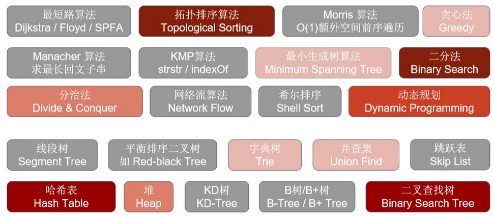

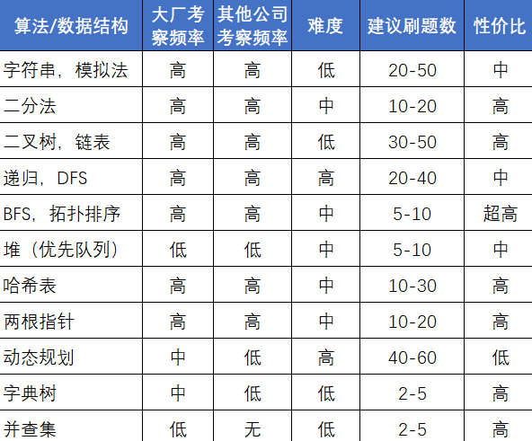

# 一、笔试模板

核心思想：size已知用`for()`，未知用`while(cin>>a)`，判断换行用`if(cin.get()=='\n')`。

## 1.输入输出

### 输入

**提取中括号内的数字**

```C++
输入：4,,778,4,[3,1,4,2],996,[10,20,30,40],[10,1,20,30,40]
输出：
3,1,4,2
10,20,30,40
10,1,20,30,40
---------------------------------------------
string str;
cin >> str;
vector<vector<int>> nums;
vector<int> temp;
for (int i = 0;i < str.size();i++)
{
    int j = i + 1;
    if (str[i] == '[')
    {
        string s = "";
        for (;j < str.size();j++)
        {
            if (str[j] == ',')
            {
                temp.push_back(atoi(s.c_str()));
                s = "";
                continue;
            }
            if (str[j] == ']')
            {
                break;
            }
            else
            {
                s += str[j];
                
            }
        }
        temp.push_back(atoi(s.c_str()));
    }
    else
    {
        continue;
    }
    i = j;
    nums.push_back(temp);
    temp.clear();
}
myPrint(nums);
```

**常规输入**

```C++
#include <iostream>
#include <vector>
#include <string>
#include <algorithm>
using namespace std;

void getMatrix(vector<vector<int>> &matrix);
void getMatrix(vector<vector<int>> &matrix, int R);
void getArr(vector<int> &arr);

int main()
{
//    int a,b;
//    while(cin>>a>>b){
//        cout<<a+b<<endl;
//    }
//    cout << "Hello world!" << endl;
    vector<vector<int>> matrix;
    vector<int> arr;
    getArr(arr);
    myPrint(arr);
    return 0;
}

//二维数组，每组长度在开头给出，行数未知,输入为0结束
/*
4 1 2 3 4
5 1 2 3 4 5
0
*/
void getMatrix(vector<vector<int>> &matrix)
{
    int n;
	while (cin >> n) {
        if (n == 0) break;
        int a;
        vector<int> nums;
        for (int i = 0; i < n; ++i) {
            cin >> a;
            nums.push_back(a);
        }
        matrix.push_back(nums);
	}
}

//二维数组，每组长度在开头给出，行数已知
/*
2
4 1 2 3 4
5 1 2 3 4 5
*/
void getMatrix(vector<vector<int>> &matrix, int R)
{
    int t;
	cin >> t;
	//t=R;
	for (int i = 0; i < t; ++i) {
        int n;
        cin >> n;
        int a;
        vector<int> nums;
        for (int i = 0; i < n; ++i) {
            cin >> a;
            nums.push_back(a);
        }
        matrix.push_back(nums);
	}
}

//一维数组，长度未知，回车结束
/*
1 2 3 4 5
*/
void getArr(vector<int> &arr)
{
    int n;
    while(cin >> n)
    {
        arr.push_back(n);
        if(cin.get()=='\n') return; //这个一定要放后面，cin.get()是获取的下一个位置
    }
}
```

### 输出

```C++
#include <iostream>
#include <iomanip>
using namespace std;
int main()
{
    int n = 141;
    //1) 分别以十六进制、十进制、八进制先后输出 n
    cout << "1)" << hex << n << " " << dec << n << " " << oct << n << endl;
    1)8d 141 215
    
    double x = 1234567.89, y = 12.34567;
    //2)保留5位有效数字
    cout << "2)" << setprecision(5) << x << " " << y << " " << endl;
    2)1.2346e+06 12.346
    
    //3)保留小数点后面5位
    cout << "3)" << fixed << setprecision(5) << x << " " << y << endl;
    3)1234567.89000 12.34567
    
    //4)科学计数法输出，且保留小数点后面5位
    cout << "4)" << scientific << setprecision(5) << x << " " << y << endl;
    4)1.23457e+06 1.23457e+01
    
    //5)非负数显示正号，输出宽度为12字符，宽度不足则用 * 填补
    cout << "5)" << showpos << fixed << setw(12) << setfill('*') << 12.1 << endl;
    5)***+12.10000
    
    //6)非负数不显示正号，输出宽度为12字符，宽度不足则右边用填充字符填充
    cout << "6)" << noshowpos << setw(12) << left << 12.1 << endl;
    6)12.10000****
    
    //7)输出宽度为 12 字符，宽度不足则左边用填充字符填充
    cout << "7)" << setw(12) << right << 12.1 << endl;
    7)****12.10000
    
    //8)宽度不足时，负号和数值分列左右，中间用填充字符填充
    cout << "8)" << setw(12) << internal << -12.1 << endl;
    cout << "9)" << 12.1 << endl;
    8)-***12.10000
    9)12.10000
    return 0;
}
```


## 2.myPrint

### vector

```C++
template <typename T1> void myPrint(vector<T1>& arr);
template <typename T2> void myPrint(vector<vector<T2>>& matrix);

template<typename T1>
    void myPrint(vector<T1>& arr)
    {
        cout << "-------------" << endl;
        for (auto a : arr)
        {
            cout << a << " ";

        }
        cout << endl << "-------------" << endl;
    }

template <typename T2>
    void myPrint(vector<vector<T2>>& matrix)
    {
        cout << "-------------" << endl;
        for (auto& nums : matrix)
        {
            for (auto& n : nums)
            {
                cout << n << " ";
            }
            cout << endl;
        }
        cout << "-------------" << endl;
    }
```


## ❕3.树(构造|拷贝|打印|遍历)

```C++
#include<iostream>
using namespace std;
#include <algorithm>
#include<cmath> //sqrt()
#include <iomanip> //setprecision()

#include <vector>
#include <string>
#include <sstream>
#include <set>
#include <unordered_map>
#include <map>
#include <tuple>
#include <queue>

template <typename T1> void myPrint(vector<T1>& arr);
template <typename T2> void myPrint(vector<vector<T2>>& matrix);
void myPrint_tree(vector<int>& arr, int nul);

struct TreeNode {
    int val;
    TreeNode* left;
    TreeNode* right;
    TreeNode() : val(0), left(nullptr), right(nullptr) {}
    TreeNode(int x) : val(x), left(nullptr), right(nullptr) {}
    TreeNode(int x, TreeNode* left, TreeNode* right) : val(x), left(left), right(right) {}
};

// 根据数组构造二叉树
TreeNode* construct_binary_tree(const vector<int>& vec, int nul) 
{
    vector<TreeNode*> vecTree(vec.size(), NULL);
    TreeNode* root = NULL;
    // 把输入数值数组，先转化为二叉树节点数组
    for (int i = 0; i < vec.size(); i++) {
        TreeNode* node = NULL;
        if (vec[i] != nul) node = new TreeNode(vec[i]); // 用 nul 表示null
        vecTree[i] = node;
        if (i == 0) root = node;
    }
    // 遍历一遍，根据规则左右孩子赋值就可以了
    // 注意这里 结束规则是 i * 2 + 2 < vec.size()，避免空指针
    for (int i = 0; i * 2 + 2 < vec.size(); i++) {
        if (vecTree[i] != NULL) {
            // 线性存储转连式存储关键逻辑
            vecTree[i]->left = vecTree[i * 2 + 1];
            vecTree[i]->right = vecTree[i * 2 + 2];
        }
    }
    return root;
}

vector<vector<int>> levelOrder(TreeNode* root) {
    vector<vector<int>> ans;
    if (root == nullptr) return ans;
    queue<TreeNode*> q;
    q.push(root);
    while (!q.empty())
    {
        int L = q.size();
        vector<int> ret;
        for (int i = 0;i < L;i++)
        {
            TreeNode* node = q.front();
            q.pop();
            ret.push_back(node->val);
            if (node->left) q.push(node->left);
            if (node->right) q.push(node->right);
        }
        ans.push_back(ret);
    }
    return ans;
}

void copyNode(TreeNode* root, TreeNode* node) //定义一个拷贝二叉树函数
{
    if (root->left==nullptr && root->right == nullptr) return;
    if (root->left)
    {
        node->left = new TreeNode(root->left->val);
        copyNode(root->left, node->left);
    }
    if (root->right)
    {
        node->right = new TreeNode(root->right->val);
        copyNode(root->right, node->right);
    }
}

int main()
{
    int nul = 99;
    vector<int> tree{0,1,2,nul,3,4,nul,nul,nul,5,6};
    TreeNode* root = construct_binary_tree(tree, nul);
    myPrint_tree(tree,nul);
    vector<vector<int>> matTree;
    matTree = levelOrder(root);
    myPrint(matTree);
    //拷贝root
    TreeNode* root2 = new TreeNode(root->val);
    copyNode(root, root2);
    vector<vector<int>> matTree2;
    matTree2 = levelOrder(root2);
    myPrint(matTree2);
}

void myPrint_tree(vector<int>& arr,int nul)
{
    cout << "-------------" << endl;
    int k = 1;
    for (int i=0;i<arr.size();i++)
    {
        if (i == k-1)
        {
            k *= 2;
            if(i!=0) cout << endl;
        }
        if (arr[i] == nul)
        {
            cout << "nul"<< "\t";
        }
        else
        {
            cout << arr[i] << "\t";
        }
    }
    cout << endl << "-------------" << endl;
}
```


# 二、技能面板

## 0.待分类

```C++
int ans = INT_MAX;
```


## 1.速查栏

### 头文件

```C++
#include <iostream>
#include <vector>
using namespace std;

#include <algorithm>
#include <cmath> //sqrt()
#include <iomanip> //setprecision()
#include <functional> //greater,less

#include <string>
#include <sstream>

#include <set>
#include <unordered_map>
#include <map>
#include <tuple>
```


### ASCII码表

```C++
(char)('c'+32); //大写变小写 +32 
(char)('c'+('a'-'A'));
```

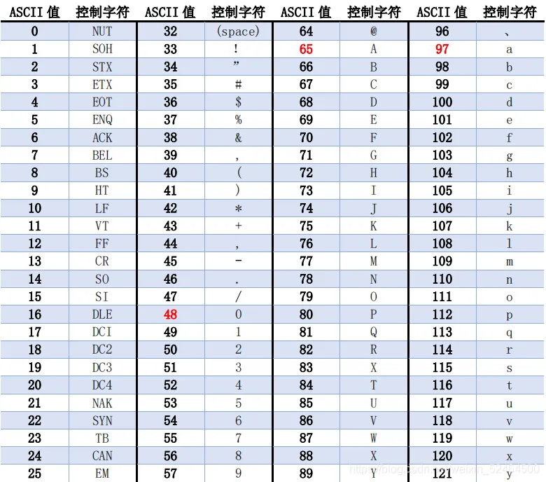

### 链表构造

```C++
struct ListNode {
    int val;
    ListNode *next;
    ListNode(int x) : val(x), next(NULL) {}
};
```


### 二叉树构造

```C++
struct TreeNode {
    int val;
    TreeNode *left;
    TreeNode *right;
    TreeNode() : val(0), left(nullptr), right(nullptr) {}
    TreeNode(int x) : val(x), left(nullptr), right(nullptr) {}
    TreeNode(int x, TreeNode *left, TreeNode *right) : val(x), left(left), right(right) {}
};

// 根据数组构造二叉树
TreeNode* construct_binary_tree(const vector<int>& vec, int nul) 
{
    vector<TreeNode*> vecTree(vec.size(), NULL);
    TreeNode* root = NULL;
    // 把输入数值数组，先转化为二叉树节点数组
    for (int i = 0; i < vec.size(); i++) {
        TreeNode* node = NULL;
        if (vec[i] != nul) node = new TreeNode(vec[i]); // 用 nul 表示null
        vecTree[i] = node;
        if (i == 0) root = node;
    }
    // 遍历一遍，根据规则左右孩子赋值就可以了
    // 注意这里 结束规则是 i * 2 + 2 < vec.size()，避免空指针
    for (int i = 0; i * 2 + 2 < vec.size(); i++) {
        if (vecTree[i] != NULL) {
            // 线性存储转连式存储关键逻辑
            vecTree[i]->left = vecTree[i * 2 + 1];
            vecTree[i]->right = vecTree[i * 2 + 2];
        }
    }
    return root;
}

vector<vector<int>> levelOrder(TreeNode* root) {
    vector<vector<int>> ans;
    if (root == nullptr) return ans;
    queue<TreeNode*> q;
    q.push(root);
    while (!q.empty())
    {
        int L = q.size();
        vector<int> ret;
        for (int i = 0;i < L;i++)
        {
            TreeNode* node = q.front();
            q.pop();
            ret.push_back(node->val);
            if (node->left) q.push(node->left);
            if (node->right) q.push(node->right);
        }
        ans.push_back(ret);
    }
    return ans;
}

void copyNode(TreeNode* root, TreeNode* node) //定义一个拷贝二叉树函数
{
    if (root->left==nullptr && root->right == nullptr) return;
    if (root->left)
    {
        node->left = new TreeNode(root->left->val);
        copyNode(root->left, node->left);
    }
    if (root->right)
    {
        node->right = new TreeNode(root->right->val);
        copyNode(root->right, node->right);
    }
}

int main()
{
    const int nul = 99;
    vector<int> tree{0,1,2,nul,3,4,nul,nul,nul,5,6};
    TreeNode* root = construct_binary_tree(tree, nul);
    myPrint_tree(tree,nul);
    vector<vector<int>> matTree;
    matTree = levelOrder(root);
    myPrint(matTree);
    //深拷贝root
    TreeNode* root2 = new TreeNode(root->val);
    copyNode(root, root2);
    vector<vector<int>> matTree2;
    matTree2 = levelOrder(root2);
    myPrint(matTree2);
}
```

[105. 从前序与中序遍历序列构造二叉树](https://leetcode.cn/problems/construct-binary-tree-from-preorder-and-inorder-traversal/)

给定两个整数数组 preorder 和 inorder ，其中 preorder 是二叉树的先序遍历， inorder 是同一棵树的中序遍历，请构造二叉树并返回其根节点。


输入: preorder = [3,9,20,15,7], inorder = [9,3,15,20,7]
输出: [3,9,20,null,null,15,7]

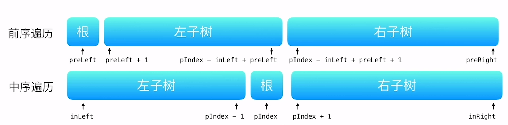

```C++
class Solution {
private:
    unordered_map<int, int> index;

public:
    TreeNode* myBuildTree(const vector<int>& preorder, const vector<int>& inorder, int preLeft, int preRight, int inLeft, int inRight) {
        if (preLeft > preRight) {
            return nullptr;
        }
        
        // 前序遍历中的第一个节点就是根节点
        int preorder_root = preLeft;
        // 在中序遍历中定位根节点
        int pIndex = index[preorder[preorder_root]];
        
        // 先把根节点建立出来
        TreeNode* root = new TreeNode(preorder[preorder_root]);
        // 得到左子树中的节点数目
        int size_left_subtree = pIndex - inLeft;
        // 递归地构造左子树，并连接到根节点
        // 先序遍历中「从 左边界+1 开始的 size_left_subtree」个元素就对应了中序遍历中「从 左边界 开始到 根节点定位-1」的元素
        root->left = myBuildTree(preorder, inorder, preLeft + 1, preLeft + size_left_subtree, inLeft, pIndex - 1);
        // 递归地构造右子树，并连接到根节点
        // 先序遍历中「从 左边界+1+左子树节点数目 开始到 右边界」的元素就对应了中序遍历中「从 根节点定位+1 到 右边界」的元素
        root->right = myBuildTree(preorder, inorder, preLeft + size_left_subtree + 1, preRight, pIndex + 1, inRight);
        return root;
    }

    TreeNode* buildTree(vector<int>& preorder, vector<int>& inorder) {
        int n = preorder.size();
        // 构造哈希映射，帮助我们快速定位根节点
        for (int i = 0; i < n; ++i) {
            index[inorder[i]] = i;
        }
        return myBuildTree(preorder, inorder, 0, n - 1, 0, n - 1);
    }
};
```


### 字符串操作

```C++
string s="123";  int a=atoi(s.c_str());

char a_char[10] = {'4','5','6','\0'};
string str= a_char;//可以直接赋值

#include <sstream>
stringstream ss;   ss << a_int;
string s = ss.str();  cout << s << endl;

str_new=str.replace(0,6,str1,4) //用str1的前四个字符串替换str的[0,6]的字符串
```


## 2.查找

lower_bound（第一个>=tar的位置，如果没有，则返回arr.size（））

```C++
{
    vector<int> arr = { 2,4,6,8 };
	int tar = 4;
	int index = -1;
	int L = 0, R = arr.size() - 1;
	while (L < R)
	{
		int M = L + (R - L) / 2;
		if (arr[M] == tar)
		{
			index = M;
			//break;
		}
		if (arr[M] < tar) //注意这里没有else，前面的index是为了判断最后退出时，L是没找到还是在最后
		{
			L = M+1;
		}
		else
		{
			R = M;
		}
	}
	if (arr[L] == tar) index = L;//因为L=M+1，如果此时因L退出，并没有判断L是否满足，这里补充判断
	if (index == -1) L++; //这里L实现了lower_bound（第一个大于等于tar的下标）
	cout <<index<<"___"<<L<<endl; //index 找到为下标，找不到为-1
 }
```

upper_bound（第一个>tar的位置，如果没有，则返回arr.end()）

```C++
{
    vector<int> arr = { 2,4,6,8 };
	int tar = 4;
	int index = -1;
	int L = 0, R = arr.size() - 1;
	while (L < R)
	{
		int M = L + (R - L) / 2;
		if (arr[M] == tar)
		{
			index = M;
			//break;
		}
		if (arr[M] <= tar) //注意这里没有else，前面的index是为了判断最后退出时，L是没找到还是在最后
		{
			L = M+1;
		}
		else
		{
			R = M;
		}
	}
	if (arr[L] == tar) index = L;
	if (index == -1) L++;
	cout <<index<<"___"<<L<<endl;
 }
```

## 3.自动排序


```C++
#include <functional.h>

set<int, greater<int>> myset;

sort(arr.begin(),arr.end(),less<int>()); //默认从小到大
sort(arr.begin(),arr.end(),greater<int>());
```


**相同项再排序**


使用lambda表达式，指定位置为关键值进行排序

```C++
auto tup1 = make_tuple("bca", 'a', 2, 3, 9);
auto tup20 = make_tuple("bac", 'a', 2, 3, 4);
auto tup2 = make_tuple("bac", 'a', 2, 3, 7);
auto tup3 = make_tuple("abc", 'a', 2, 3, 9);
auto tup4 = make_tuple("cab", 'a', 2, 2, 8);
auto tup5 = make_tuple("aba", 'b', 1, 5, 3);

vector<tuple<string, char, int, int,int>> tups = {tup1,tup20,tup2,tup3,tup4,tup5};
//按默认顺序依次排,vector<string>也可以，但是对于vector<vector<int>>就只会按第一列排序
sort(tups.begin(), tups.end());
//按照指定列进行排序
sort(tups.begin(), tups.end(), [](auto &a, auto &b) 
    {
        return get<2>(a) < get<2>(b);
    });

for (auto iter = tups.begin();iter != tups.end();iter++)
{
    tuple<string, char, int, int, int> tupp = *iter;
    cout << get<0>(tupp) <<" "<< get<1>(tupp) << " " << get<2>(tupp) << " " << get<3>(tupp) << " " << get<4>(tupp) << endl;
}
```

使用lambda表达式，依次按顺序进行排序

```C++
vector<vector<int>> v{ v1,v2,v3,v4 };
sort(v.begin(), v.end(), [](vector<int>& a, vector<int>& b) {
        int i = 0;
        while (i < a.size() && a[i] == b[i]){i++;}
        return a[i] < b[i];
    });
```

使用set容器，自动按照下一个元素进行排序

```C++
vector<int> v1{ 2,3,9 };
vector<int> v2{ 2,3,7 };
vector<int> v3{ 2,2,8 };
vector<int> v4{ 1,5,3 };
set<vector<int>> setv{v1,v2,v3,v4}; //直接用vector<vector<int>>进行sort，仅仅按照第一列排序
for (auto iter = setv.begin();iter != setv.end();iter++)
{
    vector<int> vec = *iter;
    myPrint(vec);
}
输出：
-------------
1 5 3
2 2 8
2 3 7
2 3 9
-------------
```

**线性容器排序自定义sort规则**

```C++
vector<vector<int>> mat;
sort(mat.begin(),mat.end(),[](vector<int> &a,vector<int> &b){return a[1]<b[1];});
```

```C++
bool cmp(int v1,int v2)
{
  return v1>v2;
}
int s[]={15,17,5,7};
int n=4;
sort(s,s+n,cmp);  
```

**有序容器自定义排序**

```C++
set<int, greater<int>> set={15,17,7,5}; //17 15 7 5
map<int, string, greater<int>> mp; //key值从大到小排序
mp[2] = "ccc";
```

```C++
// map 的自定义数据类型排序
struct comp3
{
    // 这里的const一定不能省略，省略了会报错，但是我不知道为什么
	bool operator()(vector<int> const &a, vector<int> const &b) const  
	{																   
		return a[0] < b[0];  // 按v[0]进行从小到大排序  
		// return a[1] < b[1]; // 按v[1]进行从小到大排序  
	}
};
void func3()
{
	map<vector<int>, int, comp3> mp3;
	mp3[{5, 1}] = 1;
	mp3[{3, 2}] = 2;
	mp3[{1, 6}] = 3;
	mp3[{4, 3}] = 4;
	mp3[{6, 4}] = 5;
	for (auto m : mp3)
	{
         cout << m.first[0] << " and " << m.first[1] << " " << m.second << endl;
	}
}
```


## 4.暴力偷分

### 枚举子集

```C++
输入：nums = [1,2,3]
输出：[[],[1],[2],[1,2],[3],[1,3],[2,3],[1,2,3]]

vector<vector<int>> subsets(vector<int>& nums) {
    vector<vector<int>> ans{{}};
    for(int i=0;i<nums.size();i++)
    {
        vector<vector<int>> temp=ans;
        for(auto vec:temp)
        {
            vec.push_back(nums[i]);
            ans.push_back(vec);
        }
    }
    return ans;
}
```

### 全排列

```C++
输入：nums = [1,2,3]
输出：[[1,2,3],[1,3,2],[2,1,3],[2,3,1],[3,1,2],[3,2,1]]
    
vector<vector<int>> permute(vector<int>& nums) {
    vector<vector<int>> res;
    vector<int> temp;
    backTracking(nums,res,temp);
    return res;
}
void backTracking(vector<int>& nums,vector<vector<int>>& res,vector<int>& temp)
{
    if(temp.size()==nums.size())
    {
        res.push_back(temp);
        return;
    }
    for(int i=0;i<nums.size();i++)
    {
        auto iter=find(temp.begin(),temp.end(),nums[i]);
        if(iter!=temp.end())  continue; //已经有的就不要插入了
        temp.push_back(nums[i]);
        backTracking(nums,res,temp);
        temp.pop_back();
    }
}
```


## 5.常见算法

**判断质数**

```C++
bool isPrime(int n)
{
    if (n <= 1) return false;
    else
    {
        int sq = sqrt(n);//减少判断次数
        for (int i = 2;i <= sq;i++)
        {
            if (n % i == 0) return false;
        }  
    }
    return true;
}
```

**最大公约数**

辗转相除法

```C++
inline int gcd(int a,int b) //循环实现
{    
    int r;    
    while(b>0)
    {        
        r=a%b;        
        a=b;        
        b=r;    
    }    
    return a;
}
```

```C++
inline int gcd(int a,int b)  //递归实现
{    
    return b>0 ? gcd(b,a%b):a;
}
```


# 三、LC算法

> 面向LeetCode

## 1.递归

LeetCode 372 题 Super Pow

你的任务是计算 `ab` 对 `1337` 取模，`a` 是一个正整数，`b` 是一个非常大的正整数且会以数组形式给出。

**示例 3：**

```
输入：a = 1, b = [4,3,3,8,5,2]
输出：1
```

**⼀是如何处理⽤数组表⽰的指数，** 现在 b 是⼀个数组， 也就是说 b 可以⾮常⼤， 没办法直接转成整型， 否则可能溢出。 你怎么把这个数组作为指数， 进⾏运算呢？
$$
a^{[1,5,6,4]}
=a^4\times a^{[1,5,6,0]}
=a^4\times (a^{[1,5,6]})^{10}
$$
**⼆是如何得到求模之后的结果？** 按道理， 起码应该先把幂运算结果算出来，然后做 % 1337 这个运算。 但问题是， 指数运算你懂得， 真实结果肯定会⼤得吓⼈， 也就是说， 算出来真实结果也没办法表⽰， 早都溢出报错了。

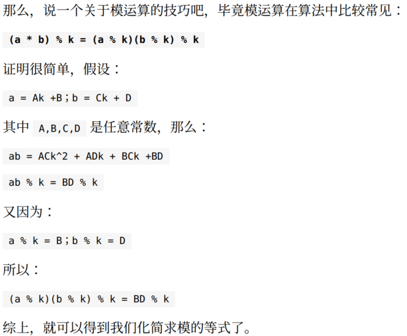

对于本题，$a^n\%k=(a\%k*a\%k*a\%k...*a\%k)\%k$，

**三是如何⾼效进⾏幂运算，** 进⾏幂运算也是有算法技巧的， 如果你不了解这个算法， 后⽂会讲解。

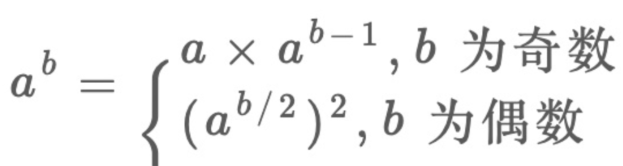

```C++
class Solution {
public:
    int superPow(int a, vector<int>& b) {
        if(b.empty()) return 1;
        int part1,part2;
        for(int i=0;i<b.size();i++)
        {
            int last=b.back();
            b.pop_back();
            part1=myPow(a,last);
            part2=myPow(superPow(a,b),10);
        }
        return part1*part2%1337;
    }

    int myPow(int a,int k) 
    {
        // 方法一：循环累乘
        // int res=1;
        // a %= 1337; //不加这个，不能全部通过 ？？
        // for(int _=0;_<k;_++)
        // {
        //     res*=a;
        //     res%=1337; //在普通的求幂运算中多了一行求余
        // }
        // return res;
        // 方法二：折半递归的思想
        if(k==0) return 1;
        a %= 1337; //不加这个，不能全部通过 ？？
        if(k%2==1)
        {
            return a*myPow(a,k-1)%1337;
        }
        else
        {
            int out=myPow(a,k/2);
            return out*out % 1337;
        }
    }
};
```


## 2.贪心法

顾名思义，采用贪心的策略，每一步骤都是局部最优，从而寻求最终结果最优。

### 分配问题

**455. Assign Cookies (Easy)**

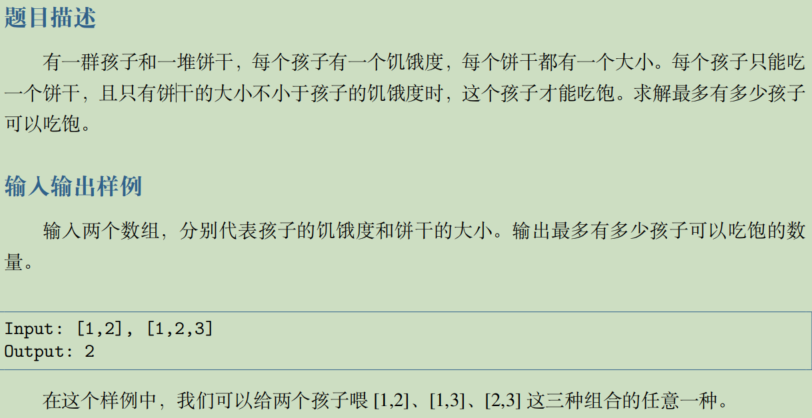

排序+贪心

**135. Candy (Hard)**

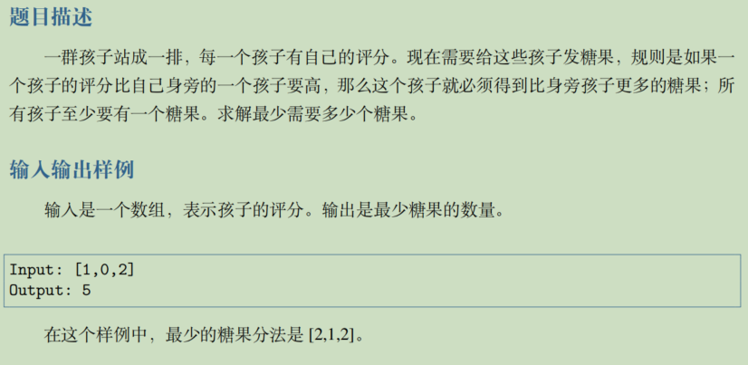

```C++
class Solution {
public:
    int candy(vector<int>& ratings) {
        int n=ratings.size();
        if(n==1) return 1;
        vector<int> count(n,1);
        cout<<count[0]<<" ";
        // 因为每一个数要和两边的比较，所以两次遍历，一次比较一边
        for(int i=1;i<n;i++)
        {
            if(ratings[i]>ratings[i-1])
            {
                count[i]=count[i-1]+1;
            }
            cout<<count[i]<<" ";
        }
        cout<<endl;
        // for(int i=n-2;i>=0;i--)
        // {
        //     if(ratings[i]>ratings[i+1])
        //     {
        //         count[i]=count[i+1]+1;
        //     }
        //     cout<<count[i]<<" ";
        // }
        for (int i = n - 1; i > 0; --i) 
        {
            if (ratings[i] < ratings[i-1]) 
            {
                count[i-1] = max(count[i-1], count[i] + 1);//这一步很关键，不理解2022.08.11
            } 
        }
        cout<<count[n-1]<<endl;
        return accumulate(count.begin(),count.end(),0);
    }
};
```

### 区间问题

**435. Non-overlapping Intervals (Medium)**

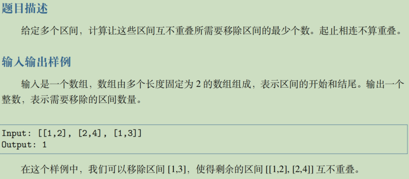

```C++
class Solution {
public:
    int eraseOverlapIntervals(vector<vector<int>>& intervals) {
        sort(intervals.begin(),intervals.end(),[](vector<int> &a,vector<int> &b){
            return a[1]<b[1];
        });// 使用lambda表达式，以区间右侧为关键值进行排序
        int n=intervals.size();
        int remove=0;
        int prev=intervals[0][1];
        for(int i=1;i<n;i++)
        {
            if(intervals[i][0]<prev)// 如果该区间与上个区间重合，则删除
            {
                remove++;
            }
            else
            {
                prev=intervals[i][1];
            }
        }
        return remove;
    }
};
```

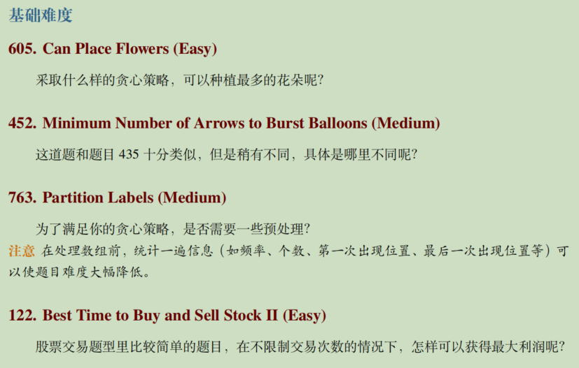

605✅

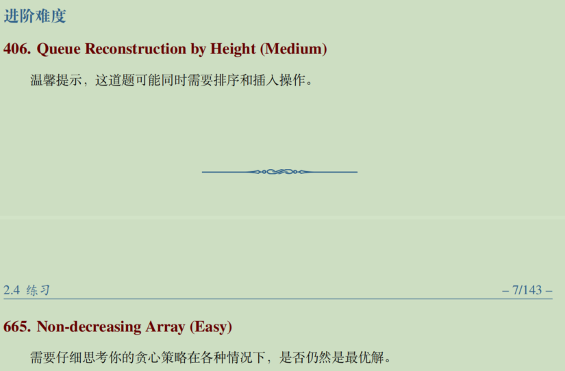

## 

## 3.二分查找

[74. 搜索二维矩阵](https://leetcode.cn/problems/search-a-2d-matrix/)

lower_bound（第一个>=tar的位置，如果没有，则返回arr.size（））

```C++
{
    vector<int> arr = { 2,4,6,8 };
	int tar = 4;
	int index = -1;
	int L = 0, R = arr.size() - 1;
	while (L < R)
	{
		int M = L + (R - L) / 2;
		if (arr[M] == tar)
		{
			index = M;
			//break;
		}
		if (arr[M] < tar) //注意这里没有else，前面的index是为了判断最后退出时，L是没找到还是在最后
		{
			L = M+1;
		}
		else
		{
			R = M;
		}
	}
	if (arr[L] == tar) index = L;//因为L=M+1，如果此时因L退出，并没有判断L是否满足，这里补充判断
	if (index == -1) L++; //这里L实现了lower_bound（第一个大于等于tar的下标）
	cout <<index<<"___"<<L<<endl; //index 找到为下标，找不到为-1
 }
```

upper_bound（第一个>tar的位置，如果没有，则返回arr.size（））

```C++
{
    vector<int> arr = { 2,4,6,8 };
	int tar = 4;
	int index = -1;
	int L = 0, R = arr.size() - 1;
	while (L < R)
	{
		int M = L + (R - L) / 2;
		if (arr[M] == tar)
		{
			index = M;
			//break;
		}
		if (arr[M] <= tar) //注意这里没有else，前面的index是为了判断最后退出时，L是没找到还是在最后
		{
			L = M+1;
		}
		else
		{
			R = M;
		}
	}
	if (arr[L] == tar) index = L;
	if (index == -1) L++;
	cout <<index<<"___"<<L<<endl;
 }
```

```C++
vector<int> arr={2,4,6,8,10};

if (binary_search(arr.begin(), arr.end(), 5)) {} //return bool 是否存在

//lower_bound:迭代器指向第一个大于或等于val的在[first，last)范围内的第一个元素
//upper_bound:迭代器指向第一个大于val的在[first，last)范围内的第一个元素
cout << *lower_bound(arr.begin(), arr.end(), 1) << endl;//2
cout << *lower_bound(arr.begin(), arr.end(), 5) << endl;//6
cout << *lower_bound(arr.begin(), arr.end(), 6) << endl;//6
cout << *upper_bound(arr.begin(), arr.end(), 5) << endl;//6
cout << *upper_bound(arr.begin(), arr.end(), 6) << endl;//8

//cout << *lower_bound(arr.begin(), arr.end(), 11) << endl;//此时返回arr.end()，程序崩溃
int target = 11;
auto it = lower_bound(arr.begin(), arr.end(), target);
if (it != arr.end() && *it == target) { std::cout << "Hello World!\n"; }; //对于不存在且不在范围内
```


## 4.动态规划

动态规划（Dynamic Programming, DP），一般用来求最优值。通俗来说，是将一个问题拆解成多个子问题进行求解。本质上是穷举的思想，但是不同的是他可以保留中间结果，避免重复的计算，是一种用空间换时间的方法。

- 动态规划只能运用于求解具有最优子结构（局部最优解能决定全局最优解）的问题，对于不满足这个要求的需要近似。
- 动态规划和其它遍历算法（深度、广度优先搜索）都是把原问题拆解成子问题进行求解，不同的是，动态规划保存子问题的解（当其它中间结果没用时，可以不保留，从而达到空间压缩的目的），避免重复计算。

**能采用动态规划解决的问题一般具有3个性质：**

1. 最优化原理：假设问题的最优解所包括的子问题的解也是最优的，就称该问题具有最优子结构，即满足最优化原理。
2. 无后效性：即某阶段状态一旦确定。就不受这个状态以后决策的影响。也就是说，某状态以后的过程不会影响曾经的状态，仅仅与当前状态有关。
3. 有重叠子问题：即子问题之间是不独立的，一个子问题在下一个阶段决策中可能被多次使用到（该性质并非动归必要条件，但是如果没有该性质，动归则不具优势）。

### 一维动态规划

**70. Climbing Stairs (Easy)**

假设你正在爬楼梯。需要 n 阶你才能到达楼顶。每次你可以爬 1 或 2 个台阶。你有多少种不同的方法可以爬到楼顶呢？

```C++
dp[0]=1;
dp[1]=2;
dp[i]=dp[i-1]+dp[i-2];
```

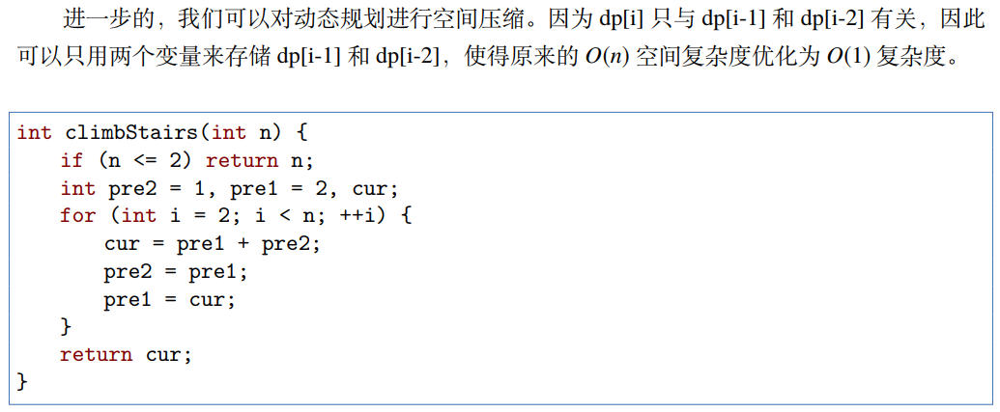

**198. House Robber (Easy)**

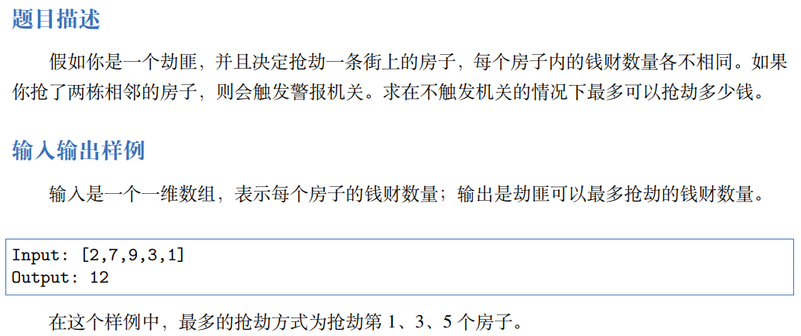

```C++
dp[0]=v[0];
dp[1]=max(dp[0],v[1]);
dp[i]=max(dp[i-2]+v[i],dp[i-1]);
```

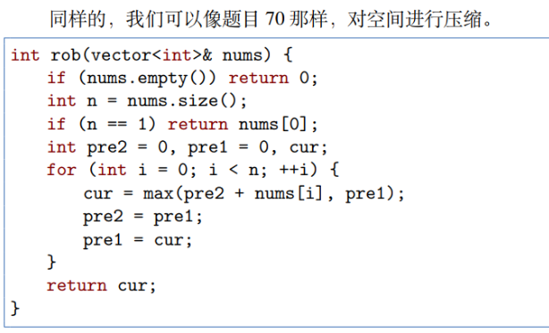

**1.8 股票交易**

**121. Best Time to Buy and Sell Stock (Easy)**

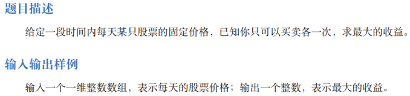

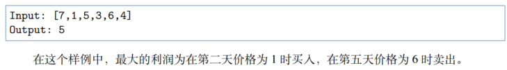

```C++
class Solution {
public:
    int maxProfit(vector<int>& prices) {
        int n=prices.size();
        int buy=INT_MAX,sell=0;
        for(int i=0;i<n;i++)
        {
            buy=min(buy,prices[i]);
            sell=max(sell,prices[i]-buy);
        }
        return sell;
    }
};
```


4**13. Arithmetic Slices (Medium)**

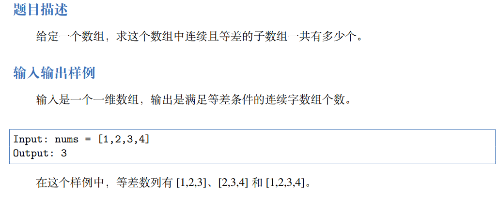

这个题不好理解，dp的初始化为0很重要

```C++
[1, 2, 3, 4, 5, 19, 20, 30, 40]。答案为7。
dp[]={0,0,1,2,3,0,0,0,1};
dp[i]表示当前位置结尾的数组中等差数列的数量，结果是所有位置求和。
```

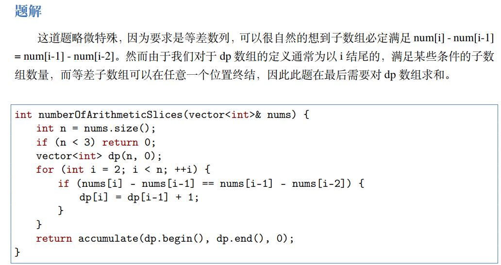


### 二维动态规划

**64. Minimum Path Sum (Medium)**

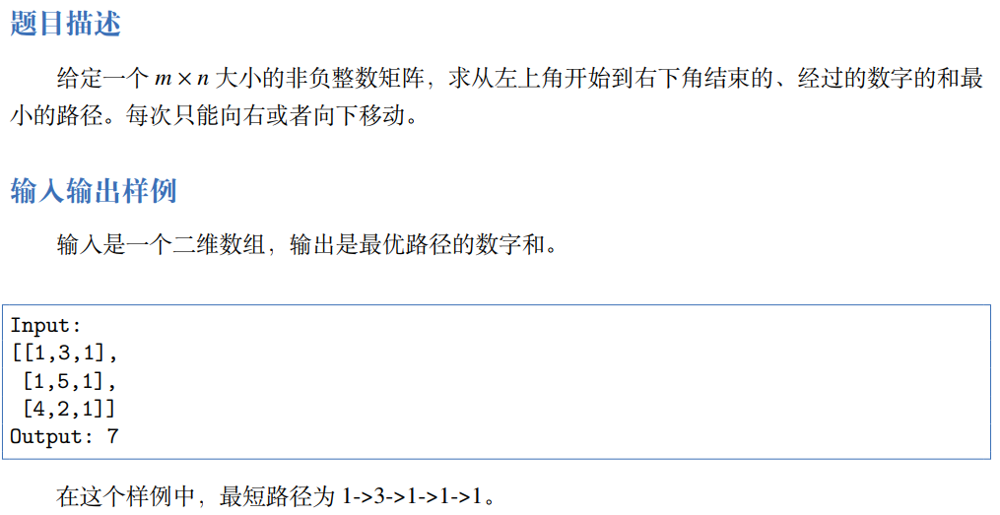

```C++
int minPathSum(vector<vector<int>>& grid) {
    int m=grid.size(),n=grid[0].size();
    vector<vector<int>> dp(m, vector<int>(n,0));
    for(int i=0;i<m;i++)
    {
        for(int j=0;j<n;j++)
        {
            if(i==0 && j==0)
            {
                dp[i][j]=grid[i][j];
            }
            else if(i==0)
            {
                dp[i][j]=dp[i][j-1]+grid[i][j];
            }
            else if(j==0)
            {
                dp[i][j]=dp[i-1][j]+grid[i][j];
            }
            else
            {
                dp[i][j]=min(dp[i][j-1],dp[i-1][j])+grid[i][j];
            }
        }
    }
    return dp[m-1][n-1];
}
```

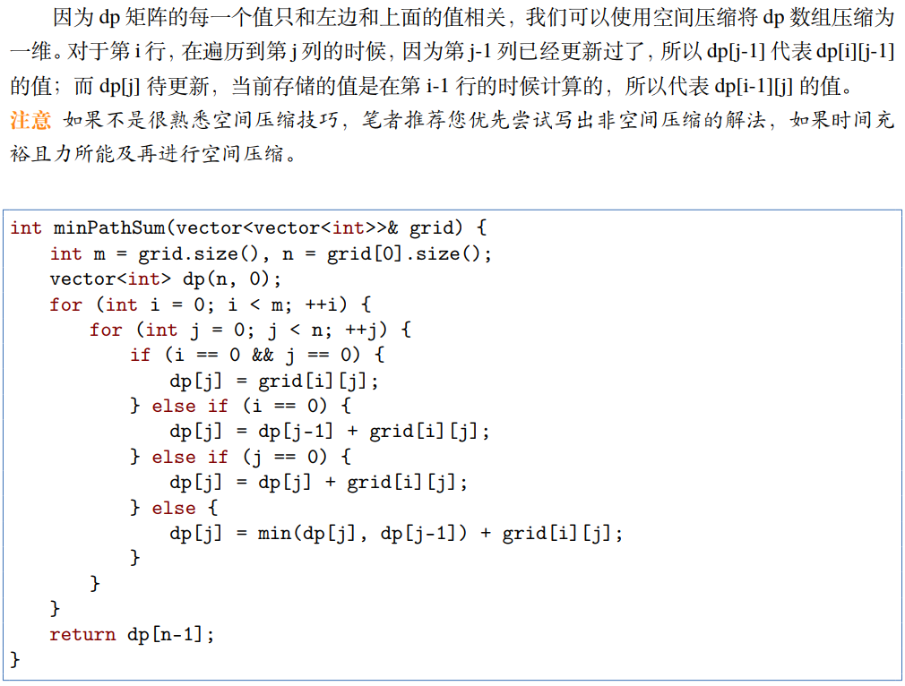

**542. 01 Matrix (Medium)**

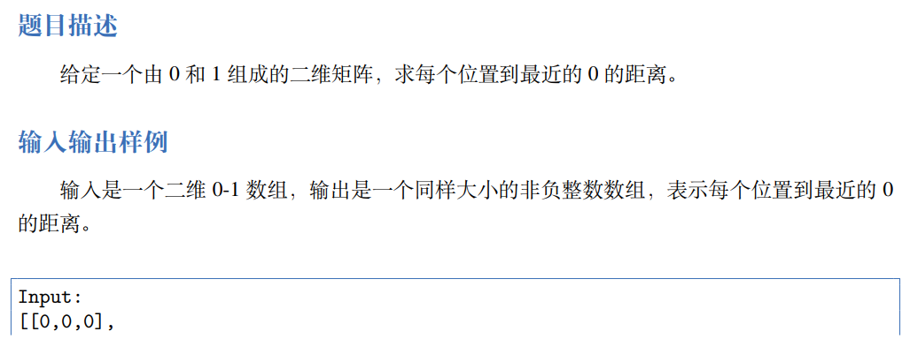

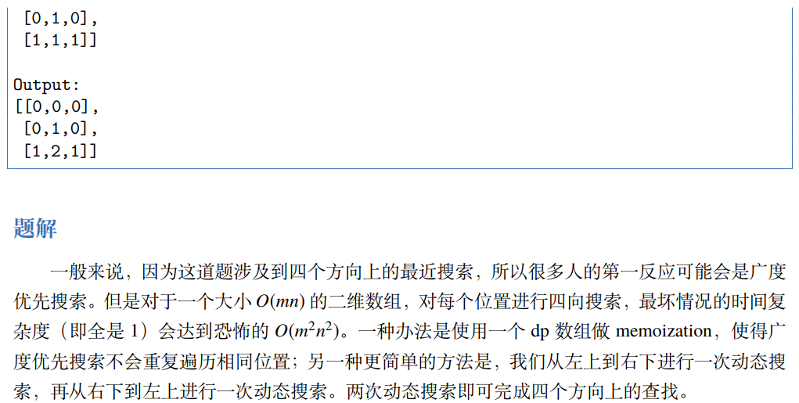

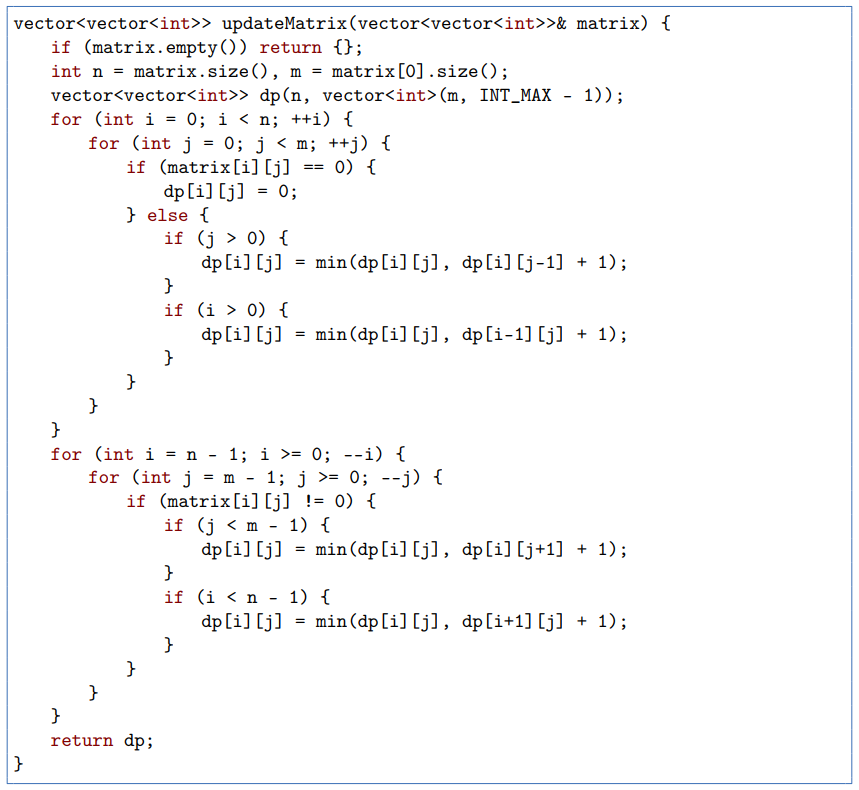

**221. Maximal Square (Medium)**

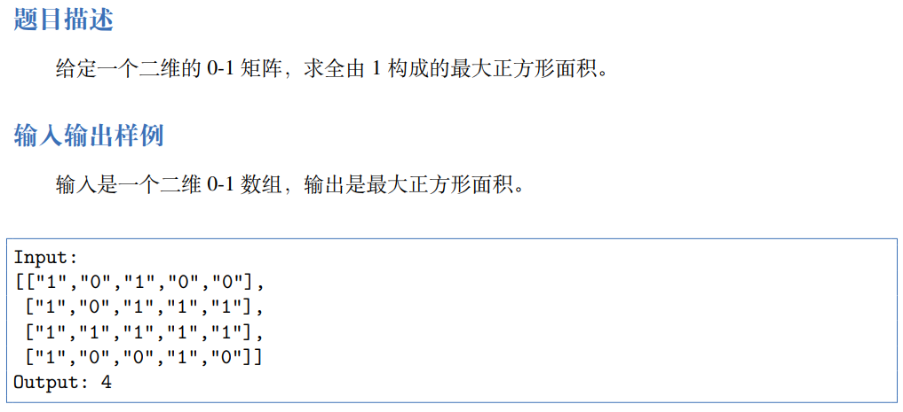

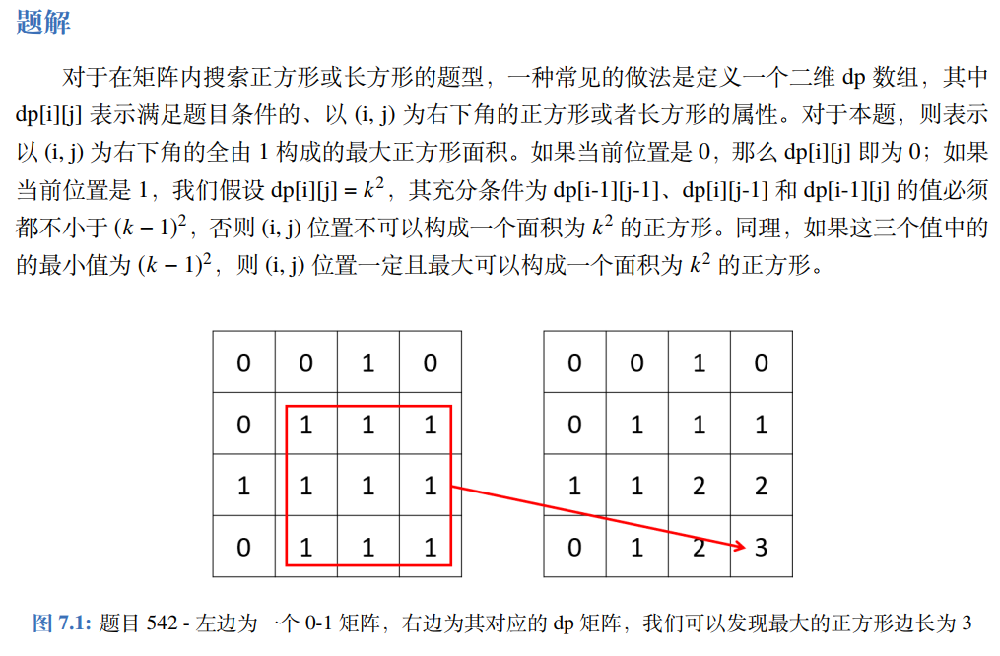

```C++
int m=matrix.size(),n=matrix[0].size();
//很妙，多开一圈，避免边界条件的处理。
vector<vector<int>> dp(m+1,vector<int>(n+1,0));
int max_side = 0;
for(int i=1;i<=m;i++)
{
    for(int j=1;j<=n;j++)
    {
        if(matrix[i-1][j-1]=='1')
        {
            dp[i][j]=min(dp[i-1][j-1], min(dp[i][j-1], dp[i-1][j])) + 1;
        }
        max_side = max(max_side,dp[i][j]);
    }
}
return max_side*max_side;
```


### ❗分割类问题

279.Perfect Squares (Medium)

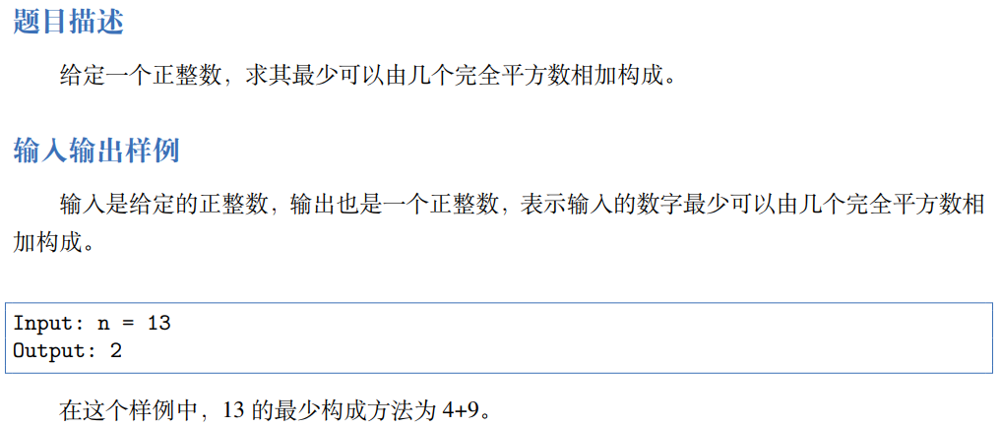

**（这个突然就不懂了又2022.03.02）**

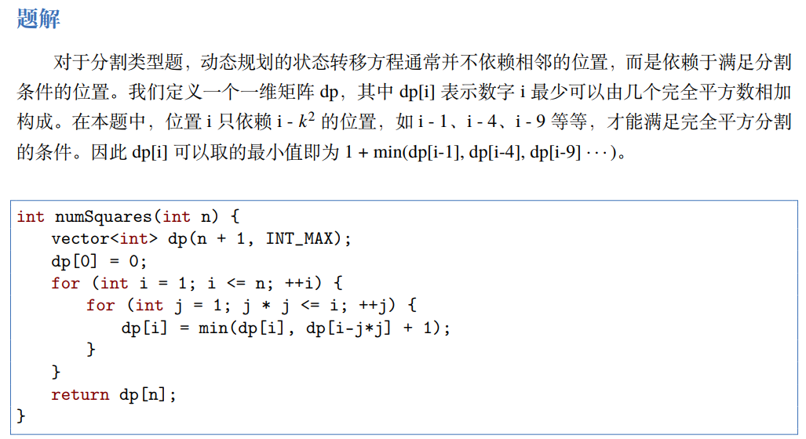

```C++
int numSquares(int n) {
    vector<int> f(n + 1);
    for (int i = 1; i <= n; i++) {
        int minn = i; //最大是n个1
        for (int j = 1; j * j <= i; j++) {
            minn = min(minn, f[i - j * j]);
        }
        f[i] = minn + 1;
    }
    return f[n];
}
```

**91. Decode Ways (Medium)**

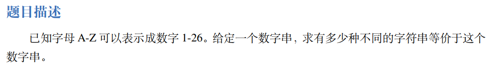

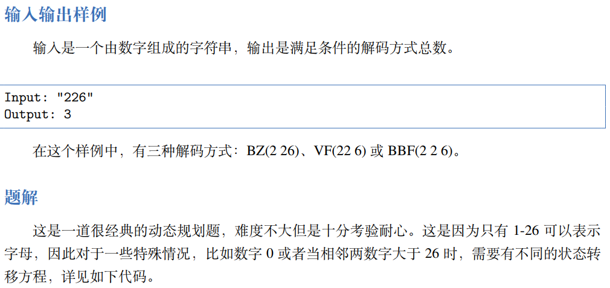

```C++
int numDecodings(string s) {
    if(s[0]=='0') return 0;
    int n=s.size();
    if(n==1) return 1;
    // vector<int> dp(n,0);
    // dp[0]=1,dp[1]=2;//当第二个数字是0，这样初始化不对，所以第二位是要算出来的
    vector<int> dp(n+1,1);
    for(int i=2;i<n+1;i++)
    {
        if (s[i-1] == '0' && (s[i-2] == '0' || s[i-2] > '2')) return 0;//这是个坑
        int num=(s[i-2]-'0')*10+(s[i-1]-'0');
        if(num<=26 && s[i-2]!='0')
        {
            if(s[i-1]=='0')//这是个坑
            {
                dp[i]=dp[i-2];
            }
            else
            {
                dp[i]=dp[i-1]+dp[i-2];
            }
        }
        else
        {
            dp[i]=dp[i-1];
        }  
    }
    return dp[n];
}

```

**139. Word Break (Medium)**

（不理解）

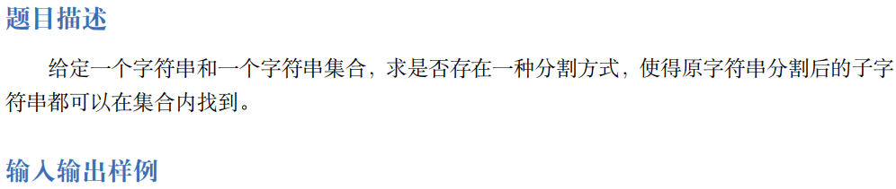

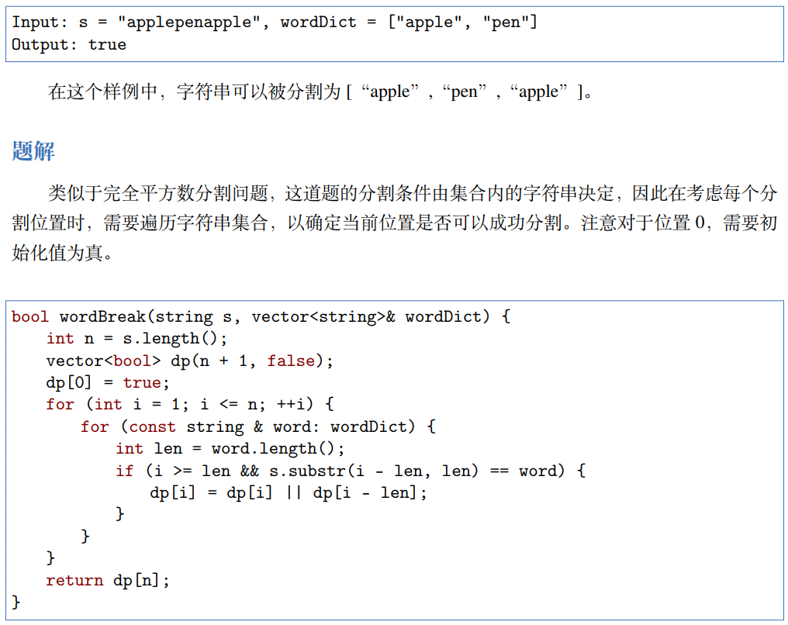


### ❗子序列问题

**300. Longest Increasing Subsequence (Medium)**

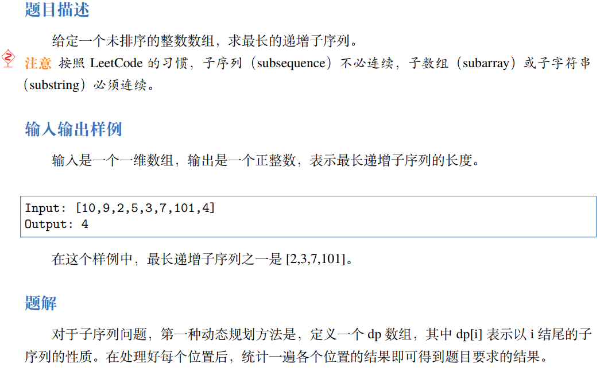


```C++
int lengthOfLIS(vector<int>& nums) {
    int n = nums.size();
    if (n == 0) return 0;
    // dp[i]表示以i结尾的最长子序列
    // dp[j]表示以j结尾的最长子序列
    vector<int> dp(n, 1); 
    for (int i = 0; i < n; ++i) {
        for (int j = 0; j < i; ++j) {
            if (nums[j] < nums[i]) {
                dp[i] = max(dp[i], dp[j] + 1);
            }
        }
    }
    return *max_element(dp.begin(), dp.end());
}
```

**1143. Longest Commom Subsequence (Medium)**

给定两个字符串 text1 和 text2，返回这两个字符串的最长公共子序列 的长度。如果不存在 公共子序列 ，返回 0 。

示例 1：

```c++
输入：text1 = "abcde", text2 = "ace" 
输出：3  
解释：最长公共子序列是 "ace" ，它的长度为 3 。
```

dp[i] [j]表示text1[i]和text2[j]之前最长的公共子序列。
与两个字符串最小编辑距离有异曲同工之妙。

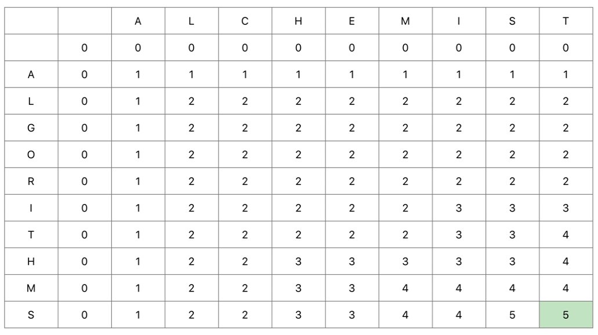

```C++
int longestCommonSubsequence(string text1, string text2) {
    int n1=text1.size();
    int n2=text2.size();
    vector<vector<int>> dp(n1+1,vector<int>(n2+1,0));
    for(int i=1;i<=n1;i++)
    {
        for(int j=1;j<=n2;j++)
        {
            //如果相等，则两者减去当前位置的上一个+1
            if(text1[i-1]==text2[j-1]) dp[i][j]=dp[i-1][j-1]+1;
            //不等，则其一减去一个的前一个位置
            else dp[i][j]=max(dp[i-1][j],dp[i][j-1]);
        }
    }
    return dp[n1][n2];
}
```


### ❗背包问题(TODO)

背包问题是一种组合优化的 NP 完全问题：有 N 个物品和容量为 W 的背包，每个物品都有自己的体积 w 和价值 v，求拿哪些物品可以使得背包所装下物品的总价值最大。如果限定每种物品只能选择 0 个或 1 个，则问题称为 **0-1 背包问题**；如果不限定每种物品的数量，则问题称为**无界背包问题**或**完全背包问题**。

#### 1）0-1背包

**有n个物品，它们有各自的体积和价值，现有给定容量的背包，如何让背包里装入的物品具有最大的价值总和？**

我们可以用动态规划来解决背包问题。以 0-1 背包问题为例。我们可以定义一个二维数组 dp存储最大价值，其中 dp[i] [j] 表示前 i 件物品体积不超过 j 的情况下能达到的最大价值。在我们遍历到第 i 件物品时，在当前背包总容量为 j 的情况下，如果我们不将物品 i 放入背包，那么 dp[i] [j]= dp[i-1] [j]，即前 i 个物品的最大价值等于只取前 i-1 个物品时的最大价值；如果我们将物品 i 放入背包，假设第 i 件物品体积为 w，价值为 v，那么我们得到 dp[i][j] = dp[i-1] [j-w] + v。我们只需在遍历过程中对这两种情况取最大值即可，总时间复杂度和空间复杂度都为 O(NW)。

> 对于二维的dp，先遍历价值还是先遍历容量都可以

为方便讲解和理解，下面讲述的例子均先用具体的数字代入，即：eg：number＝4，capacity＝10

| w    | v    |      | 0    | 1    | 2    | 3     | 4    | 5     | 6    | 7    | 8    | 9    | 10   |
| ---- | ---- | ---- | ---- | ---- | ---- | ----- | ---- | ----- | ---- | ---- | ---- | ---- | ---- |
| 体积 | 价值 | i=0  | 0    | 0    | 0    | 0     | 0    | 0     | 0    | 0    | 0    | 0    | 0    |
| 2    | 1    | i=1  | 0    | 0    | 1    | 1     | 1    | 1     | 1    | 1    | 1    | 1    | 1    |
| 3    | 3    | i=2  | 0    | 0    | 1    | ==3== | 3    | ==4== | 4    | 4    | 4    | 4    | 4    |
| 4    | 5    | i=3  | 0    | 0    | 1    | 3     | 5    |       |      |      |      |      |      |
| 7    | 9    | i=4  |      |      |      |       |      |       |      |      |      |      |      |

dp[i] [j] = max(dp[i-1] [j], ==dp[i-1]== [j-w[i]] + v[i]) //外层i物品，内层j容量dp[j]=max(dp[j], dp[j-w[i]]+v[i]) //容量逆序，用的是旧数据

```C++
int knapsack(vector<int> weights, vector<int> values, int N, int W) 
{
    vector<vector<int>> dp(N + 1, vector<int>(W + 1, 0));
    for (int i = 1; i <= N; ++i) //遍历价值
    {
        int w = weights[i-1], v = values[i-1];
        for (int j = 1; j <= W; ++j) //遍历容量
        {
            if (j >= w) //如果剩余的容量可以满足当前的物体，则可以考虑放还是不放
            {
                // max(（不放）上次价值，（放）减去当前物体容量后的最大价值+当前物体价值)
                dp[i][j] = max(dp[i-1][j], dp[i-1][j-w] + v); 
            } 
            else //如果剩余的容量不满足当前的物体，只能不放，最大价值为上次最大价值。
            {
                dp[i][j] = dp[i-1][j];
            }
        }
    }
    return dp[N][W];
}
```

可以进一步对 0-1 背包进行空间优化，将空间复杂度降低为 O（W）。因为当前的状态只取决于上一行的状态，可以把二维dp矩阵降为一维。

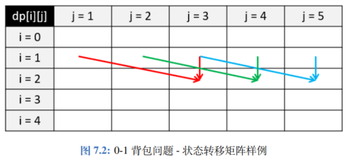

要注意我们在遍历每一行的时候**必须逆向遍历**，这样才能够调用上一行物品 i-1 时 dp[j-w] 的值；若按照从左往右的顺序进行正向遍历，则 dp[j-w] 的值在遍历到j 之前就已经被更新成物品 i 的值了。（简单来说，自身利用过的信息才能被覆盖）

```C++
int knapsack(vector<int> weights, vector<int> values, int N, int W) 
{
    vector<int> dp(W + 1, 0);
    for (int i = 1; i <= N; ++i) 
    {
        int w = weights[i-1], v = values[i-1];
        for (int j = W; j >= w; --j) // 这里j >= w隐含了j>=0
        {
            dp[j] = max(dp[j], dp[j-w] + v);
        }
    }
    return dp[W];
}
```

**416. Partition Equal Subset Sum (Medium)**

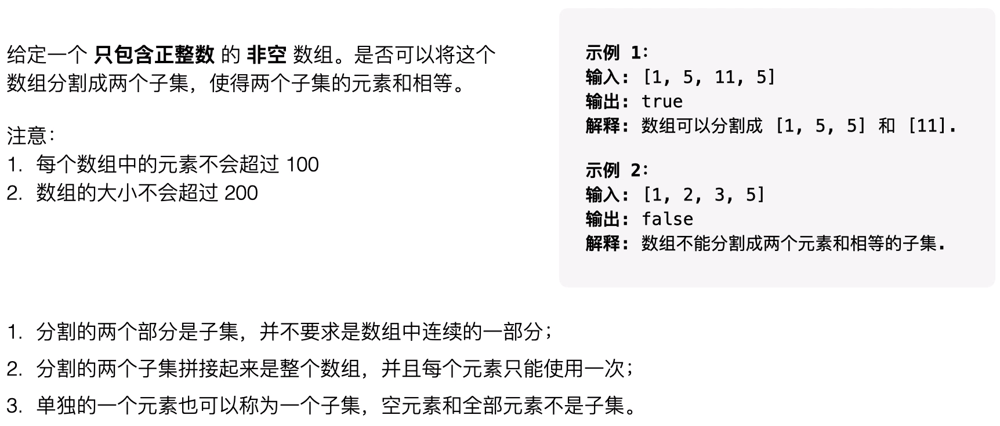

方法1：暴力方法是使用回溯枚举所有子集

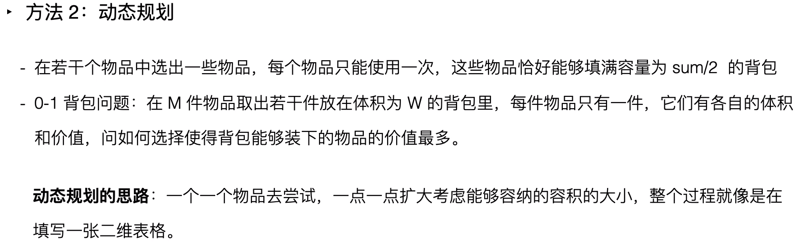

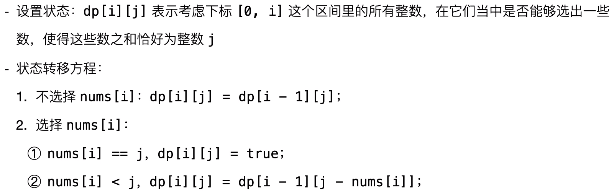

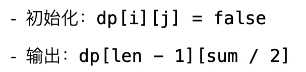

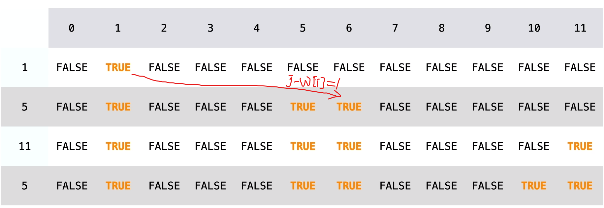

观察发现，上一行为true，下一行一定为true，这是“或”运算的逻辑。

https://leetcode-cn.com/problems/partition-equal-subset-sum/submissions/


#### 2）完全背包

在完全背包问题中，一个物品可以拿多次。

一个朴素的思想是，在0-1背包的基础上再增加一个for循环，用来对一个物体选多次【0，j/w】

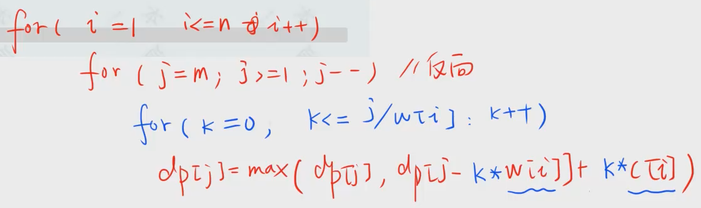

这是可以的，但是 时间复杂度O(m*n*j/w)

0-1背包

| w    | v    |      | 0    | 1    | 2    | 3     | 4    | 5     | 6    | 7    | 8    | 9    | 10   |
| ---- | ---- | ---- | ---- | ---- | ---- | ----- | ---- | ----- | ---- | ---- | ---- | ---- | ---- |
|      |      | 0    | 0    | 0    | 0    | 0     | 0    | 0     | 0    | 0    | 0    | 0    | 0    |
| 2    | 1    | 1    | 0    | 0    | 1    | 1     | 1    | 1     | 1    | 1    | 1    | 1    | 1    |
| 3    | 3    | 2    | 0    | 0    | 1    | ==3== | 3    | ==4== | 4    | 4    | 4    | 4    | 4    |
| 4    | 5    | 3    | 0    | 0    | 1    | 3     | 5    |       |      |      |      |      |      |
| 7    | 9    | 4    |      |      |      |       |      |       |      |      |      |      |      |
|      |      |      |      |      |      |       |      |       |      |      |      |      |      |

dp[i] [j] = max(dp[i-1][j], dp[i-1][j-w[i]] + v[i]) //外层i物品，内层j容量

dp[j]=max(dp[j], dp[j-w[i]]+v[i]) //容量逆序，用的是旧数据

完全背包

| w    | v    |      | 0    | 1    | 2    | 3     | 4    | 5    | 6     | 7    | 8    | 9    |
| ---- | ---- | ---- | ---- | ---- | ---- | ----- | ---- | ---- | ----- | ---- | ---- | ---- |
|      |      | 0    | 0    | 0    | 0    | 0     | 0    | 0    | 0     | 0    | 0    | 0    |
| 2    | 1    | 1    | 0    | 0    | 1    | 1     | 2    | 2    | ==3== | 3    | 4    | 4    |
| 3    | 3    | 2    | 0    | 0    | 1    | ==3== | 3    | 4    | ==6== | 6    | 7    |      |
| 4    | 5    | 3    |      |      |      |       |      |      |       |      |      |      |
| 7    | 9    | 4    |      |      |      |       |      |      |       |      |      |      |

dp[i] [j] = max(dp[i-1][j], dp[i][j-w[i]] + v[i])  //外层i物品，内层j容量

dp[j]=max(dp[j], dp[j-w[i]]+v[i]) //容量顺序，用到的是新数据


#### 3）多重背包

w[i]的数量有限制对应s[i]，在0-1背包的基础上，同样有朴素的思想。

```C++
//w,v,s
for(int i=1;i<=w.size();i++)
{
    for(int j=bag.size();j>=1;j--)
    {
        for(int k=0;k<=s[i]&&j>=k*w[i];k++)
        {
            dp[j]=max(dp[j],dp[j-k*w[i]]+k*v[i]);
        }
    }
}
return dp[]
```

**多重背包的二进制优化**

https://www.bilibili.com/video/BV1C7411K79w?p=4&spm_id_from=pageDriver

**二维费用背包**

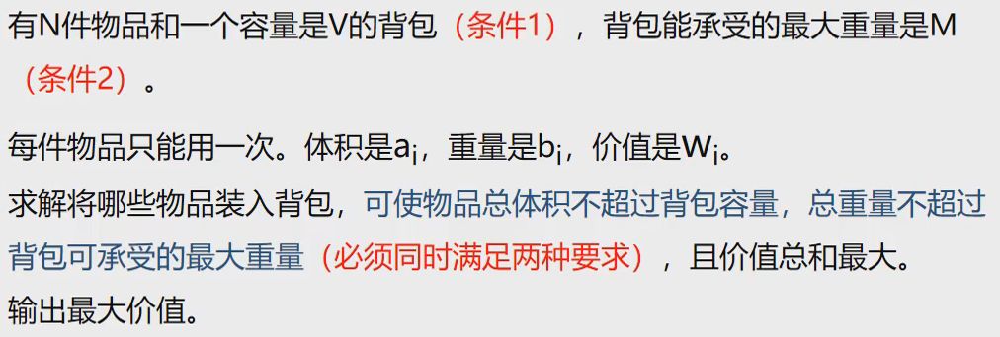

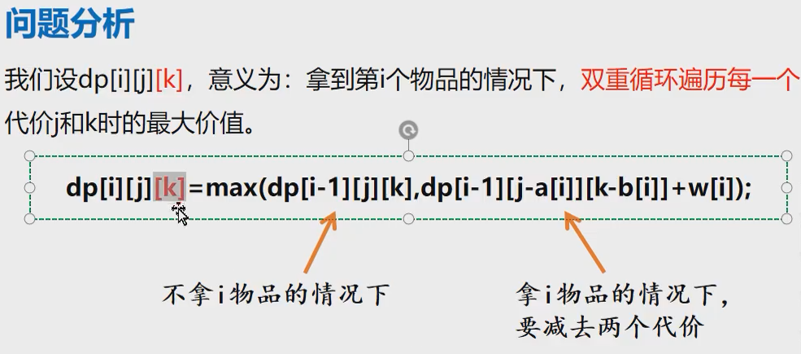

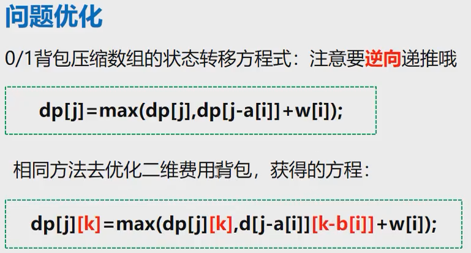

**474. Ones and Zeroes (Medium)**

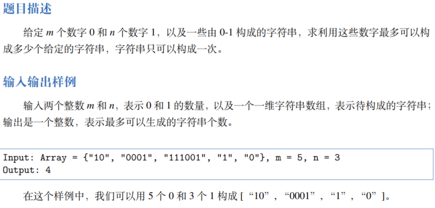

```C++
class Solution {
public:
    int findMaxForm(vector<string>& strs, int m, int n) {
        vector<vector<int>> dp(m+1,vector<int>(n+1,0));
        for(string str:strs)
        {
            auto [count0,count1]=count(str);
            for(int i=m;i>=count0;i--)
            {
                for(int j=n;j>=count1;j--)
                {
                    dp[i][j]=max(dp[i][j],dp[i-count0][j-count1]+1);
                }
            }
        }
        return dp[m][n];
    }
    pair<int,int> count(string& str)
    {
        int count0=0,count1=0;
        for(char c:str)
        {
            c=='0' ? count0++ : count1++;
        }
        return make_pair(count0,count1);
    }
};
```

**322. Coin Change (Medium)**

| i\j  |      | 0    | 1    | 2    | 3    | 4    | 5    | 6    | 7    | 8    | 9    | 10   | 11   |
| ---- | ---- | ---- | ---- | ---- | ---- | ---- | ---- | ---- | ---- | ---- | ---- | ---- | ---- |
| 0    | 0    | 0    | 0    | 0    | 0    | 0    | 0    | 0    | 0    | 0    | 0    | 0    | 0    |
| 1    | 1    | 0    | 1    | 2*1  | 3*1  | 4*1  | 5    | 6    | 7    | 8    | 9    | 10   | 11   |
| 2    | 2    | 0    | 1    | 1*2  | 2    | 2    | 3    |      |      |      |      |      |      |
| 3    | 5    | 0    | 1    | 1    | 2    | 2    |      |      |      |      |      |      |      |
|      |      |      |      |      |      |      |      |      |      |      |      |      |      |

```C++
class Solution {
public:
    int coinChange(vector<int>& coins, int amount) {
        //完全背包问题
        vector<int> dp(amount+1,amount+1); 
        //最大为amount个1，再加1就不会超过这个，比你用INT_MAX-1好多了
        dp[0]=0;
        for(int i=1;i<=coins.size();i++)
        {
            for(int j=0;j<=amount;j++)
            {
                if(j>=coins[i-1])
                {
                    dp[j]=min(dp[j],dp[j-coins[i-1]]+1);
                }
            }
        }
        return dp[amount]==amount+1 ? -1 : dp[amount];
    }
};
```


## 5.双指针

- 双指针主要用于遍历数组，两个指针指向不同的元素，从而协同完成任务。也可以延伸到多个数组的多个指针。
- 若两个指针指向同一数组，遍历方向相同且不会相交，则也称为滑动窗口（两个指针包围的区域即为当前的窗口），经常用于区间搜索。
- 若两个指针指向同一数组，但是遍历方向相反，则可以用来进行搜索，待搜索的数组往往是排好序的。
- 对于 C++ 语言，指针还可以玩出很多新的花样。一些常见的关于指针的操作如下。

**归并有序数组**：参考归并排序

**快慢指针**：参考链表中笔记，判断是否有环，环的入口，链表的中值等。

### N数之和

**167.两数之和**

有序可以想到二分查找

双指针法，两边往中间找

🔥**15.三数之和**

外层循环固定一个数，内层转化为两数之和

**16.最接近的三数之和**

**18.四数之和**

### 滑动窗口

**76. Minimum Window Substring (Hard)**

**这个没有完全解决**


## ✍6.分治

顾名思义， 分治问题由“分”（divide）和“治”（conquer）两部分组成，通过把原问题分为子问题，再将子问题进行处理合并，从而实现对原问题的求解。我们在排序章节展示的归并排序就是典型的分治问题，其中“分”即为把大数组平均分成两个小数组，通过递归实现，最终我们会得到多个长度为 1 的子数组;“治”即为把已经排好序的两个小数组合成为一个排好序的大数组，从长度为 1 的子数组开始，最终合成一个大数组。我们也使用数学表达式来表示这个过程。定义 T„n” 表示处理一个长度为 n 的数组的时间复杂度，则归并排序的时间复杂度递推公式为 T„n” = 2T„n/2” + O„n”。其中 2T„n/2” 表示我们分成了两个长度减半的子问题， O„n” 则为合并两个长度为 n/2 数组的时间复杂度。那么怎么利用这个递推公式得到最终的时间复杂度呢？这里我们可以利用著名的主定理（Master theorem）求解：

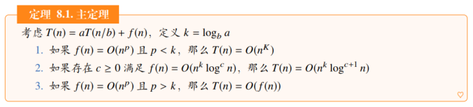

通过主定理我们可以知道，归并排序属于第二种情况，且时间复杂度为 O（n log n）。其他的分治问题也可以通过主定理求得时间复杂度。

另外，自上而下的分治可以和 memoization 结合，避免重复遍历相同的子问题。如果方便推导，也可以换用自下而上的动态规划方法求解。

## 7.一切皆可搜索

深度优先搜索和广度优先搜索是两种最常见的优先搜索方法，它们被广泛地运用在图和树等结构中进行搜索。

### 深度优先

- 深度优先搜索（depth-first seach，DFS）在搜索到一个新的节点时，立即对该新节点进行遍历；因此遍历需要用先入后出的栈来实现，也可以通过与栈等价的递归来实现。（递归思路清晰，但递归更耗栈空间）
- 深度优先搜索也可以用来检测环路：记录每个遍历过的节点的父节点，若一个节点被再次遍历且父节点不同，则说明有环。我们也可以用之后会讲到的拓扑排序判断是否有环路，若最后存在入度不为零的点，则说明有环。
- 有时我们可能会需要对已经搜索过的节点进行标记，以防止在遍历时重复搜索某个节点，这种做法叫做状态记录或记忆（memoization）。


**695. Max Area of Island (Easy)**

找最大面积

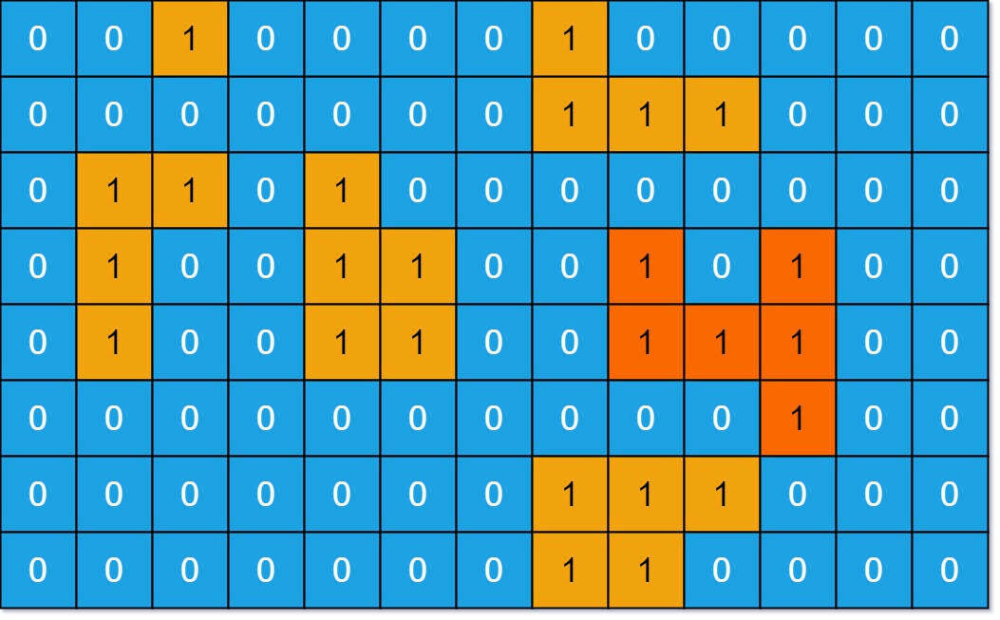

```C++
int maxAreaOfIsland(vector<vector<int>>& grid) {
    //动态规划，行不通
    // int count=0;
    // int m=grid.size(),n=grid[0].size();
    // vector<vector<int>> dp(m+1,vector<int>(n+1,0));
    // for(int i=0;i<m;i++)
    // {
    //     for(int j=0;j<n;j++)
    //     {
    //         if(grid[i][j]==0)
    //         {
    //             dp[i+1][j+1]=0;
    //         }
    //         else
    //         {
    //             // dp[i+1][j+1]=max(dp[i][j+1],dp[i+1][j])+1; // 这个又会漏算
    //             // dp[i+1][j+1]=dp[i][j+1]+dp[i+1][j]+1; // 对于连续四个的正方形，左上角那个会被重复计算
    //         }
    //         if(dp[i+1][j+1]>count) count = dp[i+1][j+1];
    //     }
    // }
    // return count;

    //深度优先
    int ans=0;
    for(int i=0;i!=grid.size();i++)
    {
        for(int j=0;j<grid[0].size();j++)
        {
            ans=max(ans,dfs(grid,i,j));// 对每一个位置进行dfs，保留最大结果
        }
    }
    return ans;
}
int dfs(vector<vector<int>>& grid,int i, int j)
{
    // 递归返回条件
    if(i<0||j<0||i==grid.size()||j==grid[0].size()||grid[i][j]==0) return 0;
    int ans=1;
    grid[i][j]=0;//把当前节点置0，避免再次遍历
    int di[4]={0,0,1,-1}; //便于取四个方向
    int dj[4]={-1,1,0,0};
    for(int k=0;k!=4;k++)
    {
        int next_i=i+di[k],next_j=j+dj[k];
        ans+=dfs(grid,next_i,next_j);
    }
    return ans;
}
```

```C++
//深度优先+栈
int ans=0;
for(int i=0;i!=grid.size();i++)
{
    for(int j=0;j<grid[0].size();j++)
    {
        stack<int> stacki;
        stack<int> stackj;
        int cur=0;
        stacki.push(i);
        stackj.push(j);
        int di[4]={0,0,1,-1}; //便于取四个方向
        int dj[4]={-1,1,0,0};
        while(!stackj.empty())
        {
            int cur_i=stacki.top(),cur_j=stackj.top();
            stacki.pop();
            stackj.pop();
            if(cur_i<0 || cur_i==grid.size() || cur_j<0 || cur_j==grid[0].size() || grid[cur_i][cur_j]==0) continue;
            grid[cur_i][cur_j]=0;
            cur++;
            for(int k=0;k!=4;k++)
            {
                int next_i=cur_i+di[k],next_j=cur_j+dj[k];
                // if(next_i<0 || next_i==grid.size() || next_j<0 || next_j==grid[0].size() || grid[next_i][next_j]==0) continue;
                stacki.push(next_i);
                stackj.push(next_j);
            }
        }
        ans=max(ans,cur);
    }
}
return ans;
```

下面这个的思路很清晰。

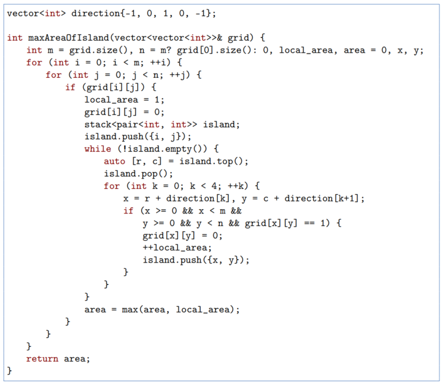

**547. Friend Circles (Medium)**

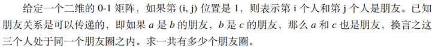

```C++
int findCircleNum(vector<vector<int>>& isConnected) {
    int n=isConnected.size();
    int ans=0;
    vector<bool> visited(n,false);
    for(int i=0;i!=n;i++)
    {
        if(!visited[i])
        {
            dfs(isConnected,i,visited);
            ++count;//每次回来，说明一个朋友圈找完啦，数量加一
        }
    }
    return ans;
}
void dfs(vector<vector<int>>& isConnected ,int i,vector<bool>& visited)
{
    visited[i]=true;
    for(int k=0;k!=isConnected.size();k++) //把i所有的朋友都找一遍
    {
        if(isConnected[i][k]==1 && !visited[k]) dfs(isConnected,k,visited);
    }
}
```

**417. Pacific Atlantic Water Flow (Medium)**

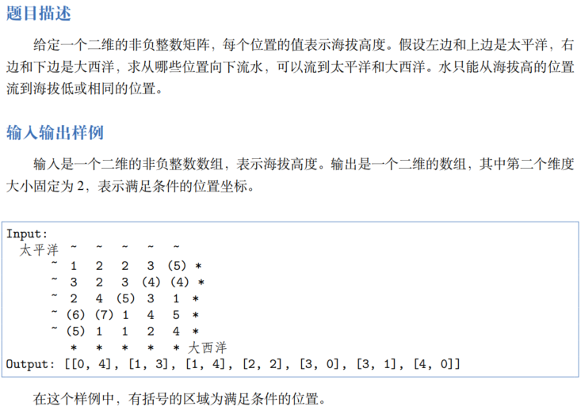

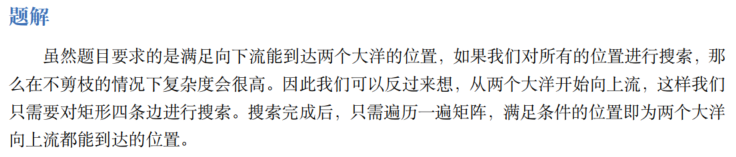

```C++
int dir[5]={0,1,0,-1,0};
vector<vector<int>> pacificAtlantic(vector<vector<int>>& heights) {
    vector<vector<int>> ans;
    int m=heights.size();
    int n=heights[0].size();
    vector<vector<bool>> PO(m,vector<bool>(n,false));
    vector<vector<bool>> AO(m,vector<bool>(n,false));
    // 每一个位置dfs复杂度太高，直接栈溢出
    // for(int i=0;i!=heights.size();++i)
    // {
    //     for(int j=0;j!=heights[0].size();++j)
    //     {
    //         dfs(heights,PO,AO,i,j);
    //     }
    // }
    // for(int i=0;i!=heights.size();++i)
    // {
    //     for(int j=0;j!=heights[0].size();++j)
    //     {
    //         if(AO[i][j] && PO[i][j]) ans.push_back({i,j});
    //     }
    // }

    // 考虑从边界向高位置走

    for(int i=0,j=0;j<n;j++)
    {
        dfs(heights,PO,0,j);// 从PO边界走
        dfs(heights,AO,m-1,j);// 从AO边界走
    }
    for(int i=0,j=0;i<m;i++)
    {
        dfs(heights,PO,i,0);
        dfs(heights,AO,i,n-1);
    }

    for(int i=0;i!=heights.size();++i)
    {
        for(int j=0;j!=heights[0].size();++j)
        {
            if(AO[i][j] && PO[i][j]) ans.push_back({i,j});
        }
    }
    // myPrint(PO);
    // myPrint(AO);

    return ans;
}
void dfs(vector<vector<int>>& heights,vector<vector<bool>>& PA,int i,int j)
{
    if(PA[i][j]) return;
    PA[i][j]=true;
    for(int k=0;k<4;k++)
    {
        int r=i+dir[k],c=j+dir[k+1];
        if(r>=0 && c>=0 && r<heights.size() && c<heights[0].size())
        {
            if(heights[i][j]<=heights[r][c])
            {
                dfs(heights,PA,r,c);
            }
        }
    }
}
```

### 回溯

回溯法（backtracking）是优先搜索的一种特殊情况，又称为试探法，常用于需要记录节点状态的深度优先搜索。通常来说，**排列、组合、选择类问题**使用回溯法比较方便。顾名思义，回溯法的核心是回溯。在搜索到某一节点的时候，如果我们发现目前的节点（及其子节点）并不是需求目标时，我们回退到原来的节点继续搜索，并且把在目前节点修改的状态还原。这样的好处是我们可以始终只对图的总状态进行修改，而非每次遍历时新建一个图来储存状态。在具体的写法上，它与普通的深度优先搜索一样，都有 [修改当前节点状态]->[递归子节点] 的步骤，只是多了回溯的步骤，变成了 [修改当前节点状态]->[递归子节点]->[回改当前节点状态]

记住两个小诀窍:

- 一是按引用传状态
- 二是所有的状态修改在递归完成后回改。

回溯法修改一般有两种情况，一种是修改最后一位输出，比如排列组合；一种是修改访问标记，比如矩阵里搜字符串。

回溯法相当于遍历n叉树

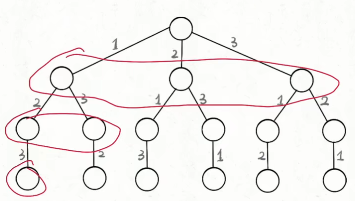

算法模板

```C++
主函数()
{
    backTracking(参数);//这里面的参数一般包含传入参数，返回结果，或者记录的状态
}

void backTracking() //回溯函数一般不用返回值
{
    if(达到结束条件)
    {
        res.push_back();
        return;
    }
    
    for()
    {
        做选择；
        backTracking();
        撤销选择；
    }
}
```

找出[3,6,7,9]中和等于tar的子序列

```C++
void BT(vector<int>& nums, vector<vector<int>>& ans, vector<int>& temp, int& sum, int &tar,int idx)
{
    if (sum == tar)
    {
        ans.push_back(temp);
        return;
    }
    else if(sum > tar)
    {
        return;
    }

    for (int i = idx;i < nums.size();i++)
    {
        temp.push_back(nums[i]);myPrint(temp);
        sum += nums[i];
        BT(nums, ans, temp, sum, tar, i);
        sum -= nums[i];
        temp.pop_back();
    }
}

int main()
{
    vector<int> nums{3,6,7,9};
    vector<vector<int>> ans;
    vector<int> temp;
    int tar = 9;
    int sum = 0;
    int idx = 0;
    BT(nums,ans,temp,sum,tar,idx);
    myPrint(ans);
}

3 3 3
3 6
9 
    
for (int i = idx;i < nums.size();i++)
{
    temp.push_back(nums[i]);myPrint(temp);
    sum += nums[i];
    BT(nums, ans, temp, sum, tar, i);
    sum -= nums[i];
    temp.pop_back();
}
```


**最短路径**

最近DJI发布了一款Robomaster S1机器人，小伙伴们都沉迷其中不能自拔。小J为了能够在竞速比赛中迅速获胜，他决定利用开发的优势，在里面植入一套最优化的寻路算法。
比赛规则如下: 在比赛场地内预先设置N个路标，路标编号从0到N-1，S1只能沿直线在两个有连接的路标之间移动（部分路标之间是没有连接的） 比赛场地内的S1机器人从编号为0的路标出发，然后裁判给出随机一个路标（从0到N-1号路标中随机挑选一个）作为终点路标，要求S1机器人以尽可能快的速度从0号路标达到终点路标，总路程用时最短者获胜。
裁判会确保从0号路标和随机挑选的终点路标之间肯定存在至少一条路径。 小J在比赛开始前就已经得知了路标的数量 、通道的数量（每两个可以直接连接的路标点为一个通道）以及小车在每个通道上移动需要的时间。他需要编写一套算法，以确保能够快速找到最短路径，并输出小车在该路径移动所需要的时间，你能帮他实现这套算法吗?

```C
//输入描述
第一行输入两个个正整数 N和 P，其中N表示路标的数量， P表示通道的数量。 (1 < N <= 200,  0 <= P <= N * (N - 1) / 2 ）
接下来的P行，每行输入三个正整数 A, B, T，A表示起点路标的编号，B表示终点路标的编号，T表示路标A到路标B需要时间T。 (0 <= A, B <= N-1, 1 <= T <= 100)
最后一行输入一个正整数 X，表示裁判给出的终点路标编号 (0 =< X <= N)
//输出描述
输出一个正整数，表示小车从0号路标到X号路标之间移动的最短用时
 
//样例输入
4 5
0 1 15
1 2 15
0 3 50
1 3 30
2 3 10
3
```


```C++
//void BFS(vector<vector<int>>& cost, vector<int>& ans, int begin)
//{
//    for (int i = 0;i < N;i++)
//    {
//        for (int j = i + 1;j < N;j++)
//        {
//            ;//广度优先不好累加每条路上的代价
//        }
//    }
//}

void DFS(vector<vector<int>>& cost, vector<int>& ans, int& temp, int begin, int &tar)
{
    if (begin == tar) //因为题目说路径一定存在，所以一定可以满足
    {
        ans.push_back(temp);
        //temp = 0; //这里置0就没办法回溯
        return;
    }
    for (int j = begin + 1;j < cost.size();j++)
    {
        if (cost[begin][j] != INT_MAX)
        {
            temp += cost[begin][j];
            cout <<begin<<"--"<<j<< ", temp0:" <<temp<< endl;
            DFS(cost, ans, temp, j, tar);
            temp -= cost[begin][j]; //回溯
            cout << begin << "--" << j << ", temp1:" <<temp << endl;
        }
    }
}
int main()
{
    int N,P;
    cin >> N >> P;
    vector<vector<int>> cost(N, vector<int>(N, INT_MAX));
    for (int i = 0;i < P;i++)
    {
        int A, B, T;
        cin >> A >> B >> T;
        cost[A][B] = T;
    }
    myPrint(cost);
    int tar;
    cin >> tar;
    vector<int> ans;
    int begin = 0;
    int temp = 0; //单条路径之和
    DFS(cost,ans,temp,begin,tar);
    myPrint(ans);
    return 0;
}
```


**46. Permutations (Medium)**

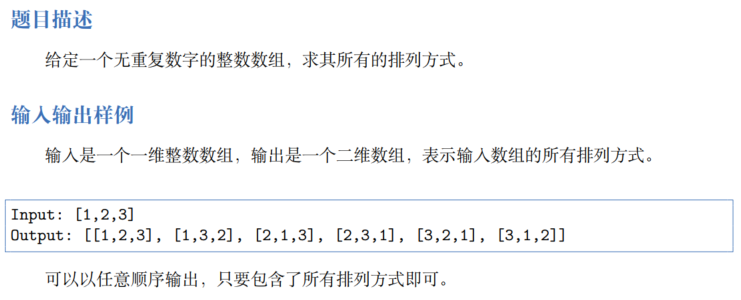

```C++
vector<vector<int>> permute(vector<int>& nums) {
    int n=nums.size();
    vector<vector<int>> res;
    vector<int> track;
    backTrack(nums,track,res);
    return res;
}

void backTrack(vector<int>& nums, vector<int>& track, vector<vector<int>>& res)
{
    if(track.size()==nums.size())
    {
        res.push_back(track);
        return;
    }
    for(int i=0;i<nums.size();i++)
    {
        auto iter=find(track.begin(),track.end(),nums[i]);//这一步可以巧妙的通过swap替换
        if(iter!=track.end()) continue;
        track.push_back(nums[i]);
        backTrack(nums,track,res);
        track.pop_back();
    }
}
```

算法复杂度是n！* n * n

```C++
vector<vector<int>> permute(vector<int>& nums) {
    int n=nums.size();
    vector<vector<int>> res;
    backTrack(nums,0,res);
    return res;
}

void backTrack(vector<int>& nums, int level, vector<vector<int>>& res)
{
    if(level==nums.size()-1)
    {
        res.push_back(nums);
        return;
    }
    for(int i=level;i<nums.size();i++)
    {
        swap(nums[i],nums[level]);
        // backTrack(nums,i,res);
        backTrack(nums,level+1,res);
        swap(nums[i],nums[level]);
    }
}
```

算法复杂度是n！*n

**77. Combinations (Medium)**


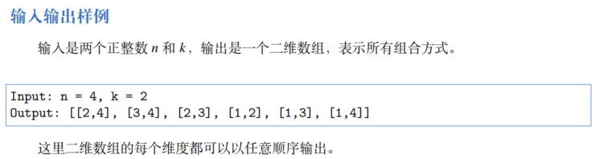

```C++
vector<vector<int>> combine(int n, int k) {
    vector<vector<int>> res;
    vector<int> nums;
    for(int i=1;i<=n;i++)
    {
        nums.push_back(i);
    }
    vector<int> track;
    backTracking(res,nums,track,k);

    return res;
}

void backTracking(vector<vector<int>>& res, vector<int>& nums, vector<int>& track, int& k)
{
    if(track.size()>=2) //这一步是为了防止重复
    {
        if(track.back()<track[track.size()-2]) return;
    }
    if(track.size()==k)
    {
        res.push_back(track);
        return;
    }

    for(int i=0;i<nums.size();i++)
    {
        auto iter=find(track.begin(),track.end(),nums[i]);
        if(iter!=track.end()) continue;

        track.push_back(nums[i]);
        backTracking(res,nums,track,k);
        track.pop_back();
    }
}

void backTracking(vector<int>& nums,vector<vector<int>>& res,vector<int>& track,int k)
{
    if(track.size()==k)
    {
        res.push_back(track);
        return;
    }

    for(int i=track.empty()?0:track.back();i<nums.size();i++)
    {
        auto iter=find(track.begin(),track.end(),nums[i]);
        if(iter!=track.end()) continue;
        track.push_back(nums[i]);
        backTracking(nums,res,track,k);
        track.pop_back();
    }
}
```

**79. Word Search (Medium)**

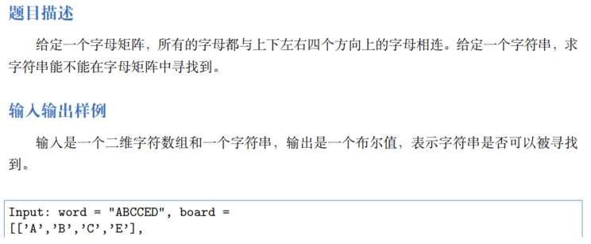

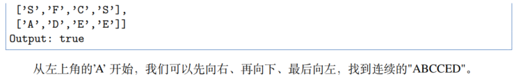

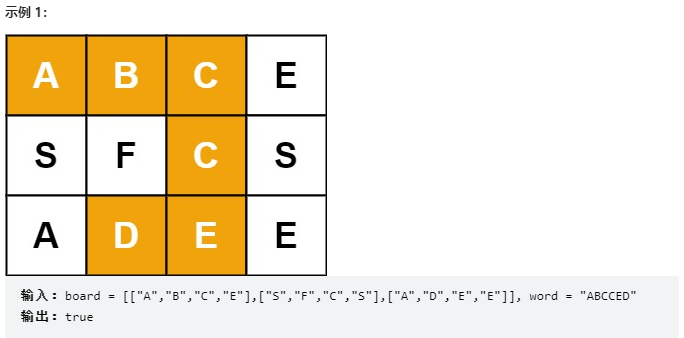

```C++
class Solution {
public:
    int dir[5]={0,1,0,-1,0};
    bool exist(vector<vector<char>>& board, string word) {
        int m=board.size(),n=board[0].size();
        bool res=false;
        vector<vector<bool>> flag(m,vector<bool>(n,false));
        for(int i=0;i<m;i++)
        {
            for(int j=0;j<n;j++)
            {
                string track="";
                backTracking(board,word,track,i,j,res,flag);
            }
        }
        return res;
    }

    void backTracking(vector<vector<char>>& board, string& word ,string& track,int i,int j,bool& res,vector<vector<bool>>& flag)
    {
        
        if(i<0 || j<0 || i==board.size() || j==board[0].size())
        {
            return;//到达边界，返回
        }
        else if(flag[i][j] || res)
        {
            return;//搜索过或已找到，返回
        }
        else 
        {   
            // if(track[0]=='a') 
            cout<<"board: "<<board[i][j]<<endl;
            if(board[i][j]==word[track.size()])
            {
                
                track+=board[i][j];
                // if(track[0]=='a') 
                cout<<track<<endl;
                if(track.size()==word.size()) 
                {
                    res=true;
                    return; //找到了，返回
                }
            }
            else
            {
                return; //已经不匹配啦，再往后没有意义，返回
            }
        }
        flag[i][j]=true;
        for(int k=0;k<4;k++)
        {
            int next_i=i+dir[k],next_j=j+dir[k+1];
            backTracking(board,word,track,next_i,next_j,res,flag);
        }
        flag[i][j]=false;
    }
};

问题代码？？？，第一个测试用例误判成true
[["a","b"],["c","d"]]
"abcd"
[["A","B","C","E"],["S","F","C","S"],["A","D","E","E"]]
"ABCCED"
[["A","B","C","E"],["S","F","C","S"],["A","D","E","E"]]
"SEE"
[["A","B","C","E"],["S","F","C","S"],["A","D","E","E"]]
"ABCB"
[["A","B","C","E"],["S","F","C","S"],["A","D","E","E"]]
"ABCCFB"
```

正确代码：

```C++
class Solution {
public:
    int dir[5]={0,1,0,-1,0};
    bool exist(vector<vector<char>>& board, string word) {
        int m=board.size(),n=board[0].size();
        bool res=false;
        vector<vector<bool>> flag(m,vector<bool>(n,false));
        for(int i=0;i<m;i++)
        {
            for(int j=0;j<n;j++)
            {
                int pos=0;
                backTracking(board,word,pos,i,j,res,flag);
            }
        }
        return res;
    }

    void backTracking(vector<vector<char>>& board, string& word ,int pos,int i,int j,bool& res,vector<vector<bool>>& flag)
    {
        if(i<0 || j<0 || i==board.size() || j==board[0].size())
        {
            return;//到达边界，返回
        }
        else if(flag[i][j] || res)
        {
            return;//搜索过或已找到，返回
        }
        else 
        {   
            if(board[i][j]==word[pos])
            {
                if(pos==word.size()-1)
                {
                    res=true;
                    return; //找到了，返回
                }
            }
            else
            {
                return; //已经不匹配啦，再往后没有意义，返回
            }
        }
        flag[i][j]=true;
        for(int k=0;k<4;k++)
        {
            int next_i=i+dir[k],next_j=j+dir[k+1];
            backTracking(board,word,pos+1,next_i,next_j,res,flag);
        }
        flag[i][j]=false;
    }
};
```

**51. N-Queens (Hard)**

B站有个课

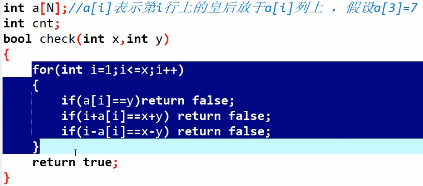

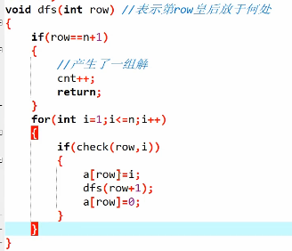


### ✍广度优先


## 8.神奇的位运算

-  n & (n - 1) 可以去除 n 的位级表示中最低的那一位，例如对于二进制表示 11110100，减去 1 得到 11110011，这两个数按位与得到 11110000。
- n & (-n) 可以得到 n 的位级表示中最低的那一位，例如对于二进制表示 11110100，取负得到 00001100，这两个数按位与得到 00000100。
- 利用二进制数作为掩码实现位操作
- 不相等的数O(1)空间复杂度交换

### 常见的位操作

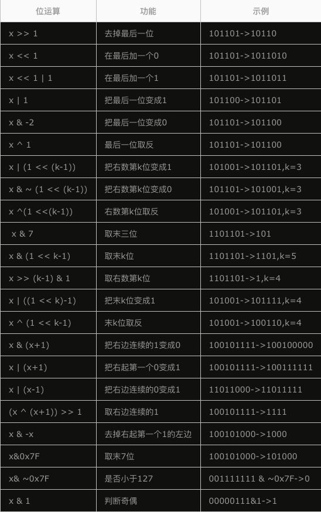


二进制最低位1对应的值

```C++
int ans=x&(-x);
1-0001-1
2-0010-2
3-0011-1
4-0100-4
```


### 状态压缩DP

- 状压就是用一个N[进制](https://so.csdn.net/so/search?q=进制&spm=1001.2101.3001.7020)整数，表示一个状态。
- 状态压缩动态规划，就是我们俗称的状压DP，是利用计算机二进制的性质来描述状态的一种DP方式。
- 很多棋盘问题都运用到了状压，同时，状压也经常和BFS及DP连用。
- 状压dp其实就是将状态压缩成2进制来保存 其特征就是看起来有点像搜索，每个格子的状态只有1或0 ，是另一类非常典型的动态规划

> 1：有一个序列[A,B,C,D]，序列中的每个元素可以拿或者不拿。
则一共有2^4种方式，可以用一个4位的2进制整数来表示每一种方式（状态）。
整数6[0110]表示拿了B,C
整数1[0001]表示拿了A
整数15[1111]表示都拿了

>2：有一些人[a,b,c,d],每个人可以拿0，1，2个苹果。
则一共有3^4种方式，可以用一个4位的3进制数来表示每一种方式（状态）。
整数3表示的3进制数为[0010]，表示只有b拿了一个苹果。
整数5表示的3进制数为[0012]，表示b拿了一个苹果，a拿了2个苹果。

**461. Hamming Distance (Easy)**

**190. Reverse Bits (Easy)**

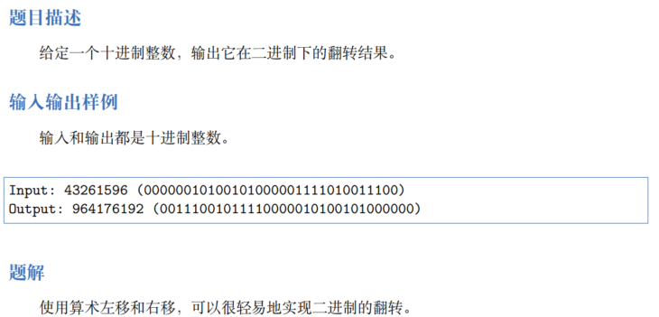

```C++
uint32_t reverseBits(uint32_t n) {
uint32_t ans = 0;
for (int i = 0; i < 32; ++i) {
        ans <<= 1; ans += n & 1; //把n的末位左移到ans中
        n >>= 1; //把n再右移一位
    }
    return ans; //整体思路就是把n的右端从ans的右端移进去
}
```

**136. Single Number (Easy)**

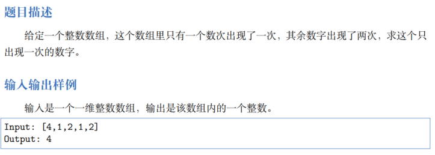

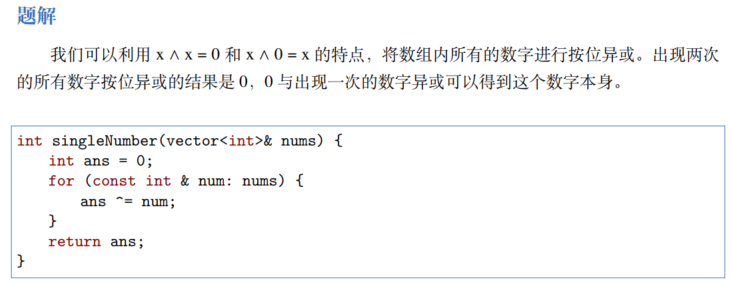

**342. Power of Four (Easy)**

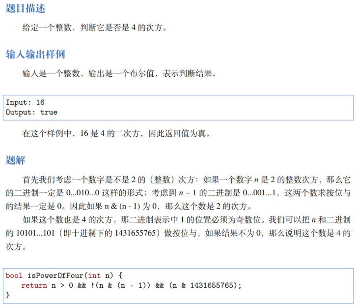

**318. Maximum Product of Word Lengths (Medium)**

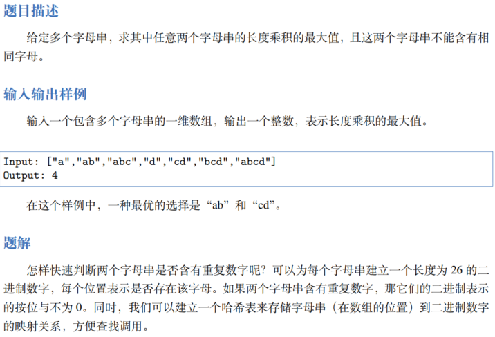

```C++
int maxProduct(vector<string>& words) {
    int ans=0;
    int n=words.size();
    vector<int> words2(n,0);
    for(int i=0;i<n;i++) // 用二进制编码每个单词，判断是否包含公共字母
    {
        int w=0;
        for(char &c:words[i])
        {
            w|=1<<(c-'a');
        }
        words2[i]=w;
    }
    for(int i=0;i<n;i++)
    {
        for(int j=i+1;j<n;j++)
        {
            if((words2[i] & words2[j])==0) // (不含公共部分)
            {
                ans=max(ans, int(words[i].size()*words[j].size()));
            }
        }
    }
    return ans;
}
```

方法一需要对数组 \textit{words}words 中的每个单词计算位掩码，如果数组 \textit{words}words 中存在由相同的字母组成的不同单词，则会造成不必要的重复计算。例如单词 \text{meet}meet 和 \text{met}met 包含的字母相同，只是字母的出现次数和单词长度不同，因此这两个单词的位掩码表示也相同。由于判断两个单词是否有公共字母是通过判断两个单词的位掩码的按位与运算实现，因此在位掩码相同的情况下，单词的长度不会影响是否有公共字母，当两个位掩码的按位与运算等于 00 时，为了得到最大单词长度乘积，这两个位掩码对应的单词长度应该尽可能大。根据上述分析可知，如果有多个单词的位掩码相同，则只需要记录该位掩码对应的最大单词长度即可。

可以使用哈希表记录每个位掩码对应的最大单词长度，然后遍历哈希表中的每一对位掩码，如果这一对位掩码的按位与运算等于 00，则用这一对位掩码对应的长度乘积更新最大单词长度乘积。

由于每个单词的位掩码都不等于 00，任何一个不等于 00 的数和自身做按位与运算的结果一定不等于 00，因此当一对位掩码的按位与运算等于 00 时，这两个位掩码一定是不同的，对应的单词也一定是不同的。

```C++
class Solution {
public:
    int maxProduct(vector<string>& words) {
        unordered_map<int,int> map;
        int length = words.size();
        for (int i = 0; i < length; i++) {
            int mask = 0;
            string word = words[i];
            int wordLength = word.size();
            for (int j = 0; j < wordLength; j++) {
                mask |= 1 << (word[j] - 'a');
            }
            if(map.count(mask)) {
                if (wordLength > map[mask]) {
                    map[mask] = wordLength;
                }
            } else {
                map[mask] = wordLength;
            }
            
        }
        int maxProd = 0;
        for (auto [mask1, _] : map) {
            int wordLength1 = map[mask1];
            for (auto [mask2, _] : map) {
                if ((mask1 & mask2) == 0) {
                    int wordLength2 = map[mask2];
                    maxProd = max(maxProd, wordLength1 * wordLength2);
                }
            }
        }
        return maxProd;
    }
};
```

**338. Counting Bits (Medium)**  


**（dp+位运算的神来之笔）**

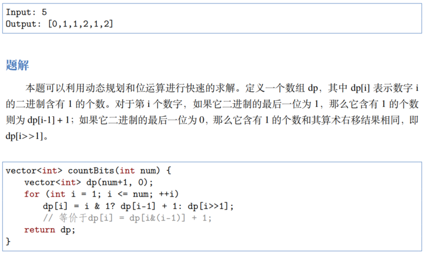

**260. Single Number III (Medium)**

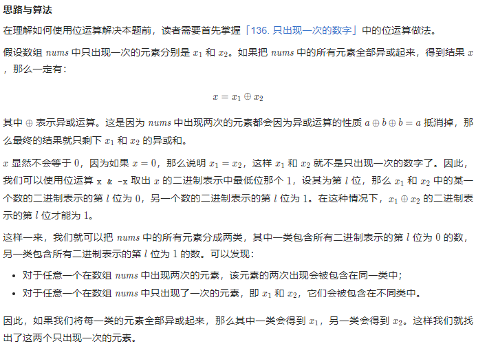

```C++
vector<int> singleNumber(vector<int>& nums) {
    int xornum=0,ans1=0,ans2=0;
    for(int num:nums)
    {
        xornum^=num;
    }
    int lsb = (xornum == INT_MIN ? xornum : xornum & (-xornum));// 防止溢出
    for(int num:nums)
    {
        if(num&lsb)
        {
            ans1^=num;
        }
        else
        {
            ans2^=num;
        }
    }

    return vector<int>{ans1,ans2};
}
```


## 9.妙用数据结构

**数组**

**240. Search a 2D Matrix II (Medium)**

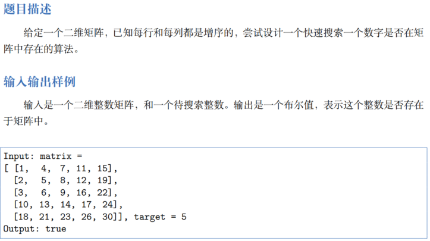

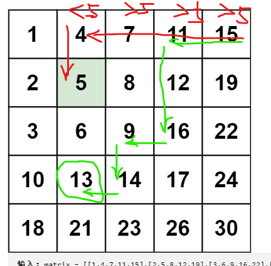

**栈和队列**

**232. Implement Queue using Stacks (Easy)**

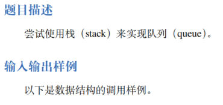

- void push(int x) 将元素 x 推到队列的末尾
- int pop() 从队列的开头移除并返回元素
- int peek() 返回队列开头的元素
- boolean empty() 如果队列为空，返回 true ；否则，返回 false

双栈，另一个栈维护一个最小值

```C++
class MyQueue {
    stack<int> queue,temp;
public:
    MyQueue() {

    }
    
    void push(int x) {
        while(!queue.empty())
        {
            temp.push(queue.top());
            queue.pop();
        }
        temp.push(x);
        while(!temp.empty())
        {
            queue.push(temp.top());
            temp.pop();
        }
    }
    
    int pop() {
        int x=queue.top();
        queue.pop();
        return x;
    }
    
    int peek() {
        return queue.top();
    }
    
    bool empty() {
        return queue.empty();
    }
};
```

单栈存差值△=val-min

​									push						pop

当△>0，		没有更新min，		不用更新min，top=val=△+min

当△>0，		更新min=val，			要更新min，	top=val=min，min=val-△

```C++
class MinStack {
    stack<long long> s;
    long long min; 
public:
    MinStack() {

    }
    
    void push(int val) {
        if(s.empty())
        {
            s.push(0);
            min=val;
        }
        else
        {
            long long diff=val-min;
            s.push(diff);
            if(diff>0)
            {
            }
            else
            {
                min=val;
            }
        }
    }
    
    void pop() {
        long long diff=s.top();
        s.pop();
        if(diff>0)
        {
        }
        else
        {
            min=min-diff;
        }
    }
    
    int top() {
        long long diff=s.top();
        if(diff>0)
        {
            return diff+min;
        }
        else
        {
            return min;
        }
    }
    
    int getMin() {
        return min;
    }
};
```

**20. Valid Parentheses (Easy)**

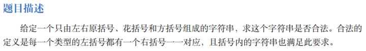


**单调栈**

单调栈通过维持栈内值的单调递增（递减）性，在整体 O（n）的时间内处理需要大小比较的问题。

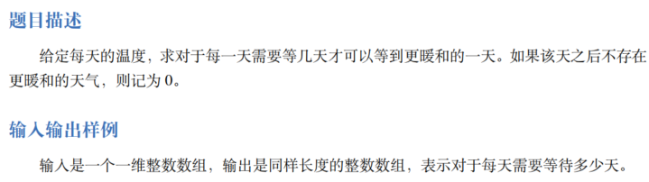

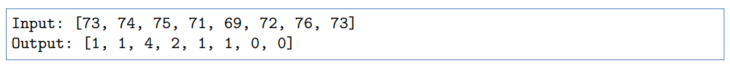


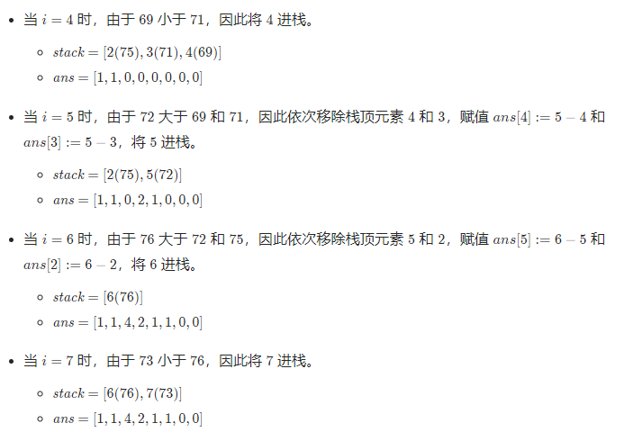

```C++
vector<int> dailyTemperatures(vector<int>& temperatures) {
    int n = temperatures.size();
    vector<int> ans(n);
    stack<int> s;
    for (int i = 0; i < n; ++i) {
        while (!s.empty() && temperatures[i] > temperatures[s.top()]) {
            int previousIndex = s.top();
            ans[previousIndex] = i - previousIndex;
            s.pop();
        }
        s.push(i);
    }
    return ans;
}
```

**优先队列**

优先队列（priority queue）可以在 O„1” 时间内获得最大值，并且可以在 O（log n） 时间内取出最大值或插入任意值。

优先队列常常用堆（heap）来实现。堆是一个完全二叉树，其每个节点的值总是大于等于子节点的值。实际实现堆时，我们通常用一个数组而不是用指针建立一个树。这是因为堆是完全二叉树，所以用数组表示时，位置 i 的节点的父节点位置一定为 i/2，而它的两个子节点的位置又一定分别为 2i 和 2i+1。

以下是堆的实现方法，其中最核心的两个操作是上浮和下沉：如果一个节点比父节点大，那么需要交换这个两个节点；交换后还可能比它新的父节点大，因此需要不断地进行比较和交换操作，我们称之为上浮；类似地，如果一个节点比父节小，也需要不断地向下进行比较和交换操作，我们称之为下沉。如果一个节点有两个子节点，我们总是交换最大的子节点。

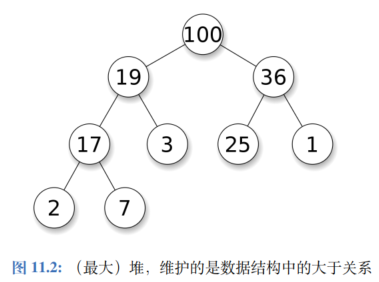

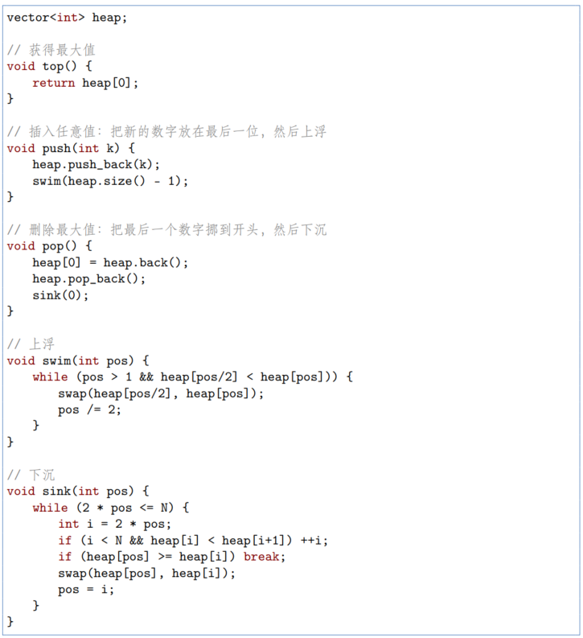

**23. Merge k Sorted Lists (Hard)**

**双端队列**

**哈希表**

**多重集合和映射**

**前缀和积分图**


## 10.高频面试题

### 穷举连续区间-二分法

[875. 爱吃香蕉的珂珂](https://leetcode-cn.com/problems/koko-eating-bananas/)

珂珂喜欢吃香蕉。这里有 N 堆香蕉，第 i 堆中有 piles[i] 根香蕉。警卫已经离开了，将在 H 小时后回来。

珂珂可以决定她吃香蕉的速度 K （单位：根/小时）。每个小时，她将会选择一堆香蕉，从中吃掉 K 根。如果这堆香蕉少于 K 根，她将吃掉这堆的所有香蕉，然后这一小时内不会再吃更多的香蕉。 

珂珂喜欢慢慢吃，但仍然想在警卫回来前吃掉所有的香蕉。

返回她可以在 H 小时内吃掉所有香蕉的最小速度 K（K 为整数）。

>示例 1：
>输入: piles = [3,6,7,11], H = 8
>输出: 4
>
>示例 2：
>输入: piles = [30,11,23,4,20], H = 5
>输出: 30
>
>示例 3：
>输入: piles = [30,11,23,4,20], H = 6
>输出: 23

```C++
int minEatingSpeed(vector<int>& piles, int h) {
    //暴力寻找，穷举h，范围[sum/h,max]
    //int start = accumulate(piles.begin(),piles.end(),0)/h; //测试数据很大，会溢出
    int end=*max_element(piles.begin(),piles.end());
    for(int i=1;i<end;i++) //这个方法超时,注意这是连续【1，end】的枚举，因此可以用二分法
    {
        long count=0; //测试数据很大，int会溢出
        for(int j=0;j<piles.size();j++) 
        {
            //进一法计数
            count+=piles[j]/i+(piles[j]%i==0 ? 0 : 1);
        }
        if(count<=h)
        {
            return i;
        }
    }
    return end;
}
```

改进：二分查找，因为是递增区间的枚举

```C++
int minEatingSpeed(vector<int>& piles, int h) {
    int end=*max_element(piles.begin(),piles.end());
    int L=1,R=end;
    while(L<R)
    {
        int M=L+(R-L)/2;
        long count=0; //测试数据很大，int会溢出
        for(int j=0;j<piles.size();j++)
        {
            count+=piles[j]/M+(piles[j]%M==0 ? 0 : 1);
        }
        if(count<=h)
        {
            R=M;
        }
        else
        {
            L=M+1;
        }
    }
    return L;
}
```

[1011. 在 D 天内送达包裹的能力](https://leetcode-cn.com/problems/capacity-to-ship-packages-within-d-days/)

传送带上的包裹必须在 days 天内从一个港口运送到另一个港口。

传送带上的第 i 个包裹的重量为 weights[i]。每一天，我们都会按给出重量（weights）的顺序往传送带上装载包裹。我们装载的重量不会超过船的最大运载重量。

返回能在 days 天内将传送带上的所有包裹送达的船的最低运载能力。

```c++
输入：weights = [1,2,3,4,5,6,7,8,9,10], days = 5
输出：15
解释：
船舶最低载重 15 就能够在 5 天内送达所有包裹，如下所示：
第 1 天：1, 2, 3, 4, 5
第 2 天：6, 7
第 3 天：8
第 4 天：9
第 5 天：10

请注意，货物必须按照给定的顺序装运，因此使用载重能力为 14 的船舶并将包装分成 (2, 3, 4, 5), (1, 6, 7), (8), (9), (10) 是不允许的。 
```

```C++
int shipWithinDays(vector<int>& weights, int days) {
    //穷举【min，sum】
    int start=*min_element(weights.begin(),weights.end());
    int end=accumulate(weights.begin(),weights.end(),0);
    while(start<end)
    {
        int mid=start+(end-start)/2;
        if(isOK(weights,days,mid))
        {
            end=mid;//cout<<"OK"<<endl;
        }
        else
        {
            start=mid+1;//cout<<"No"<<endl;
        }
    }
    return start;
}
//运载能力为mid的时候能不能把货物运完
bool isOK(vector<int>& weights, int days,int mid)
{
    int day=1;
    int temp=mid;
    int i=0;
    //cout<<"\nmid: "<<mid<<"--"<<endl;
    while(i<weights.size())
    {
        if(temp>=weights[i])
        {
            temp-=weights[i]; //cout<<weights[i]<<",";
            i++;
        }
        else
        {
            temp=mid; //cout<<endl;
            if(++day>days) return false;
        }
    }
    return day<=days;
}
```


### 接雨水-备忘录

[42. 接雨水](https://leetcode-cn.com/problems/trapping-rain-water/)

给定 n 个非负整数表示每个宽度为 1 的柱子的高度图，计算按此排列的柱子，下雨之后能接多少雨水。

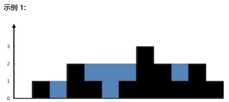

```C++
输入：height = [0,1,0,2,1,0,1,3,2,1,2,1]
输出：6
解释：上面是由数组 [0,1,0,2,1,0,1,3,2,1,2,1] 表示的高度图，在这种情况下，可以接 6 个单位的雨水（蓝色部分表示雨水）。 

输入：height = [4,2,0,3,2,5]
输出：9
```

暴力法

```C++
int trap(vector<int>& height) {
    //暴力法，只关注当前的柱子，水量=min(height[L],height[R])-height[i];
    int ans=0;
    for(int i=0;i<height.size();i++)
    {
        int L=i,R=i;
        L=max_element(height.begin(),height.begin()+i)-height.begin();
        R=max_element(height.begin()+i,height.end())-height.begin();
        int temp=min(height[L],height[R])-height[i];
        // cout<<"i: "<<i<<" "<<L<<"_"<<R<<" ,"<<temp<<endl;
        if(temp>0) ans+=temp;
    }
    return ans;
}
```

暴力法超时的原因是每次都要找两个波峰，时间复杂度是O（n^2），优化的思路是备忘录.

```C++
int trap(vector<int>& height) {
    int ans=0;
    vector<int> l_max(height.size(),0);//记录当前位置右边的最大值
    vector<int> r_max(height.size(),0);//记录当前位置左边的最大值

    for(int i=0;i<height.size();i++)
    {
        if(i==0) l_max[i]=height[i];
        else l_max[i]=max(l_max[i-1],height[i]);
    }
    for(int i=height.size()-1;i>=0;i--)
    {
        if(i==height.size()-1) r_max[i]=height[i];
        else r_max[i]=max(r_max[i+1],height[i]);
    }
    for(int i=0;i<height.size();i++)
    {
        int temp=min(l_max[i],r_max[i])-height[i];
        // cout<<"i: "<<i<<" "<<l_max[i]<<"_"<<r_max[i]<<" ,"<<temp<<endl;
        if(temp>0) ans+=temp;
    }
    return ans;
}
```

双指针法的时间复杂度降低了，但是空间复杂度为O（n），优化方法是双指针法，不要备忘录，边走边算。不好理解，可以去力扣看动画演示


其它解法

单调栈

[407. 接雨水 II](https://leetcode-cn.com/problems/trapping-rain-water-ii/)

上述方法并不能扩展到三维情况，因为雨水可以拐弯漏出。


### ❗重复元素

**寻找重复数**

技巧性太强，二分法没看懂

[287. 寻找重复数](https://leetcode-cn.com/problems/find-the-duplicate-number/)

```C++
public int findDuplicate(int[] nums) {
    int slow = 0;
    int fast = 0;
    slow = nums[slow];
    fast = nums[nums[fast]];
    while(slow != fast){
        slow = nums[slow];
        fast = nums[nums[fast]];
    }
    int pre1 = 0;
    int pre2 = slow;
    while(pre1 != pre2){
        pre1 = nums[pre1];
        pre2 = nums[pre2];
    }
    return pre1;
}
```

**去除重复字母**

[316. 去除重复字母](https://leetcode-cn.com/problems/remove-duplicate-letters/)

给你一个字符串 s ，请你去除字符串中重复的字母，使得每个字母只出现一次。需保证 **返回结果的字典序最小**（要求不能打乱其他字符的相对位置）。

```C++
输入：s = "cbacdcbc"
输出："acdb"
```

```C++
string removeDuplicateLetters(string s) {
    vector<int> vis(26), //记录栈中元素是否存在
    num(26);//记录剩余未遍历元素的数量
    for (char ch : s) {
        num[ch - 'a']++;
    }

    string stk;
    for (char ch : s) {
        if (!vis[ch - 'a']) //只需处理不在栈中的元素
        {
            //一直循环判断当前元素是否比栈顶元素靠前
            //如果靠前，那就看看后面还有没有栈顶元素，如果有，就把栈顶删除
            while (!stk.empty() && ch < stk.back()) 
            {
                if (num[stk.back() - 'a'] > 0) //如果有，就把栈顶删除
                {
                    vis[stk.back() - 'a'] = 0; //栈中元素是惟一的，删除时要更新观测
                    stk.pop_back();
                } else {
                    break;
                }
            }
            vis[ch - 'a'] = 1;
            stk.push_back(ch);
        }
        num[ch - 'a'] -= 1; //在栈中的直接跳过,计数-1
    }
    return stk;
}
```

**存在重复元素**

[219. 存在重复元素 II](https://leetcode-cn.com/problems/contains-duplicate-ii/)

给你一个整数数组 nums 和一个整数 k ，判断数组中是否存在两个 不同的索引 i 和 j ，满足 nums[i] == nums[j] 且 abs(i - j) <= k 。如果存在，返回 true ；否则，返回 false 。

```C++
输入：nums = [1,2,3,1], k = 3
输出：true

输入：nums = [1,2,3,1,2,3], k = 2
输出：false
```

```C++
bool containsNearbyDuplicate(vector<int>& nums, int k) {
    int L=nums.size();
    unordered_map<int,int> numIndex;
    for(int i=0;i<L;i++)
    {
        auto iter=numIndex.find(nums[i]);
        if(iter!=numIndex.end())
        {
            if(i-iter->second<=k)
            {
                return true;
            }
            else
            {
                iter->second=i;//更新该元素的对应nums的下标
                //实际上已经存在，无法插入，更新下标，相当于把当前元素插入
                //记录最近的下标，才有可能满足条件
            }
        }
        else
        {
            numIndex.insert({nums[i],i});
        }
    }
    return false;
}
```


### 回文子串-中心扩散

[5. 最长回文子串](https://leetcode-cn.com/problems/longest-palindromic-substring/)

给你一个字符串 s，找到 s 中最长的回文子串。

```C++
输入：s = "babad"
输出："bab"
解释："aba" 同样是符合题意的答案。
输入：s = "cbbd"
输出："bb"
```

中心扩散法

```C++
pair<int,int> expandCenter(string s,int L,int R)
{
    while(L>=0 && R<s.size() && s[L]==s[R])
    {
        L--;R++;
    }
    return {L+1,R-1};
}
string longestPalindrome(string s) {
    int start=0,end=0;
    for(int i=0;i<s.size();i++)
    {
        auto [L1,R1]=expandCenter(s,i,i);//aba
        auto [L2,R2]=expandCenter(s,i,i+1);//abba

        if(R1-L1>end-start) //更新最长区间
        {
            start=L1;end=R1; 
        }
        if(R2-L2>end-start)
        {
            start=L2;end=R2;
        }
    }
    return s.substr(start,end-start+1);
}
```

动态规划

```C++
string longestPalindrome(string s) {
    int n=s.size();
    //dp[j][i]表示s[j...i]是否是回文串
    vector<vector<bool>> dp(n,vector<bool>(n,true));
    int start=0,end=0;
    for(int i=1;i<n;i++)
    {
        for(int j=0;j<i;j++) 
        {
            if(s[i]==s[j]) 
            {
                //长度<=3，一定是的。两边相等，中间顶多一个，无论是啥都是的
                dp[j][i] = i-j+1<=3 ? true : dp[j+1][i-1]; //因为这里左下角先填
            }
            else dp[j][i]=false;
            if(dp[j][i] && i-j>end-start)
            {
                start=j;end=i;
            }
        }
    }
    return s.substr(start,end-start+1);
}
```

[647. 回文子串](https://leetcode-cn.com/problems/palindromic-substrings/)

给你一个字符串 s ，请你统计并返回这个字符串中 回文子串 的数目。

回文字符串 是正着读和倒过来读一样的字符串。

子字符串 是字符串中的由连续字符组成的一个序列。

具有不同开始位置或结束位置的子串，即使是由相同的字符组成，也会被视作不同的子串。

```C++
输入：s = "aaa"
输出：6
解释：6个回文子串: "a", "a", "a", "aa", "aa", "aaa"
```

```C++
void expandCenter(string &s,int &ans,int L,int R)
{
    while(L>=0 && R<s.size() && s[L]==s[R])
    {
        ans++;
        L--;R++;
    }
}
int countSubstrings(string s) {
    int ans=0;
    for(int i=0;i<s.size();i++)
    {
        expandCenter(s,ans,i,i);
        expandCenter(s,ans,i,i+1);
    }
    return ans;
}
```

❗[516. 最长回文子序列](https://leetcode-cn.com/problems/longest-palindromic-subsequence/)

给你一个字符串 s ，找出其中最长的回文子序列，并返回该序列的长度。

子序列定义为：不改变剩余字符顺序的情况下，删除某些字符或者不删除任何字符形成的一个序列。

```C++
输入：s = "bbbab"
输出：4
解释：一个可能的最长回文子序列为 "bbbb" 。
```

```C++
int longestPalindromeSubseq(string s) {
    int n = s.length();
    vector<vector<int>> dp(n, vector<int>(n));
    for (int i = n - 1; i >= 0; i--) {
        dp[i][i] = 1; //对角线上的元素表示s[i,i]，只有一个字母，最长为1
        char c1 = s[i];
        for (int j = i + 1; j < n; j++) {
            char c2 = s[j];
            if (c1 == c2) {
                //上一个状态在左下，所以遍历方式j是从左到右，i是从下到上
                dp[i][j] = dp[i + 1][j - 1] + 2;
            } 
            else //不相等时，上一个状态就不可能是都取两边，只可能是其中一边
            {
                dp[i][j] = max(dp[i + 1][j], dp[i][j - 1]);
            }
        }
    }
    return dp[0][n - 1];
}
```


### 跳跃游戏-贪心

**跳跃游戏-贪心、DP**

[55. 跳跃游戏](https://leetcode-cn.com/problems/jump-game/)

给定一个非负整数数组 nums ，你最初位于数组的 **第一个下标** 。

数组中的每个元素代表你在该位置可以跳跃的最大长度。

判断你是否能够到达最后一个下标。

```C++
输入：nums = [2,3,1,1,4]
输出：true
解释：可以先跳 1 步，从下标 0 到达下标 1, 然后再从下标 1 跳 3 步到达最后一个下标。
输入：nums = [3,2,1,0,4]
输出：false
解释：无论怎样，总会到达下标为 3 的位置。但该下标的最大跳跃长度是 0 ， 所以永远不可能到达最后一个下标。
```

从前往后找最远距离

```C++
bool canJump(vector<int>& nums) {
    int farthest=0;//最远的位置的下标
    for(int i=0;i<nums.size();i++)
    {
        farthest=max(farthest,i+nums[i]);
        //说明最远只能跳到当前位置，不能往下挑了，除非该位置就是最后一个位置
        if(farthest<=i && i!=nums.size()-1) return false; 
    }
    return farthest>=nums.size()-1;
}
```

[45. 跳跃游戏 II](https://leetcode-cn.com/problems/jump-game-ii/)

给你一个非负整数数组 nums ，你最初位于数组的第一个位置。

数组中的每个元素代表你在该位置可以跳跃的最大长度。

你的目标是使用最少的跳跃次数到达数组的最后一个位置。

假设你总是可以到达数组的最后一个位置。

```C++
输入: nums = [2,3,1,1,4]
输出: 2
解释: 跳到最后一个位置的最小跳跃数是 2。
     从下标为 0 跳到下标为 1 的位置，跳 1 步，然后跳 3 步到达数组的最后一个位置。
```

反向贪心

```C++
int jump(vector<int>& nums) {
    int pos=nums.size()-1;//从最后一个位置往前找能跳到当前位置的地方
    int steps=0;
    while(pos>0)
    {
        for(int i=0;i<pos;i++)//有很多位置都满足，从前往后找到第一个满足的，即是最大步长的
        {
            if(nums[i]+i>=pos)//满足条件
            {
                pos=i;
                steps++;
                break;
            }
        }
    }
    return steps;
}
```

正向贪心

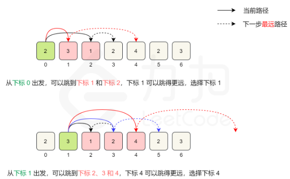

```C++
int jump(vector<int>& nums) {
    if(nums.size()==1) return 0;
    int steps=0;
    int i=0;
    while(i<nums.size())
    {
        int farthest=i+nums[i];
        if(farthest>=nums.size()-1) return steps+1;
        int pos=i;
        int j=i;
        for(;j<=i+nums[i];j++) //找到当前位置i能到达的最远位置
        {
            if(j+nums[j]>farthest)
            {
                farthest=j+nums[j];
                pos=j;
            }
        }
        steps++;
        //cout<<"i: "<<i<<"-"<<farthest<<"-"<<pos<<endl;
        i=pos;//跳到下一步可以到达最远位置的位置
    }
    return steps;//这个没有意义，因为一定会在上面返回
}


int jump(vector<int>& nums) {
    int maxPos = 0, n = nums.size(), end = 0, step = 0;
    for (int i = 0; i < n - 1; ++i) {
        if (maxPos >= i) {
            maxPos = max(maxPos, i + nums[i]);
            if (i == end) {
                end = maxPos;
                ++step;
            }
        }
    }
    return step;
}
```

### ❗最小的k个数

[剑指 Offer 40. 最小的k个数](https://leetcode-cn.com/problems/zui-xiao-de-kge-shu-lcof/)

```C++
输入整数数组 arr ，找出其中最小的 k 个数。例如，输入4、5、1、6、2、7、3、8这8个数字，则最小的4个数字是1、2、3、4。
输入：arr = [3,2,1], k = 2
输出：[1,2] 或者 [2,1]
```

排序

```C++
sort(arr.begin(),arr.end());
vector<int> ans;
for(int i=0;i<k;i++)
    ans.push_back(arr[i]);
return ans;
```

复杂度分析

时间复杂度：O(n\log n)O(nlogn)，其中 nn 是数组 arr 的长度。算法的时间复杂度即排序的时间复杂度。

空间复杂度：O(\log n)O(logn)，排序所需额外的空间复杂度为 O(\log n)O(logn)。

堆

```C++
vector<int> getLeastNumbers(vector<int>& arr, int k) {
    vector<int> ans;
    if(k==0) return ans;//避免没插进去就执行弹出
    priority_queue<int> Q; //优先队列是大顶堆
    for(int i=0;i<arr.size();i++)
    {
        if(i<k)
        {
            Q.push(arr[i]);
        }
        else
        {
            if(arr[i]<Q.top()) //堆里面维护当前最小的k个数
            {
                Q.pop();
                Q.push(arr[i]);
            }
        }
    }
    for(int i=0;i<k;i++)
    {
        ans.push_back(Q.top());
        Q.pop();
    }
    return ans;
}
```

快排思想

快排可以把数据分为两堆，一堆比一个数大，一推比一个数小，如果这一推刚好等于k，则是答案

```C++
vector<int> getLeastNumbers(vector<int>& arr, int k) {
    int L=0,R=arr.size()-1;
    quickSort(arr,k,L,R);
    vector<int> ans(arr.begin(),arr.begin()+k);
    return ans;
}
int partition(vector<int>&arr, int k, int L, int R)
{
    int key=arr[L];
    int l=L,r=R;
    while (l < r) 
    {
        while (l < r && arr[r] >= arr[L]) r--;
        while (l < r && arr[l] <= arr[L]) l++;
        swap(arr[l], arr[r]);
    }
    swap(arr[L],arr[l]);
    return l;
}
void quickSort(vector<int>&arr,int k, int L, int R)
{
    if(R<=L) return;
    int pos=partition(arr,k,L,R);
    if(pos==k) return;
    else if(pos<k) quickSort(arr,k,pos+1,R);//说明分出来的这一推[0，pos]不够k个，还要在右边分
    else if(pos>k) quickSort(arr,k,L,pos-1);
}
```

### ❗旋转-反转-翻转

**反转链表**

指针操作的基本思路是，首先声明一个当前指针curr=head，用于遍历

一个next指针指向下一个位置，以便下一个位置不丢失

一个pre指针指向上一个位置，以便上一个位置不丢失

更新顺序是Z字形，末位又指向首位保存的值。

[206. 反转链表](https://leetcode-cn.com/problems/reverse-linked-list/)

给你单链表的头节点 head ，请你反转链表，并返回反转后的链表。

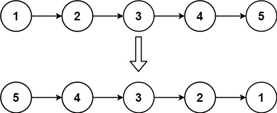

**输入：**head = [1,2,3,4,5] **输出：**[5,4,3,2,1]

**原地改指向**

```C++
ListNode *pre=nullptr;
ListNode *cur=head;
while(cur)
{
    ListNode *next=cur->next;
    cur->next=pre;
    pre=cur;
    cur=next;
}
return pre; //结束循环的标志是cur==null，所以应该返回上一个位置pre
```

**递归**

```C++
/**
 * 以链表1->2->3->4->5举例
 * @param head
 * @return
 */
public ListNode reverseList(ListNode head) {
    if (head == null || head.next == null) {
        /*
            直到当前节点的下一个节点为空时返回当前节点
            由于5没有下一个节点了，所以此处返回节点5
         */
        return head;
    }
    //递归传入下一个节点，目的是为了到达最后一个节点
    ListNode newHead = reverseList(head.next);
            /*
        第一轮出栈，head为5，head.next为空，返回5
        第二轮出栈，head为4，head.next为5，执行head.next.next=head也就是5.next=4，
                  把当前节点的子节点的子节点指向当前节点
                  此时链表为1->2->3->4<->5，由于4与5互相指向，所以此处要断开4.next=null
                  此时链表为1->2->3->4<-5
                  返回节点5
        第三轮出栈，head为3，head.next为4，执行head.next.next=head也就是4.next=3，
                  此时链表为1->2->3<->4<-5，由于3与4互相指向，所以此处要断开3.next=null
                  此时链表为1->2->3<-4<-5
                  返回节点5
        第四轮出栈，head为2，head.next为3，执行head.next.next=head也就是3.next=2，
                  此时链表为1->2<->3<-4<-5，由于2与3互相指向，所以此处要断开2.next=null
                  此时链表为1->2<-3<-4<-5
                  返回节点5
        第五轮出栈，head为1，head.next为2，执行head.next.next=head也就是2.next=1，
                  此时链表为1<->2<-3<-4<-5，由于1与2互相指向，所以此处要断开1.next=null
                  此时链表为1<-2<-3<-4<-5
                  返回节点5
        出栈完成，最终头节点5->4->3->2->1
     */
    head.next.next = head;
    head.next = null;
    return newHead;
}
```

[92. 反转链表 II](https://leetcode-cn.com/problems/reverse-linked-list-ii/)

给你单链表的头指针 head 和两个整数 left 和 right ，其中 left <= right 。请你反转从位置 left 到位置 right 的链表节点，返回 反转后的链表 。


方法一：原地改指向，基于反转链表，切成三部分，中间反转后再拼接。

**如果right==1**
1	2	3	4	5
left right
cur
1<-	2<-	3	4	5
left	pre	cur
          next
3->	2->	1	4	5
pre		left->cur

**如果right！=1**
1	2	3	4	5
left right
1	2<-	   3<-	4	5
    cur	next
1	2<-	3<-	4	5
           pre next
              cur    //此时退出while
1	4->	3->	2	5
left->pre	right-cur

```C++
class Solution {
public:
    ListNode* reverseBetween(ListNode* head, int left, int right) {
        if(left==right) return head;
        ListNode* LeftNode=head;
        ListNode* RightNode=head->next;
        ListNode* pre=nullptr;
        ListNode* cur=head;
        int L=right-left+2;
        int l=left;
        while(--l)
        {
            LeftNode=cur;//指向1
            cur=cur->next;
            RightNode=cur;//指向2
        }
        //cout<<cur->val;
        while(--L)//这里面是基本的反转链表操作
        {
            ListNode* next=cur->next;
            cur->next=pre;
            pre=cur;
            cur=next;
        }
        if(left==1) //如果left=1，RightNode没有意义，这里特殊处理一下
        {
            head=pre;
            LeftNode->next=cur;//让1指向5
        }
        else
        {
            LeftNode->next=pre;//让1指向4
            RightNode->next=cur;//让2指向5
        }
        return head;
    }
};
```

方法一的改进，不用分情况，设置dummy指针

-1	1	2	3	4	5

dum	pre			right	cur	

```C++
class Solution {
public:
    ListNode* reverseBetween(ListNode* head, int left, int right) {
        if(left==right) return head;
        ListNode* dummy=new ListNode(-1);
        dummy->next=head;
        ListNode* LeftNode=dummy;
        ListNode* RightNode=dummy->next;
        ListNode* pre=dummy;
        ListNode* cur=head;
        int L=right-left+2;
        int l=left;
        while(--l)
        {
            LeftNode=cur;//指向1
            cur=cur->next;
            RightNode=cur;//指向2
        }
        //cout<<cur->val;
        while(--L)//这里面是基本的反转链表操作
        {
            ListNode* next=cur->next;
            cur->next=pre;
            pre=cur;
            cur=next;
        }
        LeftNode->next=pre;//让1指向4
        RightNode->next=cur;//让2指向5
        return dummy->next;
    }
};
```

这一版代码有问题，有时间看看

```C++
if(left==right) return head;
ListNode* dummy=new ListNode(-1);
dummy->next=head;
ListNode* LeftNode=head;
ListNode* RightNode=nullptr;
ListNode* pre=dummy;
ListNode* cur=head;
int L=right-left+2;
int l=left;
while(--l>1)
{
    // LeftNode=cur;//指向1
    // cur=cur->next;
    // RightNode=cur;//指向2
    LeftNode=LeftNode->next;
    RightNode=LeftNode->next;
}
//cout<<cur->val;
while(--L)//这里面是基本的反转链表操作
{
    ListNode* next=cur->next;
    cur->next=pre;
    pre=cur;
    cur=next;
}
LeftNode->next=pre;//让1指向4
RightNode->next=cur;//让2指向5
return dummy->next;
```


方法二：头插法

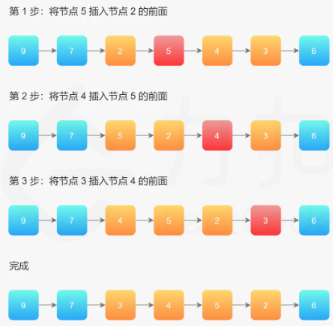

```C++
class Solution {
public:
    ListNode* reverseBetween(ListNode* head, int left, int right) {
        if(left==right) return head;
        ListNode* dummy=new ListNode(-1);
        dummy->next=head;
        ListNode* pre=dummy;//一直指向带插入位置
        ListNode* cur=head;
        ListNode* RightNode=head;
        int L=right-left+1;
        int l=left;
        while(--l)
        {
            pre=cur;
            cur=cur->next;
            RightNode=cur;
        }
        cur=cur->next;
        // cout<<pre->val;
        // cout<<cur->val;
        pre->next->next=nullptr;  // !!!!!!!!!这里非常关键，分段时候的尾结点要明确一下，不然会乱麻
        while(--L && cur)//不断进行头插入
        {
            ListNode* nextN=cur->next;
            //1.把cur插入到pre之后
            ListNode* temp=pre->next;
            pre->next=cur;
            cur->next=temp;
            //2.更新
            cur=nextN;
        }
        RightNode->next=cur;
        // cout<<cur->val;
        return dummy->next;
    }
};
```

[24. 两两交换链表中的节点](https://leetcode-cn.com/problems/swap-nodes-in-pairs/)

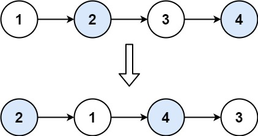

```C++
class Solution {
public:
    ListNode* swapPairs(ListNode* head) {
        if(!head) return head;
        if(!head->next) return head;
        ListNode* dummy=new ListNode(-1);
        dummy->next=head;
        ListNode* cur=dummy;
        while(cur->next && cur->next->next)
        {
            //把cur->next->next插入到cur后面
            ListNode* key=cur->next->next;
            ListNode* nextN=key->next;
            //把key插入到cur后面
            ListNode* temp=cur->next;
            cur->next=key;
            key->next=temp;
            //把后面的接上
            key->next->next=nextN;
            //更新cur
            cur=key->next;
        }
        return dummy->next;
    }
};
```

[25. K 个一组翻转链表](https://leetcode-cn.com/problems/reverse-nodes-in-k-group/)

```C++
class Solution {
public:
    ListNode* reverseKGroup(ListNode* head, int k) {
        ListNode* dummy=new ListNode(-1);
        dummy->next=head;
        ListNode* pre=dummy;
        ListNode* nextN=head;
        for(int i=0;i<k;i++)
        {
            nextN=nextN->next;
        }
        reverseKGroup(pre,k,nextN);
        while(true)
        {
            int count=0;
            while(nextN)
            {
                pre=pre->next;
                nextN=nextN->next;
                if(++count>=k) break;
            }
            // cout<<pre->val;
            if(count>=k)
            {
                reverseKGroup(pre,k,nextN);
            }
            else
            {
                break;
            }
        }
        return dummy->next;
    }
    void reverseKGroup(ListNode* pre,  int k, ListNode* nextN) //实现pre后k个数翻转
    {
        ListNode* pos=pre->next;
        ListNode* cur=pre->next->next;
        for(int i=0;i<k-1;i++)
        {
            //保存cur的下一个位置
            ListNode* curN=cur->next;
            //把cur插入到pre后面
            ListNode* temp=pre->next;
            pre->next=cur;
            cur->next=temp;
            //更新cur
            cur=curN;
            //拼接后面的
            pos->next=nextN;
        }
    }
};
```

**旋转数组、字符串**

[189. 轮转数组](https://leetcode-cn.com/problems/rotate-array/)

```C++
class Solution {
public:
    void reverse(vector<int>& nums, int start, int end) {
        while (start < end) {
            swap(nums[start], nums[end]);
            start += 1;
            end -= 1;
        }
    }
    void rotate(vector<int>& nums, int k) {
        k %= nums.size();
        reverse(nums, 0, nums.size() - 1);
        reverse(nums, 0, k - 1);
        reverse(nums, k, nums.size() - 1);
    }
};
```

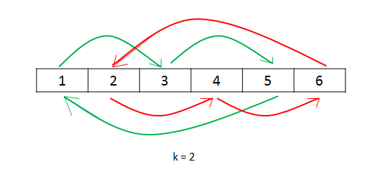

```C++
class Solution {
public:
    void rotate(vector<int>& nums, int k) {
        int n = nums.size();
        k = k % n;
        int count = gcd(k, n);
        for (int start = 0; start < count; ++start) {
            int current = start;
            int prev = nums[start];
            do {
                int next = (current + k) % n;
                swap(nums[next], prev);
                current = next;
            } while (start != current);
        }
    }
};
```

[剑指 Offer 58 - II. 左旋转字符串](https://leetcode-cn.com/problems/zuo-xuan-zhuan-zi-fu-chuan-lcof/) （简单2.4k）

**旋转矩阵**

[48. 旋转图像](https://leetcode.cn/problems/rotate-image/)

[54. 螺旋矩阵](https://leetcode.cn/problems/spiral-matrix/)


### 🔥字符串编程

\72. Edit Distance (Hard)

给你两个单词 word1 和 word2， 请返回将 word1 转换成 word2 所使用的最少操作数  。

你可以对一个单词进行如下三种操作：

插入一个字符
删除一个字符
替换一个字符


示例 1：

输入：word1 = "horse", word2 = "ros"
输出：3
解释：
horse -> rorse (将 'h' 替换为 'r')
rorse -> rose (删除 'r')
rose -> ros (删除 'e')

|      | #    | r     | o     | s     |
| ---- | ---- | ----- | ----- | ----- |
| #    | 0    | 1     | 2*    | 3     |
| h    | 1    | 0+1=1 | 1+1=2 | 2+1=3 |
| o    | 2    | 1+1=2 | 1     | 2     |
| r    | 3    | 2**   | 2     | 2     |
| s    | 4    | 2+1=3 | 3     | 2     |
| e    | 5    | 3+1=4 | 4     | 3     |

*（RO变为空字符需要的步数）
**（相等，等于上一个状态）

```C++
class Solution {
public:
    int minDistance(string word1, string word2) {
        int m=word1.size(),n=word2.size();
        //word1[i]变换到word2[j]需要的最少次数
        //定义dp[i][j]的含义为：word1的前i个字符和word2的前j个字符的编辑距离。意思就是word1的前i个字符，变成word2的前j个字符，最少需要这么多步。
        vector<vector<int>> dp(m+1,vector<int>(n+1,0));
        for(int i=0;i<=m;++i){
            dp[i][0]=i;//word1为空，word2有几个字符，就需要几步,对应表格第一列
        }
        for(int j=0;j<=n;++j){
            dp[0][j]=j;
        }
        for(int i=1;i<=m;i++)
        {
            for(int j=1;j<=n;j++)
            {
                if(word1[i-1]==word2[j-1]) //相等可认为是上一个状态，不需要编辑
                {
                    dp[i][j]=dp[i-1][j-1];
                }
                else
                {
                    //dp[i][j]=dp[i][j-1]+1; //插入
                    //word1尾部插入word2[j]后两者尾部相等，步数和上一个状态相同
                    //可直接认为是word2[j]删掉尾部后的状态，即上一个状态

                    //dp[i][j]=dp[i-1][j]+1; //word1尾部删除

                    //dp[i][j]=dp[i-1][j-1]+1; //替换
                    //替换后两个尾部一致，可认为是上一个状态+1
                    dp[i][j]=min(dp[i-1][j],min(dp[i][j-1],dp[i-1][j-1]))+1;
                }
            }
        }
        return dp[m][n];
    }
};
```

\650. 2 Keys Keyboard (Medium)

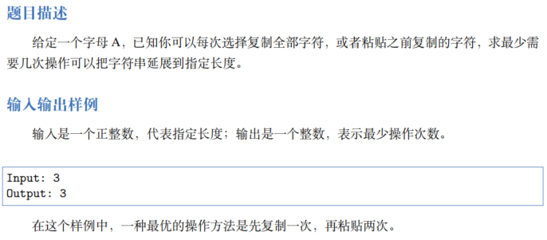


# 四、伏地魔

```C++
for (int j = 0;j < m;j++); //多一个分号
{
    //循环语句里面只会执行一次
}
```

```C++
k>>1;  //k值不更新
k=k>>1;
```

```C++
while (n & 1 == 0) //始终进不去，==优先级高
```


# ---end---