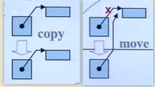
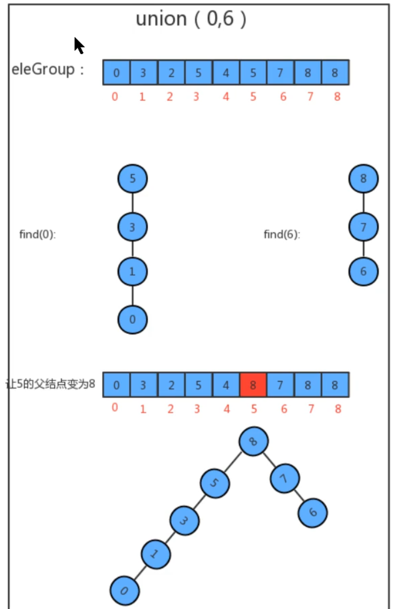
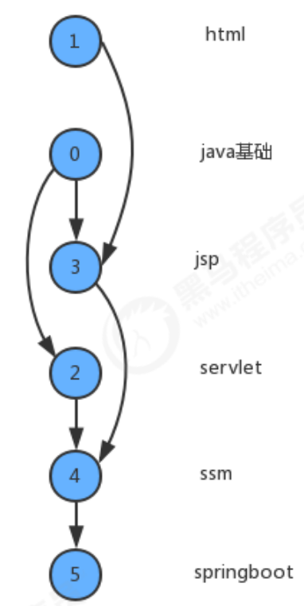
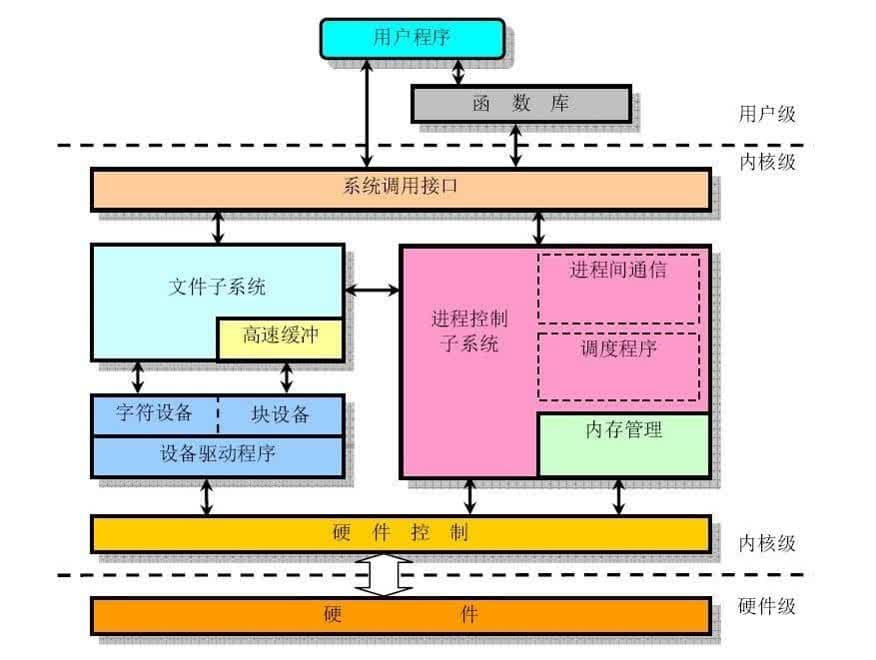
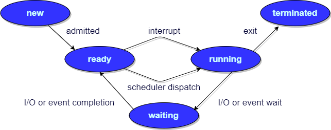
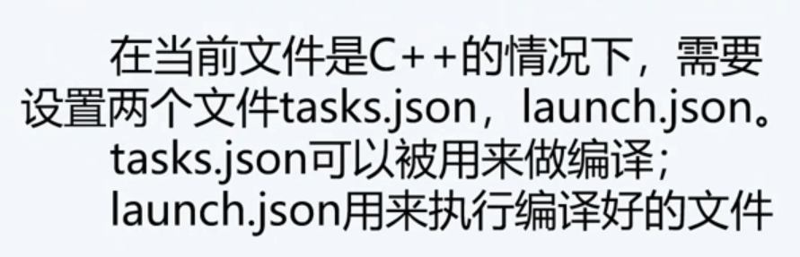
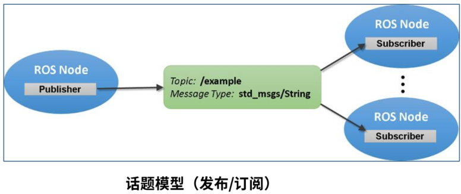
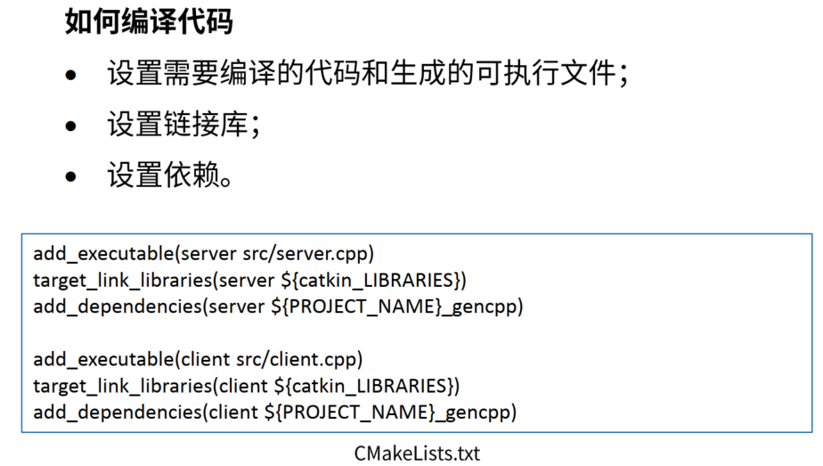
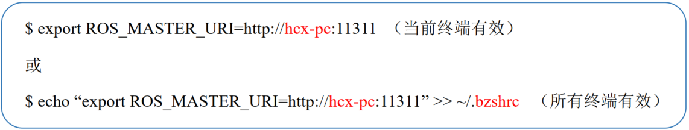

## TODOLists

- [ ] 按照目录结构完善补充
- [ ] 搜集问题进一步完善补充
- [ ] 不断加强记忆


C++后端开发学习路线：https://mp.weixin.qq.com/s/_gqd-THcE-0V7ZZbiTRJpQ

C++工程师面试宝典：https://www.nowcoder.com/issue/tutorial?tutorialId=93&uuid=8f38bec08f974de192275e5366d8ae24

# 一、C++

## C++基础

### 1.常识

**面向对象的三大特性**

C++的面向对象和泛型编程思想，目的就是复用性的提升。

**泛型编程：**模板技术

**面向对象：封装、继承、多态**

**封装**

封装的意义：将属性和行为作为一个整体，表现生活中的事物；将属性和行为加以权限控制。

访问权限有三种：

- public        公共权限  
- protected  保护权限
- private      私有权限

struct和class区别：在C++中 struct和class唯一的区别就在于**默认的访问权限**不同， struct 默认权限为公共，class默认为私有。

成员属性设置为私有

- 将所有成员属性设置为私有，可以自己控制读写权限
- 对于写权限，我们可以检测数据的有效性

**继承**

有些类与类之间存在特殊的关系，动物-》狗-》哈士奇。定义这些类时，下级别的成员除了拥有上一级的共性，还有自己的特性。这个时候我们就可以考虑利用继承的技术，减少重复代码。

继承的语法：class 子类 : 继承方式  父类 class A : public B; //A 类称为子类 或 派生类;  B 类称为父类 或 基类 公共继承 保护继承 私有继承


不同继承方式是对基类中成员变量访问权限的覆盖

*结论： 父类中私有成员也是被子类继承下去了，只是由编译器给隐藏后访问不到*

*总结：继承中 先调用父类构造函数，再调用子类构造函数，析构顺序与构造相反*

问题：当子类与父类出现同名的成员，如何通过子类对象，访问到子类或父类中同名的数据呢？

1. 子类对象可以直接访问到子类中同名成员
2. 子类对象加作用域可以访问到父类同名成员
3. 当子类与父类拥有同名的成员函数，子类会隐藏父类中同名成员函数，加作用域可以访问到父类中同名函数

派生类中的成员包含两大部分

- 一类是从基类继承过来的，表现其共性。
- 一类是自己增加的成员，体现了其个性。

**多态**

多态分为两类

静态多态: __函数重载 和 运算符重载__属于静态多态，复用函数名
动态多态: 派生类和虚函数实现运行时多态。

静态多态和动态多态区别：

静态多态的函数地址早绑定  -  编译阶段确定函数地址
动态多态的函数地址晚绑定  -  运行阶段确定函数地址

**模板**

模板就是建立通用的模具，大大提高复用性。分为**函数模板**和**类模板**。

**面向对象和面向过程区别？**

**面向过程：**

是分析解决问题的步骤，然后用函数把这些步骤一步一步地实现，然后在使用时候一调用则可，性能较高，性能比面向对象高，因为类调用时需要实例化，开销比较大，比较消耗资源;比如单片机、嵌入式开发、 Linux/Unix等一般采用面向过程开发，性能是最重要的因素。缺点是没有面向对象易维护、易复用、易扩展。

**面向对象：**

是把构成问题的实物分解成各个对象，而建立对象的目的也不是为了完成一个个步骤，而是为了面熟某个事物在解决整个问题的过程中所发生的行为，面向对象有封装、继承、多态的特性，所以易维护、易复用、易扩展。可以设计出低耦合的系统。但是性能来说，比面向过程要低。

**POD 类型**

POD 是英文 Plain Old Data 的缩写，用来描述一个类型的属性。

POD 类型一般具有以下几种特征（包括 class、union 和 struct等）：

\1) 没有用户自定义的构造函数、析构函数、拷贝构造函数和移动构造函数。

\2) 不能包含虚函数和虚基类。

\3) 非静态成员必须声明为 public。

\4) 类中的第一个非静态成员的类型与其基类不同，例如：

```C++
class B1{};
class B2 : B1 { B1 b; };
```

class B2 的第一个非静态成员 b 是基类类型，所以它不是 POD 类型。

\5) 在类或者结构体继承时，满足以下两种情况之一：

- 派生类中有非静态成员，且只有一个仅包含静态成员的基类；
- 基类有非静态成员，而派生类没有非静态成员。

我们来看具体的例子：

class B1 { static int n; };

class B2 : B1 { int n1; };

class B3 : B2 { static int n2; };

对于 B2，派生类 B2 中有非静态成员，且只有一个仅包含静态成员的基类 B1，所以它是 POD 类型。对于 B3，基类 B2 有非静态成员，而派生类 B3 没有非静态成员，所以它也是 POD 类型。

\6) 所有非静态数据成员均和其基类也符合上述规则（递归定义），也就是说 POD 类型不能包含非 POD 类型的数据。

\7) 此外，所有兼容C语言的数据类型都是 POD 类型（struct、union 等不能违背上述规则）。

### 2.数据类型


### 3.运算符

| **运算符类型** | **作用**                               |
| -------------- | -------------------------------------- |
| 算术运算符     | 用于处理四则运算                       |
| 赋值运算符     | 用于将表达式的值赋给变量               |
| 比较运算符     | 用于表达式的比较，并返回一个真值或假值 |
| 逻辑运算符     | 用于根据表达式的值返回真值或假值       |


**运算符优先级**

算数运算符>移位运算符>关系运算符>逻辑运算符>

| 运算符                           | 描述             | 例子                                                    | 可重载性 |
| -------------------------------- | ---------------- | ------------------------------------------------------- | -------- |
| ==**第一级别**==                 | -----            | -----                                                   | -----    |
| ::                               | 作用域解析符     | Class::age = 2;                                         | 不可重载 |
| ==**第二级别**==                 | -----            | -----                                                   | -----    |
| ()                               | 函数调用         | isdigit('1')                                            | 可重载   |
| ()                               | 成员初始化       | c_tor(int x, int y) : _x(x), _y(y*10){};                | 可重载   |
| []                               | 数组数据获取     | array[4] = 2;                                           | 可重载   |
| ->                               | 指针型成员调用   | ptr->age = 34;                                          | 可重载   |
| .                                | 对象型成员调用   | obj.age = 34;                                           | 不可重载 |
| ++                               | 后自增运算符     | for( int i = 0; i < 10; i++ ) cout                      | 可重载   |
| --                               | 后自减运算符     | for( int i = 10; i > 0; i-- ) cout                      | 可重载   |
| const_cast                       | 特殊属性转换     | const_cast(type_from);                                  | 不可重载 |
| dynamic_cast                     | 特殊属性转换     | dynamic_cast(type_from);                                | 不可重载 |
| static_cast                      | 特殊属性转换     | static_cast(type_from);                                 | 不可重载 |
| reinterpret_cast                 | 特殊属性转换     | reinterpret_cast(type_from);                            | 不可重载 |
| typeid                           | 对象类型符       | cout « typeid(var).name();cout « typeid(type).name();   | 不可重载 |
| ==**第三级别**==(具有右结合性)   | -----            | -----                                                   | -----    |
| !                                | 逻辑取反         | if( !done ) …                                           | 可重载   |
| not                              | ! 的另一种表达   | -----                                                   | -----    |
| ~                                | 按位取反         | flags = ~flags;                                         | 可重载   |
| compl                            | ~的另一种表达    | -----                                                   | -----    |
| ++                               | 预自增运算符     | for( i = 0; i < 10; ++i ) cout                          | 可重载   |
| --                               | 预自减运算符     | for( i = 10; i > 0; --i ) cout                          | 可重载   |
| -                                | 负号             | int i = -1;                                             | 可重载   |
| +                                | 正号             | int i = +1;                                             | 可重载   |
| *                                | 指针取值         | int data = *intPtr;                                     | 可重载   |
| &                                | 值取指针         | int *intPtr = &data;                                    | 可重载   |
| new                              | 动态元素内存分配 | long *pVar = new long;MyClass *ptr = new MyClass(args); | 可重载   |
| new []                           | 动态数组内存分配 | long *array = new long[n];                              | 可重载   |
| delete                           | 动态析构元素内存 | delete pVar;                                            | 可重载   |
| delete []                        | 动态析构数组内存 | delete [] array;                                        | 可重载   |
| (type)                           | 强制类型转换     | int i = (int) floatNum;                                 | 可重载   |
| sizeof                           | 返回类型内存     | int size = sizeof floatNum;int size = sizeof(float);    | 不可重载 |
| ==**第四级别**==                 | -----            | -----                                                   | -----    |
| ->*                              | 类指针成员引用   | ptr->*var = 24;                                         | 可重载   |
| .*                               | 类对象成员引用   | obj.*var = 24;                                          | 不可重载 |
| ==**第五级别**==                 | -----            | -----                                                   | -----    |
| *                                | 乘法             | int i = 2 * 4;                                          | 可重载   |
| /                                | 除法             | float f = 10.0 / 3.0;                                   | 可重载   |
| %                                | 取余数(模运算)   | int rem = 4 % 3;                                        | 可重载   |
| ==**第六级别**==                 | -----            | -----                                                   | -----    |
| +                                | 加法             | int i = 2 + 3;                                          | 可重载   |
| -                                | 减法             | int i = 5 - 1;                                          | 可重载   |
| ==**第七级别**==                 | -----            | -----                                                   | -----    |
| <<                               | 位左移           | int flags = 33                                          | 可重载   |
| >>                               | 位右移           | int flags = 33 >> 1;                                    | 可重载   |
| ==**第八级别**==                 | -----            | -----                                                   | -----    |
| <                                | 小于             | if( i < 42 ) …                                          | 可重载   |
| <=                               | 小于等于         | if( i                                                   | 可重载   |
| >                                | 大于             | if( i > 42 ) …                                          | 可重载   |
| >=                               | 大于等于         | if( i >= 42 ) ...                                       | 可重载   |
| ==**第九级别**==                 | -----            | -----                                                   | -----    |
| ==                               | 恒等于           | if( i == 42 ) ...                                       | 可重载   |
| eq                               | == 的另一种表达  | -----                                                   | -----    |
| !=                               | 不等于           | if( i != 42 ) …                                         | 可重载   |
| not_eq                           | !=的另一种表达   | -----                                                   | -----    |
| ==**第十级别**==                 | -----            | -----                                                   | -----    |
| &                                | 位且运算         | flags = flags & 42;                                     | 可重载   |
| bitand                           | &的另一种表达    | -----                                                   | -----    |
| ==**第十一级别**==               | -----            | -----                                                   | -----    |
| ^                                | 位异或运算       | flags = flags ^ 42;                                     | 可重载   |
| xor                              | ^的另一种表达    | -----                                                   | -----    |
| ==**第十二级别**==               | -----            | -----                                                   | -----    |
| \|                               | 位或运算         | flags = flags \| 42;                                    | 可重载   |
| bitor                            | \|的另一种表达   | -----                                                   | -----    |
| ==**第十三级别**==               | -----            | -----                                                   | -----    |
| &&                               | 逻辑且运算       | if( conditionA && conditionB ) …                        | 可重载   |
| and                              | &&的另一种表达   | -----                                                   | -----    |
| ==**第十四级别**==               | -----            | -----                                                   | -----    |
| \|\|                             | 逻辑或运算       | if( conditionA \|\| conditionB ) ...                    | 可重载   |
| or                               | \|\|的另一种表达 | -----                                                   | -----    |
| ==**第十五级别**==(具有右结合性) | -----            | -----                                                   | -----    |
| ? :                              | 条件运算符       | int i = (a > b) ? a : b;                                | 不可重载 |
| ==**第十六级别**==(具有右结合性) | -----            | -----                                                   | -----    |
| =                                | 赋值             | int a = b;                                              | 可重载   |
| +=                               | 加赋值运算       | a += 3;                                                 | 可重载   |
| -=                               | 减赋值运算       | b -= 4;                                                 | 可重载   |
| *=                               | 乘赋值运算       | a *= 5;                                                 | 可重载   |
| /=                               | 除赋值运算       | a /= 2;                                                 | 可重载   |
| %=                               | 模赋值运算       | a %= 3;                                                 | 可重载   |
| &=                               | 位且赋值运算     | flags &= new_flags;                                     | 可重载   |
| and_eq                           | &= 的另一种表达  | -----                                                   | -----    |
| ^=                               | 位异或赋值运算   | flags ^= new_flags;                                     | 可重载   |
| xor_eq                           | ^=的另一种表达   | -----                                                   | -----    |
| \|=                              | 位或赋值运算     | flags \|= new_flags;                                    | 可重载   |
| or_eq                            | \|=的另一种表达  | -----                                                   | -----    |
| <<=                              | 位左移赋值运算   | flags <<=2;                                             | 可重载   |
| >>=                              | 位右移赋值运算   | flags >>= 2;                                            | 可重载   |
| ==**第十七级别**==               | -----            | -----                                                   | -----    |
| throw                            | 异常抛出         | throw EClass(“Message”);                                | 不可重载 |
| ==**第十八级别**==               | -----            | -----                                                   | -----    |
| ,                                | 逗号分隔符       | for( i = 0, j = 0; i < 10; i++, j++ ) …                 | 可重载   |


**不相等的数O(1)空间复杂度交换**

```C++
int a=17;
int b=17;
a=a^b;
b=a^b;
a=a^b; 
//前提是两者不相等，相等的话结果都是0
```

取出最右的1

```C++
int rightOne = eor & (~eor + 1);
eor:	1010111100
~eor:	0101000011
~eor+1:	0101000100
&		0000000100
```


### 4.程序流程结构	

C/C++支持最基本的三种程序运行结构：==顺序结构、选择结构、循环结构==

* 顺序结构：程序按顺序执行，不发生跳转
* 选择结构：依据条件是否满足，有选择的执行相应功能
* 循环结构：依据条件是否满足，循环多次执行某段代码

### 5.数组

**特点1：**数组中的每个==数据元素都是相同的数据类型==

**特点2：**数组是由==连续的内存==位置组成的

```C++
//1、可以获取整个数组占用内存空间大小
int arr[10] = { 1,2,3,4,5,6,7,8,9,10 };

cout << "整个数组所占内存空间为： " << sizeof(arr) << endl;
cout << "每个元素所占内存空间为： " << sizeof(arr[0]) << endl;
cout << "数组的元素个数为： " << sizeof(arr) / sizeof(arr[0]) << endl;

//2、可以通过数组名获取到数组首地址
cout << "数组首地址为： " << (int)arr << endl;
cout << "数组中第一个元素地址为： " << (int)&arr[0] << endl;
cout << "数组中第二个元素地址为： " << (int)&arr[1] << endl;
```

### 6.函数

- 函数的**声明可以多次**，但是函数的**定义只能有一次**

### 7.指针

**指针的作用：** 可以通过指针间接访问内存

* 内存编号是从0开始记录的，一般用十六进制数字表示
* 可以利用指针变量保存地址

**常量指针和指针常量**

```C++
const int * p1 = &a; 
int * const p2 = &a; 
```

const修饰指针有三种情况

1. const修饰指针   --- 常量指针 const int * p1 = &a; 指针指向可以改，指针指向的值不可以更改
2. const修饰常量   --- 指针常量 int * const p2 = &a; 指针指向不可以改，指针指向的值可以更改
3. const即修饰指针，又修饰常量       例：const int * const p3 = &a;

[**指针函数与函数指针的区别**](https://www.cnblogs.com/nevel/p/6370264.html)

```C++
int* f(int x); //指针函数：返回值是指针的函数

void (*fptr)(int x); //函数指针fptr，返回值为void
//用法和普通函数一样，函数名是(*fptr)
```

看*是在括号里面还是在外面，在里面是函数指针。

C语言可以通过函数指针实现类的功能，结构体内声明，结构体外实现并赋值即可。继承就是结构体嵌套结构体。

### 8.结构体

**语法：**`struct 结构体名 { 结构体成员列表 }；`

通过结构体创建变量的方式有三种：

* struct 结构体名 变量名
* struct 结构体名 变量名 = { 成员1值 ， 成员2值...}
* 定义结构体时顺便创建变量

**示例：**

```C++
//结构体定义
struct student
{
	//成员列表
	string name;  //姓名
	int age;      //年龄
	int score;    //分数
}stu3; //结构体变量创建方式3 

//结构体变量创建方式2
struct student stu2 = { "李四",19,60 };
```


**4.1.2 struct和class区别**

在C++中 struct和class唯一的**区别**就在于 **默认的访问权限不同**

区别：

\* struct 默认权限为公共

\* class   默认权限为私有

## C++核心

### 1.内存分区模型

C++程序在执行时，将内存大方向划分为**4个区域**

- 代码区：存放函数体的二进制代码（存放 CPU 执行的机器指令），由操作系统进行管理的
- 全局区：存放全局变量和静态变量以及常量，程序结束时由操作系统回收
- 栈区：由编译器自动分配释放, 存放函数的参数值,局部变量等
- 堆区：由程序员分配和释放,若程序员不释放,程序结束时由操作系统回收

**内存四区意义：**

不同区域存放的数据，赋予不同的生命周期, 给我们更大的灵活编程

总结：

* C++中在程序运行前分为全局区和代码区
* 代码区特点是共享和只读，共享的目的是对于频繁被执行的程序，只需要在内存中有一份代码即可。使其只读的原因是防止程序意外地修改了它的指令
* 全局区还包含了常量区, 常量区中存放 const修饰的全局常量  和 字符串常量

**new操作符**

```C++
int* p = new int(10);
delete p;

int* arr = new int[10];
delete[] arr;
```

🔥**深拷贝与浅拷贝**

浅拷贝：简单的等号赋值拷贝操作

深拷贝：在堆区重新申请空间，进行拷贝操作

所谓的浅拷贝是编译器默认的赋值操作，同样如果数据是堆区指针他也复制一遍，问题在于在堆区的数据是自己管理的，一般在析构函数中要delete，然后浅拷贝是同一个指针，会出现重复delete违法操作。如果有在堆区开辟数据，一定要自己写拷贝构造函数，默认的拷贝构造函数是浅拷贝（只拷贝地址，没有另外申请空间）

所谓深拷贝，我们自己写拷贝构造函数，开辟一个不同的堆区地址，避免重复

总结：如果属性有在堆区开辟的，一定要自己提供拷贝构造函数，防止浅拷贝带来的问题。

```c++
//拷贝构造函数  
Person(const Person& p) {
    cout << "拷贝构造函数!" << endl;
    //如果不利用深拷贝在堆区创建新内存，会导致浅拷贝带来的重复释放堆区问题
    m_age = p.m_age;
    m_height = new int(*p.m_height);

}
//析构函数
~Person() {
    cout << "析构函数!" << endl;
    if (m_height != NULL)
    {
    	delete m_height;
    }
}
```


### 2.引用

**引用**

2.1 引用的基本使用

**作用：** 给变量起别名
**语法：** `数据类型 &别名 = 原名`

```C++
int a = 10;
int &b = a;

//int &c; //错误，引用必须初始化
int &c = a; //一旦初始化后，就不可以更改
c = b; //这是赋值操作，不是更改引用
```

2.3 引用做函数参数

**作用：**函数传参时，可以利用引用的技术让形参修饰实参
**优点：**可以简化指针修改实参（指针常量）

//1. 值传递
//2. 地址传递 
//3. 引用传递

2.4 引用做函数返回值

作用：引用是可以作为函数的返回值存在的
注意：**不要返回局部变量引用**
用法：函数调用作为左值

2.5 引用的本质

本质：**引用的本质在c++内部实现是一个指针常量.**

```C++
//发现是引用，转换为 int* const ref = &a;
void func(int& ref){
	ref = 100; // ref是引用，转换为*ref = 100
}
int main(){
	int a = 10;
    
    //自动转换为 int* const ref = &a; 指针常量是指针指向不可改，也说明为什么引用不可更改
	int& ref = a; 
	ref = 20; //内部发现ref是引用，自动帮我们转换为: *ref = 20;
    
	cout << "a:" << a << endl;
	cout << "ref:" << ref << endl;
    
	func(a);
	return 0;
}
```

2.6 常量引用

**作用：**常量引用主要用来修饰形参，防止误操作

### 3.函数提高

3.1 函数默认参数

在C++中，函数的形参列表中的形参是可以有默认值的。

语法：` 返回值类型  函数名 （参数= 默认值）{}`

```c++
//1. 如果某个位置参数有默认值，那么从这个位置往后，从左向右，必须都要有默认值
//2. 如果函数声明有默认值，函数实现的时候就不能有默认参数
int func2(int a = 10, int b = 10);
int func2(int a, int b) {
	return a + b;
}
```

3.2 函数占位参数

**语法：** `返回值类型 函数名 (数据类型){}`

```c++
//函数占位参数 ，占位参数也可以有默认参数
void func(int a, int) {
	cout << "this is func" << endl;
}

int main() {

	func(10,10); //占位参数必须填补

	system("pause");

	return 0;
}
```

3.3 函数重载

**作用：**函数名可以相同，提高复用性

**函数重载满足条件：**

* 同一个作用域下
* 函数名称相同
* 函数参数**类型不同**  或者 **个数不同** 或者 **顺序不同**

### 4.类和对象

**4.1.3 成员属性设置为私有**

**优点1：**将所有成员属性设置为私有，可以自己控制读写权限

**优点2：**对于写权限，我们可以检测数据的有效性


**4.2.2 构造函数的分类及调用**

两种分类方式：

​	按参数分为： 有参构造和无参构造
​	按类型分为： 普通构造和拷贝构造

三种调用方式：

​	括号法
​	显示法
​	隐式转换法

```c++
//2.1  括号法，常用
//Person p1;
Person p1(10);
//Person p2(p1);
//注意1：调用无参构造函数不能加括号，如果加了编译器认为这是一个函数声明
//Person p2();

//2.2 显式法
Person p2 = Person(10); 
Person p3 = Person(p2);
//Person(10)单独写就是匿名对象  当前行结束之后，马上析构

//2.3 隐式转换法
Person p4 = 10; // Person p4 = Person(10); 
Person p5 = p4; // Person p5 = Person(p4); 
```

c++编译器至少给一个类添加4个函数

1. 默认构造函数(无参，函数体为空)
2. 默认析构函数(无参，函数体为空)
3. 默认拷贝构造函数，对属性进行值拷贝
4. 赋值运算符 operator=, 对属性进行值拷贝

```c++
class Person
{
public:
	Person(int age)
	{
		//将年龄数据开辟到堆区
		m_Age = new int(age);
	}

	//重载赋值运算符 
	Person& operator=(Person &p)
	{
		if (m_Age != NULL)
		{
			delete m_Age;
			m_Age = NULL;
		}
		//编译器提供的代码是浅拷贝
		//m_Age = p.m_Age;

		//提供深拷贝 解决浅拷贝的问题
		m_Age = new int(*p.m_Age);

		//返回自身
		return *this;
	}

	~Person()
	{
		if (m_Age != NULL)
		{
			delete m_Age;
			m_Age = NULL;
		}
	}

	//年龄的指针
	int *m_Age;

};

p3 = p2 = p1; //赋值操作
```

**4.2.6 初始化列表**

**语法：**`构造函数()：属性1(值1),属性2（值2）... {}`

**4.2.8 静态成员**

静态成员就是在成员变量和成员函数前加上关键字static，称为静态成员

静态成员分为：

*  静态成员变量
    *  所有对象共享同一份数据
    *  在编译阶段分配内存
    *  类内声明，类外初始化
*  静态成员函数
    *  所有对象共享同一个函数
    *  静态成员函数只能访问静态成员变量

**4.3.1 成员变量和成员函数分开存储**

在C++中，类内的成员变量和成员函数分开存储

只有非静态成员变量才属于类的对象上

```c++
class Person {
public:
	Person() {
		mA = 0;
	}
	//非静态成员变量占对象空间
	int mA;
	//静态成员变量不占对象空间
	static int mB; 
	//函数也不占对象空间，所有函数共享一个函数实例
	void func() {
		cout << "mA:" << this->mA << endl;
	}
	//静态成员函数也不占对象空间
	static void sfunc() {
	}
};
Person p;
sizeof(Person)==1; //如果Person（）里面是空的，系统会分配一个空间用来区分
cout << sizeof(Person) << endl;//输出是4


class Person
{
    int a;
    double b;

};
int main()
{
    Person p;
    cout <<sizeof(p)<< endl; //16=8+8,以最长的为准
    return 0;
}
```

**4.3.2 this指针概念**

C++中成员变量和成员函数是分开存储的。每一个**非静态成员函数只会诞生一份函数实例**，也就是说多个同类型的对象会共用一块代码。那么问题是：这一块代码是如何区分那个对象调用自己的呢？

c++通过提供特殊的对象指针，this指针，解决上述问题。**this指针指向被调用的成员函数所属的对象**

- this指针是隐含每一个非静态成员函数内的一种指针
- this指针不需要定义，直接使用即可

this指针的用途：

- 当形参和成员变量同名时，可用this指针来区分
- 在类的非静态成员函数中返回对象本身，可使用return *this

```c++
//链式的编程思想
Person& PersonAddPerson(Person p) //这里如果不返回引用的，它会调用构造函数创造新的对象
{
    this->age += p.age;
    //返回对象本身
    return *this;
}
p2.PersonAddPerson(p1).PersonAddPerson(p1).PersonAddPerson(p1);
```

**4.3.3 空指针访问成员函数**

C++中空指针也是可以调用成员函数的，但是也要注意有没有用到this指针

如果用到this指针，需要加以判断保证代码的健壮性

```C++
//空指针访问成员函数
class Person {
public:

	void ShowClassName() {
		cout << "我是Person类!" << endl;
	}

	void ShowPerson() {
		if (this == NULL) {
			return;
		}
		cout << mAge << endl;
	}

public:
	int mAge;
};

void test01()
{
	Person * p = NULL;
	p->ShowClassName(); //空指针，可以调用成员函数
	p->ShowPerson();  //但是如果成员函数中用到了this指针，就不可以了
}
```

**4.3.4 const修饰成员函数**

**常函数：**

- 成员函数后加const后我们称为这个函数为**常函数**
- 常函数内不可以修改成员属性
- 成员属性声明时加关键字mutable后，在常函数中依然可以修改

**常对象：**

- 声明对象前加const称该对象为常对象
- 常对象只能调用常函数

```c++
class Person {
public:
	Person() {
		m_A = 0;
		m_B = 0;
	}

	//this指针的本质是一个指针常量，指针的指向不可修改
	//如果想让指针指向的值也不可以修改，需要声明常函数
	void ShowPerson() const {
		//const Type* const pointer;
		//this = NULL; //不能修改指针的指向 Person* const this;
		//this->mA = 100; //但是this指针指向的对象的数据是可以修改的

		//const修饰成员函数，表示指针指向的内存空间的数据不能修改，除了mutable修饰的变量
		this->m_B = 100;
	}

	void MyFunc() const {
		//mA = 10000;
	}

public:
	int m_A;
	mutable int m_B; //可修改 可变的
};

//const修饰对象  常对象
void test01() {

	const Person person; //常量对象  
	cout << person.m_A << endl;
	//person.mA = 100; //常对象不能修改成员变量的值,但是可以访问
	person.m_B = 100; //但是常对象可以修改mutable修饰成员变量

	//常对象访问成员函数
	person.MyFunc(); //常对象不能调用const的函数

}
```

**4.4 友元**

友元的目的就是让一个函数或者类 访问另一个类中私有成员。友元的三种实现：

* 全局函数做友元
* 类做友元
* 成员函数做友元

**4.5 运算符重载**

运算符重载概念：对已有的运算符重新进行定义，赋予其另一种功能，以适应不同的数据类型。

**4.5.1 加号运算符重载**

```c++
//全局函数实现 + 号运算符重载
//Person operator+(const Person& p1, const Person& p2) {
//	Person temp(0, 0);
//	temp.m_A = p1.m_A + p2.m_A;
//	temp.m_B = p1.m_B + p2.m_B;
//	return temp;
//}

//运算符重载 可以发生函数重载 
Person operator+(const Person& p2, int val)  
{
	Person temp;
	temp.m_A = p2.m_A + val;
	temp.m_B = p2.m_B + val;
	return temp;
}

Person p3 = p2 + p1;  //相当于 p2.operaor+(p1)
Person p4 = p3 + 10; //相当于 operator+(p3,10)
```

**4.5.2 左移运算符重载**

```c++
//成员函数 实现不了  p << cout 不是我们想要的效果
//void operator<<(Person& p){
//}

//全局函数实现左移重载
//ostream对象只能有一个
ostream& operator<<(ostream& out, Person& p) {
	out << "a:" << p.m_A << " b:" << p.m_B;
	return out;
}
cout << p1 << "hello world" << endl; //链式编程
```

**4.5.3 递增运算符重载**

```C++
//前置++
MyInteger& operator++() {
		//先++
		m_Num++;
		//再返回
		return *this;
}
//后置++
MyInteger operator++(int) {// 占位参数是为了实现重载
    //先返回
    MyInteger temp = *this; //记录当前本身的值，然后让本身的值加1，但是返回的是以前的值，达到先返回后++；
    m_Num++;
    return temp;
}
```

**4.5.5 关系运算符重载**

TODO

**4.5.6 函数调用运算符重载**

- 函数调用运算符 ()  也可以重载
- 由于重载后使用的方式非常像函数的调用，因此称为仿函数
- 仿函数没有固定写法，非常灵活

**仿函数**

重载函数调用操作符的类，其对象常称为**函数对象**，函数对象使用重载的()时，行为类似函数调用，也叫**仿函数**。

函数对象(仿函数)是一个类，不是一个函数。

返回bool类型的仿函数称为**谓词**

- 如果operator()接受一个参数，那么叫做一元谓词
- 如果operator()接受两个参数，那么叫做二元谓词


4.6  继承

**4.6.7 多继承语法**

C++允许**一个类继承多个类**

语法：class 子类 ：继承方式 父类1 ， 继承方式 父类2...

多继承可能会引发父类中有同名成员出现，需要加作用域区分

**C++实际开发中不建议用多继承**

**菱形继承问题：**

1. 羊继承了动物的数据，驼同样继承了动物的数据，当草泥马使用数据时，就会产生二义性。
2. 草泥马继承自动物的数据继承了两份，其实我们应该清楚，这份数据我们只需要一份就可以。

总结：

- 菱形继承带来的主要问题是子类继承两份相同的数据，导致资源浪费以及毫无意义
- 利用虚继承可以解决菱形继承问题

4.7  多态

4.7.3 纯虚函数和抽象类

在多态中，通常父类中虚函数的实现是毫无意义的，主要都是调用子类重写的内容。

因此可以将虚函数改为**纯虚函数**

纯虚函数语法：`virtual 返回值类型 函数名 （参数列表）= 0 ;`

当类中有了纯虚函数，这个类也称为==抽象类==


**抽象类特点**：

 * 无法实例化对象
 * 子类必须重写抽象类中的纯虚函数，否则也属于抽象类

4.7.5 虚析构和纯虚析构

多态使用时，如果子类中有属性开辟到堆区，那么父类指针在释放时无法调用到子类的析构代码

解决方式：将父类中的析构函数改为**虚析构**或者**纯虚析构**

虚析构和纯虚析构共性：

* 可以解决父类指针释放子类对象
* 都需要有具体的函数实现

虚析构和纯虚析构区别：

* 如果是纯虚析构，该类属于抽象类，无法实例化对象（？？父类指针是啥）

虚析构语法：

`virtual ~类名(){}`

纯虚析构语法：

` virtual ~类名() = 0;`

`类名::~类名(){}`

总结：

​	1. 虚析构或纯虚析构就是用来解决通过父类指针释放子类对象

​	2. 如果子类中没有堆区数据，可以不写为虚析构或纯虚析构

​	3. 拥有纯虚析构函数的类也属于抽象类

### 5.文件操作

程序运行时产生的数据都属于临时数据，程序一旦运行结束都会被释放

通过**文件可以将数据持久化**

C++中对文件操作需要包含头文件 ==&lt; fstream &gt;==

文件类型分为两种：

1. **文本文件**     -  文件以文本的**ASCII码**形式存储在计算机中
2. **二进制文件** -  文件以文本的**二进制**形式存储在计算机中，用户一般不能直接读懂它们

操作文件的三大类:

1. ofstream：写操作
2. ifstream： 读操作
3. fstream ： 读写操作

## 模板

模板就是建立**通用的模具**，大大**提高复用性**

1.2 函数模板

* C++另一种编程思想称为 ==泛型编程== ，主要利用的技术就是模板


* C++提供两种模板机制:**函数模板**和**类模板** 

1.3.7 类模板分文件编写

问题：

* 类模板中成员函数创建时机是在调用阶段，导致分文件编写时链接不到


解决：

* 解决方式1：直接包含.cpp源文件
* 解决方式2：将声明和实现写到同一个文件中，并更改后缀名为.hpp，hpp是约定的名称，并不是强制


## STL

### 1.STL简介

参考http://c.biancheng.net/stl/stl_basic/

STL，英文全称 s[tan](http://c.biancheng.net/ref/tan.html)dard template library，中文可译为标准模板库或者泛型库，其包含有大量的模板类和模板函数，是 C++ 提供的一个基础模板的集合，用于完成诸如输入/输出、数学计算等功能。STL 最初由惠普实验室开发，于 1998 年被定为国际标准，正式成为 C++ 程序库的重要组成部分。值得一提的是，如今 STL 已完全被内置到支持 C++ 的编译器中，无需额外安装，这可能也是 STL 被广泛使用的原因之一。

通常认为，[STL](http://c.biancheng.net/stl/) 是由**容器、算法、迭代器、函数对象、适配器、内存分配器**这 6 部分构成，其中后面 4 部分是为前 2 部分服务的。

1. 容器：各种数据结构，如vector、list、deque、set、map等,用来存放数据。
2. 算法：各种常用的算法，如sort、find、copy、for_each等
3. 迭代器：扮演了容器与算法之间的胶合剂。
4. 仿函数：行为类似函数，可作为算法的某种策略。
5. 适配器：一种用来修饰容器或者仿函数或迭代器接口的东西。
6. 空间配置器：负责空间的配置与管理。

| STL的组成  | 含义                                                         |
| ---------- | ------------------------------------------------------------ |
| 容器       | 一些封装[数据结构](http://c.biancheng.net/data_structure/)的模板类，例如 vector 向量容器、list 列表容器等。 |
| 算法       | STL 提供了非常多（大约 100 个）的数据结构算法，它们都被设计成一个个的模板函数，这些算法在 std 命名空间中定义，其中大部分算法都包含在头文件 <algorithm> 中，少部分位于头文件 <numeric> 中。 |
| 迭代器     | 在 [C++](http://c.biancheng.net/cplus/) STL 中，对容器中数据的读和写，是通过迭代器完成的，扮演着容器和算法之间的胶合剂。 |
| 函数对象   | 如果一个类将 () 运算符重载为成员函数，这个类就称为函数对象类，这个类的对象就是函数对象（又称仿函数）。 |
| 适配器     | 可以使一个类的接口（模板的参数）适配成用户指定的形式，从而让原本不能在一起工作的两个类工作在一起。值得一提的是，容器、迭代器和函数都有适配器。 |
| 内存分配器 | 为容器类模板提供自定义的内存申请和释放功能，由于往往只有高级用户才有改变内存分配策略的需求，因此内存分配器对于一般用户来说，并不常用。 |

在 C++ 标准中，STL被组织为 13 个头文件。

| <iterator> | <functional> | <vector>  | <deque>  |
| ---------- | ------------ | --------- | -------- |
| <list>     | <queue>      | <stack>   | <set>    |
| <map>      | <algorithm>  | <numeric> | <memory> |
| <utility>  |              |           |          |

按照 C++ 标准库的规定，所有标准头文件都不再有扩展名。以 <vector> 为例，此为无扩展名的形式，而 <vector.h> 为有扩展名的形式。

**简单的理解容器，它就是一些模板类的集合，但和普通模板类不同的是，容器中封装的是组织数据的方法（也就是数据结构）**。STL 提供有 3 类标准容器，分别是序列容器、排序容器和哈希容器，其中后两类容器有时也统称为关联容器。

| **容器种类** | **功能**                                                     |
| ------------ | ------------------------------------------------------------ |
| 序列容器     | 主要包括 vector 向量容器、list 列表容器以及 deque 双端队列容器。之所以被称为序列容器，是因为元素在容器中的位置同元素的值无关，即容器不是排序的。将元素插入容器时，指定在什么位置，元素就会位于什么位置。 |
| 排序容器     | 包括 set 集合容器、multiset多重集合容器、map映射容器以及 multimap 多重映射容器。排序容器中的元素默认是由小到大排序好的，即便是插入元素，元素也会插入到适当位置。所以关联容器在查找时具有非常好的性能。 |
| 哈希容器     | [C++](http://c.biancheng.net/cplus/) 11 新加入 4 种关联式容器，分别是 unordered_set 哈希集合、unordered_multiset 哈希多重集合、unordered_map 哈希映射以及 unordered_multimap 哈希多重映射。和排序容器不同，哈希容器中的元素是未排序的，元素的位置由哈希函数确定。 |

>注意，由于哈希容器直到 C++ 11 才被正式纳入 C++ 标准程序库。另外，以上 3 类容器的存储方式完全不同，因此使用不同容器完成相同操作的效率也大不相同。所以在实际使用时，要善于根据想实现的功能，选择合适的容器。

### 2.STL迭代器

无论是序列容器还是关联容器，最常做的操作无疑是遍历容器中存储的元素，而实现此操作，多数情况会选用“迭代器（iterator）”来实现。我们知道，尽管不同容器的内部结构各异，但它们本质上都是用来存储大量数据的，换句话说，都是一串能存储多个数据的存储单元。因此，诸如数据的排序、查找、求和等需要对数据进行遍历的操作方法应该是类似的。既然类似，完全可以利用泛型技术，将它们设计成适用所有容器的通用算法，从而将容器和算法分离开。但实现此目的需要有一个类似中介的装置，它除了要具有对容器进行遍历读写数据的能力之外，还要能对外隐藏容器的内部差异，从而以统一的界面向算法传送数据。这是泛型思维发展的必然结果，于是迭代器就产生了。简单来讲，迭代器和 [C++](http://c.biancheng.net/cplus/) 的[指针](http://c.biancheng.net/c/80/)非常类似，它可以是需要的任意类型，通过迭代器可以指向容器中的某个元素，如果需要，还可以对该元素进行读/写操作。

常用的迭代器按功能强弱分为**输入迭代器、输出迭代器、前向迭代器、双向迭代器、随机访问迭代器** 5 种。

\1) 前向迭代器（forward iterator）

假设 p 是一个前向迭代器，则 p 支持 ++p，p++，*p 操作，还可以被复制或赋值，可以用 == 和 != 运算符进行比较。此外，两个正向迭代器可以互相赋值。

\2) 双向迭代器（bidirectional iterator）

双向迭代器具有正向迭代器的全部功能，除此之外，假设 p 是一个双向迭代器，则还可以进行 --p 或者 p-- 操作（即一次向后移动一个位置）。

\3) 随机访问迭代器（random access iterator）

随机访问迭代器具有双向迭代器的全部功能。除此之外，假设 p 是一个随机访问迭代器，i 是一个整型变量或常量，则 p 还支持以下操作：

- p+=i：使得 p 往后移动 i 个元素。
- p-=i：使得 p 往前移动 i 个元素。
- p+i：返回 p 后面第 i 个元素的迭代器。
- p-i：返回 p 前面第 i 个元素的迭代器。
- p[i]：返回 p 后面第 i 个元素的引用。

此外，两个随机访问迭代器 p1、p2 还可以用 <、>、<=、>= 运算符进行比较。另外，表达式 p2-p1 也是有定义的，其返回值表示 p2 所指向元素和 p1 所指向元素的序号之差（也可以说是 p2 和 p1 之间的元素个数减一）。

表 1 所示，是 C++ 11 标准中不同容器指定使用的迭代器类型。

| 容器                               | 对应的迭代器类型 |
| ---------------------------------- | ---------------- |
| array                              | 随机访问迭代器   |
| vector                             | 随机访问迭代器   |
| deque                              | 随机访问迭代器   |
| list                               | 双向迭代器       |
| set / multiset                     | 双向迭代器       |
| map / multimap                     | 双向迭代器       |
| forward_list                       | 前向迭代器       |
| unordered_map / unordered_multimap | 前向迭代器       |
| unordered_set / unordered_multiset | 前向迭代器       |
| stack                              | 不支持迭代器     |
| queue                              | 不支持迭代器     |

> 注意，容器适配器 stack 和 queue 没有迭代器，它们包含有一些成员函数，可以用来对元素进行访问。

```C++
//创建一个 v list容器
list<int> v;
以下代码则不合法，因为双向迭代器不支持用“<”进行比较：
for(i = v.begin(); i < v.end(); ++i)
    cout << *i;
//以下代码也不合法，因为双向迭代器不支持用下标随机访问元素：
for(int i=0; i<v.size(); ++i)
    cout << v[i];
```

### 3.STL序列式容器

所谓序列容器，即以线性排列（类似普通数组的存储方式）来存储某一指定类型（例如 int、double 等）的数据，需要特殊说明的是，该类容器并不会自动对存储的元素按照值的大小进行排序。序列容器大致包含以下几类容器：

- array<T,N>（数组容器）：表示可以存储 N 个 T 类型的元素，是 [C++](http://c.biancheng.net/cplus/) 本身提供的一种容器。此类容器一旦建立，其长度就是固定不变的，这意味着不能增加或删除元素，只能改变某个元素的值；
- vector<T>（向量容器）：用来存放 T 类型的元素，是一个长度可变的序列容器，即在存储空间不足时，会自动申请更多的内存。使用此容器，在尾部增加或删除元素的效率最高（时间复杂度为 O(1) 常数阶），在其它位置插入或删除元素效率较差（时间复杂度为 O(n) 线性阶，其中 n 为容器中元素的个数）；
- deque<T>（双端队列容器）：和 vector 非常相似，区别在于使用该容器不仅尾部插入和删除元素高效，在头部插入或删除元素也同样高效，时间复杂度都是 O(1) 常数阶，但是在容器中某一位置处插入或删除元素，时间复杂度为 O(n) 线性阶；
- list<T>（链表容器）：是一个长度可变的、由 T 类型元素组成的序列，它以双向链表的形式组织元素，在这个序列的任何地方都可以高效地增加或删除元素（时间复杂度都为常数阶 O(1)），但访问容器中任意元素的速度要比前三种容器慢，这是因为 list<T> 必须从第一个元素或最后一个元素开始访问，需要沿着链表移动，直到到达想要的元素。
- forward_list<T>（正向链表容器）：和 list 容器非常类似，只不过它以单链表的形式组织元素，它内部的元素只能从第一个元素开始访问，是一类比链表容器快、更节省内存的容器。

> 注意，其实除此之外，stack<T> 和 queue<T> 本质上也属于序列容器，只不过它们都是在 deque 容器的基础上改头换面而成，通常更习惯称它们为容器适配器，有关它们的介绍，会放到后续章节中。

下表展示了 array、vector 和 deque 容器的函数成员，它们中至少有两个容器实现了同样的函数成员。

| 函数成员         | 函数功能                                                     |
| ---------------- | ------------------------------------------------------------ |
| begin()          | 返回指向容器中第一个元素的迭代器。                           |
| end()            | 返回指向容器最后一个元素所在位置后一个位置的迭代器，通常和 begin() 结合使用。 |
| rbegin()         | 返回指向最后一个元素的迭代器。                               |
| rend()           | 返回指向第一个元素所在位置前一个位置的迭代器。               |
| cbegin()         | 和 begin() 功能相同，只不过在其基础上，增加了 const 属性，不能用于修改元素。 |
| cend()           | 和 end() 功能相同，只不过在其基础上，增加了 const 属性，不能用于修改元素。 |
| crbegin()        | 和 rbegin() 功能相同，只不过在其基础上，增加了 const 属性，不能用于修改元素。 |
| crend()          | 和 rend() 功能相同，只不过在其基础上，增加了 const 属性，不能用于修改元素。 |
| ==assign()==     | 用新元素替换原有内容。                                       |
| operator=()      | 复制同类型容器的元素，或者用初始化列表替换现有内容。         |
| size()           | 返回实际元素个数。                                           |
| max_size()       | 返回元素个数的最大值。这通常是一个很大的值，一般是 232-1，所以我们很少会用到这个函数。 |
| capacity()       | 返回当前容量。                                               |
| empty()          | 判断容器中是否有元素，若无元素，则返回 true；反之，返回 false。 |
| resize()         | 改变实际元素的个数。                                         |
| shrink _to_fit() | 将内存减少到等于当前元素实际所使用的大小。                   |
| front()          | 返回第一个元素的引用。                                       |
| back()           | 返回最后一个元素的引用。                                     |
| operator[]()     | 使用索引访问元素。                                           |
| ==at()==         | 使用经过边界检査的索引访问元素。                             |
| push_back()      | 在序列的尾部添加一个元素。                                   |
| insert()         | 在指定的位置插入一个或多个元素。                             |
| emplace()        | 在指定的位置直接生成一个元素。                               |
| emplace_back()   | 在序列尾部生成一个元素。                                     |
| pop_back()       | 移出序列尾部的元素。                                         |
| erase()          | 移出一个元素或一段元素。                                     |
| clear()          | 移出所有的元素，容器大小变为 0。                             |
| swap()           | 交换两个容器的所有元素。                                     |
| data()           | 返回指向容器中第一个元素的[指针](http://c.biancheng.net/c/80/)。 |

list 和 forward_list 容器彼此非常相似，forward_list 中包含了 list 的大部分成员函数，而未包含那些需要反向遍历的函数。下表 展示了 list 和 forward_list 的函数成员。

| 函数成员        | 函数功能                                                     |
| --------------- | ------------------------------------------------------------ |
| begin()         | 返回指向容器中第一个元素的迭代器。                           |
| end()           | 返回指向容器最后一个元素所在位置后一个位置的迭代器。         |
| rbegin()        | 返回指向最后一个元素的迭代器。                               |
| rend()          | 返回指向第一个元素所在位置前一个位置的迭代器。               |
| cbegin()        | 和 begin() 功能相同，只不过在其基础上，增加了 const 属性，不能用于修改元素。 |
| before_begin()  | 返回指向第一个元素前一个位置的迭代器。                       |
| cbefore_begin() | 和 before_begin() 功能相同，只不过在其基础上，增加了 const 属性，即不能用该指针修改元素的值。 |
| cend()          | 和 end() 功能相同，只不过在其基础上，增加了 const 属性，不能用于修改元素。 |
| crbegin()       | 和 rbegin() 功能相同，只不过在其基础上，增加了 const 属性，不能用于修改元素。 |
| crend()         | 和 rend() 功能相同，只不过在其基础上，增加了 const 属性，不能用于修改元素。 |
| assign()        | 用新元素替换原有内容。                                       |
| operator=()     | 复制同类型容器的元素，或者用初始化列表替换现有内容。         |
| size()          | 返回实际元素个数。                                           |
| max_size()      | 返回元素个数的最大值，这通常是一个很大的值，一般是 232-1，所以我们很少会用到这个函数。 |
| resize()        | 改变实际元素的个数。                                         |
| empty()         | 判断容器中是否有元素，若无元素，则返回 true；反之，返回 false。 |
| front()         | 返回容器中第一个元素的引用。                                 |
| back()          | 返回容器中最后一个元素的引用。                               |
| push_back()     | 在序列的尾部添加一个元素。                                   |
| push_front()    | 在序列的起始位置添加一个元素。                               |
| emplace()       | 在指定位置直接生成一个元素。                                 |
| emplace_after() | 在指定位置的后面直接生成一个元素。                           |
| emplace_back()  | 在序列尾部生成一个元素。                                     |
| cmplacc_front() | 在序列的起始位生成一个元索。                                 |
| insert()        | 在指定的位置插入一个或多个元素。                             |
| insert_after()  | 在指定位置的后面插入一个或多个元素。                         |
| pop_back()      | 移除序列尾部的元素。                                         |
| pop_front()     | 移除序列头部的元素。                                         |
| reverse()       | 反转容器中某一段的元素。                                     |
| erase()         | 移除指定位置的一个元素或一段元素。                           |
| erase_after()   | 移除指定位置后面的一个元素或一段元素。                       |
| remove()        | 移除所有和参数匹配的元素。                                   |
| remove_if()     | 移除满足一元函数条件的所有元素。                             |
| unique()        | 移除所有连续重复的元素。                                     |
| clear()         | 移除所有的元素，容器大小变为 0。                             |
| swap()          | 交换两个容器的所有元素。                                     |
| sort()          | 对元素进行排序。                                             |
| merge()         | 合并两个有序容器。                                           |
| splice()        | 移动指定位置前面的所有元素到另一个同类型的 list 中。         |
| splice_after()  | 移动指定位置后面的所有元素到另一个同类型的 list 中。         |

### 4.STL关联式容器

**容器的底层实现**

https://blog.csdn.net/iCode_girl/article/details/108377100?utm_medium=distribute.pc_relevant.none-task-blog-2~default~baidujs_baidulandingword~default-5.pc_relevant_default&spm=1001.2101.3001.4242.4&utm_relevant_index=8

priority_queue：堆

unorded_map：哈希表

map：红黑树，自动排序，pair<key,value>

set：二叉搜索树中的二叉平衡树

**std::unorded_map和std::map之间的差异是什么？**

前者是无序容器，插入和删除速度很快，后者是有序容器，每次插入会对容器内元素进行排序。

前者是用哈希表实现，适合查找。后者是使用红黑树实现，适合对顺序有要求的应用。

**hash_map和map的区别？**

​    构造函数。hash_map需要hash函数，等于函数；map只需要比较函数(小于函数).

​    存储结构。hash_map采用hash表存储，map一般采用红黑树(RB Tree)实现。因此其memory数据结构是不一样的。

什么时候需要用hash_map，什么时候需要用map?

总体来说，hash_map 查找速度会比map快，而且查找速度基本和数据量大小无关，属于常数级别;而map的查找速度是log(n)级别。并不一定常数就比log(n) 小，[hash](https://so.csdn.net/so/search?q=hash&spm=1001.2101.3001.7020)还有hash函数的耗时，明白了吧，如果你考虑效率，特别是在元素达到一定数量级时，考虑考虑hash_map。但若你对内存使用特别严格，希望程序尽可能少消耗内存，那么一定要小心，hash_map可能会让你陷入尴尬，特别是当你的hash_map对象特别多时，你就更无法控制了，而且 hash_map的构造速度较慢。

现在知道如何选择了吗？权衡三个因素: 查找速度, 数据量, 内存使用。

### 5.STL函数对象

4.1 函数对象

4.1.1 函数对象概念

**概念：**

* 重载**函数调用操作符**的类，其对象常称为**函数对象**
* **函数对象**使用重载的()时，行为类似函数调用，也叫**仿函数**

**本质：**

函数对象(仿函数)是一个**类**，不是一个函数

4.2  谓词

4.2.1 谓词概念

**概念：**

* 返回bool类型的仿函数称为**谓词**
* 如果operator()接受一个参数，那么叫做一元谓词
* 如果operator()接受两个参数，那么叫做二元谓词

4.3 内建函数对象

4.3.1 内建函数对象意义

**概念：**

* STL内建了一些函数对象

**分类:**

* 算术仿函数

* 关系仿函数

* 逻辑仿函数

**用法：**

* 这些仿函数所产生的对象，用法和一般函数完全相同
* 使用内建函数对象，需要引入头文件 `#include<functional>`

4.3.3 关系仿函数

**功能描述：**

- 实现关系对比

**仿函数原型：**

* `template<class T> bool equal_to<T>`                    //等于
* `template<class T> bool not_equal_to<T>`            //不等于
* `template<class T> bool greater<T>`                      //大于
* `template<class T> bool greater_equal<T>`          //大于等于
* `template<class T> bool less<T>`                           //小于
* `template<class T> bool less_equal<T>`               //小于等于

### 6.STL算法


**概述**:

* 算法主要是由头文件`<algorithm>` `<functional>` `<numeric>`组成。


* `<algorithm>`是所有STL头文件中最大的一个，范围涉及到比较、 交换、查找、遍历操作、复制、修改等等
* `<numeric>`体积很小，只包括几个在序列上面进行简单数学运算的模板函数
* `<functional>`定义了一些模板类,用以声明函数对象。


5.5 常用算术生成算法

**学习目标：**

- 掌握常用的算术生成算法

**注意：**

* 算术生成算法属于小型算法，使用时包含的头文件为 `#include <numeric>`

**算法简介：**

- `accumulate`      // 计算容器元素累计总和

- `fill`                 // 向容器中添加元素


5.6 常用集合算法

**学习目标：**

- 掌握常用的集合算法

**算法简介：**

- `set_intersection`          // 求两个容器的交集

- `set_union`                       // 求两个容器的并集

- `set_difference `              // 求两个容器的差集

#### **待分类**

```C++
list<string>a;
vector<const char *>b;
a.assign(b.cbegin(),b.cend()); //const char*可以转换成string
vector<int>b;
b.assign(5,2);//给b赋值5个2
```

```C++
resize(int num); //重新指定容器的长度为num，若容器变长，则以默认值填充新位置。
resize(int num, elem); //如果容器变短，则末尾超出容器长度的元素被删除。
```

```C++
reserve(int len);//容器预留len个元素长度，预留位置不初始化，元素不可访问。
                 //减少vector在动态扩展容量时的扩展次数
```

计算二进制数1的个数

```C++
__builtin_popcount(i); //无需额外头文件
```

求a,b的最大公约数

```C++
int gcd(int a,int b);
```

#### **查找**

**二分查找**

```C++
vector<int> arr={2,4,6,8,10};

if (binary_search(arr.begin(), arr.end(), 5)) {} //return bool 是否存在

//lower_bound:迭代器指向第一个大于或等于val的在[first，last)范围内的第一个元素
//upper_bound:迭代器指向第一个大于val的在[first，last)范围内的第一个元素
cout << *lower_bound(arr.begin(), arr.end(), 1) << endl;//2
cout << *lower_bound(arr.begin(), arr.end(), 5) << endl;//6
cout << *lower_bound(arr.begin(), arr.end(), 6) << endl;//6
cout << *upper_bound(arr.begin(), arr.end(), 5) << endl;//6
cout << *upper_bound(arr.begin(), arr.end(), 6) << endl;//8

//cout << *lower_bound(arr.begin(), arr.end(), 11) << endl;//此时返回arr.end()，程序崩溃
int target = 11;
auto it = lower_bound(arr.begin(), arr.end(), target);
if (it != arr.end() && *it == target) { std::cout << "Hello World!\n"; }; //对于不存在且不在范围内
计算一个 32 位无符号整数i有多少个位为 1
```

**其它查找**

- find                     //查找元素
- find_if               //按条件查找元素
- adjacent_find    //查找相邻重复元素
- count                   //统计元素个数
- count_if             //按条件统计元素个数

- set_intersection          // 求两个容器的交集
- set_union                       // 求两个容器的并集
- set_difference              // 求两个容器的差集

**关系仿函数**

```C++
tmplate<class T> bool equal_to<T>                   等于
tmplate<class T> bool not_equal_to<T>               不等于
tmplate<class T> bool gerater<T>                    大于
tmplate<class T> bool gerater_equal<T>              大于等于
tmplate<class T> bool less<T>                       小于
tmplate<class T> bool less_equal<T>                 小于等于
    
sort(s,s+n,greater<int>());
```


## 新特性

https://www.cnblogs.com/feng-sc/p/5710724.html

**现代 C++ 教程：高速上手 C++ 11/14/17/20**

https://changkun.de/modern-cpp/zh-cn/07-thread/

- 在 C++98/03 标准的基础上，C++11 标准对 C++ 语言增添了约 140 个新特性。

==**列表初始化{} C++11**==

可以用花括号统一初始化格式，统一风格，调用构造函数。使代码的书写更加简单清晰。之前只有数组可以。

```C++
double b=double{12.12};
int arr[3]{1,2,3};
vector<int> iv{1,2,3};
vector<map<int,string>>{{1,"a"},{2,"b"}};

int* a=new int{3};
int* arr=new int[]{1,2,3};
```

==**自动类型推导auto/decltype（C++11）**==


**decltype与typeid的区别**

typeid的作用与decltype相似，都可以得到一个变量或者表达式的类型，不同的是，typeid方法得到的类型不能用于定义变量，可以用来进行类型的比较。

```C++
int i = 10;
decltype(i) x = 20;
if (typeid(i) == typeid(x)) {
	cout << "ture" << endl;
} else {
	cout << "false" << endl;
}
//使用typeid(x).name()还可以打印出这个类型
cout << typeid(x).name() << endl;
```

==**委托构造函数（C++11）**==

==**基于范围的for循环（C++11）**==

之前遍历容器可以用下标或者迭代器，C++ 11 标准中，为 for 循环添加了一种全新的语法格式，如下所示：

```C++
for (declaration : expression){
    //循环体
}
```

declaration：表示此处要定义一个变量，该变量的类型为要遍历序列中存储元素的类型。

expression：表示要遍历的序列，常见的可以为事先定义好的普通数组或者容器，还可以是用 {} 大括号初始化的序列。

==**Lambda匿名函数[](){}（C++11）**==

lambda表达式本质上是一个匿名函数，用很简洁的语法快速定义一个临时的匿名函数。

```C++
[外部变量访问方式说明符] (参数) mutable noexcept/throw() -> 返回值类型
{
   函数体;
};
```

所谓外部变量，指的是和当前 lambda 表达式位于同一作用域内的所有局部变量。和普通函数的定义一样，lambda 匿名函数也可以接收外部传递的多个参数。和普通函数不同的是，如果不需要传递参数，可以连同 () 小括号一起省略；

| **外部变量格式**  | **功能**                                                     |
| ----------------- | ------------------------------------------------------------ |
| []                | 空方括号表示当前 lambda 匿名函数中不导入任何外部变量。       |
| [=]               | 只有一个 = 等号，表示以值传递的方式导入所有外部变量；        |
| [&]               | 只有一个 & 符号，表示以引用传递的方式导入所有外部变量；      |
| [val1,val2,...]   | 表示以值传递的方式导入 val1、val2 等指定的外部变量，同时多个变量之间没有先后次序； |
| [&val1,&val2,...] | 表示以引用传递的方式导入 val1、val2等指定的外部变量，多个变量之间没有前后次序； |
| [val,&val2,...]   | 以上 2 种方式还可以混合使用，变量之间没有前后次序。          |
| [=,&val1,...]     | 表示除 val1 以引用传递的方式导入外，其它外部变量都以值传递的方式导入。 |
| [this]            | 表示以值传递的方式导入当前的 this 指针。                     |

除此之外，虽然 lambda 匿名函数没有函数名称，但我们仍可以为其手动设置一个名称，比如：

```C++
#include <iostream>
using namespace std;

int main()
{
    //display 即为 lambda 匿名函数的函数名
    auto display = [](int a,int b) -> void{cout << a << " " << b;};
    //调用 lambda 函数
    display(10,20);
    return 0;
}
```

```c++
vector<int> nums={1,2,3,4,5};
//找偶数
auto it = find_if(nums.begin(),nums.end(), [](int x){return x%2==0;});

```

==**变长的参数模板（tuple元组）（C++11）**==


==**智能指针_ptr（C++11）**==

- **解决空指针和野指针的问题。**有些内存资源已经被释放，但指向它的指针并没有改变指向（成为了野指针），并且后续还在使用；
- **解决对象重复释放的问题。**有些内存资源已经被释放，后期又试图再释放一次（重复释放同一块内存会导致程序运行崩溃）；
- **解决内存泄露的问题，解决不匹配new、delete问题。**没有及时释放不再使用的内存资源，造成内存泄漏，程序占用的内存资源越来越多。

>我们为什么要使用堆空间，因为栈空间太小了

我们不需要手动的销毁这个对象，当函数执行完毕后，或者当程序离开了智能指针所在的作用域，这个对象的内存会自动释放，当程序逻辑复杂的时候，智能指针的优势更为明显。

智能指针是对裸指针的封装，凡是带*的都是裸指针，也就是我们C和C++中一直接触的指针。

**unique_ptr**

unique_ptr初始化需要注意，使用make_unique()，但是这个函数是c++14才有的，之前的版本要自己实现。不允许其它指针与之共享对象，禁止拷贝复制，只能用std::move显示的声明所有权被转移。

```C++
#include<memory>
struct SomeData{
    int a, b, c;
};
void fun(){
    //SomeDate* data = new SomeData; //传统的写法
    //unique_ptr<SomeData> data(new SomeData); //使用智能指针
    auto data = make_unique<SomeData>(); //使用make_unique
    data->a=1;
    data->b=2;
    data->c=3;
}
我们不需要手动的销毁这个对象，当函数执行完毕后，或者当程序离开了智能指针所在的作用域，
这个对象的内存会自动释放，当程序逻辑复杂的时候，智能指针的优势更为明显。
```

**shared_ptr**

允许多个智能指针指向同一个对象，可以使用->和*解以用。并且增加了引用计数的功能。

值得一提的是，和 unique_ptr、weak_ptr 不同之处在于，多个 shared_ptr 智能指针可以共同使用同一块堆内存。并且，由于该类型智能指针在实现上采用的是引用计数机制，即便有一个 shared_ptr 指针放弃了堆内存的“使用权”（引用计数减 1），也不会影响其他指向同一堆内存的 shared_ptr 指针（只有引用计数为 0 时，堆内存才会被自动释放）。

**weak_ptr**

为了打破循环引用，weak_ptr不会增加引用计数

通常不是用于操作对象，常用于观察对象存不存在，作为观察指针。

[循环引用](https://blog.csdn.net/qq_36553387/article/details/115105137)：

循环引用简单来说就是：两个对象互相使用一个shared_ptr成员变量指向对方，这会造成循环引用。当对象销毁时，互相引用2/4并不会断开，不会析构，造成内存泄露，导致引用计数失效，内存无法释放。


**auto_ptr（98提出，11之后弃用）**

这是一个早版本的智能指针，因为其使用不明确，其赋值和拷贝不明确，所以被弃用了。根据具体的使用场景分别使用unique_ptr和shared_ptr。

==**右值引用&&**==

https://www.cnblogs.com/xiangtingshen/p/11259683.html

- 右值引用主要用于**移动语义**和**完美转发，**可以避免无谓的复制，提高程序性能。
- 右值引用可以从字面意思上理解，指的是以引用传递（而非值传递）的方式使用 C++ 右值。

**C++中所有的值都必然属于左值、右值二者之一**。**左值是指表达式结束后依然存在的** *持久化对象* **，**右值是指表达式结束时就不再存在的**临时对象**。所有的**具名变量或者对象**都是左值，**而右值不具名**。很难得到左值和右值的真正定义，但是有一个可以区分左值和右值的便捷方法：**看能不能对表达式取地址，如果能，则为左值，否则为右值**。

**有三种引用类型，左值引用、右值引用和通用引用**。**左值引用只能绑定左值，右值引用只能绑定右值，通用引用由初始化时绑定的值的类型确定。**

\1) 可位于赋值号（=）左侧的表达式就是左值；反之，只能位于赋值号右侧的表达式就是右值。举个例子：

```
int a = 5;
5 = a; //错误，5 不能为左值
```

其中，变量 a 就是一个左值，而字面量 5 就是一个右值。值得一提的是，C++ 中的左值也可以当做右值使用，例如：

```
int b = 10; // b 是一个左值
a = b; // a、b 都是左值，只不过将 b 可以当做右值使用
```

\2) 有名称的、可以获取到存储地址的表达式即为左值；反之则是右值。

> 以上面定义的变量 a、b 为例，a 和 b 是变量名，且通过 &a 和 &b 可以获得他们的存储地址，因此 a 和 b 都是左值；反之，字面量 5、10，它们既没有名称，也无法获取其存储地址（字面量通常存储在寄存器中，或者和代码存储在一起），因此 5、10 都是右值。 

我们常见的引用传递参数，给变量起别名都是左值引用，无法对右值添加引用。

```C++
int num = 10;
int &b = num; //正确
int &c = 10; //错误
const int &c = 10;//正确，虽然 C++98/03 标准不支持为右值建立非常量左值引用，但允许使用常量左值引用操作右值
```

为此，C++11 标准新引入了另一种引用方式，称为右值引用，用 "&&" 表示。

```C++
int num = 10;
//int && a = num;  //右值引用不能初始化为左值
int && a = 10;
a = 100;
cout << a << endl; //程序输出结果为 100。
```

**移动语义（移动构造）**

简单来说解决的是各种情形下**对象的资源所有权转移**的问题。因为在程序中会生成一些临时对象，用于拷贝，拷贝完这些临时对象用完就没有用了，这个过程会有资源的申请和释放，如果**能够直接使用临时对象已经申请的资源，既能节省资源，又能节省资源申请和释放的时间**。而C++11新增加的**移动语义**就能够做到这一点。

**移动构造函数与拷贝构造函数的区别？**

拷贝构造的参数是const MyString& str，是*常量左值引用*，而移动构造的参数是MyString&& str，是*右值引用*，而MyString("hello")是个临时对象，是个右值，优先进入**移动构造函数**而不是拷贝构造函数。**而移动构造函数与拷贝构造不同，它并不是重新分配一块新的空间，将要拷贝的对象复制过来，而是"偷"了过来，将自己的指针指向别人的资源，然后将别人的指针修改为****nullptr****，这一步很重要，如果不将别人的指针修改为空，那么临时对象析构的时候就会释放掉这个资源，"偷"也白偷了。下面这张图可以解释copy和move的区别**。



**对于一个左值，肯定是调用拷贝构造函数了，但是有些左值是局部变量，生命周期也很短，能不能也移动而不是拷贝呢？****C++11****为了解决这个问题，提供了****std::move()****方法来将左值转换为右值，从而方便应用移动语义。我觉得它其实就是告诉编译器，虽然我是一个左值，但是不要对我用拷贝构造函数，而是用移动构造函数吧。**

**我们之前使用****vector****一般都喜欢用****push_back()****，由上文可知容易发生无谓的拷贝，解决办法是为自己的类增加移动拷贝和赋值函数，但其实还有更简单的办法！**就是使用emplace_back()替换push_back()

emplace_back()可以直接通过构造函数的参数构造对象，但前提是**要有对应的构造函数**。

对于map和set，可以使用**emplace()**。基本上emplace_back()对应push_bakc(), emplce()对应insert()。

**移动语义对****swap()****函数的影响也很大，之前实现swap可能需要三次内存拷贝，而有了移动语义后，就可以实现高性能的交换函数了。**

**完美转发**

这是一个模板的概念，将模板中的T &&a通过T还原为a原本的类型，假定现在有某一对象A要通过模板函数tf（参数为万能引用）以引用的形式传入函数f中，为了保证A传入tf的引用方式与tf中A传入f的引用类型相同，需要使用std::forward()进行完美转发。

所谓转发，就是**通过一个函数将参数继续转交给另一个函数进行处理，原参数可能是右值，可能是左值，如果还能继续保持参数的原有特征，那么它就是完美的。**

std::forward()和universal references通用引用共同实现完美转发。

**万能引用**

- 右值引用仅会绑定到右值，主要用于识别出可移对象。
- 可以绑定到左值、右值、const、非const、volatile、非volatile等等一切对象的引用，称为万能引用。
- 万能引用是类型推导时的概念，例如auto &&即为万能引用，它会根据被引用的类型自动变为左引用和右引用类型
- 万能引用本质上是引用折叠，可以简化模板函数设计，使模板函数可以同时处理左值和右值。
- 右值引用和万能引用都使用形如“T&&”的符号表示。

==**using**==

在 [C++](http://c.biancheng.net/cplus/) 中可以通过 typedef 重定义一个类型，using具有同样的功能并且对typedef的功能进行了扩充。具体来说，using 可以轻松定义任意类型的模板表达方式，形式更为简洁。

```C++
// 重定义unsigned int
typedef unsigned int uint_t;
using uint_t = unsigned int;
// 重定义std::map
typedef std::map<std::string, int> map_int_t;
using map_int_t = std::map<std::string, int>;

template <typename Val>
struct str_map
{
    typedef std::map<std::string, Val> type;
};
// ...
str_map<int>::type map1;

template <typename Val>
using str_map_t = std::map<std::string, Val>;
// ...
str_map_t<int> map1;
```

==**非受限联合体union（C++11）**==

在 C/[C++](http://c.biancheng.net/cplus/) 中，联合体（Union）是一种构造数据类型。在一个联合体内，我们可以定义多个不同类型的成员，这些成员将会共享同一块内存空间。老版本的 C++ 为了和C语言保持兼容，对联合体的数据成员的类型进行了很大程度的限制，这些限制在今天看来并没有必要，因此 C++11 取消了这些限制。

C++11 标准规定，任何**非引用类型**都可以成为联合体的数据成员，这种联合体也被称为非受限联合体。例如：

```C++
class Student{
public:
    Student(bool g, int a): gender(g), age(a) {}
private:
    bool gender;
    int age;
};

union T{
    Student s;  // 含有非POD类型的成员，gcc-5.1.0  版本报错
    char name[10];
};
int main(){
    return 0;
}
```

==**nullptr**==

解决NULL的二义性，因为编译器并不知道它是数字0，还是地址0的内存空间.

NULL 并不是 C++ 的关键字，它是 C++ 为我们事先定义好的一个宏，并且它的值往往就是字面量 0（#define NULL 0）。

nullptr_t 是 C++11 新增加的数据类型，可称为“指针空值类型”。专用于初始化空类型指针。

==标准线程库（C++11）==

以往的多线程库不能跨平台，用起来不方便。

## 多线程

**并发与并行的区别？**

并行指程序运行时的状态，就是同时运行的意思。

并发指程序的结构，即同时执行多个独立任务的程序结构。（一般话术为这个程序采用了支持并发的设计）

**理解并发**

两个或更多的任务（独立的活动）同时发生（进行），一个程序同时执行多个独立的任务。

对于单核cpu，一个时刻只能执行一个任务，但是可以通过操作系统调度，进行任务切换实现多任务处理，不是真正的并发。这种切换（上下文切换）会有频繁的压栈和出栈操作，会有时间开销。

对于多核cpu，实现真正的并发（任务数<核数，硬件并发）

**单核CPU：**某一个时刻只能执行一个任务，由操作系统调度，每秒钟进行多次“任务切换”,来实现并发的假象（不是真正的并发），切换任务时要保存变量的状态、执行进度等，存在时间开销；

**多核CPU：**能够实现真正的并行执行多个任务（硬件并发）

**实现并发的手段**

**2.1 多进程实现并发**

启动了多个应用

进程之间通信

同一台电脑：管道，文件，消息队列，共享内存

不同电脑：socket通信技术

**2.2 单一进程的多线程实现并发**

一个进程中的多有线程共享地址空间，全局变量，指针，引用都可以在线程间传递，因此使用多线程的开销远小于多进程。

但是共享内存也带来数据一致性问题。

**2.3 总结**

和进程比，线程具有如下

优点：

- 线程启动更快，更轻量级
- 系统资源开销少，执行速度更快，因为数据共享比其他数据通信方式都快

缺点：

- 难度在于数据的一致性问题

• 通过多个进程或多个线程实现并发

• 在单独的进程中，写代码创建除了主线程之外的其他线程来实现并发：多线程多进程并发。比如SLAM采集数据（图像，其他传感器）一个进程，处理数据（跟踪、建图）一个进程多线程并发

• 一个进程中的所有线程共享地址空间（共享内存），全局变量、全局内存、全局引用都可以在线程之间传递，所以多线程开销远远小于多进程。因此多进程并发和多线程并发可以混合使用，但建议优先考虑多线程技术

**进程和线程的区别？**

可执行程序在Windows下扩展名为 exe，Linux下为bin文件。

**进程：**运行起来的可执行程序，可以通过任务管理器查看，运行一个可执行程序就叫做创建了一个进程。

**线程：**线程属于进程，一个进程可以包含多个线程。线程又分为主线程和其它线程。每个进程都有一个唯一的主线程，一般任务数是远大于核数，线程数量更多，不可避免的存在线程之间的切换，这种切换过程也会浪费一定的资源，多线程可以及时响应任务，但并不是线程越多越好。这个要根据实际项目决定， 比如你多线程访问的是一个资源，可能就不高，需要自己体会。

主线程：从main函数开始，main函数执行完，主线程结束，进程结束，未结束的其它线程会被强制终止。

其它线程：需要我们自己创建，入口可以是函数、类、lambda表达式

• 线程在进程下行进（单纯的车厢无法运行）

• 一个进程可以包含多个线程（一辆火车可以有多 个车厢）

• 不同进程间数据很难共享（一辆火车上的乘客很 难换到另外一辆火车，比如站点换乘）

• 同一进程下不同线程间数据很易共享（A车厢换 到B车厢很容易）

• 进程要比线程消耗更多的计算机资源（采用多列火车相比多个车厢更耗资源）

• 进程间不会相互影响，一个线程挂掉将导致整个进程挂掉（一列火车不会影响到另外一列火车，但是如果一列火车上中间的一节车厢着火了，将 影响到所有车厢）

• 进程使用的内存地址可以上锁，即一个线程使用某些共享内存时，其他线程必须等它结束，才能 使用这一块内存。（比如火车上的洗手间）－"互斥锁"

进程≈火车，线程≈车厢

**多线程的应用？**

比如购票软件，购物

比如ORB-SLAM2：跟踪（主线程）、局部建图线程、闭环线程

一般程序中有可以分离成多个独立执行的任务的情况下，多线程可以很高效，比如一边唱歌一边走路。但是若不能分离，比如一边吃饭一边唱歌，就会适得其反。

### 1.**构建子线程**

**std::thread类**


**thread::join()**

必须要等线程方法执行完毕后才能返回，那必然是阻塞调用线程的.也就是说如果一个线程对象putThread 在一个线程环境 main 调用了这个函数，那么这个线程环境 main就会被阻塞，直到这个线程对象putThread 在构造时传入的方法执行完毕后，才能继续往下走。

**thread::detach()**

```C++
#include<iostream>
#include<thread>

void putInData()
{
    cout<<"putInData这个子线程的id："<<this_thread::get_id<<endl;
}
void main()
{
    cout<<"putInData这个main主线程的id："<<this_thread::get_id<<endl;
    thread putThread(putInData);
    putThread.join(); //main函数会等待这个子线程执行完毕才会向下执行
    //putThread.detach(); 
    //maim函数把这个子线程加入后立即向下执行，存在main函数比子线程先结束，子线程被迫终止
    
    if(putThread.joinable())
    {
        cout<<"可以调用join()或detach()"<<endl;
        putThread.join();
    }
    
   return;
}
```

### 2.线程同步

**多线程数据共享**

数据可以同时读，但不能同时写，到底听谁的。

**std::mutex类**

互斥量就是个类对象，可以理解为一把锁，多个线程同一时间只能有一个线程加锁或解锁。


**thread::lock()和thread::unlock()**

- lock和unlock要成对使用，不然就会一直占用。
- 上锁需要注意数据保护范围。尽量保护需要保护的数据，不然保护不必要的数据影响其它线程使用数据。
- 其实他保护的不是数据，而是锁的生命周期内不被同一把锁的其它线程打断，实现在同一时间内只有一个线程操作数据，间接地保护数据。

```c++
#include<mutex>

void read()
{
    myMutex.lock();//read和write使用的是同一把锁，程序中，谁先拿到锁，先执行谁的。
    ...
    myMutex.unlock();
}
void write()
{
    myMutex.lock();//锁的生命周期开始
    ...
    myMutex.unlock();//锁的生命周期结束
}

void main()
{
    thread::threadRead(read);
    thread::threadWrite(write);
    
    threadRead.join();
    threadWrite.join();
    
    mutex::myMutex;
    
}
```

**std::lock_guard类**

由于lock和unlock要成对使用，不然就会一直占用。lock_guard可以避免成对使用lock。

问题是它的生命周期怎么控制，通过花括号 { }，如果没有花括号，则直到该对象析构。

内部相当于构造时执行了lock，析构时执行了unlock。

```C++
#include<mutex>

class DealData
{
public:
    void read()
    {
        lock_guard<mutex> dataReadGuard(myMutex);
        //lock_unique<mutex> dataReadUnique(myMutex);
        ...
    }
    void write()
    {
        {
            lock_guard<mutex> dataWriteGuard(myMutex);
            ...
        }
    }
privite:
    
    mutex::myMutex;

}


void main()
{
#ifdef THREAD_BY_CLASS
    DealData myDataObj;//实例化对象
    thread threadRead(&DealData::read, ref(myDataObj));
    thread threadWrite(&DealData::write, ref(myDataObj));
#endif

#ifdef THREAD_BY_FUNCTION
    thread threadRead(&read);
    thread threadWrite(&read);
#endif  
    threadRead.join();
    threadWrite.join();
}
```

**std::unique_lock类**

std::unique_lock要比std::lock_guard功能更多，有更多的成员函数，更灵活

但是更灵活的代价是占用空间相对更大一点且相对更慢一点。


**std::unique_lock::try_lock/std::try_to_lock类**

尝试去加锁，如果没有锁定成功，会立即返回，不会产生阻塞

前提：不能提前lock();

应用： 防止其他的线程锁定mutex太长时间，导致本线程一直阻塞

**std::adopt_lock类**

adopt 通过，采取，表示mutex在此之前已经被上锁，不需要再 lock了 。注意：必须提前lock

**std::defer_lock类**

defer 延迟

功能：初始化了一个没有加锁的mutex

应用：不给它加锁的目的是以后可以调用unique_lock的一些方法

前提：不能提前lock

### 3.线程死锁

两个线程用不同的锁锁住了同一个地方，意味着这个地方被两个不同的锁锁着，那其中一个线程只有一个锁的权限，无法继续执行。

问题：比如有两个线程T1和T2,两个互斥锁A和B，线程T1拿到了锁A，在等待锁B，一直到等到B才能往下执行，释放锁A，而此时线程T2拿到了锁B，在等待锁A，一直到等到A才能往下执行，然后释放锁B。

解决：由于多个线程获取多个锁资源的时候，顺序不一致导致的死锁问题，那么保证它们获取锁的顺序是一致的，问题就可以解决。针对上面的代码线程1和线程B都先获取A再获取B。

```c++
#include<mutex>

class DealData
{
public:
    void read()
    {
        myMutex1.lock();
        myMutex2.lock();
        ...
        myMutex1.unlock();
        myMutex2.unlock();
    }
    void write()
    {
        //myMutex2.lock();
        //myMutex1.lock();
        myMutex1.lock();
        myMutex2.lock();//顺序一致后，一个线程拿到一把锁，自然会拿到第二把锁。
        ...
        myMutex1.unlock();
        myMutex2.unlock();
    }
privite:
    mutex::myMutex1;
    mutex::myMutex2;
}
```

### 4.ORB-SLAM的线程


std::ref ：为了解决在线程的创建等过程的值拷贝问题。

**主线程：**

追踪线程

**子线程：**

局部建图、回环检测、可视化等

Local mapping线程内  //protected

• unique_lock<mutex> lock(mMutexNewKFs) 

Loop closure线程内  //protected

• unique_lock<mutex> lock(mMutexLoopQueue)

• unique_lock<mutex> lock(mMutexGBA)

多线程间互斥锁

• mMutexMapUpdate //public


## ????????

总结：所有指针类型在32位操作系统下是4个字节，64位8字节

==源文件扩展名？==

https://www.cnblogs.com/yoyo-sincerely/p/7921704.html

**C中：**

**头文件后缀名： .h**
**源文件后缀名： .c**

**C++中：**

**头文件后缀名： .h,  .hpp,  .hxx**
**源文件后缀名：.cpp,  .cc,  .cxx,  \**.C\**  .c++**

==array 和vector的区别？==

vector 容器是 [STL](http://c.biancheng.net/stl/) 中最常用的容器之一，它和 array 容器非常类似，都可以看做是对 [C++](http://c.biancheng.net/cplus/) 普通数组的“升级版”。不同之处在于，array 实现的是静态数组（容量固定的数组），而 vector 实现的是一个动态数组，即可以进行元素的插入和删除，在此过程中，vector 会动态调整所占用的内存空间，整个过程无需人工干预。

vector 常被称为向量容器，因为该容器擅长在尾部插入或删除元素，在常量时间内就可以完成，时间复杂度为O(1)；而对于在容器头部或者中部插入或删除元素，则花费时间要长一些（移动元素需要耗费时间），时间复杂度为线性阶O(n)。

==**纯虚函数和抽象类**==

https://www.runoob.com/w3cnote/cpp-virtual-functions.html

在多态中，通常父类中虚函数（virtual 关键字）的实现是毫无意义的，主要都是调用子类重写的内容。因此可以将虚函数改为纯虚函数。

纯虚函数是在基类中声明的虚函数，它在基类中没有定义，但要求任何派生类都要定义自己的实现方法。

```c++
//纯虚函数语法：virtual 返回值类型 函数名 （参数列表）= 0 
virtual void funtion1()=0;
```

当类中有了纯虚函数，这个类也称为**抽象类**

抽象类特点：

- 无法实例化对象
- 子类必须重写抽象类中的纯虚函数，否则也属于抽象类

==**重载重写（覆盖）和隐藏？**==

**重载：**是指同一可访问区内被声明的几个具有不同参数列（参数的类型，个数，顺序不同）的同名函数，根据参数列表确定调用哪个函数，重载不关心函数返回类型。

**隐藏：**是指派生类的函数屏蔽了与其同名的基类函数，注意只要同名函数，不管参数列表是否相同，基类函数都会被隐藏。

**重写(覆盖)：**是指派生类中存在重新定义的函数。其函数名，参数列表，返回值类型，所有都必须同基类中被重写的函数一致。只有函数体不同（花括号内），派生类调用时会调用派生类的重写函数，不会调用被重写函数。重写的基类中被重写的函数必须有virtual修饰。

重载和重写的区别：

（1）范围区别：重写和被重写的函数在不同的类中，重载和被重载的函数在同一类中。

（2）参数区别：重写与被重写的函数参数列表一定相同，重载和被重载的函数参数列表一定不同。

（3）virtual的区别：重写的基类必须要有virtual修饰，重载函数和被重载函数可以被virtual修饰，也可以没有。

隐藏和重写，重载的区别：

（1）与重载范围不同：隐藏函数和被隐藏函数在不同类中。

（2）参数的区别：隐藏函数和被隐藏函数参数列表可以相同，也可以不同，但函数名一定同；当参数不同时，无论基类中的函数是否被virtual修饰，基类函数都是被隐藏，而不是被重写。 

==**虚析构与纯虚析构**==

多态使用时，如果子类中有属性开辟到堆区，那么父类指针在释放时无法调用到子类的析构代码

解决方式：将父类中的析构函数改为虚析构或者纯虚析构

虚析构和纯虚析构共性：

- 可以解决父类指针释放子类对象
- 都需要有具体的函数实现

虚析构和纯虚析构区别：

- 如果是纯虚析构，该类属于抽象类，无法实例化对象

```c++
虚析构语法：
virtual ~类名(){}
纯虚析构语法：
virtual ~类名() = 0;
类名::~类名(){}
```

==**抽象类与接口的区别？**==

抽象类要被子类继承，接口要被类实现。

接口只能做方法声明，抽象类中可以作方法声明，也可以做方法实现。

接口里定义的变量只能是公共的静态的常量，抽象类中的变量是普通变量。

接口是设计的结果，抽象类是重构的结果。

抽象类和接口都是用来抽象具体对象的，但是接口的抽象级别最高。

抽象类可以有具体的方法和属性，接口只能有抽象方法和不可变常量。

抽象类主要用来抽象类别，接口主要用来抽象功能。

接口更多的是在系统架构设计方法发挥作用，主要用于定义模块之间的通信契约。而抽象类在代码实现方面发挥作用，可以实现代码的重用

接口描述了类的行为和功能，而不需要完成类的特定实现。

C++ 接口是使用**抽象类**来实现的，抽象类与数据抽象互不混淆，数据抽象是一个把实现细节与相关的数据分离开的概念。

如果类中至少有一个函数被声明为纯虚函数，则这个类就是抽象类。抽象类不能被用于实例化对象，它只能作为**接口**使用。

==**inline内联函数**==

在C语言中，如果一些函数被频繁调用，不断地有函数入栈，即**函数栈**，会造成栈空间或**栈内存**的大量消耗。为了解决这个问题，特别的引入了**inline修饰符**，表示为**内联函数**。

**内联是以代码膨胀（复制）为代价**，仅仅省去了函数调用的开销，从而提高函数的执行效率。如果执行函数体内代码的时间，相比于函数调用的开销较大，那么效率的收获会很少。另一方面，**每一处内联函数的调用都要复制代码，将使程序的总代码量增大，消耗更多的内存空间**。

以下情况不宜使用内联：

（1）如果函数体内的代码比较长，使用内联将导致内存消耗代价较高。

（2）如果函数体内出现循环，那么执行函数体内代码的时间要比函数调用的开销大。

==**C++ 中的union、struct和class的异同**==

Union、struct 和 class 都可以像对象一样，定义成员数据和成员函数。

Union 和 struct 默认的成员是public的，而class 默认的是 private。

Union 既不能够继承，也不能被继承，而struct 和 class 都可以用来继承和被继承。

**C结构体、C++结构体 和 C++类的区别？**

先来说说C和C++中结构体的不同：

- C语言中的结构体不能为空，否则会报错
- C语言中的结构体只涉及到数据结构，而不涉及到算法，也就是说在C中数据结构和算法是分离的。换句话说就是C语言中的结构体只能定义成员变量，但是不能定义成员函数。
- 在C++中既可以定义成员变量又可以定义成员函数， C++中的结构体和类体现了数据结构和算法的结合。
- 虽然C语言的结构体中不能定义成员函数，但是却可以定义函数指针，不过函数指针本质上不是函数而是指针，所以总的来说C语言中的结构体只是一个复杂数据类型 ，只能定义成员变量，不能定义成员函数，不能用于面向对象编程。

再来分析C++中的结构体与类，它们的相同之处：

- 结构体也可以包含函数，也可以定义public、private、protected数据成员；定义了结构体之后，可以用结构体名来创建对象。
- C++当中，结构体中可以有成员变量，可以有成员函数，可以从别的结构体继承，也可以被别的结构体继承，可以有虚函数。
- 总之，class和struct的语法基本相同，从声明到使用，都很相似，但是struct的约束要比class多，理论上，struct能做到的class都能做到，但class能做到的stuct却不一定做的到。

==**C++函数指针有哪几类？**==

函数指针是一种特殊的指针，是一个指向函数入口地址的指针，可以用来调用函数。

跟直接用函数名加（）的调用方法相比，函数指针具备了变量的特性，可以作为参数传递，可以函数返回，因此在一些直接通过函数名无法调用的场景下，函数指针就有了用武之地。

```c++
int (*a)(参数列表);//表示一个函数指针变量a,它可以指向一个返回int的函数
a=function; //在给函数指针变量赋值时，只需给出函数名，而不必给出参数。

int (*a)(参数列表)=function; //也可以直接初始化，
```

在一个程序中，指针变量p可以先后指向不同的函数，但一个函数不能赋给一个不一致的函数指针（即不能让一个函数指针指向与其类型不一致的函数）

**种类：类成员函数指针、静态函数指针、全局函数指针**

虚函数只有在运行时才能获取地址，所以其函数指针是个引用，构造函数和析构函数没有函数指针。

静态函数没有this指针，类中函数指针加作用域

```c++
void (*static_fptr)() = &Test::staticFunc;
fptr = &Test::function
```

**函数指针、lambda、仿函数对象分别是什么？**

函数指针：指针指向普通的函数对象，是一个指向函数入口地址的指针，可以用来调用函数。

lambda：匿名函数对象，可捕获函数域外的变量。

仿函数：重载了小括号，用法很灵活，比如实现自己的数据比较。

==**值传递、引用传递、常引用传递、右值引用的区别？**==

值传递：在栈区拷贝一份传入对象做为局部变量，对对象修改不会改变原对象

引用传递：底层实现是指针常量，避免对象的拷贝，可以实现对原对象的修改

常引用传递：不可以对原对象进行修改

常值引用传递：常引用可以引用右值

右值引用：可以实现移动构造，实现对象所有权的转移，避免无谓的拷贝，提升效率。

**指针和引用的区别？**

**1、指针是一个变量，存储的是变量(对象)的地址，引用是变量的别名**

**2、指针可以为空，引用定义时必须初始化**

**3、指针在初始化之后可以改变指向，引用在初始化之后不可在改变**

**4、指针可以有多级，引用只有一级**

**5、sizeof指针得到的是本指针的大小，sizeof引用得到的是引用所指向变量的大小**

6、当把指针作为参数进行传递时，也是将实参的一个拷贝传递给形参，两者指向的地址相同，但不是

同一个变量，在函数中改变这个变量的指向不影响实参，而引用却可以

7、引用本质是一个指针，同样会占4字节内存；指针是具体变量，需要占用存储空间

8、不存在指向空值的引用，必须有具体实体；但是存在指向空值的指针


==**虚函数、虚表的原理？**==

虚函数的地址存放在虚函数表之中，而类的对象内部会有指向类内部的虚表地址的指针。运行期间虚函数的多态调用会被编译器转换为对虚函数表的访问。

==**如何在C++中创建多线程、实现线程间同步？**==

创建std::thread对象，使用互斥锁进行线程间同步，原理是同一时间只允许一个线程访问共享资源。

==**悬挂指针（野指针）会导致什么问题，如何避免？**==

[野指针](https://so.csdn.net/so/search?q=野指针&spm=1001.2101.3001.7020)（等于悬挂指针）：指向被释放或者访问受限内存的指针。

**造成野指针的原因？**

1、指针变量没有被初始化（如果值不定，可以初始化为NULL）

2、指针被free/delete后没有置空（free/delete只是把指针所指向的内存释放掉，并没有把指针本身干掉，此时指针指向的是”垃圾“内存，释放后指针应置NULL）

**野指针的危害？**

野指针造成的危害程度和危害时间未知，因为野指针指向的内存空间，有可能是某个重要的数据或其他程序。严重的情况下会造成程序崩溃。

**如何避免野指针的产生**

1、创建指针时将指针指向合法位置或置空

2、指针释放后置空

使用指针前判断是否为空

**void\* (万能指针)**

可以保存任何类型的指针值，但是不可以对这个指针取值

一定是相同类型的指针之间才能赋值，因为不同的类型步长不同

不要轻易把float类型指针赋值给其他指针，容易出现错误。

void*可以指向任意数据类型，任何类型的指针都可以赋值给它，既不指定指针指向一个固定的类型。

```c++
 main(){
	void *p;
	char *p2;
	p2=p;	
}
```

void指针不等同于空指针，void指针是指没有指向任何数据的指针，即其指向的是一块空的内存，而空指针是指向NULL的指针，指向的是具体的区域。

**this指针指向的是什么？**

指向被调用成员函数所属的对象

C++面试题之static_cast和dynamic_cast区别

编译链接的过程以及编译选项

==**new和malloc的区别？**==

1. new从自由存储区上分配内存，malloc从堆上分配内存。自由存储区是C++基于new操作符的一个抽象概念，凡是通过new操作符进行内存申请，该内存即为自由存储区。而堆是操作系统中的术语，是操作系统所维护的一块特殊内存，用于程序的内存动态分配。那么自由存储区是否能够是堆（问题等价于new是否能在堆上动态分配内存），这取决于operator new 的实现细节。自由存储区不仅可以是堆，还可以是静态存储区，这都看operator new在哪里为对象分配内存。
2. new、delete 返回的是某种数据类型指针；malloc、free 返回的是 void 指针。
3. 使用new操作符申请内存分配时无须指定内存块的大小，编译器会根据类型信息自行计算；使用malloc则需要显式地指出所需内存的尺寸。
4. new 可以调用对象的构造函数，对应的 delete 调用相应的析构函数；malloc 仅仅分配内存，free 仅仅回收内存，并不执行构造和析构函数。在new一个对象的时候，首先会调用malloc为对象分配内存空间，然后调用对象的构造函数。delete会调用对象的析构函数，然后调用free回收内存。
5. new、delete 是操作符，可以重载；malloc、free 是函数，可以重写(覆盖)。

==**构造函数为什么不能是虚函数？**==

1.虚函数对应一个虚指针，虚指针其实是存储在对象的内存空间的。如果构造函数是虚的，就需要通过 虚指针执行那个虚函数表（编译期间生成属于类）来调用，可是对象还没有实例化，也就是内存空间还没有，就没有虚指针，所以构造函数不能是虚函数。

2.虚函数的作用在于通过父类的指针或者引用来调用它的时候能够变成调用子类的那个成员函数。而构造函数是在创建对象时自动调用的，不可能通过父类的指针或者引用去调用，因此也就规定构造函数不能是虚函数。

**==const和static const的区别？==**

[参考](https://blog.csdn.net/yjkwf/article/details/6067267?spm=1001.2101.3001.6650.6&utm_medium=distribute.pc_relevant.none-task-blog-2~default~BlogCommendFromBaidu~Rate-6.pc_relevant_paycolumn_v3&depth_1-utm_source=distribute.pc_relevant.none-task-blog-2~default~BlogCommendFromBaidu~Rate-6.pc_relevant_paycolumn_v3&utm_relevant_index=9)

-  const定义的常量在超出其作用域之后其空间会被释放，而static定义的静态常量在函数执行后不会释放其存储空间。
-  static表示的是静态的。类的静态成员函数、静态成员变量是和类相关的，而不是和类的具体对象相关的。即使没有具体对象，也能调用类的静态成员函数和成员变量。一般类的静态函数几乎就是一个全局函数，只不过它的作用域限于包含它的文件中。

- 在C++中，static静态成员变量不能在类的内部初始化。在类的内部只是声明，定义必须在类定义体的外部，通常在类的实现文件中初始化
- 在C++中，const成员变量也不能在类定义处初始化，只能通过构造函数初始化列表进行，并且必须有构造函数。

cosnt成员函数主要目的是防止成员函数修改对象的内容。即const成员函数不能修改成员变量的值，但可以访问成员变量。当方法成员函数时，该函数只能是const成员函数。

​      static成员函数主要目的是作为类作用域的全局函数。不能访问类的非静态数据成员。类的静态成员函数没有this指针，这导致：1、不能直接存取类的非静态成员变量，调用非静态成员函数2、不能被声明为virtual

==**traits技术是什么？什么时候用traits？**==

traits叫做特性萃取技术，使用情况有两种：

1. 提升性能，利用traits将运行期判断提升到编译器
2. 实现数据和通用实现的解耦合

traits class是个类模板，在不修改一个实体（通常是数据类型或常量）的前提下，把属性和方法关联到一个编译时的实体。在c++中的具体实现方式是：首先定义一个类模板，然后进行显式特化或进行相关类型的部分特化。

我的理解是：traits是服务于泛型编程的，其目的是让模板更加通用，同时把一些细节向普通的模板用户隐藏起来。当用不同的类型去实例化一个模板时，不可避免有些类型会存在一些与众不同的属性，若考虑这些特性的话，可能会导致形成的模板不够“泛型”或是过于繁琐，而traits的作用是把这些特殊属性隐藏起来，从而实现让模板更加通用。

traits，又被叫做特性萃取技术，说得简单点就是提取“被传进的对象”对应的返回类型，让同一个接口实现对应的功能。因为STL的算法和容器是分离的，两者通过迭代器链接。算法的实现并不知道自己被传进来什么。萃取器相当于在接口和实现之间加一层封装，来隐藏一些细节并协助调用合适的方法，

C++20 提供了 Concept 的特性，使用 Concept 可以使得实现类似的功能更加方便


# 二、数据结构

数据结构是一门研究非数值计算的程序设计问题中的操作对象，以及他们之间的关系和操作相关问题的学科。（人话：数据结构就是把数据元素按照一定的关系组织起来的集合，用来组织和存储数据。）

数据结构可分为逻辑结构和物理结构两大类。逻辑结构可分为集合结构、线性结构、树形结构和图形结构，物理结构也称为存储结构，常见的存储结构有顺序存储结构和链式存储结构。

a.集合结构：集合结构中数据元素除了属于同一个集合外，他们之间没有任何其他的关系。

b.线性结构：线性结构中的数据元素之间存在一对一的关系

c.树形结构：树形结构中的数据元素之间存在一对多的层次关系

d.图形结构：图形结构的数据元素是多对多的关系

## 线性表

线性表是最基本、最简单、也是最常用的一种数据结构。一个线性表是n个具有相同特性的数据元素的有限序列。

### 1.数组

### 2.单向链表

单向链表是链表的一种，它由多个结点组成，每个结点都由一个数据域和一个指针域组成，数据域用来存储数据，指针域用来指向其后继结点。链表的头结点的数据域不存储数据，指针域指向第一个真正存储数据的结点。


==有环链表之快慢指针==

当快慢指针相遇时，我们可以判断到链表中有环，这时重新设定一个新指针指向链表的起点，且步长与慢指针一样为1，则慢指针与“新”指针相遇的地方就是环的入口。


==循环链表之约瑟夫问题==

**问题描述：**

传说有这样一个故事，在罗马人占领乔塔帕特后，39 个犹太人与约瑟夫及他的朋友躲到一个洞中，39个犹太人决定宁愿死也不要被敌人抓到，于是决定了一个自杀方式，41个人排成一个圆圈，第一个人从1开始报数，依次往后，如果有人报数到3，那么这个人就必须自杀，然后再由他的下一个人重新从1开始报数，直到所有人都自杀身亡为止。然而约瑟夫和他的朋友并不想遵从。于是，约瑟夫要他的朋友先假装遵从，他将朋友与自己安排在第16个与第31个位置，从而逃过了这场死亡游戏 。

**问题转换：**

41个人坐一圈，第一个人编号为1，第二个人编号为2，第n个人编号为n。

1.编号为1的人开始从1报数，依次向后，报数为3的那个人退出圈；

2.自退出那个人开始的下一个人再次从1开始报数，以此类推；

3.求出最后退出的那个人的编号。

**图示：**


**解题思路：**

1.构建含有41个结点的单向循环链表，分别存储1~41的值，分别代表这41个人；

2.使用计数器count，记录当前报数的值；

3.遍历链表，每循环一次，count++；

4.判断count的值，如果是3，则从链表中删除这个结点并打印结点的值，把count重置为0；


### 3.双向链表

双向链表也叫双向表，是链表的一种，它由多个结点组成，每个结点都由一个数据域和两个指针域组成，数据域用来存储数据，其中一个指针域用来指向其后继结点，另一个指针域用来指向前驱结点。链表的头结点的数据域不存储数据，指向前驱结点的指针域值为null，指向后继结点的指针域指向第一个真正存储数据的结点。


### 4.栈

### 5.队列

## 符号表

## 树

链表查找慢，增删快，数组查找快，增删慢，怎么办？？

树知识讲解：https://www.zhihu.com/people/xiao-hui-68-47/posts/posts_by_votes

### 🔥1.二叉树

==满二叉树==

一个二叉树，如果每一个层的结点树都达到最大值，则这个二叉树就是满二叉树。

==完全二叉树==

叶节点只能出现在最下层和次下层，并且最下面一层的结点都集中在该层最左边的若干位置的二叉树。


#### 二叉查找树


#### 二叉树的基础遍历

我们可以把二叉树的遍历分为以下三种方式：

 ==1.前序遍历；==

先访问根结点，然后再访问左子树，最后访问右子树

==2.中序遍历；==

先访问左子树，中间访问根节点，最后访问右子树

==3.后序遍历；==

先访问左子树，再访问右子树，最后访问根节点

**递归实现**

```C++
/**
 * Definition for a binary tree node.
 * struct TreeNode {
 *     int val;
 *     TreeNode *left;
 *     TreeNode *right;
 *     TreeNode() : val(0), left(nullptr), right(nullptr) {}
 *     TreeNode(int x) : val(x), left(nullptr), right(nullptr) {}
 *     TreeNode(int x, TreeNode *left, TreeNode *right) : val(x), left(left), right(right) {}
 * };
 */
class Solution {
public:
    vector<int> preorderTraversal(TreeNode* root) {
        vector<int> ans;
        preorderTraversal(ans, root);
        return ans;
    }

    void preorderTraversal(vector<int> &ans, TreeNode* root)
    {
        if(root==nullptr) return;
        ans.push_back(root->val);
        if(root->left) preorderTraversal(ans, root->left);
        if(root->right) preorderTraversal(ans, root->right);
    }
};

//中序
if(root->left) preorderTraversal(ans, root->left);
ans.push_back(root->val);
if(root->right) preorderTraversal(ans, root->right);

//后续
if(root->left) preorderTraversal(ans, root->left);
if(root->right) preorderTraversal(ans, root->right);
ans.push_back(root->val);
```

**迭代实现**

```C++
//前序
vector<int> res;
if (root == nullptr) {return res;}

stack<TreeNode*> stk;
TreeNode* node = root;
while (!stk.empty() || node != nullptr) {
    while (node != nullptr) {
        res.emplace_back(node->val);
        stk.emplace(node);
        node = node->left;
    }
    node = stk.top();
    stk.pop();
    node = node->right;
}
return res;

//中序
vector<int> res;
stack<TreeNode*> stk;
while (root != nullptr || !stk.empty()) {
    while (root != nullptr) {
        stk.push(root);
        root = root->left;
    }
    root = stk.top();
    stk.pop();
    res.push_back(root->val);
    root = root->right;
}
return res;

//后续
vector<int> res;
if (root == nullptr) {
    return res;
}
stack<TreeNode *> stk;
TreeNode *prev = nullptr;
while (root != nullptr || !stk.empty()) {
    while (root != nullptr) {
        stk.emplace(root);
        root = root->left;
    }
    root = stk.top();
    stk.pop();
    if (root->right == nullptr || root->right == prev) {
        res.emplace_back(root->val);
        prev = root;
        root = nullptr;
    } else {
        stk.emplace(root);
        root = root->right;
    }
}
return res;

```

**迭代实现**（统一风格）

```C++
//前（记忆版）
vector<int> preorderTraversal(TreeNode* root) {
    vector<int> ans;
    if(root==nullptr) return ans;
    stack<TreeNode*> stk;
    stk.push(root);
    while(!stk.empty())
    {
        TreeNode* node=stk.top();
        stk.pop();
        if(node!=NULL)
        {
            if(node->right) stk.push(node->right); //注意这里顺序相反
            if(node->left) stk.push(node->left);
            stk.push(node);stk.push(NULL); 
        }
        else
        {
            ans.push_back(stk.top()->val);
            stk.pop();
        }
    }
    return ans;
}

//中（理解版）
vector<int> inorderTraversal(TreeNode* root) {
    vector<int> result;
    stack<TreeNode*> st;
    if (root != NULL) st.push(root);
    while (!st.empty()) {
        TreeNode* node = st.top();
        if (node != NULL) {
            st.pop(); // 将该节点弹出，避免重复操作，下面再将右中左节点添加到栈中
            if (node->right) st.push(node->right);  // 添加右节点（空节点不入栈）
            st.push(node);                          // 添加中节点
            st.push(NULL); // 中节点访问过，但是还没有处理，加入空节点做为标记。
            if (node->left) st.push(node->left);    // 添加左节点（空节点不入栈）
        } else { // 只有遇到空节点的时候，才将下一个节点放进结果集
            st.pop();           // 将空节点弹出
            node = st.top();    // 重新取出栈中元素
            st.pop();
            result.push_back(node->val); // 加入到结果集
        }
    }
    return result;
}

//后续
if (node != NULL) {
    st.push(node); st.push(NULL);           // 中
    if (node->right) st.push(node->right);  // 右
    if (node->left) st.push(node->left);    // 左
}
```


#### 二叉树的层序遍历

**实现步骤：**

1.创建队列，存储每一层的结点；

2.使用循环从队列中弹出一个结点：

 2.1获取当前结点的key；

 2.2如果当前结点的左子结点不为空，则把左子结点放入到队列中

 2.3如果当前结点的右子结点不为空，则把右子结点放入到队列中


```C++
//按层输出一行
queue<TreeNode*> q;
q.push(root);
while(!q.empty())
{
    TreeNode* node=q.front();
    q.pop();
    cout<<node->val<<endl;
    if(node->left) q.push(node->left);
    if(node->right) q.push(node->right);
}

//按层输出矩阵
vector<vector<int>> layerErgodic(TreeNode* root)
{
    vector<vector<int>> ans;
    if(root==nullptr) return ans;
    queue<TreeNode*> q;
    q.push(root);
    while(!q.empty())
    {
        int L=q.size();
        vector<int> ret;
        for(int i=0;i<L;i++)
        {
            TreeNode* node=q.front();
            q.pop();
            ret.push_back(node->val);
            if(node->left) q.push(node->left);
            if(node->right) q.push(node->right);
        }
        ans.push_back(ret);
    }
    return ans;
}
```

**二叉树的最大深度**

```C++
int maxDepth(TreeNode* root) {
    if (root == nullptr) return 0;
    return max(maxDepth(root->left), maxDepth(root->right)) + 1;
}
//作者：LeetCode-Solution
```

还可以利用层序遍历的思想

```C++
int maxDepth(TreeNode* root) {
    if(root==nullptr) return 0;
    queue<TreeNode*> Q;
    Q.push(root);
    int ans=0;
    while(!Q.empty())
    {
        int sz=Q.size();
        while(sz>0)//该层结束条件
        {
            TreeNode* node=Q.front();Q.pop();
            if(node->left) Q.push(node->left);
            if(node->right) Q.push(node->right);
            sz-=1;
        }
        ans++;
    }
    return ans;
}
```


### 2.平衡树

二叉查找树的查询效率比单纯的链表和数组的查询效率要高很多，大部分情况下，确实是这样的，但不幸的是，在最坏情况下，二叉查找树的性能还是很糟糕。

例如我们依次往二叉查找树中插入9,8,7,6,5,4,3,2,1这9个数据，那么最终构造出来的树是长得下面这个样子：


#### 2-3查找树

为了保证查找树的平衡性，我们需要一些灵活性，因此在这里我们允许树中的一个结点保存多个键。确切的说，我们将一棵标准的二叉查找树中的结点称为2-结点(含有一个键和两条链)，而现在我们引入3-结点，它含有两个键和三条链。2-结点和3-结点中的每条链都对应着其中保存的键所分割产生的一个区间。

一棵2-3查找树要么为空，要么满足满足下面两个要求：

**2-结点：**含有一个键(及其对应的值)和两条链，左链接指向2-3树中的键都小于该结点，右链接指向的2-3树中的键都大于该结点。

**3-结点：**含有两个键(及其对应的值)和三条链，左链接指向的2-3树中的键都小于该结点，中链接指向的2-3树中的键都位于该结点的两个键之间，右链接指向的2-3树中的键都大于该结点。


**1.1.2** **查找**

将二叉查找树的查找算法一般化我们就能够直接得到2-3树的查找算法。要判断一个键是否在树中，我们先将它和根结点中的键比较。如果它和其中任意一个相等，查找命中；否则我们就根据比较的结果找到指向相应区间的连接，并在其指向的子树中递归地继续查找。如果这个是空链接，查找未命中。


**1.1.3** **插入**

**1.1.3.1** **向2-结点中插入新键**

往2-3树中插入元素和往二叉查找树中插入元素一样，首先要进行查找，然后将节点挂到未找到的节点上。2-3树之所以能够保证在最差的情况下的效率的原因在于其插入之后仍然能够保持平衡状态。如果查找后未找到的节点是一个2-结点，那么很容易，我们只需要将新的元素放到这个2-结点里面使其变成一个3-结点即可。但是如果查找的节点结束于一个3-结点，那么可能有点麻烦。


**1.1.3.2** **向一棵只含有一个****3-****结点的树中插入新键**

**1.1.3.3** **向一个父结点为****2-****结点的****3-****结点中插入新键**

**1.3.1.4** **向一个父结点为****3-****结点的****3-****结点中插入新键**

**1.3.1.5** **分解根结点**

**1.3.4 2-3****树的性质**

通过对2-3树插入操作的分析，我们发现在插入的时候，2-3树需要做一些局部的变换来保持2-3树的平衡。

一棵完全平衡的2-3树具有以下性质：

1.任意空链接到根结点的路径长度都是相等的。

\2. 4-结点变换为3-结点时，树的高度不会发生变化，只有当根结点是临时的4-结点，分解根结点时，树高+1。 

\3. 2-3树与普通二叉查找树最大的区别在于，普通的二叉查找树是自顶向下生长，而2-3树是自底向上生长。

**1.3.5 2-3****树的实现**

直接实现2-3树比较复杂，因为：

需要处理不同的结点类型，非常繁琐；

需要多次比较操作来将结点下移；

 需要上移来拆分4-结点；

 拆分4-结点的情况有很多种；

2-3查找树实现起来比较复杂，在某些情况插入后的平衡操作可能会使得效率降低。但是2-3查找树作为一种比较重要的概念和思路对于我们后面要讲到的红黑树、B树和B+树非常重要。

#### 红黑树

红黑树是含有红黑链接并满足下列条件的二叉查找树：

\1. 红链接均为左链接；

\2. 没有任何一个结点同时和两条红链接相连；

\3. 该树是完美黑色平衡的，即任意空链接到根结点的路径上的黑链接数量相同；

下面是红黑树与2-3树的对应关系：


**1.2.3** **平衡化**

在对红黑树进行一些增删改查的操作后，很有可能会出现红色的右链接或者两条连续红色的链接，而这些都不满足红黑树的定义，所以我们需要对这些情况通过旋转进行修复，让红黑树保持平衡。

**1.2.3.1** **左旋**

当某个结点的左子结点为黑色，右子结点为红色，此时需要左旋。

**1.2.3.2** **右旋**

当某个结点的左子结点是红色，且左子结点的左子结点也是红色，需要右旋。

**1.2.4** **向单个****2-****结点中插入新键**

一棵只含有一个键的红黑树只含有一个2-结点。插入另一个键后，我们马上就需要将他们旋转。

如果新键小于当前结点的键，我们只需要新增一个红色结点即可，新的红黑树和单个3-结点完全等价。

**1.2.5** **向底部的****2-****结点插入新键**

用和二叉查找树相同的方式向一棵红黑树中插入一个新键，会在树的底部新增一个结点（可以保证有序性），唯一区别的地方是我们会用红链接将新结点和它的父结点相连。如果它的父结点是一个2-结点，那么刚才讨论的两种方式仍然适用。

**1.2.6** **颜色反转**

当一个结点的左子结点和右子结点的color都为RED时，也就是出现了临时的4-结点，此时只需要把左子结点和右子结点的颜色变为BLACK，同时让当前结点的颜色变为RED即可。

**1.2.7** **向一棵双键树****(****即一个****3-****结点****)****中插入新键**

这种情况有可以分为三种子情况：

**1.2.8** **根结点的颜色总是黑色**

**1.2.9** **向树底部的****3-****结点插入新键**

假设在树的底部的一个3-结点下加入一个新的结点。前面我们所讲的3种情况都会出现。指向新结点的链接可能是3-结点的右链接（此时我们只需要转换颜色即可），或是左链接(此时我们需要进行右旋转然后再转换)，或是中链接(此时需要先左旋转然后再右旋转，最后转换颜色)。颜色转换会使中间结点的颜色变红，相当于将它送入了父点。这意味着父结点中继续插入一个新键，我们只需要使用相同的方法解决即可，直到遇到一个2-结点或者根结点为止。


### 3.B树

前面我们已经学习了二叉查找树、2-3树以及它的实现红黑树。2-3树中，一个结点做多能有两个key，它的实现红黑树中使用对链接染色的方式去表达这两个key。接下来我们学习另外一种树型结构B树，这种数据结构中，一个结点允许多于两个key的存在。

B树是一种树状数据结构，它能够存储数据、对其进行排序并允许以O(logn)的时间复杂度进行查找、顺序读取、插入和删除等操作。

#### B-树

**1.1 B树的特性**

B树中允许一个结点中包含多个key，可以是3个、4个、5个甚至更多，并不确定，需要看具体的实现。现在我们选择一个参数M，来构造一个B树，我们可以把它称作是M阶的B树，那么该树会具有如下特点：

每个结点最多有M-1个key，并且以升序排列；

每个结点最多能有M个子结点；

根结点至少有两个子结点；


在实际应用中B树的阶数一般都比较大（通常大于100），所以，即使存储大量的数据，B树的高度仍然比较小，这样在某些应用场景下，就可以体现出它的优势。


#### B+树

B+树是对B树的一种变形树，它与B树的差异在于：

\1. 非叶结点仅具有索引作用，也就是说，非叶子结点只存储key，不存储value； 

\2. 树的所有叶结点构成一个有序链表，可以按照key排序的次序遍历全部数据。

**2.1 B+树存储数据**

若参数M选择为5，那么每个结点最多包含4个键值对，我们以5阶B+树为例，看看B+树的数据存储。

**2.2 B+树和B树的对比**

**B+** **树的优点在于：**

1.由于B+树在非叶子结点上不包含真正的数据，只当做索引使用，因此在内存相同的情况下，能够存放更多的key。 

2.B+树的叶子结点都是相连的，因此对整棵树的遍历只需要一次线性遍历叶子结点即可。而且由于数据顺序排列并且相连，所以便于区间查找和搜索。而B树则需要进行每一层的递归遍历。

**B树的优点在于：**

由于B树的每一个节点都包含key和value，因此我们根据key查找value时，只需要找到key所在的位置，就能找到value，但B+树只有叶子结点存储数据，索引每一次查找，都必须一次一次，一直找到树的最大深度处，也就是叶子结点的深度，才能找到value。


### 4.并查集


**5.1 并查集结构**


查找两个元素是不是在一个组->查找两个元素是不是在同一棵树（是不是一个根节点）

合并两个组->合并两个树

**目前为止，实际上跟树没关系，它并不关心树的结构，只是用一个标记符记录各个元素的分类**

```C++
#include <iostream>
#include <vector>
using namespace std;

class UF
{
public:
    UF(int N)//初始化并查集
    {
        //初始化分组的数量，默认情况下，有N个分组
        countG = N;
        //初始化eleAndGroup中的元素及其所在组的标识符
        for (int i = 0;i < N;i++)
        {
            eleAndGroup.push_back(i);
        }
    }
    int count()//获取当前并查集中的数据有多少个分组
    {
        return countG;
    }
    
    int find(int p)//元素p所在分组的标识符
    {
        return eleAndGroup[p];
    }
    bool connected(int p, int q)//判断p,q是否属于同一个分组（同一棵树，同一个根节点）
    {
        return find(p) == find(q);
    }
    void unionPQ(int p,int q)//把p元素和q元素所在的分组合并（合并两棵树）
    {
        if (connected(p, q)) return;

        //分别找到p,q所在分组的标识符
        int pGroup = find(p);
        int qGroup = find(q);
        //合并组：让p所在组的所有元素的表示符改成q所在组的标识符
        for (int i = 0;i < eleAndGroup.size();i++)
        {
            if (eleAndGroup[i] == pGroup)
            {
                eleAndGroup[i] = qGroup;
            }
        }
        countG--;//分组个数减1
    }
private:

    vector<int> eleAndGroup;//记录节点元素和该元素所在分组的标识
    int countG;//记录并查集中数据的分组个数
};

int main()
{
    int N=5;
    UF uf(5);
    int p, q;
    while (cin >> p >> q)
    {
        if (p >= 0 && p < N && q >= 0 && q < N)
        {
            if (uf.connected(p, q))
            {
                cout << "已经是了" << endl;
                cout << "当前分组个数: " << uf.count() << endl;
            }
            else
            {
                uf.unionPQ(p, q);
                cout << "当前分组个数: " << uf.count() << endl;
            }
        }
        else
        {
            cout << "元素非法，请重新输入" << endl;
        }
    }
    
    std::cout << "Hello World!\n";
}
```


**为了降低复杂度，eleGroup记录的不再是标识符，而是父节点**


直接分成N组了


重写find

```C++
int find(int p)
{
    //return eleAndGroup(p);
    while(true)
    {
        if(p==eleAndGroup(p)) return p;
        else p=eleAndGroup(p);
    }
}
```




```C++
class UF_tree{
    void unionPQ(int p, int q)
    {
        int pRoot=find(p);
        int qRoot=find(q);
        if(pRoot==qRoot) return;
        eleAndGroup[pRoot]=qRoot;
        countG--;
    }
}  
```


**5.2 并查集API设计、实现**


### 5.KD-Tree

kd-tree简称k维树，是一种空间划分的[数据结构](https://so.csdn.net/so/search?q=数据结构&spm=1001.2101.3001.7020)。常被用于高维空间中的搜索，比如范围搜索和最近邻搜索。kd-tree是二进制空间划分树的一种特殊情况 。

在激光雷达SLAM中，一般使用的是三维点云。所以，kd-tree的维度是3。

由于三维点云的数目一般都比较大，所以，使用kd-tree来进行检索，可以减少很多的时间消耗，可以确保点云的关联点寻找和配准处于实时的状态。

**6.1 数据结构**

kd-tree，是k维的二叉树。其中的每一个节点都是k维的数据，数据结构如下所示 ：

```C++
struct kdtree{
    Node-data - 数据矢量   数据集中某个数据点，是n维矢量（这里也就是k维）
    Range     - 空间矢量   该节点所代表的空间范围
    split     - 整数       垂直于分割超平面的方向轴序号
    Left      - kd树       由位于该节点分割超平面左子空间内所有数据点所构成的k-d树
    Right     - kd树       由位于该节点分割超平面右子空间内所有数据点所构成的k-d树
    parent    - kd树       父节点  
}
```

上面的数据在进行算法解析中，并不是全部都会用到。一般情况下，会用到的数据是{数据矢量，切割轴号，左支节点，右支节点}。这些数据就已经满足kd-tree的构建和检索了。

**6.2 构建方法**

kd-tree的构建就是按照某种顺序将无序化的点云进行有序化排列，方便进行快捷高效的检索。

构建算法：

```C++
Input:  无序化的点云，维度k
Output：点云对应的kd-tree
Algorithm：
1、初始化分割轴：对每个维度的数据进行方差的计算，取最大方差的维度作为分割轴，标记为r；
2、确定节点：对当前数据按分割轴维度进行检索，找到中位数数据，并将其放入到当前节点上；
3、划分双支：
    划分左支：在当前分割轴维度，所有小于中位数的值划分到左支中；
    划分右支：在当前分割轴维度，所有大于等于中位数的值划分到右支中。
4、更新分割轴：r = (r + 1) % k;
5、确定子节点：
    确定左节点：在左支的数据中进行步骤2；
    确定右节点：在右支的数据中进行步骤2；
```

**例子**

拿个例子说明为：

二维样例：{（2,3），（5,4），（9,6），（4,7），（8,1），（7,2）}

构建步骤：

1、初始化分割轴：

发现x轴的方差较大，所以，最开始的分割轴为x轴。

2、确定当前节点：

对{2，5，9，4，8，7}找中位数，发现{5,7}都可以，这里我们选择7，也就是**(7,2)**;

3、划分双支数据：

在x轴维度上，比较和7的大小，进行划分：

左支：{(2,3)，(5,4)，(4,7)}

右支：{(9,6)，(8,1)}

4、更新分割轴：

一共就两个维度，所以，下一个维度是y轴。

5、确定子节点：

左节点：在左支中找到y轴的中位数**(5,4)**，左支数据更新为{(2,3)}，右支数据更新为{(4,7)}

右节点：在右支中找到y轴的中位数**(9,6)**，左支数据更新为{(8,1)}，右支数据为null。

6、更新分割轴：

下一个维度为x轴。

7、确定(5,4)的子节点：

左节点：由于只有一个数据，所以，左节点为**(2,3)**

右节点：由于只有一个数据，所以，右节点为**(4,7)**

8、确定(9,6)的子节点：

左节点：由于只有一个数据，所以，左节点为**(8,1)**

右节点：右节点为空。

最终，就可以构建整个的kd-tree了。

示意图如下所示 ：

二维空间表示：


二维坐标系下的分割示意图

kd-tree表示：


构建kd-tree

**6.3 最近邻搜索**

在构建了完整的kd-tree之后，我们想要使用他来进行高维空间的检索。所以，这里讲解一下比较常用的最近邻检索，其中范围检索也是同样的道理。

最近邻搜索，其实和之前我们曾经学习过的KNN很像。不过，在激光点云章，如果使用常规的KNN算法的话，时间复杂度会空前高涨。因此，为了减少时间消耗，在工程上，一般使用kd-tree进行最近邻检索。

由于kd-tree已经按照维度进行划分了，所以，我们在进行比较的时候，也可以通过维度进行比较，来快速定位到与其最接近的点。由于可能会进行多个最近邻点的检索，所以，算法也可能会发生变化。因此，我将从最简单的一个最近邻开始说起。

- **一个最近邻**

一个最近邻其实很简单，我们只需要定位到对应的分支上，找到最接近的点就可以了。

举个例子：查找(2.1,3.1)的最近邻。

1. 计算当前节点(7,2)的距离，为6.23，并且暂定为(7,2)，根据当前分割轴的维度（2.1 < 7），选取左支。
2. 计算当前节点(5,4)的距离，为3.03，由于3.03 < 6.23，暂定为(5,4)，根据当前分割轴维度（3.1 < 4），选取左支。
3. 计算当前节点(2,3)的距离，为0.14，由于0.14 < 3.03，暂定为(2,3)，根据当前分割轴维度（2.1 > 2），选取右支，而右支为空，回溯上一个节点。
4. 计算(2.1,3.1)与(5,4)的分割轴{y = 4}的距离，如果0.14小于距离值，说明就是最近值。如果大于距离值，说明，还有可能存在值与(2.1,3.1)最近，需要往右支检索。

由于0.14 < 0.9，我们找到了最近邻的值为(2,3)，最近距离为0.14。

- **多个最近邻**

多个近邻其实和一个最近邻类似，不过是存储区间变为了多个，判定方法还是完全一样。

由于篇幅的原因，这里就不在赘述。这篇博客讲的很详细，有兴趣的同学可以去学习一下：

[加载中 www.joinquant.com/view/community/detail/c2c41c79657cebf8cd871b44ce4f5d97](https://link.zhihu.com/?target=https%3A//www.joinquant.com/view/community/detail/c2c41c79657cebf8cd871b44ce4f5d97)

## 堆

堆是计算机科学中一类特殊的数据结构的统称，堆通常可以被看做是一棵完全二叉树的数组对象。

**堆的特性：**

 1.它是完全二叉树，除了树的最后一层结点不需要是满的，其它的每一层从左到右都是满的，如果最后一层结点不是满的，那么要求左满右不满。

 2.它通常用数组来实现。

具体方法就是将二叉树的结点按照层级顺序放入数组中，根结点在位置1，它的子结点在位置2和3，而子结点的子结点则分别在位置4,5,6和7，以此类推。


如果一个结点的位置为k，则它的父结点的位置为[k/2],而它的两个子结点的位置则分别为2k和2k+1。这样，在不使用指针的情况下，我们也可以通过计算数组的索引在树中上下移动：从a[k]向上一层，就令k等于k/2,向下一层就令k等于2k或2k+1。

 3.每个结点都大于等于它的两个子结点。这里要注意堆中仅仅规定了每个结点大于等于它的两个子结点，但这两个子结点的顺序并没有做规定，跟我们之前学习的二叉查找树是有区别的。

堆的删除

删除最大的元素，即1位置的元素，最后最小的元素替补位置，但此时已不满足树的定义，所以需要把替补元素下沉（sink）到合适的位置。


**1.4 堆排序**


。。。


从小到大的排序


## 优先队列

普通的队列是一种先进先出的数据结构。在某些情况下，我们可能需要找出队列中的最大值或者最小值，例如使用一个队列保存计算机的任务，我们需要在这些计算机的任务中找出优先级最高的任务先执行，执行完毕后就需要把这个任务从队列中移除。普通的队列要完成这样的功能，需要每次遍历队列中的所有元素，比较并找出最大值，效率不是很高，这个时候，我们就可以使用一种特殊的队列来完成这种需求，优先队列。


优先队列按照其作用不同，可以分为以下两种：

最大优先队列：可以获取并删除队列中最大的值

最小优先队列：可以获取并删除队列中最小的值

**1.3** **索引优先队列**

在之前实现的最大优先队列和最小优先队列，他们可以分别快速访问到队列中最大元素和最小元素，但是他们有一个缺点，就是没有办法通过索引访问已存在于优先队列中的对象，并更新它们。为了实现这个目的，在优先队列的基础上，学习一种新的数据结构，索引优先队列。接下来我们以最小索引优先队列举列


## 图

### 1.图的定义及分类

**定义：**图是由一组顶点和一组能够将两个顶点相连的边组成的

**图的分类：**

按照连接两个顶点的边的不同，可以把图分为以下两种：

无向图：边仅仅连接两个顶点，没有其他含义；

有向图：边不仅连接两个顶点，并且具有方向；

### 2.无向图

**相邻顶点：**

当两个顶点通过一条边相连时，我们称这两个顶点是相邻的，并且称这条边依附于这两个顶点。

**度：**

某个顶点的度就是依附于该顶点的边的个数

**子图：**

是一幅图的所有边的子集(包含这些边依附的顶点)组成的图；

**路径：**

是由边顺序连接的一系列的顶点组成

**环：**

是一条至少含有一条边且终点和起点相同的路径

**连通图：**

如果图中任意一个顶点都存在一条路径到达另外一个顶点，那么这幅图就称之为连通图

**连通子图：**

一个非连通图由若干连通的部分组成，每一个连通的部分都可以称为该图的连通子图


#### 图的存储结构

要表示一幅图，只需要表示清楚以下两部分内容即可：

\1. 图中所有的顶点；

\2. 所有连接顶点的边；

常见的图的存储结构有两种：邻接矩阵和邻接表

##### **邻接矩阵**

\1. 使用一个V*V的二维数组int[V][V] adj,把索引的值看做是顶点；

\2. 如果顶点v和顶点w相连，我们只需要将adj[v][w]和adj[w][v]的值设置为1,否则设置为0即可。


很明显，邻接矩阵这种存储方式的空间复杂度是V^2的，如果我们处理的问题规模比较大的话，内存空间极有可能不够用。


##### 邻接表

1.使用一个大小为V的数组 Queue[V] adj，把索引看做是顶点；

2.每个索引处adj[v]存储了一个队列，该队列中存储的是所有与该顶点相邻的其他顶点


很明显，邻接表的空间并不是线性级别的，所以后面我们一直采用邻接表这种存储形式来表示图。

#### 图的实现

#### 图的搜索

深度优先

广度优先

### 3.有向图

**定义：**

有向图是一副具有方向性的图，是由一组顶点和一组有方向的边组成的，每条方向的边都连着一对有序的顶点。

**出度：**

由某个顶点指出的边的个数称为该顶点的出度。

**入度：**

指向某个顶点的边的个数称为该顶点的入度。

**有向路径：**

由一系列顶点组成，对于其中的每个顶点都存在一条有向边，从它指向序列中的下一个顶点。

**有向环：**

一条至少含有一条边，且起点和终点相同的有向路径。


**一副有向图中两个顶点****v****和****w****可能存在以下四种关系：**

\1. 没有边相连；

\2. 存在从v到w的边v—>w;

\3. 存在从w到v的边w—>v;

\4. 既存在w到v的边，也存在v到w的边，即双向连接；


### 4.拓扑排序

在现实生活中，我们经常会同一时间接到很多任务去完成，但是这些任务的完成是有先后次序的。以我们学习java学科为例，我们需要学习很多知识，但是这些知识在学习的过程中是需要按照先后次序来完成的。从java基础，到jsp/servlet，到ssm，到springboot等是个循序渐进且有依赖的过程。在学习jsp前要首先掌握java基础和html基础，学习ssm框架前要掌握jsp/servlet之类才行。


**拓扑排序：**

给定一副有向图，将所有的顶点排序，使得所有的有向边均从排在前面的元素指向排在后面的元素，此时就可以明

确的表示出每个顶点的优先级。下列是一副拓扑排序后的示意图：




### 5.加权无向图

### 6.最小生成树

之前学习的加权图，我们发现它的边关联了一个权重，那么我们就可以根据这个权重解决最小成本问题，但如何才能找到最小成本对应的顶点和边呢？最小生成树相关算法可以解决。

**定义：**

图的生成树是它的一棵含有其所有顶点的无环连通子图，一副加权无向图的最小生成树它的一棵权值(树中所有边的权重之和)最小的生成树。


**约定：**

只考虑连通图。最小生成树的定义说明它只能存在于连通图中，如果图不是连通的，那么分别计算每个连通图子图的最小生成树，合并到一起称为最小生成森林。

所有边的权重都各不相同。如果不同的边权重可以相同，那么一副图的最小生成树就可能不唯一了，虽然我们的算法可以处理这种情况，但为了好理解，我们约定所有边的权重都各不相同。

**4.2** **最小生成树原理**

**4.2.1** **树的性质**

\1. 用一条边接树中的任意两个顶点都会产生一个新的环；


\2. 从树中删除任意一条边，将会得到两棵独立的树；


**4.3** **贪心算法**

贪心算法是计算图的最小生成树的基础算法，它的基本原理就是切分定理，**使用切分定理找到最小生成树的一条**边，不断的重复直到找到最小生成树的所有边。如果图有V个顶点，那么需要找到V-1条边，就可以表示该图的最小生成树。

**4.4 Prim算法**

我们学习第一种计算最小生成树的方法叫Prim算法，它的每一步都会为一棵生成中的树添加一条边。一开始这棵树只有一个顶点，然后会向它添加V-1条边，每次总是将下一条连接树中的顶点与不在树中的顶点且权重最小的边加入到树中。

**4.5 kruskal****算法**

kruskal算法是计算一副加权无向图的最小生成树的另外一种算法，它的主要思想是按照边的权重(从小到大)处理它

们，将边加入最小生成树中，加入的边不会与已经加入最小生成树的边构成环，直到树中含有V-1条边为止。

**kruskal算法和prim算法的区别：**

Prim算法是一条边一条边的构造最小生成树，每一步都为一棵树添加一条边。kruskal算法构造最小生成树的时候也是一条边一条边地构造，但它的切分规则是不一样的。它每一次寻找的边会连接一片森林中的两棵树。如果一副加权无向图由V个顶点组成，初始化情况下每个顶点都构成一棵独立的树，则V个顶点对应V棵树，组成一片森林，kruskal算法每一次处理都会将两棵树合并为一棵树，直到整个森林中只剩一棵树为止。


### 7.加权有向图

### 8.最短路径

**定义：**

在一副加权有向图中，从顶点s到顶点t的最短路径是所有从顶点s到顶点t的路径中总权重最小的那条路径。


**性质：**

1.路径具有方向性；

2.权重不一定等价于距离。权重可以是距离、时间、花费等内容，权重最小指的是成本最低

3.只考虑连通图。一副图中并不是所有的顶点都是可达的，如果s和t不可达，那么它们之间也就不存在最短路径，为了简化问题，这里只考虑连通图。

4.最短路径不一定是唯一的。从一个顶点到达另外一个顶点的权重最小的路径可能会有很多条，这里只需要找出一条即可。

**最短路径树：**

给定一副加权有向图和一个顶点s，以s为起点的一棵最短路径树是图的一副子图，它包含顶点s以及从s可达的所有顶点。这棵有向树的根结点为s，树的每条路径都是有向图中的一条最短路径。

**6.3** **松弛技术**

松弛这个词来源于生活：一条橡皮筋沿着两个顶点的某条路径紧紧展开，如果这两个顶点之间的路径不止一条，还有存在更短的路径，那么把皮筋转移到更短的路径上，皮筋就可以放松了。


松弛这种简单的原理刚好可以用来计算最短路径树。

在我们的API中，需要用到两个成员变量edgeTo和distTo，分别存储边和权重。一开始给定一幅图G和顶点s，我们

只知道图的边以及这些边的权重，其他的一无所知，此时初始化顶点s到顶点s的最短路径的总权重disto[s]=0；顶

点s到其他顶点的总权重默认为无穷大，随着算法的执行，不断的使用松弛技术处理图的边和顶点，并按一定的条

件更新edgeTo和distTo中的数据，最终就可以得到最短路劲树。

**边的松弛：**

放松边v->w意味着检查从s到w的最短路径是否先从s到v，然后再从v到w？

如果是，则v-w这条边需要加入到最短路径树中，更新edgeTo和distTo中的内容：edgeTo[w]=表示v->w这条边的DirectedEdge对象，distTo[w]=distTo[v]+v->w这条边的权重；如果不是，则忽略v->w这条边。

**6.4 Dijstra****算法实现**

Disjstra算法的实现和Prim算法很类似，构造最短路径树的每一步都是向这棵树中添加一条新的边，而这条新的边是有效横切边pq队列中的权重最小的边。

## ????????

**double类型怎么存储？**

C语言中，对于浮点类型的数据采用单精度类型（float）和双精度类型(double)来存储，float数据占用32bit,double数据占用64bit,我们在声明一个变量float f= 2.25f的时候，是如何分配内存的呢？

float在内存中的存储方式如下图所示：


无论是单精度还是双精度在存储中都分为三个部分：

1.**符号位**(Sign) : **0**代表**正**，**1**代表为**负**

2.**指数位**（Exponent）:用于存储科学计数法中的指数数据，并且采用移位存储。可能叫**阶码**更准确一些，计算机原理学完就忘了。127和1023是为了考虑指数位的**正负**。

3.**尾数部分**（Mantissa）：尾数部分

**位段**

**位段**（或称“位域”，Bit field）为一种[数据结构](https://baike.baidu.com/item/数据结构)，可以把数据以[位](https://baike.baidu.com/item/位)的形式紧凑的储存，并允许程序员对此结构的位进行操作。这种数据结构的好处：

- 可以使数据单元节省储存空间，当程序需要成千上万个数据单元时，这种方法就显得尤为重要。
- 位段可以很方便的访问一个[整数](https://baike.baidu.com/item/整数)值的部分内容从而可以简化程序源代码。

而位域这种数据结构的缺点在于，其内存分配与内存对齐的实现方式依赖于具体的机器和系统，在不同的平台可能有不同的结果，这导致了位段在本质上是不可移植的。

**内存对齐**

什么是内存对齐

```C++
typedef struct {
    int a;
    double b;
    short c;
}A;
typedef struct {
    int a;
    short b;
    double c;
}B;
```

分别对他们求大小，sizeof(A)=24而sizeof(B)=16为什么会产生不一样的结果呢？体现了结构体的内存对齐规则。

在结构体中，从结构体的首地址开始，假设地址从0开始。

对结构体A来说，a占4个字节，占从0~3的字节，b是double类型占8个字节，占从8~15的字节，c占两个字节，从16~17的字节。

对结构体B来说，a占4个字节，从0~3，b占两个字节从4~6；c占8个字节从8~15。

这就是内存对齐，**对齐规则是按照成员的声明顺序，依次安排内存，其偏移量为成员大小的整数倍**，0看做任何成员的整数倍，最后结构体的大小为最大成员的整数倍（所以这里的A的大小是24，而不是18）。

**为什么要内存对齐？**

1.平台原因(移植原因)：不是所有的硬件平台都能访问任意地址上的任意数据的；某些硬件平台只能在某些地址处取某些特定类型的数据，否则抛出硬件异常。

2.性能原因：数据结构(尤其是栈)应该尽可能地在自然边界上对齐。原因在于，为了访问未对齐的内存，处理器需要作两次内存访问；而对齐的内存访问仅需要一次访问。

**判断字节序？**

字节序：以字节为单位，数据的存储方式

两种方式存储：大端和小端

1. 大端：低地址存高位
2. 小端：低地址存低位

```C++
//判断大小端
#include<stdio.h>
#include<stdlib.h>
//核心思想:取出int的最低地址对应的一个字节,看其存放的是高位还是低位.
//如果11，则低地址对应的是高位，是大端,返回1
//如果44，是小端,返回0;
int isBigEnd(int num){
	int* p = &num;
	char* p2 = (char*)p;
	//如果存放的是11(高位)
	if (*p2==0x11){
		return 1;
	}
	return 0;
}
int main()
{
	int num = 0x11223344;
	printf("返回1表示大端\n返回0表示小端\n");
	printf("%d\n", isBigEnd(num));
	system("pause");
	return 0;
}
```

**解决hash冲突的方法？**

构造散列（哈希）函数的方法：

1．直接寻址法。取关键字或关键字的某个线性函数值为散列地址。即H(key)=key或H(key) = a·key + b，其中a和b为常数（这种散列函数叫做自身函数）

2．数字分析法。分析一组数据，比如一组员工的出生年月日，这时我们发现出生年月日的前几位数字大体相同，这样的话，出现冲突的几率就会很大，但是我们发现年月日的后几位表示月份和具体日期的数字差别很大，如果用后面的数字来构成散列地址，则冲突的几率会明显降低。因此数字分析法就是找出数字的规律，尽可能利用这些数据来构造冲突几率较低的散列地址。

3．平方取中法。取关键字平方后的中间几位作为散列地址。

4．折叠法。将关键字分割成位数相同的几部分，最后一部分位数可以不同，然后取这几部分的叠加和（去除进位）作为散列地址。

5．随机数法。选择一随机函数，取关键字作为随机函数的种子生成随机值作为散列地址，通常用于关键字长度不同的场合。

6．除留余数法。取关键字被某个不大于散列表表长m的数p除后所得的余数为散列地址。即 H(key) = key MOD p,p<=m。不仅可以对关键字直接取模，也可在折叠、平方取中等运算之后取模。对p的选择很重要，一般取素数或m，若p选的不好，容易产生碰撞。

**1. 开放定址法：** 一旦发生了冲突，就去寻找下一个空的散列地址，只要散列表足够大，空的散列地址总能找到，并将记录存入 

公式为：fi(key) = (f(key)+di) MOD m (di=1,2,3,……,m-1) 

**2. 再哈希法：** 有多个不同的Hash函数，当发生冲突时，使用第二个，第三个，….，等哈希函数计算地址，直到无冲突。虽然不易发生聚集，但是增加了计算时间。

**3. 链地址法：**每个哈希表节点都有一个next指针，冲突时可以用next指针把冲突元素链接起来

**4. 建立公共溢出区：** 将哈希表分为基本表和溢出表两部分，凡是和基本表发生冲突的元素，一律填入溢出表

# 三、算法

算法是特定问题求解步骤的描述。算法是指解题方案准确而完整的描述，是一系列解决问题的清晰指令，算法代表着用系统的方法解决问题的策略机制。（人话：根据一定的条件，对数据进行计算，得到需要的结果。）

## 时空复杂度

时间空间复杂度=时间空间增长的趋势

同一问题可用不同算法解决，而一个算法的质量优劣将影响到算法乃至程序的效率。算法分析的目的在于选择合适算法和改进算法。一个算法的评价主要从[时间复杂度](https://baike.baidu.com/item/时间复杂度)和[空间复杂度](https://baike.baidu.com/item/空间复杂度)来考虑。

### 时间复杂度

==事前分析法（复杂度）==

事前分析估算方法：

在计算机程序编写前，依据统计方法对算法进行估算，经过总结，我们发现一个高级语言编写的程序程序在计算机

上运行所消耗的时间取决于下列因素：

 1.算法采用的策略和方案；

 2.编译产生的代码质量；

 3.问题的输入规模(所谓的问题输入规模就是输入量的多少)；

 4.机器执行指令的速度；

由此可见，抛开这些与计算机硬件、软件有关的因素，一个程序的运行时间依赖于算法的好坏和问题的输入规模。如果算法固定，那么该算法的执行时间就只和问题的输入规模有关系了。

==事后分析法（执行时间）==

参考：https://www.bilibili.com/video/BV1nE411x7qP?from=search&seid=5964947456119929047&spm_id_from=333.337.0.0

**时间频度**

一个算法执行所耗费的时间，从理论上是不能算出来的，必须上机运行测试才能知道。但我们不可能也没有必要对每个算法都上机测试，只需知道哪个算法花费的时间多，哪个算法花费的时间少就可以了。并且一个算法花费的时间与算法中语句的执行次数[成正比例](https://baike.baidu.com/item/成正比例)，哪个算法中语句执行次数多，它花费时间就多。一个算法中的语句执行次数称为语句频度或时间频度。记为T(n)。算法的[时间复杂度](https://baike.baidu.com/item/时间复杂度)是指执行算法所需要的计算工作量。


在刚才提到的时间频度中，n称为问题的规模，当n不断变化时，时间频度T(n)也会不断变化。但有时我们想知道它变化时呈现什么规律。为此，我们引入时间复杂度概念。

一般情况下，算法中基本操作重复执行的次数是问题规模n的某个函数，用T(n)表示，若有某个辅助函数f(n),存在一个正常数c使得fn*c>=T(n)恒成立。记作T(n)=O(f(n)),称O(f(n)) 为算法的渐进[时间复杂度](https://baike.baidu.com/item/时间复杂度)，简称时间复杂度。

Big O ，O表示与执行频率表示正相关

在各种不同算法中，若算法中语句执行次数为一个常数，则时间复杂度为O(1),另外，在时间频度不相同时，时间复杂度有可能相同，如T(n)=n^2+3n+4与T(n)=4n^2+2n+1它们的频度不同，但时间复杂度相同，都为O(n^2)。

按数量级递增排列，常见的时间复杂度有：

常数阶O(1),对数阶O(log2n)(以2为底n的对数，下同),线性阶O(n),

线性对数阶O(nlog2n),平方阶O(n^2)，立方阶O(n^3),...，

k次方阶O(n^k),指数阶O(2^n)。随着问题规模n的不断增大，上述[时间复杂度](https://baike.baidu.com/item/时间复杂度)不断增大，算法的执行效率越低。


分支语句的时间复杂度以复杂度高的分支为准！


**Master公式**


### 空间复杂度

一般嵌入式开发因为空间有限，更注重空间复杂度分析，像Java做后端开发，加上自己的一些内存管理机制，就不太注重这个。

## 排序算法

|          | 时间复杂度               | 空间复杂度       | 稳定性 |
| -------- | ------------------------ | ---------------- | ------ |
| 冒泡排序 | O(n²)                    | O(0)？           | 稳定   |
| 选择排序 | O(n²)                    | O(1)记录交换位置 | 不稳定 |
| 插入排序 | O(n²)                    | O(0)？           | 稳定   |
| 希尔排序 | O(n^（1.3—2）)           | O(1)             | 不稳定 |
| 归并排序 | O(N*logN)                | O(n)归并辅助     | 稳定   |
| 快速排序 | O(N*logN)O(N*logN)-O(n²) |                  | 不稳定 |
| 堆排序   | O(N*logN)                |                  |        |
| 基数排序 | O(d(n+r))                |                  |        |

### 1.基础排序

**冒泡排序Bubble**


**选择排序**


与冒泡排序不同的是，选择排序比较一遍，找到最小的才会交换，冒泡交换发现相邻的顺序不一样就交换，交换的更频繁


选择排序第一层遍历控制排序到什么位置，之前是排好的，之后是没有排好的

第二层遍历是找到最小元素的下标，遍历完后交换（这是区别于冒泡排序的，冒泡没找到一次小的就交换，属于原地交换）

**插入排序**


与冒泡排序不同的是，每次排序是当前有序，他们位置会随着后面的插入而变化，类似在线排序，冒泡排序每次都考虑全部，找最大，次大，次次大依次放到右边。

选择排序和冒泡排序每次都是找出未排序部分整体最大或最小；插入排序则是来一个排一个。


```C++
#include <iostream>
#include <algorithm>
#include <vector>

using namespace std;
void myPrint(vector<int> &arr)
{
    for(int a:arr)
    {
        cout<<a<<" ";
    }
    cout<<endl;
}

void bubbleSort(vector<int> arr)
{
    for(int i=arr.size()-1;i>=0;i--)
    {
        for(int j=0;j<i;j++) //依次选出最大的放到后面
        {
            if(arr[j]>arr[j+1]) swap(arr[j],arr[j+1]);
        }
    }
    myPrint(arr);
}

void selectSort(vector<int> arr)
{
    for(int i=arr.size()-1;i>=0;i--)
    {
        int pos=i;
        for(int j=0;j<i;j++) //依次选出最大的放到后面
        {
            if(arr[j]>arr[pos]) pos=j;
        }
        swap(arr[i],arr[pos]);
    }
    myPrint(arr);
}

void insertSort(vector<int> arr)
{
    for(int i=1;i<arr.size();i++)
    {
        for(int j=i;j>0;j--) //前面维护一个递增序列，从后面向前冒泡插入
        {
            if(arr[j]<arr[j-1])
            {
                swap(arr[j],arr[j-1]);
            }
            else
            {
                break;
            }
        }
    }
    myPrint(arr);
}

int main()
{
    int arr0[10] = { 4,3,6,9,1,2,10,8,7,5 };
    vector<int> arr(arr0,arr0+10);
    bubbleSort(arr);
    selectSort(arr);
    insertSort(arr);


    myPrint(arr);
    return 0;
}
```


### 🔥2.高级排序

==**希尔排序**==


根据这个规则确定h=7,3,1。例子没有按照规则。也有的按照length/(2^n),h=5,2,1

希尔排序明显的特征是要选择步长，然后按照步长分组进行插入排序。

```C++
void shellSort(vector<int> arr)
{
    int h=1;
    while(h<arr.size()/2) //计算步长
    {
        h=2*h+1;
    }
    while(h>0)
    {
        for(int i=h;i<arr.size();i++)//先把插入排序写一下，然后改步长
        {
            for(int j=i;j>=h;j-=h)
            {
                if(arr[j]<arr[j-h])
                {
                    swap(arr[j],arr[j-h]);
                }
                else{
                    break;
                }
            }
        }
        h/=2;
    }
    myPrint(arr);
}
```

==**归并排序**==


双指针比较元素大小往辅助数组填


一个先填完，另一个剩下的全部直接拷过去，最后把辅助数组的再考回原数组。

和希尔排序的思想一样，分而治之，希尔是按照步长分，归并按照递归分。


希尔和归并排序在时间复杂度指标上难分伯仲，可以在稳定性方面分析。

```C++
void merge(vector<int> &arr,int L,int M,int R)
{
    //这里要做是合并两个有序数组，可以用双指针法，借助辅助数组
    //原地插入排序不可以，因为时间复杂度会变高
    vector<int> assist;
    int l=L,m=M+1;
    while(l<=M && m<=R)
    {
        if(arr[l]<arr[m])
        {
            assist.push_back(arr[l]);
            l++;
        }
        else
        {
            assist.push_back(arr[m]);
            m++;
        }
    }
    while(l<=M)
    {
        assist.push_back(arr[l]);
        l++;
    }
    while(m<=R)
    {
        assist.push_back(arr[m]);
        m++;
    }
    for(int i=L,j=0;i<=R;i++,j++)
    {
        arr[i]=assist[j]; //注意这里，只用i不行的
    }
}

void sort(vector<int> &arr,int L,int R)
{
    if(R<=L) return;

    int M=L+(R-L)/2;
    sort(arr,L,M);
    sort(arr,M+1,R);
    merge(arr,L,M,R);
}


void mergerSort(vector<int> arr)
{
    int L=0,R=arr.size()-1;
    sort(arr,L,R);
    myPrint(arr);
}
```

==**快速排序**==


```C++
int partition(vector<int> &arr,int L,int R)
{
    //以第一个元素arr[L]为分界值，把[L,R]分为小于和大于arr[L]的两部分
    //思路是用双指针从两边往中间遍历，把左边遇到的大的和右边遇到的小的交换
    int l=L,r=R;
    int key=arr[L];
    while (l < r) 
    {
        //注意：：：只能先从右边找
        while (l < r && arr[r] >= key) r--; //从大到小排序只需要改为 <=
        while (l < r && arr[l] <= key) l++; 
        swap(arr[l], arr[r]); //把在左边找到一个大的
    }
    swap(arr[L],arr[l]);//开始和汇合的地方交换
    return l;
}

void sort(vector<int> &arr,int L,int R)
{
    if(R<=L) return;

    //返回的是分组的分界值所在的索引，分界值位置变换后的索引
    int pos=partition(arr,L,R);
    sort(arr,L,pos-1); //这里不减一也是可以的
    sort(arr,pos+1,R);
}

void quickSort(vector<int> arr)
{
    int L=0,R=arr.size()-1;
    sort(arr,L,R);
    myPrint(arr);
}
```


### 3.其它排序

**堆排序**

堆排序是维护一个大顶堆，堆是完全二叉树（complete binary tree）

满二叉树（perfect）是每一层都是满的，full是每个节点若有就有两个孩子

1. 初始化的时候，从下[len/2]往上[0]调整（上浮），完成后形成大顶堆
2. 此时最大元素在最上面，把最上面[0]和[end]元素交换，end之后就是排序好的
3. 交换后就不满足堆的性质了，所以[0]进行下沉操作


```C++
void adjustHeap(vector<int> &arr,int len,int index)
{
    //根节点index和两个孩子比较大小，大的放到根处
    int max_index=index;
    int lchild=index*2+1;
    int rchild=index*2+2;

    if(lchild<len && arr[lchild]>arr[max_index]) max_index=lchild;
    if(rchild<len && arr[rchild]>arr[max_index]) max_index=rchild;

    if(max_index != index)
    {
        swap(arr[max_index],arr[index]);
        adjustHeap(arr,len,max_index);
    }
}

void heapSort(vector<int> arr)
{
    //初始化堆
    for(int i=arr.size()/2-1;i>=0;i--)
    {
        adjustHeap(arr,arr.size(),i);
    }

    //交换并重新调整为大根推
    for(int i=arr.size()-1;i>=1;i--)
    {
        swap(arr[0],arr[i]);
        adjustHeap(arr,i,0);
    }


    myPrint(arr);
}
```

==**拓扑排序**==

对有向图进行排序，不是所有有向图可以排序（有环不能排序，无环也不一定能排），可以排序的答案也不唯一。

应用：选课任务，任务流程图


==**计数排序**==

计数排序是一个非基于比较的排序算法，元素从未排序状态变为已排序状态的过程，是由额外空间的辅助和元素本身的值决定的。该算法于1954年由 Harold H. Seward 提出。它的优势在于在对一定范围内的整数排序时，它的复杂度为Ο(n+k)（其中k是整数的范围），快于任何比较排序算法。当然这是一种牺牲空间换取时间的做法，而且当 O(k)>O(nlogn) 的时候其效率反而不如基于比较的排序，因为基于比较的排序的时间复杂度在理论上的下限是 O(nlogn)。

先假设 20 个数列为：{9, 3, 5, 4, 9, 1, 2, 7, 8，1，3, 6, 5, 3, 4, 0, 10, 9, 7, 9}。

让我们先遍历这个无序的随机数组，找出最大值为 10 和最小值为 0。这样我们对应的计数范围将是 0 ~ 10。然后每一个整数按照其值对号入座，对应数组下标的元素进行加1操作。

比如第一个整数是 9，那么数组下标为 9 的元素加 1，如下图所示。


继续遍历数列并修改数组......。最终，数列遍历完毕时，数组的状态如下图。


数组中的每一个值，代表了数列中对应整数的出现次数。

有了这个统计结果，排序就很简单了，直接遍历数组，输出数组元素的下标值，元素的值是几，就输出几次。比如统计结果中的 1 为 2，就是数列中有 2 个 1 的意思。这样我们就得到最终排序好的结果。

0, 1, 1, 2, 3, 3, 3, 4, 4, 5, 5, 6, 7, 7, 8, 9, 9, 9, 9, 10

**O(n+k)**。**O(k)**。**稳定**。

虽然计数排序看上去很强大，但是它存在两大局限性：

**1.当数列最大最小值差距过大时，并不适用于计数排序**

比如给定 20 个随机整数，范围在 0 到 1 亿之间，此时如果使用计数排序的话，就需要创建长度为 1 亿的数组，不但严重浪费了空间，而且时间复杂度也随之升高。

**2.当数列元素不是整数时，并不适用于计数排序**

如果数列中的元素都是小数，比如 3.1415，或是 0.00000001 这样子，则无法创建对应的统计数组，这样显然无法进行计数排序。

正是由于这两大局限性，才使得计数排序不像快速排序、归并排序那样被人们广泛适用。

```C++
int * countingSort1(int arr[],int count,int max) {
    int index = 0;
    int *tmpArr = (int *)malloc(max*sizeof(int));
    int *result = (int *)malloc(max*sizeof(int));
    
    for(int k = 0;k<max;k++) {
        tmpArr[k] = 0;
    }
    
    for (int i = 0; i<count; i++) {
        tmpArr[arr[i]]++;
    }
    for (int j = 0; j<max; j++) {
        while (tmpArr[j]) {
            result[index++] = j;
            tmpArr[j]--;
        }
    }
    free(tmpArr);
    tmpArr = NULL;
    return result;
}
```


### 4.算法稳定性


# 四、操作系统

>操作系统(Operating System)，位于硬件资源之上，管理硬件资源; 应⽤程序之下，为应⽤程序提供服务，同时管理应⽤程序

## 操作系统基础

**什么是操作系统？**

1. **操作系统（Operating System，简称 OS）是管理计算机硬件与软件资源的程序，是计算机的基石。**
2. **操作系统本质上是一个运行在计算机上的软件程序 ，用于管理计算机硬件和软件资源。** 举例：运行在你电脑上的所有应用程序都通过操作系统来调用系统内存以及磁盘等等硬件。
3. **操作系统存在屏蔽了硬件层的复杂性。** 操作系统就像是硬件使用的负责人，统筹着各种相关事项。
4. **操作系统的内核（Kernel）是操作系统的核心部分，它负责系统的内存管理，硬件设备的管理，文件系统的管理以及应用程序的管理**。 内核是连接应用程序和硬件的桥梁，决定着系统的性能和稳定性。


**操作系统的功能**

**1、资源分配，资源回收**

计算机必要重要的硬件资源⽆⾮就是 CPU、内存、硬盘、 I/O设备。

⽽这些资源总是有限的，因此需要有效管理，资源管理最终只有两个问题：资源分配、资源回收。

资源分配： 体现在CPU上，⽐如进程调度，多个进程同时请求CPU下，应该给哪⼀个进程呢？再⽐如内存分配，内存不够了怎么办？ A进程⾮法访问了B进程的内存地址怎么办？内存内、外碎⽚问题等。

资源回收： 考虑内存回收后的合并等等。

**2、为应⽤程序提供服务**

操作系统将硬件资源的操作封装起来，提供相对统⼀的接⼝（系统调⽤）供开发者调⽤。

如果没有操作系统，应⽤程序将直接⾯对硬件，除去给开发者带来的编程困难不说，直接访问硬件，使⽤不当极有可能直接损坏硬件资源。

**3、管理应⽤程序**

即控制进程的⽣命周期：进程开始时的环境配置和资源分配、进程结束后的资源回收、进程调度等。

**4、操作系统内核的功能**

（1） 进程调度能⼒： 管理进程、线程，决定哪个进程、线程使⽤CPU。

（2） 内存管理能⼒： 决定内存的分配和回收。

（3） 硬件通信能⼒： 管理硬件，为进程和硬件之间提供通信。

（4） 系统调⽤能⼒： 应⽤程序进⾏更⾼限权运⾏的服务，需要系统调⽤，⽤户程序和操作系统之间的接⼝。

**操作系统的角色**

1、管理者

主要分为： CPU管理、内存管理、外存管理、 IO管理；以及⾃⼰的健壮性和安全性管理。

2、魔术师:

⽐如操作系统会让每个进程都觉得⾃⼰独占CPU、独占整⽚物理内存，⽽实际上每个进程都只是在某⼀时间段内占

⽤CPU，仅仅只是占⽤实际⼀点点物理内存。

**⽤户程序与操作系统的关系**

相互调⽤

1、操作系统的⻆度

计算机启动后启动的第⼀个软件就是操作系统，随后启动的所有进程都运⾏在操作系统之上，使⽤操作系统提供的

服务，同时被操作系统监控，进程结束后也由操作系统回收。

2、进程⻆度

调⽤操作系统提供的服务，实现⾃⼰的功能。


**什么是系统调用？**

根据进程访问资源的特点，我们可以把进程在系统上的运行分为两个级别：

1. 用户态(user mode) : 用户态运行的进程可以直接读取用户程序的数据。
2. 系统态(kernel mode):可以简单的理解系统态运行的进程或程序几乎可以访问计算机的任何资源，不受限制。

说了用户态和系统态之后，那么什么是系统调用呢？

我们运行的程序基本都是运行在用户态，如果我们调用操作系统提供的系统态级别的子功能咋办呢？那就需要系统调用了！

也就是说在我们运行的用户程序中，**凡是与系统态级别的资源有关的操作（如文件管理、进程控制、内存管理等)，都必须通过系统调用方式向操作系统提出服务请求，并由操作系统代为完成。**

这些系统调用按功能大致可分为如下几类：

- 设备管理。完成设备的请求或释放，以及设备启动等功能。
- 文件管理。完成文件的读、写、创建及删除等功能。
- 进程控制。完成进程的创建、撤销、阻塞及唤醒等功能。
- 进程通信。完成进程之间的消息传递或信号传递等功能。
- 内存管理。完成内存的分配、回收以及获取作业占用内存区大小及地址等功能。

系统调度（切换）线程的过程，需要资源嘛，需要什么资源

**系统调用**

介绍系统调用之前，我们先来了解一下用户态和系统态。

根据进程访问资源的特点，我们可以把进程在系统上的运行分为两个级别：

1. **用户态(user mode)** : 用户态运行的进程或可以直接读取用户程序的数据。
2. **系统态(kernel mode)**: 可以简单的理解系统态运行的进程或程序几乎可以访问计算机的任何资源，不受限制。

**说了用户态和系统态之后，那么什么是系统调用呢？**

我们运行的程序基本都是运行在用户态，如果我们调用操作系统提供的系统态级别的子功能咋办呢？那就需要系统调用了！

也就是说在我们运行的用户程序中，凡是与系统态级别的资源有关的操作（如文件管理、进程控制、内存管理等)，都必须通过系统调用方式向操作系统提出服务请求，并由操作系统代为完成。

这些系统调用按功能大致可分为如下几类：

- **设备管理** ：完成设备的请求或释放，以及设备启动等功能。
- **文件管理** ：完成文件的读、写、创建及删除等功能。
- **进程控制** ：完成进程的创建、撤销、阻塞及唤醒等功能。
- **进程通信** ：完成进程之间的消息传递或信号传递等功能。
- **内存管理** ：完成内存的分配、回收以及获取作业占用内存区大小及地址等功能。

我在网上找了一个图，通过这个图可以很清晰的说明用户程序、系统调用、内核和硬件之间的关系。（*太难了~木有自己画*）




## 进程和线程

### 进程

**进程的基础知识**

**1、进程的概念**

我们编译的代码可执⾏⽂件只是储存在硬盘的静态⽂件，运⾏时被加载到内存， CPU执⾏内存中指令，这个运⾏的

程序被称为进程。

进程是对运⾏时程序的封装，操作系统进⾏资源调度和分配的基本单位。

**2、进程的实现**

中断发⽣后操作系统底层的⼯作步骤

\1. 硬件压⼊堆栈程序计数器等

\2. 硬件从中断向量装⼊新的程序计数器

\3. 汇编语⾔过程保存寄存器值

\4. 汇编语⾔过程设置新的堆栈

\5. C中断服务例程运⾏（典型地读和缓冲输⼊）

\6. 调度程序决定下⼀个将运⾏的进程

\7. C过程返回⾄汇编代码

\8. 汇编语⾔过程开始运⾏新的当前进程

**进程表：**

为了实现进程模型，操作系统维护着⼀张表格(⼀个结构数组)，即进程表。

每个进程占有⼀个进程表项。 (有些著作称这些为进程控制块)

该表项包含了⼀个进程状态的重要信息

包括程序计数器、堆栈指针、内存分配状况、所打开⽂件的状态、账号的调度信息，以及其他在进程由运⾏态转换

到就绪态或阻塞态时必须保存的信息，从⽽**保证该进程随后能再次启动**，就像从未中断过⼀样

**3、并发与并行**

（1）单个核⼼在很短时间内分别执⾏多个进程，称为并发

（2）多个核⼼同时执⾏多个进程称为并⾏

（3）对于并发来说， CPU需要从⼀个进程切换到另⼀个进程，这个过程需要保存进程的状态信息

**4、进程的状态**

某个进程在某个时刻所处的状态分为以下⼏种，运⾏态、就绪态、阻塞态。对于阻塞状态;

⽐如read系统调⽤阻塞，进程会占⽤内存空间，这是⼀种浪费⾏为，于是操作系统会有跟内存管理中物理⻚置换到

磁盘⼀样的⾏为，把阻塞的进程置换到磁盘中，此时进程未占⽤物理内存，我们称之为挂起;

挂起不仅仅可能是物理内存不⾜，⽐如sleep系统调⽤过着⽤户执⾏Ctrl+Z也可能导致挂起。

除了创建和结束⼀般有三个状态：

**运⾏态：** 该时刻进程占⽤CPU

**就绪态：** 可运⾏，由于其他进程处于运⾏状态⽽暂时停⽌运⾏

**阻塞态**： 该进程正在等待某⼀事件发⽣（如等待输⼊/输出操作的完成）⽽暂时停⽌运⾏

阻塞态的进程占⽤着物理内存，在虚拟内存管理的操作系统中，通常会把阻塞态的进程的物理内存空间换出到硬

盘，等需要再次运⾏的时候，再从硬盘换⼊到物理内存。

**挂起态：**新的状态，描述进程没有占⽤实际的物理内存空间的情况，这个状态就是挂起状态

**阻塞挂起状态：** 进程在外存（硬盘）并等待某个事件的出现

**就绪挂起状态：** 进程在外存（硬盘），但只要进⼊内存，⻢上运⾏


**5、进程控制块（PCB）**

操作系统对进程的感知，是通过进程控制块PCB数据结构来描述的。它是进程存在的唯⼀标识，其包括以下信息：

\1. 进程描述信息： 进程标识符、⽤户标识符等;

\2. 进程控制和管理信息： 进程状态，进程优先级等;

\3. 进程资源分配清单： 虚拟内存地址空间信息，打开⽂件列表， IO设备信息等;

\4. CPU相关信息： 当进程切换时， CPU寄存器的值都被保存在相应PCB中，以便CPU重新执⾏该进程时能从断

点处继续执⾏;

PCB通过链表形式组织起来，⽐如有就绪队列、阻塞队列等，⽅便增删，⽅便进程管理。

**6、进程状态的切换**

只有就绪态和运⾏态可以互相转换，其他都是单向转换。

就绪态的进程通过调度算法从⽽获得CPU时间，转为运⾏状态；⽽运⾏状态的进程，在分配给它的CPU时间⽚完之后就会转为就绪状态，等待下⼀次调度。

进程因为等待资源⽽阻塞，但是该资源不包括 CPU 时间，缺少 CPU 时间会从运⾏态转换为就绪态。

当进程等待的外部事件发⽣时（如⼀些输⼊到达），则⼜阻塞态转换为就绪态，如果此时没有其他进程运⾏，变转换为运⾏态，否则该进程将处于就绪态，等待CPU空闲轮到它运⾏。

**7、进程切换为何⽐线程慢**

涉及到虚拟内存的问题，进程切换涉及虚拟地址空间的切换⽽线程不会。

因为每个进程都有⾃⼰的虚拟地址空间，⽽线程是共享所在进程的虚拟地址空间的，所以同⼀个进程中的线程进⾏线程切换时不涉及虚拟地址空间的转换。

把虚拟地址转换为物理地址需要查找⻚表，⻚表查找是⼀个很慢的过程（⾄少访问2次内存），因此通常使⽤Cache来缓存常⽤的地址映射，这样可以加速⻚表查找，这个cache就是TLB（快表）。

由于每个进程都有⾃⼰的虚拟地址空间，那么显然每个进程都有⾃⼰的⻚表，那么当进程切换后⻚表也要进⾏切换，⻚表切换后TLB就失效了， cache失效导致命中率降低，那么虚拟地址转换为物理地址就会变慢，表现出来的就是程序运⾏会变慢，⽽线程切换则不会导致TLB失效，因为线程线程⽆需切换地址空间，这也就是进程切换要⽐同进程下线程切换慢的原因。

**10、守护进程**

守护进程是指在后台运⾏的，没有控制终端与它相连的进程。它独⽴于控制终端，周期性地执⾏某种任务。

Linux的⼤多数服务器就是⽤守护进程的⽅式实现的，如web服务器进程http等。

**11、僵⼫进程**

多进程程序，⽗进程⼀般需要跟踪⼦进程的退出状态，当⼦进程退出，⽗进程在运⾏，⼦进程必须等到⽗进程捕获到了⼦进程的退出状态才真正结束。在⼦进程结束后，⽗进程读取状态前，此时⼦进程为僵⼫进程。

**12、多进程**

进程结构由以下⼏个部分组成：代码段、堆栈段、数据段。代码段是静态的⼆进制代码，多个程序可以共享。

⽗进程创建⼦进程之后，⽗、⼦进程除了pid外，⼏乎所有的部分⼏乎⼀样。

**进程调度算法**

**1、批处理系统中的调度**

（1）先来先服务：

（2）最短作业优先：

（3）最短剩余时间优先：

**2、交互式系统中的调度**

（1）时间⽚轮转调度

（2）优先级调度

（3）多级队列

（4）最短进程优先

**进程通信**

**通信的类型**

**同一主机：**

\1. 无名管道

\2. 有名管道

\3. 信号

\4. 消息队列

\5. 共享内存

\6. 信号量

\7. 存储映射

**不同主机：**

不同主机的通信有 socket

进程间通信(IPC)

为什么需要IPC？


Linux下常⽤的进程间通信机制，如管道、命名管道、消息队列、共享内存、信号量，共五个常⻅的IPC机制

### 线程


**进程、线程、协程的区别？**

是什么？区别是什么？

**进程：**相当于一个可执行程序，是操作系统进行资源调度和分配的基本单位，每个进程都有独立的内存（地址）空间；

**线程**：线程属于进程，一个进程至少包含一个主线程，是操作系统调度的最小单位，多个线程共享所述进程的资源；

**协程**：协程是一种用户态的轻量级线程，因为其调度是由用户控制而不是操作系统。协程拥有自己的寄存器上下文和栈。

协程调用切换时，将寄存器上下文和栈保存到其他地方，再切回来的时候，恢复先前保存的寄存器上下文和栈，

直接操作栈则没有内核切换的开销，可以不加锁的访问全局的变量，所以上下文切换非常快。

**区别总结？**


一个进程中可以有多个线程，多个线程共享进程的**堆**和**方法区 (JDK1.8 之后的元空间)资源，但是每个线程有自己的程序计数器**、**虚拟机栈** 和 **本地方法栈**。

**总结：** 线程是进程划分成的更小的运行单位,一个进程在其执行的过程中可以产生多个线程。线程和进程最大的不同在于基本上各进程是独立的，而各线程则不一定，因为同一进程中的线程极有可能会相互影响。线程执行开销小，但不利于资源的管理和保护；而进程正相反。

**进程有哪几种状态？**

我们一般把进程大致分为 5 种状态，这一点和线程很像！

- **创建状态(new)** ：进程正在被创建，尚未到就绪状态。
- **就绪状态(ready)** ：进程已处于准备运行状态，即进程获得了除了处理器之外的一切所需资源，一旦得到处理器资源(处理器分配的时间片)即可运行。
- **运行状态(running)** ：进程正在处理器上上运行(单核 CPU 下任意时刻只有一个进程处于运行状态)。
- **阻塞状态(waiting)** ：又称为等待状态，进程正在等待某一事件而暂停运行如等待某资源为可用或等待 IO 操作完成。即使处理器空闲，该进程也不能运行。
- **结束状态(terminated)** ：进程正在从系统中消失。可能是进程正常结束或其他原因中断退出运行。

订正：下图中 running 状态被 interrupt 向 ready 状态转换的箭头方向反了。



**进程间的通信方式？**

1. **管道/匿名管道(Pipes)** ：用于具有亲缘关系的父子进程间或者兄弟进程之间的通信。
2. **有名管道(Names Pipes)** : 匿名管道由于没有名字，只能用于亲缘关系的进程间通信。为了克服这个缺点，提出了有名管道。有名管道严格遵循**先进先出(first in first out)**。有名管道以磁盘文件的方式存在，可以实现本机任意两个进程通信。
3. **信号(Signal)** ：信号是一种比较复杂的通信方式，用于通知接收进程某个事件已经发生；
4. **消息队列(Message Queuing)** ：消息队列是消息的链表,具有特定的格式,存放在内存中并由消息队列标识符标识。管道和消息队列的通信数据都是先进先出的原则。与管道（无名管道：只存在于内存中的文件；命名管道：存在于实际的磁盘介质或者文件系统）不同的是消息队列存放在内核中，只有在内核重启(即，操作系统重启)或者显式地删除一个消息队列时，该消息队列才会被真正的删除。消息队列可以实现消息的随机查询,消息不一定要以先进先出的次序读取,也可以按消息的类型读取.比 FIFO 更有优势。**消息队列克服了信号承载信息量少，管道只能承载无格式字 节流以及缓冲区大小受限等缺点。**
5. **信号量(Semaphores)** ：信号量是一个计数器，用于多进程对共享数据的访问，信号量的意图在于进程间同步。这种通信方式主要用于解决与同步相关的问题并避免竞争条件。
6. **共享内存(Shared memory)** ：使得多个进程可以访问同一块内存空间，不同进程可以及时看到对方进程中对共享内存中数据的更新。这种方式需要依靠某种同步操作，如互斥锁和信号量等。可以说这是最有用的进程间通信方式。
7. **套接字(Sockets)** : 此方法主要用于在客户端和服务器之间通过网络进行通信。套接字是支持 TCP/IP 的网络通信的基本操作单元，可以看做是不同主机之间的进程进行双向通信的端点，简单的说就是通信的两方的一种约定，用套接字中的相关函数来完成通信过程。

**线程间的同步方式？**

线程同步是两个或多个共享关键资源的线程的并发执行。应该同步线程以避免关键的资源使用冲突。操作系统一般有下面三种线程同步的方式：

1. **互斥量(Mutex)**：采用互斥对象机制，只有拥有互斥对象的线程才有访问公共资源的权限。因为互斥对象只有一个，所以可以保证公共资源不会被多个线程同时访问。比如 Java 中的 synchronized 关键词和各种 Lock 都是这种机制。
2. **信号量(Semaphore)** ：它允许同一时刻多个线程访问同一资源，但是需要控制同一时刻访问此资源的最大线程数量。
3. **事件(Event)** :Wait/Notify：通过通知操作的方式来保持多线程同步，还可以方便的实现多线程优先级的比较操作。

通过临界区对象实现线程同步。临界区对象是定义在数据段中的一个CRITICAL_SECTION结构，Windows内部使用这个结构记录一些信息，确保同一时间只有一个线程访问改数据段中的数据。

**互斥锁、条件锁、自旋锁？**

互斥锁、自旋锁、读写锁、乐观锁、悲观锁。https://baijiahao.baidu.com/s?id=1678252166115910894&wfr=spider&for=pc

自旋锁不会引起线程休眠。当共享资源的状态不满足的时候，自旋锁会不停地循环检测状态。因为不会陷入休眠，而是忙等待的方式也就不需要条件变量。

**进程的调度算法？**

为了确定首先执行哪个进程以及最后执行哪个进程以实现最大 CPU 利用率，计算机科学家已经定义了一些算法，它们是：

- **先到先服务(FCFS)调度算法** : 从就绪队列中选择一个最先进入该队列的进程为之分配资源，使它立即执行并一直执行到完成或发生某事件而被阻塞放弃占用 CPU 时再重新调度。
- **短作业优先(SJF)的调度算法** : 从就绪队列中选出一个估计运行时间最短的进程为之分配资源，使它立即执行并一直执行到完成或发生某事件而被阻塞放弃占用 CPU 时再重新调度。
- **时间片轮转调度算法** : 时间片轮转调度是一种最古老，最简单，最公平且使用最广的算法，又称 RR(Round robin)调度。每个进程被分配一个时间段，称作它的时间片，即该进程允许运行的时间。
- **多级反馈队列调度算法** ：前面介绍的几种进程调度的算法都有一定的局限性。如**短进程优先的调度算法，仅照顾了短进程而忽略了长进程** 。多级反馈队列调度算法既能使高优先级的作业得到响应又能使短作业（进程）迅速完成。因而它是目前**被公认的一种较好的进程调度算法**，UNIX 操作系统采取的便是这种调度算法。
- **优先级调度** ： 为每个流程分配优先级，首先执行具有最高优先级的进程，依此类推。具有相同优先级的进程以 FCFS 方式执行。可以根据内存要求，时间要求或任何其他资源要求来确定优先级。

**什么情况下使用多进程和多线程？**

当一个系统需要并发的时候，就需要用的多线程/多进程。

多进程优点：进程增减容易，进程互不干扰可以专心干自己的事情，效率高些，调试起来也方便些

多进程缺点：进程数大于cpu核数，又比较繁忙，导致频繁进行上下文切换会严重降低整体效率

多线程优点：上下文切换问题没那么严重，线程间可以方便地共享数据

多线程缺点：共享数据的时候需要小心，坑多，会增加一定代码复杂度个人倾向于一般尽量采用多进程，轻松舒服。

当涉及较多同步阻塞操作时，或者不得不需要较多实例时考虑多进程。

| **对比维度**                                                 | **多进程**                                                   | **多线程**                                                   | **总结** |
| ------------------------------------------------------------ | ------------------------------------------------------------ | ------------------------------------------------------------ | -------- |
| 数据共享、同步                                               | 数据共享复杂，需要用IPC；数据是分开的，同步简单              | 因为共享进程数据，数据共享简单，但也是因为这个原因导致同步复杂 | 各有优势 |
| [内存](https://so.csdn.net/so/search?q=内存&spm=1001.2101.3001.7020)、CPU | 占用内存多，切换复杂，CPU利用率低                            | 占用内存少，切换简单，CPU利用率高                            | 线程占优 |
| 创建销毁、切换                                               | 创建销毁、切换复杂，速度慢                                   | 创建销毁、切换简单，速度很快                                 | 线程占优 |
| 编程、调试                                                   | 编程简单，调试简单                                           | 编程复杂，调试复杂                                           | 进程占优 |
| 可靠性                                                       | 进程间不会互相影响                                           | 一个线程挂掉将导致整个进程挂掉                               | 进程占优 |
| 分布式                                                       | 适应于多核、多机分布式；如果一台机器不够，扩展到多台机器比较简单 | 适应于多核分布式                                             | 进程占优 |

**1）需要频繁创建销毁的优先用线程**

这种原则最常见的应用就是Web服务器了，来一个连接建立一个线程，断了就销毁线程，要是用进程，创建和销毁的代价是很难承受的

**2）需要进行大量计算的优先使用线程**

所谓大量计算，当然就是要耗费很多CPU，切换频繁了，这种情况下线程是最合适的。

这种原则最常见的是图像处理、算法处理。

**3）强相关的处理用线程，弱相关的处理用进程**

什么叫强相关、弱相关？理论上很难定义，给个简单的例子就明白了。

一般的Server需要完成如下任务：消息收发、消息处理。“消息收发”和“消息处理”就是弱相关的任务，而“消息处理”里面可能又分为“消息解码”、“业务处理”，这两个任务相对来说相关性就要强多了。因此“消息收发”和“消息处理”可以分进程设计，“消息解码”、“业务处理”可以分线程设计。

当然这种划分方式不是一成不变的，也可以根据实际情况进行调整。

**4）可能要扩展到多机分布的用进程，多核分布的用线程**

原因请看上面对比。

**5）都满足需求的情况下，用你最熟悉、最拿手的方式**

**还可以按照计算机的硬件资源状况来分，比如CPU密集型和IO密集型**

[**https://zhuanlan.zhihu.com/p/433310450**](https://zhuanlan.zhihu.com/p/433310450)

线程越多越好？

[**https://blog.csdn.net/pangzhaowen/article/details/106141365**](https://blog.csdn.net/pangzhaowen/article/details/106141365)

[**https://zhuanlan.zhihu.com/p/442597366**](https://zhuanlan.zhihu.com/p/442597366)

多任务-》多核心-》考虑多线程

**什么是死锁？**

死锁描述的是这样一种情况：多个进程/线程同时被阻塞，它们中的一个或者全部都在等待某个资源被释放。由于进程/线程被无限期地阻塞，因此程序不可能正常终止。

**死锁的四个条件？**

如果系统中以下四个条件同时成立，那么就能引起死锁：

- **互斥**：资源必须处于非共享模式，即一次只有一个进程可以使用。如果另一进程申请该资源，那么必须等待直到该资源被释放为止。
- **占有并等待**：一个进程至少应该占有一个资源，并等待另一资源，而该资源被其他进程所占有。
- **非抢占**：资源不能被抢占。只能在持有资源的进程完成任务后，该资源才会被释放。
- **循环等待**：有一组等待进程 {P0, P1,..., Pn}， P0 等待的资源被 P1 占有，P1 等待的资源被 P2 占有，......，Pn-1 等待的资源被 Pn 占有，Pn 等待的资源被 P0 占有。

注意，只有四个条件同时成立时，死锁才会出现。

**解决死锁的方法？**

解决死锁的方法可以从多个角度去分析，一般的情况下，有**预防，避免，检测和解除四种**。

- **预防** 是采用某种策略，**限制并发进程对资源的请求**，从而使得死锁的必要条件在系统执行的任何时间上都不满足。
- **避免**则是系统在分配资源时，根据资源的使用情况**提前做出预测**，从而**避免死锁的发生**
- **检测**是指系统设有**专门的机构**，当死锁发生时，该机构能够检测死锁的发生，并精确地确定与死锁有关的进程和资源。
- **解除** 是与检测相配套的一种措施，用于**将进程从死锁状态下解脱出来**。

**死锁的预防**

死锁四大必要条件上面都已经列出来了，很显然，只要破坏四个必要条件中的任何一个就能够预防死锁的发生。

破坏第一个条件 **互斥条件**：使得资源是可以同时访问的，这是种简单的方法，磁盘就可以用这种方法管理，但是我们要知道，有很多资源 **往往是不能同时访问的** ，所以这种做法在大多数的场合是行不通的。

破坏第三个条件 **非抢占** ：也就是说可以采用 **剥夺式调度算法**，但剥夺式调度方法目前一般仅适用于 **主存资源** 和 **处理器资源** 的分配，并不适用于所以的资源，会导致 **资源利用率下降**。

所以一般比较实用的 **预防死锁的方法**，是通过考虑破坏第二个条件和第四个条件。

**1、静态分配策略**

静态分配策略可以破坏死锁产生的第二个条件（占有并等待）。所谓静态分配策略，就是指一个进程必须在执行前就申请到它所需要的全部资源，并且知道它所要的资源都得到满足之后才开始执行。进程要么占有所有的资源然后开始执行，要么不占有资源，不会出现占有一些资源等待一些资源的情况。

静态分配策略逻辑简单，实现也很容易，但这种策略 **严重地降低了资源利用率**，因为在每个进程所占有的资源中，有些资源是在比较靠后的执行时间里采用的，甚至有些资源是在额外的情况下才是用的，这样就可能造成了一个进程占有了一些 **几乎不用的资源而使其他需要该资源的进程产生等待** 的情况。

**2、层次分配策略**

层次分配策略破坏了产生死锁的第四个条件(循环等待)。在层次分配策略下，所有的资源被分成了多个层次，一个进程得到某一次的一个资源后，它只能再申请较高一层的资源；当一个进程要释放某层的一个资源时，必须先释放所占用的较高层的资源，按这种策略，是不可能出现循环等待链的，因为那样的话，就出现了已经申请了较高层的资源，反而去申请了较低层的资源，不符合层次分配策略，证明略。

**死锁的避免**

上面提到的 **破坏** 死锁产生的四个必要条件之一就可以成功 **预防系统发生死锁** ，但是会导致 **低效的进程运行** 和 **资源使用率** 。而死锁的避免相反，它的角度是允许系统中**同时存在四个必要条件** ，只要掌握并发进程中与每个进程有关的资源动态申请情况，做出 **明智和合理的选择** ，仍然可以避免死锁，因为四大条件仅仅是产生死锁的必要条件。

我们将系统的状态分为 **安全状态** 和 **不安全状态** ，每当在未申请者分配资源前先测试系统状态，若把系统资源分配给申请者会产生死锁，则拒绝分配，否则接受申请，并为它分配资源。

如果操作系统能够保证所有的进程在有限的时间内得到需要的全部资源，则称系统处于安全状态，否则说系统是不安全的。很显然，系统处于安全状态则不会发生死锁，系统若处于不安全状态则可能发生死锁。

那么如何保证系统保持在安全状态呢？通过算法，其中最具有代表性的 **避免死锁算法** 就是 Dijkstra 的银行家算法，银行家算法用一句话表达就是：当一个进程申请使用资源的时候，**银行家算法** 通过先 **试探** 分配给该进程资源，然后通过 **安全性算法** 判断分配后系统是否处于安全状态，若不安全则试探分配作废，让该进程继续等待，若能够进入到安全的状态，则就 **真的分配资源给该进程**。

银行家算法详情可见：[《一句话+一张图说清楚——银行家算法》](https://blog.csdn.net/qq_33414271/article/details/80245715)

。

操作系统教程树中讲述的银行家算法也比较清晰，可以一看.

死锁的避免(银行家算法)改善解决了 **资源使用率低的问题** ，但是它要不断地检测每个进程对各类资源的占用和申请情况，以及做 **安全性检查** ，需要花费较多的时间。

**死锁的检测**

对资源的分配加以限制可以 **预防和避免** 死锁的发生，但是都不利于各进程对系统资源的**充分共享**。解决死锁问题的另一条途径是 **死锁检测和解除** (这里突然联想到了乐观锁和悲观锁，感觉死锁的检测和解除就像是 **乐观锁** ，分配资源时不去提前管会不会发生死锁了，等到真的死锁出现了再来解决嘛，而 **死锁的预防和避免** 更像是悲观锁，总是觉得死锁会出现，所以在分配资源的时候就很谨慎)。

这种方法对资源的分配不加以任何限制，也不采取死锁避免措施，但系统 **定时地运行一个 “死锁检测”** 的程序，判断系统内是否出现死锁，如果检测到系统发生了死锁，再采取措施去解除它。

**进程-资源分配图**

操作系统中的每一刻时刻的**系统状态**都可以用**进程-资源分配图**来表示，进程-资源分配图是描述进程和资源申请及分配关系的一种有向图，可用于**检测系统是否处于死锁状态**。

用一个方框表示每一个资源类，方框中的黑点表示该资源类中的各个资源，每个键进程用一个圆圈表示，用 **有向边** 来表示**进程申请资源和资源被分配的情况**。

图中 2-21 是**进程-资源分配图**的一个例子，其中共有三个资源类，每个进程的资源占有和申请情况已清楚地表示在图中。在这个例子中，由于存在 **占有和等待资源的环路** ，导致一组进程永远处于等待资源的状态，发生了 **死锁**。


进程-资源分配图中存在环路并不一定是发生了死锁。因为循环等待资源仅仅是死锁发生的必要条件，而不是充分条件。图 2-22 便是一个有环路而无死锁的例子。虽然进程 P1 和进程 P3 分别占用了一个资源 R1 和一个资源 R2，并且因为等待另一个资源 R2 和另一个资源 R1 形成了环路，但进程 P2 和进程 P4 分别占有了一个资源 R1 和一个资源 R2，它们申请的资源得到了满足，在有限的时间里会归还资源，于是进程 P1 或 P3 都能获得另一个所需的资源，环路自动解除，系统也就不存在死锁状态了。

**死锁检测步骤**

知道了死锁检测的原理，我们可以利用下列步骤编写一个 **死锁检测** 程序，检测系统是否产生了死锁。

1. 如果进程-资源分配图中无环路，则此时系统没有发生死锁
2. 如果进程-资源分配图中有环路，且每个资源类仅有一个资源，则系统中已经发生了死锁。
3. 如果进程-资源分配图中有环路，且涉及到的资源类有多个资源，此时系统未必会发生死锁。如果能在进程-资源分配图中找出一个 **既不阻塞又非独立的进程** ，该进程能够在有限的时间内归还占有的资源，也就是把边给消除掉了，重复此过程，直到能在有限的时间内 **消除所有的边** ，则不会发生死锁，否则会发生死锁。(消除边的过程类似于 **拓扑排序**)

**死锁的解除**

当死锁检测程序检测到存在死锁发生时，应设法让其解除，让系统从死锁状态中恢复过来，常用的解除死锁的方法有以下四种：

1. **立即结束所有进程的执行，重新启动操作系统** ：这种方法简单，但以前所在的工作全部作废，损失很大。
2. **撤销涉及死锁的所有进程，解除死锁后继续运行** ：这种方法能彻底打破**死锁的循环等待**条件，但将付出很大代价，例如有些进程可能已经计算了很长时间，由于被撤销而使产生的部分结果也被消除了，再重新执行时还要再次进行计算。
3. **逐个撤销涉及死锁的进程，回收其资源直至死锁解除。**
4. **抢占资源** ：从涉及死锁的一个或几个进程中抢占资源，把夺得的资源再分配给涉及死锁的进程直至死锁解除。

## **操作系统内存管理基础**

**3.1 内存管理介绍**

👨‍💻 **面试官**: **操作系统的内存管理主要是做什么？**

🙋 **我：** 操作系统的内存管理主要负责内存的分配与回收（malloc 函数：申请内存，free 函数：释放内存），另外地址转换也就是将逻辑地址转换成相应的物理地址等功能也是操作系统内存管理做的事情。

**3.2 常见的几种内存管理机制**

👨‍💻 **面试官**: **操作系统的内存管理机制了解吗？内存管理有哪几种方式?**

🙋 **我：** 这个在学习操作系统的时候有了解过。

简单分为**连续分配管理方式**和**非连续分配管理方式**这两种。连续分配管理方式是指为一个用户程序分配一个连续的内存空间，常见的如 **块式管理** 。同样地，非连续分配管理方式允许一个程序使用的内存分布在离散或者说不相邻的内存中，常见的如**页式管理** 和 **段式管理**。

1. **块式管理** ： 远古时代的计算机操作系统的内存管理方式。将内存分为几个固定大小的块，每个块中只包含一个进程。如果程序运行需要内存的话，操作系统就分配给它一块，如果程序运行只需要很小的空间的话，分配的这块内存很大一部分几乎被浪费了。这些在每个块中未被利用的空间，我们称之为碎片。
2. **页式管理** ：把主存分为大小相等且固定的一页一页的形式，页较小，相比于块式管理的划分粒度更小，提高了内存利用率，减少了碎片。页式管理通过页表对应逻辑地址和物理地址。
3. **段式管理** ： 页式管理虽然提高了内存利用率，但是页式管理其中的页并无任何实际意义。 段式管理把主存分为一段段的，段是有实际意义的，每个段定义了一组逻辑信息，例如,有主程序段 MAIN、子程序段 X、数据段 D 及栈段 S 等。 段式管理通过段表对应逻辑地址和物理地址。

简单来说：页是物理单位，段是逻辑单位。分页可以有效提高内存利用率，分段可以更好满足用户需求。

👨‍💻**面试官** ： 回答的还不错！不过漏掉了一个很重要的 **段页式管理机制** 。段页式管理机制结合了段式管理和页式管理的优点。简单来说段页式管理机制就是把主存先分成若干段，每个段又分成若干页，也就是说 **段页式管理机制** 中段与段之间以及段的内部的都是离散的。

🙋 **我** ：谢谢面试官！刚刚把这个给忘记了～

**3.3 快表和多级页表**

👨‍💻**面试官** ： 页表管理机制中有两个很重要的概念：快表和多级页表，这两个东西分别解决了页表管理中很重要的两个问题。你给我简单介绍一下吧！

🙋 **我** ：在分页内存管理中，很重要的两点是：

1. 虚拟地址到物理地址的转换要快。
2. 解决虚拟地址空间大，页表也会很大的问题。

**快表**

为了提高虚拟地址到物理地址的转换速度，操作系统在 **页表方案** 基础之上引入了 **快表** 来加速虚拟地址到物理地址的转换。我们可以把快表理解为一种特殊的高速缓冲存储器（Cache），其中的内容是页表的一部分或者全部内容。作为页表的 Cache，它的作用与页表相似，但是提高了访问速率。由于采用页表做地址转换，读写内存数据时 CPU 要访问两次主存。有了快表，有时只要访问一次高速缓冲存储器，一次主存，这样可加速查找并提高指令执行速度。

使用快表之后的地址转换流程是这样的：

1. 根据虚拟地址中的页号查快表；
2. 如果该页在快表中，直接从快表中读取相应的物理地址；
3. 如果该页不在快表中，就访问内存中的页表，再从页表中得到物理地址，同时将页表中的该映射表项添加到快表中；
4. 当快表填满后，又要登记新页时，就按照一定的淘汰策略淘汰掉快表中的一个页。

看完了之后你会发现快表和我们平时经常在我们开发的系统使用的缓存（比如 Redis）很像，的确是这样的，操作系统中的很多思想、很多经典的算法，你都可以在我们日常开发使用的各种工具或者框架中找到它们的影子。

**多级页表**

引入多级页表的主要目的是为了避免把全部页表一直放在内存中占用过多空间，特别是那些根本就不需要的页表就不需要保留在内存中。多级页表属于时间换空间的典型场景，具体可以查看下面这篇文章。

- 多级页表如何节约内存：https://www.polarxiong.com/archives/多级页表如何节约内存.html

**总结**

为了提高内存的空间性能，提出了多级页表的概念；但是提到空间性能是以浪费时间性能为基础的，因此为了补充损失的时间性能，提出了快表（即 TLB）的概念。 不论是快表还是多级页表实际上都利用到了程序的局部性原理，局部性原理在后面的虚拟内存这部分会介绍到。

**3.4 分页机制和分段机制的共同点和区别**

👨‍💻**面试官** ： **分页机制和分段机制有哪些共同点和区别呢？**

🙋 **我** ：

1. **共同点** ：

- - 分页机制和分段机制都是为了提高内存利用率，减少内存碎片。
    - 页和段都是离散存储的，所以两者都是离散分配内存的方式。但是，每个页和段中的内存是连续的。

1. **区别** ：

- - 页的大小是固定的，由操作系统决定；而段的大小不固定，取决于我们当前运行的程序。
    - 分页仅仅是为了满足操作系统内存管理的需求，而段是逻辑信息的单位，在程序中可以体现为代码段，数据段，能够更好满足用户的需要。

**3.5 逻辑(虚拟)地址和物理地址**

👨‍💻**面试官** ：你刚刚还提到了**逻辑地址和物理地址**这两个概念，我不太清楚，你能为我解释一下不？

🙋 **我：** em...好的嘛！我们编程一般只有可能和逻辑地址打交道，比如在 C 语言中，指针里面存储的数值就可以理解成为内存里的一个地址，这个地址也就是我们说的逻辑地址，逻辑地址由操作系统决定。物理地址指的是真实物理内存中地址，更具体一点来说就是内存地址寄存器中的地址。物理地址是内存单元真正的地址。

**3.6 CPU 寻址了解吗?为什么需要虚拟地址空间?**

👨‍💻**面试官** ：**CPU 寻址了解吗?为什么需要虚拟地址空间?**

🙋 **我** ：这部分我真不清楚！

于是面试完之后我默默去查阅了相关文档！留下了没有技术的泪水。。。

这部分内容参考了 Microsoft 官网的介绍，地址：https://docs.microsoft.com/zh-cn/windows-hardware/drivers/gettingstarted/virtual-address-spaces?redirectedfrom=MSDN

现代处理器使用的是一种称为 **虚拟寻址(Virtual Addressing)** 的寻址方式。**使用虚拟寻址，CPU 需要将虚拟地址翻译成物理地址，这样才能访问到真实的物理内存。** 实际上完成虚拟地址转换为物理地址转换的硬件是 CPU 中含有一个被称为 **内存管理单元（Memory Management Unit, MMU）** 的硬件。如下图所示：


**为什么要有虚拟地址空间呢？**

先从没有虚拟地址空间的时候说起吧！没有虚拟地址空间的时候，**程序直接访问和操作的都是物理内存** 。但是这样有什么问题呢？

1. 用户程序可以访问任意内存，寻址内存的每个字节，这样就很容易（有意或者无意）破坏操作系统，造成操作系统崩溃。
2. 想要同时运行多个程序特别困难，比如你想同时运行一个微信和一个 QQ 音乐都不行。为什么呢？举个简单的例子：微信在运行的时候给内存地址 1xxx 赋值后，QQ 音乐也同样给内存地址 1xxx 赋值，那么 QQ 音乐对内存的赋值就会覆盖微信之前所赋的值，这就造成了微信这个程序就会崩溃。

**总结来说：如果直接把物理地址暴露出来的话会带来严重问题，比如可能对操作系统造成伤害以及给同时运行多个程序造成困难。**

通过虚拟地址访问内存有以下优势：

- 程序可以使用一系列相邻的虚拟地址来访问物理内存中不相邻的大内存缓冲区。
- 程序可以使用一系列虚拟地址来访问大于可用物理内存的内存缓冲区。当物理内存的供应量变小时，内存管理器会将物理内存页（通常大小为 4 KB）保存到磁盘文件。数据或代码页会根据需要在物理内存与磁盘之间移动。
- 不同进程使用的虚拟地址彼此隔离。一个进程中的代码无法更改正在由另一进程或操作系统使用的物理内存。

## 虚拟内存

**4.1 什么是虚拟内存(Virtual Memory)?**

👨‍💻**面试官** ：再问你一个常识性的问题！**什么是虚拟内存(Virtual Memory)?**

🙋 **我** ：这个在我们平时使用电脑特别是 Windows 系统的时候太常见了。很多时候我们使用了很多占内存的软件，这些软件占用的内存可能已经远远超出了我们电脑本身具有的物理内存。**为什么可以这样呢？** 正是因为 **虚拟内存** 的存在，通过 **虚拟内存** 可以让程序可以拥有超过系统物理内存大小的可用内存空间。另外，**虚拟内存为每个进程提供了一个一致的、私有的地址空间，它让每个进程产生了一种自己在独享主存的错觉（每个进程拥有一片连续完整的内存空间）**。这样会更加有效地管理内存并减少出错。

**虚拟内存**是计算机系统内存管理的一种技术，我们可以手动设置自己电脑的虚拟内存。不要单纯认为虚拟内存只是“使用硬盘空间来扩展内存“的技术。**虚拟内存的重要意义是它定义了一个连续的虚拟地址空间**，并且 **把内存扩展到硬盘空间**。推荐阅读：[《虚拟内存的那点事儿》](https://juejin.im/post/59f8691b51882534af254317)

维基百科中有几句话是这样介绍虚拟内存的。

**虚拟内存** 使得应用程序认为它拥有连续的可用的内存（一个连续完整的地址空间），而实际上，它通常是被分隔成多个物理内存碎片，还有部分暂时存储在外部磁盘存储器上，在需要时进行数据交换。与没有使用虚拟内存技术的系统相比，使用这种技术的系统使得大型程序的编写变得更容易，对真正的物理内存（例如 RAM）的使用也更有效率。目前，大多数操作系统都使用了虚拟内存，如 Windows 家族的“虚拟内存”；Linux 的“交换空间”等。From:https://zh.wikipedia.org/wiki/虚拟内存

**4.2 局部性原理**

👨‍💻**面试官** ：要想更好地理解虚拟内存技术，必须要知道计算机中著名的**局部性原理**。另外，局部性原理既适用于程序结构，也适用于数据结构，是非常重要的一个概念。

🙋 **我** ：局部性原理是虚拟内存技术的基础，正是因为程序运行具有局部性原理，才可以只装入部分程序到内存就开始运行。

以下内容摘自《计算机操作系统教程》 第 4 章存储器管理。

早在 1968 年的时候，就有人指出我们的程序在执行的时候往往呈现局部性规律，也就是说在某个较短的时间段内，程序执行局限于某一小部分，程序访问的存储空间也局限于某个区域。

局部性原理表现在以下两个方面：

1. **时间局部性** ：如果程序中的某条指令一旦执行，不久以后该指令可能再次执行；如果某数据被访问过，不久以后该数据可能再次被访问。产生时间局部性的典型原因，是由于在程序中存在着大量的循环操作。
2. **空间局部性** ：一旦程序访问了某个存储单元，在不久之后，其附近的存储单元也将被访问，即程序在一段时间内所访问的地址，可能集中在一定的范围之内，这是因为指令通常是顺序存放、顺序执行的，数据也一般是以向量、数组、表等形式簇聚存储的。

时间局部性是通过将近来使用的指令和数据保存到高速缓存存储器中，并使用高速缓存的层次结构实现。空间局部性通常是使用较大的高速缓存，并将预取机制集成到高速缓存控制逻辑中实现。虚拟内存技术实际上就是建立了 “内存一外存”的两级存储器的结构，利用局部性原理实现髙速缓存。

**4.3 虚拟存储器**

**勘误：虚拟存储器又叫做虚拟内存，都是 Virtual Memory 的翻译，属于同一个概念。**

👨‍💻**面试官** ：都说了虚拟内存了。你再讲讲**虚拟存储器**把！

🙋 **我** ：

这部分内容来自：[王道考研操作系统知识点整理](https://wizardforcel.gitbooks.io/wangdaokaoyan-os/content/13.html)

。

基于局部性原理，在程序装入时，可以将程序的一部分装入内存，而将其他部分留在外存，就可以启动程序执行。由于外存往往比内存大很多，所以我们运行的软件的内存大小实际上是可以比计算机系统实际的内存大小大的。在程序执行过程中，当所访问的信息不在内存时，由操作系统将所需要的部分调入内存，然后继续执行程序。另一方面，操作系统将内存中暂时不使用的内容换到外存上，从而腾出空间存放将要调入内存的信息。这样，计算机好像为用户提供了一个比实际内存大得多的存储器——**虚拟存储器**。

实际上，我觉得虚拟内存同样是一种时间换空间的策略，你用 CPU 的计算时间，页的调入调出花费的时间，换来了一个虚拟的更大的空间来支持程序的运行。不得不感叹，程序世界几乎不是时间换空间就是空间换时间。

**4.4 虚拟内存的技术实现**

👨‍💻**面试官** ：**虚拟内存技术的实现呢？**

🙋 **我** ：**虚拟内存的实现需要建立在离散分配的内存管理方式的基础上。** 虚拟内存的实现有以下三种方式：

1. **请求分页存储管理** ：建立在分页管理之上，为了支持虚拟存储器功能而增加了请求调页功能和页面置换功能。请求分页是目前最常用的一种实现虚拟存储器的方法。请求分页存储管理系统中，在作业开始运行之前，仅装入当前要执行的部分段即可运行。假如在作业运行的过程中发现要访问的页面不在内存，则由处理器通知操作系统按照对应的页面置换算法将相应的页面调入到主存，同时操作系统也可以将暂时不用的页面置换到外存中。
2. **请求分段存储管理** ：建立在分段存储管理之上，增加了请求调段功能、分段置换功能。请求分段储存管理方式就如同请求分页储存管理方式一样，在作业开始运行之前，仅装入当前要执行的部分段即可运行；在执行过程中，可使用请求调入中断动态装入要访问但又不在内存的程序段；当内存空间已满，而又需要装入新的段时，根据置换功能适当调出某个段，以便腾出空间而装入新的段。
3. **请求段页式存储管理**

**这里多说一下？很多人容易搞混请求分页与分页存储管理，两者有何不同呢？**

请求分页存储管理建立在分页管理之上。他们的根本区别是是否将程序全部所需的全部地址空间都装入主存，这也是请求分页存储管理可以提供虚拟内存的原因，我们在上面已经分析过了。

它们之间的根本区别在于是否将一作业的全部地址空间同时装入主存。请求分页存储管理不要求将作业全部地址空间同时装入主存。基于这一点，请求分页存储管理可以提供虚存，而分页存储管理却不能提供虚存。

不管是上面那种实现方式，我们一般都需要：

1. 一定容量的内存和外存：在载入程序的时候，只需要将程序的一部分装入内存，而将其他部分留在外存，然后程序就可以执行了；
2. **缺页中断**：如果**需执行的指令或访问的数据尚未在内存**（称为缺页或缺段），则由处理器通知操作系统将相应的页面或段**调入到内存**，然后继续执行程序；
3. **虚拟地址空间** ：逻辑地址到物理地址的变换。

**4.5 页面置换算法**

👨‍💻**面试官** ：虚拟内存管理很重要的一个概念就是页面置换算法。那你说一下 **页面置换算法的作用?常见的页面置换算法有哪些?**

🙋 **我** ：

这个题目经常作为笔试题出现，网上已经给出了很不错的回答，我这里只是总结整理了一下。

地址映射过程中，若在页面中发现所要访问的页面不在内存中，则发生缺页中断 。

**缺页中断** 就是要访问的**页**不在主存，需要操作系统将其调入主存后再进行访问。 在这个时候，被内存映射的文件实际上成了一个分页交换文件。

当发生缺页中断时，如果当前内存中并没有空闲的页面，操作系统就必须在内存选择一个页面将其移出内存，以便为即将调入的页面让出空间。用来选择淘汰哪一页的规则叫做页面置换算法，我们可以把页面置换算法看成是淘汰页面的规则。

- **OPT 页面置换算法（最佳页面置换算法）** ：最佳(Optimal, OPT)置换算法所选择的被淘汰页面将是以后永不使用的，或者是在最长时间内不再被访问的页面,这样可以保证获得最低的缺页率。但由于人们目前无法预知进程在内存下的若千页面中哪个是未来最长时间内不再被访问的，因而该算法无法实现。一般作为衡量其他置换算法的方法。
- **FIFO（First In First Out） 页面置换算法（先进先出页面置换算法）** : 总是淘汰最先进入内存的页面，即选择在内存中驻留时间最久的页面进行淘汰。
- **LRU （Least Recently Used）页面置换算法（最近最久未使用页面置换算法）** ：LRU 算法赋予每个页面一个访问字段，用来记录一个页面自上次被访问以来所经历的时间 T，当须淘汰一个页面时，选择现有页面中其 T 值最大的，即最近最久未使用的页面予以淘汰。
- **LFU （Least Frequently Used）页面置换算法（最少使用页面置换算法）** : 该置换算法选择在之前时期使用最少的页面作为淘汰页。

**Reference**

- 《计算机操作系统—汤小丹》第四版
- [《深入理解计算机系统》](https://book.douban.com/subject/1230413/)

- https://zh.wikipedia.org/wiki/输入输出内存管理单元https://baike.baidu.com/item/快表/19781679
- https://www.jianshu.com/p/1d47ed0b46d5
- https://www.studytonight.com/operating-system
- https://www.geeksforgeeks.org/interprocess-communication-methods/https://juejin.im/post/59f8691b51882534af254317
- 王道考研操作系统知识点整理： https://wizardforcel.gitbooks.io/wangdaokaoyan-os/content/13.html

## Linux

### Linux OS

#### 文件系统

#### **环境变量**

### Linux 终端命令

Linux 命令在线速查手册：https://www.w3xue.com/manual/linux/ 。

另外，[shell.how](https://www.shell.how/)这个网站可以用来解释常见命令的意思，对你学习 Linux 基本命令以及其他常用命令（如 Git、NPM）

#### 文件操作
| 文件操作           | 注释         |
| ------------------ | ------------ |
| mkdir              | 新建文件夹   |
| touch              | 新建文件     |
| mv                 | 移动、重命名 |
| cp                 | 拷贝         |
| rm                 | 删除         |
| tar                | 解/压缩      |
| cat/more/less/tail | 查看文件     |
| vim                | 文本编辑     |
| echo               | 打印         |
| cd                 |              |
| ls/ll              |              |
| pwd                | 当前路径     |

==**mkdir（新建文件夹）**==

```bash
mkdir -p catkin_ws/src
```

==**touch（修改文件属性）**==

```
touch a.txt #新建文件
touch a2 #文件时间属性 = 当前系统时间
```

==**mv（修改名称、移动位置）**==

```
mv 目录名称 新目录名称
mv 目录名称 目录的新位置
```

==**cp（拷贝）**==

```
cp -r 目录名称 目录拷贝的目标位置 # -r 代表递归拷贝
```

==**rm（删除）**==

```
rm [-rf] 目录
```

==**cat/more/less/tail（查看文件）**==

```bash
cat a.txt #查看文件内容
tac a.txt #倒着查看文件内容
tail -f 文件 #可以对某个文件进行动态监控
tail -f catalina-2016-11-11.log # 随着程序的运行，tomcat的日志文件会变化，
```


==**vim（文本编辑器）**==

vim 编辑器是 Linux 中的强大组件，是 vi 编辑器的加强版。

```bash
vim a.txt #创建或者进入文件
wq #保存退出
q  #退出
i  #进入编辑模式
esc#退出编辑模式
```

==**cd（切换目录）**==

```bash
cd filename #跳转目录
cd ~ #跳转到用户根目录
cd / #跳转到系统根目录
cd ..#退回上一级
cd - #切换到上一个操作所在目录
```

==**ls（文件列表）**==

```bash
ls #显示所有文件
ll #ll 是 ls -l 的别名，ll 命令可以看到该目录下的所有目录和文件的详细信息）：查看目录信息。
```


==**pwd（当前路径）**==

```
pwd #显示当前路径
```


#### 查找指令

| **查找指令** | **注释**                 |
| ------------ | ------------------------ |
| find         | 查找目录                 |
| locate       | sudo apt install mlocate |
| grep         | 查找文件                 |

==**find（查找目录）**==

```bash
find . #列出当前目录及子目录下所有文件和文件夹
find /home -name "*.txt" #在/home目录下查找以.txt 结尾的文件名
find /home -iname "*.txt" #忽略大小写
find . \( -name "*.txt" -o -name "*.pdf" \) #当前目录及子目录下查找所有以.txt 和.pdf 结尾的文件
find . -name "*.txt" -o -name "*.pdf" #同上
```

==**locate**==

```bash
#需要安装：sudo apt install mlocate
locate eigen3
```

==**grep（查找文件）**==

```bash
greap a.txt #查找指定内容
grep 要搜索的字符串 要搜索的文件 --color #搜索命令，--color 代表高亮显示
```


#### 系统指令

| 系统指令      |                |
| ------------- | -------------- |
| sudo          | 管理员执行     |
| chmod         | 编辑文件权限   |
| shutdown      | 关机           |
| reboot        | 重启           |
| top/ps        | 查看任务管理器 |
| kill          | 终止进程       |
| nohup         | 不挂断         |
| ifconfig/ping | 网络连接       |

==**sudo（管理员执行）**==

sudo + 其他命令 #以系统管理者的身份执行指令，也就是说，经由 sudo 所执行的指令就好像是 root 亲自执行。

==**top、ps（查看任务管理器）**==

**ps命令：**可以查看进程的瞬间信息。ps -d指定屏幕刷新的延迟时间

**top命令：**可以持续的监视进程的信息。默认10s更新一次

https://www.cnblogs.com/niuben/p/12017242.html

top命令是Linux下常用的性能分析工具，能够实时显示系统中各个进程的资源占用状况，类似于Windows的任务管理器

```
ps -ef
ps -aux
```

这两个命令都是查看当前系统正在运行进程，两者的区别是展示格式不同。如果想要查看特定的进程可以使用这样的格式：**ps aux|grep redis** （查看包括 redis 字符串的进程），也可使用 pgrep redis -a。


注意：如果直接用 ps（（Process Status））命令，会显示所有进程的状态，通常结合 grep 命令查看某进程的状态。


==**kill（终止进程）**==

```
kill -9 进程的pid #杀死进程（-9 表示强制终止。）
```

==**nohup（不挂断）**==

**nohup** 英文全称 no hang up（不挂断），用于在系统后台不挂断地运行命令，退出终端不会影响程序的运行。

**nohup** 命令，在默认情况下（非重定向时），会输出一个名叫 nohup.out 的文件到当前目录下，如果当前目录的 nohup.out 文件不可写，输出重定向到 **$HOME/nohup.out** 文件中。

```
nohup /root/runoob.sh &
```

**Command**：要执行的命令。

**Arg**：一些参数，可以指定输出文件。

**&**：让命令在后台执行，终端退出后命令仍旧执行。

如果要停止运行，你需要使用以下命令查找到 nohup 运行脚本到 PID，然后使用 kill 命令来删除：

```
ps -aux | grep "runoob.sh" 
ps -def | grep "runoob.sh"
kill -9  进程号PID
```

**nohup和&的区别**

& ： 指在后台运行，用户退出时，程序任务也跟着终止。

nohup ： 不挂断的运行，注意并没有后台运行的功能，就是指，用nohup运行命令可以使命令永久的执行下去，和用户终端没有关系，例如我们断开SSH连接都不会影响他的运行，常和&连用，实现后台永久运行，只能通过kill终止。

==**网络通信命令**==

```
查看当前系统的网卡信息：ifconfig
查看与某台机器的连接情况：ping
查看当前系统的端口使用：netstat -an
```

==**shutdown（关机）**==

```
shutdown -h now #现在立即关机
shutdown +5 "System will shutdown after 5 minutes"  #指定 5 分钟后关机，同时送出警告信息给登入用户
```

==**reboot（重启）**==

```
reboot #重启
reboot -w #做个重开机的模拟（只有纪录并不会真的重开机）
```

==**文件压缩解压**==

**tar（解/压缩）**

Linux 中的打包文件一般是以.tar 结尾的，压缩的命令一般是以.gz 结尾的。而一般情况下打包和压缩是一起进行的，打包并压缩后的文件的后缀名一般.tar.gz。

**压缩**

```
tar -zcvf 打包压缩后的文件名 要打包压缩的文件 #压缩
z：调用 gzip 压缩命令进行压缩
c：打包文件
v：显示运行过程
f：指定文件名
```

比如：假如 test 目录下有三个文件分别是：aaa.txt bbb.txt ccc.txt，如果我们要打包 test 目录并指定压缩后的压缩包名称为 test.tar.gz 可以使用命令：

```
tar -zcvf test.tar.gz aaa.txt bbb.txt ccc.txt #或者 
tar -zcvf test.tar.gz /test/
```

**解压**

```bash
tar [-xvf] 压缩文件 #解压 x：代表解压
tar -xvf test.tar.gz #将 /test 下的 test.tar.gz 解压到当前目录下
tar -xvf test.tar.gz -C /usr #将 /test 下的 test.tar.gz 解压到根目录/usr 下（- C 代表指定解压的位置）
```

==**chmod（修改文件/目录权限）**==

通过 **ls -l** 命令我们可以 查看某个目录下的文件或目录的权限


**文件的类型：**

- d： 代表目录
- -： 代表文件
- l： 代表软链接（可以认为是 window 中的快捷方式）

**Linux 中权限分为以下几种：**

- r：代表权限是可读，r 也可以用数字 4 表示
- w：代表权限是可写，w 也可以用数字 2 表示
- x：代表权限是可执行，x 也可以用数字 1 表示

**文件和目录权限的区别：**

对文件和目录而言，读写执行表示不同的意义。

对于文件：

| 权限名称 | 可执行操作                  |
| -------- | --------------------------- |
| r        | 可以使用 cat 查看文件的内容 |
| w        | 可以修改文件的内容          |
| x        | 可以将其运行为二进制文件    |

对于目录：

| 权限名称 | 可执行操作               |
| -------- | ------------------------ |
| r        | 可以查看目录下列表       |
| w        | 可以创建和删除目录下文件 |
| x        | 可以使用 cd 进入目录     |

需要注意的是： **超级用户可以无视普通用户的权限，即使文件目录权限是 000，依旧可以访问。**

**在 linux 中的每个用户必须属于一个组，不能独立于组外。在 linux 中每个文件有所有者、所在组、其它组的概念。**

- **所有者(u)** ：一般为文件的创建者，谁创建了该文件，就天然的成为该文件的所有者，用 ls ‐ahl 命令可以看到文件的所有者 也可以使用 chown 用户名 文件名来修改文件的所有者 。
- **文件所在组(g)** ：当某个用户创建了一个文件后，这个文件的所在组就是该用户所在的组用 ls ‐ahl命令可以看到文件的所有组也可以使用 chgrp 组名 文件名来修改文件所在的组。
- **其它组(o)** ：除开文件的所有者和所在组的用户外，系统的其它用户都是文件的其它组。

```bash
chmod u=rwx,g=rw,o=r aaa.txt #或者 
chmod 764 aaa.txt
```

**补充一个比较常用的东西:**

假如我们装了一个 zookeeper，我们每次开机到要求其自动启动该怎么办？

1. 新建一个脚本 zookeeper
2. 为新建的脚本 zookeeper 添加可执行权限，命令是:chmod +x zookeeper
3. 把 zookeeper 这个脚本添加到开机启动项里面，命令是：chkconfig --add zookeeper
4. 如果想看看是否添加成功，命令是：chkconfig --list

#### 其它指令

| **其它指令** | **注释**     |
| ------------ | ------------ |
| history      | 终端历史命令 |
|              |              |


## 编译工具

### gcc与g++

GCC（GNU Compiler Collection，GNU编译器套件），它可以编译C、C++、JAV、Fortran、Pascal、Object-C、Ada等语言。gcc与g++都是GNU编译套件的一个编译器，用法略有区别。

**编译链接的过程？**


**gcc和g++的比较？**

- 一般来说，gcc是GCC中的GUN C Compiler（C 编译器），g++是GCC中的GUN C++ Compiler（C++编译器）
- 两者都可以编译.c文件和.cpp文件（C++是C语言的超集）。对于后缀为.c的文件，gcc当成c文件处理，而g++当成c++处理，对于后缀为.cpp的文件，两者都当成.cpp文件处理。

- 在编译阶段，g++可以调用gcc来编译c语言，在链接阶段，gcc需要加指令 -lstdc++链接c++的STL库。


### CMake与CMakeLists

https://cmake.org/cmake/help/latest/

学习资料：官网：www.cmake.org 、《CMake practice》 、《learning CMake》

**什么是CMake？**

CMake 是"**C**ross platform **Make**"的缩写，是一个开源的跨平台自动化建构系统工程的工具。用来管理程序构建，不相依于特定编译器，需要编写CMakeList.txt 文件来定制整个编译流程。

不然的话，需要手动添加环境变量、 项目中手动添加包含路径、项目中手动添加库路径、项目中手动添加链接库名、Debug 和Release下配置不同、 和OpenCV版本相关、构建好的项目不能直接移植到其他平台，给别人用代码成本也太高。

**CMake的优缺点？**

**优点：**

• 开源，使用类 BSD 许可发布

• 跨平台使用，根据目标用户的平台进一步生成所需的本地化 Makefile 和工程文件，如 Unix的Makefile或Windows 的 Visual Studio 工程

• 能够管理大型项目，比如OpenCV、Caffe、MySql Server

• 自动化构建编译，CMake 构建项目效率非常高

**注意：**

• 需要根据CMake 专用语言和语法来自己编写CMakeLists.txt 文件

• Cmake 支持很多语言： C、C++、Java 等

• 如项目已经有非常完备的工程管理工具，并且不存在维护问题，没必要迁移到CMake

**CMake如何安装？**

- Ubuntu软件源，sudo apt-get install cmake
- 源码下载编译

**CMake使用注意事项**

**CMakeLists.txt**

• CMake 构建专用定义文件，文件名严格区分大小写

• 工程存在多个目录，可以每个目录都放一个CMakeLists.txt文件

• 工程存在多个目录，也可以只用一个CMakeLists.txt文件管理

**CMake指令**

• 不区分大小写，可以全用大写，全用小写，甚至大小写混合，自己统一风格即可

```cmake
add_executable(hello main.cpp)
ADD_EXECUTABLE(hello main.cpp)
```

**参数和变量**

• 严格大小写相关。名称中只能用字母、数字、下划线、破折号

• 用${}来引用变量

• 参数之间使用空格进行间隔

**CMake常用指令**

**cmake_minimum_required(最低版本号)**

指定要求最小的cmake版本，如果版本小于该要求，程序终止。如cmake_minimum_required(VERSION 2.8)

**project(工程名)**

设置工程名，如project(ORB_SLAM2)

**一些预定义好的指令**

- PROJECT_NAME：项目名称，与project( xxx) 一致
- PROJECT_SOURCE_DIR：即内含 project() 指令的 CMakeLists 所在的文件夹
- EXECUTABLE_OUTPUT_PATH：可执行文件输出路径
- LIBRARY_OUTPUT_PATH ：库文件输出路径
- CMAKE_BINARY_DIR：默认是build文件夹所在的绝对路径
- CMAKE_SOURCE_DIR：源文件所在的绝对路径

**set(CMAKE_C_FLAGS "–std=c++11  -Wall  -O3 ")**

CMAKE_C_FLAGS/CMAKE_CXX_FLAGS编译CXX的设置标志

追加，不会丢失之前的定义：set(CMAKE_CXX_FLAGS "${CMAKE_CXX_FLAGS} -Wall")

-W和-Wall  编译过程中输出警告（warnings）

-w 关闭所有警告信息

-std=c++11 

-march=native GCC会自动检测你的CPU支持的指令集

-O3 开启编译优化，等级为三

**set (variable value)**

相当于=赋值，如set (SRC_LST main.cpp other.cpp)表示定义SRC_LST代替后面的两个cpp文件

**include_directories(/usr/local/include)**

指定头文件的搜索路径，编译器查找相应头文件。

举例：文件main.cpp中使用到路径 /usr/local/include/opencv/cv.h 中这个文件。

CMakeLists.txt 中添加 include_directories(/usr/local/include)，使用时main.cpp前写上 #include “opencv/cv.h" 即可

**find_package(package version EXACT/QUIET/REQUIRED)**

示例：find_package( OpenCV 3.4 REQUIRED )

version：指定查找库的版本号。

EXACT：要求该版本号必须精确匹配。

QUIET：禁掉没有找到时的警告信息。

REQUIRED选项表示如果包没有找到的话，CMake的过程会终止，并输出警告信息。

功能：采用两种模式（ FindXXX.cmake和XXXConfig.cmake ）搜索外部库

**两种模式**

1. Module模式：搜索CMAKE_MODULE_PATH指定路径下的FindXXX.cmake文件，执行该文件从而找到库。其中，具体查找库并给XXX_INCLUDE_DIRS和XXX_LIBRARIES两个变量赋值的操作由FindXXX.cmake模块完成。
2. Config模式：搜索XXX_DIR指定路径下的XXXConfig.cmake文件从而找到XXX库。其中具体查找库并给XXX_INCLUDE_DIRS和XXX_LIBRARIES两个变量赋值的操作由XXXConfig.cmake模块完成。

两种模式看起来似乎差不多，不过cmake默认采取Module模式，如果Module模式未找到库，才会采取Config模式。

如果XXX_DIR路径下找不到XXXConfig.cmake文件，则会找/usr/local/lib/cmake/XXX/中的XXXConfig.cmake文件。总之，Config模式是一个备选策略。通常，库安装时会拷贝一份XXXConfig.cmake到系统目录中，因此在没有显式指定搜索路径时也可以顺利找到。

若XXX安装时没有安装到系统目录，则无法自动找到XXXConfig.cmake，需要在CMakeLists.txt最前面添加XXX的搜索路径。set(XXX_DIR /home/cxl/projects/OpenCV3.1/build) #添加OpenCV的搜索路径。

**当find_package找到一个库的时候，以下变量会自动初始化:**

<NAME>_FOUND : 显示是否找到库的标记

<NAME>_INCLUDE_DIRS 或 <NAME>_INCLUDES : 头文件路径

<NAME>_LIBRARIES 或 <NAME>_LIBRARIES 或 <NAME>_LIBS : 库文件

<NAME>_DEFINITIONS：

**add_executable(hello main.cpp)**

用指定的源文件为工程添加可执行文件，工程会用main.cpp生成一个文件名为 hello 的可执行文件。

**add_library(libname STATIC/SHARED sources)**

将指定的源文件生成链接库文件。STATIC 为静态链接库，SHARED 为共享链接库

**target_link_libraries (target library1 library2 ...)**

为库或二进制可执行文件添加库链接，要用在add_executable之后。如target_link_libraries (myProject libhello.a)

**add_dependencies (target-name depend)**

为上层target添加依赖，一般不用，若只有一个targets有依赖关系，一般选择使用 target_link_libraries。如果两个targets有依赖关系，并且依赖库也是通过编译源码产生的。这时候用该指令可以在编译上层target时，自动检查下层依赖库是否已经生成。

**add_subdirectory(source_dir)**

向当前工程添加存放源文件的子目录，目录可以是绝对路径或相对路径。

**aux_source_directory( dir varname)**

在目录下查找所有源文件

**message(mode "message text" )**

打印输出信息，mode包括FATAL_ERROR、WARNING、STATUS、DEBUG等

**list**

列表操作（读、搜索、修改、排序）

```cmake
list(LENGTH <list><output variable>)
list(GET <list> <elementindex> [<element index> ...]<output variable>)
list(APPEND <list><element> [<element> ...])
list(FIND <list> <value><output variable>)
list(INSERT <list><element_index> <element> [<element> ...])
list(REMOVE_ITEM <list> <value>[<value> ...])
list(REMOVE_AT <list><index> [<index> ...])
list(REMOVE_DUPLICATES <list>)
list(REVERSE <list>)
list(SORT <list>)
```

LENGTH　　　　   　　　　 返回list的长度
GET　　　　　　    　　　　返回list中index的element到value中
APPEND　　　　    　　　　添加新element到list中
FIND　　　　　　   　　　　返回list中element的index，没有找到返回-1
INSERT 　　　　　　　　　 将新element插入到list中index的位置
REMOVE_ITEM　　　　　　从list中删除某个element
REMOVE_AT　　　　　　　从list中删除指定index的element
REMOVE_DUPLICATES       从list中删除重复的element
REVERSE 　　　　　　　　将list的内容反转
SORT 　　　　　　　　　　将list按字母顺序排序

```cmake
LIST(APPEND CMAKE_MODULE_PATH ${PROJECT_SOURCE_DIR}/cmake_modules)
```

**if，elseif，endif**

判断语句，使用和C语言一致

```cmake
find_package(OpenCV 3.0 QUIET)
if(NOT OpenCV_FOUND)
   find_package(OpenCV 2.4.3 QUIET)
   if(NOT OpenCV_FOUND)
      message(FATAL_ERROR "OpenCV > 2.4.3 not found.")
   endif()
endif()
```

**foreach**


**静态库和共享库**

**静态库**

• 原理：在编译时将源代码复制到程序中，运行时不用库文件依旧可以运行

• 优点：运行已有代码，运行时不用再用库；无需加载库，运行更快

• 缺点：占用更多的空间和磁盘；静态库升级，需要重新编译程序

**共享库（常用）**

• 原理：编译时仅仅是记录用哪一个库里面的哪一个符号，不复制相关代码

• 优点：不复制代码，占用空间小；多个程序可以同时调用一个库；升级方便，无需重新编译

• 缺点：程序运行需要加载库，耗费一定时间


**如何安装库**

一般安装库流程,以Pangolin为例：

```bash
git clone https://github.com/stevenlovegrove/Pangolin.git
cd Pangolin
mkdir build
cd build
cmake -DCMAKE_INSTALL_PREFIX=yourdirectory ..  #默认安装位置 /usr/bin
make –j4
sudo make install
make clean  #可对构建结果进行清理
```

**如何使用库**

当编译一个需要使用第三方库的软件时，我们需要知道：

• 去哪儿找头文件 .h
• 去哪儿找库文件 (.so/.dll/.lib/.dylib/…)
• 需要链接的库文件的名字
• 比如需要一个第三方库 curl，不使用find命令的话， CMakeLists.txt 需要指定头文件目录和库文件：

```cmake
include_directiories(/usr/include/curl)
target_link_libraries(myprogram yourpath/curl.so)
```

• 使用cmake的Modules目录下的FindCURL.cmake，就很简单了，相应的CMakeLists.txt 文件：

```cmake
find_package(CURL REQUIRED)
include_directories(${CURL_INCLUDE_DIR})
target_link_libraries(curltest ${CURL_LIBRARY})
```


### Make与Makefile

### nmake

### qmake

### 链接脚本

https://zhuanlan.zhihu.com/p/363308789

## 调试工具

GNU工具集中的调试器是GDB （GNU Debugger），该程序是一个交互式工具，工作在字符模式，除gdb外，linux下比较有名调试器 xxgdb,ddd,kgdb,ups。

### GDB

https://mp.weixin.qq.com/s/-6cM77W85IF-MuRvXGBTMQ

http://www.gnu.org/software/gdb/documentation/

李博文同学分享：《GDB调试快速入门》
(1)gdb简介、功能、使用注意 https://t.zsxq.com/UJYbQZR 
(2)gdb常用指令演示-单步运行、显示函数 https://t.zsxq.com/FamMRbm 
(3)gdb常用指令演示-设置参数、普通断点 https://t.zsxq.com/zfmQNRz 
(4)gdb常用指令演示-条件断点 https://t.zsxq.com/zVNF6iy 
(5)gdb常用指令演示-查看断点、改变程序的运行 https://t.zsxq.com/IaUBeae
(6)gdb常用指令演示-分析程序奔溃原因 https://t.zsxq.com/iY7q7Qb 

刘文涛同学分享：《GDB在CLion上的调试方法、多进程多线程调试演示》
(1)-clion的gdb调试-多进程多线程调试 https://t.zsxq.com/N3jEeQV 
(2)-clion的gdb调试-多进程多线程调试 https://t.zsxq.com/qRFQZfQ 
(3)-clion的gdb调试-多进程多线程调试 https://t.zsxq.com/qzJu3VF 
(4)-clion的gdb调试-多进程多线程调试 https://t.zsxq.com/Y7E6IAu 
(5)-clion的gdb调试-多进程多线程调试 https://t.zsxq.com/r7AQrzJ
(6)-clion的gdb调试-多进程多线程调试 https://t.zsxq.com/v7IIIMN


GDB（GUN Debug）是UNIX-like系统下的代码调试工具，可以调试Ada、C、C++、Objective-C、Free、Pascal、Fortran、Go等语言。

主要功能包括：设置断点，单步执行，查看程序中变量的值，动态改变运行时变量的值，分析程序崩溃的原因（调用堆栈）。

**使用gdb调试c++程序**

使用Debug模式，修改CMakeLists，添加<kbd>set(CMAKE_BUILD_TYPE Debug)</kbd>，或者在编译参数中加入<kbd>-g set(CMAKE_CXX_FLAGS "-g")</kbd>。

进入gdb的方式，直接使用<kbd>gdb filename</kbd>的方式进去改文件的gdb调试模式，或者先进入gdb调式模式，再使用<kbd>file filename</kbd>的命令装载该文件。

使用shell，可以在gdb中执行shell命令。


### Debug

一、debug学习小组 孟新宇同学分享：《CLion快捷键、菜单栏及基本调试方法介绍》 
1、Clion快捷键自动提取 https://t.zsxq.com/FIqRnAy 
2、Clion快捷键及IDE路径 https://t.zsxq.com/QRvZvny 
3、Clion菜单栏及基础调试方法 https://t.zsxq.com/ZJqBAyR 
4、调试中debug和release的区别 https://t.zsxq.com/MR7m6mY 


- 全局变量在头文件定义，引用头文件重复定义，应该要在.c中定义，在头文件中声明
- 静态成员，类内声明，类外要定义分配内存空间
- 对于小数，给予合理的数据类型，整形的坐标一直把小数给忽略了，小数用0.0f
- 特别注意，用下标访问元素，要确定有没有越界，这里频繁出问题


## 其它工具

### Git

https://blog.csdn.net/weixin_67585820/article/details/123554416

1、用特定的软件打开文件

open -a 软件名称 文件目录

2、git查看配置信息

```bash
git config --list
git config user.name
```

3、配置个人的用户名称和电子邮件地址

```bash
git config --global user.name "runoob"
git config --global user.email test@runoob.com
```

4、git基本概念

Git 工作区、暂存区和版本库概念：

工作区：就是你在电脑里能看到的目录。

暂存区：英文叫 stage 或 index。一般存放在 .git 目录下的 index 文件（.git/index）中，所以我们把暂存区有时也叫作索引（index）。

版本库：工作区有一个隐藏目录 .git，这个不算工作区，而是 Git 的版本库


5、git提交代码到仓库

```bash
git init
git add .
git commit
git add *.c
git add README
git commit -m '初始化项目版本'
```

6、拷贝项目到本地

```bash
git clone 链接url
```

7、提交与修改

```bash
git add 添加文件到仓库
git status 查看仓库当前的状态，显示有变更的文件。
git diff 比较文件的不同，即暂存区和工作区的差异。
git commit 提交暂存区到本地仓库。
git reset 回退版本。
git rm 删除工作区文件。
git mv 移动或重命名工作区文件。
```

8、提交日志

```bash
git log 查看历史提交记录
git blame <file> 以列表形式查看指定文件的历史修改记录
```

9、远程操作

```bash
git remote 远程仓库操作
git fetch 从远程获取代码库
git pull 下载远程代码并合并
git push 上传远程代码并合并
```

10、Git 分支管理

```bash
git branch 查看分支
git branch aa 添加分支aa
git checkout aa 切换到aa分支
git branch -d aa 删除aa分支
git branch -d aa 合并完后就可以删除分支
```


### Docker


**定义**


**出现的意义**

。。。

### Shell

### VScode

#### VSCode编译运行

【参考】王瑞凯同学分享：《visual studio code 的安装、菜单栏常用功能介绍、基础调试方法》
https://wx.zsxq.com/dweb2/index/search/%E8%B0%83%E8%AF%95/alltopics?groupId=228244221251
(1)vscode安装、启动、菜单栏和扩展包 https://t.zsxq.com/QbaaYVf 
(2)vscode编译方法 https://t.zsxq.com/zzfqRZ7 
(3)终端编译和IDE编译不同 https://t.zsxq.com/QFy3FQV
(4)ORB-SLAM2为什么不用opencv库？





#### VSCode插件

高亮标注插件：Better Comments，Todo Tree 

错误检查，补全，跳转，改进：C++ intellisense

CMake扩展插件：CMake Tools

代码量统计：VS Code counter

彩色代码缩进：indent-rainbow

Better Align


## ????????

什么时候用进程，线程

线程越多越好嘛

系统调度（切换）线程的过程，需要资源嘛，需要什么资源

C++生产消费？

父子进程，父进程死掉，子进程怎样

C++是线程安全的嘛？

**动态库、静态库**

**设计模式、单例模式、工厂模式**

常见的设计模式，它们是：单例模式、工厂模式、构建者模式、代理模式、观察者模式

单例模式的主要目是保证某一个实例对象只会存在一个，减少资源的消耗。

**git rebase和git merge区别？** 

**为什么用make？**

是什么，为什么

- 可以想一下，如果不用cmake，我们会用gcc、g++去编译，但是它只会默认链接一些基本的库文件，在实际的项目中，工程往往很大，里面有很多文件，并且依赖很多标准库和第三方库，用g++编译的工作量就很大，为了方面，make工具就出现了。
- make工具本身不具有编译和链接功能，make作用对象是Makefile文件，Makefile文件包含了指导编译器工作的指令，但是写Makefile文件又是麻烦的，而且不方便工程的跨平台移植。为此，CMake工具就出现了。
- CMake的作用对象是CMakeLists.txt文件（学名：组态档），可以根据CMakeLists生成Makefile文件。

**CMake、Make、Makefile的关系？**

**make/Makefile/cmake/qmake/nmake/区别与介绍**

[**https://blog.csdn.net/weixin_44307065/article/details/109114722**](https://blog.csdn.net/weixin_44307065/article/details/109114722)

**浅析Makefile、make、cmake**

[**https://zhuanlan.zhihu.com/p/431118510**](https://zhuanlan.zhihu.com/p/431118510)

编译选项？

# 五、计算机网络

# 六、设计模式


## 类间数据访问

一个类访问另外一个类的成员变量或者成员函数

**通过地址赋值的方式进行访问**

```C++
#include <iostream>
#include <stdio.h>

class Data
{
public:
	void go()
	{
		printf("Hello World!\n");
	}
	void SetData(int year, int month, int day)
	{
		_year = year;
		_month = month;
		_day = day;
		printf("%p\n", this);
	}
public:
	int _year;
	int _month;
	int _day;
};

class A
{
public:
	A() {};
	~A() {};
	Data* m_data;
	Data mdata;
private:

};

void main()
{
	A a;
	a.m_data->go();
	a.mdata.go();
	/*Data d1, d2;
	a.m_data = &d1;*/
	Data* d1 = new Data;
	a.m_data = d1;//通过地址赋值的方式进行内存访问
	d1->SetData(2016, 9, 25);
	printf("%d\n", a.m_data->_day);
	printf("%d\n", a.m_data->_month);
	printf("%d\n", a.m_data->_year);
	Data d2;
	d2.SetData(201, 988, 2588);
	a.m_data = &d2;
	printf("%d\n", a.m_data->_day);
	printf("%d\n", a.m_data->_month);
	printf("%d\n", a.m_data->_year);
}

Hello World!
Hello World!
000001C22BACEFE0
25
9
2016
0000007E3B79F678
2588
988
201
```

关键是d1怎么传进来的，因为实际中，不同类在不同文件中编写。

在ORB-SLAM中，会在system类的构造函数中创建各个类的指针对象。然后各类对象通过自己的一个成员函数（类型为对方），在这里各个类创建完成后，把自己想要访问的类赋值给自己对应的成员函数，在后续程序中通过自己的对应的成员函数指针访问对方。

类指针传递赋值的方法：可以在构造类的时候传递，也可以构造完成后通过成员函数设置。

```C++
// 创建用于显示帧和地图的类，由Viewer调用
mpFrameDrawer = new FrameDrawer(mpAtlas);
mpMapDrawer = new MapDrawer(mpAtlas, strSettingsFile, settings_);
//创建并开启local mapping线程
mpLocalMapper = new LocalMapping(this, 。。。, strSequence);
mptLocalMapping = new thread(&ORB_SLAM3::LocalMapping::Run,mpLocalMapper);
// 创建并开启闭环线程
mpLoopCloser = new LoopClosing(mpAtlas, mpKeyFrameDatabase, mpVocabulary, mSensor!=MONOCULAR, activeLC); // mSensor!=MONOCULAR);
mptLoopClosing = new thread(&ORB_SLAM3::LoopClosing::Run, mpLoopCloser);

// 设置线程间的指针
mpTracker->SetLocalMapper(mpLocalMapper);//如追踪线程会用到局部建图的信息
mpTracker->SetLoopClosing(mpLoopCloser);

mpLocalMapper->SetTracker(mpTracker);
mpLocalMapper->SetLoopCloser(mpLoopCloser);

mpLoopCloser->SetTracker(mpTracker);
mpLoopCloser->SetLocalMapper(mpLocalMapper);


// 创建并开启显示线程
if(bUseViewer)
{
    mpViewer = new Viewer(this, mpFrameDrawer,mpMapDrawer,mpTracker,strSettingsFile,settings_);
    mptViewer = new thread(&Viewer::Run, mpViewer);
    //因为追踪线程里面会请求Viewer线程终止，会用到
    mpTracker->SetViewer(mpViewer);
    mpLoopCloser->mpViewer = mpViewer;
    mpViewer->both = mpFrameDrawer->both;
}
```


# 七、ROS

## ROS简介

B站ROS学习资料

https://www.bilibili.com/video/BV1Ci4y1L7ZZ?p=2

http://www.autolabor.com.cn/book/ROSTutorials/chapter1/11-rosjian-jie-yu-an-zhuang/111rosgai-nian.html

**ROS的历史发展**


出生在斯坦福、柳树街车库成长、OSRF成熟

**ROS是什么？**

ROS（Robot Operating System）是 Willow Garage 公司于 2007 年发布的一个开源机器人操作系统，它为软件开发人员开发机器人应用程序提供了许多优秀的工具和库。同时，还有优秀的开发者不断地为它贡献代码。

从本质上讲， ROS 并不是一个真正意义上的操作系统，而更像是一个基于操作系统之上的一个软件包。它提供了众多在实际机器人中可能遇到的算法：导航、通讯、路径规划等等。

ROS 的版本号是按照字母顺序来排列的，并随着 Ubuntu 系统发布更新。通常一个ROS 版本会支持两到三个 Ubuntu 系统版本。 ROS 从 Box Turtle 开始，截止至本书写作时间（2016 年）为止，已经更新到了 Kinetic Kame。同时， ROS 也已经彻底重构，推出了实时性更强的 2.0 版本。

ROS 支持很多操作系统，支持的最完善的为 Ubuntu 及其衍生版本（Kubuntu， Linux Mint, Ubuntu GNOME 等），对其他 Linux、 Windows 等支持虽有但没有那么完善。ROS 支持目前被广泛使用的面向对象的编程语言 C++，以及脚本语言 Python。

机器人硬件层面和软件层面一定都会向着统一架构的方向前行， ROS 正是软件架构层面标准化一个重要的里程碑。而ROS1.x 在之前大量被用于实验室的研究，或者公司产品 demo 的研发阶段，而 ROS2 解决了 ROS 实时性的问题，未来很有可能被直接用于实际产品的研发，为推进工业级机器人以及服务机器人的应用做出重要的贡献。


**ROS的5个特点**

**1、点对点设计**

- 节点单元
- 分布式网络
- RPC+TCP/UDP通信系统
- 适合多机协同


**2、多语言支持**

- 支持python、C++、Java等
- 语言无关的接口定义（rosmsg）

**3、机构精简、集成度高**

- 每个功能节点单独编译
- 集成众多开源项目
- 接口统一、提高软件复用性

**4、组件化工具包丰富**

- rviz---3D可视化工具
- gazebo---物理仿真环境
- rosbag---数据记录工具
- rqt_*---Qt工具箱

**5、免费且开源**

- BSD许可，可修改、可复用、可商用
- 软件包数量指数级增加，良好的生态系统

**ROS系统的实现**

ROS系统通过计算图实现。


这些节点可以分布在不同的运算单元。一个**节点（Node）**相当于一个进程。这些节点的控制中心是**节点管理器（ROS Master）**，提供参数管理。

**ROS通信机制**

话题通信，单向

服务通信，双向

动作通信，

参数通信，类似全局变量

**ROS文件系统**


**ROS开源社区**


### **ROS常用命令**

| roscore                               | 启动 ros master                    |
| ------------------------------------- | ---------------------------------- |
| catkin_create_pkg                     | 创建功能包                         |
| rospackrospack find                   | 获取功能包的信息获取功能包路径     |
| catkin_make                           | 编译工作空间中的功能包             |
| rosdep                                | 自动安装功能包依赖的其他包         |
| roscd                                 | 功能包目录跳转                     |
| roscp                                 | 拷贝功能包中的文件                 |
| rosed                                 | 编辑功能包中的文件                 |
| rosrun                                | 运行功能包中的可执行文件           |
| roslaunch                             | 运行启动文件                       |
| rosbag info bag.bag                   |                                    |
| rosbag play -r -l                     |                                    |
| rosbag record                         |                                    |
| rostopic list/pub/call                | 话题列表/发布话题消息/发布服务请求 |
| rostopic hz /topic                    | 话题发布频率                       |
| rosmsg info topic/topic               | 查看话题格式                       |
| echo $ROS_PACKAGE_PATHenv \| grep ros | 检查环境变量/查找功能包的路径      |
|                                       |                                    |

**ROS工作空间**


**ROS工作空间覆盖**


## ROS1

### 1.ROS通信机制

#### 话题通信




**创建发布和订阅者**

```C++
/**
 * 该例程将发布chatter话题，消息类型String
 */
#include <sstream>
#include "ros/ros.h"
#include "std_msgs/String.h"

int main(int argc, char **argv)
{
  // ROS节点初始化
  ros::init(argc, argv, "talker");
  // 创建节点句柄
  ros::NodeHandle n;
  // 创建一个Publisher，发布名为chatter的topic，消息类型为std_msgs::String
  ros::Publisher chatter_pub = n.advertise<std_msgs::String>("chatter", 1000);//1000为消息缓存长度
  // 设置循环的频率
  ros::Rate loop_rate(10);

  int count = 0;
  while (ros::ok())
  {
	// 初始化std_msgs::String类型的消息
    std_msgs::String msg;
    std::stringstream ss;
    ss << "hello world " << count;
    msg.data = ss.str();
	// 发布消息
    ROS_INFO("%s", msg.data.c_str());
    chatter_pub.publish(msg);
	// 循环等待回调函数
    ros::spinOnce();
	// 按照循环频率延时
    loop_rate.sleep();
    ++count;
  }
  return 0;
}
```

```C++
/**
 * 该例程将订阅chatter话题，消息类型String
 */
#include "ros/ros.h"
#include "std_msgs/String.h"

// 接收到订阅的消息后，会进入消息回调函数
void chatterCallback(const std_msgs::String::ConstPtr& msg)
{
  // 将接收到的消息打印出来
  ROS_INFO("I heard: [%s]", msg->data.c_str());
}

int main(int argc, char **argv)
{
  // 初始化ROS节点
  ros::init(argc, argv, "listener");
  // 创建节点句柄
  ros::NodeHandle n;
  // 创建一个Subscriber，订阅名为chatter的topic，注册回调函数chatterCallback
  ros::Subscriber sub = n.subscribe("chatter", 1000, chatterCallback);

  // 循环等待回调函数
  ros::spin();
  return 0;
}
```

**代码编译**


**自定义话题消息**


msg文件夹与src文件夹同级


#### 服务通信


服务的请求数据

\---

服务的应答数据

srv文件夹与src文件夹同级

```c++
/**
 * AddTwoInts Server
 */
#include "ros/ros.h"
#include "learning_communication/AddTwoInts.h"

// service回调函数，输入参数req，输出参数res
bool add(learning_communication::AddTwoInts::Request  &req,
         learning_communication::AddTwoInts::Response &res)
{
  // 将输入参数中的请求数据相加，结果放到应答变量中
  res.sum = req.a + req.b;
  ROS_INFO("request: x=%ld, y=%ld", (long int)req.a, (long int)req.b);
  ROS_INFO("sending back response: [%ld]", (long int)res.sum);
  
  return true;
}

int main(int argc, char **argv)
{
  // ROS节点初始化
  ros::init(argc, argv, "add_two_ints_server");
  // 创建节点句柄
  ros::NodeHandle n;
  // 创建一个名为add_two_ints的server，注册回调函数add()
  ros::ServiceServer service = n.advertiseService("add_two_ints", add);
  
  // 循环等待回调函数
  ROS_INFO("Ready to add two ints.");
  ros::spin();

  return 0;
}

```

```C++
/**
 * AddTwoInts Client
 */
#include <cstdlib>
#include "ros/ros.h"
#include "learning_communication/AddTwoInts.h"

int main(int argc, char **argv)
{
  // ROS节点初始化
  ros::init(argc, argv, "add_two_ints_client");
  // 从终端命令行获取两个加数
  if (argc != 3)
  {
    ROS_INFO("usage: add_two_ints_client X Y");
    return 1;
  }

  // 创建节点句柄
  ros::NodeHandle n;
  // 创建一个client，请求add_two_int service，service消息类型是learning_communication::AddTwoInts
  ros::ServiceClient client = n.serviceClient<learning_communication::AddTwoInts>("add_two_ints");
  
  // 创建learning_communication::AddTwoInts类型的service消息
  learning_communication::AddTwoInts srv;
  srv.request.a = atoll(argv[1]);
  srv.request.b = atoll(argv[2]);
  
  // 发布service请求，等待加法运算的应答结果
  if (client.call(srv))//如果没有应答会一直停在call这里，是一个阻塞命令，可以用多线程解决
  {
    ROS_INFO("Sum: %ld", (long int)srv.response.sum);
  }
  else
  {
    ROS_ERROR("Failed to call service add_two_ints");
    return 1;
  }

  return 0;
}
```




#### 动作通信


```C++

#include <ros/ros.h>
#include <actionlib/server/simple_action_server.h>
#include "learning_communication/DoDishesAction.h"

typedef actionlib::SimpleActionServer<learning_communication::DoDishesAction> Server;

// 收到action的goal后调用该回调函数
void execute(const learning_communication::DoDishesGoalConstPtr& goal, Server* as)
{
    ros::Rate r(1);
    learning_communication::DoDishesFeedback feedback;

    ROS_INFO("Dishwasher %d is working.", goal->dishwasher_id);

    // 假设洗盘子的进度，并且按照1hz的频率发布进度feedback
    for(int i=1; i<=10; i++)
    {
        feedback.percent_complete = i * 10;
        as->publishFeedback(feedback);
        r.sleep();
    }

    // 当action完成后，向客户端返回结果
    ROS_INFO("Dishwasher %d finish working.", goal->dishwasher_id);
    as->setSucceeded();
}

int main(int argc, char** argv)
{
    ros::init(argc, argv, "do_dishes_server");
    ros::NodeHandle n;

    // 定义一个服务器
    Server server(n, "do_dishes", boost::bind(&execute, _1, &server), false);
    
    // 服务器开始运行
    server.start();

    ros::spin();

    return 0;
}

```

```C++

#include <actionlib/client/simple_action_client.h>
#include "learning_communication/DoDishesAction.h"

typedef actionlib::SimpleActionClient<learning_communication::DoDishesAction> Client;

// 当action完成后会调用该回调函数一次
void doneCb(const actionlib::SimpleClientGoalState& state,
        const learning_communication::DoDishesResultConstPtr& result)
{
    ROS_INFO("Yay! The dishes are now clean");
    ros::shutdown();
}

// 当action激活后会调用该回调函数一次
void activeCb()
{
    ROS_INFO("Goal just went active");
}

// 收到feedback后调用该回调函数
void feedbackCb(const learning_communication::DoDishesFeedbackConstPtr& feedback)
{
    ROS_INFO(" percent_complete : %f ", feedback->percent_complete);
}

int main(int argc, char** argv)
{
    ros::init(argc, argv, "do_dishes_client");

    // 定义一个客户端
    Client client("do_dishes", true);

    // 等待服务器端
    ROS_INFO("Waiting for action server to start.");
    client.waitForServer();
    ROS_INFO("Action server started, sending goal.");

    // 创建一个action的goal
    learning_communication::DoDishesGoal goal;
    goal.dishwasher_id = 1;

    // 发送action的goal给服务器端，并且设置回调函数
    client.sendGoal(goal,  &doneCb, &activeCb, &feedbackCb);

    ros::spin();

    return 0;
}

```


#### 参数通信


**话题与服务的区别**


#### 分布式通信

ROS是一种分布式软件框架，节点之间通过松耦合的方式进行组合。

1. 设置IP地址，确保底层链路的联通
2. 在从机端设置ROS_MASTER_RRI，让从机找到ROS Master



ifconfig：查看IP地址

ping 计算机名/IP地址

sudo gedit etc/hosts，建立IP和计算机名的映射

sudo gedit ~/.bashrc，设置环境变量

#### 常见通信协议

**RPC**

RPC(Remote Procedure Call)是远程过程调用。RPC跟HTTP不是对立面，RPC中可以使用HTTP作为通讯协议。RPC是一种设计、实现框架，通讯协议只是其中一部分。RPC本质上不一定是TCP，或者说**常见的RPC是基于TCP的或使用TCP之上的某种协议**的。实际上RPC也可以基于UDP之类的协议。

**TCP**

一种通过网络从远程计算机程序上请求服务，而不需要了解底层网络技术的协议。**面向连接，三次握手保证通信可靠。**

**UDP**

tcp和udp都是传输协议，主要区别是tcp协议连接需要3次握手，断开需要四次握手，是通过流来传输的，就是确定连接后，一直发送信息，传完后断开。udp不需要进行连接，直接把信息封装成多个报文，直接发送。所以udp的速度更快写，但是不保证数据的完整性和数据顺序，（这个是可以在实现时通过验证手段来手动确定完整性）。**非面向连接，不可靠，速度快**（可以手动对数据收发进行验证，IM系统多采用，QQ）。

**HTTP**

http协议是**建立在TCP协议之上的一种应用**，是Web联网的基础，最显著的特点是客户端发送的每次请求都需要服务器回送响应，在请求结束后，会主动释放连接。从建立连接到关闭连接的过程称为“一次连接”。

**Socket**

socket并不是一种协议，是在程序员层面上对TCP/IP协议的封装和应用。其实是一个调用接口，方便程序员使用TCP/IP协议栈而已。程序员通过socket来使用tcp/ip协议。但是socket并不是一定要使用tcp/ip协议，Socket编程接口在设计的时候，就希望也能适应其他的网络协议。

### 2.Launch


output：控制是否输出节点日志信息

respawn：

required：

ns：namespace

args：输入参数


重映射会把当前系统中所有的话题都改变为/cmd_vel，如果该话题有其它订阅者，需要统一。

更多标签：http://wiki.ros.org/roslaunch/XML

### 3.TF

- TF功能包默认保存过去10s的坐标信息
- 获取物体相对机器人坐标系的位置
- 获取机器人相对于世界坐标系的位置。

在ROS中，所有对象的坐标都是通过树形结构维护的

这里存在一个问题是，每次访问都会获取整个树资源，而不是只要我想要的。


**TF广播器**


```C++
#include <ros/ros.h>
#include <tf/transform_broadcaster.h>
#include <turtlesim/Pose.h>

std::string turtle_name;

void poseCallback(const turtlesim::PoseConstPtr& msg)
{
    // tf广播器
    static tf::TransformBroadcaster br;

    // 根据乌龟当前的位姿，设置相对于世界坐标系的坐标变换
    tf::Transform transform;
    transform.setOrigin( tf::Vector3(msg->x, msg->y, 0.0) );
    tf::Quaternion q;
    q.setRPY(0, 0, msg->theta);
    transform.setRotation(q);

    // 发布坐标变换
    br.sendTransform(tf::StampedTransform(transform, ros::Time::now(), "world", turtle_name));
}

int main(int argc, char** argv)
{
    // 初始化节点
    ros::init(argc, argv, "my_tf_broadcaster");
    if (argc != 2)
    {
        ROS_ERROR("need turtle name as argument"); 
        return -1;
    };
    turtle_name = argv[1];

    // 订阅乌龟的pose信息
    ros::NodeHandle node;
    ros::Subscriber sub = node.subscribe(turtle_name+"/pose", 10, &poseCallback);

    ros::spin();

    return 0;
};

```

**TF监听器**


```C++
#include <ros/ros.h>
#include <tf/transform_listener.h>
#include <geometry_msgs/Twist.h>
#include <turtlesim/Spawn.h>

int main(int argc, char** argv)
{
    // 初始化节点
    ros::init(argc, argv, "my_tf_listener");

    ros::NodeHandle node;

    // 通过服务调用，产生第二只乌龟turtle2
    ros::service::waitForService("spawn");
    ros::ServiceClient add_turtle =
    node.serviceClient<turtlesim::Spawn>("spawn");
    turtlesim::Spawn srv;
    add_turtle.call(srv);

    // 定义turtle2的速度控制发布器
    ros::Publisher turtle_vel =
    node.advertise<geometry_msgs::Twist>("turtle2/cmd_vel", 10);

    // tf监听器
    tf::TransformListener listener;

    ros::Rate rate(10.0);
    while (node.ok())
    {
        tf::StampedTransform transform;
        try
        {
            // 查找turtle2与turtle1的坐标变换
            // 这个等待也是阻塞的，ros::Duration(3.0)限制时限3s
            listener.waitForTransform("/turtle2", "/turtle1", ros::Time(0), ros::Duration(3.0));
            listener.lookupTransform("/turtle2", "/turtle1", ros::Time(0), transform);
        }
        catch (tf::TransformException &ex) 
        {
            ROS_ERROR("%s",ex.what());
            ros::Duration(1.0).sleep();
            continue;
        }

        // 根据turtle1和turtle2之间的坐标变换，计算turtle2需要运动的线速度和角速度
        // 并发布速度控制指令，使turtle2向turtle1移动
        geometry_msgs::Twist vel_msg;
        vel_msg.angular.z = 4.0 * atan2(transform.getOrigin().y(),
                                        transform.getOrigin().x());
        vel_msg.linear.x = 0.5 * sqrt(pow(transform.getOrigin().x(), 2) +
                                      pow(transform.getOrigin().y(), 2));
        turtle_vel.publish(vel_msg);

        rate.sleep();
    }
    return 0;
};

```


```launch
<launch>
    <!-- 海龟仿真器 -->
    <node pkg="turtlesim" type="turtlesim_node" name="sim"/>

    <!-- 键盘控制 -->
    <node pkg="turtlesim" type="turtle_teleop_key" name="teleop" output="screen"/>

    <!-- 两只海龟的tf广播 -->
    <node pkg="learning_tf" type="turtle_tf_broadcaster"
          args="/turtle1" name="turtle1_tf_broadcaster" />
    <node pkg="learning_tf" type="turtle_tf_broadcaster"
          args="/turtle2" name="turtle2_tf_broadcaster" />

    <!-- 监听tf广播，并且控制turtle2移动 -->
    <node pkg="learning_tf" type="turtle_tf_listener" name="listener" />

 </launch>
```


### 4.QT（rqt_*）

rqt 是 ROS 下的一个软件框架，它以插件的方式提供了各种各样方便好用的GUI（用户图形界面）。 rqt 的功能非常强大，可以实时地查看 ROS 中流动的消息。

https://blog.csdn.net/qq_40626497/article/details/103745990

**rqt_console日志输出工具**


**rqt_graph计算图可视化**


**rqt_plot数据绘图**


**rqt_reconfigure参数动态配置**


**rqt_image_view**

### 5.Rosbag

rosbag 是 ROS 提供的一个非常好用的录制以及播放 Topic 数据的工具。当你想实际跑一下 SLAM 程序，又困惑于手头没有实际的传感器时，可以考虑使用公开提供的 bag 文件来进行图像或者数据的模拟，这种方式与使用一个真实的传感器感觉上并无不同。 rosbag 的使用方式请参考 ROS 的 wiki 页面。此外，许多公开数据集也会提供 bag 格式的数据文件。

### 6.Rviz

**Rviz** 

Rviz 是 一款三维可视化软件，可以很好兼容基于ROS软件框架的机器人平台。可以实时地查看 ROS 中的图像、点云、地图、规划的路径等等，从而更方便地调试程序。


**URDF**

URDF（Unified Robot Description Format）基于D-H参数法来描述机器人，可以定义机器人的运动学、动力学等物理属性及可视化模型。D-H模型由Denavit和Hartenberg二人在1995年提出，与机器人的构型无关，常用来描述机器人连杆和关节的关系。如图2.2所示，D-H模型主要由link和joint组成，无论是移动底盘还是机械臂都可以用一个接着一个关节和连杆组成的模型描述。


**Xacro**

虽然URDF文件对于描述机器人模型已经非常便利，但是仍然存在代码冗长，不支持代码复用和计算功能，因此我们采用基于URDF文件格式的Xacro文件描述格式，Xacro格式文件增加了宏调用、数学计算、文件包含等功能，便于精简代码和复用。编写好Xacro格式文件后调用Xacro解析器或转化为URDF格式便可使用。


### 7.Gazebo

**Gazebo**

Gazebo则用于模拟真实的物理环境，能够逼真的模拟室内或室外环境和各类传感器数据，并且提供了丰富的用户程序接口。RVIZ中的URDF机器人模型加入物理属性便可以在Gazebo中使用。


**Ros_control**

Ros_control是机器人硬件连接上层应用的中间控制件，提供了一系列力、位置、速度等控制接口用于上层应用的落地。


在Gazebo仿真环境下或在真实的环境下，上层应用通过Hardware Resource Interface向控制器发送Joint states，Controller Manager经过计算把控制信号通过Joint Command Interfaces再返回给上层，实现关节轨迹的闭环控制。

### SLAM中一些坐标系

无论是描述⼀个点的坐标或者⼀个物体的位姿都是基于某个坐标系的，脱离坐标系的坐标描述是不现实的。

**1、map地图坐标系**

给定了⼀个地图，通常是点云地图或者视觉地图，他们的坐标系⼀般是固定的为世界坐标，通过点云匹配或者视觉特征匹配可以获得在地图坐标系下的位姿。

**2、odom里程计坐标系**

通常是以机器⼈上电时刻的位置作为原点，然后通过机器⼈对⾃⾝运动的估计来获取odom坐标系下的位姿，可以理解为⾥程记构建的坐标系，通常会遭遇累计漂移的问题。

**3、base_link机器人本体坐标系**

车体坐标系，通常以⻋上某个位置（旋转中心）作为⻋体坐标系的原点，⼀般来讲，如果多个传感器需要都标定到⻋体系才能进⾏多传感器融合

**4、base_footprint机器人坐标系**

base_link坐标系在地面的投影，就是z为0的base_link坐标系。

**4、base_lidar雷达坐标系**

我们获得的lidar点云都是在lidar坐标系下的，都是相对lidar中⼼的坐标，这也是从驱动拿到的lidar数据的所在的坐标系。

## ROS2

### ROS1的局限性

最初诞生时，应用在PR2机器人，拥有工作站级别的计算资源，不需要考虑实时性的问题，也不考虑网络连接问题，主要应用于研究，对性能和稳定性要求不高。随着其应用和发展，新的需求被提出。


### ROS2的诞生和改进

2015年alpha1，2016年beta1,2017年ROS2 1.0正式版发布。


- 增强支持多机器人系统
- 铲除原型与产品的鸿沟
- 支持微控制器
- 增强实时控制
- 跨系统平台支持

### ROS2框架

无论ros1中的TCP和UDP还是ROS2，当数据量大时，进程间的通信会发生延迟以及达到性能的瓶颈。ROS1中采用Nodelet API实现共享内存，ROS2中通过Intra-process API实现共享内存。

ROS2不需要ROS Master，Node之间自主建立通讯。


### DDS数据分发服务


**ROS1/2通讯模型**


## ????????

