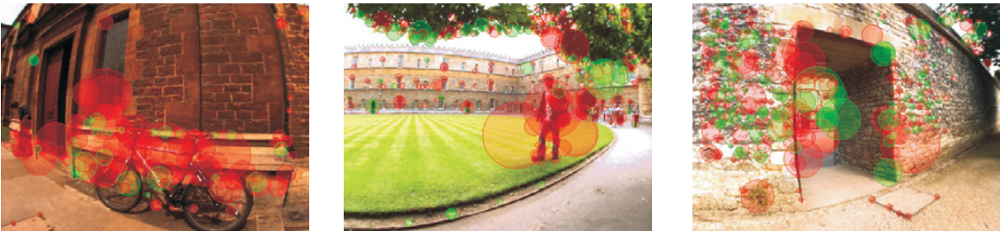
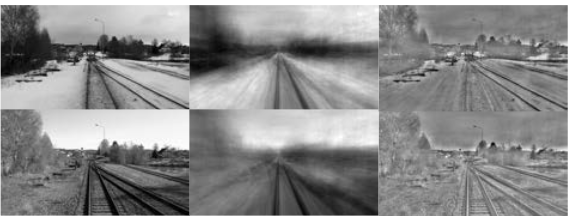

（分类存放，同类时间倒叙）

# 待分类

【Robust loop closing over time for pose graph SLAM ，IJRR2013】回环检测修正

【Visual Teach and Repeat for Long-Range Rover Autonomy，JFR2010】没有回环，局部子图串的利用

【Improving change detection using Vertical Surface Normal Histograms and Gaussian Mixture Models in structured environments，ICAR2013】使用图像视图来检测使用高斯混合模型(GMMs)的变化。由于gmm计算时间长，垂直表面正直方图提供了在搜索变化时被丢弃的主平面区域。变化检测是由两幅图像产生的高斯差来完成的。提出了一个基于2D激光雷达的框架，用于在之前的楼层平面图上进行长期室内定位。该系统结合了基于图的映射技术和贝叶斯滤波来检测环境中的显著变化。作者使用基于icp的扫描匹配来确定激光雷达扫描与轨迹位姿相对应的当前可观测环境的概率。该概率通过更新之前的节点来改进轨迹估计。

【A pose graph-based localization system for long-term navigation in CAD floor plans，RAS2019】提出了一个基于2D激光雷达的框架，用于在之前的楼层平面图上进行长期室内定位。该系统结合了基于图的映射技术和贝叶斯滤波来检测环境中的显著变化。作者使用基于icp的扫描匹配来确定激光雷达扫描与轨迹位姿相对应的当前可观测环境的概率。该概率通过更新之前的节点来改进轨迹估计。

【Concurrent map building and localization on indoor dynamic environments，IJPRAI2002】提出了一种处理传感器不精确和动态环境的地图定位方法。基于扩展卡尔曼滤波的方法结合了地图中地标强度的测量值。地图和场景之间的地标在每一步都是匹配的，地标强度也会更新。弱地标被修剪，新观测到的地标被添加。

【Towards lifelong visual maps，IROS2009】提出了一个利用立体相机输入的视觉映射系统。该方法构建并不断更新视图的度量图，以图的形式表示。

【Towards life-long visual localization using an efficient matching of binary sequences from images，ICRA2015】提出了一种利用图像二值序列进行终身视觉定位的方法。该方法基于图像序列而不是单一图像进行位置识别。利用全局LDP描述子提取特征，得到图像的二进制码。通过计算汉明距离，可以有效地匹配这些二进制描述符。

【Street-view change detection with deconvolutional networks，AR2018】室外，对街景图像进行结构变化检测。利用多传感器融合SLAM、深度反卷积网络和快速三维重建技术确定图像对之间的变化区域。

【Online probabilis- tic change detection in feature-based maps，ICRA2018】室外，提出了一个贝叶斯滤波器来建模道路和交通要素的特征持续性。单一特征和邻近特征信息被用来检测基于特征的地图的变化和估计特征的持久性。

【Robust visual localization across seasons，TRO2018】室外，季节变化，利用HOG特征和深度卷积网络将新获得的图像与独立于天气和季节条件的图像数据库进行比较和匹配。

【SIFT, SURF and seasons: Long-term outdoor localization using local features，ECMR2007】季节变化，中提出的方法比较了不同的SIFT和SURF特征检测器在基于外观的拓扑定位框架下的不同变化，全景图像捕捉季节变化。

【Feature co-occurrence maps: Appearance-based lo- calisation throughout the day，ICRA2013】季节变化，使用了来自局部特征的视觉词来确定给定查询图像的最佳候选图像。视觉词是由SIFT特征在一天或一年的不同时间在每个地点的共现建立的。利用空间词(特征之间的空间关系)来验证候选视觉词。

【Generative methods for long-term place recognition in dynamic scenes，IJCV2014】季节变化，使用了来自局部特征的视觉词来确定给定查询图像的最佳候选图像。视觉词是由SIFT特征在一天或一年的不同时间在每个地点的共现建立的。利用空间词(特征之间的空间关系)来验证候选视觉词。

【Learning visual feature descriptors for dynamic lighting conditions，IROS2014】室内，SURF特征被应用到训练图像中，以学习一个新的描述符，该描述符对室内和室外环境的变化更有鲁棒性。

【Experience-based navigation for long-term localisation，IJRR2013】室内，提出了一种基于经验的方法。观察结果与所有储存的经验相比较，并与最相似的经验相匹配。

【An adaptive appearance-based map for long-term topological localization of mobile robots，IROS2008；Appearance-based mapping and localization for mobile robots using a feature stability histogram，RAS2011】[28]和[29]的设计灵感来自阿特金森和Shiffrin人类记忆模型[30]。他们采用短期记忆(STM)和长期记忆(LTM)的概念来应对长期定位中不断变化的环境。在[28]中，STM和LTM被表示为有限状态机。每个新特性首先进入STM，需要反复检测才能移动到LTM。如果在连续访问同一地点时没有检测到特征，则从STM和LTM中删除。在[29]中，作者引入了一个特征稳定直方图(FSH)，通过一个投票方案来记录局部特征随时间的稳定性。这两种方法都使用自己的机制来更新各自的特性容器。在[28]中，只有LTM用于匹配。在[29]中，FSH内同时使用LTM和STM进行匹配，并考虑特征强度。这两种方法都使用全向图像进行实验，尽管算法似乎并不特别依赖于那种类型的图像。

上述许多算法都需要大量的计算学习过程和大量的训练数据[26]或3D地图重建的大量维护[8,17]，而其他方法则建立在时空关系上[24,25]。相反，本文提出的方法依赖于局部特征检测与匹配，可以在低成本的硬件平台上实时运行。它不需要任何数据匮乏、计算难度大的学习阶段，首先构建环境的初始地图，然后在机器人长期运行期间不断更新。不需要进一步假设周期性重复的变化，类似的速度机器人遵循给定的轨迹，等等。

【Semantic Graph Based Place Recognition for 3D Point Clouds，arxiv 2020】基于语义图的三维点云场景识别，创新地提出了语义图的表达方式，直接保留了原始点云的语义和拓扑信息，随后将场景识别建模为图匹配问题，利用提出的网络计算图间的相似度

【A survey of image semantics-based visual simultaneous localization and mapping Application-oriented solutions to autonomous navigation of mobile robots，IJARS2020，4区】Time-varying semantic map时变语义概念在它的开放问题里被提出

【An adaptive appearance-based map for long-term topological localization of mobile robots，IROS2008】【Appearance-based mapping and localization for mobile robots using a feature stability histogram，RAS2011】当点对不足时，增加特征点。

# 综述

【Visual Place Recognition: A Survey，TRO2016】在变化环境下，怎么描述、记住、识别这个环境是重要的三块；他认为语义上下文对场景识别有前景。

【Artificial Intelligence for Long-Term Robot Autonomy: A Survey，RAL2018】

【Vision-based topological mapping and localization methods: A survey，RAS2015】总结了SLAM各种描述子，方法

【Alterovitz R, Koenig S, Likhachev M. Robot planning in the real world: Research challenges and opportunities[J]. Ai Magazine, 2016, 37(2): 76-84.】

【The State of Lifelong Learning in Service Robots: Current Bottlenecks in Object Perception and Manipulation，JIRS2021】综述

# 特征提取匹配

一种是传统的人工提取的描述子，如SIFT、ORB描述子，因具有尺度和旋转不变性，在低动态的局部变化场景下具有一定的对抗环境变化的能力，但是面对长期的环境变化无能为力；另一类则是通过神经网络学习图像的深度特征如SuperPoint和匹配方法如superglue，以及GCN-SLAM，该类方法在对于季节和光照的变化，能够获得人工描述子难以达到的效果，【A Survey on Deep Learning for Localization and Mapping Towards the Age of Spatial Machine Intelligence】这些学习的技术依赖于从大量的数据集上来提取有意义的参数，并且很难推广到数据集类型之外的环境中，模型缺乏可解释性。此外，虽然高度可并行化，但它们通常比传统模型的计算成本更高。

【GCN-SLAM：基于神经网络提取的特征点和描述子的SLAM】仅把ORB-SLAM2的特征点和描述子换了，在一些特征不足的场景表现出优势，但是还很难实时运行。

# 多传感器

【On-Manifold Preintegration for Real-Time Visual--Inertial Odometry，Trans2017】可以参考其IMU预积分推导

## 1.视觉为主

### 结合轮速计

【VINS on wheels，ICRA2017】论证了VINS的退化运动以及加入轮式里程计因子后的改善，然后还推导了具体的轮式因子和平面约束因子的形式。

【DRE-SLAM: Dynamic RGB-D Encoder SLAM for a Differential-Drive Robot，Remote Sensing2019】RGB-D+轮速计紧耦合，语义识别动态特征并剔除。公开了代码和数据集。

【Visual-Odometric Localization and Mapping for Ground Vehicles Using SE(2)-XYZ Constraints，ICRA2019】

【Tightly-Coupled Monocular Visual-Odometric SLAM Using Wheels and a MEMS Gyroscope，IEEE Access2019】

## 2.激光为主

## 3.标定

【Gyro-Aided Camera-Odometer Online Calibration and Localization，ACC2017】

【Visual-Inertial-Wheel Odometry with Online Calibration，IROS2020】

【Online Temporal Calibration for Monocular Visual-Inertial Systems，秦通，IROS2018】

# 动态环境

【Episodic Non-Markov Localization:Reasoning About Short-Term and Long-Term Features，ICRA2014】我们引入了一种情景非马尔可夫定位算法，该算法保持了对机器人轨迹的信念估计，同时明确地推理从未映射的静态对象、移动对象以及静态地图中的对象中产生的观测及其相关性。观测可分为长期特征、短期特征和动态特征，分别对应于映射的对象、未映射的静态对象和未映射的动态对象。通过检测机器人轨迹上的时间步长，在这些时间步长之前未映射的观测与之后的观测无关，非马尔可夫定位限制了观测的历史，并对计算信念的事件进行估计。

变化检测问题是通过对观测的推理来处理的。根据长期、短期和动态特征对观测进行分类，分别对应映射的静态对象、未映射的静态对象和未映射的动态对象。短期特征产生对机器人轨迹信念的局部调整，而长期特征产生全局调整。

【Multiple Object Detection, Tracking and Long-Term Dynamics Learning in Large 3D Maps，TRO2018】机器人在室内环境中巡逻，通过变化检测和时间推理来检测活动物体。目标是确定环境中有多少可移动的物体，并跟踪它们的位置。采用Rao-Blackwellized粒子滤波和期望最大化算法对目标进行跟踪，并学习环境动力学参数。

【Toward Lifelong Object Segmentation from Change Detection in Dense RGB-D Maps，ECMR2013】使用完整的RGB-D视图来构建机器人世界的地图。通过计算连续视图之间的变化来发现对象(移动区域)并学习它们。

【利用条件随机场长期不变性的精准动态SLAM，TVCG，https://mp.weixin.qq.com/s/bftu_29F9PYB_91hTt5MXg】一般的动态SLAM处理中，大家大多都集中于仅在连续帧的短时间跨度内检测动态分量。这篇文章中，作者提供了一种更准确的动态3D地标检测方法，利用条件随机场（CRF）的长期不变性对多帧进行长期观测，进而估计初始的相机位姿。该方法使用图割RANSAC区分动态点和静态点。这些静态/动态标签被用作条件随机场中一元势的先验，从而进一步提高了冬天3D地标检测的准确性。文中使用了IMU和Bonn RGB-D动态数据集进行评估，结果明显高于现有方法，可在各种高度动态的环境中提供更准确的相机轨迹估计。

【Practice makes perfect? Managing and leveraging visual experiences for lifelong navigation，ICRA2012】【Simultaneous localization, mapping and moving object tracking，IJRR2007】动态物体移除

【Extended Rao-Blackwellised genetic algorithmic filter SLAM in dynamic environment with raw sensor measurement，IROS2007】【Towards object mapping in non-stationary environments with mobile robots，IROS2002】然而，经常有一些semstatic元素，它们不是明显地移动，而是随着时间的推移出现和消失。虽然这些元素可以作为不可靠的元素被简单地移除

【Mobile robot simultaneous localization and mapping in dynamic environments，AR2005】但也有可能这些元素在环境的特定部分的本地化中暂时有用，使用停车场建设的例子- - -荷兰国际集团(ing),在静态元素,如墙上可以很远,不独特,而semistatic停放的汽车很多,相对独特的,并且可以用于本地化数小时或一天,在被遗忘。如果是这种情况，则在机器人观察结果与提供的静态地图的预期结果不匹配时创建临时地图。当临时地图无法与机器人在多个连续时间步长的观察结果充分匹配时，就会被丢弃。

【Dynamic-SLAM:Semanticmonocularvisuallocalizationandmapping basedondeeplearningindynamicenvironment，RAS2019】动态元素剔除【Motion removal for reliable RGB-D SLAM in dynamic environments，RAS2018】动态元素剔除

【Remove, then Revert: Static Point cloud Map Construction using Multiresolution Range Images，IROS2020，https://mp.weixin.qq.com/s/SLi2bcY0BbeQFHOroXCBTQ】动态物体剔除，仅保留静态物体。【泡泡图灵智库】移除，然后还原：使用多分辨率图像构建静态点云地图

# 语义信息

【SSC: Semantic Scan Context for Large-Scale Place Recognition，arXiv，https://mp.weixin.qq.com/s/aGDzXOYdalSMHAjnWmrvsg】语义辅助点云的位置识别。

## 物体SLAM

object-centric ，object-oriented maps，Object-level data association，

2D bounding box，

instance-level models【slam++，Multi Robot Object-based SLAM】，category-specific models，general models【立方体cubeslam，Semantic Mapping for View-Invariant Relocalization，圆柱Constructing category-specific models for monocular object- slam，曲面Quadricslam】

【SLAM++: Simultaneous Localisation and Mapping at the Level of Objects，CVPR2013】仅限于与已知的物体模型库做匹配，物体和相机进行**联合优化**。

【Meaningful Maps With Object-Oriented Semantic Mapping，IROS2017】基于一个基于特征的RGB-D ORB SLAM2，基于图像的目标检测和3D无监督分割。**数据关联**通过形心欧氏距离筛选出一些候选物体，如果至少50%的3D点距离小于或等于2厘米，则检测与现有地标相关联，这个数据关联步骤通常需要大约30毫秒每一个检测地标对。

【Probabilistic Data Association for Semantic SLAM，ICRA2017】通过物体进行**数据关联**，惯性、几何、语义紧耦合，利用EM算法寻找观测地标之间的对应关系，把SLAM拆分为连续的位姿估计问题和离散的物体语义关联问题，可以在重复纹理，包括重复物体的场景改善**回环检测**。

【CubeSLAM: Monocular 3-D Object SLAM，TRO2019】提出基于单个图像进行3D长方体物体检测，以及动静环境下多视角物体的SLAM，物体可以提供约束提升相机位姿估计和减少单目尺度漂移，**联合优化**。**数据关联**通过将2-D object bounding box特征点的匹配进行数据关联，如果匹配到的特征点数量>10并且两个物体的空间距离<1m就认为是同一个物体，

【QuadricSLAM: Dual Quadrics From Object Detections as Landmarks in Object-Oriented SLAM，RAL2019】通过2维的目标检测估计物体的三维的二次曲面。物体和相机进行**联合优化**

【Recovering stable scale in monocular slam using object-supplemented bundle adjustment，TRO2018】物体和相机进行**联合优化**。

【Monocular Object and Plane SLAM in Structured Environments，RAL2019】单目的稠密建图，面向物体和平面，可以提升相机pos估计，**联合优化**。**数据关联**遵循CubeSLAM。基本上，每个对象都包含一组属于它的特征点，然后我们可以找到在不同视图中共享地图点数量最多的匹配对象。（它只在这里提了一下，在其他地方没有任何说明）该方法易于实现，可以有效地处理遮挡、重复纹理和动态运动。

【EM-Fusion: Dynamic Object-Level SLAMWith Probabilistic Data Association，ICCV2019】基于RGB-D图像获取剔除动态物体的物体级地图。**数据关联**进一步利用EM算法拓展了动态对象关联或语义密集重构的思路。

【Robust Object-based SLAM for High-speed Autonomous Navigation，IEEE2019】通过曲面来表征物体，**数据关联**通过色相饱和度直方图的相关性进行数据关联。

【Semantic Mapping for View-Invariant Relocalization，ICRA2019】基于物体SLAM实现视角变化下的**重定位**，**数据关联**把3Dbox往二维图像上投影，使用匈利亚算法进行匹配。

【Global Localization with Object-Level Semantics and Topology，ICRA2019】基于物体稠密地图的**重定位**在动态或者图像序列不完整的情况下，**数据关联**用共享描述符表示物体之间的拓扑关系，共享描述符数量最大的对象视为同一实例。

【RGB-D Object SLAM Using Quadrics for Indoor Environments，Sensors2020】同样是曲面表示物体，不同的是他利用RGB-D，这可以减少观察的次数，降低对观察角度变化的要求。在二次曲面模型中引入非参数位姿图来解决后端语义**数据关联**问题

【BundleTrack: 6D Pose Tracking for Novel Objects without Instance or Category-Level 3D Models，IROS2021】将具有记忆功能的位姿图优化引入到物体姿态的跟踪中，缺点是只能10hz，因为位姿图优化需要庞大的计算量。语义分割和特征提取都是**深度学习**方法

【EAO-SLAM: Monocular Semi-Dense Object SLAM Based on Ensemble Data Association，IROS2020】物体**数据关联**+位姿估计，用于**位姿联合优化**，For objects with regular shapes，他把数据关联分为基于概率的方法和基于追踪的方法，

【Slam with objects using a nonparametric pose graph，IROS2016】首次提出用非参数检验的方法进行**数据关联**，【Localization of classified objects in slam using nonparametric statistics and clustering，IROS2018】证明了该方法的有效性，【EAO】进一步将参数化和非参数化结合起来。

【Volumetric Instance-Aware Semantic Mapping and 3D Object Discovery，RAL2019】通过RGB-D相机构建稠密的全场景的物体级地图，首先对RGB图像做全景分割，并对不认识的对象做了处理，然后对每一帧做数据关联。为每个对象映射一个持久的标签，根据语义标签的相似性进行**数据关联**。

【Deep-SLAM++: Object-level RGBD SLAM based on class-specific deep shape priors，arXiv2021】物体级RGBD SLAM，使用目标检测器来加载和注册完整的CAD模型并扩展到具有未知对象的环境中，使用现代化的基于特定类别的**神经网络生成完整的模型**几何方案。**数据关联**将每个检测到的边界框内的深度点从前5帧转换为当前帧，我们检查它们是否在当前帧的边界框中结束，在此基础上，我们评估在整个转换点集上集成的最接近点误差，作为一个不同的度量。根据度量误差，得到冗余的匹配，如果这些候选之间有足够的共识，我们接受关联。如果当前帧中检测到的物体无法匹配，我们将从中初始化一个新模型。请注意，仅当边界框与图像边界的间距足够大时，才会添加新模型。

【Box-Aware Feature Enhancement for Single Object Tracking on Point Cloud，ICCV2021】提出了 BoxCloud，**数据关联**使用点对框关系（the point-to-box relation）来描绘对象。具体是考虑到物体的形状和尺寸信息对物体点云进行编码，来进行可靠的特征匹配和嵌入。也用到P2B深度学习的方法

【Panoptic 3D Mapping and Object Pose Estimation Using Adaptively Weighted Semantic Information，RAL2020】通过RGB-D相机重建高度详细的目标级模型和估计6D位姿的目标，**深度学习**

【3D-SIS: 3D Semantic Instance Segmentation of RGB-D Scans，CVPR2019】端到端的二维-三维特征联合学习方法。使用的特征包括RGB色彩和几何信息。目标是针对三维扫描的物体进行边界确定和语义个体分割。

【Semantic SLAM with Autonomous Object-Level Data Association，ICRA2021】基于词袋算法的新的对象级**数据关联**算法，将其表述为最大加权二分匹配问题，可以参考这个数学符号表示

# 长期自治

## 变化检测

【An adaptive appearance-based map for long-term topological localization of mobile robots，IROS2008】提出了一种利用长时记忆和短时记忆概念，以全方位视觉为外部传感器，为移动机器人的长期外观定位建立自适应地图的方法。

【Appearance-based mapping and localization for mobile robots using a feature stability histogram,RAS2011】他们采用短期记忆（STM）和长期记忆（LTM）的概念来处理长期定位中的变化环境。在文献[29]中，作者介绍了一个特征稳定性直方图（FSH），通过投票方案记录了局部特征随时间的稳定性。

【Change detection using weighted features for image-based localization，RAS2021】该方法与【An adaptive appearance-based map for long-term topological localization of mobile robots，IROS2008】最接近，这是因为该方法具有相当的相对模拟性。然而，我们并不使用短期记忆和长期记忆的概念。相反，我们为特性分配权重，以获取它们的稳定性和重要性。特征权重按特征描述符的相似度进行更新，比[28]更平滑地捕获特征的重要性。

在[28]中，STM和LTM被表示为有限状态机。每个新特征首先进入STM，需要重复检测才能被移到LTM。如果在连续访问同一地点时没有检测到特征，则从STM和LTM中删除。在文献[29]中，作者介绍了一个特征稳定性直方图（FSH），通过投票方案记录了局部特征随时间的稳定性。这两种方法都采用自己的机制来更新各自的特征容器。在[28]中，只有LTM被用于匹配。在[29]中，LTM和STM都被用于FSH中的匹配，并且考虑了特征强度。这两种方法都使用全向图像进行实验，尽管这些算法似乎并不特别依赖于这种类型的图像。

【Toward Lifelong Object Segmentation from Change Detection in Dense RGB-D Maps，2013，欧洲机器人会议】完整的RGB-D视图被用来建立一个机器人世界的地图。连续视图之间的变化被计算出来，以发现对象(移动的区域)并学习它们。

【ETH Library TSDF-based change detection for consistent long-term dense reconstruction and dynamic object discovery，ICRA2017】截断符号距离函数（TSDF）网格和环境的三维重建被保持。新的观察结果与以前的观察结果相一致，并包括在新的重建中。新的重建与之前的重建进行比较，以确定两个重建之间的动态两种重建之间的群集。

【Improving change detection using Vertical Surface Normal Histograms and Gaussian Mixture Models in structured environments，ICAR2013】图像视图在[11]中使用高斯混合模型来检测变化（GMMs)。由于GMMs的计算时间较长，垂直表面法线直方图提供了主要的平面区域，在搜索变化时被丢弃。变化检测是以两幅图像产生的高斯数差异来完成的。

【Reliable real-time change detection and mapping for 3D LiDARs，SSRR2017】来自激光雷达的点云与[12]中基于八角形的占用图进行比较，以获得一组变化。使用Mahalanobis距离计算变化候选者，并进行过滤以消除异常值。

【A pose graph-based localization system for long-term navigation in CAD floor plans，RAS2019】有学者在[13]中提出了一个基于二维的框架，用于在先前的平面图上进行长期的室内定位。该系统结合了基于图形的测绘技术和贝叶斯滤波技术来检测环境中的重大变化。作者使用基于ICP的扫描匹配来确定与轨迹姿势相关的雷达扫描与当前可观察到的环境相一致的概率。这个概率被用来通过更新之前的节点来改善轨迹估计。

【Street-view change detection with deconvolutional networks，AR2018】在[17]中进行了来自街景图像的结构变化检测。多传感器融合的SLAM、深度解卷积网络和快速三维重建被用来确定成对图像之间的变化区域。

【Online probabilis- tic change detection in feature-based maps，ICRA2018】在[18]中，提出了一个贝叶斯滤波器来模拟道路和交通元素的特征持久性。单一特征和相邻特征信息被用来检测基于特征的地图的变化并估计特征的持久性。

【LiDAR Inertial Odometry Aided Robust LiDAR Localization System in Changing City Scenes，ICRA2020，https://mp.weixin.qq.com/s/FjrHONsJwgjKpF-Jw_7iIQ】变化检测，地图更新。动态变化城市场景中的LiDAR惯性里程计辅助的鲁棒定位系统，

## 重识别

【Feature Co-occurrence Maps: Appearance-based Localisation Throughout the Day，ICRA2013】基于词袋模型，考虑特征的显著性和可靠性

//【Towards Robust Night and Day Place Recognition using Visible and Thermal Imaging，RSS2012】结合了热图像

【Visual Localization in Highly Crowded Urban Environments，IROS2013】基于词袋模型，在拥挤的城市街道环境下，特征权重，有用的特征？

【Generative Methods for Long-Term Place Recognition in Dynamic Scenes，IJCV2014】基于词袋模型，又考虑了数据点的方差和均值

【Towards illumination in- variance for visual localization，ICRA2013】认为同一个地方会出现周期性变化（昼夜交替，司机交替），有必要对同一个地方保留多种情况下的描述

【Experimental analysis of sample-based maps for long-term SLAM，IJRR2009】其中一些地图代表短期记忆，经常更新，而另一些类似于长期记忆，在几小时、几天或几周内都不会更新。保持地图在不同的时间尺度上更新，可以确保旧的地图数据不会立即被环境中的临时变化所覆盖。相反，静态元素会随着时间的推移而增强，而暂时的事件则会被过滤掉。通过选择最适合当前传感器数据的局部地图来实现位置识别

一类方法【】认为通过诸如光流、多视图几何、RANSAC、重投影误差等方法识别出当时图像帧间的动态变化区域，从而避免使用该区域进行数据关联，这对于在较短图像序列中的动态环境下建立一个精度较高的地图是有利的，但对于长期的环境变化，包括视线外的物体的挪动、有无和替换，这对机器人定位是不利的，还没有一套可靠地方案应对。而且这部分剔除的信息对于长期的定位时的特征选择是没有意义的，这部分信息还没有得到应用。

【Accurate Dynamic SLAM using CRF-based Long-term Consistency，TVCG2020】GC-RANSAC做为区分动静目标的先验，LC-CRF长期一致性条件随机场进一步提升动静点云分类效果（相当于邻域滤波）

【Robust Dense Mapping for Large-Scale Dynamic Environments，ICRA2018】光流

【DS-SLAM: A Semantic Visual SLAM towards Dynamic Environments，IROS2018】光流运动一致性检测，投影点距离基线距离阈值

【Episodic Non-Markov Localization: Reasoning About Short-Term and Long-Term Features，ICRA2014】基于重投影误差的长期短期特征选择

一类方法【】认为通过目标检测技术，把可能是动态的物体（没有给出具体的选择依据）删除掉，建立一个干净的地图，这样有利于避免下次地图使用时这些物体改变带来的影响，但是，不加区分的丢掉了他们的信息，我认为是不合理的。

【Improving Vehicle Localization Using Semantic and Pole-Like Landmarks】树木和路灯作为更鲁棒的地标。

【Dynamic Body VSLAM with Semantic Constraints，IROS2015】利用语义识别动态目标，并提供约束进行SLAM，它只映射环境中的静止物体，而不映射场景中的动态物体，从而提高了定位性能。基于视差和计算光流，实现了语义运动的分割。

【Detect-SLAM: Making Object Detection and SLAM Mutually Beneficial，WACV2018】本文的贡献在于：通过目标检测去除动态点，但是为了使得目标检测线程和slam线程同步，没有对每一帧进行检测，而是只在关键帧进行检测，然后通过特征匹配和扩展影响区域的形式进行运动概率的传播，然后在slam过程中去除动态点的影响，只利用静态点进行跟踪。另外，slam过程中构建的地图能够提高目标检测的结果。

## 语义分割

【SalientDSO: Bringing Attention to Direct Sparse Odometry，Trans2018】使用视觉显著性（SalGAN网络）和场景解析（PSPNet进行获取语义分割）来驱动直接VO特征选择，认为显著性区域的点对于光照和视角的变化更加鲁棒。

【Utilizing Semantic Visual Landmarks for Precise Vehicle Navigation，ITSC2017】本文的思路比较简单，在因子图中增加了一个门限信号c，如果该类别有效，则对应的观测数据lt就添加到因子图中，否则不添加。本文认为无效的类别为：non-static (such as Pedestrian, Vehicle, Bike) and far-away classes (such as Sky)

【Stereo Vision-based Semantic 3D Object and Ego-motion Tracking for Autonomous Driving—ECCV2018】本文出自港科大的沈劭劼团队，同样基于自动驾驶的背景研究动态环境下的slam问题，利用Faster R-CNN在双目的左图上进行目标检测，利用视点分类的方法扩展出物体的3D检测框，然后将语义信息融合到一个统一的优化求解框架中。

【Long-term Visual Localization using Semantically Segmented Images—ICRA2018】本文解决的问题是在已有的3D地图上进行定位，传统方法是基于特征匹配进行的，但是在自动驾驶的应用场景下，当前检测的特征和保存的地图特征一般具有很大的时间跨度，而普通的特征不具有鲁棒性，所以本文提出了一种依赖于语义标签和3D位置的定位算法。

## 多种方法的结合

【DynaSLAM: Tracking, Mapping, and Inpainting in Dynamic Scenes，RAL2018】多视角几何 语义分割

【DS-SLAM: A Semantic Visual SLAM towards Dynamic Environments，IROS2018】本文采用语义分割和运动一致性检测结合的形式进行动态点的去除，并没有用到语义分割的类别，只是用语义分割得到一个物体的边界，无论该物体类别是什么，只要有经过运动检测判定为动态的点位于该物体内，即去除该物体的所有点，但实际上该论文的代码里值针对人这一类物体进行检测。

【Semantic segmentation–aided visual odometry for urban autonomous driving—IJARS2017】本文将直接法和特征点法结合，并引入语义信息减少动态物体的影响。通过计算相邻帧间某类物体的所有像素的总投影误差为每类物体赋予不同的权重，这个权重作为RANSAC选择点的权重，由于静态物体的投影误差小，所以更倾向于被选择。

【DynaSLAM: Tracking, Mapping and Inpainting in Dynamic Scenes,RAL2018】多视图几何+语义分割，剔除运动物体，背景补全

【Network Uncertainty Informed Semantic Feature Selection for Visual SLAM，2019】提出SIVO方法，在长期的定位中，将语义分割和神经网络不确定性引入到特征选择过程中。多次别检测位静态的地标置信度越高。基于ORB-SLAM2做特征选择，减少了地图空间（精度降低了）。

## 其它方法

【LT-Mapper: A Modular Framework for LiDAR-Based Lifelong Mapping，ICRA2022】是韩国科学院开源的，它解决了地图构建和维护过程中环境变化的问题。 该方法提出了一种模块化的基于激光雷达的终身地图构建和维护框架。 该工作中的多时相SLAM系统可以处理轨迹文件中潜在的误差，因此变化检测并不需要精准初始对齐。它还实现了大尺度点云地图自动物体分离处理。其变化管理机制可以在内存和计算方面保持高效，比如增量地图相比于维护整个会话节省了60%的内存。在时间跨度一年半的数据集上验证，效果杠杠的！ 代码：[GitHub - gisbi-kim/lt-mapper: A Modular Framework ...](https://github.com/gisbi-kim/lt-mapper)

【Information-based Reduced Landmark SLAM，ICRA2015】基于信息论的特征选择

【Visual SLAM with Network Uncertainty Informed Feature Selection】使用信息熵判断观测数据是否用于更新估计的状态量，如果在新观测数据下待估计变量的协方差的秩相比之前数据条件下待估计变量的协方差的秩是否下降了一定阈值，是则选择该观测数据（特征点）参与跟踪和优化，本文在此基础上将语义分割的不确定性融入到信息熵的计算中

**有选择的剔除：**

当他们运动的时候固然很好的剔除了噪声，但是对于静止的人和车剔除了算不算浪费信息。

【Semantic Monocular SLAM for Highly Dynamic Environments，IROS2018】大多数语义用于动态slam都是将所有潜在运动的物体的点直接去除，但是例如停靠的车等并没有发生运动，如果运动的物体占据相机视角的大部分，那么将车上的点都去除会对位姿估计产生很严重的错误，另外，本文提到一种场景，当车停在信号灯前面时是静止的，但是随着时间的推移，车会慢慢开始运动，所以本文提出对地图点的静态率（inlier ratio）进行估计，能够实现地图点在静态和动态状态之间的平滑过渡。

## 重识别

【FAB-MAP: Probabilistic Localization and Mapping in the Space of Appearance，IJRR2008】一种基于外观的位置识别问题的概率方法，具体来说是考虑到了词袋单词在具体场景下的联系，适用于机器人的闭环检测，相比之前的算法实现了线性的复杂度。

【FAB-MAP 3D: Topological Mapping with Spatial and Visual Appearance，ICRA2010】推广到了3维

【Unsupervised Online Learning of Condition-Invariant Images for Place Recognition，ICRA2014】提出了一种用于变化环境下位置识别的无监督学习方法。该系统识别并删除了在环境中广泛存在的每一个观察结果。去除常见的固化元素降低了广泛的位置识别失败的风险，并增加了位置描述的稳定性。

**利用上下文序列信息匹配**

【Visual Place Recognition: A Survey，TRO2016】

在不断变化的环境中进行位置识别的一个因素是，拓扑信息变得更加重要，因为传入的传感器数据变得更不可靠，更难以与以前的观测相匹配[118]，[119]。已经观察到，匹配图像序列而不是单个图像可以提高总体上的位置识别，特别是在不断变化的环境[14]，[84]，[118]，[147]。在不断变化的环境中进行位置识别，受益于利用系统不只是通过特定的位置，而是通过环境中相同或非常相似的路径的假设。SeqSLAM[118]使用图像序列在特别具有挑战性的环境中进行位置识别。原始版本假设遍历之间的速度剖面相似，而改进版本通过图像相似度矩阵搜索非线性路径和线性路径[102]或使用里程计输入对信号进行线性化[148]。Liu和Zhang[236]使用粒子滤波器提高了穷尽搜索过程的计算效率，在100%精度下实现了10倍的加速因子和等效性能。

Naseer等人[119]利用序列信息，将图像匹配作为成本最小的流程。流网络是具有源节点和汇聚节点的有向图，用于基于路径的位置识别，分别表示遍历的开始和结束。该公式将图像比较值等价于流量成本，通过环境找到最优序列。通过允许匹配或隐藏节点来处理不同的速度剖面。类似地，Hansen和Browning[237]使用隐马尔可夫模型使用维特比算法确定通过环境的最可能路径。

# 地图相关

## **分层地图**

**（区别于同一个位置多种状态下的表示）**

【SOMA: A Framework for Understanding Change in Everyday Environments Using Semantic Object Maps，AAAI2018】一个服务机器人被部署在各种室内环境中，主要是一个分层的环境地图，通过比较当前的目标检测和映射的目标，考虑到目标位置的变化。

【Persistent Navigation and Mapping using a Biologically Inspired SLAM System，IJRR2010】不断变化的环境需要对每个位置进行多重表示。如果是这种情况，系统可以根据其当前的传感器数据选择最佳地图【Superpixel-based appearance change prediction for long-term navigation across seasons，RAS2014】或者尝试预测最可能匹配

【Temporary Maps Maps for Robust Localisation in Semi-static environments，IROS2010】地点识别系统可以并行运行多个假设。

【Experience-based navigation for long-term localisation，IJRR2013】为每个保存的体验分配自己的定位器，报告机器人是否成功地在该环境中进行了定位，而Morris等人[An adaptive appearance-based map for long-term topological localization of mobile robots，IROS2008]则对可能的地图配置以及可能的机器人姿态进行了过滤。系统不是选择与当前传感器数据最匹配的单一地图，而是主动地在多个地图中跟踪N个最佳导航假设，而当一个主动假设低于最佳悬而未决的假设时，悬而未决的假设将被保留和替换。据报道，在一个室内办公室实验中，使用多个地图假设可以减少高达80%的平均路径误差。

保留每个位置的多个表示增加了位置识别的搜索空间，但会降低效率，除非只有表示的子集用于比较。由于在相似时间捕获的观测结果往往显示出相似的外观特征，因此可以根据系统当前的定位信念，概率地选择未来潜在的匹配对象。Carlevaris-Bianco和Eustice[234]用一个Chow-Liu树在短时间内“共同观察”两个位置样本的可能性，而Linegar等人[235]使用“路径记忆”选择过去的经验作为候选匹配，在不增加计算时间的情况下提高位置识别

根据机器人执行任务的层次，可以把地图的形式分为2D的导航图，3D的导航图，语义交互地图。以高级环境感知为特征的语义SLAM，在应对长期的环境变化具有优势。比如利用语义信息进行特征选择，以及利用语义信息对视角，光照等环境变化不敏感性进行辅助定位。

## 地图表达

在道路上评估车辆可以，道路上也不只有车辆，室内可没有那么多刚体恒速运动，也经常不是视线内的变化

【SLAM++: Simultaneous Localisation and Mapping at the Level of Objects Renato，CVPR2013】自定义，模型库的SLAM

【Meaningful Maps With Object-Oriented Semantic Mapping，IROS2017】基于SLAM++添加语义

【Leveraging Stereo-Camera Data for Real-Time Dynamic Obstacle Detection and Tracking，ICRA2020】轻量级的动态物体和行人检测跟踪；

一类进一步分类抽象，精细化处理

【3D scene graph: A structure for unified semantics, 3D space, and camera，ICCV2019】

【3-D Scene Graph: A Sparse and Semantic Representation of Physical Environments for Intelligent Agents，Trans2020】

这两篇第一次开始有层次的表达环境，但只考虑的静态的环境

【3D Dynamic Scene Graphs: Actionable Spatial Perception with Places, Objects, and Humans，RSS2020】提出构建动态场景图，分为5个层级，面向地点、物体、人类

一类是2D的栅格地图，对于地面的机器人导航是有效的，但是地图中并不包含机器人与场景进行交互的信息。

一类是从稠密或半稠密的点云地图中生成八叉树等地图，便于机器人包括无人机等进行在3维空间的导航规划，但是仍然缺乏语义信息，最重要的是还没一个可供机器人长期部署的地图。

【RoadMap: A Light-Weight Semantic Map for Visual Localization towards Autonomous Driving，ICRA2021，https://mp.weixin.qq.com/s/v5ss1-dzPfuGrNuWTS0LSg】我们提出了一种轻量级的定位解决方案，它依赖于低成本的相机和紧凑的视觉语义地图。地图可以由众包的方式利用传感器丰富的车辆进行制作和更新。具体来说，地图由几个语义元素组成，如路面上的车道线、人行横道、地面标志和停车线。我们介绍了车辆建图、云上维护和用户端本地化的整体框架。地图数据在车辆上进行采集和预处理，然后，将众包数据上传到云服务器。来自众多车辆的海量数据在云上进行合并，实现语义地图的及时更新。最后，将语义地图压缩并分发到量产车辆，量产车辆使用该地图进行定位。

## 地图更新

【An adaptive appearance-based map for long-term topological localization of mobile robots，IROS2008】讨论了哪些该被记住，哪些该被遗忘。维护同一环境的多个地图的系统也可以只在必要时添加新的地图配置，而不是按照预先设定的时间框架。

【Experimental analysis of sample-based maps for long-term SLAM，IJRR2009】指出，并不是每个地方都需要多个表示，某些区域(如门道)可能比环境的其他部分表现出更多变化。这些区域可能只具有一些关键配置，例如，一扇门可能是打开的或关闭的，因此可以使用有限数量的子映射充分准确地描述世界。观察到动态活动的每个区域都从子地图的其余部分中分割出来。利用模糊k-均值聚类和贝叶斯信息准则确定该区域典型配置的最优数量。使用子映射来隔离动态区域允许在必要时进行多个环境配置，同时保持映射的可管理性。

【Feature co-occurrence maps: Appearance-based localisation throughout the day，ICRA2013】使用了在14:00到22:00之间，在一个基于20公里城市道路的数据集上进行的五次训练中生成的特征共出现地图。然后可以在同一路线上实现本地化，有时在五次运行之间插入。

【Scene signatures: Localised and point-less features for localisation，RSS2014】通过在一个环境中进行多次训练来学习场景签名——一个地方的局部独特元素，在外观变化中也保持稳定。对于环境中的每个位置，我们都选择了图像补丁，以特别地展示这两种特性

【Temporary Maps Maps for Robust Localisation in Semi-static environments，IROS2010】如果假定环境的出现受到一系列隐藏的周期过程的影响，谱分析，如傅里叶分析，可以用来预测最可能出现的位置，从多个训练通过在未来的特定时间。在一个环境中学习并建模了这些过程，并证明了这些信息可以在3个月后进行定位时将位置识别错误的数量减半。

【Experience-based navigation for long-term localisation，IJRR2013】上面描述的所有系统都有一个基本假设，即机器人知道它在哪里可以很好地将同一位置的不同表示匹配在一起，即使这些表示在视觉上是不一样的。如果系统不知道要更新的位置，则无法更新地图，而且在不断变化的环境中，可能无法知道机器人的确切位置。为了避免这种假设，邱吉尔和纽曼提出了一个塑料地图配方，明确定位于机器人体验而不是物理位置。每次机器人访问一个它无法识别的位置时，都会产生一种新的体验，地图可能会隐式地对每个位置有多个表示，这取决于该特定位置的匹配难度(见图8)。然而，与前面讨论的系统不同，多个表示不一定会链接在一起作为相同的物理位置。如果系统能够识别并将更多的经验联系在一起，那么塑料地图的信息量就会更大。无论如何，这是一种实用的方法，允许优雅的地方识别失败，而不会发生灾难性的地图崩溃。 

【TSDF-based change detection for consistent long-term dense reconstruction and dynamic object discovery，ICRA2017】维护了截断符号距离函数(TSDF)网格和环境的三维重建。新的观测结果与以前的观测结果一致，并包含在新的重建中。将新的重构与之前的重构进行比较，以识别两个重构之间的动态簇。

## 地图管理

【Map Management Approach for SLAM in Large-Scale Indoor and Outdoor Areas，ICRA2020】2维地图和拓扑地图（这个拓扑图是拼接模块的的拓扑结构），通过地图拼接实现模块化地图管理。

【Dynamic Pose Graph SLAM: Long-term Mapping in Low Dynamic Environments，IROS2012】环境一共有三种分类：1.如建筑物之类的不动的物体；2.如人一样一直在动的物体；3.如家具等偶尔动一动，在某一次导航时长内，大多数时候不动的物体。动态的物体，他给了几篇参考文献告诉我们怎么过滤，本文主要讲半静态物体的建模。他的模型中包含active map和dynamic map，前者是只包含当前正确信息的map，而后者是包含所有历史变化信息的map。

【Temporary Maps for Robust Localization in Semi-static Environments，IROS2010】将物体分为了三类，静态，半静态，动态

【Practice Makes Perfect? Managing and Leveraging Visual Experiences for Lifelong Navigation，ICRA2012】提出了一个叫做经验的概念，意思是对同一个地方多次观测都被叫做经验。反复经过几个地方就是在积累经验。

【Towards Lifelong Visual Maps，IROS2009】其一是提出了一套lifelong mapping的框架，能够进行地图缝合和修补，重定位，删除地图以保持效率。其二就是他这个删除的方法非常秀，有利于重定位。在一个完全静态的场景中，一个视图将继续匹配它之后的所有视图。在一个有一些小变化的静态场景中(例如，盘子或椅子被移动)，随着时间的推移，匹配分数会慢慢下降，在静态区域的特征分数会稳定下来。如果出现了较大的突然变化(例如，移动了一张较大的海报)，那么匹配分数就会出现较大的下降。有些重复的变化，比如门的打开和关闭，会导致响应图中偶尔出现峰值。最后，一个常见的现象是临时视图，这是由于动态对象(如person)几乎完全遮挡而导致的。

# 滤波理论

# 优化理论

# 数据集

【University of Michigan North Campus Long-Term Vision and Lidar Dataset，IJRR2010】

