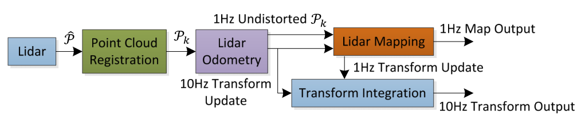
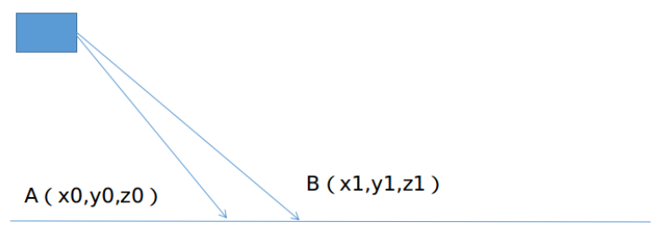
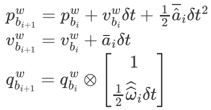

# 一 、多传感器融合基础知识

slam领域中的多传感器融合简单来说就是融合多个传感器的数据来获得更准确的定位信息和建图结果 。

## 1.1 传感器类型和特点

跟slam相关的传感器有相机，激光雷达，GPS，轮速⾥程记，惯性测量单元（IMU）等。这些传感器基本上是⾃动驾驶⻋辆必备的传感器。

| 传感器     | 优点 | 缺点 |
| :--------:| :--- | :--- |
| **相机**   | 优点是便宜，轻量，包含信息丰富，可以参照⼈眼，⼈⼯智能的巅峰估计就是只利⽤相机可以在任何场景下实现实时建图、定位、图像分割、⽬标检测和分类、导航、避障等等⾼级功能。 | 就是现有的通⽤的视觉slam技术依赖图像的纹理来进⾏特征点的提取，没有纹理或者⿊夜图像就很难被很好的利⽤起来，其次，图像中缺乏3d信息，通常建模slam问题需要同时优化位姿和地图点，这给优化问题的计算和精度带来了挑战，另⼀⽅⾯，单⽬图像缺乏尺度信息。 |
| **激光雷达** | 包含了3d信息，探测距离远，同时不受光照条件和环境纹理等影响。 | ⼏何特点会在部分场景下如⻓⾛廊，空旷的草原等失效，同时价格昂贵，当然16线的已经降价很多了，但是⾃动驾驶的乘⽤⻋基本不可能使⽤这么低线束的激光雷达，改装成本⾼，算法上限有限。 |
| **GNSS**   | 提供全局定位信息，如果在卫星信号好同时附近有基站的情况下，配合RTK（实时动态差分技术）可以实现厘⽶级定位，不受光照以及环境⼏何特征的影响 | 基站作⽤范围有限，部署成本⾼，同时城市内容易发⽣多路径效应，定位结果不稳定，地下等场景完全没⽤ |
| **轮速里程计** | 可以提供⽐较准确的⻋轮信息，对⼀定时间内的状态变化估计有⾮常好的作⽤，同时提供了尺度信息 | 基本只是⼀个2d运动模型，如果打滑，算法就受影响，同时⽆法进⾏全局定位。 |
| **IMU**    | 对⼀段时间的运动状态尤其是旋转有着⽐较好的估计，可以感受到重⼒，使得roll和pitch全局能观，不受任何环境因素的影响。 | 缺点是积分轨迹时间⼀⻓容易发散，重⼒估计不正确会使得平移的估计偏差较⼤。 |

## 1.2 多传感器融合的方向

根据主传感器的类型分别视觉为主的⽅案以及激光为主的⽅案，由于视觉激光两个传感器的关联性以及互补性有限，因此这两种传感器紧耦合的⽅案并不多，⽐较多的⽅案要么以激光为主，要么以视觉为主同时融合其他传感器的⽅案。

视觉slam⽅向：常⻅的⽅式是⼀个视觉特征点前端（当然还有基于直接法的前端，如DSO），通过光流或者描述⼦建⽴不同帧特征点之间的关联，后端根据前端特征关联的结果和其他传感器数据进⾏融合，根据融合的⽅式分为基于优化的后端（ORBSLAM2、3, VINS-MONO，VINS-FUSION）以及基于滤波的后端（MSCKF），视觉通常会提供⼀个重投影误差作为约束或者更新量。

激光slam⽅向：⽬前性能最好使⽤最⼴的激光slam⽅案是基于LOAM的系列⽅案，LOAM主要是为多线激光雷达设计的lidar定位和建图的⽅案，当然，由于现在其他⼀些lidar硬件的推出，⼀些LOAM的改进版本也是适当推出，如（Livox LOAM）。
基于LOAM⽅案通常前端是对当前帧激光雷达提取特征（通常是⾯特征和线征），通常后端结合其他传感器信息给当前帧到地图中的匹配提供⼀个良好的初值（激光slam中最重要的事情就是给scan matching提供⼀个更准确的init guess）。

激光雷达相⽐图像有着对光照、纹理不敏感的优点，激光雷达地图相⽐通⽤的视觉特征点+描述⼦地图有着更好的稳定性，在安全性⾄上的⾃动驾驶领域，激光雷达⽅案⽐视觉⽅案鲁棒性更优，⼏乎所有L4级别的⾃动驾驶解决⽅案都会带有激光雷达（像特斯拉这样的纯视觉⽅案应⽤并不多），因此，从实⽤性上来讲，激光雷达有着视觉难以⽐拟的优点。

## 1.3 常见的多传感器融合方案


|      方案      | 优点/特点                                                    | 缺点                                                         |
| :------------: | ------------------------------------------------------------ | ------------------------------------------------------------ |
| LOAM（A-LOAM） | ⾮常经典的激光⾥程记和建图⽅案，也是其他LOAM⽅案的⿐祖，LOAM只基于激光雷达（可选IMU），通过把SLAM拆分成⼀个⾼频低精的前端以及⼀个低频⾼精的后端来实现lidar⾥程记的实时性（这⼀点和PTAM以来的视觉slam将tracking和mapping分为两个线程有异曲同⼯之妙）。  新颖的特征提取方式（边缘点和平面点） 运动补偿（时间戳） 融合了scan-to-scan（odometry）和map-to-map（mapping）的思想。 | 1、没有后端优化（年代）<br />2、不能处理大规模的旋转变换（旋转向量的求解） |
|   LeGO-LOAM    | 在原有LOAM基础上，在前端增加了地⾯点提取，并且根据嵌⼊式平台的计算特点，将前端做的更加轻量级，以便于在算⼒有限的平台上可以实时运⾏，后端将其使⽤slam中关键帧的定义进⾏重构，同时增加回环检测和回环位姿图优化，使得地图的全局⼀致性更优。<br />1、利⽤⻋载激光⼤多⽔平安装的特征，提取出地⾯点 <br />2、使⽤聚类算法，使得前端特征更为⼲净 <br />3、前端使⽤两步优化⽅法，减少运算负载，使其在嵌⼊式平台上也能运⾏<br />4、后端引⼊关键帧概念，同时加⼊了回环检测 |                                                              |
|    LIO-SAM     | 在LOAM基础上采⽤**紧耦合**的imu使⽤⽅式，放弃了帧间⾥程记作为前端⾥程记，⽽使⽤紧耦合后imu的预测值作为前端⾥程记，后端沿⽤LeGO-LOAM，同时加⼊了对GPS信号的适配，使得其全局⼀致性更出⾊。 |                                                              |
|    LVI-SAM     | 是⼀种Lidar、视觉、IMU三种传感器__紧耦合__的⾥程计框架，他是由两个独⽴的⾥程计（VINSMono以及LIO-SAM）融合⽽成，视觉⾥程计给激光⾥程计提供⾼频先验位姿，回环检测，⽽激光⾥程计给视觉⾥程计提供初始化的先验以及特征点深度信息。 |                                                              |


LeGO-LOAM在LOAM的基础上进⾏了⼀些改进，如 

1、利⽤⻋载激光⼤多⽔平安装的特征，提取出地⾯点 

2、使⽤聚类算法，使得前端特征更为⼲净 

3、前端使⽤两步优化⽅法，减少运算负载，使其在嵌⼊式平台上也能运⾏ 

4、后端引⼊关键帧概念，同时加⼊了回环检测

LIO-SAM在上述基础上的改进 

1、由于其⽀持⼿持设备，因此没有对地⾯点进⾏特殊处理 

2、紧耦合的lidar+IMU融合模块，使得其充分利⽤IMU的数据，对快速旋转等场景有着更好的鲁棒性 

3、融合GPS，使得全局地图可以在没有回环的情况下有着更好的全局⼀致性 

4、易于扩展的框架，⽅便我们将其他传感器融合进来 


总体来说，这三种框架随着时间顺序都是在前有基础进⾏的改造，因此，都是在吸收现在框架基础上进⾏的改进 


 


## 1.4 Lidar的基础知识

**激光雷达测距原理**

激光雷达发射脉冲打到物体后返回，根据激光测距原理，通过计算发射时间和接受时间的时间差就能计算出该物体离激光雷达中⼼的距离，由于其获得真实距离，所以lidar slam中不会存在视觉slam中的尺度问题。  

**多线激光雷达**

多线激光雷达即有多个激光发射器同时⼯作，如常⻅的Velodyne16,就是共有16个激光发射器，⼀般这些发射器竖排排列，然后⼀起⽔平旋转。
激光雷达在⼀定的时间内旋转⼀圈，即⼀帧的点云数据。值得注意的是，在⼀帧时间内激光雷达的载体也会运动，因此，⼀帧数据内会包括不同时间的点云，这也就是激光雷达的运动畸变。  

lidar的频率一般是10Hz，lidar的特征有角点（edge point）和面点（planar point），根据曲率判断是角点还是面点

**数据集**

数据集KITTI，http://www.cvlibs.net/datasets/kitti/eval_odometry.php

以下介绍的开源方案都是基于ROS的，数据集和ROSbag之间的转换是方便的。


# 二、 LOAM

LOAM: Lidar Odometry and Mapping in Real-time，RSS2014，Ji Zhang


## 1. 系统简介



LOAM是基于激光雷达而搭建的在ROS平台下的SLAM系统，主要包括前端里程计，后端建图。一共分为四个部分，核心在于 **特征提取（Lidar Registration）**和**里程计解算（Odometry and Mapping）**。当提取出特征后，通过高频率的里程计（Odometry）实现**粗定位**和低频率的里程计（Mapping）实现**精定位**。

提到IMU是可选的，在A-LOAM代码中没有实现。实际是作为lidar点云的运动补偿，如果没有可以假设匀速运动。并没有加入到优化的框架。

通过角点和面点构建优化问题。

https://zhuanlan.zhihu.com/p/111388877
https://blog.csdn.net/robinvista/article/details/104379087

## 2. 论文解读

### 2.1 Lidar Registration

**特征提取**

为了计算雷达的运动位姿，我们需要得到的是相邻帧间的姿态变换关系，使用全部点云处理是不可靠的，为了减少计算的时间消耗，一般需要使用特征点来代替完整的数据帧。常见的特征点提取方法：**特征向量、直方图、旋转图片**等。这些方法虽然能很精准的涵盖一帧数据的大部分信息，但是由于计算量大，很难在激光slam的相邻帧的匹配中使用。 因此，需要想一些更好的方法。
本文作者根据点的曲率来计算**平面光滑度**作为提取当前帧的特征信息的指标。


得到平滑度这一指标后，可以将特征点划分为两大类：**平面点**和**边缘点**。

- 平面点：在三维空间中处于平滑平面上的点，其和周围点的大小差距不大，曲率较低，平滑度较低。

- 边缘点：在三维空间中处于尖锐边缘上的点，其和周围点的大小差距较大，曲率较高，平滑度较高。

对集合内的点进行排序，找到最小的点c作为平面点，最大的点c作为边缘点。
这样就可以在一帧中得到有效的点数了。而在论文中是对整个扫描进行化段，分四段，每段各取两个边缘点和4个平面点。

同时，对所取的点也有一定的限制：

- 该点的周围的点尽量不要被再被取到，这样可以使整体的特征点分布更加的平均
- 该点不能与雷达扫描束过于平行，这样也会出现问题


### 2.2 Lidar Odometry

**前端里程计**：主要任务是进行特征匹配，使用的使scan-to-scan的方法来实现帧与帧之间的特征匹配。

已知第 $k$次扫描的点云为 ![[公式]](https://www.zhihu.com/equation?tex=P_k) ，而提取的边缘点集合记为： ![[公式]](https://www.zhihu.com/equation?tex=E_k) ，提取的平面点记为 ![[公式]](https://www.zhihu.com/equation?tex=H_k) 。
已知第 ![[公式]](https://www.zhihu.com/equation?tex=k%2B1) 次扫描的点云为 ![[公式]](https://www.zhihu.com/equation?tex=P_%7Bk%2B1%7D) ，而提取的边缘点集合记为： ![[公式]](https://www.zhihu.com/equation?tex=E_%7Bk%2B1%7D) ，提取的平面点记为 ![[公式]](https://www.zhihu.com/equation?tex=H_%7Bk%2B1%7D) 。
我们想要得到的是 ![[公式]](https://www.zhihu.com/equation?tex=P_%7Bk%2B1%7D) 和 ![[公式]](https://www.zhihu.com/equation?tex=P_k) 之间的变换关系，也就是 ![[公式]](https://www.zhihu.com/equation?tex=E_%7Bk%2B1%7D) 和 ![[公式]](https://www.zhihu.com/equation?tex=E_k) 以及 ![[公式]](https://www.zhihu.com/equation?tex=H_%7Bk%2B1%7D) 和 ![[公式]](https://www.zhihu.com/equation?tex=H_k) 之间的关系。
由于雷达自身在 ![[公式]](https://www.zhihu.com/equation?tex=k) 和![[公式]](https://www.zhihu.com/equation?tex=+k%2B1) 时刻过程中是运动的，所以，我们每个点对应的姿态变换矩阵都应该得到一定的修正。为了方便处理，我们将所有的点重投影到每一帧的初始时刻，这样在这一帧中的所有点都可以得到对应的姿态变换信息。
我们将重投影到每一帧初始时刻的平面点和边缘点记为: ![[公式]](https://www.zhihu.com/equation?tex=%5Chat+%7BE_%7Bk%2B1%7D%7D) 和 ![[公式]](https://www.zhihu.com/equation?tex=%5Chat+%7BH_%7Bk%2B1%7D%7D) 。
这样的话就可以进行后续的优化了。
我们知道平面和边缘线是两种不同的特征，那么在LOAM的计算中，也是分开进行计算的。

#### 边缘点匹配

已知信息： ![[公式]](https://www.zhihu.com/equation?tex=%5Chat+%7BE_%7Bk%2B1%7D%7D) 和 ![[公式]](https://www.zhihu.com/equation?tex=+E_k) 。
我们知道，边缘点就是三维结构中线所构成的点，这样的话，就是求点到线的最近距离。需要在 ![[公式]](https://www.zhihu.com/equation?tex=E_k) 中找到一条线来求解最近距离：


从 ![[公式]](https://www.zhihu.com/equation?tex=%5Chat+%7BE_%7Bk%2B1%7D%7D) 中选取一个点 ![[公式]](https://www.zhihu.com/equation?tex=i) ，在 ![[公式]](https://www.zhihu.com/equation?tex=E_k) 中选取与 ![[公式]](https://www.zhihu.com/equation?tex=+i) 最近的点 ![[公式]](https://www.zhihu.com/equation?tex=j) ，以及在 ![[公式]](https://www.zhihu.com/equation?tex=E_k) 中选取和点 ![[公式]](https://www.zhihu.com/equation?tex=+j) 相邻扫描线中最近的点 ![[公式]](https://www.zhihu.com/equation?tex=l) ，这样的目的是防止 ![[公式]](https://www.zhihu.com/equation?tex=i%2Cj%2Cl) 三点共线而无法构成三角形。

因此，选取了三个点: { ![[公式]](https://www.zhihu.com/equation?tex=i+%5Cin+%5Chat+%7BE_%7Bk%2B1%7D%7D+%2C%5Cquad+j%2Cl+%5Cin+E_k) }，坐标分别记为： ![[公式]](https://www.zhihu.com/equation?tex=%5Chat+X_%7B%28k%2B1%2Ci%29%7D) ， ![[公式]](https://www.zhihu.com/equation?tex=X_%7B%28k%2Cj%29%7D) 和 ![[公式]](https://www.zhihu.com/equation?tex=X_%7B%28k%2Cl%29%7D) 。
这样，就将姿态变换转换为了，点 ![[公式]](https://www.zhihu.com/equation?tex=i) 到线 ![[公式]](https://www.zhihu.com/equation?tex=jl)  的最短距离了。
因此，就变为了：


我们知道，分子叉乘求出来的是 ![[公式]](https://www.zhihu.com/equation?tex=%5Cvec%7Bij%7D) 和  ![[公式]](https://www.zhihu.com/equation?tex=%5Cvec+%7Bil%7D) 构成的平行四边形的面积，而分母则是 ![[公式]](https://www.zhihu.com/equation?tex=+%5Cvec+%7Bjl%7D) 构成的底，这样的话，就可以通过基础的数学知识，得到$D_e=\frac{面积}{底边}$。

因此，我们就构建了边缘点的优化方程。

#### 平面点匹配

已知信息 ![[公式]](https://www.zhihu.com/equation?tex=%5Chat+%7B+H_%7Bk%2B1%7D%7D) 和 ![[公式]](https://www.zhihu.com/equation?tex=+H_k) 。
平面点的匹配起始和边缘点的匹配类似，同样的是寻找两帧之间的对应关系，我们知道平面点的话，就是要求点到平面的距离，这样的话，就需要在 ![[公式]](https://www.zhihu.com/equation?tex=H_k) 中找到一个对应的平面。


从 ![[公式]](https://www.zhihu.com/equation?tex=%5Chat+%7B+H_%7Bk%2B1%7D%7D) 中寻找一个点 ![[公式]](https://www.zhihu.com/equation?tex=i) ，从 ![[公式]](https://www.zhihu.com/equation?tex=H_k) 中找寻与点 ![[公式]](https://www.zhihu.com/equation?tex=i) 最近的点 ![[公式]](https://www.zhihu.com/equation?tex=+l) ，并找到与点  ![[公式]](https://www.zhihu.com/equation?tex=l) 相同激光扫描束的最近点 ![[公式]](https://www.zhihu.com/equation?tex=l) ，然后，找寻相邻帧中与点 ![[公式]](https://www.zhihu.com/equation?tex=j) 最相近的点 ![[公式]](https://www.zhihu.com/equation?tex=m) ，这样的话，就可以找到一个不共线的，能构成一个平面的三个点。
因此，选取了四个点：{ ![[公式]](https://www.zhihu.com/equation?tex=i+%5Cin+%5Chat%7BH_%7Bk%2B1%7D%7D%EF%BC%8C%5Cquad+j%2Cl%2Cm+%5Cin+H_k) }，坐标分别记为： ![[公式]](https://www.zhihu.com/equation?tex=%5Chat+X_%7B%28k%2B1%2Ci%29%7D%EF%BC%8CX_%7B%28k%2Cj%29%7D%EF%BC%8CX_%7B%28k%2Cl%29%7D) 和 ![[公式]](https://www.zhihu.com/equation?tex=X_%7B%28k%2Cm%29%7D) 。
这样的话，就变成了点  ![[公式]](https://www.zhihu.com/equation?tex=i) 到平面  ![[公式]](https://www.zhihu.com/equation?tex=jlm) 之间的最近距离了。
因此，就变为了：


故，分子为构成的三维物体的体积，分母为地面构成的平行四边形的面积，则高 ![[公式]](https://www.zhihu.com/equation?tex=+D_h+%3D+%5Cfrac+%7B%E4%BD%93%E7%A7%AF%7D%7B%E9%9D%A2%E7%A7%AF%7D) 。
因此，我们就得到了平面点的优化方程。

#### 姿态解算


### 2.3 Lidar Mapping

**后端建图**

### 2.4 Transform Integration


## 3. A-LOAM源码解析

原始LOAM代码⽐较晦涩难懂(充斥着⼤量欧拉⾓的计算)，由于⼀些原因被作者闭源，后续不再维护。A-LOAM是港科⼤秦通博⼠（华为天才少年，VINS一作）使⽤Eigen以及Ceres-Solver对原始LOAM进⾏重构，在保证算法原理不变的前提下，对代码框架进⾏优化，使其更加容易被读懂，同时对初学者学习LOAM原理和算法也是极有帮助的。
github链接：GitHub - HKUST-Aerial-Robotics/A-LOAM: Advanced implementation of LOAM 。

a-loam注释代码链接https://github.com/xieqi1/a-loam-noted

### 源码框架分析

```c++
int mian()
{
    1、ROS初始化
        声明节点句柄
        	ros::init(argc, argv, "laserMapping");
			ros::NodeHandle nh;
        设置参数
            
   	2、订阅话题
    3、发布话题
   	4、主线程
    	std::thread mapping_process{process};
    return 0;
}
```

```c++
// 主处理线程
void process()
{
    while(1)
    {
		while (!cornerLastBuf.empty() && !surfLastBuf.empty() &&
			!fullResBuf.empty() && !odometryBuf.empty())
		{
			mBuf.lock();
            1、数据预处理
                时间戳
                ros数据格式转pcl和Eigen
            2、维护一个栅格地图（大的局部地图），保证当前帧在栅格内部
            3、再在局部地图中，选择一定范围的点云（小的局部地图），以便构建当前帧的优化
            4、构建优化问题
                为了减少运算量，对点云进行下采样
                建立ceres问题
                	构建角点相关的约束
                	构建面点约束
                调用ceres求解
            5、将优化后的当前帧角点和面点加到局部地图中去
            6、把当前帧涉及到的局部地图的珊格做一个下采样
            7、发布地图（有频率限制）、轨迹、位姿、tf  
        }
    }
}
```


### 前端源码分析

#### 1.多线LIDAR数据预处理

**1.1 点云滤波**

首先对点云滤波，去除NaN值得无效点云，以及在Lidar坐标系原点MINIMUM_RANGE距离以内的点

```c++
pcl::removeNaNFromPointCloud(laserCloudIn, laserCloudIn, indices);//调用PCL库去除NaN值
removeClosedPointCloud(laserCloudIn, laserCloudIn, MINIMUM_RANGE);//把x*x+y*y+z*z<MINIMUM_RANGE的剔除
```

然后把每一层的起始点方向角和终止点的方位角的差值范围调整到360°之间。（因为lidar数据是扫描一周，刚好一圈）

**1.2 点云分层**

根据点云的俯仰角对点云分层，仰角越高，层数越大。

```c++
float angle = atan(point.z / sqrt(point.x * point.x + point.y * point.y)) * 180 / M_PI;
```

> 弧度 = atan(对边/底边)，包含头文件  #include<cmath>

**1.3 计算扫描线所在时间**

计算每层相对起始点的时间

#### 2. 特征提取及均匀化

>  LOAM提取的特征点有角点（边缘点）和面点，分类依据是曲率，角点的曲率大，面点的曲率小。

**2.1 计算曲率**
$$
曲率=\left\| (p_{i-5}+...p_{i-1}+p_{i+1}+...+p_{i+5})-10*p_{i}\right\|_{2}
\\
曲率=\left\| \sum_{j=i-5,j\neq i}^{j=i+5}p_{j}-10*p_{i}\right\|_{2}
$$


```c++
for (int i = 5; i < cloudSize - 5; i++)
{ 
    float diffX = laserCloud->points[i - 5].x + laserCloud->points[i - 4].x + laserCloud->points[i - 3].x + laserCloud->points[i - 2].x + laserCloud->points[i - 1].x - 10 * laserCloud->points[i].x + laserCloud->points[i + 1].x + laserCloud->points[i + 2].x + laserCloud->points[i + 3].x + laserCloud->points[i + 4].x + laserCloud->points[i + 5].x;
    float diffY = 同理;
    float diffZ = 同理;

    cloudCurvature[i] = diffX * diffX + diffY * diffY + diffZ * diffZ;
    cloudSortInd[i] = i;
    cloudNeighborPicked[i] = 0;// 点有没有被选选择为feature点
    cloudLabel[i] = 0;// Label 2: corner_sharp
    // Label 1: corner_less_sharp, 包含Label 2
    // Label -1: surf_flat
    // Label 0: surf_less_flat， 包含Label -1，因为点太多，最后会降采样
}
```

**2.2 均匀化和提取特征**

```
for (int i = 0; i < N_SCANS; i++)// 按照scan的顺序提取4种特征点
{
	//每层scan平均分成4/6等份
	//每等份对曲率进行排序
	
	//均匀化和提取边缘点
        //每等份选取曲率最大的前2个点cornerPointsSharp和前20个点cornerPointsLessSharp
        //为了保证特征点不过度集中，被选中的点周围前后5个点将不会被选中

    //均匀化和提取面点
    	//选取该subscan曲率最小的前4个点为surf_flat
    	//为了保证特征点不过度集中，被选中的点周围前后5个点将不会被选中
    
    // 最后对该scan点云中提取的所有surf_less_flat（其他的非corner特征点与surf_flat特征点一起组成surf_less_flat特征点）特征点进行降采样（体素滤波），因为点太多了
        pcl::PointCloud<PointType> surfPointsLessFlatScanDS;
        pcl::VoxelGrid<PointType> downSizeFilter;
        downSizeFilter.setInputCloud(surfPointsLessFlatScan);
        downSizeFilter.setLeafSize(0.2, 0.2, 0.2);
        downSizeFilter.filter(surfPointsLessFlatScanDS);
}
```

> **PCL体素滤波（点云下采样）：**体素滤波器是一种下采样的滤波器，它的作用是使用体素化方法减少点云数量，__采用体素格中接近中心点的点替代体素内的所有点云__，这种方法比直接使用中心点（重心）要慢，但是更加精确。这种方式即减少点云数据，并同时保存点云的形状特征，在提高配准，曲面重建，形状识别等算法速度中非常实用。

#### 3. 异常点筛除机制


| （a）与激光束平行的点如点B，（b）被遮挡的点如点A |
|:------:|

（a）判断空间中相近的两个点的深度差，如果深度差大，则认为是平行的点

```c++
A-LOAM并没有按照论文实现，下面是LIO-SAM代码
// 取出相邻两个点距离信息
float depth1 = cloudInfo.pointRange[i];
float depth2 = cloudInfo.pointRange[i+1];
// 计算两个有效点之间的列id差
int columnDiff = std::abs(int(cloudInfo.pointColInd[i+1] - cloudInfo.pointColInd[i]));
// 只有比较靠近才有意义
if (columnDiff < 10){
    // 10 pixel diff in range image
    // 这样depth1容易被遮挡，因此其之前的5个点走设置为无效点
    if (depth1 - depth2 > 0.3){
        cloudNeighborPicked[i - 5] = 1;
        cloudNeighborPicked[i - 4] = 1;
        cloudNeighborPicked[i - 3] = 1;
        cloudNeighborPicked[i - 2] = 1;
        cloudNeighborPicked[i - 1] = 1;
        cloudNeighborPicked[i] = 1;
    }else if (depth2 - depth1 > 0.3){   // 这里同理
        cloudNeighborPicked[i + 1] = 1;
        cloudNeighborPicked[i + 2] = 1;
        cloudNeighborPicked[i + 3] = 1;
        cloudNeighborPicked[i + 4] = 1;
        cloudNeighborPicked[i + 5] = 1;
        cloudNeighborPicked[i + 6] = 1;
}
}
```

（b）判断id相近的两个点的空间距离，如果距离大，可认为是被遮挡点，A右侧的点当Laser向右移动后，就不能被观测

```c++
// parallel beam
float diff1 = std::abs(float(cloudInfo.pointRange[i-1] - cloudInfo.pointRange[i]));//与左边点的距离
float diff2 = std::abs(float(cloudInfo.pointRange[i+1] - cloudInfo.pointRange[i]));//与右边点的距离
// 如果两点距离比较大 就很可能是平行的点，也很可能失去观测
if (diff1 > 0.02 * cloudInfo.pointRange[i] && diff2 > 0.02 * cloudInfo.pointRange[i])
	cloudNeighborPicked[i] = 1;
```


#### 4. 雷达畸变及运动补偿

**雷达畸变**

什么是运动畸变我们知道激光雷达的⼀帧数据是过去__⼀段时间__⽽⾮某个时刻的数据，因此在这⼀帧时间内的激光雷达或者其载体通常会发⽣运动，因此，这⼀帧数据的原点都不⼀致。

**运动补偿**

运动补偿的⽬的就是把所有的点云补偿到某⼀个时刻，这样就可以把本⾝在过去100ms内收集的点云统⼀到⼀个时间点上去⽐如⼀种的做法是补偿到起始时刻。
$$
P_{start}=T_{\_satrt\_current}*P_{current}
$$
因此运动补偿需要知道每个点该时刻对应的位姿$T_{\_satrt\_current}$ （cur坐标下点P到start坐标系的一个变换）,通常有⼏种做法。

1. 如果有⾼频⾥程记，可以⽐较⽅便的获取每个点相对起始扫描时刻的位姿
2. 如果有imu，可以⽅便的求出每个点相对起始点的旋转
3. 如果没有其他传感器，可以使⽤匀速模型假设，使⽤上⼀个帧间⾥程记的结果作为当前两帧之间的运动，同时假设当前帧也是匀速运动，也可以估计出每个点相对起始时刻的位姿。

**补偿到起始时刻**
$$
P_{start}=R_{start\_end}*P_{end}+t_{start\_end}
$$


```C++
// undistort lidar point
void TransformToStart(PointType const *const pi, PointType *const po)
{
    //interpolation ratio
    double s;
    // 由于kitti数据集上的lidar已经做过了运动补偿，因此这里就不做具体补偿了
    if (DISTORTION)
        s = (pi->intensity - int(pi->intensity)) / SCAN_PERIOD;
    else
        s = 1.0;    // s = 1s说明全部补偿到点云结束的时刻
    //s = 1;
    // 所有点的操作方式都是一致的，相当于从结束时刻补偿到起始时刻
    // 这里相当于是一个匀速模型的假设
    Eigen::Quaterniond q_point_last = Eigen::Quaterniond::Identity().slerp(s, q_last_curr);
    Eigen::Vector3d t_point_last = s * t_last_curr;
    Eigen::Vector3d point(pi->x, pi->y, pi->z);
    Eigen::Vector3d un_point = q_point_last * point + t_point_last;

    po->x = un_point.x();
    po->y = un_point.y();
    po->z = un_point.z();
    po->intensity = pi->intensity;
}
```

<font face="黑体" color=red size=4>?? 这里的q_point_last的计算原理看不懂</font>

**补偿到结束时刻**
$$
P_{start}=R_{start\_end}*P_{end}+t_{start\_end}\\
R_{start\_end}^{T}*P_{start}=P_{end}+R_{start\_end}^{T}*t_{start\_end}\\
P_{end}=R_{start\_end}^{T}*P_{start}-R_{start\_end}^{T}*t_{start\_end}
$$
把一个变换矩阵反过来的结论是：
$$
R\rightarrow R^{T}\\
t\to -R^{T}*t
$$


```c++
// transform all lidar points to the start of the next frame
void TransformToEnd(PointType const *const pi, PointType *const po)
{
    // undistort point first
    pcl::PointXYZI un_point_tmp;
    TransformToStart(pi, &un_point_tmp);

    Eigen::Vector3d un_point(un_point_tmp.x, un_point_tmp.y, un_point_tmp.z);
    Eigen::Vector3d point_end = q_last_curr.inverse() * (un_point - t_last_curr);//对应公式

    po->x = 
    ...
}
```


#### 5. 帧间里程计运动估计


### 后端源码分析

#### 1. 基于栅格点云地图构建

不同于前端的scan-to-scan的过程，LOAM的后端是scan-to-map的算法，具体来说就是把当前帧和地图进⾏匹配，得到更准的位姿同时也可以构建更好的地图。由于是scan-to-map的算法，因此计算量会明 显⾼于scan-to-scan的前端，所以，后端通常处于⼀个低频的运⾏频率，但精度更高。

##### 1.1 初始位姿更新

前端⾥程记会定期向后端发送位姿$T_{odom\_current}$，但是在mapping模块中，我们需要的得到的位姿是$T_{map\_current}$，因此，mapping模块就是需要估计出odom坐标系和map坐标系之间的相对位姿变换$T_{map\_odom}$。

如：$T_{map\_current}=T_{map\_odom}\times T_{odom\_current}$

##### 1.2 基于栅格的地图

地图通常是当前帧通过匹配得到在地图坐标系下的准确位姿之后拼接⽽成，如果我们保留所有的拼接的点云，此时随着时间的运⾏，内存很容易就吃不消了。因此考虑存储离当前帧⽐较近的部分地图，同时，为了便于地图更新和调整，在原LOAM中，使⽤的是基于珊格的地图存储⽅式。

具体来说，将整个地图分成21×21×11个珊格，每个珊格是⼀个边⻓50m的正⽅体，当地图逐渐累加时，珊格之外的部分就被舍弃，这样可以保证内存空间不会随着程序的运⾏⽽爆炸。

但是，我们注意到，如果当前位姿远离的珊格覆盖范围，则地图也就没有意义了，因此，珊格地图（相当于局部地图）也需要随着当前位姿__动态调整__（保证laser始终在栅格内部）从⽽保证我们可以从珊格地图中取出离当前位姿⽐较近的点云来进⾏scan-to-map算法，借以获得最优位姿估计。 

**栅格的动态调整**（维护局部地图）

在当前位姿即将到达地图边界的时候，当前珊格地图就必须动态调整，如下图，我们以⼀维case为例，当前帧即将抵达地图的左边界时，我们需要把当前帧和地图整体右移⼀部分，保证当前帧处于⼀个安全的位置 。


这样相对移动之前，当前帧就处在⼀个“安全的位置”，然后左边会空出来⼀个珊格。 

```c++
void process(){} // 主处理线程

TicToc t_shift;
// 根据初始估计值计算寻找当前位姿在地图中的索引，一个各自边长是50m
// 后端的地图本质上是一个以当前点为中心，一个珊格地图
int centerCubeI = int((t_w_curr.x() + 25.0) / 50.0) + laserCloudCenWidth;
int centerCubeJ = int((t_w_curr.y() + 25.0) / 50.0) + laserCloudCenHeight;
int centerCubeK = int((t_w_curr.z() + 25.0) / 50.0) + laserCloudCenDepth;

// 如果小于25就向下去整，相当于四舍五入的一个过程
if (t_w_curr.x() + 25.0 < 0)
	centerCubeI--;
if (t_w_curr.y() + 25.0 < 0)
	centerCubeJ--;
if (t_w_curr.z() + 25.0 < 0)
	centerCubeK--;
// 如果当前珊格索引小于3,就说明当前点快接近地图边界了，需要进行调整，相当于地图整体往x正方向移动
while (centerCubeI < 3)
{
	for (int j = 0; j < laserCloudHeight; j++)
	{
		for (int k = 0; k < laserCloudDepth; k++)
		{ 
			int i = laserCloudWidth - 1;
			// 从x最大值开始
			pcl::PointCloud<PointType>::Ptr laserCloudCubeCornerPointer =
				laserCloudCornerArray[i + laserCloudWidth * j + laserCloudWidth * laserCloudHeight * k]; 
			pcl::PointCloud<PointType>::Ptr laserCloudCubeSurfPointer =
				laserCloudSurfArray[i + laserCloudWidth * j + laserCloudWidth * laserCloudHeight * k];
			// 整体右移
			for (; i >= 1; i--)
			{
				laserCloudCornerArray[i + laserCloudWidth * j + laserCloudWidth * laserCloudHeight * k] =
					laserCloudCornerArray[i - 1 + laserCloudWidth * j + laserCloudWidth * laserCloudHeight * k];
				laserCloudSurfArray[i + laserCloudWidth * j + laserCloudWidth * laserCloudHeight * k] =
					laserCloudSurfArray[i - 1 + laserCloudWidth * j + laserCloudWidth * laserCloudHeight * k];
			}
			// 此时i = 0,也就是最左边的格子赋值了之前最右边的格子
			laserCloudCornerArray[i + laserCloudWidth * j + laserCloudWidth * laserCloudHeight * k] =
				laserCloudCubeCornerPointer;
			laserCloudSurfArray[i + laserCloudWidth * j + laserCloudWidth * laserCloudHeight * k] =
				laserCloudCubeSurfPointer;
			// 该点云清零，由于是指针操作，相当于最左边的格子清空了
			laserCloudCubeCornerPointer->clear();
			laserCloudCubeSurfPointer->clear();
		}
	}
	// 索引右移
	centerCubeI++;
	laserCloudCenWidth++;
}
// 同理x如果抵达右边界，就整体左移
while (centerCubeI >= laserCloudWidth - 3)
{ 
	for (int j = 0; j < laserCloudHeight; j++)
	{
		for (int k = 0; k < laserCloudDepth; k++)
		{
			int i = 0;
			pcl::PointCloud<PointType>::Ptr laserCloudCubeCornerPointer =
				laserCloudCornerArray[i + laserCloudWidth * j + laserCloudWidth * laserCloudHeight * k];
			pcl::PointCloud<PointType>::Ptr laserCloudCubeSurfPointer =
				laserCloudSurfArray[i + laserCloudWidth * j + laserCloudWidth * laserCloudHeight * k];
			// 整体左移
			for (; i < laserCloudWidth - 1; i++)
			{
				laserCloudCornerArray[i + laserCloudWidth * j + laserCloudWidth * laserCloudHeight * k] =
					laserCloudCornerArray[i + 1 + laserCloudWidth * j + laserCloudWidth * laserCloudHeight * k];
				laserCloudSurfArray[i + laserCloudWidth * j + laserCloudWidth * laserCloudHeight * k] =
					laserCloudSurfArray[i + 1 + laserCloudWidth * j + laserCloudWidth * laserCloudHeight * k];
			}
			laserCloudCornerArray[i + laserCloudWidth * j + laserCloudWidth * laserCloudHeight * k] =
				laserCloudCubeCornerPointer;
			laserCloudSurfArray[i + laserCloudWidth * j + laserCloudWidth * laserCloudHeight * k] =
				laserCloudCubeSurfPointer;
			laserCloudCubeCornerPointer->clear();
			laserCloudCubeSurfPointer->clear();
		}
	}

	centerCubeI--;
	laserCloudCenWidth--;
}
// y和z的操作同理

	centerCubeK--;
	laserCloudCenDepth--;
}
// 以上操作相当于维护了一个局部地图，保证当前帧不在这个局部地图的边缘，这样才可以从地图中获取足够的约束
```

#### 2. 地图中线特征和面特征提取

在前端⾥程记部分，我们通过当前帧的线特征和⾯特征分别和上⼀帧的线特征和⾯特征进⾏匹配，构建约束，然后进⾏优化求解。由于机械式激光雷达的性质，我们在寻找匹配的过程中需要注意线束相关的约束，以免构建的约束不符合实际。 在后端的当前帧和地图匹配的时候，我们就需要从地图⾥寻找线特征和⾯特征的约束对，此时，由于没有了线束信息，我们就需要采取额外的操作来判断其是否符合线特征和⾯特征的给定约束。 

##### 2.1 线特征约束

通过kd-tree在地图中找到5个最近的线特征，为了判断他们是否符合线特征的特性，我们需要对其进⾏特征值分解，通常来说，当上述5个点都在⼀条直线上时，他们只有⼀个主⽅向，也就是特征值是⼀个⼤特征值，以及两个⼩特征值，最⼤特征值对应的特征向量就对应着直线的⽅向向量。 

```C++
// 构建角点相关的约束
for (int i = 0; i < laserCloudCornerStackNum; i++)
{
pointOri = laserCloudCornerStack->points[i];
//double sqrtDis = pointOri.x * pointOri.x + pointOri.y * pointOri.y + pointOri.z * pointOri.z;
// 把当前点根据初值投到地图坐标系下去
pointAssociateToMap(&pointOri, &pointSel);
// 地图中寻找和该点最近的5个点
kdtreeCornerFromMap->nearestKSearch(pointSel, 5, pointSearchInd, pointSearchSqDis); 
// 判断最远的点距离不能超过1m，否则就是无效约束
if (pointSearchSqDis[4] < 1.0)
{ 
	std::vector<Eigen::Vector3d> nearCorners;
	Eigen::Vector3d center(0, 0, 0);
	for (int j = 0; j < 5; j++)
	{
		Eigen::Vector3d tmp(laserCloudCornerFromMap->points[pointSearchInd[j]].x,
							laserCloudCornerFromMap->points[pointSearchInd[j]].y,
							laserCloudCornerFromMap->points[pointSearchInd[j]].z);
		center = center + tmp;
		nearCorners.push_back(tmp);
	}
	// 计算这五个点的均值
	center = center / 5.0;

	Eigen::Matrix3d covMat = Eigen::Matrix3d::Zero();
	// 构建协方差矩阵
	for (int j = 0; j < 5; j++)
	{
		Eigen::Matrix<double, 3, 1> tmpZeroMean = nearCorners[j] - center;
		covMat = covMat + tmpZeroMean * tmpZeroMean.transpose();
	}
	// 进行特征值分解
	Eigen::SelfAdjointEigenSolver<Eigen::Matrix3d> saes(covMat);

	// if is indeed line feature
	// note Eigen library sort eigenvalues in increasing order
	// 根据特征值分解情况看看是不是真正的线特征
	// 特征向量就是线特征的方向
	Eigen::Vector3d unit_direction = saes.eigenvectors().col(2);
	Eigen::Vector3d curr_point(pointOri.x, pointOri.y, pointOri.z);
	// 最大特征值大于次大特征值的3倍认为是线特征
	if (saes.eigenvalues()[2] > 3 * saes.eigenvalues()[1])
	{ 
		Eigen::Vector3d point_on_line = center;
		Eigen::Vector3d point_a, point_b;
		// 根据拟合出来的线特征方向，以平均点为中心构建两个虚拟点
		point_a = 0.1 * unit_direction + point_on_line;
		point_b = -0.1 * unit_direction + point_on_line;
		// 构建约束，和lidar odom约束一致
		ceres::CostFunction *cost_function = LidarEdgeFactor::Create(curr_point, point_a, point_b, 1.0);
		problem.AddResidualBlock(cost_function, loss_function, parameters, parameters + 4);
		corner_num++;	
	}							
}
```


##### 2.2 面特征约束

同样⾸先通过kd-tree在地图中找到最近的⾯特征，原则上⾯特征也可以使⽤特征值分解的⽅式，选出最 ⼩特征值对应的特征向量及平⾯的法向量，不过代码⾥选⽤的是平⾯拟合的⽅式： 

我们知道平⾯⽅程为$Ax+By+Cz+D=0$，考虑到等式的形式，可以进⼀步写成$Ax+By+Cz+D=1$，也就是三个未知数，五个⽅程，写成矩阵的形式就是⼀个5×3⼤⼩的矩阵， 求出结果之后，我们还需要对结果进⾏校验，来观察其是否符合平⾯约束，具体就是分别求出5个点到求出平⾯的距离，如果太远，则说明该平⾯拟合不成功。 
$$
\begin{bmatrix}
x_1 & y_1 & z_1 \\
x_2 & y_2 & z_2 \\
x_3 & y_3 & z_3 \\
x_4 & y_4 & z_4 \\
x_5 & y_5 & z_5 \\
\end{bmatrix}
\begin{bmatrix}
 A\\
 B\\
 C\\
\end{bmatrix}
=
\begin{bmatrix}
 -1\\
 -1\\
 -1\\
 -1\\
 -1
\end{bmatrix}
$$


```
// 构建面点约束
for (int i = 0; i < laserCloudSurfStackNum; i++)
{
	pointOri = laserCloudSurfStack->points[i];
	//double sqrtDis = pointOri.x * pointOri.x + pointOri.y * pointOri.y + pointOri.z * pointOri.z;
	pointAssociateToMap(&pointOri, &pointSel);
	kdtreeSurfFromMap->nearestKSearch(pointSel, 5, pointSearchInd, pointSearchSqDis);

	Eigen::Matrix<double, 5, 3> matA0;
	Eigen::Matrix<double, 5, 1> matB0 = -1 * Eigen::Matrix<double, 5, 1>::Ones();
	// 构建平面方程Ax + By +Cz + 1 = 0
	// 通过构建一个超定方程来求解这个平面方程
	if (pointSearchSqDis[4] < 1.0)
	{
		
		for (int j = 0; j < 5; j++)
		{
			matA0(j, 0) = laserCloudSurfFromMap->points[pointSearchInd[j]].x;
			matA0(j, 1) = laserCloudSurfFromMap->points[pointSearchInd[j]].y;
			matA0(j, 2) = laserCloudSurfFromMap->points[pointSearchInd[j]].z;
			//printf(" pts %f %f %f ", matA0(j, 0), matA0(j, 1), matA0(j, 2));
		}
		// find the norm of plane
		// 调用eigen接口求解该方程，解就是这个平面的法向量
		Eigen::Vector3d norm = matA0.colPivHouseholderQr().solve(matB0);
		double negative_OA_dot_norm = 1 / norm.norm();
		// 法向量归一化
		norm.normalize();

		// Here n(pa, pb, pc) is unit norm of plane
		bool planeValid = true;
		// 根据求出来的平面方程进行校验，看看是不是符合平面约束
		for (int j = 0; j < 5; j++)
		{
			// if OX * n > 0.2, then plane is not fit well
			// 这里相当于求解点到平面的距离
			if (fabs(norm(0) * laserCloudSurfFromMap->points[pointSearchInd[j]].x +
						norm(1) * laserCloudSurfFromMap->points[pointSearchInd[j]].y +
						norm(2) * laserCloudSurfFromMap->points[pointSearchInd[j]].z + negative_OA_dot_norm) > 0.2)
			{
				planeValid = false;	// 点如果距离平面太远，就认为这是一个拟合的不好的平面
				break;
			}
		}
		Eigen::Vector3d curr_point(pointOri.x, pointOri.y, pointOri.z);
		// 如果平面有效就构建平面约束
		if (planeValid)
		{
			// 利用平面方程构建约束，和前端构建形式稍有不同
			ceres::CostFunction *cost_function = LidarPlaneNormFactor::Create(curr_point, norm, negative_OA_dot_norm);
			problem.AddResidualBlock(cost_function, loss_function, parameters, parameters + 4);
			surf_num++;
		}
	}
}
```


#### 3. 构建优化问题求解位姿

代价函数一个是点到线的约束，一个是点到面的约束。

把这个两个残差块加入到problem中，然后利用Ceres求解。

在利用Ceres求解时，使用自动求导，以点线约束为例：

构建LidarEdgeFactor类，重载（待优化变量q和t，以及残差），使用模板参数！残差关于q，t的求导不用管，是自动求导的，只需要定义残差。

```c++
struct LidarEdgeFactor
{
	LidarEdgeFactor(Eigen::Vector3d curr_point_, Eigen::Vector3d last_point_a_,
					Eigen::Vector3d last_point_b_, double s_)
		: curr_point(curr_point_), last_point_a(last_point_a_), last_point_b(last_point_b_), s(s_) {}

	template <typename T>
	bool operator()(const T *q, const T *t, T *residual) const
	{
		// 将double数组转成eigen的数据结构，注意这里必须都写成模板
		Eigen::Matrix<T, 3, 1> cp{T(curr_point.x()), T(curr_point.y()), T(curr_point.z())};
		Eigen::Matrix<T, 3, 1> lpa{T(last_point_a.x()), T(last_point_a.y()), T(last_point_a.z())};
		Eigen::Matrix<T, 3, 1> lpb{T(last_point_b.x()), T(last_point_b.y()), T(last_point_b.z())};

		//Eigen::Quaternion<T> q_last_curr{q[3], T(s) * q[0], T(s) * q[1], T(s) * q[2]};
		Eigen::Quaternion<T> q_last_curr{q[3], q[0], q[1], q[2]};
		Eigen::Quaternion<T> q_identity{T(1), T(0), T(0), T(0)};
		// 计算的是上一帧到当前帧的位姿变换，因此根据匀速模型，计算该点对应的位姿
		// 这里暂时不考虑畸变，因此这里不做任何变换
		q_last_curr = q_identity.slerp(T(s), q_last_curr);
		Eigen::Matrix<T, 3, 1> t_last_curr{T(s) * t[0], T(s) * t[1], T(s) * t[2]};

		Eigen::Matrix<T, 3, 1> lp;
		// 把当前点根据当前计算的帧间位姿变换到上一帧
		lp = q_last_curr * cp + t_last_curr;

		Eigen::Matrix<T, 3, 1> nu = (lp - lpa).cross(lp - lpb);	// 模是三角形的面积
		Eigen::Matrix<T, 3, 1> de = lpa - lpb;
		// 残差的模是该点到底边的垂线长度
		// 这里感觉不需要定义三维
		residual[0] = nu.x() / de.norm();
		residual[1] = nu.y() / de.norm();
		residual[2] = nu.z() / de.norm();

		return true;
	}

	static ceres::CostFunction *Create(const Eigen::Vector3d curr_point_, const Eigen::Vector3d last_point_a_,
									   const Eigen::Vector3d last_point_b_, const double s_)
	{
		return (new ceres::AutoDiffCostFunction<
				LidarEdgeFactor, 3, 4, 3>(
			new LidarEdgeFactor(curr_point_, last_point_a_, last_point_b_, s_)));
	}

	Eigen::Vector3d curr_point, last_point_a, last_point_b;
	double s;
};
```


#### 4. 地图位姿更新

通过第三节的地图优化，求出了当前帧在地图坐标系下的最优位姿$T_{map\_curr}$，如本章第⼀节所提到的，mapping模块需要实时估计出map坐标系和odom坐标系之间的位姿变换，因此，我们这⼉更新$T_{map\_odom}$，如下：
$$
T_{map\_odom}=T_{map\_curr}*T^{-1}_{odom\_curr}
$$

```c++
// 更新odom到map之间的位姿变换
void transformUpdate()
{
	q_wmap_wodom = q_w_curr * q_wodom_curr.inverse();
	t_wmap_wodom = t_w_curr - q_wmap_wodom * t_wodom_curr;
}
```


```c++
TicToc t_add;
// 将优化后的当前帧角点加到局部地图中去
for (int i = 0; i < laserCloudCornerStackNum; i++)
{
	// 该点根据位姿投到地图坐标系
	pointAssociateToMap(&laserCloudCornerStack->points[i], &pointSel);
	// 算出这个点所在的格子的索引
	int cubeI = int((pointSel.x + 25.0) / 50.0) + laserCloudCenWidth;
	int cubeJ = int((pointSel.y + 25.0) / 50.0) + laserCloudCenHeight;
	int cubeK = int((pointSel.z + 25.0) / 50.0) + laserCloudCenDepth;
	// 同样四舍五入一下
	if (pointSel.x + 25.0 < 0)
		cubeI--;
	if (pointSel.y + 25.0 < 0)
		cubeJ--;
	if (pointSel.z + 25.0 < 0)
		cubeK--;
	// 如果超过边界的话就算了
	if (cubeI >= 0 && cubeI < laserCloudWidth &&
		cubeJ >= 0 && cubeJ < laserCloudHeight &&
		cubeK >= 0 && cubeK < laserCloudDepth)
	{
		// 根据xyz的索引计算在一位数组中的索引
		int cubeInd = cubeI + laserCloudWidth * cubeJ + laserCloudWidth * laserCloudHeight * cubeK;
		laserCloudCornerArray[cubeInd]->push_back(pointSel);
	}
}
// 面点也做同样的处理
for (int i = 0; i < laserCloudSurfStackNum; i++)
{
	pointAssociateToMap(&laserCloudSurfStack->points[i], &pointSel);

	int cubeI = int((pointSel.x + 25.0) / 50.0) + laserCloudCenWidth;
	int cubeJ = int((pointSel.y + 25.0) / 50.0) + laserCloudCenHeight;
	int cubeK = int((pointSel.z + 25.0) / 50.0) + laserCloudCenDepth;

	if (pointSel.x + 25.0 < 0)
		cubeI--;
	if (pointSel.y + 25.0 < 0)
		cubeJ--;
	if (pointSel.z + 25.0 < 0)
		cubeK--;

	if (cubeI >= 0 && cubeI < laserCloudWidth &&
		cubeJ >= 0 && cubeJ < laserCloudHeight &&
		cubeK >= 0 && cubeK < laserCloudDepth)
	{
		int cubeInd = cubeI + laserCloudWidth * cubeJ + laserCloudWidth * laserCloudHeight * cubeK;
		laserCloudSurfArray[cubeInd]->push_back(pointSel);
	}
}
printf("add points time %f ms\n", t_add.toc());


TicToc t_filter;
// 把当前帧涉及到的局部地图的珊格做一个下采样
for (int i = 0; i < laserCloudValidNum; i++)
{
	int ind = laserCloudValidInd[i];

	pcl::PointCloud<PointType>::Ptr tmpCorner(new pcl::PointCloud<PointType>());
	downSizeFilterCorner.setInputCloud(laserCloudCornerArray[ind]);
	downSizeFilterCorner.filter(*tmpCorner);
	laserCloudCornerArray[ind] = tmpCorner;

	pcl::PointCloud<PointType>::Ptr tmpSurf(new pcl::PointCloud<PointType>());
	downSizeFilterSurf.setInputCloud(laserCloudSurfArray[ind]);
	downSizeFilterSurf.filter(*tmpSurf);
	laserCloudSurfArray[ind] = tmpSurf;
}
printf("filter time %f ms \n", t_filter.toc());

TicToc t_pub;
//publish surround map for every 5 frame
// 每隔5帧对外发布一下
if (frameCount % 5 == 0)
{
	laserCloudSurround->clear();
	// 把该当前帧相关的局部地图发布出去
	for (int i = 0; i < laserCloudSurroundNum; i++)
	{
		int ind = laserCloudSurroundInd[i];
		*laserCloudSurround += *laserCloudCornerArray[ind];
		*laserCloudSurround += *laserCloudSurfArray[ind];
	}

	sensor_msgs::PointCloud2 laserCloudSurround3;
	pcl::toROSMsg(*laserCloudSurround, laserCloudSurround3);
	laserCloudSurround3.header.stamp = ros::Time().fromSec(timeLaserOdometry);
	laserCloudSurround3.header.frame_id = "/camera_init";
	pubLaserCloudSurround.publish(laserCloudSurround3);
}
// 每隔20帧发布全量的局部地图
if (frameCount % 20 == 0)
{
	pcl::PointCloud<PointType> laserCloudMap;
	// 21 × 21 × 11 = 4851
	for (int i = 0; i < 4851; i++)
	{
		laserCloudMap += *laserCloudCornerArray[i];
		laserCloudMap += *laserCloudSurfArray[i];
	}
	sensor_msgs::PointCloud2 laserCloudMsg;
	pcl::toROSMsg(laserCloudMap, laserCloudMsg);
	laserCloudMsg.header.stamp = ros::Time().fromSec(timeLaserOdometry);
	laserCloudMsg.header.frame_id = "/camera_init";
	pubLaserCloudMap.publish(laserCloudMsg);
}
```


# 三、LeGO-LOAM

## 1. 系统简介

LeGO-LOAM是Tixiao Shan提出的⼀种基于LOAM的改进版本，其主要是为了实现⼩⻋在多变地形下的 定位和建图，其针对前端和后端都做了⼀系列的改进，具体来说： 

**前端**

1. 对地⾯点进⾏分类和提取，避免⼀些场边缘点的提取 

2. 应⽤了⼀个简单的点云聚类算法，剔除了⼀些可能的outlier

3. 两步迭代求解前端帧间⾥程记，不影响精度的情况下减轻计算负载，保障了嵌⼊式平台的实时性 

后端

1. 使⽤slam中关键帧的概念对后端部分进⾏了重构 

2. 引⼊回环检测和位姿图优化概念，使得地图的全局⼀致性更好 

## 2. 论文解读


- **第一部分：Segmentation：** 这一部分的主要操作是分离出地面点云；同时对剩下的点云进行聚类，滤除数量较少的点云簇。
- **第二部分：Feature Extraction：** 对分割后的点云（已经分离出地面点云）进行边缘点和面点特征提取，这一步和LOAM里面的操作一样。
- **第三部分：Lidar 里程计：** 在连续帧之间进行（边缘点和面点）特征匹配找到连续帧之间的位姿变换矩阵。
- **第四部分：Lidar Mapping：** 对feature进一步处理，然后在全局的 point cloud map 中进行配准。
- **第五部分：Transform Integration：** Transform Integration 融合了来自 Lidar Odometry 和 Lidar Mapping 的 pose estimation 进行输出最终的 pose estimate。

### 2.1 Segmentation


### 2.2 Feature Extraction

### 2.3 Lidar Odometry

### 2.4 Lidar Mapping

### 2.5 Transform Integration


## 3. 源码分析

### 代码编译

它使用的是gtsam优化库而不是Ceres

gtsam编译

```bash
cmake -DGTSAM_BUILD_WITH_MARCH_NATIVE=OFF -GTSAM_USE_SYSTEM_EIGEN=ON ..
```

编译的时候要把支持SSE编译加速的宏关掉，因为你其他的库比如PCL，OpenCV在编译的时候并没有使用该加速（大部分代码默认关闭了该加速），不然很容易在运行时代码崩溃。另外建议使用我们系统自己安装的EIGEN，而不是使用gtsam自带的Eigen，方便版本统一。


对catkin_ws，编译完想rosrun或roslaunch找到对应的包，需要source devel

```bash
source devel/set_up.zsh
```


地图呈现很精美，彩色的轨迹，粉色的面特征点，绿色的线特征点。

## 4. LeGO-LOAM相对LOAM的改进

### 4.1 地面点提取

LeGO-LOAM中前端改进中很重要的⼀点就是充分利⽤了地⾯点，那⾸先⾃然是提取对地⾯点的提取



如上图，相邻的两个扫描线束的同⼀列打在地⾯上如AB点所⽰，他们的垂直⾼度差$h=z_0-z_1$，⽔平距离差$d=\sqrt{(x_0-x_1)^2+(y_0-y_1)^2}$，计算垂直⾼度差和⽔平⾼度差的角度$\theta=atan2(h,d)$，也即是线AB和地面的夹角，理想情况下，$\theta$应该接近0,考虑到⼀⽅⾯激光雷达安装也⽆法做到绝对⽔平，另⼀⽅⾯，地⾯也不是绝对⽔平，因此，这个⾓度会略微⼤于0,考虑到作者实际在草坪之类的场景下运动，因此这个值被设置成10度。 如果>10度，则认为A、B均为地面点。地面点不参与后续的特征提取。

实际上此种地⾯分离算法有⼀些简单，我们可以结合激光雷达安装⾼度等其他先验信息进⾏优化。 比如桌面也会被判定为地面点！

### 4.2 基于BFS的点云聚类和外点剔除

点云聚类可以得到分布密集的点簇和稀疏的点，稀疏的点会被认为外点被剔除。

BFS算法适⽤于图数据结构，为了把单帧lidar点云运⽤上BFS算法，⾸先需要将其建模成⼀个图模型，⼀ 个很简单有效的办法就是将其投影到⼀个平⾯图上，以velodyne-16为例，我们将其投影到⼀个16×1800⼤⼩的图上（这⾥16是⼀共有16跟线束，1800是因为⽔平分辨率是0.2度，⼀个扫描周期有1800个点）如图：


对于任何⼀个珊格点，其上下左右四个相邻点视为图结构中的邻接节点，这⾥要注意的是，左右边界的 点和边界另⼀侧也构成邻接，因为⽔平⽅向是同⼀个扫描周期，具有物理意义上的连续性。我们可以以任意⼀个点开始执⾏BFS搜索，直到遍历完这部分近邻点，聚类点数过少的就认为是outlier，可以被剔除。

**具体实现**

1. 遍历每个点，如果该点已经被处理过了就不再处理 

2. 如果没有被处理就说明这是⼀个新的聚类，然后执⾏BFS的步骤 
    1. 将队列⾥的⾸元素弹出，然后将该元素近邻塞⼊队列末尾（这⾥没有使⽤std::queue，使⽤的普通数组（更快），所以就使⽤双指针来替代） 
    2. 分别判断近邻和⾃⾝距离是否⾜够近，angle越⼤则认为两点越可能是同⼀个聚类物体上的点，则打上同样的label

|      |      | 上   |      |      |
| ---- | ---- | ---- | ---- | ---- |
|      | 左   | 中   | 右   |      |
|      |      | 下   |      |      |

判断一个点与周围四个点的距离并不是使用的空间欧式距离，因为雷达数据的行间分辨率是2°，列间分辨率是0.2°，可能是为了用统一的阈值描述，采用的是角度angle


A、B是需要判断的两个点，$\theta$角是已知的，d1和d2也是已知的，可以根据angle的大小判断A、B的距离。angle越接近90度，两点越接近。

### 4.3 帧间里程计优化

和原始LOAM（或者A-LOAM）⼀样，通过前后两帧点云来估计两帧之间的运动，从⽽累加得到前端⾥ 程记的输出，和上述⽅法使⽤线⾯约束同时优化六⾃由度帧间位姿不同，LeGO-LOAM的前端分成两个步骤，每个步骤估计三⾃由度的变量。

**第⼀步 利⽤地⾯点优化**

地⾯点更符合⾯特征的性质，因此，地⾯点的优化问题就使⽤点到⾯的约束来构建，同时我们注意到， 地⾯点之间的约束对x，y和yaw这三个⾃由度是不能观的，换句话说，当这三个⾃由度的值发⽣变化 时，点到⾯的残差不会发⽣显著变化，所以，地⾯点之间的优化只会对pitch，roll以及z进⾏约束和优化 。

**第⼆步 利⽤角点优化**

第⼀部优化完pitch、roll以及z之后，我们仍需对另外三个⾃由度的变量进⾏估计，此时，我们选⽤提取的⾓点进⾏优化，由于多线激光雷达提取的⾓点通常是垂直的边缘特征，因此，这些特征对x、y以及yaw有着⽐较好的能观性，通过⾓点的优化结合上地⾯点的结果可以得到六⾃由度的帧间优化结果。 

```C++
void updateTransformation()
```


# 五、IMU和预积分

参考视觉部分，略。

代码没有对预积分实现，而是直接调用的gtsam库，想看代码的话可以参考vins-mono。

## 1.IMU简介

IMU的全称是惯性测量单元，包括⼀个三轴的加速度计以及⼀个三轴的陀螺仪，分别测量出物体的加速 度和⾓速度信息，不受周围环境结构，光照等外界因素影响；同时，通常IMU的输出频率在100-1000hz之 间，远⾼于相机或者激光雷达的输出频率，⼀⽅⾯可以提⾼整体系统的输出频率，另⼀⽅⾯，可以在视 觉或者激光短期失效的时候提供⼀段时间的位姿推算。 

在⼤多数的LIO或者VIO中，关于IMU输出的建模⽅式为 
$$
\widetilde{a}=R_{bw}(a_t-g)+b_a+n_a\\
\widetilde{w}=w_t+b_w+n_w
$$
即输出的加速度计和陀螺仪的数据受零偏以及⾼斯⽩噪声的影响，因此，紧耦合的LIO或者VIO都会实时 估计IMU的零偏，以实现IMU数据的最⼤利⽤率。 

然⽽，实际的IMU数据并没有这⾥理想，除了零偏和⾼斯⽩噪声，还有可能受到刻度误差，尺度因⼦， 轴向偏差等影响，然⽽，如果把这些因素都通过建模的⽅式考虑进来，就显得过于复杂，因此，通常的 做法是在IMU选型的时候就最⼤化避免上述误差的影响。也就是说，我们选择IMU型号时除了关注价格 （当然价格很多时候也是⾮常重要甚⾄是决定性的因素），还需要关⼼其出⼚标定情况，是否做过温度 补偿之类。 

关于更多IMU相关的内容可以参考秦永元的《惯性导航》 

## 2.IMU状态传递方程

IMU可以获得当前时刻的⾓速度和加速度值，通过该值可以对系统状态（位置，速度，姿态）进⾏推算连续时间两个关键帧$b_k$ ,$b_{k+1}$ 之间的状态传递公式如下。


其中


考虑到我们接受的传感器数据都是离散形式的，因此，我们实际应⽤时是使⽤离散形式进⾏状态传播的，每当收到⼀帧新的imu数据后，系统状态变化为： 



## 3.IMU预积分

**为什么需要预积分**

从第⼆节可以发现，当k时刻的状态发⽣变化时，则通过imu积分得到的k+1时刻的状态也会发⽣相应的 变化，⽽在基于滑窗的后端优化或者因⼦图的优化中，对⼀些状态量进⾏调整是必然发⽣的，此时，如果每次状态发⽣调整时，imu的积分过程重新执⾏⼀遍，则实时性必然⽆法得到保证，因此，预积分理论就是为解决这个问题⽽提出的，其核⼼思想就是使对IMU积分的结果和上⼀时刻系统的状态⽆关，这样，当系统状态在优化过程中发⽣调整的时候，就不需要对下⼀时刻的系统状态重新积分。

 **怎样进⾏预积分**

参考上⼀节连续时间IMU积分的公式，等号两边同时乘上$R_{w}^{b_{k}}$即可，即


其中


上⾯三个变量即预积分量，我们可以发现这三个预积分量都和k时刻或k+1时刻状态⽆关，因此当k时刻状态发⽣变化时，我们不需要将IMU的数据重新积分。 

**关于零偏的建模**

通常来说，IMU的零偏会随着时间的变化⽽偏移，因此为了系统的准确性，零偏也是系统的优化变量之 ⼀，此时我们注意到预积分量虽然和两帧的具体位姿和速度等状态量⽆关，但是和零偏相关，因此，当 零偏作为优化变量被优化后，预积分量也会发⽣相应的变化，那么此时我们是否需要重新积分呢？如果重新积分，预积分的意义不就失去了吗？ 

为了避免零偏的变化导致预积分量重新积分，考虑到通常零偏的变化在短时间（100ms）⾮常⼩，因 此，我们可以使⽤⼀阶泰勒展开来进⾏近似，具体为 


这⾥预积分量关于零偏的雅克⽐矩阵会在预积分计算的时候⼀并计算，因此，当零偏被优化调整之后， 只需要根据事先计算好的雅克⽐矩阵对预积分量进⾏更新即可。 

**离散时间的预积分更新**

同样，实际系统是离散的IMU数据，我们的⽬的是得到两个关键帧（视觉 or lidar）之间的预积分结果， ⽽我们获得的IMU数据是离散的，因此，常⻅的做法就是每收到⼀帧新的IMU数据更新⼀次预积分量， 同样，这是⼀个求和⽽⾮连续积分的过程 。当收到新的IMU数据后，预积分量更新公式如下


更新⽅程同样遵循基本的经典物理运动学公式。


## 4.预积分优化建模

由前⾯⼏节内容可知，预积分量约束相邻两帧的状态量（位置、速度、姿态），同时考虑到IMU的零偏 的性质，即短时间内变换速率⽐较缓慢，因此可以认为两帧之间的零偏不变，也就是还可以约束两帧的零偏变化。 

同时，在slam问题中，IMU预积分约束通常会和其他传感器的约束⼀起构建⼀个优化问题。

**视觉**VIO**中预积分和视觉的优化建模**


这⾥⻩⾊代表IMU预积分，可以看到其只对相邻帧发⽣约束，五⾓星代表视觉地图点，同⼀个地图点可以通过重投影误差对多个关键帧的位姿形成约束.

**LIO-SAM中预积分和lidar位姿的优化建模**


如图，蓝⾊圆圈代表关键帧位姿，蓝⾊矩形代表关键帧速度和零偏，橙⾊矩形代表IMU预积分约束，可 以看到，它可以约束相邻帧的位姿、速度和零偏，绿⾊矩形代表lidar⾥程记的帧间约束，其约束相邻两 帧的位置和姿态。 

这⾥涉及到论⽂中所提及的lidar odom因⼦和预积分因⼦，也就是预积分节点因⼦图的优化模型。 


## 5.IMU标定

⽆论是VIO还是LIO，IMU和其他传感器的标定结果往往对最终的⾥程记和建图性能有着显著的影响，同 样，在其他多传感器融合算法中，传感器之间的标定结果的精度对多传感器融合的效果也是有着⾮常⼤的影响。 

在lidar-imu融合的算法中，lidar和IMU之间的外参标定也是⾮常重要，在⼀些数据集上往往有着经过良 好标定的结果，然⽽，绝⼤多数情况下，传感器之间的外参需要我们⾃⼰去标定。

LIO-SAM的⼯程中，作者推荐了⼀个Lidar-IMU标定的功能包https://github.com/chennuo0125-HIT/lidar_imu_calib，来实现了⼀个简单的lidar和IMU之间的标定，通常来讲，lidar和IMU之间的旋转外参想⽐于平移外参对⾥程记的性能有着更显著的影响，因此，条件有限的情况下，可以只标定lidar和IMU之间的旋转外参，平移外参则可以通过⼿⼯丈量等⽅式获取。 

该旋转标定算法本质上是⼀个⼿眼标定算法，即使先计算出两帧lidar之间的旋转（通过ICP、NDT等点云配准算法），然后计算出两帧IMU之间的旋转（IMU陀螺仪积分），然后通过⼿眼标定的⽅式求解出外参，其和VINS-Mono中相机IMU旋转外参初始化的过程⼀致，具体⽅式为


这⾥我们使⽤四元数来表⽰旋转，此时我们注意到四元数的乘法可以通过⼀下公式转成矩阵的乘法


化简⼀下，即 


其中


由上述关系可以对原式进⾏转换，将四元数的乘法转成矩阵的乘法 


合并之后为 


通常来说，我们会收集若⼲组IMU和lidar的相对旋转和平移，则可以联⽴如下


相当于已知⼀个4n×4⼤⼩的矩阵，求出⼀个4×1向量的最优解，通常n>4，因此，这是⼀个基本的超定 ⽅程求解问题，通常使⽤SVD⽅法求解。即将A矩阵进⾏SVD分解，得
$$
UDV^Tx=0
$$
这⾥U矩阵和V矩阵都是正交矩阵（这个U乘不乘不影响），D是奇异值由⼤到⼩的对⾓矩阵，因此等价求解
$$
DV^Tx=0
$$
然后令$V^Tx=y$，$||y||=1$，当且仅当$y=[0,0,0,1]^T$，$Dy$取得最小值，此时对应的x即为V矩阵中最⼩奇异值对应的列向量，然后将其转换成四元数即为所求的旋转。 

# 六、LIO-SAM

**LIO-SAM: Tightly-coupled ==L==idar ==I==nertial ==O==dometry via Smoothing and Mapping**

> Smoothing and Mapping 的意思是基于gtsam的优化库

lio-sam注释代码链接：https://github.com/xieqi1/lio-sam-noted

代码可读性比较好，比LeGO-LOAM好。

loosely-coupled、Tightly-coupled

## 1. 系统简介

Lidar+IMU紧耦合，边缘化滑动窗口，gtsam优化库。


## 2. 论文解读

https://zhuanlan.zhihu.com/p/153394930?from_voters_page=true

本文提出了一种紧耦合激光-惯性里程计方法，通过优化包含LiDAR里程计因子，IMU预积分因子，GPS因子和回环因子来得到机器人的全局一致的位姿。作者使用帧-局部地图匹配代替LOAM的帧-全局地图匹配，提高了帧图匹配的效率（个人感觉这并不算一个新的创新点，因为作者在LeGO-LOAM中已经用了帧-局部地图匹配）。

LOAM是目前为止激光里程计（LO）领域最经典最广泛使用的方法。但是它存在一个问题，就是它直接存储**全局体素地图**而不是地图点，从而很难执行回环检测以修正漂移，或者组合GPS等测量进行位姿修正。并且体素地图的使用效率会随时间降低。为了克服该问题，作者只独立地存储每个关键帧的特征，而不是在位姿估计完成后就将特征加入到全局地图中。

另一方面，IMU和LiDAR的联合位姿估计已经被广泛研究，大致分为两类。第一类是松耦合的方法，例如LOAM和LeGO-LOAM中使用IMU去除LiDAR点云的运动畸变，以及[8]-[12]使用EKF整合LiDAR和IMU的测量。第二类是紧耦合的方法，例如R-LINS[15]，使用误差状态卡尔曼滤波器迭代地修正机器人的位姿估计，再比如LIOM  [16]联合优化LiDAR和IMU测量。但是LIOM一次性处理所有测量，因此不能实时运行。而本文也属于紧耦合的激光-惯性里程计方法，只是采用了因子图优化而不是滤波的方法。

## 3. 源码分析

总共就四个源文件，一个文件一个进程（ROS节点），对应一个main函数。

一个大的功能对应一个类，一个类的构造函数订阅话题，回调函数处理数据，处理数据的方法会有一个总的主函数逐步调用子函数，条理非常清晰。

只有一个头文件utility.h，定义了一个类class ParamServer，用来保存公共的参数和通用的函数，源文件中所有的类都继承自ParamServer，以便使用参数。

数据会暂存到队列中，取数据会利用move语义，如：

```C++
currentCloudMsg = std::move(cloudQueue.front());
```


### I 前端源码分析

#### imageProjection.cpp

```C++
int main(int argc, char** argv)
{
    ros::init(argc, argv, "lio_sam");
    ImageProjection IP;
    ros::MultiThreadedSpinner spinner(3);
    spinner.spin();

    return 0;
}
```

订阅IMU数据回调

```C++
void imuHandler(const sensor_msgs::Imu::ConstPtr& imuMsg)
{
    sensor_msgs::Imu thisImu = imuConverter(*imuMsg);   // 对imu做一个坐标转换
    // 加一个线程锁，把imu数据保存进队列
    std::lock_guard<std::mutex> lock1(imuLock);
    imuQueue.push_back(thisImu);
}
```


订阅后端里程计数据回调

```C++
void odometryHandler(const nav_msgs::Odometry::ConstPtr& odometryMsg)
{
    std::lock_guard<std::mutex> lock2(odoLock);
    odomQueue.push_back(*odometryMsg);
}
```


订阅原始点云数据回调

```C++
void cloudHandler(const sensor_msgs::PointCloud2ConstPtr& laserCloudMsg)
{
    //点云数据格式的检查、转换
    if (!cachePointCloud(laserCloudMsg)) return;
	// 获取运动补偿所需的信息
    if (!deskewInfo()) return;
	// 将点云投影到一个矩阵上。并且保存每个点的信息
    projectPointCloud();
	// 提取出有效的点的信息
    cloudExtraction();
	// 发布提取出来的有效的点
    publishClouds();
	
    resetParameters();
}
```


#### imuPreintegration.cpp

```C++
int main(int argc, char** argv)
{
    ros::init(argc, argv, "roboat_loam");
    IMUPreintegration ImuP;
    TransformFusion TF;
    //开启4线程执行该进程
    ros::MultiThreadedSpinner spinner(4); 
    spinner.spin();
    return 0;
}
```

订阅IMU数据回调

```C++
IMUPreintegration::imuHandler
void imuHandler(const sensor_msgs::Imu::ConstPtr& imu_raw)
{
    //来一个IMU就预积分一下
}
```

订阅里程计数据回调

```C++
IMUPreintegration::odometryHandler
// 订阅地图优化节点的增量里程记消息
void odometryHandler(const nav_msgs::Odometry::ConstPtr& odomMsg)
{
    //有很多重要工作
}
```

订阅lidar里程计信息回调

```C++
TransformFusion::lidarOdometryHandler
// 将全局位姿保存下来
void lidarOdometryHandler(const nav_msgs::Odometry::ConstPtr& odomMsg)
{
    std::lock_guard<std::mutex> lock(mtx);

    lidarOdomAffine = odom2affine(*odomMsg);

    lidarOdomTime = odomMsg->header.stamp.toSec();
}
```

订阅imu里程计信息回调

```C++
TransformFusion::imuOdometryHandler
void imuOdometryHandler(const nav_msgs::Odometry::ConstPtr& odomMsg)
{
    //
}
```

#### featureExtraction.cpp

```C++
int main(int argc, char** argv)
{
    ros::init(argc, argv, "lio_sam");
    FeatureExtraction FE;
    ros::spin();
    return 0;
}
```

订阅点云数据回调

```C++
void laserCloudInfoHandler(const lio_sam::cloud_infoConstPtr& msgIn)
{
    cloudInfo = *msgIn; // new cloud info
    cloudHeader = msgIn->header; // new cloud header
    // 把提取出来的有效的点转成pcl的格式
    pcl::fromROSMsg(msgIn->cloud_deskewed, *extractedCloud); // new cloud for extraction
	// 计算曲率
    calculateSmoothness();
	// 标记一下遮挡的点
    markOccludedPoints();
	// 提取特征
    extractFeatures();
	// 把角点和面点发布
    publishFeatureCloud();
}
```


### II 后端源码分析

#### mapOptmization.cpp

```C++
int main(int argc, char** argv)
{
    ros::init(argc, argv, "lio_sam");
    mapOptimization MO;
    //回环线程
    std::thread loopthread(&mapOptimization::loopClosureThread, &MO);
    // 全局可视化线程,发布地图
    std::thread visualizeMapThread(&mapOptimization::visualizeGlobalMapThread, &MO);

    ros::spin();
    loopthread.join();
    visualizeMapThread.join();
    return 0;
}
```


回环检测线程

```C++
// 回环检测线程
void loopClosureThread()
{
    // 如果不需要进行回环检测，那么就退出这个线程
    if (loopClosureEnableFlag == false)
        return;
    // 设置回环检测的频率
    ros::Rate rate(loopClosureFrequency);
    while (ros::ok())
    {
        // 执行完一次就必须sleep一段时间，否则该线程的cpu占用会非常高
        rate.sleep();
        // 执行回环检测
        performLoopClosure();
        visualizeLoopClosure();
    }
}
```


# 七、LVI-SAM

LVI-SAM 
https://github.com/electech6/LVI-SAM_detailed_comments

## 1. 系统简介


VINS-MONO简介：出门左转

LIO-SAM简介：出门左转


## 2. 论文解读

**摘要：**我们提出了一个通过平滑和建图实现激光-视觉-惯性里程计的紧耦合框架LVI-SAM，其实现了高精度和鲁棒性的实时状态估计和地图构建。LVI-SAM采用因子图，由两个子系统组成：一个视觉惯性系统VIS和一个激光雷达惯性系统LIS。这两个子系统以紧耦合的方式，其中VIS利用LIS的估计进行初始化。利用激光雷达测量方法提取视觉特征的深度信息，提高了VIS的精度。反过来，LIS利用VIS对位姿进行估计，并作为点云配准的初始值。首先由VIS进行闭环检测，再由LIS进一步细化。当两个子系统中的一个发生故障时，LVI-SAM也可以发挥作用，这增加了它在无纹理和无特征环境中的鲁棒性。LVI-SAM在从多个平台收集的数据集上进行了评估。

## 3. 源码分析

### Lidar_odometry

这里主要是LIO-SAM的内容，文件命名完全一样

### Visual_odometry

这里主要是Vins-mono的内容

#### visual_feature

前端

#### visual_estimator

后端

#### visual_loop

回环

# 八、多传感器融合工程经验

## 视觉里程计vs激光里程计

视觉多是在图像上提取一些角点为基础，激光SLAM特征则更多的是几何上特征

特征关联的方式也不同，前者通过描述子或者光流，后者更多的是最近邻搜索。

视觉缺乏尺度信息，往往需要一个初始化过程，需要借助IMU等传感器。雷达可以直接获取尺度信息，不需要过分依赖复杂的初始化及运动场景依赖。

视觉场景识别的能力强，词袋模型可以在没有先验位姿的情况下根据相似度搜索候选关键帧，而激光却很难这样（或许 scan context或许是一种方式）


> Scan-Context是一种基于极坐标系的3D点云描述子和匹配方法，可快速实现场景重识别，应用于回环检测和重定位。算法层面的实现样式较多，针对不同场合和不同数据可以进行改进。


## 算法中⼯程化技巧总结 

在上述⼀些框架中，我们可以看到⼀些⼯程话的技巧，⽐如 

1、LeGO-LOAM前端，对地⾯点的提取，利⽤地⾯点的⼀些性质对roll，pitch以及z进⾏⼀些约束和优化 

2、通过BFS算法对前端特征进⾏过滤，使得更⼲净的特征留存了下来 

3、后端滑动窗⼝的引⼊，使得构建局部地图更加⽅便，也更加⽅便实现纯⾥程记功能 

4、对GPS的融合的谨慎的使⽤⽅式，使得既引⼊了全局观测，⼜不会对当前⾥程记的平滑性产⽣负⾯影响


## 多传感器融合算法改进落地建议 

多传感器融合的⽬的是取⻓补短，⽐如在以激光雷达为主的融合⽅案中，我们需要明确激光雷达有什么缺陷，以此确定使⽤什么传感器进⾏融合。

1、激光雷达需要运动补偿，我们需要短期内可靠的运动观测源，IMU以及轮速就可以被充分利⽤ 

2、激光雷达匹配本质上是⼀个优化问题，需要提供⼀个很好的初始值，和1⼀样，也是需要可靠的短期运动观测源，紧耦合的IMU融合或者轮速也是⾮常好的处理⽅式 。

3、激光雷达频率不⾼，为了提⾼频率，我们需要⾼频的其他传感器以获得⾼频输出，此时IMU和轮速⼜可以成为备选。

4、⾥程记会有累计漂移的问题，全局观测是解决⾥程记该问题的⾮常好的⽅式，GPS作为常⻅的全局定位传感器，提供了修正累计漂移的功能等等。

## 多传感器融合未来发展趋势 

⼈类需要多个传感器（眼睛⿐⼦⽿朵等）来处理信息，SLAM也是⼀样，对传感器的正确使⽤会使得整个系统的鲁棒性越强，因此，在未来⼀段时间内，我们会尝试将更多新的传感器应⽤到SLAM中来，⽐如最近⼏年推出的LIVOX激光雷达等，和现有传感器⼀起取⻓补短，来提升整体性能的鲁棒性。 同时基于已有的传感器组合，我们也会探索更多紧耦合的融合⽅式，使得传感器之间的融合更有效率， 做出精度更⾼的SLAM系统。


> LIVOX激光雷达，短FOV，只有几十度，点云不同时刻图案不同？
>
> 非重复扫描激光雷达

# 九、项目实战大作业

## 企业对多传感器⼈才具体需求 

我们认为，企业对多传感器融合或者slam要求有以下⼏个 

1、对常⻅传感器特点，优缺点要⾜够了解，掌握在不同需求不同场景下的多传感器融合⽅案 

2、扎实的slam基本功，对常⽤的视觉/激光slam理论及常⻅的开源框架熟练掌握 

3、扎实的编程能⼒，对常⻅的数据结构和算法有⾜够的了解 

4、相关度较⾼的项⽬/实习/⼯作经历 

## 项⽬实战⼤作业

使⽤开源数据集（如liosam作者提供的数据包），实现 

1、lidar和IMU旋转外参标定 

2、使⽤LIO-SAM建好的地图，使⽤原数据包实现⼀个基于已知地图的定位 

思路推荐 

1）可以参考LOAM建图过程，保存边缘特征和⾯特征地图，然后使⽤类似的配准⽅式实现定位

2）保存完成的点云地图，使⽤ICP或NDT实现当前帧到地图的配准 

3）初始化是⼀个棘⼿的问题，为简化问题可以直接初始化到地图的原点


------

桔梗·CVlife:
lio-sam注释代码链接：https://github.com/xieqi1/lio-sam-noted 
a-loam注释代码链接：https://github.com/xieqi1/a-loam-noted 

桔梗·CVlife:
LVI-SAM ：https://github.com/electech6/LVI-SAM_detailed_comments


# ######2D激光SLAM######


# Cartographer

# GMapping

# Hector

