VIO系统在重力加速度已知但特征未知的情况下，它有4个维度是不能观的，全局位置（3DOF），绕重力轴方向的旋转（1DOF），也就是Yaw角。其能观性的证明是比较复杂的。

能观性通俗的描述就是：状态一变，测量就变。

- 单目SLAM存在7自由度不可观：3旋转，3平移，尺度

- 单目+IMU存在4自由度不可观：3平移，Yaw。（pitch和roll因重力可观，尺度因加速度计可观。）但是对于地面移动平台，常常出现匀加速运动会带来额外的尺度不可观。无旋转运动时，3个旋转也不可观。

**为什么要预积分？**

两个图像帧间会有多个轮速计测量，为了避免对轮速计测量的重复积分，以及为了传播两个图像帧之间轮速计测量的噪声协方差，需要对上一图像帧和当前图像帧之间的轮速计测量数据进行测量预积分。

## 轮速计预积分

基于 IMU 和轮速计紧耦合的鲁棒全景 SLAM 系统研究【D】 ——姜帆，武汉大学硕士

### 双论差速模型

轮速计的测量值为右轮线速度为$v_r$，左轮线速度为$v_l$ ，并且我们可以提前测量得到后轮轮距为d ，根据双轮差速模型，当载体短时间内发生位移时，可以通过左右轮速度差与时间的乘积得到外侧轮子的位移，由于时间很短，角度变化量很小，我们可以通过近似得到以低速轮为圆心的旋转角$\theta _2$，从而计算得到偏航角$\theta _1$的角速度$\omega '$：

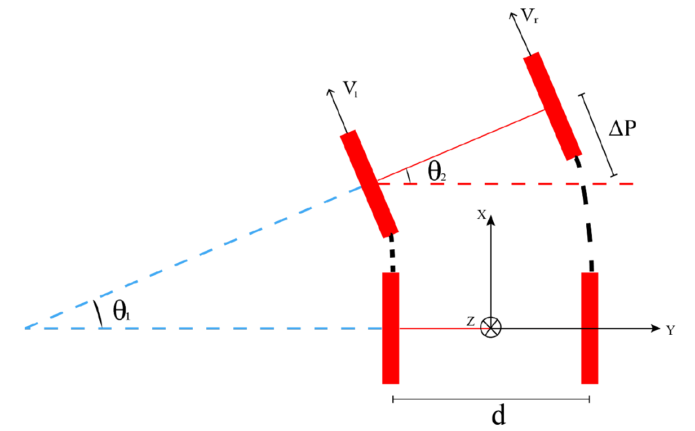
$$
\theta _1=\theta _2 \approx sin(\theta _2)=\frac{(\textbf{v}_r-\textbf{v}_l)\Delta t}{d}
\\
\omega'=\frac{\theta _1}{\Delta t}=\frac{\textbf{v}_r-\textbf{v}_l}{d}
$$

以z轴垂直向下，x指向前进方向，右手坐标系构建轮速坐标系，得到偏航角正方向，则角速度为$\omega=-\omega'$。因此容易推导得到载体的 2D 线速度以及偏航角的角速度。 
$$
v=\frac{v_r+v_l}{2},\omega=\frac{v_l-v_r}{d}
$$
轮速计实际只能测得载体前进方向的速度，因此只有前进方向所在的轴的测量值。因此测量值的白噪声$n_v \sim N(0,\sigma^2)$将前进方向的轴之外的两个轴的方差均设为无穷大。 

### 预积分模型

利用线速度与角速度可以推导得到两帧之间轮速计的预积分形式，即第 i 帧和第 j 帧间的相对位移，和相对旋转分量，轮速计预积分可以定义为：
$$
\Delta \textbf{R}^{i,j}_O=(\textbf{R}^{i}_{WO})^T\textbf{R}^{j}_{WO}\\
\Delta \textbf{p}^{i,j}_O=(\textbf{R}^{i}_{WO})^T(\textbf{p}^{j}_{OI}-\textbf{p}^{i}_{OI})
$$

这里仍然同 IMU 预积分相同采用中值积分的形式，我们从第 k 帧积分到第（k+1）帧： 

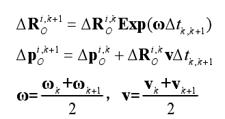

上述模型中，两帧间的相对位移 Δp，和相对旋转 ΔR 分量为轮速计预积分项，上标表示积分范围，ω 和 a 为利用中值法计算得到的角速度和加速度，$Δt_{k,k+1}$为第 k 个轮速计测量值到第(k+1)个轮速计测量值之间的时间间隔。 

### 误差传播

为了便于推导协方差传播公式，我们需要将轮速计预积分项写成预积分误差方程的形式： 

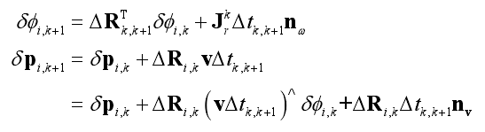

其中nv，nω通过左右轮差速模型以及中值积分可以分别计算得到：

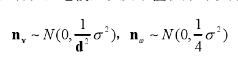

写成矩阵的形式为： 

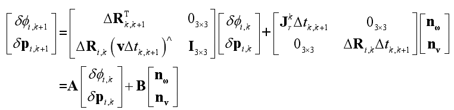

上式中[δϕi,k+1    δpi,k+1]为从第 i 帧到第（k+1）帧的累积误差，其中旋转项的误差 δϕi,k+1 为李代数的形式。 
因此轮速计预积分的协方差传播可以通过下式进行计算，其中Σi,k +1 和Σi,k 为第（k+1）帧和第 k 帧的协方差，,Σωvn n为通过双轮差分模型得到的速度和角速度的协方差：

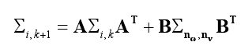

## 可观性分析

证明略（证明思路就是证明可观性矩阵和其右零空间的乘积为零空间），参考论文，结论如下

3.4.1  常加速度运动 
  首先，我们先给出结论，当载体以常线性加速度前进时，单目 VIO 系统除了3 个自由度的全局平移和 1 个自由度旋转不可观外，还有 1 个尺度上的不可观。 

从物理上来解释，当局部加速度为常量时，我们无法将真实的加速度与加速度计偏偏置区分开。结果便导致了，真实的加速度的大小可以是任意的，从而导致尺度无法正常估计。实际上，在大多数情况下，地面车辆会以恒定的加速度或接近恒定的加速度在平面上移动，例如以恒定速度或加速度沿着直线路径行驶，或者沿圆弧转弯时以恒定速度等。因此无法正确估计尺度的情况是非常常见的。 

3.4.2  无旋转运动 
首先，我们先给出结论，单目 VIO 系统原本具有 4 个不可观的自由度，包括3 个自由度的全局平移和 1 个自由度围绕重力矢量的旋转（偏航），当载体无旋转直线运动时，会出现额外的其他两个旋转（俯仰和翻滚）的不可观。

物理上来解释，在没有旋转运动的情况下，局部重力加速度的方向与加速度计偏置的方向无法区分。结果，侧倾角和俯仰角变得模糊无法估计。通常情况下，载体沿直线运动，或者（对于整车而言）侧向滑动。在这种情况下，由于缺乏可观察性，VIO 的方向估计值变得不准确。 

3.4.3  基于轮速计的 VIO 

首先，我们仍然先给出结论，在为 VIO 系统加入轮速计测量值之后，原本出现的尺度不可观变得可观了。 

轮速计的线速度测量结果包含绝对比例信息。  因此，轮速计不仅通过记录其他运动测量值，而且主要通过为 VIO 的尺度提供有效信息（通常由于车辆的运动而变得不可观察）来提高 VIO 的定位精度。

## 多传感器联合平差

相机的观测量为特征点坐标，IMU 观测量为预积分，轮速计观测量也为其测量值的预积分，三种传感器的观测量通过彼此之间的外参相关联。 

待优化变量：各帧的状态变量，包括 IMU 系的平移，旋转，IMU 在世界坐标系下的速度，IMU 的陀螺仪偏置，加速度计偏置；地图点的坐标。 

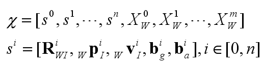

损失函数由三部分组成，分别为重投影误差，IMU 的预积分误差，轮速计的预积分误差： 

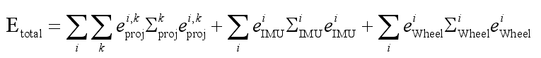

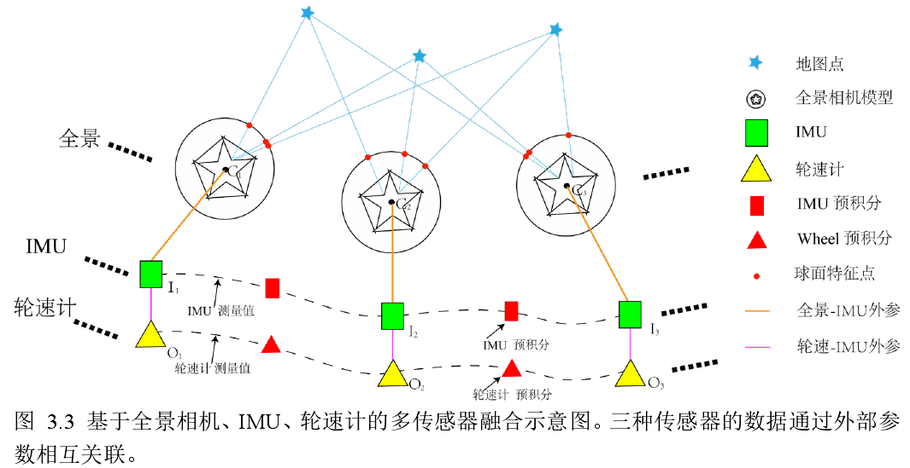

3.5.3  轮速计预积分误差及其雅克比矩阵

轮速计的预积分误差为： 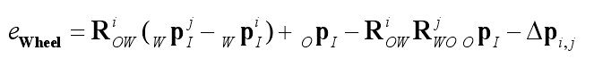

轮速计预积分误差相对于第  i , j 帧位姿的雅克比矩阵为 

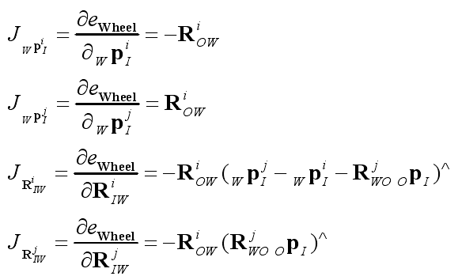

