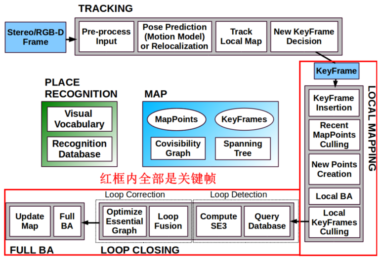
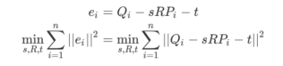
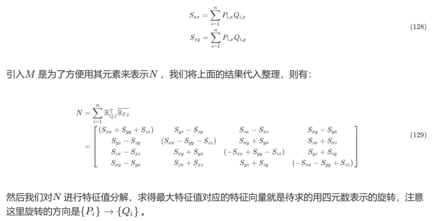
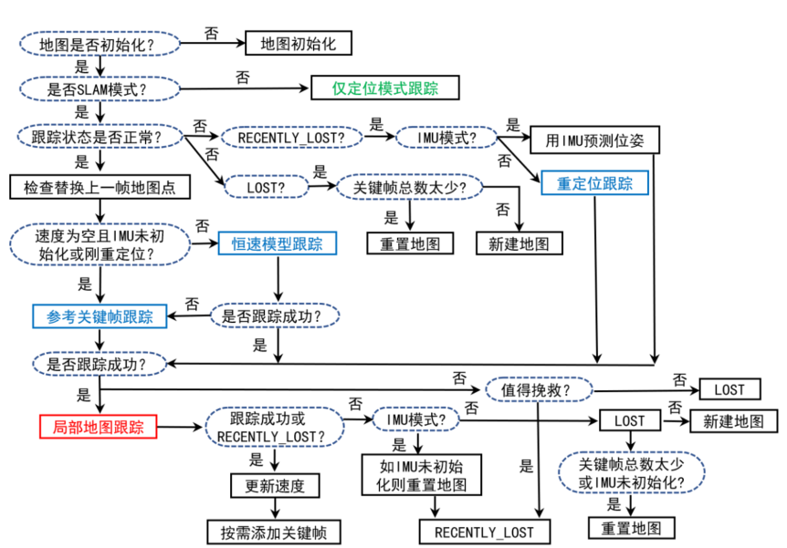
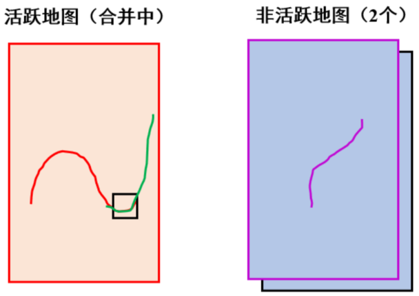
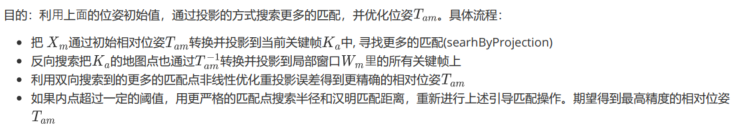
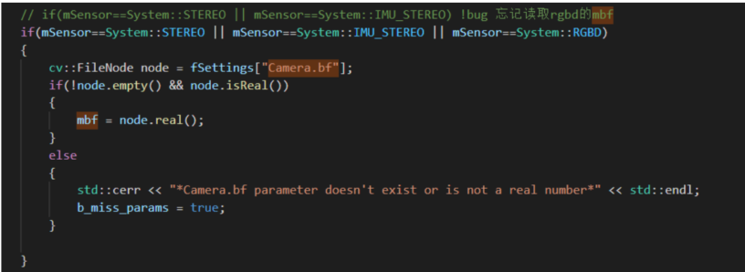
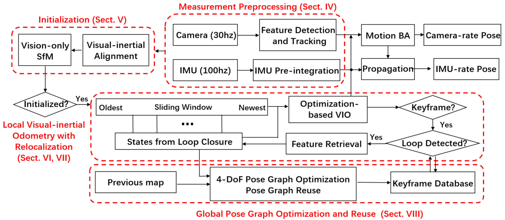

画图教程：https://blog.csdn.net/Ybc_csdn/article/details/118557460

# ORB-SLAM1

一、系统简介

二、论文解读

I

II

III

IV

三、源码分析


# ORB-SLAM2

## 一、系统简介

ORB-SLAM2是视觉SLAM中特征点法的开源代表作，同时支持单目、双目、RGBD相机，涵盖视觉SLAM领域重要知识，如实时跟踪、局部地图、回环检测、BA优化，工程技巧。适合二次开发。

**ORB-SLAM2特点**

\1. 所有的任务（跟踪/局部地图/闭环/重定位）采用相同的特征，使得系统更高效、简单可靠

\2. ORB特征具有旋转/光照不变性，无需GPU即可实时

\3. 共视图使得跟踪/建图控制在局部共视区域，与全局地图大小无关，可以在大场景下运行

\4. 使用Essential Graph来优化位姿实现回环检测，耗时少精度高

\5. 实时重定位使得在跟踪丢失后可以恢复位姿，增强地图重用性

\6. 单目初始化和应用场景解耦，不管是平面/非平面场景，都可以自动初始化，无需人工干预

\7. 地图点和关键帧创建比较宽松，但后续会进行严格筛选，剔除冗余关键帧和误差大的地图点，增加建图过程的弹性，在大旋转、快速运动、纹理不足等恶劣情况下可以提高跟踪的鲁棒性

\8. 相比于直接法，可以用于宽基线匹配，更适合于对深度精度要求较高的三维重建

\9. 适用于手持设备、汽车、机器人

\10. 集各种优秀的算法于一身，特征点法SLAM中最佳方案

**ORB-SLAM2不足**

\1. 相比于直接法，特征提取比较耗时，运行速度没有直接法高


\2. 相比于直接法，在弱纹理/重复纹理/图像模糊的场景下容易跟踪丢失

\3. 产生的地图比较稀疏

**主体框架**


**关键帧**

通俗来说，关键帧就是几帧普通帧里面具有代表性的一帧。


**为什么需要关键帧？**

- 相近帧之间信息冗余度很高，关键帧是取局部相近帧中最有代表性的一帧，**可以降低信息冗余度**。举例来说，摄像头放在原处不动，普通帧还是要记录的，但关键帧不会增加。
- 关键帧选择时还会对图片质量、特征点质量等进行考察，在Bundle Fusion、RKD SLAM等RGB-DSLAM相关方案中常常用普通帧的深度投影到关键帧上进行深度图优化，一定程度上**关键帧是普通帧滤波和优化的结果**，防止无用的或错误的信息进入优化过程而破坏定位建图的准确性。
- 如果**所有帧全部参与计算，不仅浪费了算力**，对内存也是极大的考验，这一点在前端vo中表现不明显，但在后端优化里是一个大问题，所以关键帧主要作用是面向后端优化的算力与精度的折中，使得有限的计算资源能够用在刀刃上，保证系统的平稳运行。假如你放松ORB_SLAM2 关键帧选择条件，大量产生的关键帧不仅耗计算资源，还会导致local mapping 计算不过来，出现误差累积。

**如何选择关键帧？**

选择关键帧主要从关键帧自身和关键帧与其他关键帧的关系2方面来考虑。

- 关键帧自身质量要好，例如不能是非常模糊的图像、特征点数量要充足、特征点分布要尽量均匀等等；
- 关键帧与其他关键帧之间的关系，需要和局部地图中的其他关键帧有一定的共视关系但又不能重复度太高，以达到既存在约束，又尽量少的信息冗余的效果。

**选取的指标主要有：**

（1）距离上一关键帧的帧数是否足够多（**时间**）。比如我每隔固定帧数选择一个关键帧，这样编程简单但效果不好。比如运动很慢的时候，就会选择大量相似的关键帧，冗余，运动快的时候又丢失了很多重要的帧。

（2）距离最近关键帧的距离是否足够远（**空间**）/运动比如相邻帧根据pose计算运动的相对大小，可以是位移也可以是旋转或者两个都考虑，运动足够大（超过一定阈值）就新建一个关键帧，这种方法比第一种好。但问题是如果对着同一个物体来回扫就会出现大量相似关键帧。

（3）跟踪局部地图质量（**共视特征点数目**）记录当前视角下跟踪的特征点数或者比例，当相机离开当前场景时（双目或比例明显降低）才会新建关键帧，避免了第2种方法的问题。缺点是数据结构和逻辑比较复杂。



在关键帧的运用上，我认为orbslam2做的非常好，跟踪线程选择关键帧标准较宽松，局部建图线程再跟据共视冗余度进行剔除，尤其是在回环检测中使用了以关键帧为代表的帧“簇”的概念，回环筛选中有一步将关键帧前后10帧为一组，计算组内总分，以最高分的组的0.75为阈值，滤除一些组，再在剩下的组内各自找最高分的一帧作为备选帧，这个方法非常好地诠释了“**关键帧代表局部**”的这个理念。

**共视图 本质图 拓展树**


**共视图(Covisibility Graph)**

共视图是无向加权图，每个节点是关键帧，如果两个关键帧之间满足一定的共视关系（至少15个共同观测地图点）他们就连成一条边，边的权重就是共视地图点数目。


**共视图的作用**

**1、跟踪局部地图，扩大搜索范围**

Tracking:UpdateLocalKeyFrames（）

**2、局部建图里关键帧之间新建地图点**

LocalMapping:：CreateNewMapPoints（）

LocalMapping:SearchlnNeighbors（）

**3、闭环检测、重定位检测**

LoopClosing:：DetectLoop（）、LoopClosing:CorrectLoop（）

KeyFrameDatabase:：DetectLoopCandidates

KeyFrameDatabase:：DetectRelocalizationCandidates

**4、优化**

Optimizer:：OptimizeEssentialGraph

**本质图(Essential Graph)**

只针对关键帧，不考虑普通帧。共视图比较稠密，本质图比共视图更稀疏，这是因为本质图的作用是用在闭环矫正时，用相似变换来矫正尺度漂移，把闭环误差均摊在本质图中。本质图中节点也是所有关键帧，但是连接边更少，只保留了联系紧密的边来使得结果更精确。

本质图中包含：

1.Spanning tree连接关系

2.形成闭环的连接关系，闭环后地图点变动后新增加的连接关系

3.共视关系非常好（至少100个共视地图点）的连接关系

**扩展树（spanning tree）**

子关键帧和父关键帧构成


**倒排索引**

**闭环检测确认候选帧**

**远近点判断**

针对远近点单独处理，控制关键帧的插入频率


## 二、论文解读

I

II

III

IV

## 三、源码分析

### Tracking

**跟踪线程整体流程**

ORB-SLAM2跟踪部分主要包括两个阶段

第一个阶段包括三种跟踪方法：用**参考关键帧来跟踪、恒速模型跟踪、重定位跟踪**，它们的目的是保证能够“跟的上”，但估计出来的位姿可能没那么准确。

第二个阶段是**局部地图跟踪**，将当前帧的局部关键帧对应的局部地图点投影到该帧，得到更多的特征点匹配关系，对第一阶段的位姿再次优化得到相对准确的位姿。


**参考关键帧跟踪当前普通帧**

**Tracking::TrackReferenceKeyFrame()**


**应用场景：**没有速度信息的时候、刚完成重定位、或者恒速模型跟踪失败后使用，大部分时间不用。只

利用到了参考帧的信息。

\1. 匹配方法是 SearchByBoW，匹配当前帧和关键帧在同一节点下的特征点，不需要投影，速度很快

\2. BA优化（仅优化位姿），提供比较粗糙的位姿

**思路:**

当使用运动模式匹配到的特征点数较少时，就会选用关键帧模式跟踪。

思路是：尝试和最近一个关键帧去做匹配。为了快速匹配，利用了bag of words（BoW）来加速匹配

**具体流程**

1 计算当前帧的BoW；

2 通过特征点的bow加快当前帧和参考帧之间的特征点匹配。使用函数matcher.SearchByBoW()。

- 对属于同一node（同一node才可能是匹配点）的特征点通过描述子距离进行匹配，遍历该node中特征点，特征点最小距离明显小于次小距离才作为成功匹配点，记录特征点对方向差统计到直方图
- 记录特征匹配成功后每个特征点对应的MapPoint（来自参考帧），用于后续3D-2D位姿优化
- 通过角度投票进行剔除误匹配

3 将上一帧的位姿作为当前帧位姿的初始值（加速收敛），通过优化3D-2D的重投影误差来获得准确位姿。3D-2D来自第2步匹配成功的参考帧和当前帧，重投影误差 e = (u,v) - project(Tcw*Pw)，只优化位姿Tcw，不优化MapPoints的坐标。

顶点 Vertex: :g2o::VertexSE3Expmap()，初始值为上一帧的Tcw

边 Edge（单目）: g2o::EdgeSE3ProjectXYZOnlyPose()，一元边 BaseUnaryEdge

\+ 顶点 Vertex：待优化当前帧的Tcw

\+ 测量值 measurement：MapPoint在当前帧中的二维位置(u,v)

\+ 误差信息矩阵 InfoMatrix: Eigen::Matrix2d::Identity()*invSigma2(与特征点所在的尺度有关)

+附加信息： 相机内参数： e->fx fy cx cy

3d点坐标 ： e->Xw[0] Xw[1] Xw[2] 2d点对应的上一帧的3d点

优化多次，根据边误差，更新2d-3d匹配质量内外点标记，当前帧设置优化后的位姿。

4 剔除优化后的outlier地图点

lower_bound( begin,end,num)：从数组的begin位置到end-1位置二分查找第一个大于或等于num的数字，找到返回该数字的地址，不存在则返回end。通过返回的地址减去起始地址begin,得到找到数字在数组中的下标。

upper_bound( begin,end,num)：从数组的begin位置到end-1位置二分查找第一个大于num的数字，找到返回该数字的地址，不存在则返回end。通过返回的地址减去起始地址begin,得到找到数字在数组中的下标。


**恒速模型跟踪当前普通帧**

**Tracking::TrackWithMotionModel()**

**应用场景**

大部分时间都用这个跟踪，只利用到了上一帧的信息。

\1. 用恒速模型先估计一个初始位姿

\2. 用该位姿进行投影匹配 SearchByProjection，候选点来自GetFeaturesInArea，未使用BoW

\3. BA优化（仅优化位姿），提供比较粗糙的位姿

**思想**

假设短时间内（相邻帧）物体处于匀速运动状态，可以用上一帧的位姿和速度来估计当前帧的位姿。

移动模式跟踪 跟踪前后两帧 得到 变换矩阵。

上一帧的地图3d点反投影到当前帧图像像素坐标上，在不同尺度下不同的搜索半径内，做描述子匹配 搜索 可以加快匹配。

在投影点附近根据描述子距离进行匹配（需要>20对匹配，否则匀速模型跟踪失败,运动变化太大时会出现这种情况），然后以运动模型预测的位姿为初值，优化当前位姿，

优化完成后再剔除外点，若剩余的匹配依然>=10对，则跟踪成功，否则跟踪失败，需要Relocalization

**具体流程**

**重定位跟踪**

**Tracking::Relocalization()**

**应用场景**

跟踪丢失的时候使用，很少使用。利用到了相似候选帧的信息。

\1. 用BoW先找到与该帧相似的候选关键帧（函数DetectRelocalizationCandidates）

\2. 遍历候选关键帧，用SearchByBoW快速匹配，

\3. 匹配点足够的情况下用EPnP 计算位姿并取出其中内点做BA优化（仅优化位姿），

\4. 如果优化完内点较少，通过关键帧投影生成新的匹配（函数SearchByProjection），

\5. 对匹配结果再做BA优化（仅优化位姿）。

**思想**

当TrackWithMotionModel 和 TrackReferenceKeyFrame 都没有跟踪成功，位置丢失后，需要在之前的关键帧中匹配最相近的关键帧，进而求出位姿信息。

使用当前帧的BoW特征映射，在关键帧数据库中寻找相似的候选关键帧，因为这里没有好的初始位姿信息，需要使用传统的3D-2D匹配点的EPnP算法来求解一个初始位姿，之后再使用最小化重投影误差来优化更新位姿。

**具体流程**

1：计算当前帧的BoW向量和Feature向量

2：在关键帧数据库中找到与当前帧相似的候选关键帧组

3：创建 ORB特征点匹配器 最小距离 < 0.75*次小距离 匹配成功。ORBmatcher matcher(0.75,true);

4：遍历每一个候选关键帧使用BOW特征向量加速匹配，匹配太少的去掉，选择符合要求的候选关键帧，用其地图点为其创建pnp优化器

5：使用PnPsolver 位姿变换求解器,更加3d-2d匹配点

6点直接线性变换DLT,后使用QR分解得到 R,t, 或者使用(P3P)，3点平面匹配算法求解。这里会结合 Ransac 随采样序列一致性算法，来提高求解的鲁棒性。

6：EPnP算法迭代估计姿态作为当前帧的初始位姿，使用最小化重投影误差BA算法来优化位姿

7：如果优化时记录的匹配点对内点数量少于50，想办法再增加匹配点数量：通过投影的方式对之前未匹配的点进行3D-2D匹配，又给了一次重新做人的机会

8： 如果新增的数量加上之前的匹配点数量 大于50，再次使用 位姿优化算法进行优化

9：如果上面优化后的内点数量还比较少，还想挽留一下，就缩小搜索窗口重新投影匹配（比之前使用更多的地图点了），如果最后匹配次数大于50，就认为是可以勉强扶起来的阿斗，再给BA位优化一次。否则，放弃了（真的已经仁至义尽了！）

10：如果经过上面一系列的挽救操作，内点数量 大于等于50 ，则重定位成功。

**检测重定位候选关键帧**

**DetectRelocalizationCandidates（）**


**局部地图跟踪**

**tracking::TrackLocalMap()**

**应用场景：**

前面3种跟踪方式得到当前帧地图点后的后处理，每次跟踪都使用。前提是必须知道当前帧的位姿和地图点（尽管不准确），利用到了当前帧的两级共视关键帧的信息，使得位姿更加准确。

**具体步骤：**

- 首先根据前面得到的当前帧的地图点来找能观测到当前帧的一级共视关键帧，将这些一级共视关键帧的二级关键共视帧、子关键帧、父关键帧一起作为局部关键帧;
- 取出上述局部关键帧中所有的地图点作为局部地图点；
- 将局部地图点投影到当前帧，去掉不在视野内的无效的地图点，剩下的局部地图点投影到当前帧进行匹配（函数SearchByProjection）
- 对匹配结果再做BA优化（仅优化位姿）

**当前帧：**mCurrentFrame（当前帧是普通帧）

参考关键帧: 与当前帧共视程度最高的关键帧作为参考关键帧，mCurrentFrame.mpReferenceKF

在KeyFrame::UpdateConnections() 里确定关键帧的父子关系（当前帧必须是关键帧）

**父关键帧：**和当前关键帧共视程度最高的关键帧

**子关键帧：**是上述父关键帧的子关键帧

### KeyFrame

### MapPoint

**地图点**

地图点是三维点，来自真实世界的三维物体，有唯一的id。不同帧里的特征点可能对应三维空间中同一个三维点，

特征点是二维点，是特征提取的点，大部分二维点在三维空间中没有对应地图点

关于生成地图点，主要有2个地方：

1、初始化时 前两帧匹配生成地图点

2、local mapping里共视关键帧之间用 LocalMapping::CreateNewMapPoints() 生成地图点

3、Tracking::UpdateLastFrame() 和 Tracking::CreateNewKeyFrame() 中为双目和RGB-D生成了新的临时地图点，单目不生成

**代表性描述子**

一个地图点在许多不同帧中具有对应的特征点，找最有代表性特征点的描述子示意图。

最有代表的描述子与其他描述子具有最小的距离中值


**地图点法线朝向**


### LoopClosing


**SIM3变换**

Sim(3) 表示三维空间的相似变换(Similarity Transformation)。

**问题描述：**已知至少三个匹配的不共线三维点对，求他们之间的相对旋转、平移、尺度因子。

理论来说计算Sim3需要3对不共线的点对即可求解。我们来感性的理解一下，我们有三对匹配的不共线三维点可以构成两个三角形。我们根据三角形各自的法向量可以得到他们之间的旋转，通过相似三角形面积能够得到尺度，用前面得到的旋转和尺度可以把两个三角形平行放置，通过计算距离可以得到平移。以上是直观感性的理解，实际在计算的时候需要有严格的数学推导。我们这里使用的方法是来自Berthold K. P. Horn在1987年发表的论文 "Closed-form solution of absolute orientation using unit quaternions "。该文提出了用三维匹配点构建优化方程，不需要迭代，直接用闭式解求出了两个坐标系之间的旋转、平移、尺度。该方法的优点非常明显：实际上，在SLAM问题中，我们通常能够得到大于3个的三维匹配点，该论文推导了该情况下最小二乘得到最优解的方法。

1、给定两个坐标系下的至少3个匹配三维点，只需一步即可求得变换关系，不需要迭代，速度很快。

2、因为不是数值解，不需要像迭代方法那样需要找一个好的初始解。闭式解可以直接求得比较精确的结果。

数值解(numerical solution)是在特定条件下通过近似计算得出来的一个数值，比如数值逼近。

闭式解也称为解析解，就是给出解的具体函数形式，从解的表达式中就可以算出任何对应值。

**由三对点计算旋转**

假设坐标系1下有三个不共线三维点P1 ,P2 ,P3 ，他们分别和坐标系2下的三个不共线三维点Q1 ,Q2 ,Q3，一一匹配。


看起来好像没什么问题，但是实际上我们不会这样使用，因为存在如下问题：

1、这个旋转的结果和选择点的顺序关系密切，我们分别让不同的点做坐标系原点，得到的结果不同。

2、这种情况不适用于匹配点大于3个的情况。

我们通常能够拿到远大于3个的三维匹配点对，我们会使用最小二乘法来得到更稳定、更精确的结果。

**Sim3（>3对点）**

**计算平移**

假设我们得到了 组匹配的三维点，分别记为 ，其中 我们的目的是对于每对匹配点，找到如下的变换关系：


其中s是尺度因子，R是旋转，t是平移。

数据有噪声，定义误差，构造最小二乘问题。




根据前面的推导可得等式右边中间项


**计算旋转**

下面我们考虑用四元数来代替矩阵来表达旋转。

为什么用四元数而不是矩阵表达旋转？

1、因为直接使用矩阵必须要保证矩阵的正交性等约束，这个约束太强了，会带来很多困难。

2、四元数只需要保证模值为1的约束，简单很多，方便推导。


**利用前面的性质**

我们现在的的代价函数可以做如下变换：




**计算尺度因子**


s取值是二元一次方程的对称轴。


**这里我们总结下对称形式的优势：**

1、使得尺度的解和旋转、平移都无关

2、反过来，旋转的确定不受数据选择不同的影响

我们直观理解一下，尺度就是三维点到各自均值中心的距离之和。

**步骤总结**


**迭代次数的估计**


**四元数到旋转向量的转换**


**Sim3的逆变换矩阵**


**ComputeSim3计算Sim3**

### Optimizer


在ORB-SLAM2中只有闭环，没有地图融合。流程如下：

**第1步：检测闭环。DetectLoop()**

\1. 寻找初始的（多个）闭环候选帧（注意不和当前帧连接）。


\2. 在候选帧中检测具有连续性的候选帧。

依据：时序上连续进来的三个关键帧的回环候选帧的共视窗口应该会有重叠

缺点：延迟+低Recall


**第2步：计算Sim3。ComputeSim3()**

\1. 为每一个闭环候选帧构造一个Sim3Solver，利用词袋将当前关键帧CurrKF和闭环候选关键帧LoopKF进行迭代匹配，得到初始的Sim3变换。

\2. 基于初始的Sim3变换，双向搜索匹配两个关键帧中更多的匹配点对，只有在两次互相匹配中都存在才能够认为是可靠的匹配。

\3. 用以上可靠的匹配关系进行Sim3优化，得到比较准确的Sim3变换。

\4. 将闭环关键帧及其连接关键帧的所有地图点用上述比较准确的Sim3位姿投影到当前关键帧进行投影匹配，希望得到更多的匹配关系。


**第3步：闭环矫正。CorrectLoop()**

\1. 通过求解的Sim3位姿进行传播，调整与当前帧相连的关键帧位姿以及它们观测到的地图点坐标。

\2. 将闭环相连关键帧组依次投影到调整过的当前关键帧组中中的每个关键帧，进行匹配，融合，新增或替换当前关键帧中的地图点。

\3. 进行本质图优化，优化本质图中所有关键帧的位姿和地图点。

\4. 新建一个线程用于全局BA优化。

### 代码BUG

**单目初始化中特征点搜索匹配，通过角度一致性过滤外点bug**

原因：错误把长度为30的直方图（单个bin角度范围12°）变成了长度为12（单个bin角度范围30°）

影响：弱化了对角度不一致性的错误剔除，导致只有角度差超过30°（本来是12°）才会被去除。

rotHist 预分配了30个bin，实际第13-30个都没有用到。简单来说，删除误差的能力下降了。

# ORB-SLAM3

## 一、系统简介

ORB-SLAM3是在ORB-SLAM2的基础上开发的，于2020年7月发布。它在定位精度和效果上几乎碾压了同类的开源算法，受到极大关注。从论文中我们先领略一下该算法的特点：

- **第一个可以运行视觉、视觉惯性和多地图，支持单目、双目和RGB-D相机，且支持针孔和鱼眼镜头模型的SLAM系统。**

- **一个完全依赖最大后验估计，且基于特征点的单目和双目视觉惯性SLAM系统，包括在IMU初始化阶段。**该算法可以在不同大小，室内和室外环境中鲁棒、实时的运行，精度上相比于以前的方法提升了2~5倍。和其他视觉惯性SLAM方法相比，即使在没有闭环的情况下，也具备良好的鲁棒性和更高的精度。

- **一个依赖高召回率的新位置识别算法的多地图系统。**该多地图系统可以让系统在视觉信息缺乏的场景下长时间运行。比如当跟踪丢失的时候，它会重新建立新的地图，并在重新访问之前的地图时，无缝地与之前的地图融合。与只使用最近几秒钟信息的视觉里程计相比，它是第一个能够在所有算法阶段重用之前所有信息的系统。能够在BA优化共视关键帧时，利用较大视差的观测来提高求解精度。这些大视差的观测可能间隔时间比较久，或者来自前面已经建立的不同的地图。

- **实验结果证明，在所有的传感器模式下，ORB-SLAM3和文献中可用的最优SLAM系统一样鲁棒，并且具有更高的精度。**双目惯性模式下，该算法在无人机数据集EuRoC上可以达到平均3.6cm的定位精度，在手持设备快速移动的室内数据集TUM-VI上达到了9mm的定位精度。


<font size=5>数据关联</font> 

- **短期数据关联。**仅仅和最近几秒内获取的地图元素进行匹配。这是大多数视觉里程计使用的唯一数据关联类型，这种方法存在的问题是：一旦地图元素从视野中消失，就会被丢弃，即使回到原来的地方，也会造成持续的估计漂移。对应ORB-SLAM里的跟踪。
- **中期数据关联。**匹配距离相机近并且累积漂移较小的地图元素。与短期观测相比，这些信息可以一并加入BA优化，当相机移动到已经建好图的区域时，可以达到零漂移。这是该系统与带闭环检测的视觉里程计相比，精度更高的关键所在。对应ORB-SLAM里的局部建图。
- **长期数据关联。**使用位置识别技术将观测与之前访问过的区域中的元素匹配，不管是在闭环检测中的累积漂移，还是跟踪丢失、重定位的情况下都可以成功匹配。长期匹配允许使用位姿图优化来重置漂移和矫正闭环。这是保证中、大型闭环场景中SLAM局部较高精度的关键。对应ORB-SLAM里用词袋进行闭环和重定位。
- **多地图数据关联。**可以使用之前已经建立的多块地图来实现地图中的匹配和BA优化。

ORB-SLAM3充分使用了短期、中期、长期的数据关联，可以达到在已经建图区域的零漂移。

<font size=5>变量命名规范</font>

以小写字母m（member的首字母）开头的变量表示类的成员变量。比如：


 

<font size=5>不同传感器的应用场景</font>

|                    | **单目**      | **单目+IMU**  | **双目**         | **双目+IMU**     | **RGB-D**        |
| ------------------ | ------------- | ------------- | ---------------- | ---------------- | ---------------- |
| 地图初始化         | SFM方式，较慢 | SFM方式，较慢 | 第一帧即可初始化 | 第一帧即可初始化 | 第一帧即可初始化 |
| 鲁棒性             | 最低          | 较好          | 一般             | 最高             | 一般             |
| 定位精度           | 最低          | 较好          | 一般             | 最高             | 一般             |
| 运动较慢、匀速场景 | √             | ×             | √                | 不适合           | √                |

一般量化对比结果都是多次测量求平均值，并没有一种模式在所有数据集下都是最佳。

鲁棒性和定位精度最好的是双目+IMU模式；但是如果对体积、成本、算力等有一定要求，推荐单目+IMU模式，其综合效果仅次于双目+IMU。

<font size=5>工程化建议</font>

工程上：无非三个要素，速度，精度，鲁棒性。

所有开源框架都是学术成果，（不考虑版权问题的情况下）无法做到拿来就直接能用到项目或产品，必须要在不同应用场景下做移植、魔改、加速、封装等。

不盲从、敢于质疑作者。开源框架中一般都有不少出错的地方。

ORB-SLAM3不适用场景：

- 运动速度较慢、匀速运动的场景下不适合用视觉惯性模式。因为此时IMU没有有效输出，很难成功初始化。
- 自动驾驶。因为自动驾驶一般不需要闭环，比较适合轻量级的VIO。不过特定范围的园区内仍然可以考虑。

ORB-SLAM3工程化改进建议：

- 代码bug方面：代码中存在不少bug（见前面bug说明，不全）。需要重新梳理，修复bug（包括ORB-SLAM2遗留的代码）。
- 代码规范化方面：单个文件代码量过大、部分功能封装的不好。不利于阅读、不利于多人协同开发，推荐再细化，拆分。例如跟踪线程里那几个跟踪状态，理起来很费劲，容易出错；回环线程一个函数不要包含那么多代码；匹配函数里大量重复的代码；Initializer.cc和TwoViewReconstruction.cc代码重复，可删除。
- 代码逻辑和参数方面：个别地方的逻辑有待商榷，个别地方的阈值有待商榷，个别地方的处理有待商榷。这个也是要结合具体的使用场景，特别是阈值，很多都是写死的，那如果数据集的图像分辨率大，有些阈值是不是可以随着分辨率变化而变化做一些超参。优化部分也是有一些处理不当的地方。
- 地图复用问题。ORB-SLAM3没有实现，可以参考https://github.com/UZ-SLAMLab/ORB_SLAM3/pull/310
- 代码加速。读取词袋部分可以改成二进制词袋，占用空间小，读取速度快。此外，好多地方代码冗余，做了很多无意义的操作，例如优化中好多for循环都没用，简直是时间杀手。比如更新共视关系的地方也有bug，导致每次都会更新小于15个共视地图点的关键帧关系（实际上用不到）；另外，特别注意和地图点相关的遍历、更新操作，因为量大，处理起来都是时间杀手。
- 代码中调试工具：源码里包含了很多调试代码，建议弄成宏定义判断是否执行，利用好这些调试的代码可以事半功倍，例如回环时显示一下两张回环的匹配图像等等。


<font size=5>研究方向建议</font>

1. 用直接法实现短期、中期、长期、多地图数据关联。作者在探索这个方向，用于人体内窥镜建图。

2. 基于CNN的单目深度估计可以得到可靠的深度图，可以和ORB-SLAM3结合。

3. 特征提取加速方法。

比如这篇论文对ORB-SLAM2进行了加速。《Fast ORB-SLAM with Descriptor Independent Keypoint Matching》

DEMO

思路：普通帧提取特征点只是为了跟踪，但如果后续没有被确定为关键帧，这些特征点再也用不到了。而提取特征点很费时间，能否用直接法（比如稀疏光流来替代特征点来跟踪）。只有关键帧才计算描述子。

具体分2步，第1步：结合UAM (uniform acceleration motion)运动模型，用稀疏光流+金字塔来粗糙跟踪；第2步：用GMS和基于RANSAC的极线约束来滤除误匹配。

4. 深度学习特征点

2020 IROS《DXSLAM: A Robust and Efficient Visual SLAM System with Deep Features》

论文地址：https://arxiv.org/pdf/2008.05416.pdf

论文代码：https://github.com/ivipsourcecode/dxslam

思路：

使用CNN（Convolutional Neural Network，卷积神经网络）提取特征，然后将所提取的特征整合到ORB SLAM2框架中。其中，作者选择了性能优异的HF-Net，提取每帧图像的局部特征以及整幅图像的全局特征，使得所整合的SLAM系统，相比使用手工特征点的SLAM系统，在环境变化、视角变化情况下拥有更好的鲁棒性。ORB SLAM2中使用BoW（Bag of Words,词袋模型）来加速特征点的匹配，本文中作者使用了FBoW（Fast Bag of Words）来进一步加速词袋的训练以及通过词袋模型进行的特征点匹配过程。使用Intel神经网络优化工具OpenVINO之后，该系统可以不需要GPU，只靠CPU达到了实时性。

如何有思路？多看论文、多写代码、多尝试。

讲师：老白，六哥

## 二、论文解读


初始化分为三个阶段：

纯视觉、IMU、视觉+IMU

I

II

III

IV


## 三、源码分析

### 1.地图初始化

前10个关键帧是纯视觉模式，且时间在1或2秒之后，才会考虑IMU信息。

IMU初始化分为三个阶段（参考IMU初始化），这三个阶段只有时间先后的区别，调用的函数仅信息矩阵的系数在减小。
另外在单目+IMU模式下，当关键帧数目<100 并且 满足一定时间间隔，会进行多次的重力方向和尺度优化。


#### 单目地图初始化

并行地计算基础矩阵和单应性矩阵，选取其中一个模型，恢复出最开始两帧之间的相对姿态以及点云得到初始两帧的匹配、相对运动、初始MapPoints。

 \* Step 1：（未创建）得到用于初始化的第一帧，初始化需要两帧

 \* Step 2：（已创建）如果当前帧特征点数大于100，则得到用于单目初始化的第二帧

 \* Step 3：在mInitialFrame与mCurrentFrame中找匹配的特征点对

 \* Step 4：如果初始化的两帧之间的匹配点太少，重新初始化

 \* Step 5：通过H模型或F模型进行单目初始化，得到两帧间相对运动、初始MapPoints

 \* Step 6：删除那些无法进行三角化的匹配点

 \* Step 7：将三角化得到的3D点包装成MapPoints

**特征点搜索匹配**


找到在 以上一帧的特征点坐标[x,y]在当前帧以x,y为中心,半径为r的圆形内且金字塔层级在[minLevel, maxLevel]的特征点。

**特征点角度一致性过滤外点**

若当前帧相对上一帧发生旋转，则当前帧每一个特征点都会旋转一定的角度，通过直方图对特征点的旋转角度分类，若出现旋转不一致的点，可以认为是错误的点。结果保留直方图排名前三。


简单来说，删除误差的能力下降了。

**RANSAC**

**尺度不确定性**

在SVD分解过程中，对 t 乘以任意非零常数，分解都是成立的。因此，我们通常把 t 进行归一化，让它的长度等于 1。

对 t 长度的归一化，直接导致了单目视觉的**尺度不确定性**（Scale Ambiguity） 。但是一旦初始化中的归一化确定了尺度，后面就以此为参考。

除了对 t 进行归一化之外，另一种方法是令初始化时所有的特征点平均深度为 1，也可以固定一个尺度。相比于令 t 长度为 1 的做法，把特征点深度归一化可以控制场景的规模大小，使计算在数值上更稳定些。不过这并没有理论上的差别。

**初始化的纯旋转问题**

从 E 分解到 R; t 的过程中，如果相机发生的是纯旋转，导致 t 为零，那么，得到的E 也将为零，这将导致我们无从求解 R。不过，此时我们可以依靠 H 求取旋转，但仅有旋转时，我们无法用三角测量估计特征点的空间位置（这将在下文提到），于是，另一个结论是， **单目初始化不能只有纯旋转，必须要有一定程度的平移**。如果没有平移，单目将无法初始化。在实践当中，如果初始化时平移太小，会使得位姿求解与三角化结果不稳定，从而导致失败。相对的，如果把相机左右移动而不是原地旋转，就容易让单目 SLAM 初始化。因而有经验的 SLAM 研究人员，在单目 SLAM 情况下，经常选择让相机进行左右平移以顺利地进行初始化。

**三角测量**

在估计了相机的运动x（R，t）之后，还要知道y，地图点的深度，通过三角测量（Triangulation）（或三角化） 的方法来估计地图点的深度。


理论上直线 O1p1 与 O2p2 在场景中会相交于一点 P，该点即是两个特征点所对应的地图点在三维场景中的位置。然而，由于噪声的影响，这两条直线往往无法相交。因此，（又）可以通过最二小乘去求解。


**三角测量的矛盾**


三角测量是由平移得到的，有平移才会有对极几何中的三角形，才谈的上三角测量。因此，纯旋转是无法使用三角测量的，因为对极约束将永远满足。在平移存在的情况下，我们还要关心三角测量的不确定性，这会引出一个三角测量的矛盾。

因此，要增加三角化的精度，其一是提高特征点的提取精度，也就是提高图像分辨率——但这会导致图像变大，提高计算成本。另一方式是使平移量增大。但是，平移量增大，会导致图像的外观发生明显的变化，比如箱子原先被挡住的侧面显示出来了，比如反射光发生变化了，等等。外观变化会使得特征提取与匹配变得困难。**总而言之，在增大平移，会导致匹配失效；而平移太小，则三角化精度不够——这就是三角化的矛盾。**

虽然本节只介绍了三角化的深度估计，但只要我们愿意，也能够定量地计算每个特征点的位置及不确定性。所以，如果假设特征点服从高斯分布，并且对它不断地进行观测，在信息正确的情况下，我们就能够期望它的方差会不断减小乃至收敛。这就得到了一个滤波器，称为**深度滤波器（Depth Filter）** 。不过，由于它的原理较复杂，我们留到第 13 讲再详细讨论它。

**单目投影恢复3D点（三角化）**


### 2.追踪线程

ORB-SLAM3跟踪部分主要包括两个阶段

第一个阶段包括三种跟踪方法：用参考关键帧来跟踪、恒速模型跟踪、重定位跟踪，它们的目的是保证能够“跟的上”，但估计出来的位姿可能没那么准确。

第二个阶段是局部地图跟踪，将当前帧的局部关键帧对应的局部地图点投影到该帧，得到更多的特征点匹配关系，对第一阶段的位姿再次优化得到相对准确的位姿。




bool Tracking::Relocalization()


利用词袋的好处是，词袋的单词是对描述子的一个聚类，进行特征匹配时就可以在属于同一个单词内的描述子进行匹配，缩小匹配范围，加速匹配。第一关筛选：匹配距离必须小于设定阈值（50）第二关筛选：最佳匹配比次佳匹配明显要好，那么最佳匹配才真正靠谱。
对特征的旋转角度进行统计，分为

为什么用MLPnP? 因为考虑了鱼眼相机模型，解耦某些关系？
参考论文《MLPNP-A REAL-TIME MAXIMUM LIKELIHOOD SOLUTION TO THE PERSPECTIVE-N-POINT PROBLEM》MLPnP需要至少6个点


用局部地图进行跟踪，进一步优化位姿。


```c++
@brief 判断路标点是否在视野中
@param[in] pMP                       当前地图点
@param[in] viewingCosLimit           夹角余弦，用于限制地图点和光心连线和法线的夹角
@return true                         地图点合格，且在视野内
@return false                        地图点不合格，抛弃

步骤
* Step 1 获得这个地图点的世界坐标
* Step 2 关卡一：检查这个地图点在当前帧的相机坐标系下，是否有正的深度.如果是负的，表示出错，返回false
* Step 3 关卡二：将MapPoint投影到当前帧的像素坐标(u,v), 并判断是否在图像有效范围内
* Step 4 关卡三：计算MapPoint到相机中心的距离, 并判断是否在尺度变化的距离内
* Step 5 关卡四：计算当前相机指向地图点向量和地图点的平均观测方向夹角的余弦值, 若小于设定阈值，返回false
* Step 6 根据地图点到光心的距离来预测一个尺度（仿照特征点金字塔层级）
* Step 7 记录计算得到的一些参数
```

​    

判断当前帧是否需要插入关键帧


#### 跟踪线程中的新变化

新增加了一种跟踪状态：RECENTLY_LOST

如下图所示是ORB-SLAM2和ORB-SLAM3中跟踪状态的对比：

```C++
// ORB-SLAM2跟踪状态类型
enum eTrackingState{
    SYSTEM_NOT_READY=-1, //系统没有准备好的状态,一般就是在启动后加载配置文件和词典文件时候的状态
    NO_IMAGES_YET=0, //当前无图像
    NOT_INITIALIZED=1, //有图像但是没有完成初始化
    OK=2, //正常时候的工作状态
    LOST=3 //系统已经跟丢了的状态
};
// ORB-SLAM3跟踪状态类型
enum eTrackingState{
    SYSTEM_NOT_READY=-1, //系统没有准备好的状态,一般就是在启动后加载配置文件和词典文件时候的状态
    NO_IMAGES_YET=0, //当前无图像
    NOT_INITIALIZED=1, //有图像但是没有完成初始化
    OK=2, //正常跟踪状态
    RECENTLY_LOST=3, //IMU模式：当前地图中的KF>10,且丢失时间<5秒。纯视觉模式：没有该状态
    LOST=4, //IMU模式：当前帧跟丢超过5s。纯视觉模式：重定位失败
    OK_KLT=5 //未使用
};
```

**为什么要增加RECENTLY_LOST状态？**

当参考关键帧跟踪或恒速模型跟踪失败的时候，根据不同的传感器模式分配不同的状态：

- 如果是纯视觉模式，直接将当前状态标记为LOST。
- 如果是视觉+IMU模式，并且满足一定的条件，先将当前状态标记为RECENTLY_LOST。然后用累积的IMU数据来预测一个粗糙的位姿，希望能够把跟丢的位姿重新找回来。

**参考关键帧的跟踪新变化**

基本一致。不同之处：

在ORB-SLAM2中，最后位姿优化后，需要成功匹配内点数目超过10才成功；

在ORB-SLAM3中，最后位姿优化后，如果是IMU模式，直接认为成功跟踪；如果是纯视觉模式，需要成功匹配内点数目超过10才成功；

总结：IMU模式下跟踪成功判断更宽松。

**恒速模型跟踪新变化**

**重定位的新变化**

**局部地图跟踪的新变化**

进入跟踪第二阶段

**插入关键帧**

**跟踪中的注意事项**

### 3.局部建图线程


目的和意义：

- 承上启下。接收跟踪线程输入的关键帧并进行局部地图优化、删除冗余关键帧等；将优化后的关键帧发送给闭环线程。
- 实现中期数据关联。跟踪线程中仅使用了相邻普通帧或关键帧的信息，而且只优化当前帧的位姿（没有联合优化多个位姿，没有优化地图点）；局部建图线程里优化满足一定共视关系的多个关键帧及其对应的地图点。使得关键帧的位姿和地图点更加准确。
- 利用共视关键帧之间重新匹配得到更多新的地图点，增加地图里地图点的数目，可以提高跟踪的稳定性。

- 删除冗余关键帧可以降低局部BA的规模和次数。提高实时性。
- 完成IMU的初始化（非常重要）。得到比较准确的IMU参数、重力方向、尺度（单目模式）

void LocalMapping::Run()

```C++
/**
 * @brief 用局部地图进行跟踪，进一步优化位姿
 * 
 * 1. 更新局部地图，包括局部关键帧和关键点
 * 2. 对局部MapPoints进行投影匹配
 * 3. 根据匹配对估计当前帧的姿态
 * 4. 根据姿态剔除误匹配
 * @return true if success
 * 
 * Step 1：更新局部关键帧mvpLocalKeyFrames和局部地图点mvpLocalMapPoints 
 * Step 2：在局部地图中查找与当前帧匹配的MapPoints, 其实也就是对局部地图点进行跟踪
 * Step 3：更新局部所有MapPoints后对位姿再次优化
 * Step 4：更新当前帧的MapPoints被观测程度，并统计跟踪局部地图的效果
 * Step 5：决定是否跟踪成功
 */
bool Tracking::TrackLocalMap()
{}
```

#### 更新局部地图

```c++
void Tracking::UpdateLocalMap()
{
	UpdateLocalKeyFrames();
	UpdateLocalPoints();
}
```

**更新局部关键帧**

遍历当前帧的地图点，将观测到这些地图点的关键帧和相邻的关键帧及其父子关键帧，作为mvpLocalKeyFrames

**更新局部地图点**

先把局部地图清空，然后将局部关键帧的有效地图点添加到局部地图中

#### 插入关键帧

void LocalMapping::ProcessNewKeyFrame()
插入前要处理好，最后插入
处理列表中的关键帧，包括计算BoW、更新观测、描述子、共视图，插入到地图等

Step 1：从缓冲队列中取出一帧关键帧

Step 2：计算该关键帧特征点的Bow信息

Step 3：当前处理关键帧中有效的地图点，更新normal，描述子等信息

Step 4：更新关键帧间的连接关系（共视图）

Step 5：将该关键帧插入到地图中

#### 剔除地图点

MapPointCulling();
检查新增地图点，根据地图点的观测情况剔除质量不好的新增的地图点

#### 生成新地图点

void LocalMapping::CreateNewMapPoints()
用当前关键帧与相邻关键帧（10帧）通过三角化产生新的地图点，使得跟踪更稳

SearchLocalPoints();
筛选局部地图中新增的在视野范围内的地图点，投影到当前帧搜索匹配，得到更多的匹配关系

#### 局部BA优化

#### IMU初始化

**IMU初始化的目的及意义**

假如不做初始化，那么就以第一帧的坐标为世界坐标系，这样就不知道重力的方向，会导致在计算位置、速度的时候，利用加速度计算积分时，重力没有办法剔除。也就是说如果不知道重力的方向，就无法平衡重力对积分的影响。

因此初始化的目的就是**明确重力的方向，从而平衡重力**。把第一帧图像的坐标系的Z轴和重力方向平行。

代码初始化分为三个阶段：纯视觉，IMU，视觉+IMU

局部建图线程中IMU初始化的三个阶段

```C++
if (/* IMU未完成第一阶段初始化 */)
{
    // 执行IMU第一阶段初始化
    // 目的：快速初始化IMU，尽快用IMU来跟踪
    InitializeIMU();
} 
else if (/* IMU已完成第一阶段初始化 并且 累计时间＞5s */)
{
    // 执行IMU第二阶段初始化
    // 目的：快速修正IMU，短时间内使得IMU参数相对靠谱
    mpCurrentKeyFrame->GetMap()->SetIniertialBA1();
    InitializeIMU();
} 
else if (/* IMU已完成第二阶段初始化 并且 累计时间＞15s */)
{
    // 执行IMU第三阶段初始化
    // 目的：再次优化IMU，保证IMU参数高精度
    mpCurrentKeyFrame->GetMap()->SetIniertialBA2();
    InitializeIMU();
} 
if (/* 单目惯性模式 并且 关键帧数目<100 并且 满足一定时间间隔 */)
{
    // 优化重力方向和尺度
    ScaleRefinement();
        {
            //每次的初值为mRwg=单位矩阵和mScale=1
            InertialOptimization();
        }
    
}
```

==IMU第一阶段初始化==

条件：时间（>1-2s）,帧数(>10),不满足直接return，所以前10关键帧都是纯视觉。

工作：快速初始化IMU，尽快用IMU来跟踪

```C++
// IMU第一阶段初始化
if (mbMonocular)
    InitializeIMU(1e2, 1e10, true);
else
    InitializeIMU(1e2, 1e5, true);

```

==第2阶段初始化==

条件：第1阶段成功&&未完成IMU初始化&&成功后距当前时间<100s&&跟踪正常

​			&&未完成VIBA1

工作：快速修正IMU，短时间内使得IMU参数相对靠谱

```C++
mpCurrentKeyFrame->GetMap()->SetIniertialBA1();
if (mbMonocular)
    InitializeIMU(1.f, 1e5, true); // 1.f, 1e5
else
    InitializeIMU(1.f, 1e5, true); // 1.f, 1e5
```

==第3阶段初始化==

条件：第1阶段成功&&未完成IMU初始化&&成功后距当前时间t<100s&&跟踪正常

​			&& 未完成VIBA2 && t>15s

工作：再次优化IMU，保证IMU参数高精度

```c++
{
    mpCurrentKeyFrame->GetMap()->SetIniertialBA2();
    if (mbMonocular)
        InitializeIMU(0.f, 0.f, true); // 0.f, 0.f
    else
        InitializeIMU(0.f, 0.f, true);
}

//尺度更新
// Step 9.3 在关键帧小于100时，会在满足一定时间间隔(10s)后多次进行尺度、重力方向优化(0.5s)
if (((mpAtlas->KeyFramesInMap())<=100) &&
    ((mTinit>25.0f && mTinit<25.5f)||       
     (mTinit>35.0f && mTinit<35.5f)||
     (mTinit>45.0f && mTinit<45.5f)||
     (mTinit>55.0f && mTinit<55.5f)||
     (mTinit>65.0f && mTinit<65.5f)||
     (mTinit>75.0f && mTinit<75.5f))){
    cout << "start scale ref" << endl;
	if (mbMonocular)
        // 使用了所有关键帧，但只优化尺度和重力方向
        ScaleRefinement();
    cout << "end scale ref" << endl;
}
```

正式初始化

```C++
/** 
 * @brief imu初始化
 * @param priorG 陀螺仪偏置的信息矩阵系数，主动设置时一般bInit为true，也就是只优化最后一帧的偏置，这个数会作为计算信息矩阵时使用
 * @param priorA 加速度计偏置的信息矩阵系数
 * @param bFIBA 是否做BA优化
 */
void LocalMapping::InitializeIMU(float priorG, float priorA, bool bFIBA)
{
    // 1. 将所有关键帧放入列表及向量里，且查看是否满足初始化条件
    if (mbResetRequested)
        return;

    float minTime;
    int nMinKF;
    // 从时间及帧数上限制初始化，不满足下面的不进行初始化
    //从时间（>1-2s）,帧数(>10),不满足直接return
    if (mbMonocular)
    {
        minTime = 2.0;
        nMinKF = 10; //达到10个关键帧才进行IMU初始化
    }
    else
    {
        minTime = 1.0;
        nMinKF = 10;
    }

    // 当前地图大于10帧才进行初始化
    if(mpAtlas->KeyFramesInMap()<nMinKF)
        return;

    // Retrieve all keyframe in temporal order
    // 按照顺序存放目前地图里的关键帧，顺序按照前后顺序来，包括当前关键帧
    list<KeyFrame*> lpKF;
    KeyFrame* pKF = mpCurrentKeyFrame;
    while(pKF->mPrevKF)
    {
        lpKF.push_front(pKF);
        pKF = pKF->mPrevKF;
    }
    lpKF.push_front(pKF);
    // 以相同内容再构建一个vector
    vector<KeyFrame*> vpKF(lpKF.begin(),lpKF.end());

    mFirstTs=vpKF.front()->mTimeStamp;
    if(mpCurrentKeyFrame->mTimeStamp-mFirstTs<minTime)
        return;
    
    // 正在做IMU的初始化，在tracking里面使用，如果为true，暂不添加关键帧
    bInitializing = true;

    // 先处理新关键帧，防止堆积且保证数据量充足
    while(CheckNewKeyFrames())
    {
        ProcessNewKeyFrame();
        vpKF.push_back(mpCurrentKeyFrame);
        lpKF.push_back(mpCurrentKeyFrame);
    }
    // 2. 正式IMU初始化
    const int N = vpKF.size();
    IMU::Bias b(0,0,0,0,0,0);

    // Compute and KF velocities mRwg estimation
    ///计算重力方向
    // 在IMU没有初始化情况下
    if (!mpCurrentKeyFrame->GetMap()->isImuInitialized())
    {
        cv::Mat cvRwg;//要求的到世界坐标系的旋转
        cv::Mat dirG = cv::Mat::zeros(3,1,CV_32F);
        for(vector<KeyFrame*>::iterator itKF = vpKF.begin(); itKF!=vpKF.end(); itKF++)
        {
            if (!(*itKF)->mpImuPreintegrated)
                continue;
            if (!(*itKF)->mPrevKF)
                continue;
            // 初始化时关于速度的预积分定义Ri.t()*(s*Vj - s*Vi - Rwg*g*tij),对应论文中公式8
            dirG -= (*itKF)->mPrevKF->GetImuRotation()*(*itKF)->mpImuPreintegrated->GetUpdatedDeltaVelocity();
            // 求取实际的速度，位移/时间
            cv::Mat _vel = ((*itKF)->GetImuPosition() - (*itKF)->mPrevKF->GetImuPosition())/(*itKF)->mpImuPreintegrated->dT;
            (*itKF)->SetVelocity(_vel);
            (*itKF)->mPrevKF->SetVelocity(_vel);
        }
        // dirG = sV1 - sVn + n*Rwg*g*t
        // 归一化
        dirG = dirG/cv::norm(dirG);
        // 原本的重力方向
        cv::Mat gI = (cv::Mat_<float>(3,1) << 0.0f, 0.0f, -1.0f);
        // 求速度方向与重力方向的角轴
        cv::Mat v = gI.cross(dirG);
        // 求角轴模长
        const float nv = cv::norm(v);
        // 求转角大小
        const float cosg = gI.dot(dirG);
        const float ang = acos(cosg);
        // 先计算旋转向量，在除去角轴大小
        cv::Mat vzg = v * ang / nv; ///得到重力方向的角轴
        // 获得重力方向到当前速度方向的旋转向量
        cvRwg = IMU::ExpSO3(vzg);
        mRwg = Converter::toMatrix3d(cvRwg);
        mTinit = mpCurrentKeyFrame->mTimeStamp-mFirstTs;
    }
    else
    {
        mRwg = Eigen::Matrix3d::Identity();///单位
        mbg = Converter::toVector3d(mpCurrentKeyFrame->GetGyroBias());
        mba = Converter::toVector3d(mpCurrentKeyFrame->GetAccBias());
    }

    mScale=1.0;

    // 暂时没发现在别的地方出现过
    mInitTime = mpTracker->mLastFrame.mTimeStamp-vpKF.front()->mTimeStamp;

    std::chrono::steady_clock::time_point t0 = std::chrono::steady_clock::now();
    // 计算残差及偏置差，优化尺度重力方向及速度偏置，偏置先验为0，双目时不优化尺度
    Optimizer::InertialOptimization(mpAtlas->GetCurrentMap(), mRwg, mScale, mbg, mba, mbMonocular, infoInertial, false, false, priorG, priorA);
    std::chrono::steady_clock::time_point t1 = std::chrono::steady_clock::now();

    /*cout << "scale after inertial-only optimization: " << mScale << endl;
    cout << "bg after inertial-only optimization: " << mbg << endl;
    cout << "ba after inertial-only optimization: " << mba << endl;*/

    // 尺度太小的话初始化认为失败
    if (mScale<1e-1)
    {
        cout << "scale too small" << endl;
        bInitializing=false;
        return;
    }

    // 到此时为止，前面做的东西没有改变map
    // Before this line we are not changing the map

    unique_lock<mutex> lock(mpAtlas->GetCurrentMap()->mMutexMapUpdate);
    std::chrono::steady_clock::time_point t2 = std::chrono::steady_clock::now();
    // 尺度变化超过设定值，或者非单目时（无论带不带imu，但这个函数只在带imu时才执行，所以这个可以理解为双目imu）
    if ((fabs(mScale-1.f)>0.00001)||!mbMonocular)
    {
        // 恢复重力方向与尺度信息
        mpAtlas->GetCurrentMap()->ApplyScaledRotation(Converter::toCvMat(mRwg).t(),mScale,true);
        // 更新普通帧的位姿，主要是当前帧与上一帧
        mpTracker->UpdateFrameIMU(mScale,vpKF[0]->GetImuBias(),mpCurrentKeyFrame);
    }
    std::chrono::steady_clock::time_point t3 = std::chrono::steady_clock::now();

    // Check if initialization OK
    // 即使初始化成功后面还会执行这个函数重新初始化
    // 在之前没有初始化成功情况下（此时刚刚初始化成功）对每一帧都标记，后面的kf全部都在tracking里面标记为true
    // 也就是初始化之前的那些关键帧即使有imu信息也不算
    if (!mpAtlas->isImuInitialized())
        for(int i=0;i<N;i++)
        {
            KeyFrame* pKF2 = vpKF[i];
            pKF2->bImu = true;
        }

    /*cout << "Before GIBA: " << endl;
    cout << "ba: " << mpCurrentKeyFrame->GetAccBias() << endl;
    cout << "bg: " << mpCurrentKeyFrame->GetGyroBias() << endl;*/

    std::chrono::steady_clock::time_point t4 = std::chrono::steady_clock::now();
    // 代码里都为true
    if (bFIBA)
    {
        // 承接上一步纯imu优化，按照之前的结果更新了尺度信息及适应重力方向，所以要结合地图进行一次视觉加imu的全局优化，这次带了MP等信息
        if (priorA!=0.f)
            Optimizer::FullInertialBA(mpAtlas->GetCurrentMap(), 100, false, 0, NULL, true, priorG, priorA);
        else
            Optimizer::FullInertialBA(mpAtlas->GetCurrentMap(), 100, false, 0, NULL, false);
    }

    std::chrono::steady_clock::time_point t5 = std::chrono::steady_clock::now();

    // If initialization is OK
    mpTracker->UpdateFrameIMU(1.0,vpKF[0]->GetImuBias(),mpCurrentKeyFrame);
    if (!mpAtlas->isImuInitialized())
    {
        cout << "IMU in Map " << mpAtlas->GetCurrentMap()->GetId() << " is initialized" << endl;
        // ! 重要！标记初始化成功
        mpAtlas->SetImuInitialized();
        mpTracker->t0IMU = mpTracker->mCurrentFrame.mTimeStamp;
        mpCurrentKeyFrame->bImu = true;
    }

    // 里面存放的是来到Local线程，但还未处理的关键帧
    for(list<KeyFrame*>::iterator lit = mlNewKeyFrames.begin(), lend=mlNewKeyFrames.end(); lit!=lend; lit++)
    {
        (*lit)->SetBadFlag();
        delete *lit;
    }
    mlNewKeyFrames.clear();

    mpTracker->mState=Tracking::OK;
    bInitializing = false;

    mpCurrentKeyFrame->GetMap()->IncreaseChangeIndex();

    return;
}
```


#### IMU尺度优化

只有单目才优化更新尺度（论文中有提到，）

```C++
ScaleRefinement()
```


#### 剔除冗余关键帧

### 4.多地图系统

> 论文：ORBSLAM-Atlas_a_robust_and_accurate_multi-map_system（IROS2020）

#### **多地图的基本概念**

多地图（Atlas）系统由一系列不连续的子地图（map）构成，并建立了一个唯一的基于DBoW2的关键帧数据库，子地图之间能够无缝连接，实现重定位、回环检测、位置识别等功能。这些子地图分为两种：活跃的地图和不活跃的地图。

**什么是活跃的地图？**

在活跃地图中，当采集到一个新的图像帧时，跟踪线程立即追踪并定位该帧的位姿，如果被选为关键帧，它会在局部建图线程里其他共视关键帧一起不断优化。同一时间只有一个活跃地图。

**什么是不活跃的地图？**

在多地图系统中，除当前活跃地图外的其他子地图都会被标记为不活跃地图。

**活跃地图和不活跃地图如何转化？**

当相机跟踪失败（跟踪中的LOST）就开始进行重定位，如果过了一段时间重定位仍然失败，则将活跃地图标记为不活跃地图，储存在地图集里。然后，重新初始化并启动一个新地图。

**如何区别闭环和地图融合？**

如果检测到公共地图区域的关键帧都来自当前的活跃地图，那么执行闭环操作；如果来自不同的子地图，则执行地图融合。如果同时检测到闭环和融合，执行融合操作，忽略闭环。

**宽基线**

基线的本意是指立体视觉系统中两摄像机光心之间的距离。

宽基线一词用于匹配时，泛指两幅图像有明显不同的情况下的匹配。依据拍摄两幅图像的视点位置关系可将对应点匹配问题分为宽基线(Wide Baseline)和窄基线匹配(Short Baseline)。产生这种情况的原因有可能是摄像机之间的位置相差很大，也有可能由于摄像机旋转或焦距的变化等因素产生的。

宽基线匹配和窄基线匹配的分界不是很严格，但是在窄基线匹配中存在如下假设：摄像机焦距及其它内参数变化不大：摄像机位置不会相差很远，不会有大的转动，对应点的邻域是相似的。

宽基线匹配中则存在如下假设：对图像上的任意点，在另一图像上的对应点可以为任意位置；摄像机可以任意移动，且摄像机的焦距及其它内参数可以有较大的变化；一幅图像上的景物在另一幅图像上可能被遮挡；对应点的邻域有相似的地方，但由于摄像机位置的变化及光照的变化，单依靠邻域的相似不能得到正确的对应。

窄基线匹配中典型方法是利用邻域的互相关(Neighborhood Cross-Correlation)方法．但在宽基线的情况下，图像之间拍摄距离较远，成像条件存在较大差异，即使是空间同一特征，在图像中所表示出来的光学特性(灰度值，颜色值等)、几何特性(外形，大小等)及空间位置(图像中的位置，方向等)都有很大的不同，再加上噪声、遮挡等因素的存在，此时基于邻域互相关的匹配方法就失效了。在宽基线匹配中，仅仅使用特征本身的信息(比如边缘、角点的位置信息)是难以正确匹配的，研究学者将多个特征尤其是结构性特征予以组合，以形成稳定的特征向量(称为特征描述符)。这种对于图像的几何变形、光照变化等因素保持一定稳定性的特征向量称为不变量(Invariant)．不变量技术是宽基线匹配应用中的重要技术。

**多地图的主要作用：**

- 能够处理无限数量的非连接的子地图，能够在大场景下运行。每个子地图有自己的关键帧、地图点、共视图、生成树。每个子地图的参考帧固定为它的第一帧。新采集的图像帧只更新所有地图中的一个子地图，也就是活跃地图。所有子地图共用一个唯一的关键帧词袋数据库，保证了地图场景重识别的高效率。
- ORBSLAM-Atlas将宽基线匹配引入到多地图领域，结果更加通用和鲁棒。
- 如果在探索过程中跟踪丢失了，那么将暂存当前地图为非活跃地图，并启动一个新的子地图。当后续地图之间检测到公共区域的时候可以实现无缝地地图融合。
- 在ORB-SLAM2中，相机跟踪丢失的判断标准是简单计算跟踪点数量。在ORB-SLAM3中做了改进，制定了新的跟踪丢失的评判标准。当几何约束不好的时候，我们建议放弃不准确的相机位姿估计。这可以避免在闭环的过程中由于高度不确定的位姿导致的位姿图优化误差过大。最终地图被分割为多个更精确的子地图，有了多地图功能，这些子地图最终融合为更精确的全局地图。
- 在处理动态场景时更加鲁棒。

**多地图的效果：**

ORB-SLAM3多地图系统生成的多会话全局地图是VINS-Mono全局地图精度的2倍。Atlas：指代整个多地图；map：指代其中的子地图。

#### 创建新地图的标准

当相机跟踪失败就开始进行重定位，如果过了一段时间重定位仍然失败，则将活跃地图标记为不活跃地图，储存在地图集合里。然后初始化一个新地图，评判跟踪丢失的标准：

- 成功匹配的特征点的数量：当前帧和局部地图中成功匹配数量高于定义的阈值。
- 相机位姿的可观测性：如果检测到的点几何条件不好，那么估计的相机位姿也不准，相机位姿是不可观的。

下图 中显示的是室外汽车上相机拍摄的图像，图像对应在中的位置。在满足成功匹配的特征点数量的要求，但是匹配的绝大多数都是远点（超过40倍基线），因此估计的位姿中平移分量非常不准确（原因见下式），不满足相机位姿可观测性的要求。


如果没有可观测性的约束，不精确的位姿会导致闭环矫正误差很大，如下图 中 两处分别发生了闭环，但最终位姿图优化后的

轨迹误差很大。本来应该是 在笔直道路上的一个来回，经过错误的闭环矫正变成了奇怪的轨迹。

当使用了可观测性约束后，下图 中 位置处矩形内这些位姿不准确的关键帧会被移除，当运行到矩形左边的时候，系统新建了地图，之后到达 处开始位置识别闭环，两个地图融合为一个地图。在 处，检测到闭环并进行矫正，最终得到了一个缺少了部分定位帧但更精确的全局地图。


**如何创建地图？**

如果当前活跃地图有效，先存储当前地图为不活跃地图，然后新建地图；否则，可以直接新建地图。

```C++
/**
 * @brief 创建新地图，如果当前活跃地图有效，先存储当前地图为不活跃地图，然后新建地图；否则，可以直接新建地图。
 * 
 */
void Atlas::CreateNewMap()
{
    // 锁住地图集
    unique_lock<mutex> lock(mMutexAtlas);
    cout << "Creation of new map with id: " << Map::nNextId << endl;
    // 如果当前活跃地图有效，先存储当前地图为不活跃地图后退出
    if (mpCurrentMap)
    {
        // mnLastInitKFidMap为当前地图创建时第1个关键帧的id，它是在上一个地图最大关键帧id的基础上增加1
        if (!mspMaps.empty() && mnLastInitKFidMap < mpCurrentMap->GetMaxKFid())
            mnLastInitKFidMap = mpCurrentMap->GetMaxKFid() + 1; // The init KF is the next of current maximum

        // 将当前地图储存起来，其实就是把mIsInUse标记为false
        mpCurrentMap->SetStoredMap();
        cout << "Stored map with ID: " << mpCurrentMap->GetId() << endl;

        // if(mHasViewer)
        //     mpViewer->AddMapToCreateThumbnail(mpCurrentMap);
    }
    cout << "Creation of new map with last KF id: " << mnLastInitKFidMap << endl;

    mpCurrentMap = new Map(mnLastInitKFidMap);  //新建地图
    mpCurrentMap->SetCurrentMap();              //设置为活跃地图
    mspMaps.insert(mpCurrentMap);               //插入地图集
}
```

**什么时候创建地图？**

1、SLAM系统刚启动，新建地图集Atlas类的时候。

2、跟踪线程中时间戳异常的情况下。

3、跟踪线程中跟踪丢失后。

- 如果是第一阶段跟踪丢失，当前活跃地图的处理方法：如果当前活跃地图中关键帧数量小于10个，认为该地图中有效信息太少，直接重置，丢弃当前地图；否则，该地图仍有一定价值，储存起来并新建一个地图。
- 如果到第二阶段跟踪丢失，当前活跃地图的处理方法：如果当前是纯视觉模式且地图中关键帧超过5个 或者 IMU模式下已经完成IMU初始化，认为该地图仍有一定价值，储存起来并新建一个地图；否则重置，丢弃当前地图。

1、

```C++
// 在System.cc文件中
// 创建地图集Atlas类，参数0表示初始化关键帧id为0
mpAtlas = new Atlas(0);
// 在Atlas.cc文件中
// Atlas类的构造函数
Atlas::Atlas(int initKFid): mnLastInitKFidMap(initKFid), mHasViewer(false)
{
    mpCurrentMap = static_cast<Map*>(NULL);
    // 创建新地图
    CreateNewMap();
}
```

2、

```C++
// Step 2 处理时间戳异常的情况
if(mState!=NO_IMAGES_YET)
{
    if(mLastFrame.mTimeStamp>mCurrentFrame.mTimeStamp)
    {
        // 如果当前图像时间戳比前一帧图像时间戳小，说明出错了，清除imu数据，创建新的子地图
        cerr << "ERROR: Frame with a timestamp older than previous frame detected!" << endl;
        unique_lock<mutex> lock(mMutexImuQueue);
        // mlQueueImuData.clear();
        // 创建新地图
        CreateMapInAtlas();
        return;
    }
    else if(mCurrentFrame.mTimeStamp>mLastFrame.mTimeStamp+1.0)
    {
        // cout << mCurrentFrame.mTimeStamp << ", " << mLastFrame.mTimeStamp << endl;
        // cout << "id last: " << mLastFrame.mnId << "    id curr: " << mCurrentFrame.mnId << endl;
        // 如果当前图像时间戳和前一帧图像时间戳大于1s，说明时间戳明显跳变了，重置地图后直接返回
        //根据是否是imu模式,进行imu的补偿
        if(mpAtlas->isInertial())
        {
            // 如果当前地图imu成功初始化
            if(mpAtlas->isImuInitialized())
            {
                cout << "Timestamp jump detected. State set to LOST. Reseting IMU integration..." << endl;
                // IMU完成第3次初始化（在localmapping线程里）
                if(!pCurrentMap->GetIniertialBA2())
                {
                    // 如果当前子图中imu没有经过BA2，重置active地图，也就是之前的数据不要了
                    mpSystem->ResetActiveMap();
                }
                else
                {
                    // 如果当前子图中imu进行了BA2，重新创建新的子图，保存当前地图
                    CreateMapInAtlas();
                }
            }
            else
            {
                // 如果当前子图中imu还没有初始化，重置active地图
                cout << "Timestamp jump detected, before IMU initialization. Reseting..." << endl;
                mpSystem->ResetActiveMap();
            }
            return;
        }
    }
}
```

3、

```C++
第一阶段跟踪丢失
else if (mState == LOST)  // 上一帧为最近丢失且重定位失败时
{
    // Step 6.6 如果是LOST状态
    // 开启一个新地图
    Verbose::PrintMess("A new map is started...", Verbose::VERBOSITY_NORMAL);

    if (pCurrentMap->KeyFramesInMap()<10)
    {
        // 当前地图中关键帧数目小于10，重置当前地图
        mpSystem->ResetActiveMap();
        Verbose::PrintMess("Reseting current map...", Verbose::VERBOSITY_NORMAL);
    }else
        CreateMapInAtlas();  // 当前地图中关键帧数目超过10，创建新地图
    // 干掉上一个关键帧
    if(mpLastKeyFrame)
        mpLastKeyFrame = static_cast<KeyFrame*>(NULL);

    Verbose::PrintMess("done", Verbose::VERBOSITY_NORMAL);

    return;
}
                
// Step 10 如果第二阶段跟踪失败，跟踪状态为LOST
if(mState==LOST)
{
    // 如果地图中关键帧小于10，重置当前地图，退出当前跟踪
    if(pCurrentMap->KeyFramesInMap()<=10)  // 上一个版本这里是5
    {
        mpSystem->ResetActiveMap();
        return;
    }
    if (mSensor == System::IMU_MONOCULAR || mSensor == System::IMU_STEREO || mSensor == System::IMU_RGBD)
        if (!pCurrentMap->isImuInitialized())
        {
            // 如果是IMU模式并且还未进行IMU初始化，重置当前地图，退出当前跟踪
            Verbose::PrintMess("Track lost before IMU initialisation, reseting...", Verbose::VERBOSITY_QUIET);
            mpSystem->ResetActiveMap();
            return;
        }
    // 如果地图中关键帧超过10 并且 纯视觉模式 或 虽然是IMU模式但是已经完成IMU初始化了，保存当前地图，创建新的地图
    CreateMapInAtlas();

    // 新增加了个return
    return;
}
```


#### 相机位姿的可观性


```c++
// invSigma2是特征点所在金字塔层的平方的倒数
const float &invSigma2 = pKFi->mvInvLevelSigma2[kpUn.octave];
// 设置某条边的信息矩阵
e->setInformation(Eigen::Matrix2d::Identity()*invSigma2);
// Hessian矩阵=J^T*Ω*J
Eigen::Matrix<double,6,6> GetHessian()
{
    linearizeOplus();
    Eigen::Matrix<double,3,6> J;
    J.block<3,3>(0,0) = _jacobianOplusXi;
    J.block<3,3>(0,3) = _jacobianOplusXj;
    return J.transpose()*information()*J;
}
```


#### 多地图中的重定位

如果相机跟丢了，利用当前帧查询多地图中DBoW的数据库。这个查询能在所有的地图中找到相似的关键帧。一旦有了候选关键帧，地图和匹配的地图点，就可以按照ORB-SLAM2中方式进行重定位。主要包括利用MLPnP进行鲁棒的位姿估计和RANSAC阶段，然后进行引导搜索匹配、仅优化位姿的BA。

#### 地图融合

注意：论文《ORBSLAM-Atlas: a robust and accurate multi-map system》中描述和ORB-SLAM3代码中差别较大。建议看代码。

地图融合方面：活跃地图吞并和它有共同区域的子地图，然后用融合完的地图作为新的活跃地图。为方便描述，下面用下标 分别代表活跃地图、被吞并的地图、融合后的地图。


4）在地图焊接区域的welding BA。



纯视觉地图合并：优化当前关键帧共视窗口里的所有关键帧和地图点，固定所有融合帧共视窗口里的关键帧。


视觉-惯性地图融合。


5）位姿图优化。视觉地图融合中用本质图优化来优化所有的关键帧，根据需要进行全局BA。视觉-惯性地图融合中没有做本质图优化和全局BA。


地图融合线程和跟踪线程、局部建图线程、全局BA线程（会根据需要启动）并行运行。

**在地图融合开始之前：**

局部建图线程会停止，避免在地图集合中加入新的关键帧。如果全局的BA线程在运行，局部建图也会停止，因为生成树在BA后会发生改变。

**地图融合过程中：**

为了保证实时性，跟踪线程会在旧的活跃地图中继续运行。

**完成地图融合：**

重启局部建图线程。如果全局BA停止了，也会重启来处理新的数据。


### 5.闭环及地图合并


**闭环和地图融合的作用**

- 建立更多的中长期数据关联。寻找闭环/融合候选关键帧、窗口内welding BA、本质图BA、全局BA
- 可以将多个子地图连接成一个精确的全局地图
- 极大的降低整体的位姿和地图点误差，从而获得全局一致的地图和准确的位姿估计

**闭环和地图合并示意图**


#### 检测共同区域

**目的**

找出和当前关键帧有闭环关系或融合关系的关键帧

**检测共同区域和ORB-SLAM2里的闭环检测有何区别？**

\1. 同时检测闭环和融合。

\2. 改进的校验方式，可以减少延时。

在ORB-SLAM2中：DBoW2在检测几何连续性之前，需要先检测时间连续性，也就是需要在相同的位置连续成功匹配上三个关键帧。这种方法牺牲了召回率来提升准确率。结果就是，该方法在闭环过程及重用之前地图方面，响应速度过于缓慢。

在ORB-SLAM3里：


该算法首先检查：几何一致性，当前关键帧的5个共视关键帧（已经在地图中）中只要有3个满足条件（和候选关键帧组匹配成功）即可认为检测到共同区域；如果不够3个，则再检查后续新进来关键帧（不在地图中）的时间一致性。这种策略以略高的计算成本为代价，提高了召回率和地图的精度。


**ORB-SLAM3中初始候选关键帧的筛选**

对应函数：KeyFrameDatabase::DetectNBestCandidates()

阈值1：minCommonWords，最大共同单词的0.8倍

步骤：

\1. 找出和当前帧具有公共单词的所有关键帧，不包括与当前帧连接的关键帧

\2. 只保留和其中共同单词超过minCommonWords的关键帧

\3. 计算上述候选帧对应的共视关键帧组的总得分，闭环候选关键帧和融合候选帧分别从中取得分最高的前N（代码中N=3）个组中单个分数最高的关键帧（小组MVP）

以下都是在函数LoopClosing::DetectCommonRegionsFromBoW()里

**1.2** **定义局部窗口**

对于每个候选帧 我们都定义⼀个局部窗口, 窗口内包含了：

- vpCovKFi：候选帧$K_m$及其前5个共视关系最好的关键帧

- 把候选关键帧及其共视组的所有地图点记为$X_m$

- vvpMatchedMPs：通过DBoW2找到$X_m$和当前关键帧匹配的地图点

#### 求解位姿变换

寻找候选关键帧并求解位姿变换

对应函数：LoopClosing::NewDetectCommonRegions()共同区域检测流程

```C++
// 奇葩的代码顺序
LoopClosing::NewDetectCommonRegions(){
    mnLoopNumCoincidences=0; //成功验证的总次数
    mnMergeNumCoincidences=0; //成功验证的总次数
    bMergeDetectedInKF = false; //某次时序验证是否成功
    bLoopDetectedInKF = false; //某次时序验证是否成功
    // 实际执行顺序 3，如果2没完成才执行，2完成任务则不执行3
    if(mnLoopNumCoincidences > 0){
        // ...
        bLoopDetectedInKF = true; //成功进行一次时序验证
        mbLoopDetected = mnLoopNumCoincidences >= 3; // 最终成功验证
        // ...
    } 
    if(mnMergeNumCoincidences > 0){
        // ...
        mbMergeDetected = mnMergeNumCoincidences >= 3; // 最终成功验证
        // ...
    }
    // 实际执行顺序 1
    vector<KeyFrame*> vpMergeBowCand, vpLoopBowCand;
    if(!bMergeDetectedInKF || !bLoopDetectedInKF){
        DetectNBestCandidates(vpLoopBowCand, vpMergeBowCand);
    }
    // 实际执行顺序 2
    if(!bLoopDetectedInKF && !vpLoopBowCand.empty()){
        // 超过3次几何验证(mnLoopNumCoincidences>=3)，就认为最终验证成功（mbLoopDetected=true），不超过继续进行时序验证
        mbLoopDetected = DetectCommonRegionsFromBoW(vpLoopBowCand, mnLoopNumCoincidences);
    } 
    if(!bMergeDetectedInKF && !vpMergeBowCand.empty()){
        // 超过3次几何验证(mnMergeNumCoincidences>=3)，就认为最终验证成功（mbMergeDetected=true），不超过继续进行时序验
        证
        mbMergeDetected = DetectCommonRegionsFromBoW(vpMergeBowCand, mnMergeNumCoincidences);
    } 
    // 实际执行顺序 4，只要一种验证成功就返回true
    if(mbMergeDetected || mbLoopDetected){
        return true;
    }
}
```

**1.1 找到和当前关键帧$K_a$对应的最佳的3个回环候选帧和融合候选帧，统一称为$K_m$。**

ORB-SLAM2中初始候选关键帧的三阈值筛选

对应函数 KeyFrameDatabase::DetectLoopCandidates()

阈值1：minCommonWords，最大共同单词的0.8倍

阈值2：minScore，当前关键帧与它的共视关键帧的最低相似度

阈值3：minScoreToRetain，统计符合上述条件的回环候选帧的共视关系最好的10帧中总相似度最⾼的组，它的总分的0.75倍

步骤：

\1. 找出和当前帧具有公共单词的所有关键帧，不包括与当前帧连接的关键帧

\2. 只保留和其中共同单词超过minCommonWords并且相似度超过minScore的关键帧

\3. 计算上述候选帧对应的共视关键帧组的总得分，只取最高组得分超过minScoreToRetain的组中分数最高的关键帧作为闭环候选关键帧


**ORB-SLAM3中初始候选关键帧的筛选**

对应函数：KeyFrameDatabase::DetectNBestCandidates()

阈值1：minCommonWords，最大共同单词的0.8倍

步骤：

\1. 找出和当前帧具有公共单词的所有关键帧，不包括与当前帧连接的关键帧

\2. 只保留和其中共同单词超过minCommonWords的关键帧

\3. 计算上述候选帧对应的共视关键帧组的总得分，闭环候选关键帧和融合候选帧分别从中取得分最高的前N（代码中N=3）个组中单个分数最高的关键帧（小组MVP）


以下都是在函数LoopClosing::DetectCommonRegionsFromBoW()里

**1.2 定义局部窗口**

对于每个候选帧 我们都定义⼀个局部窗口 , 窗口内包含了：

- vpCovKFi：候选帧 及其前5个共视关系最好的关键帧
- 把候选关键帧及其共视组的所有地图点记为
- vvpMatchedMPs：通过DBoW2找到 和当前关键帧匹配的地图点

**1.3 计算初始相对位姿变换**

| 不同时期的数据关联   | ORB-SLAM2 | ORB-SLAM3      |
| -------------------- | --------- | -------------- |
| Sim3初始值计算       | 1-1       | 1-N            |
| 基于初始值的Sim3优化 | 1-1       | 1-N            |
| Sim3验证             | 1-N       | 1-N            |
| welding BA           | 无        | N-N welding BA |

构造Sim3Solver，利用RANSAC求解候选关键帧窗口与当前关键帧的初始相对位姿Tam。

在单目或单目+IMU模式下Tam 就是Sim(3)；其他模式下， Tam就是SE(3)，后面统一用 Tam来表示

**1.4 Guided Matching refinement**



**1.5 关键帧校验**

ORB-SLAM3采用的验证模式是集卡式（⼀堆关键帧⾥⾯有3个可以验证的候选关键帧即可 ）

对应的函数 LoopClosing::DetectCommonRegionsFromLastKF()


step1：共视几何校验（先进行）

⽤当前关键帧共视帧来对候选帧进⾏⼏何校验的⽅式：已在地图⾥，⽆需等待

- 5个共视关键帧里有3个成功验证，则校验成功
- ⼤于0个小于3个-->继续进⾏时序⼏何校验
- 等于0 --> 失败, 结束验证

step2：时序几何校验（step1未成功才进入，⽤后⾯新进来的关键帧校验 ）

⽤时间上连续进来的新的关键帧对候选帧进⾏⼏何校验的⽅式：还没有在地图⾥, 需要等等

- step1+step2 集齐3个就校验成功
- 连续两个新进来的关键帧时序校验失败，则失败，结束验证

**1.6 惯性模式下用尺度变化大小验证融合结果，通过约束来保证闭环的准确性**

- 验证之前的位姿 ，避免假阳
- 如果地图已经成熟, 检查通过位姿 转换后 pitch和roll 的夹⻆是否⾜够小

问题：LoopClosing::DetectCommonRegionsFromBoW()中的参数g2oScw的物理意义？

倒退：g2oScw → g2oBestScw → gScw → gScm*gSmw → pMostBoWMatchesKF → 候选关键帧

这里的gSmw 里的w 是指 候选关键帧所在的世界坐标系，如果候选关键帧是融合候选关键帧，则位于不同的地图，此处的世界坐标系就是旧（非活跃）地图所在的世界坐标系

滚转角（roll）、俯仰角（pitch）、偏航角（yaw）


#### 地图融合

##### **纯视觉模式**

对应函数 LoopClosing::MergeLocal()

特点：

融合是在不同的地图中进行操作，而ORB-SLAM2中闭环只有一个地图

因为融合的地图可能比较大，为了提高实时性。在进行完局部窗口的welding BA后，就开启了local mapping线程。之后再进行剩下的地图中（局部窗口外，认为没那么紧急处理）对位姿和地图点进行矫正传播。然后进行本质图优化。

多了一个融合生成树的操作。

**步骤**

\1. 停止全局BA和局部建图线程

\2. 构建当前关键帧和融合关键帧的局部窗口，局部窗口包括一级相邻和二级相邻共视关键帧（总共15个），以及它们的地图点。

\3. 根据之前的Sim3初始值, 记录当前帧窗口内关键帧、地图点的矫正前的值（vNonCorrectedSim3、eigP3Dw），和矫正后的初始值（vCorrectedSim3、cvCorrectedP3Dw）

\4. 两个地图以新（当前帧所在地图）换旧（融合帧所在地图），包括关键帧及地图点关联地图的以新换旧、地图集的以新换旧。

\5. 融合新旧地图的生成树。

\6. 把融合关键帧的共视窗口里的地图点投到当前关键帧的共视窗口里，把重复的点融合掉（以旧换新）

\7. 因为融合导致地图点变化。需要更新关键帧中图的连接关系

\8. 在缝合(Welding)区域进行local BA（论文中称为Welding BA）。优化当前关键帧共视窗口里的所有关键帧和地图点，固定所有融合帧共视窗口里的关键帧。

\9. 在当前帧整个剩下的地图中对位姿和地图点进行矫正传播并进行本质图优化（没那么紧急，可以晚点做）。优化的对象是当前关键帧所在地图里的所有关键帧(除了当前关键帧共视窗口内的关键帧) + 当前地图里的所有地图点，固定不优化的是所有融合帧共视窗口内的关键帧 + 所有当前关键帧共视窗口内的关键帧。

\10. 如果需要的话，进行全局BA

##### **惯性模式**

对应函数 LoopClosing::MergeLocal2()

特点：

只对缝合区域进行了welding BA。其他地图区域是直接位姿变换过来了，没有类似纯视觉地图融合里的本质图优化或全局优化。

如果当前地图IMU没有完全初始化，那么再进行一次IMU快速优化后，强制认为已经完成IMU初始化。

地图以旧换新。在纯视觉地图里是以新换旧。

步骤：

\1. 停掉正在进行的全局BA、局部建图线程。

\2. 利用前面计算的坐标系变换位姿gSw2w1，把整个当前地图（关键帧及地图点）变换到融合帧所在地图。

\3. 如果当前地图IMU没有完全初始化，帮助IMU快速优化

\4. 地图以旧换新。把融合帧所在地图里的关键帧和地图点从原地图里删掉，变更为当前关键帧所在地图。

\5. 融合新旧地图的生成树

\6. 把融合关键帧的共视窗口里的地图点投到当前关键帧的共视窗口里，把重复的点融合掉（以旧换新）

\7. 针对缝合区域的窗口内进行welding BA。共视关键帧只优化位姿，不优化IMU参数。

#### 闭环校正

对应函数：CorrectLoop()

和ORB-SLAM2过程一致。

ORB-SLAM2/3 闭环流程对比

```C++
// ORB-SLAM2、ORB-SLAM3的闭环流程对比(为了保证结构清晰，省略了部分代码)
// ORB-SLAM2的闭环流程
while(1)
{
    // 检查是否有新关键帧
    if(CheckNewKeyFrames())
    {
        // 检测闭环候选关键帧和共视连续性
        if(DetectLoop())
        {
            // 计算Sim3变换[sR|t]，在双目/RGBD模式下s=1
            if(ComputeSim3())
            {
                // 闭环矫正融合及位姿图优化
                CorrectLoop();
            }
        }
    }
} 
// ORB-SLAM3的闭环流程
while(1)
{
    // 检查是否有新关键帧
    if(CheckNewKeyFrames())
    {
        // 如果检测到公共区域
        if(NewDetectCommonRegions())
        {
            // 如果公共区域发生在当前帧和非活跃地图，执行地图融合
            if(mbMergeDetected)
            {
                if (/* 视觉+IMU模式 */)
                {
                    // 视觉+IMU地图融合及优化
                    MergeLocal2();
                } 
                else /* 纯视觉模式 */
                {
                    // 视觉地图融合及优化
                    MergeLocal();
                }
            }
            // 如果公共区域发生在当前帧和活跃地图，执行闭环
            if(mbLoopDetected)
            {
                // 闭环矫正及位姿图优化
                CorrectLoop();
            }
        }
    }
}
```


### 6.优化方法

#### 边缘化

SLAM属于渐进式的算法，当前帧的位姿是由上一帧（或之前帧）三角化三维点计算而得，而当前帧的三维点三角化过程又与当前帧的位姿决定，因此会有累计误差的存在。想要消除这种累计误差最直接的方式就是优化时将所有帧一起优化，但是随着帧数增加，计算量也会增加，所以这么做行不通。但是优化如果只优化最近的几帧这样势必会丢失重要数据（因为当前帧不仅与最近几帧有匹配关系，还与其它帧有匹配关系，这是针对滑动窗口方法来说的，共视图则没有这个问题，**因此ORB-SLAM系列就没有边缘化。**），这就引出了边缘化的作用。

边缘化通过处理信息矩阵的方式，保证只优化一定数量的数据，但又不丢失太多没有参与优化的数据（实现边缘化的经典框架有：VINS与DSO，[据说DSO代码写的有些晦涩，但是边缘化写的比VINS好]）。ORB-SLAM系列为什么不用边缘化但精度也很高，那是因为有共视图的存在，以当前关键帧为起点，优化与其共视的所有关键帧，基本也不丢失数据。

ORB-SLAM3在前端IMU模式下单帧优化时加入了边缘化，与其他VIO框架不同的是，本作的边缘化十分简单，不像其他框架一样考虑三维点，而且滑窗中只保留了一帧（vins10帧，dso6帧）。

状态有15维（旋转3，平移3，速度3，陀螺仪偏置3，加速度偏置3）

单帧的状态信息矩阵15×15，两帧就是30×30

| <span style="background:#f9eda6;">待边缘化A（上一帧的信息）</span> | <span style="background:#d4e9d5;">公共部分B</span>     |
| ------------------------------------------------------------ | ------------------------------------------------------ |
| <span style="background:#d4e9d5;">公共部分$B^T$</span>       | <span style="background:#6495ED;">要保留的部分C</span> |

假设两帧状态的信息矩阵如上图，可分为4部分，待边缘化部分表示上一帧的状态信息矩阵，保留部分表示当前帧的状态信息矩阵，优化时由于要考虑速度问题，对于下一帧的优化，我们就不需要用上一帧的状态了，因此在当前帧需要把30维的信息矩阵压缩到15维，用比较通俗的说法就是下一帧的优化不会考虑上一帧的状态，但是出于保证信息不丢失的考虑，我们会把上一帧的信息融入到当前帧的信息中，这个过程就叫做边缘化。

边缘化的核心算法——舒尔补，对于上图来说我们要做的就是只保留右下角部分，但又不能直接切掉。


这样一来就相当于把矩阵的其他位置融入了右下角。最后用右下角表示当前帧的信息矩阵，也就是这个信息矩阵包含了前面帧与当前帧的信息。

#### 顶点和边


顶点和边的定义都在G2oTypes.h，里面还有指数对数映射、反对称、归一化、求雅克比等值得学习的函数！

OptimizableTypes.h中也定义了边，是在纯视觉中用的，G2oTypes.h是在VIO中用的！

```c++
// 相关节点中使用，存放的是imu与cam的内外参
class ImuCamPose
{
public:
    EIGEN_MAKE_ALIGNED_OPERATOR_NEW
    ImuCamPose(){}
    ImuCamPose(KeyFrame* pKF);
    ImuCamPose(Frame* pF);
    ImuCamPose(Eigen::Matrix3d &_Rwc, Eigen::Vector3d &_twc, KeyFrame* pKF);

    void SetParam(const std::vector<Eigen::Matrix3d> &_Rcw, const std::vector<Eigen::Vector3d> &_tcw, const std::vector<Eigen::Matrix3d> &_Rbc,
                  const std::vector<Eigen::Vector3d> &_tbc, const double &_bf);

    void Update(const double *pu); // update in the imu reference
    void UpdateW(const double *pu); // update in the world reference
    Eigen::Vector2d Project(const Eigen::Vector3d &Xw, int cam_idx=0) const; // Mono
    Eigen::Vector3d ProjectStereo(const Eigen::Vector3d &Xw, int cam_idx=0) const; // Stereo
    bool isDepthPositive(const Eigen::Vector3d &Xw, int cam_idx=0) const;

public:
    // For IMU
    Eigen::Matrix3d Rwb;
    Eigen::Vector3d twb;

    // For set of cameras
    std::vector<Eigen::Matrix3d> Rcw;
    std::vector<Eigen::Vector3d> tcw;
    std::vector<Eigen::Matrix3d> Rcb, Rbc;
    std::vector<Eigen::Vector3d> tcb, tbc;
    double bf;
    std::vector<GeometricCamera*> pCamera;

    // For posegraph 4DoF
    Eigen::Matrix3d Rwb0;
    Eigen::Matrix3d DR;

    int its;  // 记录更新次数
};
```


##### 1.顶点

==关键帧位姿VP==

关键帧位姿

```c++
//VertexSE3Expmap是在g2o内部实现好的，直接用
g2o::VertexSE3Expmap *vSE3 = new g2o::VertexSE3Expmap(); 
vSE3->setEstimate(Converter::toSE3Quat(pFrame->mTcw));

//g2o源码
class  VertexSE3Expmap : public BaseVertex<6, SE3Quat>{
public:
  EIGEN_MAKE_ALIGNED_OPERATOR_NEW
  VertexSE3Expmap();
    
  bool read(std::istream& is);
  bool write(std::ostream& os) const;

  virtual void setToOriginImpl() {
    _estimate = SE3Quat();
  }

  virtual void oplusImpl(const double* update_)  {
    Eigen::Map<const Vector6d> update(update_);
    setEstimate(SE3Quat::exp(update)*estimate()); //pose的更新方法
  }
};
```

关键帧中IMU位姿

```c++
// Optimizable parameters are IMU pose
// 优化中关于位姿的节点，6自由度
class VertexPose : public g2o::BaseVertex<6,ImuCamPose>
{
public:
    EIGEN_MAKE_ALIGNED_OPERATOR_NEW
    VertexPose(){}
    VertexPose(KeyFrame* pKF){
        setEstimate(ImuCamPose(pKF));
    }
    VertexPose(Frame* pF){
        setEstimate(ImuCamPose(pF));
    }

    virtual bool read(std::istream& is);
    virtual bool write(std::ostream& os) const;

    // 重置函数,设定被优化变量的原始值
    virtual void setToOriginImpl() {
        }

    // 更新
    virtual void oplusImpl(const double* update_){
        _estimate.Update(update_);
        // https://github.com/RainerKuemmerle/g2o/blob/master/doc/README_IF_IT_WAS_WORKING_AND_IT_DOES_NOT.txt
        // 官方讲解cache
        // 需要在oplusImpl与setEstimate函数中添加
        updateCache();
    }
};
void ImuCamPose::Update(const double *pu) ///pose的更新方法
{
    Eigen::Vector3d ur, ut;
    ur << pu[0], pu[1], pu[2];
    ut << pu[3], pu[4], pu[5];

    // Update body pose
    twb += Rwb*ut;
    Rwb = Rwb*ExpSO3(ur);

    // Normalize rotation after 5 updates
    its++;
    if(its>=3)
    {
        NormalizeRotation(Rwb);
        its=0;
    }

    // Update camera poses
    const Eigen::Matrix3d Rbw = Rwb.transpose();
    const Eigen::Vector3d tbw = -Rbw*twb;

    for(int i=0; i<pCamera.size(); i++)
    {
        Rcw[i] = Rcb[i]*Rbw;
        tcw[i] = Rcb[i]*tbw+tcb[i];
    }
}

// 优化中关于位姿的节点，4自由度  3个平移加一个航偏，比上面少优化两个
class VertexPose4DoF : public g2o::BaseVertex<4,ImuCamPose>
{
};
```

==关键帧速度VV==

```c++
class VertexVelocity : public g2o::BaseVertex<3,Eigen::Vector3d>
{
public:
    EIGEN_MAKE_ALIGNED_OPERATOR_NEW
    VertexVelocity(){}
    VertexVelocity(KeyFrame* pKF);
    VertexVelocity(Frame* pF);

    virtual bool read(std::istream& is){return false;}
    virtual bool write(std::ostream& os) const{return false;}

    virtual void setToOriginImpl() {
        }

    virtual void oplusImpl(const double* update_){
        Eigen::Vector3d uv;
        uv << update_[0], update_[1], update_[2];
        setEstimate(estimate()+uv);
    }
};

VertexVelocity::VertexVelocity(KeyFrame* pKF)
{
    setEstimate(Converter::toVector3d(pKF->GetVelocity()));
}
```

==加速度计偏置VA==

同下

==陀螺仪偏置VG==

```c++
class VertexGyroBias : public g2o::BaseVertex<3,Eigen::Vector3d>
{
public:
    EIGEN_MAKE_ALIGNED_OPERATOR_NEW
    VertexGyroBias(){}
    VertexGyroBias(KeyFrame* pKF);  //通过关键帧获取陀螺仪参数，具体实现在类外.c
    VertexGyroBias(Frame* pF);

    virtual bool read(std::istream& is){return false;}
    virtual bool write(std::ostream& os) const{return false;}

    virtual void setToOriginImpl() {
        }

    virtual void oplusImpl(const double* update_){ //定义更新方式
        Eigen::Vector3d ubg;
        ubg << update_[0], update_[1], update_[2];
        setEstimate(estimate()+ubg);
    }
};

VertexGyroBias::VertexGyroBias(Frame *pF)
{
    Eigen::Vector3d bg;
    bg << pF->mImuBias.bwx, pF->mImuBias.bwy,pF->mImuBias.bwz;
    setEstimate(bg);
}
```

==重力方向VGDir==

```C++
class GDirection
{
public:
    EIGEN_MAKE_ALIGNED_OPERATOR_NEW
    GDirection(){}
    GDirection(Eigen::Matrix3d pRwg): Rwg(pRwg){}

    void Update(const double *pu) //重力的更新方法
    {
        Rwg=Rwg*ExpSO3(pu[0],pu[1],0.0);
    }

    Eigen::Matrix3d Rwg, Rgw;

    int its;
};

class VertexGDir : public g2o::BaseVertex<2,GDirection>
{
public:
    EIGEN_MAKE_ALIGNED_OPERATOR_NEW
    VertexGDir(){}
    VertexGDir(Eigen::Matrix3d pRwg){
        setEstimate(GDirection(pRwg));
    }

    virtual bool read(std::istream& is){return false;}
    virtual bool write(std::ostream& os) const{return false;}

    virtual void setToOriginImpl() {
        }

    virtual void oplusImpl(const double* update_){
        _estimate.Update(update_);
        updateCache();
    }
};
```

==尺度VS==

```C++
class VertexScale : public g2o::BaseVertex<1,double>
{
public:
    EIGEN_MAKE_ALIGNED_OPERATOR_NEW
    VertexScale(){
        setEstimate(1.0); //默认构造函数，尺度为1
    }
    VertexScale(double ps){
        setEstimate(ps); //带参构造函数，尺度为ps
    }

    virtual bool read(std::istream& is){return false;}
    virtual bool write(std::ostream& os) const{return false;}

    virtual void setToOriginImpl(){
        setEstimate(1.0); //优化初始参数为1
    }

    virtual void oplusImpl(const double *update_){
        setEstimate(estimate()*exp(*update_)); //这里取指数的目的是为了避免尺度为负数
    }
};
```

它们的具体实现就是把相应的参数按照套路进行赋值，大同小异。

##### 2.边

这里重点关注一下，误差的计算方法，雅克比的计算方法，信息矩阵的更新方法。

==视觉重投影误差==

单目视觉重投影的边

```c++
// 误差为2维， 类型为Eigen::Vector2d， 节点1类型为g2o::VertexSBAPointXYZ，节点二类型为VertexPose
class EdgeMono : public g2o::BaseBinaryEdge<2,Eigen::Vector2d,g2o::VertexSBAPointXYZ,VertexPose>
{
public:
    EIGEN_MAKE_ALIGNED_OPERATOR_NEW

    EdgeMono(int cam_idx_=0): cam_idx(cam_idx_){
    }

    virtual bool read(std::istream& is){return false;}
    virtual bool write(std::ostream& os) const{return false;}

    // 计算重投影误差
    void computeError(){
        const g2o::VertexSBAPointXYZ* VPoint = static_cast<const g2o::VertexSBAPointXYZ*>(_vertices[0]);
        const VertexPose* VPose = static_cast<const VertexPose*>(_vertices[1]);
        const Eigen::Vector2d obs(_measurement);
        _error = obs - VPose->estimate().Project(VPoint->estimate(),cam_idx);  // 投影
    }


    virtual void linearizeOplus();

    bool isDepthPositive()
    {
        const g2o::VertexSBAPointXYZ* VPoint = static_cast<const g2o::VertexSBAPointXYZ*>(_vertices[0]);
        const VertexPose* VPose = static_cast<const VertexPose*>(_vertices[1]);
        return VPose->estimate().isDepthPositive(VPoint->estimate(),cam_idx);
    }

    Eigen::Matrix<double,2,9> GetJacobian(){
        linearizeOplus();
        Eigen::Matrix<double,2,9> J;
        J.block<2,3>(0,0) = _jacobianOplusXi;
        J.block<2,6>(0,3) = _jacobianOplusXj;
        return J;
    }

    // 由2*2的像素点信息矩阵变成了9*9的关于旋转平移与三维点坐标的信息矩阵
    Eigen::Matrix<double,9,9> GetHessian(){
        linearizeOplus();
        Eigen::Matrix<double,2,9> J;
        J.block<2,3>(0,0) = _jacobianOplusXi;
        J.block<2,6>(0,3) = _jacobianOplusXj;
        return J.transpose()*information()*J;
    }

public:
    const int cam_idx;
};

void EdgeMono::linearizeOplus()
{
    const VertexPose* VPose = static_cast<const VertexPose*>(_vertices[1]);
    const g2o::VertexSBAPointXYZ* VPoint = static_cast<const g2o::VertexSBAPointXYZ*>(_vertices[0]);

    const Eigen::Matrix3d &Rcw = VPose->estimate().Rcw[cam_idx];
    const Eigen::Vector3d &tcw = VPose->estimate().tcw[cam_idx];
    const Eigen::Vector3d Xc = Rcw*VPoint->estimate() + tcw;
    const Eigen::Vector3d Xb = VPose->estimate().Rbc[cam_idx]*Xc+VPose->estimate().tbc[cam_idx];
    const Eigen::Matrix3d &Rcb = VPose->estimate().Rcb[cam_idx];

    const Eigen::Matrix<double,2,3> proj_jac = VPose->estimate().pCamera[cam_idx]->projectJac(Xc);
    _jacobianOplusXi = -proj_jac * Rcw; //误差对于三维地图点的雅克比（对应第一个顶点）

    Eigen::Matrix<double,3,6> SE3deriv;
    double x = Xb(0);
    double y = Xb(1);
    double z = Xb(2);

    SE3deriv << 0.0, z,   -y, 1.0, 0.0, 0.0,
            -z , 0.0, x, 0.0, 1.0, 0.0,
            y ,  -x , 0.0, 0.0, 0.0, 1.0;

    _jacobianOplusXj = proj_jac * Rcb * SE3deriv; // 误差对于pose的雅克比（对应第二个顶点）
}
```

单目纯位姿一元边，略

双目类似，略

==惯性边（误差为残差）==

```C++
class EdgeInertial : public g2o::BaseMultiEdge<9,Vector9d>
{
public:
    EIGEN_MAKE_ALIGNED_OPERATOR_NEW

    EdgeInertial(IMU::Preintegrated* pInt);

    virtual bool read(std::istream& is){return false;}
    virtual bool write(std::ostream& os) const{return false;}

    void computeError();
    virtual void linearizeOplus();

    // 关于pose1与2 的旋转平移速度，以及之间的偏置的信息矩阵
    Eigen::Matrix<double,24,24> GetHessian(){
        linearizeOplus();
        Eigen::Matrix<double,9,24> J;
        J.block<9,6>(0,0) = _jacobianOplus[0];
        J.block<9,3>(0,6) = _jacobianOplus[1];
        J.block<9,3>(0,9) = _jacobianOplus[2];
        J.block<9,3>(0,12) = _jacobianOplus[3];
        J.block<9,6>(0,15) = _jacobianOplus[4];
        J.block<9,3>(0,21) = _jacobianOplus[5];
        return J.transpose()*information()*J;
    }

    // 关于pose2 的旋转平移信息矩阵
    Eigen::Matrix<double,9,9> GetHessian2(){
        linearizeOplus();
        Eigen::Matrix<double,9,9> J;
        J.block<9,6>(0,0) = _jacobianOplus[4];
        J.block<9,3>(0,6) = _jacobianOplus[5];
        return J.transpose()*information()*J;
    }

    // 预积分中对应的状态对偏置的雅可比
    const Eigen::Matrix3d JRg, JVg, JPg;
    const Eigen::Matrix3d JVa, JPa;

    IMU::Preintegrated* mpInt;  // 预积分
    const double dt;  // 预积分时间
    Eigen::Vector3d g;  // 0, 0, -IMU::GRAVITY_VALUE
};

void EdgeInertial::computeError() // 计算残差
{
    // TODO Maybe Reintegrate inertial measurments when difference between linearization point and current estimate is too big
    const VertexPose* VP1 = static_cast<const VertexPose*>(_vertices[0]);
    const VertexVelocity* VV1= static_cast<const VertexVelocity*>(_vertices[1]);
    const VertexGyroBias* VG1= static_cast<const VertexGyroBias*>(_vertices[2]);
    const VertexAccBias* VA1= static_cast<const VertexAccBias*>(_vertices[3]);
    const VertexPose* VP2 = static_cast<const VertexPose*>(_vertices[4]);
    const VertexVelocity* VV2 = static_cast<const VertexVelocity*>(_vertices[5]);
    const IMU::Bias b1(VA1->estimate()[0],VA1->estimate()[1],VA1->estimate()[2],VG1->estimate()[0],VG1->estimate()[1],VG1->estimate()[2]);
    const Eigen::Matrix3d dR = Converter::toMatrix3d(mpInt->GetDeltaRotation(b1));
    const Eigen::Vector3d dV = Converter::toVector3d(mpInt->GetDeltaVelocity(b1));
    const Eigen::Vector3d dP = Converter::toVector3d(mpInt->GetDeltaPosition(b1));

    const Eigen::Vector3d er = LogSO3(dR.transpose()*VP1->estimate().Rwb.transpose()*VP2->estimate().Rwb);
    const Eigen::Vector3d ev = VP1->estimate().Rwb.transpose()*(VV2->estimate() - VV1->estimate() - g*dt) - dV;
    const Eigen::Vector3d ep = VP1->estimate().Rwb.transpose()*(VP2->estimate().twb - VP1->estimate().twb- VV1->estimate()*dt - g*dt*dt/2) - dP;

    _error << er, ev, ep;
}
// 计算雅克比矩阵
void EdgeInertial::linearizeOplus()
{
    const VertexPose* VP1 = static_cast<const VertexPose*>(_vertices[0]);
    const VertexVelocity* VV1= static_cast<const VertexVelocity*>(_vertices[1]);
    const VertexGyroBias* VG1= static_cast<const VertexGyroBias*>(_vertices[2]);
    const VertexAccBias* VA1= static_cast<const VertexAccBias*>(_vertices[3]);
    const VertexPose* VP2 = static_cast<const VertexPose*>(_vertices[4]);
    const VertexVelocity* VV2= static_cast<const VertexVelocity*>(_vertices[5]);
    const IMU::Bias b1(VA1->estimate()[0],VA1->estimate()[1],VA1->estimate()[2],VG1->estimate()[0],VG1->estimate()[1],VG1->estimate()[2]);
    const IMU::Bias db = mpInt->GetDeltaBias(b1);
    Eigen::Vector3d dbg;
    dbg << db.bwx, db.bwy, db.bwz;

    const Eigen::Matrix3d Rwb1 = VP1->estimate().Rwb; // Ri
    const Eigen::Matrix3d Rbw1 = Rwb1.transpose();    // Ri.t()
    const Eigen::Matrix3d Rwb2 = VP2->estimate().Rwb; // Rj

    const Eigen::Matrix3d dR = Converter::toMatrix3d(mpInt->GetDeltaRotation(b1));
    const Eigen::Matrix3d eR = dR.transpose() * Rbw1 * Rwb2;   // r△Rij
    const Eigen::Vector3d er = LogSO3(eR);                     // r△φij
    const Eigen::Matrix3d invJr = InverseRightJacobianSO3(er); // Jr^-1(log(△Rij))

    // 就很神奇，_jacobianOplus个数等于边的个数，里面的大小等于观测值维度（也就是残差）× 每个节点待优化值的维度
    // Jacobians wrt Pose 1
    // _jacobianOplus[0] 9*6矩阵 总体来说就是三个残差分别对pose1的旋转与平移（p）求导
    _jacobianOplus[0].setZero();
     // rotation
    // (0,0)起点的3*3块表示旋转残差对pose1的旋转求导
    _jacobianOplus[0].block<3,3>(0,0) = -invJr*Rwb2.transpose()*Rwb1; // OK
    // (3,0)起点的3*3块表示速度残差对pose1的旋转求导
    _jacobianOplus[0].block<3,3>(3,0) = Skew(Rbw1*(VV2->estimate() - VV1->estimate() - g*dt)); // OK
    // (6,0)起点的3*3块表示位置残差对pose1的旋转求导
    _jacobianOplus[0].block<3,3>(6,0) = Skew(Rbw1*(VP2->estimate().twb - VP1->estimate().twb
                                                   - VV1->estimate()*dt - 0.5*g*dt*dt)); // OK
    // translation
    // (6,3)起点的3*3块表示位置残差对pose1的位置求导
    _jacobianOplus[0].block<3,3>(6,3) = -Eigen::Matrix3d::Identity(); // OK

    // Jacobians wrt Velocity 1
    // _jacobianOplus[1] 9*3矩阵 总体来说就是三个残差分别对pose1的速度求导
    _jacobianOplus[1].setZero();
    _jacobianOplus[1].block<3,3>(3,0) = -Rbw1; // OK
    _jacobianOplus[1].block<3,3>(6,0) = -Rbw1*dt; // OK

    // Jacobians wrt Gyro 1
    // _jacobianOplus[2] 9*3矩阵 总体来说就是三个残差分别对陀螺仪偏置的速度求导
    _jacobianOplus[2].setZero();
    _jacobianOplus[2].block<3,3>(0,0) = -invJr*eR.transpose()*RightJacobianSO3(JRg*dbg)*JRg; // OK
    _jacobianOplus[2].block<3,3>(3,0) = -JVg; // OK
    _jacobianOplus[2].block<3,3>(6,0) = -JPg; // OK

    // Jacobians wrt Accelerometer 1
    // _jacobianOplus[3] 9*3矩阵 总体来说就是三个残差分别对加速度计偏置的速度求导
    _jacobianOplus[3].setZero();
    _jacobianOplus[3].block<3,3>(3,0) = -JVa; // OK
    _jacobianOplus[3].block<3,3>(6,0) = -JPa; // OK

    // Jacobians wrt Pose 2
    // _jacobianOplus[4] 9*6矩阵 总体来说就是三个残差分别对pose2的旋转与平移（p）求导
    _jacobianOplus[4].setZero();
    // rotation
    _jacobianOplus[4].block<3,3>(0,0) = invJr; // OK
    // translation
    _jacobianOplus[4].block<3,3>(6,3) = Rbw1*Rwb2; // OK

    // Jacobians wrt Velocity 2
    // _jacobianOplus[5] 9*3矩阵 总体来说就是三个残差分别对pose2的速度求导
    _jacobianOplus[5].setZero();
    _jacobianOplus[5].block<3,3>(3,0) = Rbw1; // OK
}
```

==重力和尺度边==

```c++
class EdgeInertialGS : public g2o::BaseMultiEdge<9,Vector9d>
{
public:
    EIGEN_MAKE_ALIGNED_OPERATOR_NEW

    // EdgeInertialGS(IMU::Preintegrated* pInt);
    EdgeInertialGS(IMU::Preintegrated* pInt);

    virtual bool read(std::istream& is){return false;}
    virtual bool write(std::ostream& os) const{return false;}

    void computeError();
    virtual void linearizeOplus();

    const Eigen::Matrix3d JRg, JVg, JPg;
    const Eigen::Matrix3d JVa, JPa;
    IMU::Preintegrated* mpInt;
    const double dt;
    Eigen::Vector3d g, gI;

    // 关于pose1与2 的旋转平移速度，以及之间的偏置，还有重力方向与尺度的信息矩阵
    Eigen::Matrix<double,27,27> GetHessian(){
        linearizeOplus();
        Eigen::Matrix<double,9,27> J;
        J.block<9,6>(0,0) = _jacobianOplus[0];
        J.block<9,3>(0,6) = _jacobianOplus[1];
        J.block<9,3>(0,9) = _jacobianOplus[2];
        J.block<9,3>(0,12) = _jacobianOplus[3];
        J.block<9,6>(0,15) = _jacobianOplus[4];
        J.block<9,3>(0,21) = _jacobianOplus[5];
        J.block<9,2>(0,24) = _jacobianOplus[6];
        J.block<9,1>(0,26) = _jacobianOplus[7];
        return J.transpose()*information()*J;
    }

    // 与上面摆放不同
    Eigen::Matrix<double,27,27> GetHessian2(){
        linearizeOplus();
        Eigen::Matrix<double,9,27> J;
        J.block<9,3>(0,0) = _jacobianOplus[2];
        J.block<9,3>(0,3) = _jacobianOplus[3];
        J.block<9,2>(0,6) = _jacobianOplus[6];
        J.block<9,1>(0,8) = _jacobianOplus[7];
        J.block<9,3>(0,9) = _jacobianOplus[1];
        J.block<9,3>(0,12) = _jacobianOplus[5];
        J.block<9,6>(0,15) = _jacobianOplus[0];
        J.block<9,6>(0,21) = _jacobianOplus[4];
        return J.transpose()*information()*J;
    }

    // 关于偏置，重力方向与尺度的信息矩阵
    Eigen::Matrix<double,9,9> GetHessian3(){
        linearizeOplus();
        Eigen::Matrix<double,9,9> J;
        J.block<9,3>(0,0) = _jacobianOplus[2];
        J.block<9,3>(0,3) = _jacobianOplus[3];
        J.block<9,2>(0,6) = _jacobianOplus[6];
        J.block<9,1>(0,8) = _jacobianOplus[7];
        return J.transpose()*information()*J;
    }


    // 下面的没有用到，其实也是获取状态的信息矩阵
    Eigen::Matrix<double,1,1> GetHessianScale(){
        linearizeOplus();
        Eigen::Matrix<double,9,1> J = _jacobianOplus[7];
        return J.transpose()*information()*J;
    }

    Eigen::Matrix<double,3,3> GetHessianBiasGyro(){
        linearizeOplus();
        Eigen::Matrix<double,9,3> J = _jacobianOplus[2];
        return J.transpose()*information()*J;
    }

    Eigen::Matrix<double,3,3> GetHessianBiasAcc(){
        linearizeOplus();
        Eigen::Matrix<double,9,3> J = _jacobianOplus[3];
        return J.transpose()*information()*J;
    }

    Eigen::Matrix<double,2,2> GetHessianGDir(){
        linearizeOplus();
        Eigen::Matrix<double,9,2> J = _jacobianOplus[6];
        return J.transpose()*information()*J;
    }
};

// localmapping中imu初始化所用的边，除了正常的几个优化变量外还优化了重力方向与尺度
EdgeInertialGS::EdgeInertialGS(IMU::Preintegrated *pInt):JRg(Converter::toMatrix3d(pInt->JRg)),
    JVg(Converter::toMatrix3d(pInt->JVg)), JPg(Converter::toMatrix3d(pInt->JPg)), JVa(Converter::toMatrix3d(pInt->JVa)),
    JPa(Converter::toMatrix3d(pInt->JPa)), mpInt(pInt), dt(pInt->dT)
{
    // 准备工作，把预积分类里面的值先取出来，包含信息的是两帧之间n多个imu信息预积分来的
    // This edge links 8 vertices
    // 8元边
    resize(8);
    // 1. 定义重力
    gI << 0, 0, -IMU::GRAVITY_VALUE;
    // 2. 读取协方差矩阵的前9*9部分的逆矩阵，该部分表示的是预积分测量噪声的协方差矩阵
    cv::Mat cvInfo = pInt->C.rowRange(0, 9).colRange(0, 9).inv(cv::DECOMP_SVD);
    // 转成eigen Matrix9d
    Matrix9d Info;
    for(int r=0;r<9;r++)
        for(int c=0;c<9;c++)
            Info(r,c)=cvInfo.at<float>(r,c);
    // 3. 强制让其成为对角矩阵
    Info = (Info+Info.transpose())/2;
    // 4. 让特征值很小的时候置为0，再重新计算信息矩阵（暂不知这么操作的目的是什么，先搞清楚操作流程吧）
    Eigen::SelfAdjointEigenSolver<Eigen::Matrix<double,9,9> > es(Info);
    Eigen::Matrix<double, 9, 1> eigs = es.eigenvalues(); // 矩阵特征值
     for(int i=0;i<9;i++)
         if(eigs[i]<1e-12)
             eigs[i]=0;
    // asDiagonal 生成对角矩阵
    Info = es.eigenvectors()*eigs.asDiagonal()*es.eigenvectors().transpose();
    setInformation(Info);
}

// 计算误差
void EdgeInertialGS::computeError()
{
    // TODO Maybe Reintegrate inertial measurments when difference between linearization point and current estimate is too big
    const VertexPose* VP1 = static_cast<const VertexPose*>(_vertices[0]);
    const VertexVelocity* VV1= static_cast<const VertexVelocity*>(_vertices[1]);
    const VertexGyroBias* VG= static_cast<const VertexGyroBias*>(_vertices[2]);
    const VertexAccBias* VA= static_cast<const VertexAccBias*>(_vertices[3]);
    const VertexPose* VP2 = static_cast<const VertexPose*>(_vertices[4]);
    const VertexVelocity* VV2 = static_cast<const VertexVelocity*>(_vertices[5]);
    const VertexGDir* VGDir = static_cast<const VertexGDir*>(_vertices[6]);
    const VertexScale* VS = static_cast<const VertexScale*>(_vertices[7]);
    const IMU::Bias b(VA->estimate()[0],VA->estimate()[1],VA->estimate()[2],VG->estimate()[0],VG->estimate()[1],VG->estimate()[2]);
    g = VGDir->estimate().Rwg*gI;
    const double s = VS->estimate();
    const Eigen::Matrix3d dR = Converter::toMatrix3d(mpInt->GetDeltaRotation(b));
    const Eigen::Vector3d dV = Converter::toVector3d(mpInt->GetDeltaVelocity(b));
    const Eigen::Vector3d dP = Converter::toVector3d(mpInt->GetDeltaPosition(b));

    // 计算残差。广义上讲都是真实值 = 残差 + imu，旋转为imu*残差=真实值
    // dR.transpose() 为imu预积分的值，VP1->estimate().Rwb.transpose() * VP2->estimate().Rwb 为相机的Rwc在乘上相机与imu的标定外参矩阵
    const Eigen::Vector3d er = LogSO3(dR.transpose()*VP1->estimate().Rwb.transpose()*VP2->estimate().Rwb);
    const Eigen::Vector3d ev = VP1->estimate().Rwb.transpose()*(s*(VV2->estimate() - VV1->estimate()) - g*dt) - dV;
    const Eigen::Vector3d ep = VP1->estimate().Rwb.transpose()*(s*(VP2->estimate().twb - VP1->estimate().twb - VV1->estimate()*dt) - g*dt*dt/2) - dP;

    _error << er, ev, ep;
}

// 计算雅克比矩阵
void EdgeInertialGS::linearizeOplus()
{
    const VertexPose* VP1 = static_cast<const VertexPose*>(_vertices[0]);
    const VertexVelocity* VV1= static_cast<const VertexVelocity*>(_vertices[1]);
    const VertexGyroBias* VG= static_cast<const VertexGyroBias*>(_vertices[2]);
    const VertexAccBias* VA= static_cast<const VertexAccBias*>(_vertices[3]);
    const VertexPose* VP2 = static_cast<const VertexPose*>(_vertices[4]);
    const VertexVelocity* VV2 = static_cast<const VertexVelocity*>(_vertices[5]);
    const VertexGDir* VGDir = static_cast<const VertexGDir*>(_vertices[6]);
    const VertexScale* VS = static_cast<const VertexScale*>(_vertices[7]);
    // 1. 获取偏置的该变量，因为要对这个东西求导
    const IMU::Bias b(VA->estimate()[0],VA->estimate()[1],VA->estimate()[2],VG->estimate()[0],VG->estimate()[1],VG->estimate()[2]);
    const IMU::Bias db = mpInt->GetDeltaBias(b);

    // 陀螺仪的偏置改变量
    Eigen::Vector3d dbg;
    dbg << db.bwx, db.bwy, db.bwz;

    const Eigen::Matrix3d Rwb1 = VP1->estimate().Rwb;  // Ri
    const Eigen::Matrix3d Rbw1 = Rwb1.transpose();     // Ri.t()
    const Eigen::Matrix3d Rwb2 = VP2->estimate().Rwb;  // Rj
    const Eigen::Matrix3d Rwg = VGDir->estimate().Rwg; // Rwg
    Eigen::MatrixXd Gm = Eigen::MatrixXd::Zero(3, 2);
    Gm(0, 1) = -IMU::GRAVITY_VALUE;
    Gm(1, 0) = IMU::GRAVITY_VALUE;
    const double s = VS->estimate();
    const Eigen::MatrixXd dGdTheta = Rwg*Gm;
    // 预积分得来的dR
    const Eigen::Matrix3d dR = Converter::toMatrix3d(mpInt->GetDeltaRotation(b));
    const Eigen::Matrix3d eR = dR.transpose() * Rbw1 * Rwb2;   // r△Rij
    const Eigen::Vector3d er = LogSO3(eR);                     // r△φij
    const Eigen::Matrix3d invJr = InverseRightJacobianSO3(er); // Jr^-1(log(△Rij))

    // 就很神奇，_jacobianOplus个数等于边的个数，里面的大小等于观测值维度（也就是残差）× 每个节点待优化值的维度
    // Jacobians wrt Pose 1
    // _jacobianOplus[0] 9*6矩阵 总体来说就是三个残差分别对pose1的旋转与平移（p）求导
    _jacobianOplus[0].setZero();
     // rotation
    // (0,0)起点的3*3块表示旋转残差对pose1的旋转求导
    _jacobianOplus[0].block<3,3>(0,0) = -invJr*Rwb2.transpose()*Rwb1;
    // (3,0)起点的3*3块表示速度残差对pose1的旋转求导
    _jacobianOplus[0].block<3,3>(3,0) = Skew(Rbw1*(s*(VV2->estimate() - VV1->estimate()) - g*dt));
    // (6,0)起点的3*3块表示位置残差对pose1的旋转求导
    _jacobianOplus[0].block<3,3>(6,0) = Skew(Rbw1*(s*(VP2->estimate().twb - VP1->estimate().twb
                                                   - VV1->estimate()*dt) - 0.5*g*dt*dt));
    // translation
    // (6,3)起点的3*3块表示位置残差对pose1的位置求导
    _jacobianOplus[0].block<3,3>(6,3) = -s*Eigen::Matrix3d::Identity();

    // Jacobians wrt Velocity 1
    // _jacobianOplus[1] 9*3矩阵 总体来说就是三个残差分别对pose1的速度求导
    _jacobianOplus[1].setZero();
    _jacobianOplus[1].block<3,3>(3,0) = -s*Rbw1;
    _jacobianOplus[1].block<3,3>(6,0) = -s*Rbw1*dt;

    // Jacobians wrt Gyro bias
    // _jacobianOplus[2] 9*3矩阵 总体来说就是三个残差分别对陀螺仪偏置的速度求导
    _jacobianOplus[2].setZero();
    _jacobianOplus[2].block<3,3>(0,0) = -invJr*eR.transpose()*RightJacobianSO3(JRg*dbg)*JRg;
    _jacobianOplus[2].block<3,3>(3,0) = -JVg;
    _jacobianOplus[2].block<3,3>(6,0) = -JPg;

    // Jacobians wrt Accelerometer bias
    // _jacobianOplus[3] 9*3矩阵 总体来说就是三个残差分别对加速度计偏置的速度求导
    _jacobianOplus[3].setZero();
    _jacobianOplus[3].block<3,3>(3,0) = -JVa;
    _jacobianOplus[3].block<3,3>(6,0) = -JPa;

    // Jacobians wrt Pose 2
    // _jacobianOplus[3] 9*6矩阵 总体来说就是三个残差分别对pose2的旋转与平移（p）求导
    _jacobianOplus[4].setZero();
    // rotation
    _jacobianOplus[4].block<3,3>(0,0) = invJr;
    // translation
    _jacobianOplus[4].block<3,3>(6,3) = s*Rbw1*Rwb2;

    // Jacobians wrt Velocity 2
    // _jacobianOplus[3] 9*3矩阵 总体来说就是三个残差分别对pose2的速度求导
    _jacobianOplus[5].setZero();
    _jacobianOplus[5].block<3,3>(3,0) = s*Rbw1;

    // Jacobians wrt Gravity direction
    // _jacobianOplus[3] 9*2矩阵 总体来说就是三个残差分别对重力方向求导
    _jacobianOplus[6].setZero();
    _jacobianOplus[6].block<3,2>(3,0) = -Rbw1*dGdTheta*dt;
    _jacobianOplus[6].block<3,2>(6,0) = -0.5*Rbw1*dGdTheta*dt*dt;

    // Jacobians wrt scale factor
    // _jacobianOplus[3] 9*1矩阵 总体来说就是三个残差分别对尺度求导
    _jacobianOplus[7].setZero();
    _jacobianOplus[7].block<3,1>(3,0) = Rbw1*(VV2->estimate()-VV1->estimate());
    _jacobianOplus[7].block<3,1>(6,0) = Rbw1*(VP2->estimate().twb-VP1->estimate().twb-VV1->estimate()*dt);
}
```

==加速度计偏置边==

```c++
/** 
 * @brief 加速度计偏置的二元边，除了残差及重投影误差外的第三个边，控制偏置变化
 */
class EdgeAccRW : public g2o::BaseBinaryEdge<3,Eigen::Vector3d,VertexAccBias,VertexAccBias>
{}
```

==陀螺仪偏置边==

```C++
/** 
 * @brief 陀螺仪偏置的二元边，除了残差及重投影误差外的第三个边，控制偏置变化
 */
class EdgeGyroRW : public g2o::BaseBinaryEdge<3,Eigen::Vector3d,VertexGyroBias,VertexGyroBias>
{
public:
    EIGEN_MAKE_ALIGNED_OPERATOR_NEW

    EdgeGyroRW(){}

    virtual bool read(std::istream& is){return false;}
    virtual bool write(std::ostream& os) const{return false;}

    void computeError(){
        const VertexGyroBias* VG1= static_cast<const VertexGyroBias*>(_vertices[0]);
        const VertexGyroBias* VG2= static_cast<const VertexGyroBias*>(_vertices[1]);
        _error = VG2->estimate()-VG1->estimate();
    }

    virtual void linearizeOplus(){
        _jacobianOplusXi = -Eigen::Matrix3d::Identity();
        _jacobianOplusXj.setIdentity();
    }

    Eigen::Matrix<double,6,6> GetHessian(){
        linearizeOplus();
        Eigen::Matrix<double,3,6> J;
        J.block<3,3>(0,0) = _jacobianOplusXi;
        J.block<3,3>(0,3) = _jacobianOplusXj;
        return J.transpose()*information()*J;
    }

    Eigen::Matrix3d GetHessian2(){
        linearizeOplus();
        return _jacobianOplusXj.transpose()*information()*_jacobianOplusXj;
    }
};
```

==先验类的边==

```C++
//@brief 先验边，前端优化单帧用到
class EdgePriorPoseImu : public g2o::BaseMultiEdge<15,Vector15d>
{}
//@brief 根据给定值的加速度计先验边，目的是把优化量维持在先验附近
class EdgePriorAcc : public g2o::BaseUnaryEdge<3,Eigen::Vector3d,VertexAccBias>
{}
//@brief 根据给定值的陀螺仪先验边，目的是把优化量维持在先验附近
class EdgePriorGyro : public g2o::BaseUnaryEdge<3,Eigen::Vector3d,VertexGyroBias>
{}
```


#### 单帧优化


```c++
/**
 * @brief 位姿优化，纯视觉时使用。优化目标：单帧的位姿
 * @param pFrame 待优化的帧
 */
int Optimizer::PoseOptimization(Frame *pFrame)
{
    // 该优化函数主要用于Tracking线程中：运动跟踪、参考帧跟踪、地图跟踪、重定位
    // Step 1：构造g2o优化器, BlockSolver_6_3表示：位姿 _PoseDim 为6维，路标点 _LandmarkDim 是3维
    g2o::SparseOptimizer optimizer;
    g2o::BlockSolver_6_3::LinearSolverType *linearSolver;

    linearSolver = new g2o::LinearSolverDense<g2o::BlockSolver_6_3::PoseMatrixType>();

    g2o::BlockSolver_6_3 *solver_ptr = new g2o::BlockSolver_6_3(linearSolver);

    g2o::OptimizationAlgorithmLevenberg *solver = new g2o::OptimizationAlgorithmLevenberg(solver_ptr);
    optimizer.setAlgorithm(solver);

    // 输入的帧中,有效的,参与优化过程的2D-3D点对
    int nInitialCorrespondences = 0;

    // Set Frame vertex
    // Step 2：添加顶点：待优化当前帧的Tcw
    g2o::VertexSE3Expmap *vSE3 = new g2o::VertexSE3Expmap();
    vSE3->setEstimate(Converter::toSE3Quat(pFrame->mTcw));
    // 设置id，保证本次优化过程中id独立即可
    vSE3->setId(0);
    // 要优化的变量，所以不能固定
    vSE3->setFixed(false);
    // 添加节点
    optimizer.addVertex(vSE3);

    // Set MapPoint vertices
    // 当前帧的特征点数量
    const int N = pFrame->N;

    vector<ORB_SLAM3::EdgeSE3ProjectXYZOnlyPose *> vpEdgesMono;           // 存放单目边
    vector<ORB_SLAM3::EdgeSE3ProjectXYZOnlyPoseToBody *> vpEdgesMono_FHR; // 存放另一目的边
    vector<size_t> vnIndexEdgeMono, vnIndexEdgeRight;                     // 边对应特征点的id
    vpEdgesMono.reserve(N);
    vpEdgesMono_FHR.reserve(N);
    vnIndexEdgeMono.reserve(N);
    vnIndexEdgeRight.reserve(N);

    vector<g2o::EdgeStereoSE3ProjectXYZOnlyPose *> vpEdgesStereo; // 存放双目边
    vector<size_t> vnIndexEdgeStereo;
    vpEdgesStereo.reserve(N);
    vnIndexEdgeStereo.reserve(N);

    // 自由度为2的卡方分布，显著性水平为0.05，对应的临界阈值5.991
    // 可以理解为卡方值高于5.991 95%的几率维外点
    const float deltaMono = sqrt(5.991);
    // 自由度为3的卡方分布，显著性水平为0.05，对应的临界阈值7.815
    const float deltaStereo = sqrt(7.815);

    // Step 3：添加一元边
    {
        // 锁定地图点。由于需要使用地图点来构造顶点和边,因此不希望在构造的过程中部分地图点被改写造成不一致甚至是段错误
        unique_lock<mutex> lock(MapPoint::mGlobalMutex);

        // 遍历当前帧中的所有地图点
        for (int i = 0; i < N; i++)
        {
            MapPoint *pMP = pFrame->mvpMapPoints[i];
            // 如果这个地图点还存在没有被剔除掉
            if (pMP)
            {
                // Conventional SLAM
                //  不存在相机2，则有可能为单目与双目
                if (!pFrame->mpCamera2)
                {
                    // Monocular observation
                    // 单目情况，因为双目模式下pFrame->mvuRight[i]会大于0
                    if (pFrame->mvuRight[i] < 0)
                    {
                        nInitialCorrespondences++;
                        pFrame->mvbOutlier[i] = false;

                        // 对这个地图点的观测，也就是去畸变像素坐标
                        Eigen::Matrix<double, 2, 1> obs;
                        const cv::KeyPoint &kpUn = pFrame->mvKeysUn[i];
                        obs << kpUn.pt.x, kpUn.pt.y;
                        // 新建节点,注意这个节点的只是优化位姿Pose
                        ORB_SLAM3::EdgeSE3ProjectXYZOnlyPose *e = new ORB_SLAM3::EdgeSE3ProjectXYZOnlyPose();

                        e->setVertex(0, dynamic_cast<g2o::OptimizableGraph::Vertex *>(optimizer.vertex(0)));
                        e->setMeasurement(obs);
                        // 这个点的可信程度和特征点所在的图层有关，层数约高invSigma2越小，信息矩阵越小，表示误差越大，优化时考虑的比较少
                        const float invSigma2 = pFrame->mvInvLevelSigma2[kpUn.octave];
                        e->setInformation(Eigen::Matrix2d::Identity() * invSigma2);
                        // 在这里使用了鲁棒核函数
                        g2o::RobustKernelHuber *rk = new g2o::RobustKernelHuber;
                        e->setRobustKernel(rk);
                        rk->setDelta(deltaMono);

                        // 设置相机
                        e->pCamera = pFrame->mpCamera;
                        // 地图点的空间位置,作为迭代的初始值，因为是一元边，所以不以节点的形式出现
                        cv::Mat Xw = pMP->GetWorldPos();
                        e->Xw[0] = Xw.at<float>(0);
                        e->Xw[1] = Xw.at<float>(1);
                        e->Xw[2] = Xw.at<float>(2);

                        optimizer.addEdge(e);

                        vpEdgesMono.push_back(e);
                        vnIndexEdgeMono.push_back(i);
                    }
                    else // 双目
                    {
                        。。。
                    }
                }
                // SLAM with respect a rigid body
                else  // 两个相机
                {
                    。。。
                }
            }
        }
    }
    // 如果没有足够的匹配点,那么就只好放弃了
    // cout << "PO: vnIndexEdgeMono.size() = " << vnIndexEdgeMono.size() << "   vnIndexEdgeRight.size() = " << vnIndexEdgeRight.size() << endl;
    if (nInitialCorrespondences < 3)
        return 0;

    // We perform 4 optimizations, after each optimization we classify observation as inlier/outlier
    // At the next optimization, outliers are not included, but at the end they can be classified as inliers again.
    // Step 4：开始优化，总共优化四次，每次优化迭代10次,每次优化后，将观测分为outlier和inlier，outlier不参与下次优化
    // 由于每次优化后是对所有的观测进行outlier和inlier判别，因此之前被判别为outlier有可能变成inlier，反之亦然
    // 基于卡方检验计算出的阈值（假设测量有一个像素的偏差）
    const float chi2Mono[4] = {5.991, 5.991, 5.991, 5.991};   // 单目
    const float chi2Stereo[4] = {7.815, 7.815, 7.815, 7.815}; // 双目
    const int its[4] = {10, 10, 10, 10};                      // 四次迭代，每次迭代的次数

    // bad 的地图点个数
    int nBad = 0;
    // 一共进行四次优化，每次会剔除外点
    for (size_t it = 0; it < 4; it++)
    {
        vSE3->setEstimate(Converter::toSE3Quat(pFrame->mTcw));
        // 其实就是初始化优化器,这里的参数0就算是不填写,默认也是0,也就是只对level为0的边进行优化
        optimizer.initializeOptimization(0);
        // 开始优化，优化10次
        optimizer.optimize(its[it]);

        nBad = 0;
        // 优化结束,开始遍历参与优化的每一条误差边(单目或双相机的相机1)
        for (size_t i = 0, iend = vpEdgesMono.size(); i < iend; i++)
        {
            ORB_SLAM3::EdgeSE3ProjectXYZOnlyPose *e = vpEdgesMono[i];

            const size_t idx = vnIndexEdgeMono[i];

            // 如果这条误差边是来自于outlier，也就是上一次优化去掉的
            // 重新计算，因为上一次外点这一次可能成为内点
            if (pFrame->mvbOutlier[idx])
            {
                e->computeError();
            }

            // 就是error*\Omega*error,表征了这个点的误差大小(考虑置信度以后)
            const float chi2 = e->chi2();

            if (chi2 > chi2Mono[it])
            {
                pFrame->mvbOutlier[idx] = true;
                e->setLevel(1); // 设置为outlier , level 1 对应为外点,上面的过程中我们设置其为不优化
                nBad++;
            }
            else
            {
                pFrame->mvbOutlier[idx] = false;
                e->setLevel(0); // 设置为inlier, level 0 对应为内点,上面的过程中我们就是要优化这些关系
            }

            if (it == 2)
                e->setRobustKernel(0); // 除了前两次优化需要RobustKernel以外, 其余的优化都不需要 -- 因为重投影的误差已经有明显的下降了
        }
        // 对于相机2
        for (size_t i = 0, iend = vpEdgesMono_FHR.size(); i < iend; i++)
        {
            。。。
        }
        // 对于双目
        for (size_t i = 0, iend = vpEdgesStereo.size(); i < iend; i++)
        {
            。。。
        }

        if (optimizer.edges().size() < 10)
            break;
    }

    // Recover optimized pose and return number of inliers
    // Step 5 得到优化后的当前帧的位姿
    g2o::VertexSE3Expmap *vSE3_recov = static_cast<g2o::VertexSE3Expmap *>(optimizer.vertex(0));
    g2o::SE3Quat SE3quat_recov = vSE3_recov->estimate();
    cv::Mat pose = Converter::toCvMat(SE3quat_recov);
    pFrame->SetPose(pose);

    // 并且返回内点数目
    return nInitialCorrespondences - nBad;
}
```


##### **IMU模式下单帧优化**


每个框表示一种跟踪方式，红色代表关键帧，蓝色代表普通帧，蓝色箭头代表从上一帧的预积分，红色箭头代表从上一关键帧的预积分。接地表示固定不优化，即在前端中不会优化关键帧的位姿。

**跟踪关键帧**


**条件：**

当所在地图发生变化优化时（二三阶段初始化，尺度更新，局部地图优化，回环或地图融合），因为此时的地图关键帧位姿已经发生变化，此时要从新从关键帧开始预积分。

**优化内容：**

当前帧位姿，速度，偏置

**优化误差：**

视觉重投影的边，与上一关键帧残差的边，与上一关键帧相比偏置不变的边（上一关键帧相关数据固定）

**边缘化：**

不做边缘化，但保留优化后的当前帧的数据。

**数据包括：**

当前帧位姿，速度，偏置，以及信息矩阵（15x15）

信息矩阵=$J^THJ$，其中雅克比矩阵如下：

**雅可比：**

​		rn + tn vn gn an //状态量

er 	Jp1 Jv1 Jg1 Ja1  //误差


比如视觉的雅克比是2X6
	？？？？？？
u
v

**信息矩阵：**

列数 6 							3 					3 					3
// ---------------------------------------------------------------------------- 行数
// | Jp1.t * Jp1 	 	Jp1.t * Jv1 	Jp1.t * Jg1 	Jp1.t * Ja1 	| 6
// | Jv1.t * Jp1 	 	Jv1.t * Jv1 	Jv1.t * Jg1 	Jv1.t * Ja1 	| 3
// | Jg1.t * Jp1 	 	Jg1.t * Jv1 	Jg1.t * Jg1 	Jg1.t * Ja1 	| 3
// | Ja1.t * Jp1 	 	Ja1.t * Jv1 	Ja1.t * Jg1 	Ja1.t * Ja1 	| 3
// |--------------------------------------------------------------------------

这里只是简单表示这个矩阵，实际上的内容要比这个复杂一点点，另外每一块实际应该是$ J^THJ$ 这里省略了。

```c++
/**
 * @brief 使用上一关键帧+当前帧的视觉信息和IMU信息，优化当前帧位姿
 *
 * 可分为以下几个步骤：
 * // Step 1：创建g2o优化器，初始化顶点和边
 * // Step 2：启动多轮优化，剔除外点
 * // Step 3：更新当前帧位姿、速度、IMU偏置
 * // Step 4：记录当前帧的优化状态，包括参数信息和对应的海森矩阵
 *
 * @param[in] pFrame 当前帧，也是待优化的帧
 * @param[in] bRecInit 调用这个函数的位置并没有传这个参数，因此它的值默认为false
 * @return int 返回优化后的内点数
 */
int Optimizer::PoseInertialOptimizationLastKeyFrame(Frame *pFrame, bool bRecInit)
```

==节点：==

当前帧：VP（位姿），VV（速度），VG（角速度偏置），VA（加速度偏置）；

上一关键帧：VPK，VVK，VGK，VAK；

```C++
VP->setId(0);
VP->setFixed(false);
optimizer.addVertex(VP);
。。。
VAk->setId(7);
VAk->setFixed(true);
optimizer.addVertex(VAk);
```

==边：==

重投影误差边（观测-投影）

IMU预积分误差边（两帧之间位姿的变化量与IMU预积分的值偏差尽可能小）

陀螺仪随机游走约束（陀螺仪的随机游走值在相近帧间不会相差太多  residual=VG-VGk）

加速度计随机游走约束（加速度的随机游走值在相近帧间不会相差太多  residual=VA-VAk）

```C++
//重投影误差边
for(i:number of mapPoints)
{
    EdgeMonoOnlyPose *e = new EdgeMonoOnlyPose(pMP->GetWorldPos(), 1);
    e->setVertex(0, VP); // 为什么都是0
    // 这个点的可信程度和特征点所在的图层有关，层数约高invSigma2越小，信息矩阵越小，表示误差越大，优化时考虑的比较少
    e->setInformation(Eigen::Matrix2d::Identity() * invSigma2);
    optimizer.addEdge(e);
}

//IMU预积分误差边
EdgeInertial *ei = new EdgeInertial(pFrame->mpImuPreintegrated);
//将上一关键帧四个顶点（P、V、BG、BA）和当前帧两个顶点（P、V）加入第二种边
ei->setVertex(0, VPk);
ei->setVertex(1, VVk);
ei->setVertex(2, VGk);
ei->setVertex(3, VAk);
ei->setVertex(4, VP);
ei->setVertex(5, VV);
optimizer.addEdge(ei);

//陀螺仪随机游走约束
EdgeGyroRW *egr = new EdgeGyroRW();
// 将上一关键帧的BG加入第三种边
egr->setVertex(0, VGk);
//将当前帧的BG加入第三种边
egr->setVertex(1, VG);
// 设置信息矩阵，C值在预积分阶段更新，range(12,15)对应加速度偏置的协方差
Eigen::Matrix3d InfoG = pFrame->mpImuPreintegratedFrame->C.rowRange(12, 15).colRange(12, 15).inv(cv::DECOMP_SVD);
egr->setInformation(InfoG);
optimizer.addEdge(egr);

//加速度计随机游走约束
EdgeAccRW *ear = new EdgeAccRW();
// 将上一关键帧的BA加入第四种边
ear->setVertex(0, VAk);
// 将当前帧的BA加入第四种边
ear->setVertex(1, VA);
// 设置信息矩阵，C值在预积分阶段更新，range(12,15)对应加速度偏置的协方差，最终cvInfoG值为inv(∑(AccRW^2/freq))
cv::Mat cvInfoA = pFrame->mpImuPreintegrated->C.rowRange(12, 15).colRange(12, 15).inv(cv::DECOMP_SVD);
Eigen::Matrix3d InfoA = cv2eigen(cvInfoA);
ear->setInformation(InfoA);
optimizer.addEdge(ear);

```

**跟踪普通帧**


**条件：**

当所在地图未发生变化优化时（二三阶段初始化，尺度更新，局部地图优化，回环或地图融合）

**优化内容：**

当前帧位姿，速度，偏置

**优化误差：**

视觉重投影的边，与上一帧残差的边，与上一关键帧相比偏置不变的边，**上一帧数据维持不变的边（上一帧相关数据不固定）**

**边缘化：**

优化后做边缘化（边缘化的目标是上一帧的信息矩阵与当前帧的信息矩阵的融合，其中上一帧的信息矩阵和之前的信息矩阵是从前面的固定关键帧边缘化过来的），保留优化后的当前帧的数据。

**数据包括：**

当前帧位姿，速度，偏置，以及信息矩阵

**信息矩阵：**


| <span style="background:#f9eda6;">上一帧的信息各个状态的信息矩阵</span> | <span style="background:#d4e9d5;">上一帧与当前帧各个变量的信息矩阵</span> |
| -----------------------------------------------------------: | ------------------------------------------------------------ |
| <span style="background:#d4e9d5;">上一帧与当前帧各个变量的信息矩阵的转置</span> | <span style="background:#6495ED;">当前帧各个状态的信息矩阵</span> |


#### 局部地图优化

IMU未初始化时

```C++
void Optimizer::LocalBundleAdjustment(KeyFrame *pKF, bool *pbStopFlag, Map *pMap, int &num_fixedKF, int &num_OptKF, int &num_MPs, int &num_edges)
```

IMU初始化后

```c++
void Optimizer::LocalInertialBA(KeyFrame *pKF, bool *pbStopFlag, Map *pMap, int &num_fixedKF, int &num_OptKF, int &num_MPs, int &num_edges, bool bLarge, bool bRecInit)
```

#### 全局地图优化

```C++
void Optimizer::GlobalBundleAdjustemnt(Map *pMap, int nIterations, bool *pbStopFlag, const unsigned long nLoopKF, const bool bRobust)

void Optimizer::BundleAdjustment(const vector<KeyFrame *> &vpKFs, const vector<MapPoint *> &vpMP,int nIterations, bool *pbStopFlag, const unsigned long nLoopKF, const bool bRobust)

void Optimizer::FullInertialBA(Map *pMap, int its, const bool bFixLocal, const long unsigned int nLoopId, bool *pbStopFlag, bool bInit, float priorG, float priorA, Eigen::VectorXd *vSingVal, bool *bHess)
```


#### 纯惯性优化


有三个重载

```C++
/**
 * @brief imu初始化优化，LocalMapping::InitializeIMU中使用，其中kf的位姿是固定不变的
 * 优化目标 重力方向，尺度，速度与偏置
 * @param pMap 地图
 * @param Rwg 重力方向到速度方向的转角
 * @param scale 尺度（输出cout用）
 * @param bg 陀螺仪偏置（输出cout用）
 * @param ba 加速度计偏置（输出cout用）
 * @param bMono 是否为单目
 * @param covInertial 惯导协方差矩阵(暂时没用，9*9的0矩阵)
 * @param bFixedVel 是否固定速度不优化，false
 * @param bGauss  没用，false
 * @param priorG 陀螺仪偏置的信息矩阵系数
 * @param priorA 加速度计偏置的信息矩阵系数
 */
void Optimizer::InertialOptimization(Map *pMap, Eigen::Matrix3d &Rwg, double &scale, Eigen::Vector3d &bg, Eigen::Vector3d &ba, bool bMono, Eigen::MatrixXd &covInertial, bool bFixedVel, bool bGauss, float priorG, float priorA)
{
    顶点：
    	地图中所有关键帧的位姿VP（固定），速度VV（不固定）
        第一帧对应的加速度计VA（不固定）和陀螺仪偏置VG（不固定）
        重力方向VGDir（不固定）和尺度节点VS（单目不固定，双目固定）
    边：
        第一帧对应的加速度计VA和陀螺仪偏置VG边（0边，保证第一帧的偏置为0）
    	。。
        
}
```

```C++
/**
 * @brief LoopClosing::MergeLocal2 中使用
 * 跟参数最多的那个同名函数不同的地方在于很多节点不可选是否固定，优化的目标有：
 * 速度，偏置
 * @param pMap 地图
 * @param bg 陀螺仪偏置
 * @param ba 加速度计偏置
 * @param priorG 陀螺仪偏置的信息矩阵系数
 * @param priorA 加速度计偏置的信息矩阵系数
 */
void Optimizer::InertialOptimization(Map *pMap, Eigen::Vector3d &bg, Eigen::Vector3d &ba, float priorG, float priorA)
```

```C++
/**
 * @brief 优化重力方向与尺度，LocalMapping::ScaleRefinement()中使用，优化目标有：
 * 重力方向与尺度
 * @param pMap 地图
 * @param Rwg 重力方向到速度方向的转角
 * @param scale 尺度
 */
void Optimizer::InertialOptimization(Map *pMap, Eigen::Matrix3d &Rwg, double &scale)
```


#### sim3优化

```C++
int Optimizer::OptimizeSim3()
```

#### 回环中的优化

```C++
void Optimizer::OptimizeEssentialGraph()

void Optimizer::OptimizeEssentialGraph4DoF()
```


#### 融合中的优化

```C++
void Optimizer::LocalBundleAdjustment(KeyFrame *pMainKF, vector<KeyFrame *> vpAdjustKF, vector<KeyFrame *> vpFixedKF, bool *pbStopFlag)

void Optimizer::OptimizeEssentialGraph(KeyFrame *pCurKF, vector<KeyFrame *> &vpFixedKFs, vector<KeyFrame *> &vpFixedCorrectedKFs,
                                        vector<KeyFrame *> &vpNonFixedKFs, vector<MapPoint *> &vpNonCorrectedMPs)

void Optimizer::MergeInertialBA(KeyFrame *pCurrKF, KeyFrame *pMergeKF, bool *pbStopFlag, Map *pMap, LoopClosing::KeyFrameAndPose &corrPoses)
```

### BUG

**原有BUG**

**利用角度一致性剔除误匹配**

这个在orb-slam2中同样存在

和GMS区别？？

```C++
// 特征点角度旋转差统计用的直方图
vector<int> rotHist[HISTO_LENGTH]; //HISTO_LENGTH=30
for(int i=0;i<HISTO_LENGTH;i++) ///从这里可以看出是想分配到30个区间
    rotHist[i].reserve(500);

int ORBmatcher::SearchByBoW(KeyFrame* pKF,Frame &F, vector<MapPoint*> &vpMapPointMatches)
{
    // 将0~360的数转换到0~HISTO_LENGTH的系数
    //! 原作者代码是 const float factor = 1.0f/HISTO_LENGTH; 是错误的，更改为下面代码  
    // const float factor = HISTO_LENGTH/360.0f;
    const float factor = 1.0f/HISTO_LENGTH;
    。。。
    // 所有的特征点的角度变化应该是一致的，通过直方图统计得到最准确的角度变化值
        float rot = kp.angle-Fkp.angle;
        if(rot<0.0)
            rot+=360.0f;
        int bin = round(rot*factor);// 将rot分配到bin组, 四舍五入, 其实就是离散到对应的直方图组中
        if(bin==HISTO_LENGTH)
            bin=0;
        assert(bin>=0 && bin<HISTO_LENGTH); ///而这里的bin实际上 0<=bin<12
        rotHist[bin].push_back(bestIdxF);
}
```

作者原本是想统计角度在30个区间的分布数量，实际上只分配到了12个区间，但是即使这样，并不影响它保留数量前三多的区间内的匹配。

**ORB-SLAM3新增BUG**

注意：和ORB-SLAM2相同的代码bug这里不再重复，请看ORB-SLAM2课程里最后一章的讲解。这里只考虑ORB-SLAM3里新内容的bug。

**RGB-D模式下忘记读取mbf，mbf = baseline \* fx**

Tracking.cc



影响：

1、会导致深度值阈值为0，近远点判断失效


2、新生成地图点时匹配出错


3、优化等其他需要用到mbf的地方失效，不再一一列举

**重定位跟踪中忘记累加候选数目**


影响：会导致后续重定位失败


**LocalMapping初始化列表里const float bMonocular 应该改为bool bMonocular**

LocalMapping.h/cc

影响：影响严谨性


**忘记用优化后的Sim3位姿来更新。**

LoopClosing.cc

影响：会影响最后用优化后的sim3位姿投影匹配成功的点数目


**检测共同区域时，寻找最佳候选关键帧时，忘记了更新。**

影响：导致寻找最佳候选关键帧代码失效，一直都是用的第一个候选帧。


**惯性模式下的地图融合，地图以旧换新。换完后忘记把旧地图设置为bad**

影响：没办法删除旧地图了。mpAtlas->RemoveBadMaps();


## ???????

ORB2和ORB3的对比？

| **类目**     | **ORB-SLAM2**                                                | **ORB-SLAM3**                                                |
| :----------- | :----------------------------------------------------------- | :----------------------------------------------------------- |
| 传感器       | 单目、双目、RGB-D                                            | 单目、单目+IMU、双目、双目+IMU、RGB-D                        |
| 相机模型     | 针孔模型。双目模式下假设双目完成了立体矫正，匹配点位于水平的极线附近。 | 抽象模型，支持针孔、鱼眼模型。双目模式下不依赖于立体矫正，而是将双目看作两个相对位置不变的独立的、具有重叠视角的单目相机。 |
| 地图         | 单地图                                                       | 多地图，支持地图融合                                         |
| 地图初始化   | 单目模式下地图初始化较慢，且没有尺度信息                     | 单目+IMU模式下可以较快的初始化地图，且具有绝对尺度           |
| 跟踪线程     | 通过重定位来找回，如果重定位失败，则彻底跟丢                 | 视觉惯性模式下，短期跟踪丢失时可以通过IMU预积分来推算位姿，也可通过重定位来找回位姿；如果长期跟踪丢失，则将目前地图保存，重新建立地图初始化；视觉惯性信息联合优化位姿。 |
| 局部建图线程 |                                                              | 新增：视觉惯性模式下，初始化IMU，对IMU参数、重力方向、尺度信息进行优化、视觉惯性信息联合优化位姿 |
| 闭环线程     |                                                              | 闭环识别速度更快，新增地图融合、视觉惯性信息联合优化位姿     |
| 重定位       | 针孔相机模型下的EPnP算法                                     | 将相机模型和SLAM系统解耦，采用了最大似然PnP算法              |

# VINS-Mono

[VINS-Mono 论文解读（IMU预积分残差+Marg边缘化）]: https://blog.csdn.net/try_again_later/article/details/97106200

B站上有网课https://www.bilibili.com/video/BV1NK4y1V7Ap?spm_id_from=333.337.search-card.all.click&vd_source=b9c24c3e5b869abfd85c6c7ba1f9525d

CSDN：https://blog.csdn.net/iwanderu/article/details/104617829

崔华坤老师课件

## 一、系统简介

**VIO引出原因**

1）单纯视觉：
缺点: 尺度不确定性、单目纯旋转无法估计、快速运动易丢失、受图像遮挡运动物体干扰。
优点：不产生漂移、直接测量旋转与平移。

2）单纯IMU：
缺点：零偏导致漂移、低精度IMU积分位姿发散
优点：快速响应、可估计绝对尺度、角速度估计准确。

3）结合视觉+IMU：
可用视觉弥补IMU的零偏，减少IMU由于零偏导致的发散和累计误差，IMU可为视觉提供快速响应的定位。

**融合方案**

松耦合：将 IMU 定位与视觉的位姿直接后处理融合，融合过程对二者本身不产生影响，典型方案为卡尔曼滤波器。


紧耦合：融合过程本身会影响视觉和 IMU 中的参数（如 IMU 的零偏和视觉的尺度）典型方案为 MSCKF 和[非线性](https://so.csdn.net/so/search?q=非线性&spm=1001.2101.3001.7020)优化。


**主要贡献**

1、一个紧耦合、基于优化的单目视觉惯性里程计，具有相机-IMU外部校准和IMU偏置估计。
2、基于有界滑动窗口迭代进行估计。
3、基于滑动窗口里的关键帧维持视觉结构，基于关键帧之间的IMU进行预积分维持惯性测量。
4、鲁棒性：未知状态的初始化、相机和IMU外参数的在线标定、球面不统一重投影误差、回环检测、四自由度位姿图优化（三位置和航向）



包括五个部分：数据预处理、初始化、后端非线性优化、闭环检测、位姿图优化。代码中主要开启了四个线程，分别是：前端图像跟踪、后端非线性优化（其中初始化和 IMU 预积分在这个线程中）、闭环检测、闭环优化。

**图像和 IMU 预处理**

图像：提取图像 Harris 角点，利用金字塔光流跟踪相邻帧，通过 RANSAC 去除异常点，最后将跟踪到的特征点 push 到图像队列中，并通知后端进行处理。 

IMU：将 IMU 数据进行积分，得到当前时刻的位置、速度和旋转（PVQ），同时计算在后端优化中将用到的相邻帧的预积分增量，及预积分误差的 Jacobian 矩阵和协方差项。 

**初始化**

首先，利用 SFM 进行纯视觉估计滑窗内所有帧的位姿及 3D 点逆深度，最后与 IMU 预积分进行对齐求解初始化参数。

**后端滑窗优化**

将视觉约束、IMU 约束和闭环约束放在一个大的目标函数中进行非线性优化，求解滑窗内所有帧的 PVQ、bias 等。

**闭环检测和优化**

利用 DBoW 进行闭环检测，当检测成功后进行重定位，最后对整个相机轨迹进行闭环优化。

## 二、论文解读

### I 数据预处理

### II 初始化

### III 后端非线性优化

### IV 闭环检测

### V 位姿图优化


## 三、源码分析

### 

代码中主要开启了四个线程，分别是：前端图像跟踪、后端非线性优化（其中初始化和 IMU 预积分在这个线程中）、闭环检测、闭环优化。


### 1. IMU预积分


### 2. 初始化/前端视觉处理

## 

### 4. 紧耦合后端非线性优化

### 4 边缘化

### 4. 重定位和回环

### 5 全局位姿图优化

# VINS-Fusion

## 一、系统简介

## 二、论文解读

## 三、源码分析