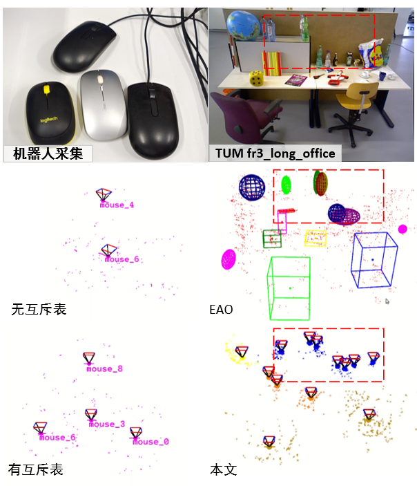

# 个人简介

个人主页：https://pxy.netlify.app/

Github：https://github.com/pengxinyi-up

CSDN：https://blog.csdn.net/qq_37372155

B站：https://space.bilibili.com/92855780

# 一、实习经历

海康威视(杭州总部)		萤石网络/SLAM算法工程师实习生		 				 2022.06-至今

**任务：**儿童陪护机器人RK3的SLAM模块预研工作等。

**工作1：**Rosbag与数据集格式互转工具，轨迹自动对齐接口，地图保存加载接口；

**工作2：**ORB-SLAM3工程化移植。如初始化和地图融合逻辑，室内场景的ORB字典；

**工作3：**地面单目视觉+IMU+轮速计融合定位。如IMU激励不足时的尺度问题，轮速计的融合问题；

# 二、硕士课题

硕士研究课题	《基于单目相机的物体级数据关联和变化检测系统》				 2020.09-2022.03

**背景：**轻量化应用场景下机器人语义感知和地图更新问题，稀疏点云的物体数据关联困难；

**内容：**基于ORB-SLAM2的单目物体级数据关联和变化检测方法，在Jetson Xavier上进行部署和[展示](https://www.bilibili.com/video/BV1mL4y1j7dV?spm_id_from=333.999.0.0)；

**结论：**性能方面优于同类方法，并且物体变化检测率达到了83.75%；

**成果：**基于[该课题](https://pxy.netlify.app/post/getting-started/)申请国家发明专利一项(实审阶段，公开号：CN113744397A)；

​			“兆易创新杯”第16届中国研究生电子设计竞赛华中赛区一等奖。

==视频展示==

视频链接：https://www.bilibili.com/video/BV1mL4y1j7dV?spm_id_from=333.999.0.0

**摘要**

稀疏点云地图由于缺乏足够物体信息，难以进行准确的物体数据关联，并且场景物体的变化会导致地图复用困难。本文面向轻量化的应用场景，基于单目相机提出了一种物体级数据关联和变化检测方法。该方法基于ORB特征追踪信息，引入语义信息并行地数据关联，提出互斥物体表提高数据关联的准确性。通过关键帧的共视关系，将物体的变化检测范围控制在局部空间以提高效率，进一步，利用秩和检验方法判断两个物体的相似性，保证变化检测的质量。方法在多个公共数据集和真实机器人上进行了广泛地测试。结果表明，数据关联在准确性和资源开销方面优于同类方法，并且物体变化检测率达到了83.75%。此外，本文实现了一个轻量化的机器人系统，帧率可达到20 FPS仅当使用一半的系统资源。本文的方法在物体的层面，确保了更新部位的一致性和完整性，实现了物体级地图的构建、检测和更新的统一，并达到轻量实时的性能。

## 1.系统概述

如图所示，系统主要有追踪模块、语义模块、数据关联、变化检测和地图更新五个模块。本文的主要贡献在于数据关联、变化检测和地图更新。

单目图像作为追踪模块和语义模块的输入。其中，追踪模块基于ORB-SLAM2，提取并追踪ORB特征点，三角化得到稀疏的点云地图。语义模块基于YOLOv3，它是一个轻量的物体检测网络，可以满足本文实时运行的要求。数据关联模块把追踪模块得到的地图点和语义模块得到的特征点语义标注结果进行关联融合，得到一个物体级地图。在地图复用的过程中，变化检测模块开启，识别到变化的物体并通过地图更新模块进行更新。

## 2.数据关联方法

### 2.1检测结果预处理

对于输入的每一帧RGB图像$I_t$，通过语义模块获取图像中物体标签$z^k_t=\left\{a^k_t,b^k_t,s^k_t\right\}$，$a$表示物体类别，$b$表示物体的边界框，$s$表示可信度。考虑到可信度低的同一物体容易在不同帧被判定为不同物体，在数据关联之前，首先丢弃了$s<\theta_s$的检测结果。另外为了保证物体标签对帧内特征点分类的唯一性，对剩余的物体边界进行了缩放。
对于属于同一帧图像的不同物体标签，重叠类形有12种。以其中一种为例，缩放方法如图所示，根据对角线和边长的相对大小有4种分离方案。

### 2.2 数据关联步骤

如图3所示，本文利用特征点的关联信息和地图点的空间信息，分三步进行数据关联。
步骤一：帧内特征点和地图点分类。根据$z^k_t$对每一帧对应的特征点和地图点进行标注。由于物体检测结果的局限性，同一物体在不同帧中可能被标记为不同物体类别，本文对同一地图点标记为不同类别的数量进行统计，选取最多数量的类别为该地图点分类。

步骤二：帧间物体地图点关联。首先计算当前帧物体地图点的形心，$c_i$表示当前帧第$i$个物体的形心，$c_j$表示全局物体中第$j$个与$c_i$同类的物体形心。$r_i$表示当前帧第$i$个物体的半径，$r_j$表示全局物体中第$j$个与$r_i$同类的物体半径。当$||c_i-c_j||_2$小于阈值$l_{ij}$时，认为是同一物体。对于有$N$个地图点的物体，$l_{ij}$的计算方法如下：
$$
l_{ij}=\lambda_{init}(r_i+r_j)
$$
其中$r_i$的计算方法如下，$r_j$同理。

其中为物体形心到该物体每个地图点的欧式距离，并对其升序排列，即取外围点的平均距离作为物体半径。

进一步的，由于当前帧的观测是已有地图信息的重复观测或新视角下的部分重复观测。因此根据当前帧地图点与已有物体地图点的重合度，对于满足空间位置条件的物体，判断该帧物体与已有物体的差异性。重合度的计算方法：对于当前帧有个地图点的物体，地图中已有同类物体个，为已有第个物体与中重合地图点的个数，如果，则，否则属于一个新物体。

步骤三：物体关联结果优化。考虑到一部分物体因为视角的变化过大可能被判定为新的物体，因此放宽物体的空间关系约束对步骤二的结果进行优化合并。此时取，对于满足空间关系的物体，根据本文提出的互斥物体表进行判断是否可以归并为同一个物体。

### 2.3 互斥物体表

互斥物体表记录了每帧每个物体的来源和每次物体关联的信息。如图4所示，、、表示不同物体，其中表示来自第个关键帧中第个物体。是来自中的关键帧，假设初始关键帧包含物体有，当、到来时，系统会根据上述方法进行关联。例如，是已经感知到的物体，由于，在同一帧中被判定为不同物体，因此存在互斥关系，这是一种鲁棒的判定，即使在后续观测中，和距离很近并满足空间条件，算法也不会将其判定为同一个物体。而对于，如果其与或满足空间条件则可以在步骤三中与或合并。算法会维护这个表，它会随着关键帧的增加不断扩展。

## 3.变化检测方法

### 3.1 检测方法

基于追踪模块中关键帧之间的两级共视关系，得到局部关键帧到如图5所示，局部物体是局部地图中存在的历史原有物体集合，活跃物体是局部地图中最近被观测到的物体。则消失的物体集合可以由局部物体与活跃物体集合的差集运算得到，定义为，仍能被观测到的原有的物体为，新增物体为。

进一步的，上述检测结果作为场景变化情况的一个初步评估，然后通过相似性检验以便得到更精确的变化评估。即是将和与具有三级共视关系的局部地图中物体进行相似性检验。

### 3.2 相似性检验

对于消失物体，原假设为，备择假设为。对于新增物体，原假设为，备择假设是。以新增物体为例，中物体A的地图点集，中物体B的地图点集，若和属于同一物体，则服从相同的分布，利用Wilcoxon秩和检验来验证原假设是否成立。

记混合样本，对样本升序排列并编秩，定义统计量，则有：

同理得到，其中，为混合样本的秩。服从高斯分布，其中：

 ，	

显著性水平为，若概率函数满足，则原假设成立，即，否则拒绝原假设，即。

## 4.实验与分析

### 4.1 实验设置

本文提出的方法在机器人平台和公共数据集上进行了广泛地评估，包括数据关联、变化检测和轻量性分析。如图6所示，机器人基于Kobuki轮式底盘，搭载了ZED双目相机和AGX Xavier ARM处理器。

机器人平台基于ROS框架完成算法的部署。单目RGB图像通过双目相机的左目相机和D435i相机获取，图像分辨率为1280*720，单目图像和物体检测结果通过ROS话题发布和订阅。物体检测算法基于yolov3的一个ROS功能包Darknet_ros。实验中使用物体检测权重yolov3.weights，可以检测到常见的80个物体类别。实验的部分参数设置如表1所示，物体检测与地图构建实时运行。

### 4.2 数据关联实验分析

4.2.1 检测结果预处理

图7 边界框缩放前后对比

边界框的缩放对比实验以公共数据集TUM fr3_long_office图像序列为例，该序列包含了大量可识别物体，且陈列密集的物体涵盖了大多数的边界框重叠类型。如图7所示，边界框经缩放后消除了其重叠情况，保证了单帧物体分类的准确性。缩放会不可避免的丢弃重叠区域的语义信息，这种信息会在不同视角下的多次观察中找回。

4.2.2 数据关联实验分析

 

图8 桌面物体数据关联地图

物体级地图的构成包括物体点云的类别标注和物体形心位置。基于桌面环境的一个数据关联效果如图8所示，在地图中根据颜色标识了地图点的语义类别，以及物体的位置与现实场景的映射关系。

特别地，距离相近的同类物体的数据关联对于利用空间信息进行物体数据关联的算法是具有挑战性的，为此在机器人自己采集的数据和公共数据集上分别进行了对比测试。

图9  同类相近物体的数据关联

|                    | [4]   | EAO   | 本文  |  |  |  |
| ------------------ | ----- | ----- | ----- | ------------------------------------------------------------ | ------------------------------------------------------------ | ------------------------------------------------------------ |
| **TUM**            |       |       |       |                                                              |                                                              |                                                              |
| fr1_desk           | -     | 14/16 | 18/16 | -                                                            | 12.50%                                                       | ***\*12.50%\****                                             |
| fr2_desk           | 11/15 | 22/23 | 19/23 | 26.67%                                                       | ***\*4.35%\****                                              | 17.39%                                                       |
| fr3_long_office    | 15/22 | 42/45 | 43/45 | 31.82%                                                       | 6.67%                                                        | ***\*4.44%\****                                              |
| fr3_teddy          | 2/3   | 6/7   | 7/7   | 33.33%                                                       | 14.29%                                                       | ***\*0.00%\****                                              |
| Chess              | 5/6   | 13/16 | 21/20 | 16.67%                                                       | 18.75%                                                       | ***\*5.00%\****                                              |
| **Microsoft RGBD** |       |       |       |                                                              |                                                              |                                                              |
| Fire               | 5/6   | 6/6   | 6/6   | 20.00%                                                       | 0.00%                                                        | ***\*0.00%\****                                              |
| Office             | 10/14 | 21/27 | 23/27 | 28.57%                                                       | 22.22%                                                       | ***\*14.81%\****                                             |
| Pumpkin            | 4/6   | 6/6   | 7/6   | 33.33%                                                       | ***\*0.00%\****                                              | 16.67%                                                       |
| Heads              | -     | 15/18 | 19/18 | -                                                            | 16.67%                                                       | ***\*5.56%\****                                              |
| 01                 | 5/7   | 7/8   | 9/8   | 28.57%                                                       | 12.50%                                                       | ***\*12.50%\****                                             |
| **Scenes V2**      |       |       |       |                                                              |                                                              |                                                              |
| 07                 | -     | 7/7   | 9/7   | -                                                            | ***\*0.00%\****                                              | 28.57%                                                       |
| 10                 | 6/8   | 7/7   | 5/5   | 25.00%                                                       | 0.00%                                                        | ***\*0.00%\****                                              |
| 13                 | 3/4   | 3/3   | 4/4   | 25.00%                                                       | 0.00%                                                        | ***\*0.00%\****                                              |
| 14                 | 4/4   | 5/6   | 7/7   | 0.00%                                                        | 16.67%                                                       | ***\*0.00%\****                                              |

如图9所示，由于互斥物体表的存在，距离很近的鼠标即使满足空间条件也不会被合并。在与EAO-SLAM[2]的对比示例中，距离较近的蓝色瓶子，由于类别一致物体具有相似的外观，易满足相同的概率分布容易被错误的关联在一起。而互斥物体表的存在，提高了关联的准确性。

进一步的，本文提出的数据关联方法在多个公共数据集上进行了对比测试。用表示场景中物体的真实数量，用相对误差作为评价指标。

结果（检测/GT）如表2所示，多个数据集的结果表明本文的方法能够在室内多种复杂场景下进行数据关联。在数据关联的准确性方面，本文的方法表现出较文[4]具有绝对优势，较EAO-SLAM具有更好的关联精度。误差来自粗糙的物体检测算法以及物体间的遮挡，比如碗、杯子和瓶子的相似性，在有更多物体的复杂场景下，难以与真值相等。

### 4.3 变化检测与地图更新实验分析

机器人首先得到初始地图，场景变化发生在机器人的视线之外，当机器人再次到达这个场景后，变化检测算法识别出场景中消失的物体。然后，地图更新模块对地图实现更新。在一个真实的场景建好的地图如图10（a）所示，当场景中的瓶子（编号6）和杯子（编号0）消失后，变化检测算法会对相应的物体地图点标记为黑色如图10（b）所示，在地图更新后，瓶子和杯子会从地图中删除如图10（c）所示，从而保证了地图中的物体与变化后的场景保持一致。

图10 地图更新
Fig.10 Map update

 图11 四个时段的桌面图像序列
Fig.11 A sequence of desktop images in four periods

| 参考序列                                                     | 检测序列                                                     | 结果                                                         |
| ------------------------------------------------------------ | ------------------------------------------------------------ | ------------------------------------------------------------ |
| C-S1 | C-S4 | backpack_0（TN）bottle_4（TP）bottle_15（TP）motorbike_2（TN） |
| C-S2 | C-S3 | backpack_0（TN）book_13（TP）bottle_11（TP）cup_4（FN）motorbike_2（TP） |
| C-S3 | C-S2 | backpack_12（TP）book_10（TN）bottle_13（FP）cup_4（TN）motorbike_2（TN） |
| C-S4 | C-S2 | backpack_0（TP）book_10（TP）bottle_5（FP）tvmonitor_6（TN） |

进一步的，另一个试验对一个桌面周围的物体进行了数天连续四次的记录如图11所示，分别记做C-S1、C-S2、C-S3、C-S4，数据量达18.3 GB。实验分为四组，每组选取一个序列作为参考的序列，任选另一组作为检测序列进行变化检测。

变化检测结果的分类方法如表3所示，定义变化检测的准确率为，平均准确率为。

|          | 实际新增 | 实际消失 |
| -------- | -------- | -------- |
| 检测新增 | TP       | FP       |
| 检测消失 | FN       | TN       |

实验结果如表4所示，四组实验分别为100%，80%，80%，75%，为83.75%。表明本文提出的变化检测方法可以对多数物体的变化情况进行判别。误差往往出现在物体被遮挡和物体检测算法不稳定的情况下，如第二组实验中的cup_4，第四组实验中bottle_13并没有在参考序列中被识别出来。上述试验结果表明，环境变化程度在追踪算法允许的范围内，本文采用的方法能够完成检测更新任务。

### 4.4 轻量性分析

**4.4.1 数据关联资源占用分析**

数据关联资源占用测试基于Precision 7920计算机，实验以TUM fr3_long_office图像序列前60 s为例，监测系统资源可以得到算法运行时CPU的占用率和内存使用情况。

图12 数据关联资源占用情况
Fig.12 Resource usage of data association

实验结果如图12所示，EAO算法的CPU占用率在8%左右，而本文的方法仅在5%左右，CPU占用率降低了约37.5%。内存开销会随着感知物体数量的增加而增加。在增长速率方面，本文的方法约为6 Mb/s，而EAO算法约为35 Mb/s，是本文的5.8倍。这源于利用共视关系，将比较的范围控制在了局部地图中，以及在数据关联中利用了形心空间距离信息作为先验信息，进一步缩小了比较范围。

**4.4.2 系统整体测试分析**

表5 系统整体测试评估
Tab.5 System overall test evaluation

系统整体测试评估以机器人为测试对象，图像分辨率为1920*1080，每帧提取2000个特征点，在Xavier的3种功耗7种模式下的建图阶段进行测试。其中CPU、GPU占用率为多核多个时刻的均值。在静息状态下，记录了系统内存监控软件和基本的内存开销情况。其中，MAXN1为静息模式，MAXN2为仅物体检测模式，MAXN3和其它都是建图模式。

从表5中可以得出，算力消耗主要在物体检测模块，其次是特征的提取追踪。在内核数量减少的情况下，帧率的限制主要在CPU。在GPU满负荷，帧率最高可达到50FPS。一般情况下，20FPS即可满足实时的需求。因此该系统满足机器人感知定位的同时仍有充足的算力满足上层应用的需求，进一步论证了本文算法的轻量性。

## 5 .结论

物体级地图可以帮助机器人更好的理解这个世界。本文基于单目相机提出了一种面向物体的数据关联和变化检测方法，解决机器人在轻量化应用需求下语义感知和地图更新问题。在物体的层面对地图进行更新，实现了以物体为中心的建图和更新的统一，将关联检测范围控制在局部地图中，提高了效率，可以在大场景下运行。通过大量的实验测试表明，基于本文数据关联方法，对于实现机器人在各种室内场景下实时感知表现出了优越性。而变化检测和地图更新的方法，有利于机器人在长期部署中保证地图的时效性。但是本文变化检测类型不够丰富，未来的工作将面向更长时间尺度的复杂场景和更多的变化检测类型。

# 三、本科毕设

本科毕业设计	《基于ROS的移动抓取服务机器人的设计与实现》	 			 2019.09-2020.04

**环境：**Linux+ROS系统，Gazebo仿真环境，RGB-D相机，Turtlebot2硬件平台，六轴机械臂；

**功能：**2D地图构建、语音导航规划、机械臂识别抓取等；

**成果：**获评校级优秀毕业论文，项目内容在[CSDN](https://blog.csdn.net/qq_37372155/category_9650566.html)获得1万+访问量，并在[GitHub](https://github.com/pengxinyi-up/mobile-grab-Robot)开源代码。

视频链接：https://www.bilibili.com/video/BV1WK4y147Rw?spm_id_from=333.999.0.0&vd_source=b9c24c3e5b869abfd85c6c7ba1f9525d

## 1.系统概述

近年来，人工智能技术的发展推动了机器人的智能化进程，清洁、配送、陪护等服务机器人给人们生活带来的便利正在普及。人类的眼睛和手臂配合可以完成复杂的抓取行为。同理，视觉传感器能帮助机器人捕获丰富的环境信息，机械臂可以完成类人的抓取任务。因此本课题基于RGB-D深度视觉和开源的ROS系统，开展移动抓取机器人的仿真环境和软硬件的设计与实现，主要分为建图导航和机械臂的识别抓取两部分。

首先，基于D-H参数建立了机器人的模型并在RVIZ下可视化，基于Ros_control配置了底盘的差速控制器和机械臂的关节位置控制器，在Gazebo仿真平台建立了机器人的物理仿真模型和演示场景。

在建图导航部分，基于Kobuki底盘和Kinect v1深度相机搭建了移动导航平台，借助ROS Navigation导航框架，利用Gmapping功能包和Amcl功能包完成SLAM任务，利用Move_base功能包基于Dijkstra算法和DWA算法完成导航任务。

在识别抓取部分，在底盘上搭载了一台六自由度机械臂，Arduino UNO微处理器和PCA9685驱动作为机械臂的控制硬件，利用Find_object_3d功能包基于oFast和rBRIEF算法完成目标的识别定位，使用MoveIt配置助手通过Trac_ik插件基于牛顿收敛法和SQP方法完成了机械臂的逆运动学规划。

最后，在仿真环境下进行了综合演示实验，结合人脸身份认证和语音指令导航，机器人能够完成移动抓取任务。并且针对建图定位偏移、抓取规划不稳定等问题，提出了硬件结构和规划方法的改进方向，通过抓取改进实验减少了机械臂与场景的碰撞。

## 2.仿真平台

为了方便后续的硬件调试，首先进行系统仿真，提前发现问题，完善系统，减少硬件消耗。ROS提供了RVIZ数据展示界面和Gazebo仿真环境，RVIZ可用于数据的3D可视化显示；Gazebo则用于模拟真实的物理环境，能够逼真的模拟室内或室外环境和各类传感器数据，并且提供了丰富的用户程序接口。RVIZ中的URDF机器人模型加入物理属性便可以在Gazebo中使用。Ros_control是机器人硬件连接上层应用的中间控制件，提供了一系列力、位置、速度等控制接口用于上层应用的落地。

## 3.硬件平台

控制设备主要分为工作站（上位机）和上网本（下位机），两者之间通过WiFi路由通信。工作站作为整个系统的控制中心，接收来自上网本采集到的数据信息，并把运算结果反馈给机器人端的笔记本。下位机与机械臂相连，作为中继接收上位机的机械臂控制命令并发送给Arduino控制板，控制板再把机械臂的控制信号发送给PCA9685驱动板，驱动板最终来直接驱动机械臂完成抓取操作。下位机还与Kobuki底盘相连，作为移动底盘的控制中心，下位机同时与Kinect相机连接，驱动相机并接收相机的图像发送给上位机。

## 4.软件平台

机器人整体的控制系统框架如图所示，主要分为上层操作系统、中层驱动和底层硬件。

操作系统层位于上位机电脑中，上位机基于Linux内核安装了的Ubuntu操作系统，基于ROS框架主要完成三个任务，分别是SLAM导航定位、RGB-D识别定位和机械臂运动规划。SLAM导航规划基于ROS的Navigation框架，通过Amcl和Move_base分别完成定位和导航任务；物体识别定位基于Find_object_3d功能包对RGB-D图像进行处理，通过特征匹配的方法完成目标物体的识别和定位；机械臂运动规划基于MoveIt框架对机械臂进行模型配置，通过Trac_ik方法对机械臂进行运动学求解。此外，上位机还负责语音识别和人脸识别人机交互任务，Rqt和RVIZ是ROS中用到的图形化显示工具。

驱动层主要负责传感器的驱动和底层的控制任务，可以分为上位机驱动层和下位机驱动层两个部分。上位机驱动层包括基于Ubuntu系统的麦克风数据采集和摄像头数据采集，用于在远程控制端的人机交互；下位机的驱动层同样基于Ubuntu系统，提供硬件接口，负责Kinect深度相机的数据采集、Kobuki底盘运动控制和数据的反馈等。

硬件层通过USB数据线与驱动层联通，包括Kinect相机、机械臂和Kobuki底盘。其中，机械臂包括机械臂本体和包括Arduino和PCA9685在内的控制驱动电路。

仿真环境下，Ros_control作为运动控制插件，提供底盘的差速控制和机械臂关节的位置控制。Gazebo模拟传感器数据和仿真场景。

## 5.演示实验

第一部分：首先启动各项硬件设备和功能节点，机器人识别到主人身份后即可下达语音命令，然后机器人根据语音指令自主导航到命令位置。

第二部分：到达目标位置后，机器人对目标物进行识别定位，然后机器人启动机械臂对目标抓取，至此完成整个演示内容。

### 5.1 人脸认证与语音指令

人脸认证基于face_recognition功能包。具体步骤下图所示，首先启动Fclient和Fserver，Fclient客户端通过话题方式发布指令，服务端订阅话题采集样本，Haar特征分类器训练人脸样本、识别身份。黑色虚线框内容为首次使用时进行的步骤，采集过样本以后可直接进行人脸识别。

从左到右分别是识别到熟人（训练过样本）、陌生人（没有添加样本）、没有人脸三种情况效果图。

语音命令识别基于讯飞开放平台，申请项目后便可生成个性化的功能包。基于功能包便开展了语音命令识别的应用，如图5.5所示，首先发布话题唤醒语音识别、语音助手和语音合成三个语音功能节点，等待发布语音命令，为接下来的导航演示指定目的地做准备。

### 5.2 建图导航

建图实验和导航避障演示的流程如图5.6所示，首先启动底盘，发布里程计信息，准备建图，然后启动Gmapping并打开RVIZ可视化界面，在上位机使用键盘遥控机器人移动遍历环境、建立地图，如果建立好地图可略过虚线框建图环节直接进入导航部分。导航过程首先启动导航节点，等待语音命令，接收到目标位置后便可规划路径驶向目标位置，期间放置行人到路径上作为障碍，最终到达目标位置完成导航避障任务。

建图

语音导航

### 5.3 识别抓取

物体识别抓取实验的流程图如图5.14所示，首先启动机械臂驱动，初始化机械臂的位置，此时机械臂处于收缩状态位于移动底盘前方，以免遮挡相机视线。然后启动目标识别Find_object_3d节点，选取待抓取的物体，随即生成物体的位姿并发布tf坐标，最后启动运动规划节点，Move_group作为场景规划的监听控制核心，把机械臂的控制命令发送给机械臂驱动模块，如果机械臂收回而目标没有被成功抓获，会重新执行识别-规划-抓取步骤，最终抓到目标完成整个实验。

## 6.总结展望

### 6.1总结

本文针对移动服务机器人，基于深度传感器获取的RGB-D图像，开展了建图导航和识别抓取等机器人重要功能的设计与实现。借助强大的机器人开发平台ROS，在仿真环境下完整设计并实现了机器人的移动抓取功能，仿真实验的总结分析为后续改进真实的机器人具有重要的指导意义。

本课题的主要成果和收获如下：

（1）建立了机器人模型和仿真环境。基于D-H参数法用Xacro文件格式描述了机器人模型，并基于Ros_Control配置了机器人在仿真环境下的运动控制插件。在Gazebo仿真环境下建立了两种模拟场景。

（2）设计了机器人系统的硬件平台。根据仿真环境的设计，基于Kobuki底座和Kinect v1搭建了机器人的移动平台，并自主设计了一台六轴机械臂，用3D打印机打印了末端夹爪，基于Arduino UNO微处理器完成机械臂的驱动任务。实现了上位机远端控制与机器人下位机的分布控制。

（3）设计了机器人系统的软件平台。基于ROS开源的Navigation导航、MoveIt助手和Find_object_3d功能包完成了机器人的建图导航、运动规划、目标识别等任务。并结合OpenCV库和讯飞开放平台提供的SDK赋予机器人初级的人机交互功能。

（4）设计了演示实验验证了系统功能，同时也发现当前设计的不足之处。针对在实验中暴露的定位误差、运动规划失败等问题做出了分析，并给出了多传感器融合、改进结构、提升算法等几点展望。

（5）初步学会了使用ROS。得益于ROS良好的机器人研发生态，对机器人研究设计的重点内容均有涉猎，锻炼了自己解决问题能力，提升了对机器人研究的认识，为以后的针对性研究做了铺垫。

由于受疫情的影响，在校期间机器人硬件平台已经搭建完毕，遗憾的是没有机会完成真实机器人的演示实验。

### 6.2展望

建图导航、机械臂规划求解是移动抓取机器人研究的重要内容，人机交互、人机协作又是服务机器人智能程度的重要体现。因此机器人系统复杂，涉及的学科广泛，由于本人时间不够充分和当前知识体量不足，还有许多需要改进的地方：

（1）多传感器融合

依靠单一深度相机，在目标识别方面能够获取丰富的环境信息，但是作为SLAM传感器，与激光雷达相比深度相机存在精度不足和有效测距距离较近的问题，同时红外光易受环境因素影响，视角有限。两款传感器结合互为补充能够提升性能，但是面对近距离的障碍，还需要小单位的超声波模块作为近身障碍的辅助检测，提高定位避障的鲁棒性。多传感器还可以减轻对单一传感器的位置约束，深度相机可以放置在更加适合目标识别的位置。

（2）机械臂结构

在真实机械臂的设计时，限于机械臂的驱动方式，机械臂的负载很小，充当连杆的连接件可以考虑更轻盈的材料。机械臂连杆长度、自由度的分布和各关节的转动方式对后期运动规划有着重要影响，这些需要进一步明确。末端工具过于简易，只能抓取特定形状的物品，而实际情况下，物品种类繁多，形状各异，考虑更换为具有触觉的灵巧手。

（3）识别定位

在目标识别方面，基于二维图像的特征匹配和深度信息结合的位姿识别，基于单张图像提取的特征有限，只能识别特定条件下的目标，而完全基于点云图像的处理，对本地计算资源就提出了更高的要求。应充分利用二维彩色图像的丰富纹理信息，且有较为成熟的处理方法，又要结合深度图像的独特的曲面信息。

（4）规划抓取

通过实验发现，影响成功抓取的因素很多。首先考虑更换运动学求解方法，根据具体的机械臂结构针对性的生成解析解。其次，当传感器能够时刻捕捉到目标的位姿和计算出末端工具的位姿，即使目标位置在动态变化，也能够逐步引导末端工具到达目标位置就能提升抓取成功率。最后，机械臂的工作空间有限，而移动底盘虽然可以把机械臂带到目标附近，但是这两者的规划是分离的，如果同时考虑机械臂的规划和机器人位置的规划，或许可以应对更加复杂的抓取任务。

