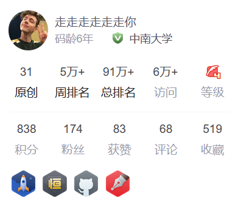

# 个人简介

个人主页：https://pxy.netlify.app/

Github：https://github.com/pengxinyi-up

CSDN：https://blog.csdn.net/qq_37372155

B站：https://space.bilibili.com/92855780

# 实习经历

海康威视(杭州总部)		萤石网络/SLAM算法工程师实习生		 				 2022.06-至今

**任务：**儿童陪护机器人RK3的SLAM模块预研工作等。

**工作1：**Rosbag与数据集格式互转工具，轨迹自动对齐接口，地图保存加载接口；

**工作2：**ORB-SLAM3工程化移植。如初始化和地图融合逻辑，室内场景的ORB字典；

**工作3：**地面单目视觉+IMU+轮速计融合定位。如IMU激励不足时的尺度问题，轮速计的融合问题；

# 硕士课题

硕士研究课题	《基于单目相机的物体级数据关联和变化检测系统》				 2020.09-2022.03

**背景：**轻量化应用场景下机器人语义感知和地图更新问题，稀疏点云的物体数据关联困难；

**内容：**基于ORB-SLAM2的单目物体级数据关联和变化检测方法，在Jetson Xavier上进行部署和[展示](https://www.bilibili.com/video/BV1mL4y1j7dV?spm_id_from=333.999.0.0)；

**结论：**性能方面优于同类方法，并且物体变化检测率达到了83.75%；

**成果：**基于[该课题](https://pxy.netlify.app/post/getting-started/)申请国家发明专利一项(实审阶段，公开号：CN113744397A)；

​			“兆易创新杯”第16届中国研究生电子设计竞赛华中赛区一等奖。

==视频展示==

视频链接：https://www.bilibili.com/video/BV1mL4y1j7dV?spm_id_from=333.999.0.0

**摘要**

稀疏点云地图由于缺乏足够物体信息，难以进行准确的物体数据关联，并且场景物体的变化会导致地图复用困难。本文面向轻量化的应用场景，基于单目相机提出了一种物体级数据关联和变化检测方法。该方法基于ORB特征追踪信息，引入语义信息并行地数据关联，提出互斥物体表提高数据关联的准确性。通过关键帧的共视关系，将物体的变化检测范围控制在局部空间以提高效率，进一步，利用秩和检验方法判断两个物体的相似性，保证变化检测的质量。方法在多个公共数据集和真实机器人上进行了广泛地测试。结果表明，数据关联在准确性和资源开销方面优于同类方法，并且物体变化检测率达到了83.75%。此外，本文实现了一个轻量化的机器人系统，帧率可达到20 FPS仅当使用一半的系统资源。本文的方法在物体的层面，确保了更新部位的一致性和完整性，实现了物体级地图的构建、检测和更新的统一，并达到轻量实时的性能。

## 1.系统概述

如图所示，系统主要有追踪模块、语义模块、数据关联、变化检测和地图更新五个模块。本文的主要贡献在于数据关联、变化检测和地图更新。

单目图像作为追踪模块和语义模块的输入。其中，追踪模块基于ORB-SLAM2，提取并追踪ORB特征点，三角化得到稀疏的点云地图。语义模块基于YOLOv3，它是一个轻量的物体检测网络，可以满足本文实时运行的要求。数据关联模块把追踪模块得到的地图点和语义模块得到的特征点语义标注结果进行关联融合，得到一个物体级地图。在地图复用的过程中，变化检测模块开启，识别到变化的物体并通过地图更新模块进行更新。

## 2.数据关联方法

### 2.1检测结果预处理

对于输入的每一帧RGB图像$I_t$，通过语义模块获取图像中物体标签$z^k_t=\left\{a^k_t,b^k_t,s^k_t\right\}$，$a$表示物体类别，$b$表示物体的边界框，$s$表示可信度。考虑到可信度低的同一物体容易在不同帧被判定为不同物体，在数据关联之前，首先丢弃了$s<\theta_s$的检测结果。另外为了保证物体标签对帧内特征点分类的唯一性，对剩余的物体边界进行了缩放。
对于属于同一帧图像的不同物体标签，重叠类形有12种。以其中一种为例，缩放方法如图所示，根据对角线和边长的相对大小有4种分离方案。

### 2.2 数据关联步骤

如图3所示，本文利用特征点的关联信息和地图点的空间信息，分三步进行数据关联。
步骤一：帧内特征点和地图点分类。根据$z^k_t$对每一帧对应的特征点和地图点进行标注。由于物体检测结果的局限性，同一物体在不同帧中可能被标记为不同物体类别，本文对同一地图点标记为不同类别的数量进行统计，选取最多数量的类别为该地图点分类。

步骤二：帧间物体地图点关联。首先计算当前帧物体地图点的形心，$c_i$表示当前帧第$i$个物体的形心，$c_j$表示全局物体中第$j$个与$c_i$同类的物体形心。$r_i$表示当前帧第$i$个物体的半径，$r_j$表示全局物体中第$j$个与$r_i$同类的物体半径。当$||c_i-c_j||_2$小于阈值$l_{ij}$时，认为是同一物体。对于有$N$个地图点的物体，$l_{ij}$的计算方法如下：
$$
l_{ij}=\lambda_{init}(r_i+r_j)
$$
其中$r_i$的计算方法如下，$r_j$同理。

其中为物体形心到该物体每个地图点的欧式距离，并对其升序排列，即取外围点的平均距离作为物体半径。

进一步的，由于当前帧的观测是已有地图信息的重复观测或新视角下的部分重复观测。因此根据当前帧地图点与已有物体地图点的重合度，对于满足空间位置条件的物体，判断该帧物体与已有物体的差异性。重合度的计算方法：对于当前帧有个地图点的物体，地图中已有同类物体个，为已有第个物体与中重合地图点的个数，如果，则，否则属于一个新物体。

步骤三：物体关联结果优化。考虑到一部分物体因为视角的变化过大可能被判定为新的物体，因此放宽物体的空间关系约束对步骤二的结果进行优化合并。此时取，对于满足空间关系的物体，根据本文提出的互斥物体表进行判断是否可以归并为同一个物体。

### 2.3 互斥物体表

互斥物体表记录了每帧每个物体的来源和每次物体关联的信息。如图4所示，、、表示不同物体，其中表示来自第个关键帧中第个物体。是来自中的关键帧，假设初始关键帧包含物体有，当、到来时，系统会根据上述方法进行关联。例如，是已经感知到的物体，由于，在同一帧中被判定为不同物体，因此存在互斥关系，这是一种鲁棒的判定，即使在后续观测中，和距离很近并满足空间条件，算法也不会将其判定为同一个物体。而对于，如果其与或满足空间条件则可以在步骤三中与或合并。算法会维护这个表，它会随着关键帧的增加不断扩展。

## 3.变化检测方法

### 3.1 检测方法

基于追踪模块中关键帧之间的两级共视关系，得到局部关键帧到如图5所示，局部物体是局部地图中存在的历史原有物体集合，活跃物体是局部地图中最近被观测到的物体。则消失的物体集合可以由局部物体与活跃物体集合的差集运算得到，定义为，仍能被观测到的原有的物体为，新增物体为。

进一步的，上述检测结果作为场景变化情况的一个初步评估，然后通过相似性检验以便得到更精确的变化评估。即是将和与具有三级共视关系的局部地图中物体进行相似性检验。

### 3.2 相似性检验

对于消失物体，原假设为，备择假设为。对于新增物体，原假设为，备择假设是。以新增物体为例，中物体A的地图点集，中物体B的地图点集，若和属于同一物体，则服从相同的分布，利用Wilcoxon秩和检验来验证原假设是否成立。

记混合样本，对样本升序排列并编秩，定义统计量，则有：

同理得到，其中，为混合样本的秩。服从高斯分布，其中：

 ，	

显著性水平为，若概率函数满足，则原假设成立，即，否则拒绝原假设，即。

## 4.实验与分析

### 4.1 实验设置

本文提出的方法在机器人平台和公共数据集上进行了广泛地评估，包括数据关联、变化检测和轻量性分析。如图6所示，机器人基于Kobuki轮式底盘，搭载了ZED双目相机和AGX Xavier ARM处理器。

机器人平台基于ROS框架完成算法的部署。单目RGB图像通过双目相机的左目相机和D435i相机获取，图像分辨率为1280*720，单目图像和物体检测结果通过ROS话题发布和订阅。物体检测算法基于yolov3的一个ROS功能包Darknet_ros。实验中使用物体检测权重yolov3.weights，可以检测到常见的80个物体类别。实验的部分参数设置如表1所示，物体检测与地图构建实时运行。

### 4.2 数据关联实验分析

4.2.1 检测结果预处理

图7 边界框缩放前后对比

边界框的缩放对比实验以公共数据集TUM fr3_long_office图像序列为例，该序列包含了大量可识别物体，且陈列密集的物体涵盖了大多数的边界框重叠类型。如图7所示，边界框经缩放后消除了其重叠情况，保证了单帧物体分类的准确性。缩放会不可避免的丢弃重叠区域的语义信息，这种信息会在不同视角下的多次观察中找回。

4.2.2 数据关联实验分析

 

图8 桌面物体数据关联地图

物体级地图的构成包括物体点云的类别标注和物体形心位置。基于桌面环境的一个数据关联效果如图8所示，在地图中根据颜色标识了地图点的语义类别，以及物体的位置与现实场景的映射关系。

特别地，距离相近的同类物体的数据关联对于利用空间信息进行物体数据关联的算法是具有挑战性的，为此在机器人自己采集的数据和公共数据集上分别进行了对比测试。

图9  同类相近物体的数据关联

|                    | [4]   | EAO   | 本文  |  |  |  |
| ------------------ | ----- | ----- | ----- | ------------------------------------------------------------ | ------------------------------------------------------------ | ------------------------------------------------------------ |
| **TUM**            |       |       |       |                                                              |                                                              |                                                              |
| fr1_desk           | -     | 14/16 | 18/16 | -                                                            | 12.50%                                                       | ***\*12.50%\****                                             |
| fr2_desk           | 11/15 | 22/23 | 19/23 | 26.67%                                                       | ***\*4.35%\****                                              | 17.39%                                                       |
| fr3_long_office    | 15/22 | 42/45 | 43/45 | 31.82%                                                       | 6.67%                                                        | ***\*4.44%\****                                              |
| fr3_teddy          | 2/3   | 6/7   | 7/7   | 33.33%                                                       | 14.29%                                                       | ***\*0.00%\****                                              |
| Chess              | 5/6   | 13/16 | 21/20 | 16.67%                                                       | 18.75%                                                       | ***\*5.00%\****                                              |
| **Microsoft RGBD** |       |       |       |                                                              |                                                              |                                                              |
| Fire               | 5/6   | 6/6   | 6/6   | 20.00%                                                       | 0.00%                                                        | ***\*0.00%\****                                              |
| Office             | 10/14 | 21/27 | 23/27 | 28.57%                                                       | 22.22%                                                       | ***\*14.81%\****                                             |
| Pumpkin            | 4/6   | 6/6   | 7/6   | 33.33%                                                       | ***\*0.00%\****                                              | 16.67%                                                       |
| Heads              | -     | 15/18 | 19/18 | -                                                            | 16.67%                                                       | ***\*5.56%\****                                              |
| 01                 | 5/7   | 7/8   | 9/8   | 28.57%                                                       | 12.50%                                                       | ***\*12.50%\****                                             |
| **Scenes V2**      |       |       |       |                                                              |                                                              |                                                              |
| 07                 | -     | 7/7   | 9/7   | -                                                            | ***\*0.00%\****                                              | 28.57%                                                       |
| 10                 | 6/8   | 7/7   | 5/5   | 25.00%                                                       | 0.00%                                                        | ***\*0.00%\****                                              |
| 13                 | 3/4   | 3/3   | 4/4   | 25.00%                                                       | 0.00%                                                        | ***\*0.00%\****                                              |
| 14                 | 4/4   | 5/6   | 7/7   | 0.00%                                                        | 16.67%                                                       | ***\*0.00%\****                                              |

如图9所示，由于互斥物体表的存在，距离很近的鼠标即使满足空间条件也不会被合并。在与EAO-SLAM[2]的对比示例中，距离较近的蓝色瓶子，由于类别一致物体具有相似的外观，易满足相同的概率分布容易被错误的关联在一起。而互斥物体表的存在，提高了关联的准确性。

进一步的，本文提出的数据关联方法在多个公共数据集上进行了对比测试。用表示场景中物体的真实数量，用相对误差作为评价指标。

结果（检测/GT）如表2所示，多个数据集的结果表明本文的方法能够在室内多种复杂场景下进行数据关联。在数据关联的准确性方面，本文的方法表现出较文[4]具有绝对优势，较EAO-SLAM具有更好的关联精度。误差来自粗糙的物体检测算法以及物体间的遮挡，比如碗、杯子和瓶子的相似性，在有更多物体的复杂场景下，难以与真值相等。

### 4.3 变化检测与地图更新实验分析

机器人首先得到初始地图，场景变化发生在机器人的视线之外，当机器人再次到达这个场景后，变化检测算法识别出场景中消失的物体。然后，地图更新模块对地图实现更新。在一个真实的场景建好的地图如图10（a）所示，当场景中的瓶子（编号6）和杯子（编号0）消失后，变化检测算法会对相应的物体地图点标记为黑色如图10（b）所示，在地图更新后，瓶子和杯子会从地图中删除如图10（c）所示，从而保证了地图中的物体与变化后的场景保持一致。

图10 地图更新
Fig.10 Map update

 图11 四个时段的桌面图像序列
Fig.11 A sequence of desktop images in four periods

| 参考序列                                                     | 检测序列                                                     | 结果                                                         |
| ------------------------------------------------------------ | ------------------------------------------------------------ | ------------------------------------------------------------ |
| C-S1 | C-S4 | backpack_0（TN）bottle_4（TP）bottle_15（TP）motorbike_2（TN） |
| C-S2 | C-S3 | backpack_0（TN）book_13（TP）bottle_11（TP）cup_4（FN）motorbike_2（TP） |
| C-S3 | C-S2 | backpack_12（TP）book_10（TN）bottle_13（FP）cup_4（TN）motorbike_2（TN） |
| C-S4 | C-S2 | backpack_0（TP）book_10（TP）bottle_5（FP）tvmonitor_6（TN） |

进一步的，另一个试验对一个桌面周围的物体进行了数天连续四次的记录如图11所示，分别记做C-S1、C-S2、C-S3、C-S4，数据量达18.3 GB。实验分为四组，每组选取一个序列作为参考的序列，任选另一组作为检测序列进行变化检测。

变化检测结果的分类方法如表3所示，定义变化检测的准确率为，平均准确率为。

|          | 实际新增 | 实际消失 |
| -------- | -------- | -------- |
| 检测新增 | TP       | FP       |
| 检测消失 | FN       | TN       |

实验结果如表4所示，四组实验分别为100%，80%，80%，75%，为83.75%。表明本文提出的变化检测方法可以对多数物体的变化情况进行判别。误差往往出现在物体被遮挡和物体检测算法不稳定的情况下，如第二组实验中的cup_4，第四组实验中bottle_13并没有在参考序列中被识别出来。上述试验结果表明，环境变化程度在追踪算法允许的范围内，本文采用的方法能够完成检测更新任务。

### 4.4 轻量性分析

**4.4.1 数据关联资源占用分析**

数据关联资源占用测试基于Precision 7920计算机，实验以TUM fr3_long_office图像序列前60 s为例，监测系统资源可以得到算法运行时CPU的占用率和内存使用情况。

图12 数据关联资源占用情况
Fig.12 Resource usage of data association

实验结果如图12所示，EAO算法的CPU占用率在8%左右，而本文的方法仅在5%左右，CPU占用率降低了约37.5%。内存开销会随着感知物体数量的增加而增加。在增长速率方面，本文的方法约为6 Mb/s，而EAO算法约为35 Mb/s，是本文的5.8倍。这源于利用共视关系，将比较的范围控制在了局部地图中，以及在数据关联中利用了形心空间距离信息作为先验信息，进一步缩小了比较范围。

**4.4.2 系统整体测试分析**

表5 系统整体测试评估
Tab.5 System overall test evaluation

系统整体测试评估以机器人为测试对象，图像分辨率为1920*1080，每帧提取2000个特征点，在Xavier的3种功耗7种模式下的建图阶段进行测试。其中CPU、GPU占用率为多核多个时刻的均值。在静息状态下，记录了系统内存监控软件和基本的内存开销情况。其中，MAXN1为静息模式，MAXN2为仅物体检测模式，MAXN3和其它都是建图模式。

从表5中可以得出，算力消耗主要在物体检测模块，其次是特征的提取追踪。在内核数量减少的情况下，帧率的限制主要在CPU。在GPU满负荷，帧率最高可达到50FPS。一般情况下，20FPS即可满足实时的需求。因此该系统满足机器人感知定位的同时仍有充足的算力满足上层应用的需求，进一步论证了本文算法的轻量性。

## 5 .结论

物体级地图可以帮助机器人更好的理解这个世界。本文基于单目相机提出了一种面向物体的数据关联和变化检测方法，解决机器人在轻量化应用需求下语义感知和地图更新问题。在物体的层面对地图进行更新，实现了以物体为中心的建图和更新的统一，将关联检测范围控制在局部地图中，提高了效率，可以在大场景下运行。通过大量的实验测试表明，基于本文数据关联方法，对于实现机器人在各种室内场景下实时感知表现出了优越性。而变化检测和地图更新的方法，有利于机器人在长期部署中保证地图的时效性。但是本文变化检测类型不够丰富，未来的工作将面向更长时间尺度的复杂场景和更多的变化检测类型。

# 本科毕设

本科毕业设计	《基于ROS的移动抓取服务机器人的设计与实现》	 			 2019.09-2020.04

**环境：**Linux+ROS系统，Gazebo仿真环境，RGB-D相机，Turtlebot2硬件平台，六轴机械臂；

**功能：**2D地图构建、语音导航规划、机械臂识别抓取等；

**成果：**获评校级优秀毕业论文，项目内容在[CSDN](https://blog.csdn.net/qq_37372155/category_9650566.html)获得1万+访问量，并在[GitHub](https://github.com/pengxinyi-up/mobile-grab-Robot)开源代码。

视频链接：https://www.bilibili.com/video/BV1WK4y147Rw?spm_id_from=333.999.0.0&vd_source=b9c24c3e5b869abfd85c6c7ba1f9525d

